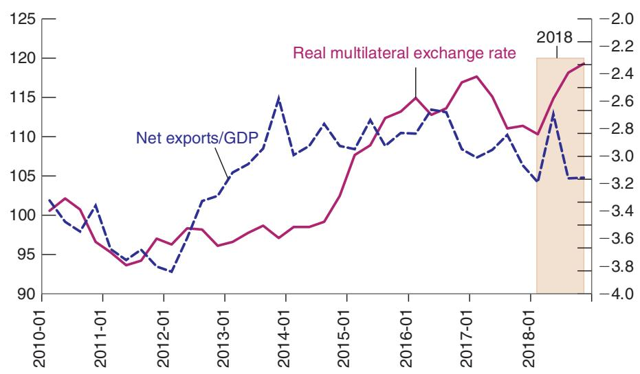

# US Trade Deficits and Trump Administration Trade Tariffs

One of the themes of President Trump’s 2016 campaign was that the US trade deficit, which stood at 2.7% of GDP at the time, had to be reduced. He saw the trade deficit as an indication that foreign countries, China in particular, were taking advantage of the United States. In 2018, following up on this promise, the Trump administration increased tariffs on solar panels, then on steel and aluminum imports, and then on a range of Chinese goods.

Most economists disagreed with both the diagnosis and the method.

About the diagnosis: Most economists saw the trade deficits as reflecting chronically low US saving relative to investment, together with the willingness of foreigners to lend to the United States, allowing for the deficits to be easily financed through foreign borrowing. Thus, they argued, trade deficits reflected a US problem and had to be solved by increasing domestic saving, private or public. Some economists went further and argued that the origin of the trade deficit was actually the attractiveness of US assets. Foreigners were eager to hold US assets, and this foreign demand led to dollar appreciation, decreasing in turn the relative competitiveness of US goods and leading to the trade deficit. (You may want to return to the discussion of the relation between trade deficits, saving, and investment in Section 18-5.) Thus, these economists argued, the trade deficit reflected the financial strength of the United States and was not particularly worrisome.

About the method: Economists argued that, if the origin of the trade deficit lay in low US saving or in the attractiveness of US assets, tariffs were unlikely to work. Let’s see why.

At a given exchange rate, an increase in tariffs increases the price of imports for US consumers. How much depends on what foreign firms do in reaction to the tariff:

They can decrease their pre-tariff price, in which case the price facing US consumers increases by less than the tariff. They can even decrease the pre-tariff price enough that the price facing US consumers does not change. In this case, the volume of imports may not change, but how much the United States pays for imports (the pre-tariff price) goes down, so the value of imports in terms of domestic goods decreases.

Or they can instead keep the same pre-tariff price, in which case the price facing US consumers increases by the increase in the tariff, and the demand for imports is then likely to decrease. In this case, the price that the United States pays for imports does not change, but the volume of imports decreases, leading again to a decrease in the value of imports.

In both cases, at a given nominal exchange rate, the value of imports in terms of domestic goods decreases. Given exports, this implies a smaller trade deficit. (There is a difference, however, in terms of who pays for the tariffs. In the first case, the foreign firms pay; in the second case, the US consumers pay.) The smaller trade deficit leads to an increase in demand and an increase in output. It all seems to work. So why were the economists skeptical that the tariffs would not reduce the trade deficit?

For four reasons:

To the extent that it triggered a tariff war, and other countries responded by raising tariffs on US goods, US exports might decrease in line with the decrease in US imports, leading to no change in the trade deficit. And, indeed, in response to US tariffs, China increased tariffs on US goods in late 2018.

To the extent that the US economy was close to potential, as was indeed the case in 2018, an increase in output might lead to overheating and thus force the Fed to increase the interest rate. This in turn would lead to a dollar appreciation (remember the interest parity condition), partially cancelling the effects of the tariffs on net exports.

Even if the Fed did not increase the interest rate, expectations of a lower trade deficit and thus a smaller need for foreign borrowing, now and in the future, may lead to an appreciation of the dollar, again partially offsetting the effects of the tariffs on net exports.

Finally, while it was increasing tariffs, the Trump administration also implemented a tax reform passed in 2017, which led to a large increase in the fiscal deficit in 2018. As we saw in this chapter, a larger fiscal deficit is likely to lead to a larger trade deficit: If the Fed did not intervene, the fiscal deficit would lead to larger output and higher imports. If the Fed intervened to limit the increase in output, the increase in interest rates would lead to a dollar appreciation, and, again, to a larger trade deficit. In either case, fiscal policy was likely to offset or even dominate the effects of tariffs on the trade balance.

What happened? At the time of writing, it is too early to draw strong conclusions. Trade negotiations are still going on. It takes time for exporters and importers to react to tariffs and exchange rate movements. So far, however, the evidence is on the side of the economists. This is shown in Figure 1, which plots the evolution of the ratio of net exports to GDP and of the real exchange rate (normalized to 100 in 2010), quarterly, since 2010.

The shaded area corresponds to the four quarters of 2018. Since the beginning of 2018, the real exchange rate (left-hand vertical axis) has increased by close to 9%.

  
Figure 1

Source: FRED: NETEXP, GDP, RBUSBIS

The trade deficit (right-hand vertical axis) is roughly the same as it was at the beginning of 2018, around 3% of GDP. For the moment, things have not moved in the direction the

Trump administration hoped for. (What would you do if you wanted to reduce the US trade deficit while keeping output at potential?)

## 19-5 FIXED EXCHANGE RATES

We have assumed so far that the central bank chose the interest rate and let the exchange rate adjust freely in whatever manner was implied by equilibrium in the foreign exchange market. In many countries, this assumption does not reflect reality. Central banks act under implicit or explicit exchange rate targets and use monetary policy to achieve those targets. The targets are sometimes implicit, sometimes explicit; they are sometimes specific values, sometimes bands or ranges. These exchange rate arrangements (or regimes, as they are called) come under many names. Let’s first see what the names mean.

## Pegs, Crawling Pegs, Bands, the EMS, and the Euro

At one end of the spectrum are countries with flexible exchange rates such as the United States, the United Kingdom, Japan, and Canada. These countries have no explicit exchange rate targets. Although their central banks do not ignore movements in the exchange rate, they have shown themselves quite willing to let their exchange rates fluctuate considerably.

At the other end are countries that operate under fixed exchange rates. They maintain a fixed exchange rate in terms of some foreign currency. Some peg their currency to the dollar. For example, from 1991 to 2001, Argentina pegged its currency, the peso, at the highly symbolic exchange rate of one dollar for one peso (more on this in Chapter 20). Other countries used to peg their currency to the French franc (most of these are former French colonies in Africa); as the French franc has been replaced by the euro, they are now pegged to the euro. Still other countries peg their currency to a basket of foreign currencies, with the weights reflecting the composition of their trade.

You can think of countries c adopting a common currency as adopting an extreme form of fixed exchange rates. Their “exchange rate” is fixed at one-to-one between any pair of countries.

The label fixed is a bit misleading. It is not the case that the exchange rate in countries with a fixed exchange rate never actually changes. But changes are rare. An extreme case is that of the African countries pegged to the French franc. When their exchange rates were readjusted in January 1994, it was the first adjustment in 45 years! Because these changes are rare, economists use specific words to distinguish them from the daily changes that occur under flexible exchange rates. A decrease in the exchange rate under a regime of fixed exchange rates is called a devaluation rather than a depreciation, and an increase in the exchange rate under a regime of fixed exchange rates is called a revaluation rather than an appreciation.

Between these extremes are countries with various degrees of commitment to an exchange rate target. For example, some countries operate under a crawling peg. The name describes it well. These countries typically have inflation rates that exceed the US inflation rate. If they were to peg their nominal exchange rate against the dollar, the more rapid increase in their domestic price level above the US price level would lead to a steady real appreciation and rapidly make their goods uncompetitive. To avoid this effect, these countries choose a predetermined rate of depreciation against the dollar: They choose to “crawl” (move slowly) vis-à-vis the dollar.

Yet another arrangement is for a group of countries to maintain their bilateral exchange rates (the exchange rate between each pair of countries) within some bands. Perhaps the most prominent example was the European Monetary System (EMS), which determined the movements of exchange rates in the European Union from 1978 to 1998. Under the EMS rules, member countries agreed to maintain their exchange rate relative to the other currencies in the system within narrow limits or bands around a central parity—a given value for the exchange rate. Changes in the central parity and devaluations or revaluations of specific currencies could occur, but only by common agreement among member countries. After a major crisis in 1992, which led several countries to drop out of the EMS, exchange rate adjustments became more and more infrequent, leading a number of countries to move one step further and adopt a common currency, the euro. The conversion from domestic currencies to the euro began on January 1, 1999, and was completed in early 2002. We shall return to the implications of the move to the euro in Chapter 20.

We shall discuss the pros and cons of different exchange regimes in the next chapter. But first, we must understand how pegging (also called fixing) the exchange rate affects monetary policy and fiscal policy. This is what we do in the rest of this section.

## Monetary Policy When the Exchange Rate Is Fixed

Suppose a country decides to peg its exchange rate at some chosen value; call it ${ \bar { E } } .$ How does it achieve this? The government cannot just announce the value of the exchange rate and remain idle. Rather, it must take measures so that its chosen exchange rate will prevail in the foreign exchange market. Let’s look at the implications and mechanics of pegging.

Pegging or no pegging, the exchange rate and the nominal interest rate must satisfy the interest parity condition

$$
(1 + i _ {t}) = (1 + i _ {t} ^ {*}) \left(\frac {E _ {t}}{E _ {t + 1} ^ {e}}\right)
$$

When the country pegs its exchange rate at ${ \bar { E } } ,$ the current exchange rate $E _ { t } = \bar { E }$ If financial and foreign exchange markets believe that the exchange rate will remain pegged at this value, then their expectation of the future exchange rate, $E _ { t + 1 } ^ { e }$ ,is also equal to ${ \bar { E } } ,$ and the interest parity relation becomes

$$
(1 + i _ {t}) = (1 + i _ {t} ^ {*}) \Rightarrow i _ {t} = i _ {t} ^ {*}
$$

In words: If financial investors expect the exchange rate to remain unchanged, they will require the same nominal interest rate in both countries. Under a fixed exchange rate and perfect capital mobility, the domestic interest rate must be equal to the interest rate of the foreign country the country is pegging to.

Let’s summarize. Under fixed exchange rates, the central bank gives up monetary policy as a policy instrument. With a fixed exchange rate, the domestic interest rate must be equal to the foreign interest rate.

## Fiscal Policy When the Exchange Rate Is Fixed

If monetary policy can no longer be used under fixed exchange rates, what about fiscal policy?

The effects of an increase in government spending when the central bank pegs the exchange rate are identical to those we saw in Figure 19-4 for the case of flexible exchange rates and an unchanged monetary policy. This is because, under flexible exchange rates, if the increase in spending, is not accompanied by a change in the interest rate, the exchange rate doesn’t move. Thus, when government spending increases, it makes no difference whether the country pegs its exchange rate. The difference between fixed and flexible exchange is the ability of the central bank to respond. We saw in Figure 19-5 that if the increase in government spending pushed the economy above potential output, thus raising the possibility that inflation might increase, the central bank could respond by raising the interest rate. This option is no longer available under fixed exchange rates because the interest rate must be equal to the foreign rate.

As this chapter comes to an end, a question should have started to form in your mind: Why would a country choose to fix its exchange rate? You have seen several reasons why this appears to be a bad idea:

These results depend on the interest rate parity condition,b which in turn depends on the assumption of perfect capital mobility—that financial investors go for the highest expected rate of return. The case of fixed exchange rates with imperfect capital mobility, which is more relevant for middle-income countries such as those in Latin America or Asia, is treated in the appendix to this chapter.

■ By fixing the exchange rate, a country gives up a powerful tool for correcting trade imbalances or changing the level of economic activity.

Under flexible exchange rates the central bank can respond to an increase in government spending by raising the interest rate, as in Figure 19-5. This option is not available under fixed exchange rates because the interest rate must be equal to the foreign rate.

■ By committing to a given exchange rate, a country also gives up control of its interest rate. Not only that, but the country must match movements in the foreign interest rate, at the risk of unwanted effects on its own activity. This is what happened in the early 1990s in Europe. Because of the increase in demand as a result of the reunification of West and East Germany, Germany felt it had to increase its interest rate. To maintain their parity with the Deutsche Mark, other countries in the European Monetary System (EMS) were forced to increase their interest rates, something they would rather have avoided. (This is the topic of the Focus Box “German Reunification, Interest Rates, and the EMS.”)

■ Although the country retains control of fiscal policy, one policy instrument may not be enough. As you saw in Chapter 18, a fiscal expansion can help the economy get out of a recession, but only at the cost of a larger trade deficit. And a country that wants, for example, to decrease its budget deficit cannot, under a fixed exchange rate, use monetary policy to offset the contractionary effect of its fiscal policy on output.

Why, then, do some countries fix their exchange rate? Why have 19 European countries—with perhaps more to come—adopted a common currency? To answer these questions, we must do some more work. We must look at what happens not only in the short run—which is what we did in this chapter—but also in the medium run, when the price level can adjust. And we must look at the nature of exchange rate crises. Once we have done this, we shall be able to assess the pros and cons of different exchange rate regimes. These are the topics we take up in Chapter 20.
