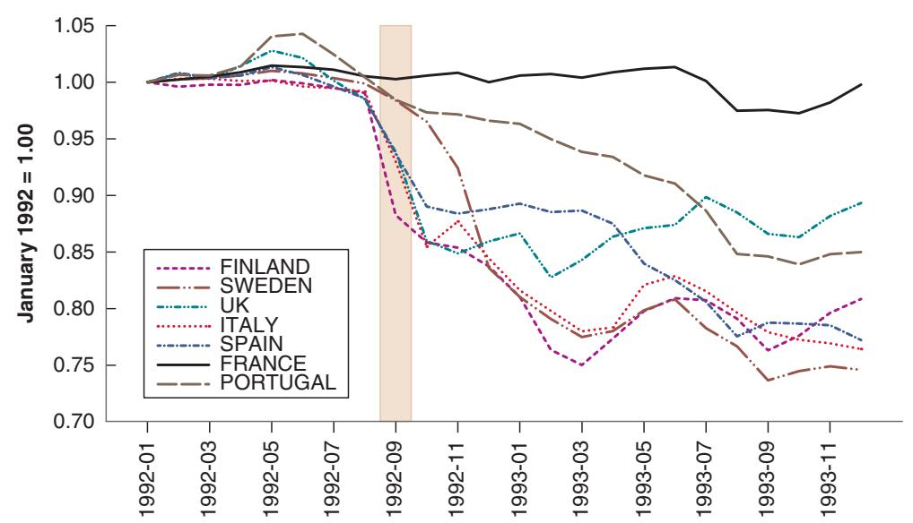
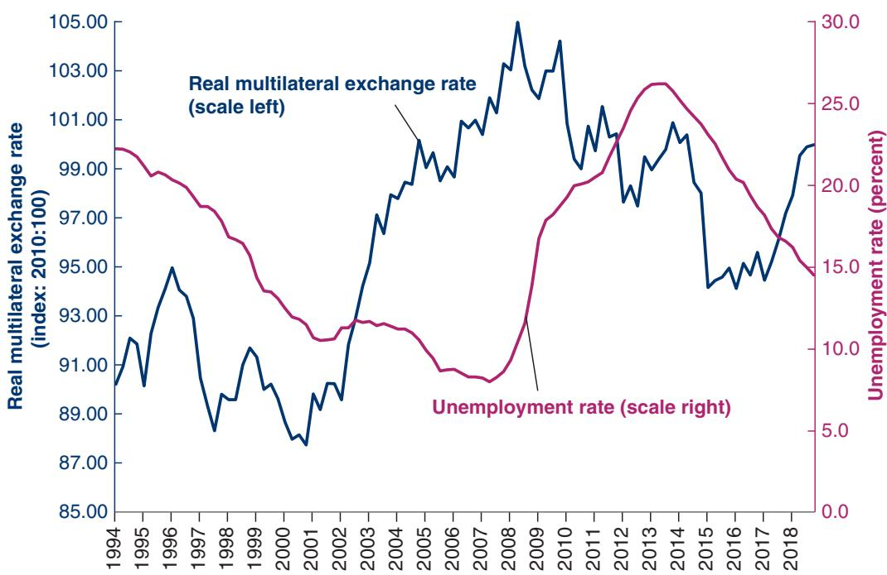

# The Return of Britain to the Gold Standard: Keynes versus Churchill

In 1925, Britain decided to return to the gold standard. The gold standard was a system in which each country fixed the price of its currency in terms of gold and stood ready to exchange gold for currency at the stated parity. This system implied fixed exchange rates between countries. (If, for example, one unit of currency in country A was worth two units of gold, and one unit of currency in country B was worth one unit of gold, the exchange rate between the two was 2 (or ½, depending on which you take as a domestic country).

The gold standard had been in place from 1870 until World War I. Because of the need to finance the war, and to do so in part by money creation, Britain suspended the gold standard in 1914. In 1925, Winston Churchill, then Britain’s Chancellor of the Exchequer (the British equivalent of Secretary of the Treasury in the United States), decided to return to the gold standard and to return to it at the pre-war parity—that is, at the pre-war value of the pound in terms of gold. But because prices had increased faster in Britain than in many of its trading partners, returning to the prewar parity implied a large real appreciation: At the same nominal exchange rate as before the war, British goods were now relatively more expensive relative to foreign goods. (Go back to the definition of the real exchange rate, e = EP>P\* : The price level in Britain, P, had increased more than the foreign price level, P\*. At a given nominal exchange rate, E , this implied that e was higher, that Britain suffered from a real appreciation.)

Keynes severely criticized the decision to return to the pre-war parity. In The Economic Consequences of Mr. Churchill, a book he published in 1925, Keynes argued as follows: If Britain were going to return to the gold standard, it should have done so at a lower price of currency in terms of gold; that is, at a lower nominal exchange rate than the pre-war nominal exchange rate. In a newspaper article, he articulated his views as follows:

There remains, however, the objection to which I have never ceased to attach importance, against the return to gold in actual present conditions, in view of the possible consequences on the state of trade and employment. I believe that our price level is too high, if it is converted to gold at the par of exchange, in relation to gold prices elsewhere; and if we consider the prices of those articles only which are not the subject of international trade, and of services, i.e. wages, we shall find that these are materially too high— not less than 5 per cent, and probably 10 per cent. Thus, unless the situation is saved by a rise of prices elsewhere, the Chancellor is committing us to a policy of forcing down money wages by perhaps 2 shillings in the Pound.

I do not believe that this can be achieved without the gravest danger to industrial profits and industrial peace. I would much rather leave the gold value of our currency where it was some months ago than embark on a struggle with every trade union in the country to reduce money wages. It seems wiser and simpler and saner to leave the currency to find its own level for some time longer rather than force a situation where employers are faced with the alternative of closing down or of lowering wages, cost what the struggle may.

For this reason, I remain of the opinion that the Chancellor of the Exchequer has done an ill-judged thing— ill judged because we are running the risk for no adequate reward if all goes well.

Keynes’s prediction turned out to be right. While other countries were growing, Britain remained in recession for the rest of the decade. Most economic historians attribute a good part of the blame to the initial overvaluation.1

the most forceful presentation of this view was made 90 years ago by John Maynard Keynes, who argued against Winston Churchill’s decision to return the British pound in 1925 to its pre–World War I parity with gold. His arguments are presented in the Focus Box “The Return of Britain to the Gold Standard: Keynes versus Churchill.” Most economic historians believe that history proved Keynes right, and that overvaluation of the pound was one of the main reasons for Britain’s poor economic performance after World War I.

Those who oppose a shift to flexible exchange rates or who oppose a devaluation argue that there are good reasons to choose fixed exchange rates, and that too much willingness to devalue defeats the purpose of adopting a fixed exchange rate regime in the first place. They argue that too much willingness on the part of governments to consider devaluations actually leads to an increased likelihood of exchange rate crises. To understand their arguments, we now turn to these crises: what triggers them and what their implications might be.

## 20-2 EXCHANGE RATE CRISES UNDER FIXED EXCHANGE RATES

Suppose a country has chosen to operate under a fixed exchange rate. Suppose also that financial investors start believing there may soon be an exchange rate adjustment— either a devaluation or a shift to a flexible exchange rate regime accompanied by a depreciation. We just saw why this might be the case:

■ The real exchange rate may be too high. Or put another way, the domestic currency may be overvalued, leading to too large a current account deficit. In this case, a real depreciation is called for. Although this could be achieved in the medium run without a devaluation, financial investors conclude that the government will take the quickest way out—and devalue.

Such an overvaluation often happens in countries that peg their nominal exchange rate to the currency of a country with lower inflation. Higher relative inflation implies a steadily increasing price of domestic goods relative to foreign goods, a steady real appreciation, and so a steady worsening of the trade position. As time passes, the need for an adjustment of the real exchange rate increases, and financial investors become more and more nervous. They start thinking that a devaluation might be coming.

To let a currency “float” is to allow a move from a fixed to a flexible exchange rate regime. A floating exchange c rate regime is the same as a flexible exchange rate regime.

■ Internal conditions may call for a decrease in the domestic interest rate. As we have seen, a decrease in the domestic interest rate cannot be achieved under fixed exchange rates. But it can be achieved if the country is willing to shift to a flexible exchange rate regime. If a country lets the exchange rate float and then decreases its domestic interest rate, we know from Chapter 19 that this will trigger a decrease in the nominal exchange rate—a nominal depreciation.

As soon as financial markets believe a devaluation may be coming, then maintaining the exchange rate requires an increase—often a large one—in the domestic interest rate.

To see this, return to the interest parity condition we derived in Chapter 17:

$$
i _ {t} = i _ {t} ^ {*} - \frac {\left(E _ {t + 1} ^ {e} - E _ {t}\right)}{E _ {t}}\tag{20.3}
$$

In Chapter 17, we interpreted this equation as a relation among the one-year domestic and foreign nominal interest rates, the current exchange rate, and the expected exchange rate a year hence. But the choice of one year as the period was arbitrary. The relation holds over a day, a week, a month. If financial markets expect the exchange rate to be 2% lower a month from now, they will hold domestic bonds only if the one-month domestic interest rate exceeds the one-month foreign interest rate by 2% (or, if we express interest rates at an annual rate, if the annual domestic interest rate exceeds the annual foreign interest rate by $2 \% \times 1 2 = 2 4 \%$ .

Under fixed exchange rates, the current exchange rate, $E _ { t } ,$ is set at some level, say $E _ { t } = \bar { E } .$ . If markets expect that the parity will be maintained over the period, then $E _ { t + 1 } ^ { e } = \bar { E }$ , and the interest parity condition simply states that the domestic and foreign interest rates must be equal.

They may require more than that, given that there is clearly a lot of risk involved. Our computation ignores the

Suppose, however, that participants in financial markets start anticipating a devaluation—a decision by the central bank to give up the parity and decrease the exchange rate in the future. Suppose they believe that, in the coming month, there is a 75% chance the parity will be maintained and a 25% chance there will be a 20% devaluation. The term ${ \left( E _ { t + 1 } ^ { e } - E _ { t } \right) } / { E _ { t } }$ in the interest parity equation (20.3), which we assumed to be equal to zero earlier, now equals $0 . 7 5 \times 0 \% + 0 . 2 5 \times ( - 2 0 \% ) = - 5 \%$ (a 75% chance of no change plus a 25% chance of a devaluation of 20%).

risk premium. c

This implies that, if the central bank wants to maintain the existing parity, it must now set a monthly interest rate 5% higher than before—60% higher at an annual rate (12 months \* 5% per month); 60% is the interest differential needed to convince investors to hold domestic bonds rather than foreign bonds! Any smaller interest differential and investors will not want to hold domestic bonds.

What, then, are the choices confronting the government and the central bank?

■ First, the government and the central bank can try to convince markets that they have no intention of devaluing. This is always the first line of defense: Communiqués are issued, and prime ministers go on TV to reiterate their absolute commitment to the existing parity. But words are cheap, and they rarely convince financial investors.

In most countries, the government is formally in charge of choosing the parity and the central bank is formally in charge of maintaining it. In practice, choosing and maintaining the parity are joint responsibilities of the government and the central bank.

In the summer of 1998, Boris Yeltsin announced that the Russian government had no intention of devaluing theb ruble. Two weeks later, the ruble collapsed.

■ Second, the central bank can increase the interest rate, but by less than would be needed to satisfy equation (20.3)—in our example, by less than 60%. Although domestic interest rates are high, they are not high enough to fully compensate for the perceived risk of devaluation. This action typically leads to a large capital outflow because, under the circumstances, financial investors still prefer to get out of domestic bonds and into foreign bonds, which offer higher expected returns in terms of domestic currency. Thus investors sell domestic bonds, getting the proceeds in domestic currency. They then go to the foreign exchange market to sell domestic currency for foreign currency in order to buy foreign bonds. If the central bank did not intervene in the foreign exchange market, the large sales of domestic currency for foreign currency would lead to a depreciation. If the central bank wants to maintain the fixed exchange rate, it must therefore stand ready to buy domestic currency and sell foreign currency at the current exchange rate. In doing so, it often loses most of its reserves of foreign currency. (The mechanics of central bank intervention were described in the appendix to Chapter 19.)

■ Eventually—after a few hours or a few weeks—the choice for the central bank becomes either to increase the interest rate enough to satisfy equation (20.3) or to validate the market’s expectations and devalue. Setting a very high short-term domestic interest rate can have a devastating effect on demand and output—no firm wants to invest, and no consumer wants to borrow when interest rates are very high. This course of action makes sense only if (1) the perceived probability of a devaluation is small, so the interest rate does not have to be too high; and (2) the government believes markets will soon become convinced that no devaluation is coming, allowing domestic interest rates to decrease. Otherwise, the only option is to devalue. (All these steps were at the center of the exchange rate crisis that affected much of Western Europe in 1992. See the Focus Box “The 1992 EMS Crisis.”)

To summarize: Expectations that a devaluation may be coming can trigger an exchange rate crisis. Faced with such expectations, the government has two options:

■ give in and devalue, or

■ fight and maintain the parity, at the cost of very high interest rates and a potential recession. Fighting may not work anyway; the recession may force the government to change policy later on—or force the government out of office.

An interesting twist here is that a devaluation can occur even if the belief that a devaluation was coming was initially groundless. In other words, even if the government initially has no intention of devaluing, it might be forced to do so if financial markets believe that it will devalue. The cost of maintaining the parity would be a long period of high interest rates and a recession; the government might prefer to devalue instead.

This should remind you of our discussion of bank runs in Chapter 6. The rumor that a bank is in trouble may trigger a run on the bank and force it to close, whether or not there was truth to the rumor.

## The 1992 EMS Crisis

An example of the problems we discussed in this section is the exchange rate crisis that shook the European Monetary System (EMS) in the early 1990s.

At the start of the 1990s, the EMS appeared to work well. Established in 1979, the EMS was an exchange rate system based on fixed parities with bands. Each member country (among them, France, Germany, Italy, and, beginning in 1990, the United Kingdom) had to maintain its exchange rate vis-à-vis all other member countries within narrow bands. The first few years had been rocky, with many realignments—adjustment of parities—among member countries. But from 1987 to 1992 there were only two realignments, and there was increasing talk about narrowing the bands further and even moving to the next stage— adoption of a common currency.

In 1992, however, financial markets became increasingly convinced that more realignments were soon to come. The reason was one we saw in Chapter 19: the macroeconomic implications of Germany’s reunification. Because of the pressure on demand after reunification, the Bundesbank (the German central bank) was maintaining high interest rates to avoid too large an increase in output and an increase in inflation in Germany. While Germany’s EMS partners needed lower interest rates to reduce a growing unemployment problem, they had to match the German interest rates to maintain their EMS parities. To financial markets, the position of Germany’s EMS partners looked increasingly untenable. Lower interest rates outside Germany and thus devaluations of many currencies relative to the Deutsche Mark (DM) appeared increasingly likely.

Throughout 1992, the perceived probability of a devaluation forced a number of EMS countries to maintain higher nominal interest rates than even those in Germany. Still, the first major crisis did not come until September 1992.

In early September 1992, the belief that a number of countries were soon going to devalue led to speculative attacks on a number of currencies, with financial investors selling in anticipation of a devaluation. All the lines of defense described earlier were used by the central banks and the governments of the countries under attack. First, solemn communiqués were issued, but with no discernible effect. Then interest rates were increased. For example, Sweden’s overnight interest rate (the rate for lending and borrowing overnight) increased to 500% (expressed at an annual rate)! But even such extremely high interest rates were not enough to prevent capital outflows and large losses of foreign exchange reserves by the central banks under pressure.

At that point, different countries took different courses of action. Spain devalued its exchange rate. Italy and the United Kingdom suspended their participation in the EMS. France decided to tough it out through higher interest rates until the storm was over. Figure 1 shows the evolution of the exchange rates relative to the DM for a number of European countries from January 1992 to December 1993. You can clearly see the effects of the September 1992 crisis, highlighted in the figure, and the ensuing depreciations/devaluations.

By the end of September, investors, by and large, believed that no further devaluations were imminent. Some countries were no longer in the EMS. Others had devalued but remained in the EMS, and those that had maintained their parity had shown their determination to stay in the EMS, even if this

  
Figure 1  
Exchange Rates of Selected European Countries Relative to the Deutsche Mark, January 1992 to December 1993

Source: IMF database.

meant very high interest rates. But the underlying problem—the high German interest rates—was still present, and it was only a matter of time before the next crisis. In November 1992, new speculation forced a devaluation of the Spanish peseta, the Portuguese escudo, and the Swedish krona. The peseta and the escudo were further devalued in May 1993. In July 1993, after yet another large speculative attack, EMS countries decided to adopt large fluctuation bands (plus or minus 15%) around central parities, in effect moving to a system that allowed for large exchange rate fluctuations.

This system with wider bands was kept until the adoption of a common currency, the euro, in January 1999.

To summarize: The 1992 EMS crisis came from the perception by financial markets that the high interest rates forced by Germany on its partners under the rules of the EMS were becoming very costly.

The belief that some countries might want to devalue or get out of the EMS led investors to ask for even higher interest rates, making it even more costly for those countries to maintain their parity.

In the end, some countries could not bear the cost; some devalued, some dropped out. Others remained in the system, but at a substantial cost in terms of output. (For example, average growth in France from 1990 to 1996 was 1.2%, compared to 2.3% for Germany over the same period.)

## 20-3 EXCHANGE RATE MOVEMENTS UNDER FLEXIBLE EXCHANGE RATES

In the model we developed in Chapter 19, there was a simple relation between the interest rate and the exchange rate: The lower the interest rate, the lower the exchange rate. This implied that a country that wanted to maintain a stable exchange rate just had to maintain its interest rate close to the foreign interest rate. A country that wanted to achieve a given depreciation just had to decrease its interest rate by the right amount.

In reality, the relation between the interest rate and the exchange rate is not so simple. Exchange rates often move even in the absence of movements in interest rates. Furthermore, the size of the effect of a given change in the interest rate on the exchange rate is hard to predict. This makes it much harder for monetary policy to achieve its desired outcome.

To see why things are more complicated, we must return once again to the interest parity condition we derived in Chapter 17, equation (17.2):

$$
(1 + i _ {t}) = (1 + i _ {t} ^ {*}) \bigg (\frac {E _ {t}}{E _ {t + 1} ^ {e}} \bigg)
$$

As we did in Chapter 19 (equation (19.4)), multiply both sides by $E _ { t + 1 } ^ { e }$ and reorganize to get

$$
E _ {t} = \frac {1 + i _ {t}}{1 + i _ {t} ^ {*}} E _ {t + 1} ^ {e}\tag{20.4}
$$

Think of the time period (from t to t + 1) as one year. The exchange rate this year depends on the one-year domestic interest rate, the one-year foreign interest rate, and the exchange rate expected for next year.

We assumed in Chapter 19 that the expected exchange rate next year, $E _ { t + 1 } ^ { e }$ , was constant. But this was a simplification. The exchange rate expected one year hence is not constant. Using equation (20.4), but now for next year, it is clear that the exchange rate next year will depend on next year’s one-year domestic interest rate, the one-year foreign interest rate, the exchange rate expected for the year after, and so on. So any change in expectations of current and future domestic and foreign interest rates, as well as changes in the expected exchange rate in the far future, will affect the exchange rate today.

Let’s explore this more closely. Write equation (20.4) for year t + 1 rather than for year t:

$$
E _ {t + 1} = \frac {1 + i _ {t + 1}}{1 + i _ {t + 1} ^ {*}} E _ {t + 2} ^ {e}
$$

The exchange rate in year $t + 1$ depends on the domestic and foreign interest rates for year $t + 1$ , as well as on the expected future exchange rate in year $t + 2$ . So the expectation of the exchange rate in year t + 1 held as of year t is given by:

$$
E _ {t + 1} ^ {e} = \frac {1 + i _ {t + 1} ^ {e}}{1 + i _ {t + 1} ^ {* e}} E _ {t + 2} ^ {e}
$$

Replacing $E _ { t + 1 } ^ { e }$ in equation (20.4) with the expression above gives:

$$
E _ {t} = \frac {(1 + i _ {t}) (1 + i _ {t + 1} ^ {e})}{(1 + i _ {t} ^ {*}) (1 + i _ {t + 1} ^ {* e})} E _ {t + 2} ^ {e}
$$

The current exchange rate depends on this year’s domestic and foreign interest rates, on next year’s expected domestic and foreign interest rates, and on the expected exchange rate two years from now. Continuing to solve forward in time in the same way (by replacing $E _ { t + 2 } ^ { e } , E _ { t + 3 } ^ { e }$ , and so on until year $t + n )$ , we get:

$$
E _ {t} = \frac {(1 + i _ {t}) (1 + i _ {t + 1} ^ {e}) \cdots (1 + i _ {t + n} ^ {e})}{(1 + i _ {t} ^ {*}) (1 + i _ {t + 1} ^ {* e}) \cdots (1 + i _ {t + n} ^ {* e})} E _ {t + n + 1} ^ {e}\tag{20.5}
$$

Suppose we take n to be large, say 10 years (equation (20.5) holds for any value of n). This relation tells us that the current exchange rate depends on two sets of factors:

■ Current and expected domestic and foreign interest rates for each year over the next 10 years.

■ The expected exchange rate 10 years from now.

The basic lesson from Appendix 2: For all the statements, you can put “real” in front of exchange rates and interest rates, and the state-

For some purposes, it is useful to go further and derive a relation among current and expected future domestic and foreign real interest rates, the current real exchange rate, and the expected future real exchange rate. This is done in Appendix 2 at the end of this chapter. (The derivation is not much fun, but it is a useful way of brushing up on the relation between real interest rates and nominal interest rates, and real exchange rates and nominal exchange rates.) Equation (20.5) is sufficient to make three important points, each outlined in more detail below:c

■ The level of today’s exchange rate will move one-for-one with the future expected exchange rate.

■ Today’s exchange rate will move when future expected interest rates move in either country.

■ Because today’s exchange rate moves with any change in expectations, the exchange rate will be volatile, that is, move frequently and perhaps by large amounts.

## Exchange Rates and the Current Account

Any factor that moves the expected future exchange rate, $E _ { t + n } ^ { e } ,$ also moves the current exchange rate, $E _ { t } .$ Indeed, if the domestic interest rate and the foreign interest rate are expected to be the same in both countries from t to t + n, the fraction on the right in equation (20.5) is equal to 1, so the relation reduces to $E _ { t } = E _ { t + n } ^ { e } .$ . In words: The effect of any change in the expected future exchange rate on the current exchange rate is one-for-one.

If we think of n as large (say, 10 years or more), we can think of $E _ { t + n } ^ { e }$ as the exchange rate required to achieve current account balance in the medium or long run. Countries cannot borrow—run a current account deficit—forever, and will not want to lend—run a current account surplus—forever either. Thus, any news that affects forecasts of the current account balance in the future is likely to have an effect on the expected future exchange rate and in turn on the exchange rate today. For example, the announcement of a larger-than-expected current account deficit may lead investors to conclude that a depreciation will eventually be needed to repay the increased debt. Thus, $E _ { t + n } ^ { e }$ will decrease, leading in turn to a decrease in $E _ { t }$ today.

## Exchange Rates and Current and Future Interest Rates

News about future current accounts is likely to affect the exchange rate today. What effect would you expect, for example, from the announcement of a major oil discovery?

Any factor that moves current or expected future domestic or foreign interest rates between years t and $t + n$ also moves the current exchange rate. For example, given foreign interest rates, an increase in current or expected future domestic interest rates leads to an increase in $E _ { t } { \mathrm { - a n } }$ appreciation.

News about current and future domestic and foreign interest rates is likely to affect b the exchange rate.

This implies that any variable that causes investors to change their expectations of future interest rates will lead to a change in the exchange rate today. For example, the “dance of the dollar” in the 1980s that we discussed in Chapter 17—the sharp appreciation of the dollar in the first half of the decade, followed by an equally sharp depreciation later—can be largely explained by the movement in current and expected future US interest rates relative to interest rates in the rest of the world during that period. During the first half of the 1980s, tight monetary policy and expansionary fiscal policy combined to increase both short- and long-term interest rates, with the increase in long-term rates reflecting anticipations of high short-term interest rates in the future. This increase in both current and expected future interest rates was, in turn, the main cause of the dollar appreciation. Both fiscal and monetary policy were reversed in the second half of the decade, leading to lower US interest rates and a depreciation of the dollar.

## Exchange Rate Volatility

The third implication follows from the first two. In reality, and in contrast to our analysis in Chapter 19, the relation between the interest rate and the exchange rate is anything but mechanical. When the central bank cuts the policy rate, financial markets have to assess whether this action signals a major shift in monetary policy and the cut in the interest rate is just the first of many such cuts, or whether this cut is just a temporary movement in interest rates. Announcements by the central bank may not be useful. The central bank itself may not know what it will do in the future; typically, it will be reacting to early signals, which may be reversed later. Investors also have to assess how foreign central banks will react: whether they will stay put or follow suit and cut their own interest rates. All this makes it much harder to predict the effect of the change in the interest rate be on the exchange rate.

Let’s be more concrete. Go back to equation (20.5). Assume that $E _ { t + n } ^ { e } = 1$ . Assume that current and expected future domestic interest rates, and current and expected future foreign interest rates, are all equal to 5%. The current exchange rate is then given by:

$$
E _ {t} = \frac {(1 . 0 5) ^ {n}}{(1 . 0 5) ^ {n}} 1 = 1
$$

Now consider a reduction in the current domestic interest rate, $i _ { t } ,$ from 5% to 3%. Will this lead to a decrease in $E _ { t } \mathrm { - } \mathrm { t o } :$ a depreciation—and if so by how much? The answer: It depends.

Suppose the interest rate is expected to be lower for just one year, so the n - 1 expected future interest rates remain unchanged. The current exchange rate then decreases to:

$$
E _ {t} = \frac {(1 . 0 3) (1 . 0 5) ^ {n - 1}}{(1 . 0 5) ^ {n}} = \frac {1 . 0 3}{1 . 0 5} = 0. 9 8
$$

The lower interest rate leads to a decrease in the exchange rate—a depreciation—of only 2%.

For more on the relation between long-term inter-b est rates and current and expected future short-term interest rates, go back to Chapter 14.

We leave aside here other factors that also move the exchange rate, such as changing perceptions of risk, which we discussed in a Focus Box titled “Capitalb Flows, Sudden Stops, and the Limits to the Interest Parity Condition” in Chapter 19.

stock prices, you are right.b This is more than a coincidence. Like stock prices, the exchange rate depends very much on expectations of variables far into the future. How expectations change in response to a change in a current variable (here, the interest rate) determines the outcome.

Suppose instead that, when the current interest rate declines from 5% to 3%, investors expect the decline to last for five years (so $i _ { t + 4 } ^ { e } = \cdot \cdot \cdot = i _ { t + 1 } ^ { e } = i _ { t } = 3 \%$ . The exchange rate then decreases to:

$$
E _ {t} = \frac {(1 . 0 3) ^ {5} (1 . 0 5) ^ {n - 5}}{(1 . 0 5) ^ {n}} = \frac {(1 . 0 3) ^ {5}}{(1 . 0 5) ^ {5}} = 0. 9 0
$$

The lower interest rate now leads to a decrease in the exchange rate—a depreciation—of 10%, a much larger effect.

You can surely think of still more outcomes. Suppose investors had anticipated that the central bank was going to decrease interest rates, and the actual decrease turns out to be smaller than they anticipated. In this case, the investors will revise their expectations of future nominal interest rates upward, leading to an appreciation rather than a depreciation of the currency.

When, at the end of the Bretton Woods period, countries moved from fixed exchange rates to flexible exchange rates, most economists expected that exchange rates, while flexible, would be stable. The large fluctuations in exchange rates that followed—and have continued to this day—came as a surprise. For some time, these fluctuations were thought to be the result of irrational speculation in foreign exchange markets. It was not until the mid-1970s that economists realized that these large movements could be explained, as we have explained here, by the rational reaction of financial markets to news about future interest rates and the future exchange rate. This has an important implication:

A country that decides to operate under flexible exchange rates must accept the fact that it will be exposed to substantial exchange rate fluctuations over time.

## 20-4 CHOOSING BETWEEN EXCHANGE RATE REGIMES

Let us now return to the question that motivates this chapter. Should countries choose flexible exchange rates or fixed exchange rates? Are there circumstances under which flexible rates dominate, and others under which fixed rates dominate?

Much of what we have seen in this and the previous chapter would seem to favor flexible exchange rates:

■ Section 20-1 argued that the exchange rate regime may not matter in the medium run, but it is still the case that it matters in the short run. In the short run, countries that operate under fixed exchange rates and perfect capital mobility give up two macroeconomic instruments: the interest rate and the exchange rate. This not only reduces their ability to respond to shocks but can lead to exchange rate crises.

■ Section 20-2 argued that, in a country with fixed exchange rates, the anticipation of a devaluation leads investors to ask for high interest rates. This in turn makes the economic situation worse and puts more pressure on the country to devalue. This is another argument against fixed exchange rates.

■ Section 20-3 introduced one argument against flexible exchange rates: they are likely to fluctuate a lot and be difficult to control through monetary policy.

On balance, it appears that, from a macroeconomic viewpoint, flexible exchange rates are preferable to fixed exchange rates. This is indeed the consensus that has emerged among economists and policymakers. The consensus is as follows:

In general, flexible exchange rates are preferable. There are, however, two exceptions. First, when a group of countries is already tightly integrated, a common currency may be the right solution. Second, when the central bank cannot be trusted to follow a responsible monetary policy under flexible exchange rates, a strong form of fixed exchange rates, such as a currency board or dollarization, may be the right solution.

Let us discuss in turn these two exceptions.

## Common Currency Areas

Countries that operate under a fixed exchange rate regime are constrained to have the same interest rate. But how costly is that constraint? If the countries face roughly the same macroeconomic problems and the same shocks, they would likely have chosen similar policies in the first place. Forcing them to have the same monetary policy may not be much of a constraint.

This argument was first explored by Robert Mundell, who looked at the conditions under which a set of countries might want to operate under fixed exchange rates or even adopt a common currency. For countries to constitute an optimal currency area, he argued, they need to satisfy one of three conditions:

■ The countries must experience similar shocks. We just saw the rationale for this. If they experience similar shocks, they would have chosen roughly the same monetary policy anyway.

■ Or, if the countries experience different shocks, prices and wages must be very flexible, so that, if a country needs to regain competitiveness, it can do so by decreasing prices relative to other members, despite the fact that it cannot use the exchange rate.

■ Or, if the countries experience different shocks, they must have high factor mobility. For example, if workers are willing to move from countries that are doing poorly to countries that are doing well, factor mobility rather than macroeconomic policy can allow countries to adjust to shocks. When the unemployment rate is high in a country, workers leave that country to take jobs elsewhere and the unemployment rate in that country decreases back to normal. If the unemployment rate is low, workers come to the country and the unemployment rate in the country increases back to normal. The exchange rate is not needed.

Following Mundell’s analysis, most economists believe, for example, that the common currency area composed of the 50 states of the United States is close to an optimal currency area. True, the first condition is not satisfied; individual states suffer from different shocks. California is more affected by shifts in demand from Asia than the rest of the United States. Texas is more affected by what happens to the price of oil, and so on. But the third condition is largely satisfied. There is considerable labor mobility across states. When a state does poorly, workers leave that state; when it does well, workers come to that state. State unemployment rates quickly return to normal, not because of state-level macroeconomic policy but because of labor mobility.

Clearly, there are also many advantages of using a common currency. For firms and consumers in the United States, the benefits of having a common currency are obvious; imagine how complicated life would be if you had to change currency every time you crossed a state line. The benefits go beyond these lower transaction costs. When prices are quoted in the same currency, it becomes much easier for buyers to compare prices and competition between firms increases, benefiting consumers. Given these benefits and the limited macroeconomic costs, it makes good sense for the United States to have a single currency.

In adopting the euro, Europe made the same choice as the United States. When the process of conversion from national currencies to the euro ended in early 2002, the euro became the common currency for 11 European countries. (See the Focus Box “The Euro: A Short History.”) The count of countries using the euro at time of writing is now 19. Is the economic argument for this new common currency area as compelling as it is for the United States?

There is little question that a common currency yields for Europe many of the same benefits that it has for the United States. A report by the European Commission estimates that the elimination of foreign exchange transactions in the euro area leads to a reduction in costs of 0.5% of the combined GDP of these countries. There are also clear signs that the use of a common currency increases competition. When shopping for cars, for example, European consumers search for the lowest euro price anywhere in the euro area.

There is, however, much less agreement on whether Europe constitutes an optimal common currency area. This is because none of the three Mundell conditions appears to be satisfied. European countries experienced very different shocks in the past. Recall our discussion of Germany’s reunification and how differently it affected Germany and the other European countries in the 1990s. Prices and wages adjust very slowly. And labor mobility is very low in Europe and likely to remain low. Workers move much less within European countries than their counterparts do in a given US state. And because of language and cultural differences among European countries, mobility between countries is even lower.

The worry that this might lead to long slumps in member countries if they were hit by a country-specific adverse shock was present even before the crisis. The crisis showed that the worry was well justified. Portugal, Greece, and Ireland, which had seen strong demand growth and large increases in current account deficits (see the Focus Box on current account deficits in Chapter 18), suddenly suffered a sharp decrease in spending, a sharp decrease in output, and increasing difficulty in financing their current account deficits. A large depreciation would have helped them increase demand and improve their current account, but with a common currency this could be done only through a decrease in prices relative to their euro partners. The result was a long and painful adjustment process, which, at the time of writing, is far from over.

Figure 20-1 shows the evolution of unemployment and the real multilateral exchange rate for Spain. A boom from 1994 to 2007 led to a steady decrease in unemployment, but

  
Figure 20-1  
Evolution of the Unemployment Rate and the Real Exchange Rate in Spain since 1994  
A boom from 1994 to 2007 led to lower unemployment and a real appreciation. In 2008, it turned into a bust, leading to a sharp increase in unemployment and a real depreciation.  
Source: FRED: BESBIS, LRHUTTTTESM156S

## The Euro: A Short History

As the European Union (EU) celebrated its 30th anniversary in 1988, a number of governments decided the time had come to plan a move to a common currency. They asked Jacques Delors, president of the EU, to prepare a report, which he presented in June 1989.

The Delors report suggested moving to a European Monetary Union (EMU) in three stages: Stage I was the abolition of capital controls. Stage II was the choice of fixed parities, to be maintained except for “exceptional circumstances.” Stage III was the adoption of a single currency.

■ Stage I was implemented in July 1990.

Stage II began in 1994, after the exchange rate crises of 1992–1993 had subsided (see the Focus Box “The 1992 EMS Crisis”). A minor but symbolic decision involved choosing the name of the new common currency. The French liked Ecu (European currency unit), which is also the name of an old French currency. But its partners preferred euro, and the name was adopted in 1995.

In parallel, EU countries held referendums on whether they should adopt the Maastricht treaty. The treaty, negotiated in 1991, set three main conditions for joining the EMU: low inflation, a budget deficit below 3%, and a public debt below 60%. The Maastricht treaty was not popular, and in many countries the outcome of the popular vote was close. In France, the treaty passed with only 51% of the votes. In Denmark, the treaty was rejected. The United Kingdom negotiated an “opt-out” clause that allowed Britain not to join the new currency union.

In the mid-1990s, it looked as if few European countries would satisfy the Maastricht conditions. But several countries took drastic measures to reduce their budget deficit. When the time came to decide, in May 1998, which countries would be members of the euro area, 11 countries made the cut: Austria, Belgium, Finland, France, Germany, Italy, Ireland, Luxembourg, the Netherlands, Portugal, and Spain. The United Kingdom, Denmark, and Sweden decided to stay out. Greece did not qualify initially and didn’t join until 2001. (After it joined, it was revealed that it had “cooked the books” and understated the size of its budget deficit in order to qualify.) Since then, Cyprus, Estonia, Malta, Slovakia, and Slovenia have joined.

Stage III began in January 1999. Parities between the 11 currencies and the euro were “irrevocably” fixed. The new European Central Bank (ECB) based in Frankfurt became responsible for monetary policy for the euro area.

From 1999 to 2002, the euro existed as a unit of account, but euro coins and bank notes did not exist. In effect, the euro area was still functioning as an area with fixed exchange rates. The next and final step was the introduction of euro coins and bank notes in January 2002. For the first few months of 2002, national currencies and the euro circulated side by side. Later in the year, national currencies were taken out of circulation.

Today, the euro is the only currency used in the euro area. The numbers of countries adopting the euro reached 19 when Latvia and Lithuania joined.

For more on the euro, go to www.euro.ecb.int/. The Wikipedia page on the euro is also very good.

also a steady real appreciation. In 2008, the boom turned into a bust, with a sharp increase in unemployment until 2013, and a real depreciation. (You might wonder why the unemployment rate continued to decline after real depreciation ended in 2015. This is due in part to an improvement in nonprice competitiveness and in part to stronger domestic demand.)

The challenge for the euro, looking forward, is whether such long slumps can be avoided in the future. Reforms are being explored to eliminate some of the factors that made the slump worse in those countries. A number of reforms are being put in place, from a banking union to a fiscal union, and they should allow countries to better resist adverse shocks. Whether these measures will be enough to be avoid crises in the future remains to be seen.

## Hard Pegs, Currency Boards, and Dollarization

The second case for fixed exchange rates is different from the first. It is based on the argument that there may be times when a country may want to limit its ability to use monetary policy.

Look at a country that has had very high inflation in the recent past—perhaps because it was unable to finance its budget deficit by any means other than money creation, resulting in high money growth and high inflation. Suppose the country decides to reduce money growth and inflation. One way to convince financial markets that it is serious about doing this is to fix its exchange rate. The need to use monetary policy to maintain the parity then ties the hands of the monetary authority.
