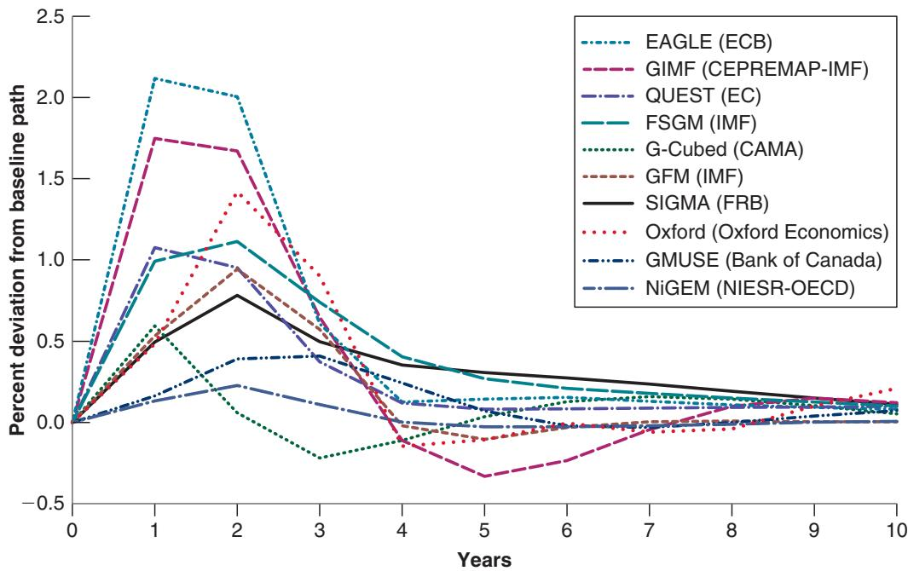
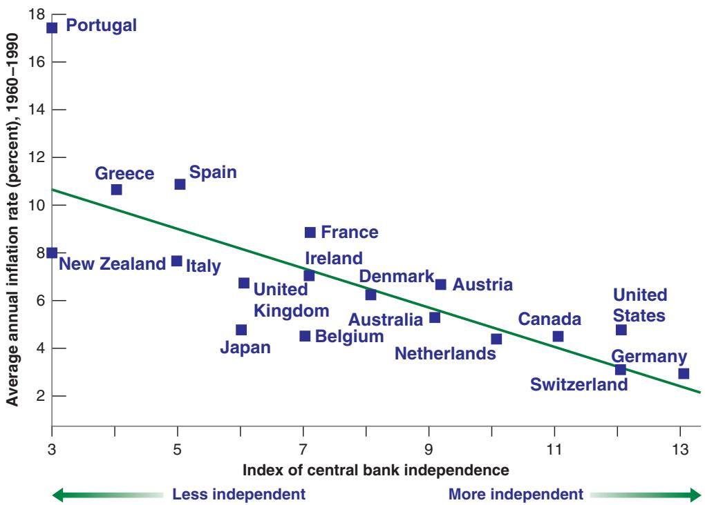
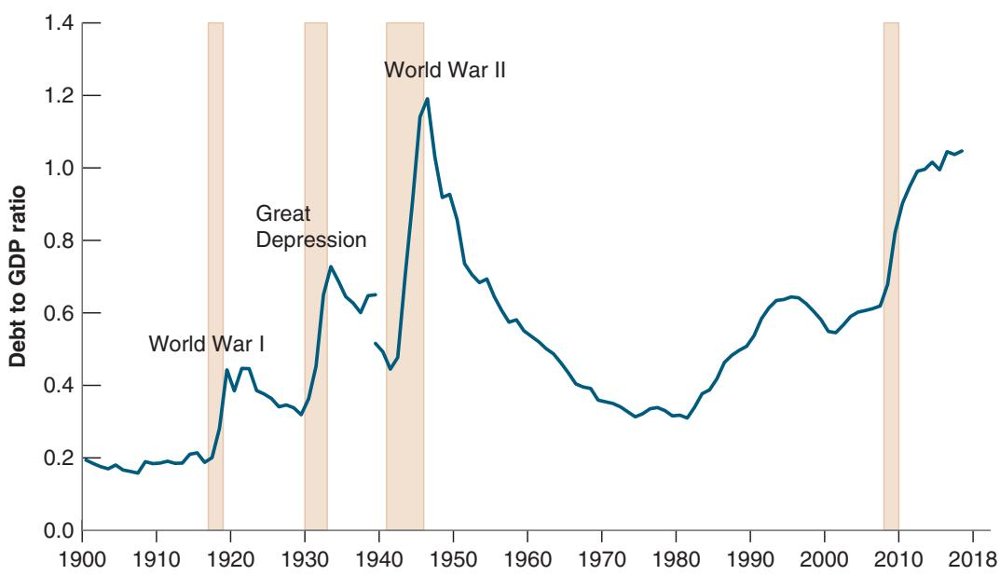

# House Republican Contract with America

## A Program for Accountability

Force Congress to live under the same laws as every other American Cut one out of three Congressional committee staffers Cut the Congressional budget

Then, in the first 100 days there will be votes on the following 10 bills:

1. Balanced budget amendment and the line item veto: It’s time to force the government to live within its means and restore accountability to the budget in Washington.

2. Stop violent criminals: Let’s get tough with an effective, able, and timely death penalty for violent offenders. Let’s also reduce crime by building more prisons, making sentences longer and putting more police on the streets.

3. Welfare reform: The government should encourage people to work, not have children out of wedlock.

4. Protect our kids: We must strengthen families by giving parents greater control over education, enforcing child support payments, and getting tough on child pornography.

5. Tax cuts for families: Let’s make it easier to achieve the American Dream: save money, buy a home, and send their kids to college.

6. Strong national defense: We need to ensure a strong national defense by restoring the essentials of our national security funding.

7. Raise the senior citizens’ earning limit: We can put an end to government age discrimination that discourages seniors from working if they want.

8. Roll back government regulations: Let’s slash regulations that strangle small business and let’s make it easier for people to invest in order to create jobs and increase wages.

9. Common-sense legal reform: We can finally stop excessive legal claims, frivolous lawsuits, and overzealous lawyers.

10. Congressional term limits: Let’s replace career politicians with citizen legislators. After all, politics shouldn’t be a lifetime job. (Please see reverse side to know if the candidate from your district has signed the Contract as of October 5, 1994.)

## IF WE BREAK THIS CONTRACT, THROW US OUT, WE MEAN IT.

## Figure 21-1

The Contract with America

## 21-1 UNCERTAINTY AND POLICY

A blunt way of stating the first argument in favor of policy restraints is that those who know little should do little. The argument has two parts: Macroeconomists, and by implication the policymakers who rely on their advice, know little, and they should therefore do little. Let’s look at each part separately.

## How Much Do Macroeconomists Actually Know?

Macroeconomists are like doctors treating cancer. They know a lot, but there is a lot they don’t know.

Take an economy with high unemployment, where the central bank is considering lowering interest rates to increase economic activity. Assume that it has room to decrease the interest rate; in other words, leave aside the even more difficult issue of what to do if the economy is in the liquidity trap (Chapter 4). Think of the sequence of links between a reduction in the interest rate that the central bank controls and the increase in output— all the questions the central bank faces when deciding whether, and by how much, to reduce the interest rate:

■ Is the current high rate of unemployment above the natural rate of unemployment, or has the natural rate of unemployment itself increased (Chapter 7)?

  
Figure 21-2  
The Response of Output to a Monetary Expansion: Predictions from 10 Models  
Although all 10 models predict that output will increase for some time in response to a monetary expansion, the range of answers regarding the size and the length of the output response is large.

■ If the unemployment rate is close to the natural rate, is there a significant risk that an interest rate reduction will lead to a decrease in unemployment below the natural rate of unemployment and cause an increase in inflation (Chapter 9)?

■ What will be the effect of the decrease in the policy rate on the long-term interest rate (Chapter 14)? By how much will stock prices increase (Chapter 14)? By how much will the currency depreciate (Chapters 19 and 20)?

■ How long will it take for lower long-term interest rates and higher stock prices to affect investment and consumption spending (Chapter 15)? How much will the exchange rate depreciation improve the trade balance (Chapter 18)? What is the danger that the effects come too late, when the economy has already recovered?

When assessing these questions, central banks—or macroeconomic policymakers in general—do not operate in a vacuum. They rely, in particular, on macroeconometric models. The equations in these models show how these individual links have looked in the past. But different models yield different answers, because they have different structures, different lists of equations, and different lists of variables.

Figure 21-2 gives an example of this diversity. The example comes from a study coordinated by the IMF, asking the builders of 10 main macroeconometric models to answer a similar question: Trace out the effects of a decrease in the US policy rate by 100 basis points (1%) for two years.

Three of these models have been developed and are used by central banks; four are used by international organizations, such as the IMF or the OECD; and three are used by academic institutions or commercial firms. They have a roughly similar structure, which you can think of as a more detailed version of the IS-LM-PC framework we developed in Chapter 9. Yet, as you can see, they give rather different answers to the question. Although the average response is for an increase in US output of 0.8% after one year, the answers vary from 0.1% to 2.1%. And after two years, the average response is for an increase of 1.0%, with a range from 0.2% to 2%. In short, if we measure uncertainty by the range of answers from this set of models, there is indeed substantial uncertainty about the effects of policy.

And this is a relatively simple experiment. Think of asking the same question in a country subject to a major financial crisis: How will the change in the interest rate affect the financial system, the perception of risks by

b investors, and so on?

## Should Uncertainty Lead Policymakers to Do Less?

Should uncertainty about the effects of policy lead policymakers to do less? In general, the answer is: yes. Consider the following example, which builds on the simulations we have just looked at.

Suppose the US economy is in recession. The unemployment rate is 6% and the Fed is considering using monetary policy to expand output. To concentrate on uncertainty about the effects of policy, let’s assume the Fed knows, with certainty, everything else. Based on its forecasts, it knows that, absent changes in monetary policy, unemployment will still be 6% next year. It knows that the natural rate of unemployment is 4%, and therefore it knows that the unemployment rate is 2% above the natural rate. And it knows, from Okun’s law, that 1% more output growth for a year leads to a 0.4% reduction in the unemployment rate.

Under these assumptions, the Fed knows that if it could use monetary policy to achieve 5% more output growth over the coming year, the unemployment rate a year from now would be lower by $0 . 4 \times 5 \% = 2 \%$ , so it would be down to the natural rate of unemployment, 4%. By how much should the Fed decrease the policy rate?

Taking the average of the responses from the different models in Figure 21-2, a decrease in the policy rate of 1% leads to an increase in output of 0.8% in the first year. Suppose the Fed takes this average relation as holding with certainty. What it should then do is straightforward. To return the unemployment rate to the natural rate in one year requires 5% more output growth, which requires the Fed to decrease the policy rate by $5 \% / 0 . 8 \% = 6 . 2 5 \%$ . If the economy’s response is equal to the average response from the 10 models, this decrease in the policy rate will return the economy to the natural rate of unemployment at the end of the year.

Suppose the Fed indeed decreases the policy rate by 6.25%. But let’s now take into account uncertainty, as measured by the range of responses of the different models in Figure 21-2. Recall that the range of responses of output to a 1% decrease in the policy rate varies from 0.1% to 2.1%. This range implies that the decrease in the policy rate leads, across models, to an output response anywhere between 0.625% $( 0 . 1 \times 6 . 2 5 \% )$ and 13.1% 12.1 \* 6.25%2. These output numbers imply, in turn, a decrease in unemployment anywhere between 0.25% $( 0 . 4 \times 0 . 6 2 5 \% )$ and 5.24% $( 0 . 4 \times 1 3 . 1 \% )$ Put another way, the unemployment rate a year hence could be anywhere between 0.76% 16% - 5.24%2 and 5.75% 16% - 0.25%2!

The conclusion is clear: given the range of uncertainty about the effects of monetary policy on output, decreasing the policy rate by 6.25% would be irresponsible. If the effects of the interest rate on output are as strong as suggested by one of the 10 models, unemployment by the end of the year could be 3.24% 14% - 0.76%2 below the natural rate of unemployment, leading to enormous inflationary pressures. Given this uncertainty, the Fed should decrease the policy rate by much less than 6.25%. For example, decreasing the policy rate by 3% leads to a range for unemployment of 5.9% to 3.5% a year, clearly a safer range of outcomes.

## Uncertainty and Restraints on Policymakers

Let’s summarize: There is substantial uncertainty about the effects of macroeconomic policies. This uncertainty should lead policymakers to be cautious and to limit the use of active policies. Policies should be broadly aimed at avoiding large prolonged recessions, slowing down booms, and avoiding inflationary pressure. The higher unemployment or the higher inflation, the more active the policies should be. One example comes from the recession of 2008–2009 when an unprecedented shift in monetary and fiscal policies probably avoided a repeat of what happened in the

1930s during the Great Depression. But in normal times, macroeconomic policies should stop short of fine tuning, of trying to achieve constant unemployment or constant output growth.

These conclusions would have been controversial 20 years ago. Back then, there was a heated debate between two groups of economists. One group, headed by Milton Friedman of the University of Chicago, argued that because of long and variable lags in the effects of policy on activity, activist policy was likely to do more harm than good. The other group, headed by Franco Modigliani of MIT, had just built the first generation of large macroeconometric models and believed that economists’ knowledge was becoming good enough to allow for increasingly fine tuning the economy. Today, most economists recognize that there is substantial uncertainty about the effects of policy. They also accept the implication that, except in special circumstances, such as 2008–2009, this uncertainty should lead to less active policies.

Friedman and Modigliani are the same two economists who independently developed the modern theory of consumption we saw in Chapter 15.

Note, however, that what we have developed so far is an argument for self-restraint by policymakers, not for restraints on policymakers. If policymakers are benevolent— they care about national well-being—and if they understand the implications of uncertainty—and there is no particular reason to think they don’t—they will, on their own, follow less active policies. There is no reason to impose further restraints, such as the requirement that money growth be constant or that the budget be balanced. Let’s now turn to arguments for restraints on policymakers.

## 21-2 EXPECTATIONS AND POLICY

One of the reasons the effects of macroeconomic policy are uncertain is the interaction of policy and expectations. How a policy works, and sometimes whether it works at all, depends not only on how it affects current variables but also on how it affects expectations about the future (this was the main theme of Chapter 16). The importance of expectations for policy goes, however, beyond uncertainty about the effects of policy. This brings us to a discussion of games.

Until 30 years ago, macroeconomic policy was seen in the same way as the control of a complicated machine. Methods of optimal control, developed initially to control and guide rockets, were increasingly being used to design macroeconomic policy. Economists no longer think this way. It has become clear that the economy is fundamentally different from a machine, even a very complicated one. Unlike a machine, the economy is composed of people and firms who try to anticipate what policymakers will do, and who react not only to current policy but also to expectations of future policy. Hence, macroeconomic policy must be thought of as a game between the policymakers and “the economy”—more concretely, the people and firms in the economy. So, when thinking about policy, what we need is not optimal control theory but rather game theory.

Warning: When economists say game, they do not mean “entertainment”; they mean strategic interactions between players. In the context of macroeconomic policy, the players are the policymaker on one side and people and firms on the other. The strategic interactions are clear: What people and firms do depends on what they expect policymakers will do; what policymakers do depends on what is happening in the economy.

Game theory has given economists many insights, often explaining how some apparently strange behavior makes sense when one understands the nature of the game. One of these insights is particularly important for our discussion of restraints here. Sometimes you can do better in a game by giving up some of your options. To see why, let’s start with an example from outside economics: governments’ policies toward hostage takers.

Even machines are becoming smarter. HAL, the robot in the 1968 movie 2001: A Space Odyssey, starts anticipating what humans in the space ship will do. The result is not

Game theory has become an important tool in all branches of economics. Both the 1994 and the 2005 Nobel Prizes in Economics were awarded to game theorists: in 1994 to John Nash at Princeton, John Harsanyi at Berkeley, and

Reinhard Selten in Germany (John Nash’s life is portrayed in the movie A Beautiful Mind ); in 2005 to Robert Aumann in Israel and Tom Schelling at Harvard.

This example was developed by Finn Kydland, then at Carnegie Mellon and now at the University of California–Santa Barbara, and Edward Prescott, then at Minnesota and now at Arizona State University, in “Rules Rather than Discretion: The Inconsistency of Optimal Plans,” Journal of Political Economy, 1977, 85(3): pp. 473–492. Kydland and Prescott were awarded the Nobel Prize in Economics in 2004.

A refresher: Given labor market conditions and given their expectations of the price level, firms and workers set nominal wages through bargaining. Given these nominal wages, firms set prices and this determines the price level. So prices depend on expected prices and labor market conditions. Equivalently, price inflation depends on expected price inflation and labor market conditions. This is what is captured in equation (21.1).

For simplicity, we assume the Fed can choose the unemployment rate—and, by implication, the inflation rate—exactly. In doing so, we ignore the uncertainty about the effects of policy. This was the topic of Section 21-1, but it is not central here.

Remember that the natural rate of unemployment is neither natural nor best in any sense (see Chapter 7). It may be reasonable for the Fed and everyone else in the economy

## Hostage Takings and Negotiations

to prefer an unemployment rate lower than the natural rate of unemployment.

Most governments have a stated policy that they will not negotiate with hostage takers. The reason for this stated policy is clear: to deter hostage taking by making it unattractive.

Suppose that, despite the stated policy, someone is taken hostage. Now that a hostage has been taken anyway, why not negotiate? Whatever compensation the hostage takers demand is likely to be less costly than the alternative (i.e., the likelihood that the hostage will be killed). So the best policy would appear to be: Announce that you will not negotiate, but if someone is taken hostage, negotiate.

On reflection, it is clear this would in fact be a very bad policy. Hostage takers’ decisions do not depend on the stated policy but on what they expect will actually happen. If they know that negotiations will actually take place, they will rightly consider the stated policy as irrelevant. And hostage takings will happen.

So what is the best policy? Despite the fact that, once a hostage is taken, negotiations typically lead to a better outcome, the best policy is for governments to commit not to negotiate. By ruling out the option to negotiate, they are more likely to prevent hostage takings to begin with.

Let’s now turn to a macroeconomic example based on the relation between inflation and unemployment. As you will see, even if the circumstances are less dramatic, exactly the same logic is involved.c

## Inflation and Unemployment Revisited

Recall the relation between inflation and unemployment we derived in Chapter 8 [equation (8.10), with the time indexes omitted for simplicity]:

$$
\pi = \pi^ {e} - \alpha (u - u _ {n})\tag{21.1}
$$

Inflation p depends on expected inflation, $\pi ^ { e }$ , and on the difference between the actual unemployment rate, u, and the natural unemployment rate, $u _ { n } .$ The coefficient a captures the effect of unemployment on inflation, given expected inflation. When unemployment is above the natural rate, inflation is lower than expected; when unemployment is below the natural rate, inflation is higher than expected.

Suppose the Fed announces it will follow a monetary policy consistent with a target of zero inflation $( \bar { \pi } = 0 )$ . On the assumption that people believe the announcement, expected inflation $( \pi ^ { e } )$ as embodied in wage contracts is equal to zero, and the Fed faces the following relation between unemployment and inflation:

$$
\pi = - \alpha (u - u _ {n})\tag{21.2}
$$

If the Fed follows through with its announced policy, it will choose an unemployment rate equal to the natural rate; from equation (21.2), inflation will be equal to zero, just as the Fed announced and people expected.

Achieving zero inflation and an unemployment rate equal to the natural rate is not a bad outcome. But it would seem the Fed can do even better:

Assume, for the purposes of this computation, a is equal to 0.5. Equation (21.2) implies that, by accepting just 1% inflation, the Fed can achieve an unemployment rate of $1 \% / 0 . 5 = 2 \%$ below the natural rate of unemployment. Suppose the Fed—and everyone else in the economy—finds the trade-off attractive and decides to decrease unemployment by 2% in exchange for an inflation rate of 1%. This incentive to deviate from the announced policy once the other player has made his move—in this case, once wage setters have set the wage—is known in game theory as the time inconsistency of optimal policy. In our example, the Fed can improve the outcome this period by deviating from its announced policy of zero inflation: By accepting some inflation, it can achieve a substantial reduction in unemployment.

■ Unfortunately, this is not the end of the story. Seeing that the Fed has allowed for more inflation than it announced it would, wage setters are likely to smarten up and begin to expect positive inflation of 1%. If the Fed still wants to achieve an unemployment rate 2% below the natural rate, it will now have to accept 2% inflation because expectations have changed. Accepting an inflation of 1% is no longer enough to sustain lower unemployment. However, if the Fed persists and achieves 2% inflation, wage setters are likely to further increase their expectations of future inflation, and so on.

■ The eventual outcome is likely to be persistent high inflation. Because wage setters understand the Fed’s motives, expected inflation eventually catches up with actual inflation. The end result is an economy with the same unemployment rate that would have prevailed if the Fed had followed its announced policy, but with possibly much higher inflation. In short, attempts by the Fed to make things better would lead, in the end, to things being worse.

How relevant is this example? Very relevant. Go back to Chapter 8: We can read the history of the Phillips curve and the increase in inflation in the late 1960s and the 1970s as coming precisely from the Fed’s attempts to keep unemployment below the natural rate of unemployment, leading to higher and higher expected inflation, and higher and higher actual inflation. In that light, the shift of the original Phillips curve can be seen as the adjustment of wage setters’ expectations to the central bank’s behavior.

What, then, is the best policy for the Fed to follow in this case? It is to make a credible commitment that it will not try to decrease unemployment below the natural rate. By giving up the option of deviating from its announced policy, the Fed can achieve unemployment equal to the natural rate of unemployment and zero inflation. The analogy with the hostage taking example is clear. By credibly committing not to do something that would appear desirable at the time, policymakers can achieve a better outcome; no hostage takings (in our previous example), and no inflation here.

## Establishing Credibility

How can a central bank credibly commit to not deviate from its announced policy?

One way to establish its credibility is for the central bank to give up—or to be stripped by law of—its policymaking power. For example, the mandate of the central bank can be defined by law in terms of a simple rule, such as keeping money growth at 0% (or more generally, at x%) forever. (An alternative, which we discussed in Chapter 20, is to adopt a hard peg, such as a currency board or, in other countries, dollarization. In this case the central bank must keep interest rates equal to foreign rates no matter what.)

Such a law surely takes care of the problem of time inconsistency. But the tight restraint it creates comes close to throwing the baby out with the bath water. We want to prevent the central bank from pursuing too high a rate of money growth in an attempt to maintain unemployment below the natural unemployment rate. But—subject to the restrictions discussed in Section 21-1—we still want the central bank to be able to decrease the policy rate by expanding the money supply when unemployment is far above the natural rate, and to increase the policy rate by contracting the money supply when unemployment is far below the natural rate. Such actions become impossible under a constant-money-growth rule. There are indeed better ways to deal with time inconsistency. In the case of monetary policy, our discussion suggests various ways of dealing with the problem.

A first step is to make the central bank independent. By an independent central bank, we mean a central bank where interest rate and money supply decisions are made independent of the influence of currently elected politicians. Politicians, who face frequent reelections, may want lower unemployment now, even if it leads to inflation later. Making the central bank independent and making it difficult for politicians to fire the central banker makes it easier for the central bank to resist political pressure to decrease unemployment below the natural rate of unemployment.

This may not be enough, however. Even if it is not subject to political pressure, the central bank may be tempted to decrease unemployment below the natural rate. Doing so leads to a better outcome in the short run. So a second step is to give incentives to the central bankers to take the long view—that is, to take into account the long-run costs of higher inflation. One way of doing so is to give them long terms in office, so they have a long horizon and have the incentives to build credibility.

A third, and more controversial, step may be to appoint a “conservative” central banker, someone who dislikes inflation very much and is therefore less willing to accept more inflation in exchange for less unemployment when unemployment is at the natural rate. When the economy is at the natural rate, such a central banker will be less tempted to embark on a monetary expansion. Thus, the problem of time inconsistency will be reduced.

These are the steps many countries have taken over the last two decades. Central banks have been given more independence from governments. Central bankers have been given long terms in office. And governments typically have appointed central bankers who are more “conservative” than the governments themselves—central bankers who appear to care more about inflation and less about unemployment than the government does. (See the Focus Box “Was Alan Blinder Wrong in Speaking the Truth?”)

Have these steps been successful? Figure 21-3 suggests that they have, at least in terms of delivering low inflation. The vertical axis gives the average inflation rate in 18 OECD countries over the period 1960–1990, when some central banks were independent, others much less so. (Today, most central banks are, at least formally, independent.) The horizontal axis gives the value of an index of “central bank independence,” constructed by looking at a number of legal provisions in the central bank’s charter—for example, whether and how the government can remove the head of the bank. There is a striking inverse relation between the two variables, as illustrated by the regression line: More

## Figure 21-3

## Inflation and Central Bank Independence

Across OECD countries, the higher the degree of central bank independence, the lower the rate of inflation.

Source: Vittorio Grilli, Donato Masciandaro, and Guido Tabellini, “Political and Monetary Institutions and Public Financial Policies in the Industrial Countries,” Economic Policy, 1991, 6(13): pp. 341–392.

## Was Alan Blinder Wrong in Speaking the Truth?

In the summer of 1994, President Bill Clinton appointed Alan Blinder, an economist from Princeton, vice chair (in effect, second in command) of the Federal Reserve Board. A few weeks later, Blinder, speaking at an economic conference, indicated his belief that the Fed had both the responsibility and the ability, when unemployment was high, to use monetary policy to help the economy recover. This statement was badly received. Bond prices fell, and most newspapers ran editorials critical of Blinder.

Why was the reaction of markets and newspapers so negative? It was surely not that Blinder was wrong. There is no doubt that monetary policy can and should help the economy out of a recession. Indeed, the Federal Reserve Bank Act of 1977 requires the Fed to pursue full employment as well as low inflation.

The reaction was negative because, in terms of the argument we developed in the text, Blinder revealed by his words that he was not a conservative central banker, that he cared about unemployment as well as inflation. With the unemployment rate at the time equal to 6.1%, close to what was thought to be the natural rate of unemployment at the time, markets interpreted Blinder’s statements as suggesting that he might want to decrease unemployment below the natural rate. Interest rates increased because of higher expected inflation, and bond prices decreased.

The moral of the story: Whatever views central bankers may hold, they should try to look and sound conservative. This is why, for example, many heads of central banks are reluctant to admit, at least in public, the existence of any trade-off between unemployment and inflation, even in the short run.

central bank independence appears to be systematically associated with lower inflation. The mechanism: Central bank independence makes the announced inflation target more credible. This leads inflation expectations to stay close to the announced target, and this in turn makes it easier for the central bank to achieve its target. Chapter 8 showed, however, that establishing credibility does not happen overnight. The Fed indicated a commitment to low inflation as early as the early 1980s, but it took until the mid-1990s for inflation expectations to become anchored at the target inflation rate.

## Time Consistency and Restraints on Policymakers

Let’s summarize what we have learned in this section:

A warning: Figure 21-3b shows correlation, not necessarily causality. It may be that countries that dislike inflation tend to both give more independence to their central bankers and have lower inflation. (This is another example of the difference between correlation and causality, discussed in Appendix 3 at the end of the book.)

We have examined arguments for putting restraints on policymakers based on the issue of time inconsistency.

When issues of time inconsistency are relevant, tight restraints on policymakers— like a fixed-money-growth rule in the case of monetary policy, or a balanced budget rule in the case of fiscal policy—can provide a rough solution. But the solution has large costs because it prevents the use of macroeconomic policy altogether. Better solutions typically involve designing better institutions (like an independent central bank, or a better budget process) that can reduce the problem of time inconsistency while allowing the use of policy for the stabilization of output. This is not easy to do, however.

## 21-3 POLITICS AND POLICY

We have assumed so far that policymakers are benevolent, that is, that they try to do what is best for the economy. However, much public discussion challenges that assumption. Politicians or policymakers, the argument goes, do what is best for themselves, and this is not always what is best for the country.

You have heard the arguments. Politicians avoid the hard decisions and they pander to the electorate, partisan politics leads to gridlock, and nothing gets done. Discussing the flaws of democracy goes far beyond the scope of this book. What we can do here is to briefly review how these arguments apply to macroeconomic policy, then look at the empirical evidence and see what light it sheds on the issue.

## Games between Policymakers and Voters

Many macroeconomic policy decisions involve trading off short-run losses against longrun gains or, conversely, short-run gains against long-run losses.

Take, for example, tax cuts. By definition, tax cuts lead to lower taxes today. They are also likely to lead to an increase in demand, and therefore to an increase in output for some time. But unless they are matched by equal decreases in government spending, they lead to a larger budget deficit and to the need for an increase in taxes in the future. If voters are shortsighted, the temptation for politicians to cut taxes may prove irresistible. Politics may lead to systematic deficits, at least until the level of government debt has become so high that politicians are scared into action.

We saw in Chapter 9 that, even if monetary policy is used to increase output in the short run, in the medium run, output returns to its natural level and unemployment to its natural rate.

Now let’s move on from taxes to macroeconomic policy in general. Again, suppose that voters are shortsighted. If the politicians’ main goal is to please voters and get reelected, what better policy than to expand aggregate demand before an election, leading to higher growth and lower unemployment? True, growth in excess of the normal growth rate cannot be sustained, and eventually the economy must return to the natural level of output. Higher growth now must be followed by lower growth later. And lower taxes now must be followed by higher taxes later. But with the right timing and shortsighted voters, higher growth and lower taxes can win elections. Thus, we might expect a clear political business cycle (i.e., economic fluctuations induced by political elec-c tions) associated with higher growth on average before elections than after elections.

You probably have heard these arguments before, in one form or another. And their logic appears convincing. The question is: How well do they fit the facts?

First, consider deficits and debt. The preceding argument would lead you to expect that budget deficits and high government debt always have been and always will be there. Figure 21-4 takes the long view. It gives the evolution of the ratio of government debt to GDP in the United States since 1900 and suggests a more complex reality.

Look first at the evolution of the ratio of debt to GDP from 1900 to 1980. Each of the first three buildups in debt (represented by the shaded bars) was associated with special circumstances: World War I, the Great Depression, and World War II. These were times of unusually high military spending or unusual declines in output. Adverse circumstances— not pandering to voters—were clearly behind the large deficits and the resulting increase

## Figure 21-4

## The Evolution of the US Debt to GDP Ratio since 1900

The three major buildups of debt since 1900 have been associated with World War I, the Great Depression, and World War II. In contrast, except for the increase in debt due to the financial crisis, the buildup since 1980 has not been caused by either wars or adverse economic shocks.

Source: 1900 to 1939: Historical Statistics of the United States; US Census Bureau. 1939 on: FRED GFDGDPA188S (note the break in the series in 1939)

in debt during each of these three episodes. Note also that, in each of these three cases, the buildup was followed by a steady decrease in debt. The ratio of debt to GDP, which was as high as 120% in 1946, was steadily reduced to a postwar low of 31% in 1981.

The more recent evidence is less reassuring. The ratio of debt to GDP has climbed back up to reach 105% in 2018. The increase has three main causes: large tax cuts under the Reagan administration in the early 1980s, another round of large tax cuts under the Bush administration in the early 2000s, and the large deficits triggered by the financial crisis in 2008 and 2009.

As we saw in Chapter 6, the large deficits during the financial crisis were largely justified on macroeconomic grounds; without them, the recession would have been much worse. But what about the two rounds of tax cuts? Were they motivated by a desire to pander to shortsighted voters? Probably not, or at least not mainly. One motivation, discussed below, was to “starve the beast,” to create deficits in order to create the political pressure to cut spending later. Another was based on supply side theories, the belief that tax cuts would lead people to work more and firms to be more productive, leading to higher potential output and higher tax revenues in the future. (The hope that tax cuts would lead to higher tax revenues never materialized, and debt ended up higher.)

In short, the simple hypothesis that the combination of cynical politicians and shortsighted voters must inevitably lead to steady deficits and high debt does not fit the facts. What about the political business cycle argument, that policymakers try to get high output growth before the elections so they will be reelected? If the political business cycle is important, we would expect to see faster growth before elections rather than after. With this motivation, Table 21-1 gives average output growth rates for each of the four years of each US administration from 1948 to 2018, distinguishing between Republican and Democratic presidential administrations. Look at the last line of the table. Growth has indeed been highest on average in the last year of an administration: 3.6%, compared to 2.8% in the first year. (We shall return below to another interesting feature in the table, namely the difference between Republican and Democratic administrations.) This can be read as supporting evidence of some manipulation of economic policy to win elections.

The precise relation between the evolution of deficits, debt, and the ratio of debt to GDP is 1 explored in detail in Chapter 22. For the moment, all you need to know is that deficits lead to increases in debt.

The main proponent of supply side theories was an economist named Arthur Laffer. It is said that, in 1974, he convinced then President Ford by drawing a graph of tax revenues against the taxb rate on a napkin. When tax rates were too high, which he argued was the case in the United States, lower tax rates would increase rather than decrease revenues.

To summarize: Policymakers are not indifferent to their electoral prospects, and voters are often shortsighted. The evidence on political business cycles suggests that this plays a role in the setting of macroeconomic policy. But, if we are to explain the evolution of debt and deficits, it is clear that other factors are at work: wars, crises, unusual economic theories, and, as we explore in the next subsection, games between policymakers.

## Games between Policymakers

Suppose that the party in power wants to reduce spending but faces opposition to spending cuts in Congress. One way of putting pressure both on Congress and on future parties in power is to cut taxes and create deficits. As debt increases over time, the increasing

<table><tr><td colspan="6">Table 21-1 Growth during Democratic and Republican Presidential Administrations: 1948–2018</td></tr><tr><td colspan="6"></td></tr><tr><td colspan="6">Year of administration</td></tr><tr><td></td><td>First (%)</td><td>Second (%)</td><td>Third (%)</td><td>Fourth (%)</td><td>Average (%)</td></tr><tr><td>Democratic</td><td>2.4</td><td>5.1</td><td>3.8</td><td>3.4</td><td>3.7</td></tr><tr><td>Republican</td><td>3.3</td><td>0.9</td><td>3.3</td><td>3.8</td><td>2.8</td></tr><tr><td>Average</td><td>2.8</td><td>3.0</td><td>3.5</td><td>3.6</td><td>3.2</td></tr><tr><td colspan="6">Source: Calculated using Series GDPCA, from 1948 to 2018: Federal Reserve Economic Data (FRED) https://fred.stlouisfed.org/</td></tr></table>

Another example outside of economics: During the 2004–2005 National Hockey League lockout, where the complete season was cancelled because owners and players could not reach an agreement. The National Basketball Association faced a similar lockout during the summer of 2011.

See the discussion in the Focus Box “Monetary Contraction and Fiscal Expansion: The United States in the Early 1980s” in Chapter 19.

pressure to reduce deficits may force Congress and future parties in power to reduce spending—something they would not have been willing to do otherwise.c

Or suppose that, for any reason, the country is facing large budget deficits. Both parties in Congress want to reduce the deficit, but they disagree about the way to do it. One party wants to preserve spending and reduce deficits primarily through an increase in taxes; the other wants to decrease spending. Both parties may hold out on the hope that the other side will give in first. Only when debt has increased sufficiently, and it becomes urgent to reduce deficits, will one party give up.

Game theorists refer to these situations as wars of attrition. The hope that the other side will give in leads to long and often costly delays. Such wars of attrition happen often in the context of fiscal policy, and deficit reduction occurs long after it should.

Wars of attrition arise in other macroeconomic contexts; for example, during episodes of hyperinflation. As we shall see in Chapter 22, hyperinflations come from the use of money creation to finance large budget deficits. Although the need to reduce those deficits is usually recognized early on, support for stabilization programs—which include the elimination of those deficits—typically comes only after inflation has reached such high levels that economic activity is severely affected.

These games also go a long way in explaining the rise in the ratio of debt to GDP in the United States since the early 1980s. There is little doubt that one of the goals of the Reagan administration, when it decreased taxes from 1981 to 1983, was to slow the growth of government spending. There is also little question that, by the mid-1980s, there was general agreement among policymakers that the deficits should be reduced. But, because of disagreements between Democrats and Republicans about whether this should happen primarily through tax increases or spending cuts, it was not until the late 1990s that deficit reduction was achieved. The same dynamics followed the Bush administration tax cuts of the early 2000s. And these dynamics may well be at play again: The Trump administration tax cuts have led to larger deficits. Whether these are eventually reduced through tax increases or spending cuts may depend on the results of another war of attrition between Republicans and Democrats.

Another example of games between political parties is the movements in economic activity brought about by the alternation of parties in power. Traditionally, Republicans have worried more than Democrats about inflation and worried less than Democrats about unemployment. So we would expect Democratic administrations to show stronger growth—and thus less unemployment and more inflation—than Republican administrations. This prediction appears to fit the facts quite well. Look at Table 21-1 again. Average growth has been 3.7% during Democratic administrations, compared to 2.8% during Republican administrations. The most striking contrast is in the second year: 5.1% during Democratic administrations compared to 0.9% during Republican administrations.

This raises an intriguing question. Why is the effect so much stronger in the administration’s second year? It could just be a fluke. Many other factors affect growth. But the theory of unemployment and inflation we developed in Chapter 8 suggests a possible hypothesis. There are lags in the effects of policy, so it takes about a year for a new administration to affect the economy. And sustaining higher growth than normal for too long would lead to increasing inflation, so even a Democratic administration would not want to sustain higher growth throughout its term. Thus, growth rates tend to be much closer to each other during the second half of Democratic and Republican administrations— more so than during the first half.

## Politics and Fiscal Restraints

If politics sometimes lead to large and lasting budget deficits, can rules be put in place to limit these adverse effects?

A constitutional amendment to balance the budget each year, such as the amendment proposed by the Republicans in 1994, would eliminate the problem of deficits. But just like a constant-money-growth rule in the case of monetary policy, it also would eliminate the use of fiscal policy as a macroeconomic instrument altogether. This is too high a price to pay.

A better approach is to put in place rules that put limits either on deficits or on debt. But this is more difficult than it sounds. Rules such as limits on the ratio of the deficit to GDP or the ratio of debt to GDP are more flexible than a balanced budget requirement, but they may still not be flexible enough if the economy is affected by particularly bad shocks. This has been made clear by the problems associated with the Stability and Growth Pact; these problems are discussed in the Focus Box “Euro Area Fiscal Rules: A Short History.” More flexible or more complex rules—rules that allow for special circumstances or take into account the state of the economy—are harder to design and harder to enforce. For example, allowing the deficit to be higher if the unemployment rate is higher than the natural rate requires a simple and unambiguous way of computing what the natural rate is, a nearly impossible task.

A complementary approach is to put in place mechanisms to reduce deficits, were such deficits to arise. Consider, for example, a mechanism that triggers automatic spending cuts when the deficit gets too large. Suppose the budget deficit is too large and it is desirable to cut spending across the board by 5%. Members of Congress will find it difficult to explain to their constituency why their favorite spending program was cut by 5%. Now suppose the deficit triggers automatic across-the-board spending cuts of 5% without any congressional action. Knowing that other programs will be cut, members of Congress will accept cuts in their favorite programs more easily. They will also be better able to deflect the blame for the cuts. Members of Congress who succeed in limiting the cuts to their favorite program to, say, 4% (by convincing Congress to make deeper cuts in some other programs to maintain the lower overall level of spending) can then return to their constituents and claim they have successfully prevented even larger cuts.

This was the general approach used to reduce deficits in the United States in the 1990s. The Budget Enforcement Act passed in 1990, and extended by new legislation in 1993 and 1997, introduced two main rules:

■ It imposed constraints on spending. Spending was divided into two categories: discretionary (roughly, spending on goods and services, including defense) and mandatory (roughly, transfer payments to individuals). Constraints, called spending caps, were set on discretionary spending for the following five years and required a small but steady decrease in discretionary spending (in real terms), with explicit provisions for emergencies. For example, spending on Operation Desert Storm during the Gulf War in 1991 was not subject to the caps.

■ It stipulated that a new transfer program could be adopted only if it could be shown not to increase deficits in the future (either by raising new revenues or by decreasing spending on an existing program). This rule is known as the pay-as-you-go or PAYGO rule.

The focus on spending rather than on the deficit itself had one important implication. If there was a recession, hence a decrease in revenues, the deficit could increase without triggering a decrease in spending. This happened in 1991 and 1992. And the focus on spending had two desirable effects: It allowed for a larger fiscal deficit during a recession—a good thing from the point of view of macroeconomic policy; and it decreased the pressure to break the rules during a recession—a good thing from a political point of view.

By 1998, deficits were gone, and for the first time in 20 years, the federal budget was in surplus. Not all the deficit reduction was due to the Budget Enforcement

