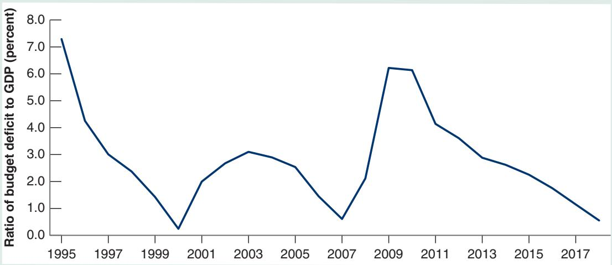

# Euro Area Fiscal Rules: A Short History

The Maastricht treaty, negotiated by the countries of the European Union in 1991, set a number of convergence criteria that countries had to meet in order to qualify for membership in the euro area (for more on the history of the euro, see the Focus Box “The Euro: A Short History” in Chapter 20). Among them were two restrictions on fiscal policy. First, the ratio of the budget deficit to GDP had to be lower than 3%. Second, the ratio of debt to GDP had to be less than 60%, or at least “approaching this value at a satisfactory pace.”

In 1997, would-be members of the euro area agreed to make some of these restrictions permanent. The Stability and Growth Pact (SGP), signed in 1997, required members of the euro area to adhere to the following fiscal rules:

■ That countries commit to balance their budget in the medium run. That they agree to present programs to the European authorities, specifying their objectives for the current and following three years to show how they are making progress toward their medium-run goal.

That countries avoid excessive deficits, except under exceptional circumstances. Following the Maastricht treaty criteria, excessive deficits were defined as deficits in excess of 3% of GDP. Exceptional circumstances were defined as declines of GDP larger than 2%.

That sanctions be imposed on countries that ran excessive deficits. These sanctions could range from 0.2 to 0.5% of GDP—so, for a country like France, up to roughly 10 billion euros!

Figure 1 plots the evolution of budget deficits since 1995 for the euro area as a whole. Note that from 1995 to 2000 budget balances went from a deficit of 7.5% of euro area GDP to budget balance. The performance of some of the member countries was particularly impressive. Greece reduced its deficit from 13.4% of GDP to a reported 1.4% of GDP. (It was discovered later that the Greek government had cheated in reporting its deficit numbers and that the actual improvement, although impressive, was less than reported; the deficit for 2000 is now estimated to have been 4.1%.)

Italy’s deficit went from 10.1% of GDP in 1993 to only 0.9% of GDP in 2000.

Was the improvement entirely due to the Maastricht criteria and the SGP rules? No, the strong expansion of the late 1990s played an important role. But so did the fiscal rules. The carrot—the right to become a member of the euro area—was attractive enough to lead several countries to take tough measures to reduce their deficits.

Things changed, however, after 2000. Deficits started increasing. The first country to break the limit was Portugal in 2001, with a deficit of 4.4%. The next two countries were France and Germany, both with deficits in excess of 3% of GDP in 2002. Italy soon followed. In each case, the government of the country decided it was more important to avoid a fiscal contraction that could lead to even slower output growth than to satisfy the rules of the SGP.

Faced with clear “excessive deficits” (and without the excuse of exceptional circumstances because output growth in each of these countries was low but positive), European authorities found themselves in a quandary. Starting the excessive deficit procedure against Portugal, a small country, might have been politically feasible, although it is doubtful that Portugal would have ever been willing to pay the fine. Starting the same procedure against the two largest members of the euro area, France and Germany, proved politically impossible. After an internal fight between the two main European authorities, the European Commission and the European Council—the European Commission wanted to proceed with the excessive deficit procedure, whereas the European Council, which represents the states, did not—the procedure was suspended.

The crisis made it clear that the initial rules were too inflexible. Romano Prodi, the president of the European Commission, admitted to that much. In an interview in October 2002, he stated, “I know very well that the Stability Pact is stupid, like all decisions that are rigid.” And the attitudes of both France and Germany showed that the threat

Figure 1

Euro Area Budget Deficit as a Percentage of GDP since 1995

Source: European Central Bank. References: If you want to get a sense of the complexity of the current rules, read the Wikipedia entry at https://en.wikipedia.org/ wiki/European\_Fiscal\_Compact.

to impose large fines on countries with excessive deficits was simply not credible.

For two years, the European Commission explored ways to improve the rules to make them more flexible and, by implication, more credible. In 2005, a new, revised SGP was adopted. It kept the 3% deficit and 60% debt numbers as thresholds but allowed for more flexibility in deviating from the rules. Growth no longer had to be less than -2% for the rules to be suspended. Exceptions were also made if the deficit came from structural reforms or from public investment. Fines were gone, and the plan was to rely on early public warnings as well as on peer pressure from other euro area countries.

For a while, the ratio of the deficit to GDP declined, again largely due to strong growth and higher revenues. The ratio reached a low of 0.5% in 2007. But the crisis, and the associated sharp decrease in revenues, led again to a sharp increase in budget deficits. In 2010, the ratio was close to 6%, twice the SGP threshold; 23 of 27 EU countries stood in violation of the 3% deficit limit, and it was clear that the rules had to be reconsidered. Eventually, in 2012, a new intergovernmental treaty was signed among the member countries of the European Union: the Treaty on Stability, Coordination and Governance in the Economic and Monetary Union, also known as the Fiscal Compact. It has four main provisions:

Member countries should introduce a balanced budget rule into national legislation, through either a constitutional amendment or a framework law.

Government budgets should be balanced or in surplus. The treaty defines a balanced budget as a budget deficit not exceeding 3.0% of GDP, and a cyclically adjusted deficit not exceeding a country-specific objective, which at most can be set to 0.5% of GDP for states with a debt-to-GDP ratio exceeding 60%, or at most 1.0% of GDP for states with debt levels within the 60% limit.

Countries whose government debt-to-GDP ratio exceeds 60% must reduce it at an average rate of at least one twentieth (5%) per year of the exceeded percentage points. (So, for example, if the actual ratio of debt to GDP is 100%, they must decrease by at least 0.05 1100 - 602 = 2% of GDP.)

If a country’s budget shows a significant deviation from the second rule, an automatic correction mechanism is triggered with a procedure called the Excessive Deficit Procedure. The exact implementation of this mechanism is defined individually by each country, but it has to comply with the basic principles outlined by the European Commission. The convoluted procedure is graphically well explained here: https://ec.europa. eu/info/business-economy-euro/economic-and-fiscalpolicy-coordination/european-economy-explained/ graphs-economic-topics\_en (2014–11-10).

In 2015 a new criterion was added to the four, which specifies that in deciding whether a country should be subject to the Excessive Deficit Procedure, its progress in implementing structural reforms (e.g., reforms of pensions, labor, goods, and services markets) will also be considered.

By 2018 the average budget deficit of euro area countries had fallen to 0.7% and only 1 of 19 euro member countries (Spain) was still under the Excessive Deficit Procedure because it was in violation of another of the Fiscal Compact rules. There is wide agreement that the rules have become too complex and too confusing, and that they must be simplified. Work is ongoing, but designing a simpler set of rules is proving difficult.

Act rules. A decrease in defense spending due to the end of the Cold War and a large increase in tax revenues due to the strong expansion in the second half of the 1990s were important factors. But there is wide agreement that the rules played an important role in making sure that decreases in defense spending and increases in tax revenues were used for deficit reduction rather than for increases in other spending programs.

Once budget surpluses appeared, however, Congress became increasingly willing to break its own rules. Spending caps were systematically broken, and the PAYGO rule was allowed to expire in 2002. It was reintroduced by President Obama in 2010, but it has not prevented an increase in deficits due largely to tax cuts. The lesson from this, as well as from the failure of the SGP described in the Focus Box “Euro Area Fiscal Rules: A Short History,” is that, although rules can help, they cannot fully substitute for a lack of resolve from policymakers.

## SUMMARY

The effects of macroeconomic policies are always uncertain. This uncertainty should lead policymakers to be more cautious and to use less active policies. Policies must be broadly aimed at avoiding prolonged recessions, slowing down booms, and avoiding inflationary pressure. The higher the level of unemployment or inflation, the stronger the policies should be. But they should stop short of fine tuning, of trying to maintain constant unemployment or constant output growth.

Using macroeconomic policy to control the economy is fundamentally different from controlling a machine. Unlike a machine, the economy is composed of people and firms who try to anticipate what policymakers will do and who react not only to current policy but also to expectations of future policy. In this sense, macroeconomic policy can be thought of as a game between policymakers and people in the economy.

When playing a game, it is sometimes better for a player to give up some options. For example, when a hostage taking occurs, it is better to negotiate with the hostage takers. But a government that credibly commits to not negotiating with hostage takers—a government that gives up the option of negotiation—is actually more likely to deter hostage takings.

The same argument applies to various aspects of macroeconomic policy. By credibly committing not to use monetary policy to decrease unemployment below the natural rate of unemployment, a central bank can alleviate fears that

## KEY TERMS

Stability and Growth Pact (SGP), 443 fine tuning, 447 optimal control, 447 game, 447 optimal control theory, 447 game theory, 447 strategic interactions, 447 players, 447

## QUESTIONS AND PROBLEMS

## QUICK CHECK

1. Using the information in this chapter, label each of the following statements true, false, or uncertain. Explain briefly.

a. There is so much uncertainty about the effects of monetary policy that we would be better off not using it.

b. Depending on the model used, a one percentage point reduction in the policy interest rate is estimated to increase output growth in the year of the interest rate cut by as little as 0.1 percentage point.

c. Depending on the model used, a one percentage point reduction in the policy interest rate is estimated to increase money growth will be high, and in the process decrease both expected and actual inflation. When issues of time inconsistency are relevant, tight restraints on policymakers—such as a fixed-money-growth rule in the case of monetary policy— can provide a rough solution. But the solution can have large costs if it prevents the use of macroeconomic policy altogether. Better methods typically involve designing better institutions (such as an independent central bank) that can reduce the problem of time inconsistency without eliminating monetary policy as a macroeconomic policy tool.

Another argument for putting restraints on policymakers is that they may play games either with the public or among themselves, and these games may lead to undesirable outcomes. Politicians may try to fool a shortsighted electorate by choosing policies with short-run benefits but large long-term costs—for example, large budget deficits— to be reelected. Political parties may delay painful decisions, hoping that the other party will make the adjustment and take the blame. In cases like this, tight restraints on policy, such as a constitutional amendment to balance the budget, again provide a rough solution. Better ways typically involve better institutions and better ways of designing the process through which policy and decisions are made. However, the design and consistent implementation of such fiscal frameworks has proven difficult in practice, as demonstrated in both the United States and the European Union.

time inconsistency, 448 independent central bank, 449 political business cycle, 452 supply side theories, 453 wars of attrition, 454 spending caps, 455 PAYGO rule, 455

output growth in the year of the interest rate cut by as much as 2.1 percentage points.

d. Elect a Democrat as president if you want low unemployment.

e. There is clear evidence of political business cycles in the pattern of growth rates in the United States.

f. Fiscal spending rules in the United States have been ineffective in reducing budget deficits.

g. Balanced budget rules in Europe have been effective in constraining budget deficits.

h. Governments would be wise to announce a no-negotiation policy with hostage takers.

i. If hostages are taken, it is clearly better for governments to negotiate with hostage takers, even if the government has announced a no-negotiation policy.

j. There is some evidence that countries with more independent central banks have generally lower inflation.

k. In a “starve-the-beast” fiscal policy, spending cuts come before tax cuts.

## 2. Implementing a political business cycle

You are the economic adviser to a newly elected president. In four years he or she will face another election. Voters want a low unemployment rate and a low inflation rate. However, you believe that voting decisions are influenced heavily by the values of unem ployment and inflation in the last year before the election, and that the economy’s performance in the first three years of a president’s administration has little effect on voting behavior.

Assume that inflation last year was 10%, and that the unemployment rate was equal to the natural rate. The Phillips curve is assumed to be given by

$$
\pi_ {t} = \pi_ {t - 1} - \alpha (u _ {t} - u _ {n})
$$

Assume that you can use fiscal and monetary policy to achieve any unemployment rate you want for each of the next four years. Your task is to help the president achieve low unemployment and low inflation in the last year of his or her administration.

a. Suppose you want to achieve a low unemployment rate (i.e., an unemployment rate below the natural rate) in the year before the next election (four years from today). What will happen to inflation in the fourth year?

b. Given the effect on inflation you identified in part a, what would you advise the president to do in the early years of the administration to achieve low inflation in the fourth year?

c. Now suppose the Phillips curve is given by

$$
\pi_ {t} = \pi_ {t} ^ {e} - \alpha (u _ {t} - u _ {n})
$$

In addition, assume that people form inflation expectations, $\pi _ { t } ^ { e } ,$ , based on consideration of the future (as opposed to looking only at inflation last year) and are aware that the president has an incentive to carry out the policies you identified in parts a and b. Are the policies you described in those parts likely to be successful? Why or why not?

3. Suppose the government amends the constitution to prevent government officials from negotiating with terrorists.

What are the advantages of such a policy? What are the disadvantages?

4. In 1989, New Zealand rewrote the charter of its central bank to make low inflation its only goal.

Why would New Zealand want to do this?

5. In 2018 New Zealand rewrote the charter of its central bank to include high employment as well as low inflation as its goals.

Why would New Zealand want to do this?

## DIG DEEPER

6. Political expectations, inflation, and unemployment

Consider a country with two political parties, Democrats and Republicans. Democrats care more about unemployment than Republicans, and Republicans care more about inflation than Democrats. When Democrats are in power, they choose an inflation rate of $\pi _ { D } ,$ and when Republicans are in power, they choose an inflation rate of $\pi _ { R }$ . We assume that

$$
\pi_ {D} > \pi_ {R}
$$

The Phillips curve is given by

$$
\pi_ {t} = \pi_ {t} ^ {e} - \alpha (u _ {t} - u _ {n})
$$

An election is about to be held. Assume that expectations about inflation for the coming year (represented by $\pi _ { t } ^ { e } )$ are formed before the election. (Essentially, this assumption means that wages for the coming year are set before the election.) Moreover, Democrats and Republicans have an equal chance of winning the election.

a. Solve for expected inflation, in terms of $\pi _ { D }$ and $\pi _ { R } .$

b. Suppose the Democrats win the election and implement their target inflation rate, $\pi _ { D } .$ Given your solution for expected inflation in part a, how will the unemployment rate compare to the natural rate of unemployment?

c. Suppose the Republicans win the election and implement their target inflation rate, $\pi _ { R } .$ Given your solution for expected inflation in part a, how will the unemployment rate compare to the natural rate of unemployment?

d. Do these results fit the evidence in Table 21-1? Why or why not?

e. Now suppose that everyone expects the Democrats to win the election, and the Democrats indeed win. If the Democrats implement their target inflation rate, how will the unemployment rate compare to the natural rate?

f. If the central bank sets an inflation target and monetary policy is not affected by who wins the election because the central bank is independent, do the preferences of the Republicans and Democrats matter? If the Federal Reserve were truly independent, how would we explain the results in Table 21-1?

## 7. Deficit reduction as a prisoner’s dilemma game

Suppose there is a budget deficit. It can be reduced by cutting military spending, by cutting welfare programs, or by cutting both. The Democrats have to decide whether to support cuts in welfare programs. The Republicans have to decide whether to support cuts in military spending.

The possible outcomes are represented in the following table:

Welfare Cuts

<table><tr><td colspan="2"></td><td>Yes</td><td>No</td></tr><tr><td rowspan="2">DefenseCuts</td><td>Yes</td><td> $(R = 1, D = -2)$ </td><td> $(R = -2, D = 3)$ </td></tr><tr><td>No</td><td> $(R = 3, D = -2)$ </td><td> $(R = -1, D = -1)$ </td></tr></table>

The table presents payoffs to each party under the various outcomes. Think of a payoff as a measure of happiness for a given party under a given outcome. If Democrats vote for welfare cuts, and Republicans vote against cuts in military spending, the Republicans receive a payoff of 3, and the Democrats receive a payoff $o f - 2$

a. If the Republicans decide to cut military spending, what is the best response of the Democrats? Given this response, what is the payoff for the Republicans?

b. If the Republicans decide not to cut military spending, what is the best response of the Democrats? Given this response, what is the payoff for the Republicans?

c. What will the Republicans do? What will the Democrats do? Will the budget deficit be reduced? Why or why not? (A game with a payoff structure like the one in this problem, and that produces the outcome you have just described, is known as a prisoner’s dilemma.) Is there a way to improve the outcome?

## EXPLORE FURTHER

8. Games, pre-commitment, and time inconsistency in the news

Current events offer abundant examples of disputes in which the parties are involved in a game, try to commit themselves to lines of action in advance, and face issues of time inconsistency. Examples arise in the domestic political process, international affairs, and labor-management relations.

a. Choose a current dispute (or one resolved recently) to investigate. Do an internet search to learn the issues involved in the dispute, the actions taken by the parties to date, and the current state of play.

b. In what ways have the parties tried to pre-commit to certain actions in the future? Do they face issues of time inconsistency? Have the parties failed to carry out any of their threatened actions?

c. Does the dispute resemble a prisoner’s dilemma game (a game with a payoff structure like the one described in Problem 6)? In other words, does it seem likely (or did it actually happen) that the individual incentives of the parties will lead them to an unfavorable outcome—one that could be improved for both parties through cooperation? Is there a deal to be made? What attempts have the parties made to negotiate?

d. How do you think the dispute will be resolved (or how has it been resolved)?

## FURTHER READINGS

For more model comparisons, you can look at Günter Coenen et al., “Effects of Fiscal Stimulus in Structural Models,” American Economic Journal: Macroeconomics, 2012, 4(1): pp. 22–68.

If you want to learn more about political economy issues, a useful reference is Political Economy in Macroeconomics by Allan Drazen (2002, Princeton University Press).

For an argument that inflation decreased as a result of the increased independence of central banks in the 1990s, read “Central Bank Independence and Inflation” in the 2009 Annual Report of the Federal Reserve Bank of St. Louis at www.stlouisfed.org/annual-report/2009/ central-bank-independence-and-inflation.

9. The legislation governing the Federal Reserve Board

The 1977 Federal Reserve Act, as amended in 1978,

1988, and 2000, governs the behavior of the Federal Reserve.

a. In your opinion, does this excerpt from the Act make the policy goals of the Fed clear?

## Section 2B. Monetary policy objectives

The Board of Governors of the Federal Reserve System and the Federal Open Market Committee shall maintain long-run growth of the monetary and credit aggregates commensurate with the economy’s long-run potential to increase production, so as to promote effectively the goals of maximum employment, stable prices, and moderate long-term interest rates.

b. In your opinion, are these two excerpts from the act consistent with the position of the United States in Figure 21-3?

Section 2B. Appearances Before and Reports to the Congress

## Appearances Before The Congress

In General. The Chairman of the Board shall appear before the Congress at semi-annual hearings, as specified in paragraph (2), regarding—A. the efforts, activities, objectives and plans of the Board and the Federal Open Market Committee with respect to the conduct of monetary policy; and B. economic developments and prospects for the future described in the report required in subsection (b).

Section 10. Board of Governors of the Federal Reserve System

1. Appointment and qualification of members

The Board of Governors of the Federal Reserve System (hereinafter referred to as the “Board”) shall be composed of seven members, to be appointed by the President, by and with the advice and consent of the Senate, after the date of enactment of the Banking Act of 1935, for terms offourteen years.

A leading proponent of the view that governments misbehave and should be tightly restrained was James Buchanan, of George Mason University. He received the Nobel Prize in 1986 for his work on public choice. Read, for example, his book with Richard Wagner, Democracy in Deficit: The Political Legacy of Lord Keynes (1977, Liberty Fund).

For an interpretation of the increase in inflation in the 1970s as the result of time inconsistency, see “Did Time Consistency Contribute to the Great Inflation?” by Henry Chappell and Rob McGregor, Economics & Politics, 2004, Vol. 16, No. 3, pp. 233–251.
