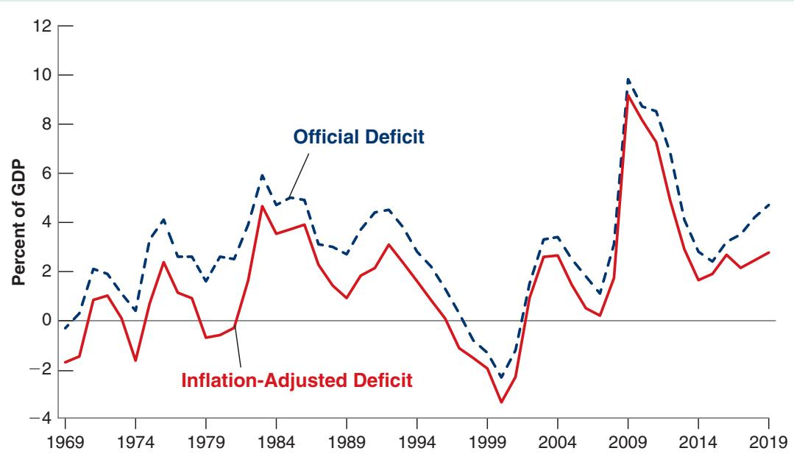
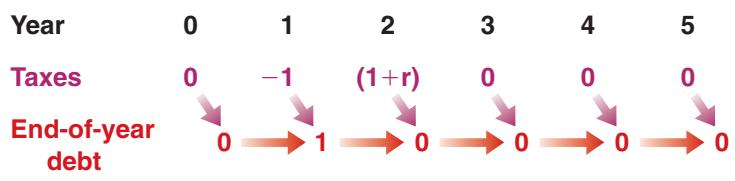
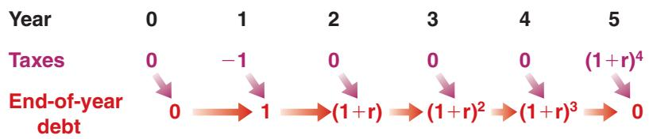
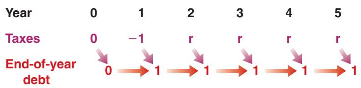

# Inflation Accounting and the Measurement of Deficits

Official measures of the budget deficit are constructed (dropping the time indexes, which are not needed here) as nominal interest payments, iB, plus spending on goods and services, G, minus taxes net of transfers, T:

$$
\text { official   measure   of   the   deficit } = i B + G - T
$$

This is an accurate measure of the cash flow position of the government. If it is positive, the government is spending more than it receives and must therefore issue new debt. If it is negative, the government buys back previously issued debt.

But this is not an accurate measure of the change in real debt—that is, the change in how much the government owes, expressed in terms of goods rather than dollars.

To see why, consider the following example: Suppose the official measure of the deficit is equal to zero, so the government neither issues nor buys back debt. Suppose inflation is positive and equal to 10%. Then, at the end of the year, the real value of the debt has decreased by 10%. If we define—as we should—the deficit as the change in the real value of government debt, the government has decreased its real debt by 10% over the year. In other words, it has in fact run a budget surplus equal to 10% times the initial level of debt.

More generally: If B is debt and p is inflation, the official measure of the deficit overstates the correct measure by an amount equal to pB. Put another way, the correct measure of the deficit is obtained by subtracting B from the official measure:

$$
\begin{array}{r l} \text {correct measure of the deficit} & = i B + G - T - \pi B \\ & = (i - \pi) B + G - T \\ & = r B + G - T \end{array}
$$

where $r = i - \pi$ is the (realized) real interest rate. The correct measure of the deficit is equal to real interest payments plus government spending minus taxes net of transfers.

The difference between the official and the correct measures of the deficit equals pB. The higher the rate of inflation, p, or the higher the level of debt, B, the more inaccurate the official measure. In countries where both inflation and debt are high, the official measure may record a very large budget deficit, when in fact real government debt is decreasing. This is why you should always do the inflation adjustment before deriving conclusions about the position of fiscal policy.

Figure 1 plots the official measure and the inflationadjusted measure of the (federal) budget deficit for the United States as a percent of GDP since 1969. The official measure shows a deficit in every year from 1970 to 1997. The inflation-adjusted measure shows instead alternating deficits and surpluses until the late 1970s. Both measures, however, show that the deficit became much larger after 1980, that things improved in the 1990s, and that they have deteriorated in the 2000s. Today, with inflation running at about 2% a year and the ratio of debt-to-GDP around 80%, the difference between the two measures is roughly equal to 2% times 80%, or 1.6% of GDP.

  
Figure 1  
Official and Inflation-Adjusted Federal Budget Deficits for the United States since 1969  
Source: FRED: CPIAUCSL, and Tables B-18 and B-19 Economic Report of the President.

If the government runs a deficit, government debt increases as the government borrows to fund the part of spending in excess of revenues. If the government runs a surplus, government debt decreases as the government uses the budget surplus to repay part of its outstanding debt.

Using the definition of the deficit (equation (22.1)), we can rewrite the government budget constraint as

$$
B _ {t} - B _ {t - 1} = r B _ {t - 1} + G _ {t} - T _ {t}\tag{22.2}
$$

The government budget constraint links the change in government debt to the initial level of debt (which affects interest payments) and to current government spending and taxes. It is often convenient to decompose the deficit into the sum of two terms:

■ Interest payments on the debt, $r B _ { t - 1 }$

■ The difference between spending and taxes, $G _ { t } \mathrm { ~ - ~ } T _ { t }$ . This term is called the primary deficit (equivalently, $T _ { t } \mathrm { ~ - ~ } G _ { t }$ is called the primary surplus).

Using this decomposition, we can rewrite equation (22.2) as

$$
\overbrace {B _ {t} - B _ {t - 1}} ^ {\text {Change in the Debt}} = \overbrace {r B _ {t - 1}} ^ {\text {Interest Payments}} + \overbrace {(G _ {t} - T _ {t})} ^ {\text {Primary Deficit}}
$$

Or, moving $B _ { t - 1 }$ to the right side of the equation and reorganizing,

$$
B _ {t} = (1 + r) B _ {t - 1} + \overbrace {(G _ {t} - T _ {t})} ^ {\text {Primary Deficit}}\tag{22.3}
$$

This relation states that the debt at the end of year t equals $( 1 + r )$ times the debt at the end of year t - 1 plus the primary deficit during year t, $( G _ { t } \mathrm { ~ - ~ } T _ { t } )$ . Let’s look at some of its implications. (In this section, I shall assume that the real interest rate is positive, so that, if the primary deficit is equal to zero, debt increases over time. This is not necessarily the case, and I shall return to the assumption later on.)

## Current versus Future Taxes

Consider first a one-year decrease in taxes for the path of debt and future taxes. Start from a situation where, until year 1, the government has balanced its budget, so that initial debt is equal to zero. During year 1, the government decreases taxes by 1 (think 1 billion dollars, for example) for one year. Thus, debt at the end of year 1, $B _ { 1 }$ , is equal to 1. The question we take up: What happens thereafter?

## Full Repayment in Year 2

Suppose the government decides to fully repay the debt during year 2. From equation (22.3), the budget constraint for year 2 is given by

$$
B _ {2} = (1 + r) B _ {1} + (G _ {2} - T _ {2})
$$

If the debt is fully repaid during year 2, then the debt at the end of year 2 is equal to zero, $B _ { 2 } = 0$ . Replacing $B _ { 1 }$ by 1 and $B _ { 2 }$ by 0 and transposing terms gives

$$
T _ {2} - G _ {2} = (1 + r) 1 = (1 + r)
$$

To repay the debt fully during year 2, the government must run a primary surplus equal to $( 1 + r )$ . It can do so in one of two ways: a decrease in spending or an increase in taxes. I shall assume here and in the rest of this section that the adjustment comes through taxes, so that the path of spending is unaffected. It follows that the decrease in taxes by 1 during year 1 must be offset by an increase in taxes by $( 1 + r )$ during year 2.

Full repayment in year 2: $T _ { 1 }$ decreases by 1 1 $T _ { 2 }$ increases by 11 + r2

## Figure 22-1

## Tax Cuts, Debt Repayment, and Debt Stabilization

(a) If the debt is fully repaid during year 2, the decrease in taxes of 1 in year 1 requires an increase in taxes equal to $( 1 + r )$ in year 2. (b) If the debt is fully repaid during year 5, the decrease in taxes of 1 in year 1 requires an increase in taxes equal to $( 1 + r ) ^ { 4 }$ during year 5. (c) If the debt is stabilized from year 2 on, then taxes must be permanently higher by r from year 2 on.

(a) Debt Reimbursement in Year 2  

(b) Debt Reimbursement in Year 5  

(c) Debt Stabilization in Year 2  

The path of taxes and debt corresponding to this case is given in Figure 22-1(a): If the debt is fully repaid during year 2, the decrease in taxes of 1 in year 1 requires an increase in taxes equal to $( 1 + r )$ in year 2.

## Full Repayment in Year t

Now suppose the government decides to wait until year t to repay the debt. From year 2 to year t - 1 the primary deficit is equal to zero; taxes are equal to spending, not including interest payments on the debt.

During year 2, the primary deficit is zero. So, from equation (22.3), debt at the end of year 2 is:

$$
B _ {2} = (1 + r) B _ {1} + 0 = (1 + r) 1 = (1 + r)
$$

where the second equality uses the fact that $B _ { 1 } = 1$

With the primary deficit still equal to zero during year 3, debt at the end of year 3 is

$$
B _ {3} = (1 + r) B _ {2} + 0 = (1 + r) (1 + r) 1 = (1 + r) ^ {2}
$$

Solving for debt at the end of year 4 and so on, it is clear that as long as the government keeps a primary deficit equal to zero, debt grows at a rate equal to the interest rate, and thus debt at the end of year t - 1 is given by

$$
B _ {t - 1} = (1 + r) ^ {t - 2}\tag{22.4}
$$

Even though taxes are cut only in year 1, debt keeps increasing over time, at a rate equal to the interest rate. The reason is simple; although the primary deficit is equal to zero, debt is now positive, and so are interest payments on it. Each year, the government must issue more debt to pay the interest on existing debt.

In year t, the year in which the government decides to repay the debt, the budget constraint is

$$
B _ {t} = (1 + r) B _ {t - 1} + \left(G _ {t} - T _ {t}\right)
$$

If debt is fully repaid during year t, then $B _ { t }$ (debt at the end of year t) is zero. Replacing $B _ { t }$ by zero and $B _ { t - 1 }$ by its expression from equation (22.4) gives

$$
0 = (1 + r) (1 + r) ^ {t - 2} + (G _ {t} - T _ {t})
$$

Add exponents: $( 1 + r )$

$( 1 + r ) ^ { t - 2 } = ( 1 + r ) ^ { t - 1 } .$ See Appendix 2 at the end of this book.

Reorganizing and bringing $\left( G _ { t } - T _ { t } \right)$ to the left side of the equation implies

$$
T _ {t} - G _ {t} = (1 + r) ^ {t - 1}
$$

To repay the debt, the government must run a primary surplus equal to $( 1 + r ) ^ { t - 1 }$ during year t. If the adjustment is done through taxes, the initial decrease in taxes of 1 during year 1 leads to an increase in taxes of $( 1 + r ) ^ { t - 1 }$ during year t. The path of taxes and debt corresponding to the case where debt is repaid in year 5 is given in Figure 22-1(b).

This example yields our first set of conclusions:

■ If government spending is unchanged, a decrease in taxes must eventually be offset by an increase in taxes in the future.

■ The longer the government waits to increase taxes, or the higher the real interest rate is, the higher the eventual increase in taxes must be.

## Debt Stabilization in Year 2

We have assumed so far that the government fully repays the debt. Let’s now look at what happens to taxes if the government only stabilizes the debt. (Stabilizing the debt means changing taxes or spending so that debt remains constant from then on.)

Suppose the government decides to stabilize the debt from year 2 on: the debt at the end of year 2 and thereafter remains at the same level as at the end of year 1.

From equation (22.3), the budget constraint for year 2 is

$$
B _ {2} = (1 + r) B _ {1} + (G _ {2} - T _ {2})
$$

Under our assumption that debt is stabilized in year 2, $B _ { 2 } = B _ { 1 } = 1$ . Setting $B _ { 2 } = B _ { 1 } = 1$ in the preceding equation yields

$$
1 = (1 + r) + (G _ {2} - T _ {2})
$$

Reorganizing and bringing $\left( G _ { 2 } \mathrm { ~ - ~ } T _ { 2 } \right)$ to the left side of the equation,

$$
T _ {2} - G _ {2} = (1 + r) - 1 = r
$$

To avoid a further increase in debt during year 2, the government must run a primary surplus equal to real interest payments on the existing debt (recall our assumption that the real interest rate is positive). It must do so in each of the following years as well. Each year, the primary surplus must be sufficient to cover interest payments, leaving the debt level unchanged. The path of taxes and debt is shown in Figure 22-1(c). Debt remains equal to 1 from year 1 on. Taxes are permanently higher from year 2 on, by an amount equal to r; equivalently, from year 2 on, the government runs a primary surplus equal to r.

The logic of this argument extends directly to the case where the government waits until year t to stabilize the debt. Whenever the government stabilizes, it must, each year from then on, run a primary surplus sufficient to pay the interest on the debt.

This example yields our second set of conclusions:

■ The legacy of past deficits is higher government debt today.

■ To stabilize the debt, the government must eliminate the deficit.

■ To eliminate the deficit, and if the interest rate is positive, the government must run a primary surplus equal to the interest payments on the existing debt. This requires higher taxes forever.

## The Evolution of the Debt-to-GDP Ratio

We have focused so far on the evolution of the level of debt. But in an economy in which output grows over time, it makes more sense to focus instead on the ratio of debt to output.

To see how this change in focus modifies our conclusions, we need to go from equation (22.3) to an equation that gives the evolution of the debt-to-GDP ratio—the debt ratio for short.

Deriving the evolution of the debt ratio takes a few steps. Do not worry; the final equation is easy to understand.

First divide both sides of equation (22.3) by real output, $Y _ { t } ,$ to get

$$
\frac {B _ {t}}{Y _ {t}} = (1 + r) \frac {B _ {t - 1}}{Y _ {t}} + \frac {G _ {t} - T _ {t}}{Y _ {t}}
$$

Next rewrite $B _ { t - 1 } / Y _ { t }$ as $\left( B _ { t - 1 } / Y _ { t - 1 } \right) \left( Y _ { t - 1 } / Y _ { t } \right)$ (in other words, multiply the numerator and the denominator by $Y _ { t - 1 } )$

Start from $Y _ { t } = ( 1 + g ) Y _ { t - 1 } .$ Divide both sides by Y to get $1 = ( 1 + g ) Y _ { t - 1 } / Y _ { t } .$ Reorganize to get $Y _ { t - 1 } / Y _ { t } = 1 / ( 1 + g )$ This approximation is derived as proposition 6 in Appendix 2 at the end of this book.

$$
\frac {B _ {t}}{Y _ {t}} = (1 + r) \bigg (\frac {Y _ {t - 1}}{Y _ {t}} \bigg) \frac {B _ {t - 1}}{Y _ {t - 1}} + \frac {G _ {t} - T _ {t}}{Y _ {t}}
$$

Note that all the terms in the equation are now in terms of ratios to output, Y. To simplify this equation, assume that output growth is constant and denote the growth rate of output by g, soc $Y _ { t - 1 } / Y _ { t }$ can be written as $1 / ( 1 + g )$ . And use the approximation $( 1 + r ) / ( 1 + g ) \approx 1 + r - g .$

Using these two assumptions, rewrite the preceding equation as

$$
\frac {B _ {t}}{Y _ {t}} = (1 + r - g) \frac {B _ {t - 1}}{Y _ {t - 1}} + \frac {G _ {t} - T _ {t}}{Y _ {t}}
$$

Finally, reorganize to get

$$
\frac {B _ {t}}{Y _ {t}} - \frac {B _ {t - 1}}{Y _ {t - 1}} = (r - g) \frac {B _ {t - 1}}{Y _ {t - 1}} + \frac {G _ {t} - T _ {t}}{Y _ {t}}\tag{22.5}
$$

This took many steps, but the final relation has a simple interpretation. The change in the debt ratio over time (the left side of the equation) is equal to the sum of two terms:

■ The first term is the difference between the real interest rate and the growth rate, times the initial debt ratio.

■ The second term is the ratio of the primary deficit to GDP.

If two variables (here debt and GDP) grow at rates r and g respectively, then their ratio (here the ratio of debt to GDP) will grow at rate $r \mathrm { ~ - ~ } g .$ See proposition 8 in Appendix 2 at the end of this book.

Compare equation (22.5), which gives the evolution of the ratio of debt to GDP, to equation (22.2), which gives the evolution of the level of debt itself. Assume that the primary deficit (and therefore the ratio of the primary deficit to GDP is equal to zero. Then, whether debt increases or decreases depends on whether the interest rate is positive or not. However, whether the $d e b t { - } t o { - } G D P$ ratio increases or decreases depends on whether the interest rate is larger or smaller than the growth rate. (More on this in Section 22-5.)c

Equation (22.5) implies that the increase in the ratio of debt to GDP will be larger:

■ the higher the real interest rate,

■ the lower the growth rate of output,

■ the higher the initial debt ratio,

■ the higher the ratio of the primary deficit to GDP.

Building on this relation, the Focus Box “How Countries Decreased Their Debt Ratios after World War II” shows how governments that inherited high debt ratios at the end of the war steadily decreased them through a combination of low real interest rates, high growth rates, and primary surpluses. The next section shows how our analysis can also be used to shed light on a number of other fiscal policy issues.
