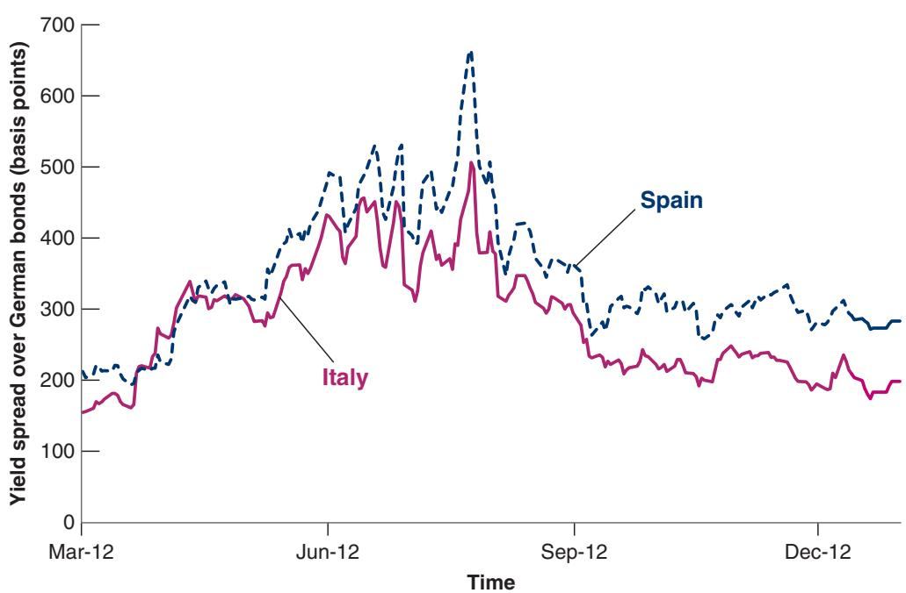
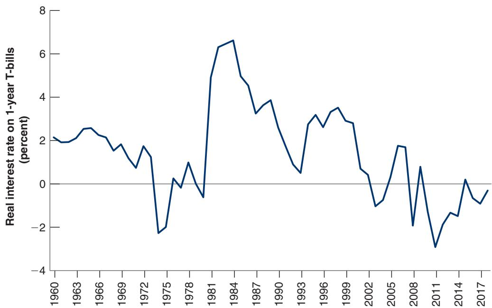

# Deficits, Consumption, and Investment in the United States during World War II

In 1939, the share of US government spending on goods and services in GDP was 15%. By 1944, it had increased to 45%! The increase was due to increased spending on national defense, which went from 1% of GDP in 1939 to 36% in 1944.

Faced with such a massive increase in spending, the US government reacted with large tax increases. For the first time in US history, the individual income tax became a major source of revenues: individual income tax revenues, which were 1% of GDP in 1939, increased to 8.5% in 1944. But the tax increases were still far less than the increase in government expenditures. The increase in federal revenues, from 7.2% of GDP in 1939 to 22.7% in 1944, was only a little more than half the increase in expenditures.

The result was a sequence of large budget deficits. By 1944, the federal deficit reached 22% of GDP. The ratio of debt to GDP, already high at 53% in 1939 because of the deficits the government had run during the Great Depression, reached 110%!

Was the increase in government spending achieved at the expense of consumption or private investment? (As we saw in

Chapter 18, it could in principle have come from higher imports and a current account deficit. But the United States had nobody to borrow from during the war. Rather, it was lending to some of its allies. Loans and gifts from the US government to foreign countries were equal to 6% of US GDP in 1944.)

It was met in large part by a decrease in consumption. The share of consumption in GDP fell by 23 percentage points, from 74% to 51%. Part of the decrease in consumption may have been due to anticipations of higher taxes after the war; part of it was due to the unavailability of many consumer durables. Patriotism also probably motivated people to save more and buy the war bonds issued by the government to finance the war.

It was also met by a 6% decrease in the share of (private) investment in GDP—from 10% to 4%. Part of the burden of the war was therefore passed on, in the form of lower capital accumulation, to those living after the war.

Suppose that the government relies on deficit finance. With government spending sharply up, there will be a large increase in the demand for goods. Given our assumption that output stays the same, the interest rate will have to increase enough to maintain equilibrium. Investment, which depends on the interest rate, will decrease sharply. (More realistically, in a war economy, the government may use direct measures to decrease non–war-related investment, without resorting to a high interest rate.)

■ Suppose instead that the government finances the spending increase through an increase in taxes—say, income taxes. Consumption will decline sharply. Exactly how much depends on consumers’ expectations: The longer they expect the war to last, the longer they will expect higher taxes to last, and the more they will decrease their consumption. In any case, the increase in government spending will be partly offset by a decrease in consumption. Interest rates will increase by less than they would have increased under deficit spending, and investment will therefore decrease by less.

Assume that the economy is closed, so that Y = C + I + G. Suppose that G goes up, and Y remains the same. Then C + I must decrease. If taxes are not increased, most of the decrease will come

In short, for a given output, the increase in government spending requires either a decrease in consumption or a decrease in investment. Whether the government relies on tax increases or deficits determines whether consumption or investment does more of the adjustment when government spending increases.

from a decrease in I. If taxesb are increased, most of the decrease will come from a decrease in C.

How does this affect who bears the burden of the war? The more the government relies on deficits, the smaller the decrease in consumption during the war and the larger the decrease in investment. Lower investment means a lower capital stock after the war and therefore lower output after the war. By reducing capital accumulation, deficits become a way of passing some of the burden of the war onto future generations.

## Reducing Tax Distortions

There is another argument for running deficits, not only during wars but also, more generally, in times when government spending is exceptionally high. Think, for example, of reconstruction after an earthquake or the costs involved in the reunification of Germany in the early 1990s.

The argument is as follows: If the government were to increase taxes to finance the temporary increase in spending, tax rates would have to be very high. Very high tax rates can lead to very high economic distortions. Faced with very high tax rates, people work less or engage in illegal, untaxed activities. Rather than moving the tax rate up and down to always balance the budget, it is better (from the point of view of reducing distortions) to maintain a relatively constant tax rate—to smooth taxes. Tax smoothing implies running large deficits when government spending is exceptionally high and small surpluses the rest of the time.

## 22-4 THE DANGERS OF HIGH DEBT

We have seen that high debt requires higher taxes in the future. A lesson from history is that high debt can also lead to vicious cycles, making the conduct of fiscal policy extremely difficult. Let’s look at this more closely.

## High Debt, Default Risk, and Vicious Cycles

Return to equation (22.5):

$$
\frac {B _ {t}}{Y _ {t}} - \frac {B _ {t - 1}}{Y _ {t - 1}} = (r - g) \frac {B _ {t - 1}}{Y _ {t - 1}} + \frac {(G _ {t} - T _ {t})}{Y _ {t}}
$$

Take a country with a high debt ratio, say, 100%. Suppose the real interest rate is 3% and the growth rate is 2%. The first term on the right is 13% - 2%2 times $1 0 0 \% = 1 \%$ of GDP. Suppose further that the government is running a primary surplus of 1% of output, so just enough to keep the debt ratio constant (the right side of the equation equals $( 3 \% - 2 \% ) \times 1 0 0 \% + ( - 1 \% ) = 0 \%$

Now suppose financial investors start to worry that the government may not be able to fully repay the debt. They ask for a higher interest rate to compensate for what they perceive as a higher risk of default on the debt. This makes it more difficult for the government to stabilize the debt. Suppose, for example, that the interest rate increases from 3% to 8%. Then, just to stabilize the debt, the government needs to run a primary surplus of 6% of output (the right side of the equation is then equal to $( 8 \% - 2 \% ) \times 1 0 0 \% + ( - 6 \% ) = 0 )$

This should remind you of bank runs and the discussion in Chapter 6. If people believe a bank is not solvent and decide to withdraw their funds, the bank may have to sell its assets at fire sale prices and become insolvent,

Suppose that, in response to the increase in the interest rate, the government takes measures to increase the primary surplus to 6% of output. The spending cuts or tax increases that are needed are likely to prove politically costly, potentially generating more political uncertainty, a higher risk of default, and thus a further increase in the interest rate. Also, the sharp fiscal contraction is likely to lead to a recession, decreasing the growth rate. Both the increase in the real interest rate and the decrease in growth further increase $( r - g )$ , requiring an even larger budget surplus to stabilize the debt. At some point, the government may become unable to increase the primary surplus sufficiently, and the debt ratio starts increasing, leading investors to become even more worried and to require an even higher interest rate. Increases in the interest rate and increases in the debt ratio feed on each other. In short, the higher the ratio of debt to GDP, the larger the potential for catastrophic debt dynamics. Even if the fear that the government may not fully repay the debt was initially unfounded, it can easily become self-fulfilling. The higher interest that the government must pay on its debt can lead the government to lose control of its budget and lead to an increase in debt to a level such that the government is unable to repay the debt, thus validating the initial fears.

This is far from an abstract issue. Let’s look again at what happened in the euro area during the crisis. Figure 22-2 shows the evolution of interest rates on Italian and Spanish government bonds from March to December 2012. For each country, it plots the difference, also called the spread, between the two-year interest rate on the country’s government bonds and the two-year interest rate on German government bonds. The reason for comparing interest rates to German interest rates is that German bonds are considered nearly riskless. The spreads are measured, on the vertical axis, in basis points (a basis point is a hundredth of a percent).

Both spreads started rising in March 2012. Toward the end of July, the spread on Italian bonds reached 500 basis points (equivalently, 5%), and the spread on Spanish bonds, 660 basis points (6.6%). These spreads reflected two worries: first, that the Italian and Spanish governments might default on their debt, and second, that they might devalue. In principle, in a monetary union, such as the euro area, no one should expect a devaluation unless markets start thinking that the monetary union might break up and that countries might reintroduce national currencies at a devalued exchange rate. This is exactly what investors worried about in the spring and summer of 2012. We can understand why by going back to our discussion of self-fulfilling debt crises.

Consider Italy, for instance. In March, the interest on Italian two-year bonds was below 3%; this was the sum of the interest on German two-year bonds, slightly below 1%, plus a 2% risk spread due to investors’ concerns about the Italian government’s creditworthiness. The country had at the time (and still has) a debt-to-GDP ratio above 130%. With interest below 3% such a high debt burden was sustainable; Italy was generating primary budget surpluses sufficient to keep the debt stable, although at that high level. Italy was fragile (because the debt was so high) but in a “good equilibrium.” At this point investors started asking themselves what would happen if, for some reason, interest rates on Italian bonds were to double, to 6%. They concluded that if that happened, it was unlikely that Italy would be able to raise its primary surplus high enough to keep the debt stable. It was more likely that the country would enter a debt spiral and end up defaulting. At that point Italy might decide to abandon the monetary union and rely on a devaluation to improve its competitiveness and

## Figure 22-2

## The Increase in European Bond Spreads

The spreads on Italian and Spanish two-year government bonds over German two-year bonds increased sharply between March and July 2012. At the end of July, when the European Central Bank stated that it would do whatever was necessary to prevent a breakup of the euro, the spreads decreased.

Go back to Section 20-2 for a discussion of how, under fixed exchange rates, the expectation of a devaluation leads to high interest rates. The same is true for a country in a common currency area.

Source: Haver Analytics.

support growth because defaults are usually accompanied by sharp recessions. The fear that this might happen shifted Italy from a “good” to a “bad” equilibrium. As investors recognized that a default and an exit from the euro were a possibility, interest rates jumped to 6%, and this increase in interest rates validated the initial fears. Eventually, it was the European Central Bank (ECB) that shifted Italy back to the good equilibrium. On July 26, 2012, the president of the bank, Mario Draghi, clearly said that a breakup of the euro was out of question and that the ECB would do whatever was necessary to avoid it. Investors believed the promise and Italy shifted back to the good equilibrium.

Thus, Italy and Spain succeeded, with the help of the ECB, in avoiding bad debt dynamics and default. What if a government does not succeed in stabilizing the debt and enters a debt spiral? Then, historically, one of two things happens: The government either explicitly defaults on its debt or relies increasingly on money finance. Let’s look at each outcome.

## Debt Default

At some point, when a government finds itself unable to repay the outstanding debt, it may decide to default. Default is often partial, however, and creditors take what is known as a haircut. A haircut of 30%, for example, means that creditors receive only 70% of what they were owed. Default also comes under many names, many of them euphemisms—probably to make the prospects more appealing (or less unappealing) to creditors. It is called debt restructuring, or debt rescheduling (when interest payments are deferred rather than cancelled), or, quite ironically, private sector involvement (the private sector, that is, the creditors, are asked to get involved, i.e., to accept a haircut). It may be unilaterally imposed by the government, or it may be the result of a negotiation with creditors, who, knowing that they will not be fully repaid in any case, may prefer to work out a deal with the government. This is what happened to Greece in 2012 when private creditors accepted a haircut of roughly 50%.

When debt is very high, default would seem to be an appealing solution. Having a lower level of debt after default reduces the size of the required fiscal consolidation and thus makes it more credible. It lowers required taxes, potentially allowing for higher growth. But default comes with high costs. If debt is held, for example, by domestic pension funds, as is often the case, retirees may suffer very much from the default. If it is held by domestic banks, then some banks may go bankrupt, with major adverse effects on the economy. If debt is held instead mostly by foreigners, then the country’s international reputation may be lost and it may be difficult for the government to borrow from abroad for a long time. So, in general, and rightly so, governments are very reluctant to default on their debt.

## Money Financec

The other outcome is money finance. So far we have assumed that the only way a government could finance itself was by selling bonds. There is however another possibility. The government can finance itself by, in effect, printing money. The way it does this is not actually by printing money itself but by issuing bonds and then requiring the central bank to buy its bonds in exchange for money. This process is called money finance or debt monetization. Because, in this case, the rate of money creation is determined by the government deficit rather than by decisions of the central bank, this is also known as fiscal dominance of monetary policy.

How large a deficit can a government finance through such money creation? Let H be the amount of central bank money in the economy. (I shall refer to central bank money simply as money for short in what follows.) Let ∆H be money creation; that is, the change in the nominal money stock from one month to the next. The revenue, in real terms (that is, in terms of goods), that the government generates by creating an amount of money equal to ∆H is therefore $\Delta H / P _ { - }$ —money creation during the period divided by the price level. This revenue from money creation is called seignorage.

$$
\text {seignorage} = \frac {\Delta H}{P}
$$

The word seignorage is revealing. The right to issue money was a precious source of revenue for the seigneurs, or lords, of the past. They could buy the goods they wanted by issuing their own money and using it to pay for the goods.

Seignorage is equal to money creation divided by the price level. To see what rate of (central bank) nominal money growth is required to generate a given amount of seignorage, rewrite $\Delta H / P$ as

$$
\frac {\Delta H}{P} = \frac {\Delta H}{H} \frac {H}{P}
$$

In words: We can think of seignorage $( \Delta H / P )$ as the product of the rate of nominal money growth $( \Delta H / H )$ and the real money stock $( H / P )$ . Replacing this expression in the previous equation gives

$$
\text {seignorage} = \frac {\Delta H}{H} \frac {H}{P}
$$

This gives us a relation between seignorage, the rate of nominal money growth, and real money balances. To think about relevant magnitudes, it is convenient to take one more step and divide both sides of the equation by, say, monthly GDP, Y, to get

$$
\frac {\text {seignorage}}{Y} = \frac {\Delta H}{H} \bigg (\frac {H / P}{Y} \bigg)\tag{22.6}
$$

Suppose the government is running a budget deficit equal to 10% of GDP and decides to finance it through seignorage, so 1defici $\left. \langle Y \rangle \right. = \mathrm { ( s e i g n o r a g e / } Y \mathrm { ) } = \mathrm { 1 0 \% }$ . The average ratio of central bank money to monthly GDP in advanced countries is roughly equal to 1, so choose $( H / P ) / Y = 1$ . This implies that nominal money growth must satisfy

$$
10\% = \frac{\Delta H}{H} \text{times} 1 \Rightarrow \frac{\Delta H}{H} = 10\%
$$

Thus, to finance a deficit of 10% of GDP through seignorage, given a ratio of central bank money to monthly GDP of 1, the monthly growth rate of nominal money must be equal to 10%.

This is surely a high rate of money growth, but one might conclude that, in exceptional circumstances, it may be an acceptable price to pay to finance the deficit. Unfortunately, this conclusion would be wrong. As money growth increases, inflation typically follows. And high inflation leads people to want to reduce their demand for money, and in turn the demand for central bank money. In other words, as the rate of money growth increases, the real money balances that people want to hold decreases. If, for example, they were willing to hold money balances equal to one month of income when inflation was low, they may decide to reduce it to one week of income or less when inflation reaches 10%. In terms of equation (22.6), as $( \Delta H / H )$ increases, $\left( H / P \right) / Y$ decreases. And so, to achieve the same level of revenues, the government needs to increase the rate of money growth further. But higher money growth leads to further inflation, a further decrease in $( H / P ) / Y$ , and the need for further money growth.

This is an example of a general proposition. As you increase the tax rate (here the rate of inflation), the tax base (here real money balances) decreases.

Soon, high inflation turns into hyperinflation, the term that economists use for very high inflation—typically inflation in excess of 30% per month. The Focus Box “Money Financing and Hyperinflations” describes some of the most famous episodes.

## Money Financing and Hyperinflations

We saw in this chapter that the attempt to finance a large fiscal deficit through money creation can lead to high inflation, or even hyperinflation. This scenario has played out many times in the past. (At the time of writing, it is playing out in Venezuela, where annual inflation hit 80,000% in 2018!) You probably have heard of the hyperinflation that took place in post–World War I Germany. In 1913, the value of all currency circulating in Germany was 6 billion marks. Ten years later, in October 1923, 6 billion marks was barely enough to buy a one-kilo loaf of rye bread in Berlin. A month later, the price of the same loaf of bread had increased to 428 billion marks. But the German hyperinflation is not the only example.

Table 1 summarizes the seven major hyperinflations that followed World War I and World War II. They share a number of features. They were all short (lasting a year or so) but intense, with money growth and inflation running at 50% per month or more. The increases in the price levels were staggering. As you can see, the largest price increase occurred not in Germany but in Hungary after World War II: What cost 1 Hungarian pengő in August 1945 cost 3,800 trillions of trillions of pengős less than a year later! And Hungary has the distinction of having not one but two hyperinflations, one after World War I and the other after World War II.

Inflation rates of this magnitude have not been seen since the 1940s. But many countries have experienced high inflation as a result of money finance. Monthly inflation ran above 20% in many Latin American countries in the late 1980s. A recent example of high inflation is Zimbabwe, where, in 2008, monthly inflation reached 500% before a stabilization program was adopted in early 2009. At the time of writing, monthly inflation has reached 300% in Venezuela. The photo shows a creative and more valuable use of bolívares, the Venezuelan money.

It will come as no surprise that hyperinflations have enormous economic costs:

The transaction system works less and less well. One famous example of inefficient exchange occurred in Germany at the end of its hyperinflation in 1923.

People had to use wheelbarrows to cart around the huge amounts of currency needed for daily transactions.

Price signals become less and less useful. Because prices change so often, it is difficult for consumers and producers to assess the relative prices of goods and to make informed decisions. The evidence shows that the higher the rate of inflation, the higher the variation in the relative prices of different goods. Thus, the price system, which is crucial to the functioning of a market economy, also becomes less and less efficient. A joke heard in Israel during the high inflation of the 1980s: “Why is it cheaper to take the taxi rather than the bus? Because in the bus, you have to pay the fare at the beginning of the ride. In the taxi, you pay only at the end.”

Swings in the inflation rate become larger. It becomes harder to predict what inflation will be in the near future, whether it will be, say, 500% or 1,000% over the next year. Borrowing at a given nominal interest rate becomes more and more of a gamble. If we borrow at, say, 1,000% for a year, we may end up paying a real interest rate of 500% or 0%: a large difference! The result is that borrowing and lending typically come to a stop in the final months of hyperinflation, leading to a large decline in investment.

Table 1 Seven Hyperinflations of the 1920s and 1940s

<table><tr><td>Country</td><td>Start</td><td>End</td><td> $P_T/P_0$ </td><td>Average Monthly Inflation Rate (%)</td><td>Average Monthly Money Growth (%)</td></tr><tr><td>Austria</td><td>Oct. 1921</td><td>Aug. 1922</td><td>70</td><td>47</td><td>31</td></tr><tr><td>Germany</td><td>Aug. 1922</td><td>Nov. 1923</td><td> $1.0 \times 10^{10}$ </td><td>322</td><td>314</td></tr><tr><td>Greece</td><td>Nov. 1943</td><td>Nov. 1944</td><td> $4.7 \times 10^6$ </td><td>365</td><td>220</td></tr><tr><td>Hungary 1</td><td>Mar. 1923</td><td>Feb. 1924</td><td>44</td><td>46</td><td>33</td></tr><tr><td>Hungary 2</td><td>Aug. 1945</td><td>Jul. 1946</td><td> $3.8 \times 10^{27}$ </td><td>19,800</td><td>12,200</td></tr><tr><td>Poland</td><td>Jan. 1923</td><td>Jan. 1924</td><td>699</td><td>82</td><td>72</td></tr><tr><td>Russia</td><td>Dec. 1921</td><td>Jan. 1924</td><td> $1.2 \times 10^5$ </td><td>57</td><td>49</td></tr><tr><td colspan="6"> $P_T/P_0$ : Price level in the last month of hyperinflation divided by the price level in the first month.</td></tr><tr><td colspan="6">Source: Philip Cagan, “The Monetary Dynamics of Hyperinflation,” in Milton Friedman ed., Studies in the Quantity Theory of Money (University of Chicago Press, 1956), Table 1.</td></tr></table>

Hyperinflation ends only when fiscal policy is dramatically improved and the need to finance the deficit through money creation is eliminated. By then, the damage has been done.

As inflation becomes very high, there is typically an increasing consensus that it should be stopped. Eventually, the government reduces the deficit and no longer has recourse to money finance. Inflation stops, but not before the economy has suffered substantial costs.

## 22-5 THE CHALLENGES FACING US FISCAL POLICY TODAY

How bad is the debt situation in the United States today? In 2018, the debt issued by the federal government—the number that is typically quoted in newspapers, called gross debt—stood at \$21,300 billion, or 104% of GDP. Part of that debt was held, however, by some government entities—for example, by the social security trust fund. The more relevant number, namely debt held by the public, called net debt, stood at \$5,750 billion, or 77% of GDP, a substantially lower ratio than the gross debt ratio, although still a historically high number.

The federal deficit stood at \$780 billion, or 3.8% of GDP. The ratio of interest payments to GDP was 1.6%, so the primary deficit (that is, the deficit net of interest payments) was equal to $3 . 8 \% - \ 1 . 6 \% = 2 . 2 \%$ ; again, not a very high number, but still historically high in the absence of a war or a recession.

To see what this implied for debt dynamics, let’s return to equation (22.5). Recall that the change in the debt ratio is equal to the sum of two terms: first, the difference between the interest rate and the growth rate, times the debt-to-GDP ratio; second, the ratio of the primary deficit to GDP:

$$
\frac {B _ {t}}{Y _ {t}} - \frac {B _ {t - 1}}{Y _ {t - 1}} = (r - g) \frac {B _ {t - 1}}{Y _ {t - 1}} + \frac {(G _ {t} - T _ {t})}{Y _ {t}}
$$

In 2018, the real interest rate on government debt was 0.5%—the difference between the nominal interest rate, 2.5%, and inflation, 2%. The growth rate was equal to 2.9%. The debt-to-GDP ratio was 77%, so the first term above was equal to $( 0 . 5 \% - 2 . 9 \% ) \times 7 7 \% = - 1$ .8%. Absent a primary deficit, the debt-to-GDP ratio would have declined by −1.8%. The primary deficit was positive, however, equal to 2.2%. Putting the two together, this implies that the debt ratio increased slightly, by $- 1 . 8 \% + \ 2 . 2 \% = 0 . 4 \%$ of GDP.

An increase in the debt-to-GDP ratio of 0.4% of GDP is small and suggests little reason for concern. The future, however, may see larger increases in debt: At 2.9%, growth was unusually high in 2018 and is forecast to be closer to 2%. And looking forward, two major government spending items look set to substantially increase:

■ Social security payments are projected to increase from 4.9% of GDP in 2018 to 6.0% in 2029, reflecting the aging of America—the rapid increase in the proportion of people older than age 65 that will take place as the Baby Boom generation reaches retirement age.

■ Medicare (the program that provides health care to retirees) and Medicaid (the program that provides health care to poor people) are projected to increase from 5.4% of GDP in 2018 to 7.2% in 2029. This large increase reflects the increasing cost of health care in the case of Medicaid and the increasing number of retirees in the case of Medicare.

Given these expected increases in spending, and for the reasons we discussed earlier in the chapter, it may be desirable to increase taxes and decrease the debt-to-GDP ratio

This has been true not only in the United States, but in most countries. Fiscal consolidation often leads to cuts in public investment rather than in current spending, because it is less visible, affects current voters less, and is thus politically less costly.

now so as to have current taxpayers assume more of the burden of the increased future spending, as well as to avoid large, potentially distortionary, increases in taxes later on. This suggests starting to decrease the debt-to-GDP ratio now by reducing primary deficits or even generating primary surpluses, rather than letting debt increase further.

How much and at what rate should primary deficits be reduced? There are three relevant arguments here.

The first is that the real interest rate the government pays on its debt is currently very low, indeed lower than the growth rate. Figure 22-3 shows the evolution of the real interest rate, constructed as the nominal one-year T-bill rate minus actual CPI inflation since 1960. It shows that, after a sharp increase in the 1980s, the real rate has decreased from a peak of nearly 7% in 1984 to −0.3% in 2018. Current forecasts are that the interest rate will remain lower than the growth rate for the foreseeable future.

This has two implications. The first is that, while government debt is high, debt service, i.e., the interest paid on the debt, is still low. The second is that, if the interest rate remains lower than the growth rate, the government can decrease the ratio of debt to GDP over time while still running primary deficits. To see this, go back to equation (22.5) and the computation of debt dynamics we went through earlier. In 2018, absent a primary deficit, the debt-to-GDP ratio would have decreased by 1.8%. Put another way, the government could have run a primary deficit of up to 1.8% of GDP, and the debt-to-GDP ratio would still have declined. The difference between the growth rate and the interest rate is likely to be smaller in the future, but so long as the interest rate remains less than the growth rate, this implies that the government can run a (limited) primary deficit and still have the debt-to-GDP ratio decrease over time.

The second argument focuses on public investment. One of the ways the government deficit was reduced after the large increase during the Great Recession was by cutting public investment. In 2018, the ratio of government investment to GDP was the lowest it had been since 1950. There is a strong case for increasing it, and the case is strengthened by the fact that the cost of borrowing for the government is very low. Thus, there is an argument for accepting or even increasing the current primary deficits, if these are used to finance public investment instead of current spending or reductions in taxes.

The third argument may be the most important. We saw in Chapter 5 that to avoid a decrease in output in response to a reduction in the budget deficit the central bank must

After sharply increasing in the early 1980s, the real interest rate has steadily declined.

decrease the interest rate. While, at the time of writing, the US economy is no longer at the zero lower bound, the nominal policy rate, at 2.4%, is still low. A large reduction in primary deficits would require a large decrease in the policy rate, a decrease that may be infeasible given the zero lower bound.

A back-of-the-envelope computation is useful here: Suppose that the multiplier associated with a reduction in government spending is equal to 1.5, so a 1% reduction in the primary deficit decreases demand by 1.5%. Suppose that a 1% decrease in the policy rate increases demand by 1%. Then, to avoid a decrease in output, a reduction in the ratio of the primary deficit to GDP by 2% would require a decrease in the policy rate of 3%, thus a larger decrease than is feasible given the zero lower bound. Put another way, given the limits on monetary policy, primary deficits may be needed to maintain output at potential.

To summarize: The US debt-to-GDP ratio is high and slowly increasing over time. Given the likely increases in spending in the future, it would be desirable to reduce primary deficits and reduce the debt ratio. Low interest rates, and by implication the low cost of debt, imply that it can be done slowly. And because low interest rates, together with the zero lower bound, put sharp limits on the use of monetary policy, they also imply that it has to be done slowly so as to avoid a decrease in demand and output.

## SUMMARY

The government budget constraint gives the evolution of government debt as a function of spending and taxes. One way of expressing the constraint is that the change in debt (the deficit) is equal to the primary deficit plus interest payments on the debt. The primary deficit is the difference between government spending on goods and services, G, and taxes net of transfers, T.

The evolution of the ratio of debt to GDP depends on four factors: the interest rate, the growth rate, the initial debt ratio, and the primary surplus.

Under the Ricardian equivalence proposition, a larger deficit is offset by an equal increase in private saving. Deficits have no effect on demand or output. The accumulation of debt does not affect capital accumulation. In practice, however, Ricardian equivalence fails and larger deficits lead to higher demand and higher output in the short run. The accumulation of debt leads to lower capital accumulation, and thus to lower output in the long run.

To stabilize the economy, the government should run deficits during recessions and surpluses during booms. The cyclically adjusted deficit tells us what the deficit would be, under existing tax and spending rules, if output were at its potential level.

Deficits are justified in times of high spending, such as wars. Relative to an increase in taxes, deficits lead to higher consumption and lower investment during wars. They therefore shift some of the burden of the war from people living during the war to those living after the war. Deficits also help smooth taxes and reduce tax distortions.

High debt ratios increase the risk of vicious cycles. A higher perceived risk of default can lead to a higher interest rate and an increase in debt. The increase in debt can lead to a higher perceived risk of default and a higher interest rate. Together, both can combine to lead to a debt explosion. Governments may have no choice but to default or to rely on money finance. Money finance may in turn lead to hyperinflation. In either case, the economic costs are likely to be high.

The US debt-to-GDP ratio is high and slowly increasing. It would be desirable to reduce this ratio over time. The limits on the use of monetary policy imply that the reduction will have to be gradual and limited.

