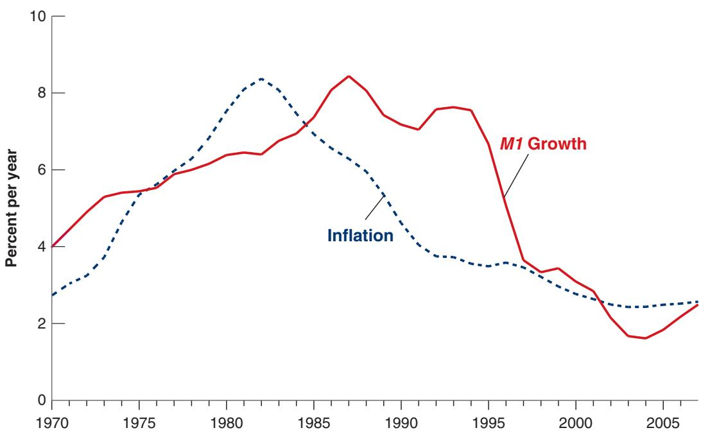

# Monetary Policy: A Summing Up

23

Ftoward a framework for monetary policy, called inflation targeting. It was based ontwo principles: The first was that the primary goal of monetary policy was to keep toward a framework for monetary policy, called inflation targeting. It was based on two principles: The first was that the primary goal of monetary policy was to keep inflation stable and low. The second was that the best way to achieve this goal was to follow, explicitly or implicitly, an interest rate rule, allowing the policy rate to respond to movements in inflation and in activity.

Until the crisis, this framework appeared to work well. Inflation decreased and remained low and stable in most countries. Output fluctuations decreased in amplitude. The period became known as the Great Moderation. Many researchers concluded that better monetary policy was one of the main factors behind the improvement, consolidating the support for this monetary policy framework.

Then the crisis came. It forced macroeconomists and central bankers to reassess along at least two dimensions.

The first is the set of issues raised by the liquidity trap. If and when an economy reaches the zero lower bound, the policy rate can no longer be used to increase activity. This raises two questions: First, can monetary policy be conducted in such a way as to avoid getting to the zero lower bound in the first place? Second, once the economy is at the zero lower bound, are there other tools that the central bank can use to help increase activity?

The second concerns the mandate of the central bank and the tools of monetary policy. From the early 2000s to the start of the crisis, most advanced economies appeared to do well, with sustained output growth and stable inflation. Yet, as we saw in Chapter 6, behind the scenes not everything was fine. Important changes were taking place in the financial system, such as the large increase in leverage and the increased reliance on wholesale funding by banks. In many countries, also, there were sharp increases in housing prices. These factors turned out to be at the source of the crisis. This raises two more questions: Looking forward, should the central bank worry not only about inflation and activity but also about asset prices, stock market booms, housing booms, and risk in the financial sector? And if so, what tools does it have at its disposal?

This chapter reviews what we have learned about monetary policy so far, then describes the logic of inflation targeting and the use of an interest rate rule, and finally discusses where macroeconomists stand on the issues raised by the crisis.

Section 23-1 takes stock of what we have learned in this book so far.

Section 23-2 describes the inflation-targeting framework.

Section 23-3 reviews the costs and benefits of inflation and draws implications for the choice of a target inflation rate.

Section 23-4 describes the monetary policy measures taken by central banks when they hit the zero lower bound and since then.

Section 23-5 discusses the potential role of central banks in ensuring financial stability.

If you remember one basic message from this chapter, it should be: Before the crisis, monetary policy had converged to a framework called inflation targeting. The crisis has forced a reassessment of both the mandate and of the tools, a reassessment that is still going on.

## 23-1 WHAT WE HAVE LEARNED

■ In Chapter 4 we looked at money demand and money supply and the determination of the interest rate.

We saw how the central bank controls the policy rate through changes in the money supply. We saw also that, when the policy rate reaches zero, a case known as the liquidity trap or the zero lower bound, further increases in the money supply have no effect on the policy rate.

■ In Chapter 5 we looked at the short-run effects of monetary policy on output.

We saw that a decrease in the interest rate leads to an increase in spending and, in turn, an increase in output. We saw how monetary and fiscal policy can be used to affect both the level of output and its composition.

■ In Chapter 6, we introduced two important distinctions, first between the nominal and the real interest rate and, second, between the borrowing rate and the policy rate. The real interest rate is equal to the nominal interest rate minus expected inflation. The borrowing rate is equal to the policy rate plus a risk premium.

We saw that what matters for private spending decisions is the real borrowing rate. We discussed how the state of the financial system affects the relation between the policy rate and the borrowing rate.

■ In Chapter 9 we looked at the effects of monetary policy in the medium run.

We saw that, in the medium run, monetary policy affects neither output nor the real interest rate. Output returns to potential, and the real interest rate returns to its natural rate, also called the neutral rate or the Wicksellian rate of interest. Higher money growth does not affect either output or the real interest rate, but leads to higher inflation.

We saw, however, how the zero lower bound may derail this adjustment. High unemployment may lead to deflation, which, at the zero lower bound, leads to a higher real interest rate, which further decreases demand and further increases unemployment.

■ In Chapter 14 we introduced another important distinction, between short-term and long-term interest rates.

We saw that long term-interest rates depend on expectations of future shortterm rates and a term premium. We saw that stock prices depend on expected future short-term rates, future dividends, and an equity premium.

We saw, however, that stock prices may be subject to bubbles or fads, making the prices differ from the fundamental values of the stocks.

■ In Chapter 16 we looked at the effects of expectations on spending and output, and the role of monetary policy in this context.

We saw that monetary policy affects the short-term nominal interest rate, but that spending depends on current and expected future short-term real interest rates. We saw that the effects of monetary policy on output depend crucially on how expectations respond to monetary policy.

■ In Chapter 19 we looked at the effects of monetary policy in an economy open in both goods markets and financial markets.

We saw that, in an open economy, monetary policy affects spending and output not only through the interest rate but also through the exchange rate. An increase in money leads to both a decrease in the interest rate and a depreciation, both of which increase spending and output. We saw that, under fixed exchange rates, the central bank gives up monetary policy as a policy instrument.

■ In Chapter 20 we discussed the pros and cons of flexible exchange rates versus fixed exchange rates.

We saw that, under flexible exchange rates, interest rate movements can lead to large changes in exchange rates; under fixed exchange rates, speculation can lead to an exchange rate crisis and a sharp devaluation. We discussed the pros and cons of adopting a common currency such as the euro, or even giving up monetary policy altogether through the adoption of a currency board or dollarization.

In Chapter 21 we looked at the problems facing macroeconomic policy in general, and monetary policy in particular.

We saw that uncertainty about the effects of policy should lead to more cautious policies. We saw that even well-intentioned policymakers may sometimes not do what is best, and that there is a case to be made for putting restraints on policymakers. We also looked at the benefits of having an independent central bank and of appointing a conservative central banker.

In this chapter we extend the analysis to look first at the inflation targeting framework in place before the crisis, and then at the challenges to monetary policy raised by the crisis.

## 23-2 FROM MONEY TARGETING TO INFLATION TARGETING

One can think of the goals of monetary policy as twofold: First, to maintain low and stable inflation; second, to stabilize output around potential—to avoid or at least limit recessions or booms.

## Money Targeting

Until the 1980s, the strategy was to choose a target rate of money growth and to allow for deviations from that target rate as a function of activity. The rationale was simple. A low target rate of money growth implied a low average rate of inflation. In recessions, the central bank could increase money growth, leading to a decrease in interest rates and an increase in output. In booms, the central bank could decrease money growth, leading to an increase in interest rates and a slowdown in output.

That strategy did not work well.

First, the relation between money growth and inflation turned out to be far from tight, even in the medium run. This is shown in Figure 23-1, which plots 10-year averages of the US inflation rate against 10-year averages of the growth rate of money from 1970 to the crisis (the way to read the figure: The numbers for inflation and for money growth for 2000, for example, are the average inflation rate and the average growth rate of money from 1991 to 2000). The inflation rate is constructed using the consumer price index (CPI) as the price index. The growth rate of nominal money is constructed using the sum of currency and checkable deposits, known as M1, as the measure for the money stock.

The reason for using 10-year averages should be clear. In the short run, changes in nominal money growth affect mostly interest rates and output rather than inflation. It

M1 Growth and Inflation: 10-Year Averages, 1970 to 2007

There is no tight relation between M1 growth and inflation, even in the medium run.

Source: FRED: CPIAUSL, M1SL

is only in the medium run that a relation between nominal money growth and inflation should emerge. Taking 10-year averages of both nominal money growth and inflation is a way of detecting such a medium-run relation. The reason for stopping at the crisis is that, as we saw in Chapter 4, when an economy hits the zero lower bound (which the US economy did at the end of 2008), increases in the money supply no longer have an effect on the policy rate and, by implication, the central bank is no longer able to affect output and inflation; so we exclude the period during which the US economy was stuck at the zero lower bound.

Figure 23-1 shows that, for the United States, the relation between M1 growth and inflation was not tight. True, both went up in the 1970s, and both came down later. But note that inflation started declining in the early 1980s, whereas nominal money growth remained high for another decade and came down only in the 1990s. Average inflation from 1981 to 1990 was down to 4%, while average money growth over the same period was still running at 7.5%.

From Chapter 5, equation (5.3): The real money supply (the left side) must be equal to the real demand for money (the right side):

$$
\frac {M}{P} = Y L (i)
$$

Second, even the relation between the money supply and the interest rate in the short run also turned out to be unreliable. This made money growth an unreliable instrument to affect demand and output.

If, as a result of the introduction of credit cards, the real demand for money halves, then

$$
\frac {M}{P} = \frac {1}{2} Y L (i)
$$

In the short run, $P$ does not c change, and so the interest rate must adjust. In the medium run, P adjusts. For a given level of output and a given interest rate, $M / P$ must halve. Given M, this implies that P must double.

Both problems—the poor relation between money growth and inflation in the medium run, and the poor relation of the interest rate to the money supply in the short run—had the same origin: shifts in the demand for money. An example will help here. Suppose, as a result of the introduction of credit cards, people decide to hold only half the amount of money they held before; in other words, the real demand for money decreases by half. In the short run, at a given price level, this large decrease in the demand for money will lead to a large decrease in the interest rate. In other words, we will see a large decrease in the interest rate with no change in the money supply. (In terms of Figure 4–2 in Chapter 4, money demand will shift to the left, leading to a decrease in the equilibrium interest rate.) In the medium run, at a given interest rate, the price level will adjust and the real money stock will eventually decrease by half. For a given nominal money stock, the price level will eventually double. So, even if the nominal money stock remains constant, there will still be a period of inflation as the price level doubles. During this period, there will be no tight relation between nominal money growth (which is zero) and inflation (which would be positive).

Throughout the 1970s and 1980s, these frequent and large shifts in money demand created serious problems. Central banks found themselves torn between trying to keep a stable target for money growth and staying within announced bands (to maintain credibility), or adjusting to shifts in money demand (to stabilize the interest rate and output in the short run and inflation in the medium run). Starting in the early 1990s, a dramatic rethinking of monetary policy took place based on targeting inflation rather than money growth and the use of an interest rate rule to achieve it. Let’s look at it more closely.

## Inflation Targeting

If one of the main goals of the central bank is to achieve low and stable inflation, why not target inflation directly rather than money growth? And if the way to affect activity in the short run is to rely on the effect of the interest rate on spending, why not focus directly on the interest rate rather than on money growth? This is the reasoning that led to the elaboration of inflation targeting. Central banks committed to achieving a target inflation rate, and decided to use the interest rate as the instrument to achieve it. Let’s look at both parts of the strategy.

Committing to a given inflation target in the medium run is hardly controversial. Trying to achieve a given inflation target in the short run would appear to be much more controversial. Focusing exclusively on inflation would seem to eliminate any role for monetary policy in reducing output fluctuations. But in fact this is not the case.

To see why, return to the Phillips curve relation between inflation, $\pi _ { t } ,$ expected inflation, $\pi _ { t } ^ { e } ,$ and the deviation of the unemployment rate, $u _ { t } ,$ from the natural rate of unemployment, $u _ { n }$ (equation (8.10)):

$$
\pi_ {t} = \pi_ {t} ^ {e} - \alpha (u _ {t} - u _ {n})
$$

Let the inflation target be p. Assume that, thanks to the central bank’s reputation, this target is credible, so that people expect inflation to be equal to the target. The relation becomes:

$$
\pi_ {t} = \bar {\pi} - \alpha (u _ {t} - u _ {n})
$$

Note that, if the central bank can hit its inflation target exactly, so $\pi _ { t } = \bar { \pi }$ , unemployment will be equal to its natural rate. By targeting and achieving a constant rate of inflation in line with inflation expectations, the central bank also keeps unemployment at the natural rate, and by implication keeps output at potential.

$$
\blacktriangleleft 0 = - \alpha (u _ {t} - u _ {n}) \Rightarrow
$$

$$
u _ {t} = u _ {n}
$$

Put strongly: Even if policymakers did not care about inflation per se (they do) but cared only about output, inflation targeting would still make sense. Keeping inflation stable is a way to keep unemployment at the natural rate, or equivalently to keep output at potential. This result has been dubbed the divine coincidence. With a Phillips curve of the form given in equation (8.10), there is no conflict between keeping inflation constant and keeping output at potential. A focus on keeping stable inflation is thus the right approach to monetary policy, in both the short and medium run.

This result is a useful benchmark, but it is too strong. Life is not that nice. The main objection is that, as we saw in Chapter 8, the Phillips curve relation is far from an exact relation. Rather than try to achieve the target inflation rate each period, at the risk of large fluctuations in unemployment, it is better to try to achieve it only over time. So most central banks adopted what is called flexible inflation targeting: When inflation is away from target, rather than trying to return it to target right away, they adjust the interest rate to return to the target inflation rate over time.

## The Interest Rate Rule

Inflation is not under the direct control of the central bank. The policy rate is. Thus, the question is how to set the policy rate to achieve the target rate of inflation. The answer is a simple one: When inflation is higher than the target, increase the policy rate to decrease demand and the pressure on prices; when it is below the target rate of inflation, decrease the policy rate. With this in mind, in the 1990s, John Taylor, at Stanford University, suggested the following rule for the policy rate, a rule now known as the Taylor rule:

■ Let $\pi _ { t }$ be the rate of inflation and $\bar { \pi }$ be the target rate of inflation.

■ Let $i _ { t }$ be the policy rate, that is, the nominal interest rate controlled by the central bank, and i be the target nominal interest rate—the nominal interest rate associated with the neutral rate of interest, $r _ { n } ,$ and the target rate of inflation, pQ , so $\bar { i } = r _ { n } + \bar { \pi }$ ■ Let $u _ { t }$ be the unemployment rate and $u _ { n }$ be the natural unemployment rate.

Think of the central bank as choosing the nominal interest rate, i. (Recall, from Chapter 4, that, through open market operations, and ignoring the liquidity trap, the central bank can achieve any short-term nominal interest rate that it wants.) Then, Taylor argued, the central bank should use the following rule:

$$
i _ {t} = \bar {i} + a (\pi_ {t} - \bar {\pi}) - b (u _ {t} - u _ {n})
$$

where a and b are positive coefficients chosen by the central bank. Let’s look at what the rule says:

■ If inflation is equal to target inflation $( \pi _ { t } = \bar { \pi } )$ 2 and the unemployment rate is equal to the natural rate of unemployment $\left( u _ { t } = u _ { n } \right)$ , then the central bank should set the nominal interest rate, $i _ { t } ,$ equal to its target value, i. This way, the economy can stay on the same path, with inflation equal to the target inflation rate and unemployment equal to the natural rate of unemployment.

一 If inflation is higher than the target $( \pi _ { t } > \bar { \pi } )$ , the central bank should increase the nominal interest rate, $i _ { t } ,$ above i. This higher interest rate will lead to an increase in unemployment, and this increase in unemployment will lead to a decrease in inflation. The coefficient a should therefore reflect how much the central bank cares about inflation. The higher a, the more the central bank will increase the interest rate in response to inflation, the more the economy will slow down, the more unemployment will increase, and the faster inflation will return to the target inflation rate.

Some economists argue that the increase in US inflation in the 1970s was due to the fact that the Fed increased the nominal interest rate less than one-for-one with inflation. The result, they argue, was that an increase in inflation led to a decrease in the real interest rate, which led to higher demand, lower unemployment, more inflation, a further decrease in the real interest rate, and so on.

■ In any case, as Taylor pointed out, a should be larger than one. Why? Because what matters for spending is the real interest rate, not the nominal interest rate. When inflation increases, the central bank, if it wants to decrease spending and output, must increase the real interest rate. In other words, it must increase the nominal interest rate more than one-for-one with inflation.

一 If unemployment is higher than the natural rate of unemployment $\left( u _ { t } > u _ { n } \right)$ , the central bank should decrease the nominal interest rate. The lower nominal interest rate will lead to an increase in output, leading to a decrease in unemployment. The coefficient b should reflect how much the central bank cares about unemployment. The higher b, the more the central bank will be willing to deviate from target inflation to keep unemployment close to the natural rate of unemployment.

In stating this rule, Taylor did not argue that it should be followed blindly. Many other events, such as an exchange rate crisis or the need to change the composition of spending on goods, and thus the mix between monetary policy and fiscal policy, justify changing the nominal interest rate for reasons other than those included in the rule. But, he argued, the rule provided a useful way of thinking about monetary policy. Once the central bank has chosen a target rate of inflation, it should try to achieve it by adjusting the nominal interest rate. The rule it should follow should consider not only current inflation but also current unemployment.

The logic of the rule was convincing, and, by the mid-2000s, most central banks in advanced economies had adopted some form of flexible inflation targeting, that is, the choice of an inflation target together with the use of an interest rule.

Then the crisis came and raised many questions, about the choice of the inflation target, what to do when the interest rate suggested by the interest rule reaches the zero lower bound, and whether and how the central bank should worry about financial stability in addition to inflation and output. The next section discusses the choice of the inflation target, and the following sections discuss other questions raised by the crisis.

## 23-3 THE OPTIMAL INFLATION RATE

Table 23-1 shows that inflation steadily decreased in advanced economies from the early 1980s on. In 1981, average inflation in the OECD was 10.5%; in 2018, it was down to 2.3%. In 1981, only two countries (out of the 24 OECD members at the time) had an inflation rate below 5%; in 2018, the number had increased to 35 out of 36.

Before the crisis, most central banks aimed for an inflation rate of about 2%. Was this the right goal? The answer depends on the costs and benefits of inflation.

## The Costs of Inflation

We saw in Chapter 22 that very high inflation, say a rate of 30% per month or more, can disrupt economic activity. The debate in advanced economies today, however, is not about the costs of inflation rates of 30% or more per month. Rather, it centers on the advantages of, say, 0% versus 4% inflation per year. Within that range, economists identify four main costs of inflation: (1) shoe-leather costs, (2) tax distortions, (3) money illusion, and (4) inflation variability.

## Shoe-Leather Costs

Recall from Chapter 9 that, in the medium run, a higher inflation rate leads to a higher nominal interest rate and so a higher opportunity cost of holding money. As a result, people decrease their money balances by making more trips to the bank—thus the expression shoe-leather costs. These trips would be avoided if inflation were lower and people could be doing other things instead, such as working more or enjoying leisure.

During hyperinflations, shoe-leather costs become quite large. But their importance in times of moderate inflation is limited, at best. If an inflation rate of 4% leads people to go to the bank, say, one more time every month, or to do one more transaction between their money market fund and their checking account each month, this hardly qualifies as a major cost of inflation.

Table 23-1 Inflation Rates in the OECD, 1981–2018

<table><tr><td>Year</td><td>1981</td><td>1990</td><td>2000</td><td>2010</td><td>2018</td></tr><tr><td>OECD average*</td><td>10.5%</td><td>6.2%</td><td>2.8%</td><td>1.2%</td><td>2.3%</td></tr><tr><td>Number of countries with inflation below 5%**</td><td>2/24</td><td>15/24</td><td>24/27</td><td>27/30</td><td>35/36</td></tr></table>

\*Average of GDP deflator inflation rates, using relative GDPs measured at PPP prices as weights. \*\*The second number denotes the number of member countries at the time.

## Tax Distortions

The second cost of inflation comes from the interaction between the tax system and inflation.

Consider, for example, the taxation of capital gains. Taxes on capital gains are typically based on the change in the price in dollars of the asset between the time it was purchased and the time it is sold. This implies that the higher the rate of inflation, the higher the tax. An example will make this clear:

■ Suppose inflation has been running at $\pi \%$ a year for the last 10 years.

■ Suppose also that you bought your house for \$100,000 10 years ago, and you are selling it today for \$100,000 times $( 1 + \pi \% ) ^ { 1 0 }$ ; so its real value is unchanged.

The numerator of the fraction equals the sale price minus the purchase price. The denominator is the sale price.

■ If the capital gains tax is 30%, the effective tax rate on the sale of your house—defined as the ratio of the tax you pay to the price for which you sell your house—is

$$
(30\%) \frac{100,000(1 + \pi\%)^{10} - 100,000}{100,000(1 + \pi\%)^{10}}
$$

Because you are selling your house for the same real price at which you bought it, your real capital gain is zero, so you should not pay any tax. Indeed, if $\pi = 0$ —there has been no inflation—then the effective tax rate is 0. But if, for example, $\pi = 4 \%$ then the effective tax rate is 9.7%: Despite the fact that your real capital gain is zero, you end up paying a high tax.

The problems created by the interactions between taxation and inflation extend beyond capital gains taxes. Although we know that the real rate of return on an asset is the real interest rate, not the nominal interest rate, income for the purpose of income taxation includes nominal interest payments, not real interest payments. Or to take yet another example, until the early 1980s in the United States, the income levels corresponding to different income tax rates were not increased automatically with inflation. As a result, people were pushed into higher tax brackets as their nominal income—but not necessarily their real income—increased over time, an effect known as bracket creep.

You might argue that this cost is not a cost of inflation per se but rather the result of a badly designed tax system. In the house example we just discussed, the government could eliminate the problem if it indexed the purchase price to the price level—that is, it adjusted the purchase price for inflation since the time of purchase—and computed the tax on the difference between the sale price and the adjusted purchase price. Under this computation, there would be no capital gains and therefore no capital gains tax to pay. But because tax codes around the world rarely define the tax base in real terms, the inflation rate matters and leads to distortions.

## Money Illusion

The third cost comes from money illusion—the notion that people appear to make systematic mistakes in assessing nominal versus real changes in incomes and interest rates. A number of computations that would be simple when prices are stable become more complicated when there is inflation. When people compare their income this year to their income in previous years, they must keep track of the history of inflation. When choosing between different assets or deciding how much to consume or save, they must keep track of the difference between the real interest rate and the nominal interest rate. Casual evidence suggests that many people find these computations difficult and often fail to make the relevant distinctions. Economists and psychologists have gathered more formal evidence, and it suggests that inflation often leads people and firms to make incorrect decisions (see the Focus Box “Money Illusion”). If this is the case, then a seemingly simple solution is to have zero inflation.

## Money Illusion

There is a lot of anecdotal evidence that many people fail to properly adjust for inflation in their financial computations. Recently, economists and psychologists have started looking at money illusion more closely. In a recent study, two psychologists, Eldar Shafir at Princeton and Amos Tversky at Stanford, and one economist, Peter Diamond at MIT, designed a survey aimed at finding out how prevalent money illusion is and what causes it. Among the many questions they asked of people in various groups (people at Newark International Airport, people at two New Jersey shopping malls, and a group of Princeton undergraduates) is the following:

Suppose Adam, Barbara, and Carlos each received an inheritance of \$200,000 and each used it immediately to purchase a house. Suppose each sold the house one year after buying it. Economic conditions were, however, different in each case:

During the time Adam owned the house, there was a 25% deflation—the prices of all goods and services decreased by approximately 25%. A year after he bought the house, he sold it for \$154,000 (23% less than what he had paid).

During the time Barbara owned the house, there was no inflation or deflation—the prices of all goods and services did not change significantly during the year. A year after she bought the house, she sold it for \$198,000 (1% less than what he had paid).

During the time Carlos owned the house, there was a 25% inflation—the prices of all goods and services increased by approximately 25%. A year after Carlos bought the house, he sold it for \$246,000 (23% more than what he had paid).

Please rank Adam, Barbara, and Carlos in terms of the success of their house transactions. Assign “1” to the person who made the best deal and “3” to the person who made the worst deal.

In nominal terms, Carlos clearly made the best deal, followed by Barbara, followed by Adam. But what is relevant is how they did in real terms, adjusting for inflation. In real terms, the ranking is reversed. Adam, with a 2% real gain, made the best deal, followed by Barbara (with a 1% loss), followed by Carlos (with a 2% loss).

The survey’s answers are shown below.

<table><tr><td>Rank</td><td>Adam</td><td>Barbara</td><td>Carlos</td></tr><tr><td>1st</td><td>37%</td><td>15%</td><td>48%</td></tr><tr><td>2nd</td><td>10%</td><td>74%</td><td>16%</td></tr><tr><td>3rd</td><td>53%</td><td>11%</td><td>36%</td></tr></table>

Carlos was ranked first by 48% of the respondents, and Adam was ranked third by 53% of the respondents. These answers suggest that money illusion is prevalent. In other words, people (even Princeton undergraduates) have a hard time adjusting for inflation.1

## Inflation Variability

Yet another cost comes from the fact that higher inflation is typically associated with more variable inflation. And more variable inflation means that financial assets such as bonds, which promise fixed nominal payments in the future, become riskier.

Take a bond that pays \$1,000 in 10 years. With constant inflation over the next 10 years, not only the nominal value but also the real value of the bond in 10 years is known with certainty—we can compute exactly how much a dollar will be worth in 10 years. But with variable inflation, the real value of \$1,000 in 10 years becomes uncertain. The more variability there is, the more uncertainty it creates. Saving for retirement becomes more difficult. For those who have invested in bonds, lower inflation than they expected means a better retirement; but higher inflation may mean poverty. This is one of the reasons retirees, for whom part of their income is fixed in dollar terms, typically worry more about inflation than other groups in the population.

You might argue, as in the case of taxes, that these costs are not due to inflation per se but rather to the financial markets’ inability to provide assets that protect their holders against inflation. Rather than issuing only nominal bonds (which promise a fixed nominal amount in the future), governments or firms could also issue indexed bonds—bonds that promise a nominal amount adjusted for inflation so people do not have to worry about the real value of the bond when they retire. Indeed, as we saw in Chapter 14,

A good, and sad, movie about surviving on a fixed pension in post–World War II Italy: Umberto D, by Vittorio de Sica (1952).

several countries, including the United States, have introduced such bonds so people can better protect themselves against movements in inflation.

## The Benefits of Inflation

This may surprise you, but inflation is not all bad. There are three benefits of inflation: (1) seignorage, (2) (somewhat paradoxically) the use of the interaction between money illusion and inflation in facilitating real wage adjustments, and (3) the option of negative real interest rates for macroeconomic policy.

Recall equation (22.6): Let H denote the monetary base— the money issued by the central bank. Then

$$
\frac {\text {Seignorage}}{Y} = \frac {\Delta H}{P Y} = \frac {\Delta H}{H} \frac {H}{P Y}
$$

where ∆H>H is the rate of growth of the monetary base, and H>PY is the ratio of the monetary base to nominal GDP.

## Seignorage

Note that I say “non–interestpaying money.” This is because one of the changes triggered by the crisis is that many central banks now issue both non-interestpaying money and interestpaying money. More on this in Section 23-4. Given that interest-paying money balances pay an interest rate similar to that on bonds, they are like bonds and do not yield seignorage revenue.

Money creation—the ultimate source of inflation—is one of the ways the government can finance its spending. Put another way, money creation is an alternative to borrowing from the public or raising taxes.

As we saw in Chapter 22, the government typically does not “create” money to pay for its spending. Rather, the government issues and sells bonds and spends the proceeds. But if the bonds are bought by the central bank, which then creates money to pay for them, the result is the same. Other things being equal, the revenues from money creation—that is, seignorage—allow the government to borrow less from the public or to lower taxes.

How large is seignorage in practice? During hyperinflations, seignorage often becomes an important source of government finance. But its importance in OECD economies today, and for the range of inflation rates we are considering, is much more limited. Take the case of the United States. The ratio of the non-interest-paying money issued by the Fed to GDP is around 6%. An increase in the rate of nominal money growth of 4% per year (which eventually leads to a 4% increase in the inflation rate) would lead therefore to an increase in seignorage of $4 \% \times 6 \%$ , or 0.24% of GDP. This is a small amount of revenue in exchange for 4% higher inflation.

Therefore, while the seignorage argument is sometimes relevant (for example, in economies that do not have a good tax collection system), it hardly seems relevant in the discussion of whether OECD countries today should have, say, 0% versus 4% inflation.

## Money Illusion Revisited

Paradoxically, the presence of money illusion provides at least one argument for having a positive inflation rate.

To see why, consider two situations: In the first, inflation is 4% and your wage goes up by 1% in nominal terms—in dollars. In the second, inflation is 0% and your wage goes down by 3% in nominal terms. Both lead to the same 3% decrease in your real wage, so you should be indifferent. The evidence, however, shows that many people will accept the real wage cut more readily in the first case than in the second case.

A conflict of metaphors: Because inflation makes these real wage adjustments easier to achieve, some economists say inflation “greases the wheels” of the economy.

Why is this example relevant to our discussion? As we saw in Chapter 13, the constant process of change that characterizes modern economies means some workers must sometimes take a real pay cut. Thus, the argument goes, the presence of inflation allows for these downward real wage adjustments more easily than if inflation is equal to zero. The evidence on the distribution of wage changes in Portugal under high and low inflation in Chapter 8 suggests that this is indeed a relevant argument.

Others, emphasizing the adverse effects of inflation on relative prices, say that inflation “puts sand” in the work-

ings of the economy.

## The Option Of Negative Real Interest Rates

Higher inflation decreases the probability of hitting the zero lower bound. This argument, which may be the most important, follows from our discussion of the zero lower bound in Chapter 4. A numerical example will help here.

■ Consider two economies, both with a natural real interest rate equal to 2%.

■ In the first economy, the central bank maintains an average inflation rate of 4%, so the nominal interest rate is on average equal to $2 \% + 4 \% = 6 \%$

■ In the second economy, the central bank maintains an average inflation rate of 0%, so the nominal interest rate is on average equal to $2 \% + \ 0 \% = \ 2 \%$

■ Suppose both economies are hit by a similar adverse shock, which leads, at a given interest rate, to a decrease in spending and a decrease in output in the short run.

■ In the first economy, the central bank can decrease the nominal interest rate from 6% to 0% before it hits the liquidity trap, thus achieving a decrease of 6%. Under the assumption that expected inflation does not change immediately and remains equal to 4%, the real interest rate decreases from 2% to - 4%.This is likely to have a strong positive effect on spending and help the economy recover.

■ In the second economy, the central bank can decrease the nominal interest rate only from 2% to 0%, a decrease of 2%. Under the assumption that expected inflation does not change right away and remains equal to 0%, the real interest rate decreases only by 2%, from 2% to 0%. This small decrease in the real interest rate may not increase spending by very much.

In short, an economy with a higher average inflation rate has more room to use monetary policy to fight a recession. An economy with a low average inflation rate may find itself unable to use monetary policy to return output to the natural level of output. As we saw in Chapter 6, this possibility is far from being just theoretical. At the start of the crisis, central banks quickly hit the zero lower bound, unable to decrease interest rates further. With this experience in mind, the question is whether this should lead central banks to choose higher average inflation in the future. Some economists argue that the Great Recession was an exceptional event, that it is unlikely that countries will face a liquidity trap again in the future, and so there is no need to adopt a higher average inflation rate. Others, and this includes me, argue that the problems faced by a country in a liquidity trap are so serious that we should avoid taking the risk that it happens again, and that a higher target rate of inflation is in fact justified. What is undisputed, though, is that permanently low inflation reduces the central bank’s ability to affect the real interest rate.

## The Optimal Inflation Rate: The State of the Debate

At this stage, most central banks in advanced economies have an inflation target of about 2%. But they are being challenged on two fronts: Some economists want to achieve price stability—that is, 0% inflation. Others want, instead, a higher target rate of inflation, say 4%.

Those who want to aim for 0% make the point that 0% is a different target rate from all others; it corresponds to price stability. This is desirable in itself. Knowing that the price level will be roughly the same in 10 or 20 years as it is today simplifies a number of complicated decisions and eliminates the scope for money illusion. Also, given the time consistency problem facing central banks (discussed in Chapter 21), the credibility and simplicity of the target inflation rate are important. Some economists and some central bankers believe price stability—that is, a 0% target—can achieve these goals better than a target inflation rate of 2%. So far, however, no central bank has actually adopted a 0% inflation target.

Those who want to aim for a higher rate argue that it is essential not to fall in the liquidity trap in the future, and that, for these purposes, a higher target rate of inflation, say 4%, would be helpful. They argue that the choice of a 2% target was based on the belief that countries would be unlikely to hit the zero lower bound, and that this belief has proven false. Their argument has gained little support among central bankers, who argue that if central banks increase their target from its current value of 2% to 4%, people may start anticipating that the target will soon become 5%, then 6%, and so on, and inflation expectations will no longer be anchored. Thus, they see it as essential to keep current target levels.

The debate goes on. For the time being, most central banks continue to aim for low but positive inflation—that is, inflation rates of about 2%.
