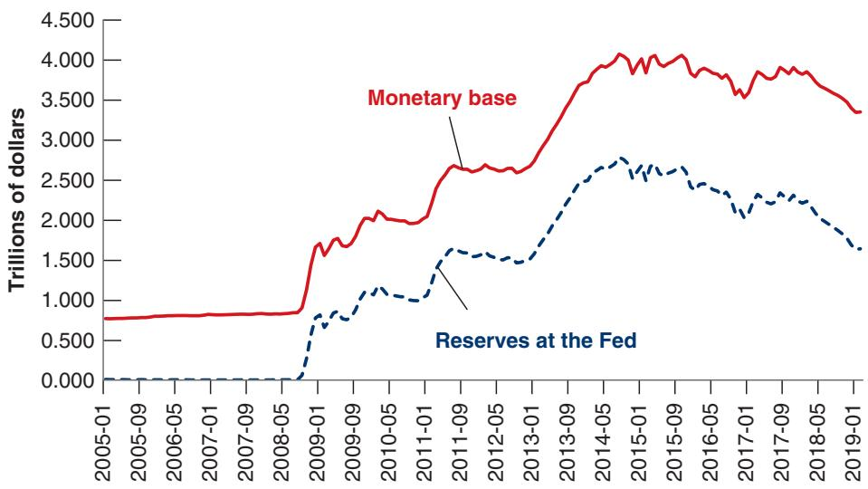
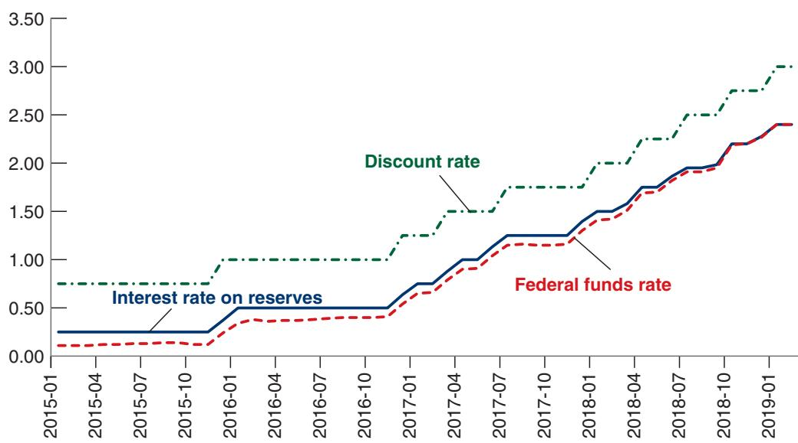

## 23-4 UNCONVENTIONAL MONETARY POLICY

When, at the start of the crisis, the interest rate reached the zero lower bound, central banks were unable to decrease it further and thus lost the use of conventional monetary policy. In this book, I have assumed until now that monetary policy became impotent. But this was a simplification. Central banks explored other ways to affect activity, a set of measures known as unconventional monetary policy.

The idea was simple. While the policy rate was equal to zero, other interest rates remained positive, reflecting various risk premiums. Although I introduced a risk premium in Chapter 6 in the relation of the borrowing rate to the policy rate, I did not discuss in detail what it depended on and how it could be affected by monetary policy. In fact, we can think of the premium on an asset as determined by supply and demand for the asset. If the demand for an asset decreases, whether because buyers become more risk averse or because some investors just decide not to hold the asset, the premium will increase. If, instead, the demand increases, the premium will decrease. This is true whether the increased demand comes from private investors or from the central bank.

This is the logic that led central banks to buy assets (other than short-term bonds) with the intention of decreasing the premium on them and thus decreasing the corresponding borrowing rates with the aim of stimulating economic activity. They did this by financing their purchases through money creation, leading to a large increase in the money supply. Although the increase in the money supply had no effect on the policy rate, the purchase of these other assets decreased their premium, leading to lower borrowing rates and higher spending. These purchase programs are known as quantitative easing, or credit easing, policies.

In the United States, the Fed started its first quantitative easing program in November 2008, even before it had reached the zero lower bound. In what has become known as Quantitative Easing 1 (QE1 for short), the Fed started buying certain types of mortgagebased securities. We saw the reason for it in Chapter 6: One of the triggers of the crisis was the difficulty of assessing the value of the underlying mortgages on which those securities were based; as a result, many investors had decided to stop holding any kind of mortgage-based security, and the premium even on securities that seemed relatively safe had jumped to very high levels. By buying these securities, the Fed decreased their premium and limited the effect on the financial system and on spending. The second quantitative easing program, known as QE2, started in November 2010, when the Fed starting buying longer-term Treasury bonds, with the intent of decreasing the term premium on these long-term bonds. The third quantitative easing program, QE3, started in September 2012, with the further purchase of mortgage-based securities, to decrease the cost of mortgages and further help the housing market to recover.

Much research has gone into assessing the effectiveness of quantitative easing in reducing risk premia. There is wide agreement that QE1 made a large difference.

  
Figure 23-2  
The Evolution of the US Monetary Base from 2005 to 2018  
As a result of quantitative easing, the monetary base more than quadrupled between 2005 and 2015.

By intervening in a market that had become dysfunctional, the Fed limited the increase in premiums. The effects of QE2 and QE3, in which the Fed intervened in markets that were no longer dysfunctional, are more controversial. It is widely accepted that they decreased the term premium on long-term government bonds. The question is by how much.

The general assessment of quantitative easing policies, in the United States and elsewhere, is that they had some effect on borrowing rates, and thus monetary policy can still have some effect on activity even at the zero lower bound. But there is also wide agreement that they work in more complicated and less reliable ways than conventional monetary policy. Put another way, the zero lower bound may not make monetary policy impotent, but it surely limits its efficiency.

We have looked at what the Fed bought. How did it finance itself? By issuing money. As the interest rate was (nearly) equal to zero, banks were indifferent between holding bonds or holding money. So they were willing to accumulate central bank money in the form of reserves at the Fed. (Actually the Fed was willing to pay a slightly positive interest rate, 0.25%, which made it attractive for banks to hold reserves.) As a result, the monetary base, i.e., the money issued by the central bank increased from \$850 billion, or about 6.6% of GDP in September 2008, to \$4,000 billion, or about 22% of GDP in 2015. This evolution is represented by the red line in Figure 23-2. The blue line shows the reserves held by banks; most of the increase was reflected in an increase in bank reserves at the Fed. As a result, the balance sheet of the Fed is much larger than it was before the crisis.

## Monetary Policy since the End of the Liquidity Trap

When the Fed decided at the end of 2015 that the economy was stronger and it should increase the federal funds rate again, it faced an obvious problem. If it continued to pay zero interest on reserves (or, more precisely, to pay a very low one), banks would not be willing to hold reserves. They would try to sell all of them in the federal funds market, and, unless the Fed was willing to buy back all of them—and by implication, to sell all the bonds it had accumulated as a result of QE—the federal funds rate would go back to zero. If the Fed did not want this to happen, it had to start paying interest on reserves. And this is what it did, and still does today.

The Fed now operates a corridor system. It sets two rates: the rate on reserves, the rate at which banks can in effect lend to the Fed; and the discount rate, the rate at which banks can borrow from the Fed. The federal funds rate is still determined in the federal funds market, but it must be in the corridor created by the two rates. To see why, suppose

The Fed did not want to sell all the assets it had acquired during the crisis right away. It thought, rightly, that this would lead to large disruptions in the asset markets, and selling should happen slowly over time, if at all.

The Interest Rate on Reserves, the Federal Funds Rate, and the Discount Rate since 2015

## Figure 23-3

The federal funds rate has moved in line with the interest rate on reserves.

Contrary to the argument in the text, you can see that the federal funds rate has remained slightly below the interest rate on reserves! This is because of a technical issue: Some financial institutions do not have access to Fed reserves and are willing to lend at a lower rate than the rate on reserves. The general message remains: The floor on the federal funds rate is mostly determined by the rate on reserves.

that the federal funds rate was lower than the rate on reserves: No bank would be willing to lend to another bank, as lending to the Fed would give a higher rate. Suppose instead that the federal funds rate was higher than the discount rate: no bank would want to borrow from another bank, as borrowing from the Fed would give a lower rate. Thus, while the federal funds rate is still determined in the federal funds market, it can vary only within the corridor created by the two rates. The evolution of the three rates is shown in Figure 23-3, and it shows how the federal funds rate has moved with the interest rate paid on reserves.c

To summarize: Monetary policy is in flux. The crisis forced central bankers in general, and the Fed in particular, to question the focus on inflation targeting and to explore tools other than the policy rate. As a result of the use of unconventional policies during the zero lower bound period, central banks’ balance sheets are much larger than they used to be. They hold a much larger quantity of assets than before the crisis and have much larger liabilities. They pay interest on a large part of their liabilities, the reserves held by banks at the central bank. The main policy tool has become the interest rate paid to banks on their reserves at the Fed. The main choice facing central banks at this point is whether to keep their large balance sheets, or to return to a situation closer to the precrisis situation, with a small balance sheet and mostly non–interest-paying liabilities. While they have in most cases either stabilized or started to decrease their balance sheets, the endpoint has not been decided yet.

## 23-5 MONETARY POLICY AND FINANCIAL STABILITY

When the financial crisis started, central banks were confronted not only with a major decline in demand but also with serious problems in the financial system. As we saw in Chapter 6, the decline in housing prices had been the trigger for the crisis, which was then amplified by failures of the financial system. Opacity of assets led to doubts about the solvency of financial institutions, and these doubts led to runs, in which investors tried to get their funds back, forcing fire sales and generating further doubts about solvency. The first urgent issue facing the central banks was thus what measures to take— beyond the measures already described in the previous sections. The second issue was whether and how, in the future, monetary policy should try to decrease the probability of another such financial crisis. We look at both issues in turn.

## Liquidity Provision and Lender of Last Resort

Central banks have long known about bank runs. As we saw in Chapter 6, the structure of the balance sheet of banks exposes them to runs. Many of their assets, such as loans, are illiquid. Many of their liabilities, such as demand deposits, are liquid; as the term indicates, demand deposits can be withdrawn on demand. Thus, depositors’ worries, founded or unfounded, can lead them to want to withdraw their funds, forcing the bank either to close or to sell the assets at fire sale prices. In most countries, two measures have traditionally been taken to limit such runs:

■ Deposit insurance, which gives investors the confidence that they will get their funds back even if the bank is insolvent, so that they do not have an incentive to run.

■ And, in case the run actually happens, the provision of liquidity by the central bank to the bank against some collateral, namely some of the assets of the bank. This way, the bank can get the liquidity it needs to pay the depositors without having to sell the assets. This function of the central bank is known as lender of last resort, and it has been one of the functions of the Fed since its creation in 1913.

What the crisis showed, however, was that banks were not the only financial institutions that could be subject to runs. Any institution whose assets are less liquid than its liabilities is exposed to similar risks of a run. If investors want their funds back, it may be difficult for the financial institution to get the liquidity it needs. Given the urgency during the crisis, the Fed extended liquidity provision to some financial institutions other than banks. It had little choice other than to do so, but, looking forward, the question is what the rules should be—which institutions can expect to receive liquidity from the central bank and which cannot. The question is far from settled. Do central banks really want to provide such liquidity to institutions they do not regulate?

## Macroprudential Tools

Starting in the mid-2000s, the Fed became worried about the increase in housing prices. But the Fed and other central banks facing similar housing price increases were reluctant to intervene. This was for a number of reasons: First, they found it difficult to assess whether the price increases reflected increases in fundamentals (e.g., low interest rates) or a bubble (i.e., increases in prices above what were justified by fundamentals). Second, they worried that an increase in the interest rate, although it might indeed stop the increase in housing prices, would also slow the whole economy and trigger a recession. Third, they thought that, even if the increase in housing prices was indeed a bubble, and the bubble were to burst and lead to a decrease in housing prices later, they could counter the adverse effects on demand through an appropriate decrease in the interest rate.

The crisis has forced them to reconsider. As we saw, housing price declines combined with the buildup of risk in the financial system led to a major financial and macroeconomic crisis, which they could neither avoid nor counter.

As a result, a broad consensus is emerging along two lines:

It is risky to wait. Even if there is doubt about whether an increase in asset prices reflects fundamentals or a bubble, it may be better to do something than nothing. Better to stand for a while in the way of a fundamental increase and turn out to be wrong than to let a bubble build up and burst, with major adverse macroeconomic effects. The same applies to buildups of financial risk; for example, excessive bank leverage. Better to prevent high leverage, even at the risk of decreasing bank credit, than to allow it to build up, increasing the risk of a financial crisis.

This has led to the dictum: Better lean [against increases in asset prices] than clean [up after asset prices have crashed].

■ To deal with bubbles, credit booms, or dangerous behavior in the financial system, the interest rate is not, however, the right policy instrument. It is too blunt a tool, affecting the whole economy rather than resolving the problem at hand. The right instruments are macroprudential tools, rules that are aimed directly at borrowers, or lenders, or banks and other financial institutions, as the case may require.

What form might some of the macroprudential tools take? Some tools may be aimed at borrowers:

■ Suppose the central bank is worried about what it perceives to be an excessive increase in housing prices. It can tighten conditions under which borrowers can obtain mortgages. A measure used in many countries is a ceiling on the size of the loan borrowers can take relative to the value of the house they buy, a measure known as the maximum loan-to-value (LTV) ratio, or maximum LTV for short. Reducing the maximum LTV is likely to decrease demand and thus slow down the price increase. (The Focus Box “LTV Ratios and Housing Price Increases from 2000 to 2007” examines the relation between maximum LTVs and housing price increases in the period leading up to the crisis.)

■ Suppose the central bank is worried that people are borrowing too much in foreign currency. An example will help to make the point. In the early 2010s, more than two-thirds of mortgages in Hungary were denominated in Swiss francs! The reason was simple. Swiss interest rates were very low, making it apparently attractive for Hungarians to borrow at the Swiss rather than the Hungarian interest rate. The risk that borrowers did not consider, however, was that the Hungarian currency, the forint, would depreciate vis-à-vis the Swiss franc. Such a depreciation took place, increasing, on average, the real value of the mortgages Hungarians had to pay by more than 50%. Many households could no longer make their mortgage payments. This suggests that it would have been wise to put restrictions from the start on the amount of borrowing in foreign currency by households.

Some tools may be aimed at lenders, such as banks or foreign investors:

■ Suppose the central bank is worried about an increase in bank leverage. We saw in Chapter 6 why this should be a concern. High leverage was one of the main reasons why housing price declines led to the financial crisis. The central bank can impose minimum capital ratios to limit leverage. These may take various forms (for example, a minimum value for the ratio of capital to all assets, or a minimum value for the ratio of capital to risk-weighted assets, with riskier assets having a higher weight). In fact, in a series of agreements known as Basel II and Basel III, many countries have agreed to impose the same minimums on their banks. A more difficult and unresolved issue is whether and how such capital ratios should be adjusted over time as a function of economic and financial conditions (whether, for example, they should be increased if there appears to be excessive credit growth).

Suppose the central bank is worried about high capital inflows, as, for example, in the Hungarian case we just discussed. The central bank worries that, although investors are willing to lend at low interest rates to the country, they may change their mind, and this might lead to a sudden stop. The central bank may then want to limit the capital inflows by imposing capital controls on inflows. These may take the form of taxes on different types of inflows, with lower taxes on capital flows that are less prone to sudden stops, such as foreign direct investment (the purchase of physical assets by foreigners), or a direct limit on the ability of domestic residents to take out foreign loans.

