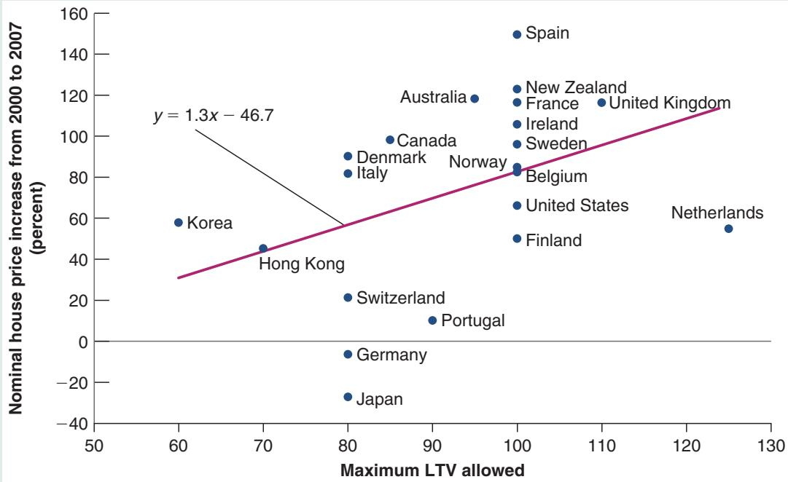

# LTV Ratios and Housing Price Increases from 2000 to 2007

Is it the case that countries that had more stringent restrictions on borrowing had lower housing price increases from 2000 to 2007? An answer is given in Figure 1. The figure, taken from an IMF study, shows the evidence for 21 countries for which the data could be obtained.

The horizontal axis plots the maximum loan-to-value (LTV) ratio on new mortgages across countries. This maximum is not necessarily a legal maximum but may be a guideline, or a limit over which additional requirements, such as mortgage insurance, may be asked of the borrower. A ratio of 100% means that a borrower may be able to get a loan equal to the value of the house. Actual values vary from 60% in Korea; to 100% in many countries, including the United States; to 125% in the Netherlands. The vertical axis plots the increase in the nominal price of housing from 2000 to 2007 (measuring the real price increase would lead to a similar picture). The figure also plots the regression line, the line that best fits the set of observations.

The figure suggests two conclusions:

The first is that there indeed appears to be a positive relation between the LTV ratio and the housing price increase. Korea and Hong Kong, which both imposed low LTV ratios, had smaller housing price increases. Spain and the United Kingdom, with much higher ratios, had much larger price increases.

The second is that the relation is far from tight. This should not come as a surprise, as surely many other factors played a role in the increase in housing prices. But even controlling for other factors, it is difficult to identify with much confidence the precise effect of the LTV ratio. Looking forward, we shall have to learn a lot more about how an LTVbased regulatory tool might work before it can be used as a reliable macroprudential tool.2

  
Figure 1  
Maximum LTV Ratios and Housing Price Increases, 2000–2007

Although there is wide agreement that the use of such macroprudential tools is desirable, many questions remain:

■ In many cases, we do not know how well these tools work (e.g., how much a decrease in the maximum LTV ratio affects the demand for housing, or whether foreign investors can find ways of avoiding capital controls).

■ There are likely to be complex interactions between the traditional monetary policy tools and these macroprudential tools. For example, there is some evidence that very low interest rates lead to excessive risk taking, whether by investors or by financial institutions. If this is the case, a central bank that decides, for macroeconomic reasons, to lower the interest rate may have to use various macroprudential tools to offset the potential increase in risk taking. Again, we know little about how best to do it.

一 The question arises of whether macroprudential tools, together with traditional monetary policy tools, should be under the control of the central bank or of a separate authority. The argument for having the central bank in charge of both monetary and macroprudential tools is that these tools interact, and thus only one centralized authority can use them in the right way. The argument against it is that such a consolidation of tools may give too much power to an independent central bank.

At this stage, some countries have taken one route and others have taken another. In the United Kingdom, the central bank has been given power over both monetary and macroprudential tools. In the United States, the responsibility has been given to a council under the formal authority of the US Treasury, but with the Fed playing a major role within the council.

To summarize: The crisis has shown that macroeconomic stability requires the use not only of traditional monetary instruments but also of macroprudential tools. How best to use them is one of the challenges facing macroeconomic policymakers today.

## SUMMARY

Until the 1980s, the design of monetary policy focused on nominal money growth. But because of the poor relation between inflation and nominal money growth, this approach was abandoned by most central banks.

Central banks now focus on an inflation rate target rather than a nominal money growth rate target. And they think about monetary policy in terms of choosing the nominal interest rate rather than choosing the rate of nominal money growth.

The Taylor rule gives a useful way of thinking about the choice of the nominal interest rate. The rule states that the central bank should move its interest rate in response to two main factors: the deviation of the inflation rate from the target rate of inflation, and the deviation of the unemployment rate from the natural rate of unemployment. A central bank that follows this rule will stabilize activity and achieve its target inflation rate in the medium run.

The optimal rate of inflation depends on the costs and benefits of inflation. Higher inflation leads to more distortions, especially when it interacts with the tax system. On the other hand, because higher inflation implies higher average nominal interest rates, it decreases the probability of hitting the zero lower bound, a bound that was costly in the recent crisis.

When advanced economies hit the zero lower bound during the Great Financial Crisis, central banks explored unconventional monetary policy tools, such as quantitative easing. These policies worked through the effects of central bank purchases on the risk premiums associated with different assets. These purchases led to large increases in the balance sheets of central banks. The issue is now whether the central banks should reduce those balance sheets, and whether unconventional measures should be used in normal times.

The crisis has shown that stable inflation is not a sufficient condition for macroeconomic stability. This is leading central banks to explore the use of macroprudential tools. These tools can, in principle, help limit bubbles, control credit growth, and decrease risk in the financial system. How best to use them, however, is still poorly understood and is one the challenges facing monetary policy today.
