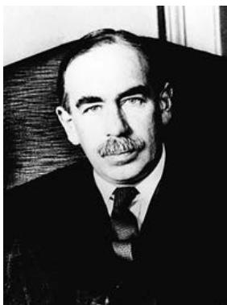
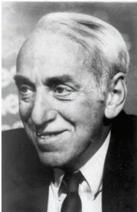
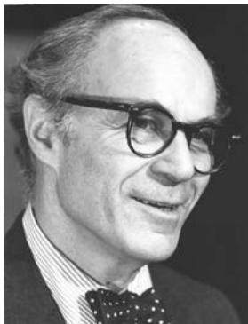
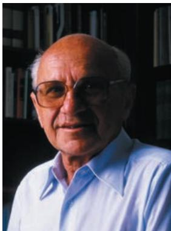
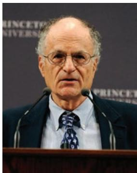
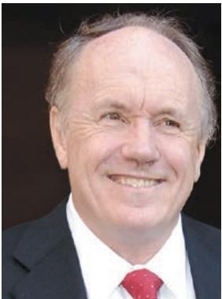
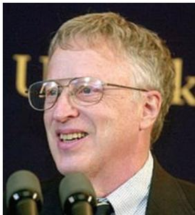
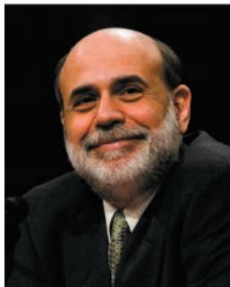

## KEY TERMS

inflation targeting, 485 interest rate rule, 485 Great Moderation, 485 M1, 487 divine coincidence, 489 flexible inflation targeting, 489 Taylor rule, 490 shoe-leather costs, 491 bracket creep, 492 money illusion, 492 conventional monetary policy, 496 unconventional monetary policy, 496 quantitative easing, 496

## QUESTIONS AND PROBLEMS

## QUICK CHECK

1. Using the information in this chapter, label each of the following statements true, false, or uncertain. Explain briefly.

a. The most important argument in favor of a positive rate of inflation in OECD countries is seignorage.

b. Fighting inflation should be the Fed’s only purpose.

c. Inflation and money growth moved together from 1970 to 2009.

d. Because most people have little trouble distinguishing between nominal and real values, inflation does not distort decision making.

e. Most central banks around the world have an inflation target of 4%.

f. The higher the inflation rate, the higher the effective tax rate on capital gains.

g. The Taylor rule describes how central banks adjust the policy interest rate across recessions and booms.

h. The zero lower bound on the nominal policy rate was expected to be a regular feature of monetary policy when inflation targeting began.

i. The Federal Reserve pays interest on reserves held by member banks.

j. Quantitative easing refers to central bank purchases of assets with the intention of directly affecting the yield on these assets.

k. In the crisis, central banks provided liquidity to financial institutions they did not regulate.

l. One consequence of the crisis was higher capital requirements and a more extensive regulatory regime for banks.

2. Breaking the link between money growth and inflation in the medium run

The money demand relationship in Chapter 4 is used implicitly in Figure 23-1. That relation is

$$
\frac {M}{P} = Y L (i)
$$

credit easing, 496 QE1, 496 QE2, 496 QE3, 496 corridor system, 497 lender of last resort, 499 macroprudential tools, 500 loan-to-value (LTV) ratio, 500 Basel II, 500 Basel III, 500 capital controls, 500 foreign direct investment, 500

The central bank in conjunction with the political authorities chooses an inflation target $\pi ^ { * }$

a. Derive the target nominal interest rate in a medium-run equilibrium.

b. Consider medium-run equilibria where potential output does not grow. Derive the relation between money growth and inflation. Explain.

c. Now consider medium-run equilibria where potential output grows at 3% per year. Now derive the relation between money growth and inflation. Do you expect inflation to be higher or lower than money growth? Explain.

d. Consider Figure 23-1. Look first at the period ending in roughly 1995. How do your results in parts b and c relate to it?

e. Focus on the case where all money is currency. We can then think of money demand as being the demand for currency (you can refer back to the appendix to Chapter 4 if needed). Over the past 50 years:

i. Automatic tellers have allowed cash to be dispensed outside of regular banking hours.

ii. The use of credit cards for purchases has greatly expanded.

iii. The use of debit cards for purchases has greatly expanded.

iv. Most recently, technology has allowed for small purchases by credit and debit cards by waving the card over a payment terminal near the cash register.

How would each of these innovations affect the demand for currency?

f. The FRED database at the Federal Reserve Bank of St. Louis has an annual series for currency (CURRVALALL). Download this series and the annual series for nominal GDP (GDPA). Construct a ratio of currency to nominal GDP. How does this series behave from 1993 to 2018? Are you surprised?

3. The inflation target: Nearly every major central bank has chosen an inflation target of 2%.

a. Why might a central bank choose a lower inflation target, for example, zero inflation?

b. Why might a central bank choose a higher inflation target, for example, 4% inflation?

## 4. Indexed bonds and inflation uncertainty

In Chapter 14, in the Focus Box titled “The Vocabulary of Bond Markets,” the concept of an inflation-indexed bond was introduced. Although such bonds are typically long in maturity, the example that follows compares a standard one-year Treasury bill with an inflation-indexed one-year Treasury bill.

a. A standard one-year \$100 Treasury bill promises to pay \$100 in one year and sells for $\$ 9_ { \mathrm { B } }$ (notation is from Chapter 4) today. What is the nominal interest rate on the Treasury bill?

b. Suppose that the price level is P today and P1t+12 next year and the bill sells for $\$ 9_ { B }$ today. What is the real interest rate on the Treasury bill?

c. An indexed Treasury bill pays a larger payment next year to compensate for inflation between the date of issue and the date of payment. If the bill is issued today when the price index is 100, what will be the payment next year if the price index has risen to 110? What is the real interest rate on an indexed Treasury bill that sells for $\$ 9_ { \mathrm { B } }$ today?

d. If you are an investor, will you want to hold indexed or non-indexed bonds?

## 5. Unwinding unconventional monetary policy

It was noted in the text that the Federal Reserve purchased, in addition to Treasury bills, large amounts of mortgage-backed securities and long-term government bonds as part of quantitative easing. Figure 23-2 shows that in 2015, there were about \$4 trillion of assets in the monetary base. By 2018, total assets fell to \$3.5 trillion. The table below presents some further detail on three types of Federal Reserve assets in billions of dollars.

<table><tr><td>Asset category</td><td>End of 2015</td><td>End of 2017</td></tr><tr><td>Treasury securities less than one year to maturity</td><td>216.1</td><td>443.7</td></tr><tr><td>Treasury securities with more than one year to maturity</td><td>2245.4</td><td>2010.5</td></tr><tr><td>Mortgage-backed securities</td><td>1747.5</td><td>1764.9</td></tr></table>

Source: Annual Reports of the Federal Reserve Board, Table 2, Federal Reserve Bank holdings of US Treasury and federal agency securities

a. Why did the Federal Reserve Board buy the mortgagebacked securities?

b. Why did the Federal Reserve Board buy the long-term Treasury bonds?

c. What would you predict as the consequences of the following operation by the Federal Reserve Board: selling \$0.5 trillion in mortgage-backed securities and buying \$0.5 trillion in Treasury securities with less than one year to maturity?

d. What would you predict as the consequences of the following operation by the Federal Reserve Board: selling \$0.5 trillion in Treasury securities with maturity longer than one year and buying \$0.5 trillion in Treasury securities with less than one year to maturity?

e. How did the Fed rearrange its balance sheet between 2015 and 2017? Is there evidence of unwinding of quantitative easing?

## 6. The maximum loan-to-value ratio

Most home-buyers purchase their home with a combination of a cash down payment and a mortgage. The loan-to-value ratio is a rule that establishes the maximum mortgage loan allowed on a home purchase.

a. If a home costs \$300,000 and the maximum loan-tovalue ratio is 80% as in Denmark, what is the minimum down payment?

b. If the maximum loan-to-value is reduced, how will this affect the demand for homes?

c. In Chapter 14 you were referred to The Economist House Price Index. Find that index and look at the behavior of house prices in Canada and the United States from 1970 to the latest date available. On December 10, 2015, the Canadian Minister of Finance announced an increase in the minimum down payment on any portion of a mortgage more than \$500,000. (The announcement can be found at www.fin.gc.ca/n15/15-088-eng.asp.) Why was this action taken? Do you see an effect on house prices in Canada? What do you conclude?

## 7. Bank behavior in the interest rate corridor

The United States (unlike other countries) has two types of bank-like financial institutions. Member banks can borrow from the Federal Reserve at the discount rate and must keep currency in their vaults or deposits at the Federal Reserve earning the deposit rate as reserves. These rates are shown in Figure 22-3. Nonmember banks can hold their reserves as currency or deposits at member banks. The federal funds rate is the interest rate on oneday loans in financial markets. It is determined by the demand for and the supply of these funds by both member and non-member banks. Chapter 4 introduced both reserve requirements and balance sheets.

a. If the reserve ratio is 10% and a member bank that can place funds on deposit at the Federal Reserve has the balance sheet below, does this bank have excess reserves? If the deposit rate is 0.5% and the federal funds rate is 0.4%, what is the profit-maximizing choice for the overnight placement of excess reserves for the member bank?

<table><tr><td colspan="2">Bank</td></tr><tr><td>Assets</td><td>Liabilities</td></tr><tr><td>Currency 60Deposits at Fed 50Loans 600Bonds 290</td><td>Checkable deposits 1000</td></tr></table>

b. If the reserve ratio is 10% and a member bank that can place funds on deposit at the Federal Reserve has the balance sheet below, does this bank have excess reserves? If the discount rate is 0.75% and the federal funds rate is 0.8%, how should the profit-maximizing member bank borrow overnight to meet reserve requirements?

<table><tr><td colspan="2">Banks</td></tr><tr><td>Assets</td><td>Liabilities</td></tr><tr><td>Currency 30Deposits at Fed 50Loans 600Bonds 320</td><td>Checkable deposits 1000</td></tr></table>

c. If all banks in America were member banks, explain why the Federal Reserve could be certain that the federal funds rate fell between the deposit rate and the discount rate?

d. In Figure 22-3, the federal funds rate falls slightly below the deposit rate. Explain, using the balance sheet below for a non-member bank, how this would happen. Non-member banks hold part of their required reserves as deposits at member banks.

<table><tr><td colspan="2">Non-member bank</td></tr><tr><td>Assets</td><td>Liabilities</td></tr><tr><td>Currency 50Deposits at member bank 20Loans 330Bonds 100</td><td>Checkable deposits 500</td></tr></table>

## DIG DEEPER

8. Taxes, inflation, and home ownership

In this chapter, we discussed the effect of inflation on the effective capital-gains tax rate on the sale of a home. In this question, we explore the effect of inflation on another feature of the tax code—the deductibility of mortgage interest.

Suppose you have a mortgage of \$50,000. Expected inflation is pe, and the nominal interest rate on your mortgage is i. Consider two cases:

$$
i. \pi^e = 0\%; \mathrm{i} = 4\%
$$

ii. $\pi ^ { e } = 1 0 \% ; ~ \mathrm { i } = 1 4 \%$

a. What is the real interest rate you are paying on your mortgage in each case?

b. Suppose you can deduct nominal mortgage interest payments from your income before paying income tax. Assume that the tax rate is 25%. So, for each dollar you pay in mortgage interest, you pay 25 cents less in taxes, in effect getting a subsidy from the government for your mortgage costs. Compute, in each case, the real interest rate you are paying on your mortgage, taking this subsidy into account.

c. Considering only the deductibility of mortgage interest (and not capital-gains taxation), is inflation good for homeowners

9. Suppose you have been elected to Congress. One day, one of your colleagues makes the following statement:

The Fed chair is the most powerful economic policy maker in the United States. We should not turn over the keys to the economy to someone who was not elected and therefore has no accountability. Congress should impose an explicit Taylor rule on the Fed. Congress should choose not only the target inflation rate but the relative weight on the inflation and unemployment targets. Why should the preferences of an individual substitute for the will of the people, as expressed through the democratic and legislative processes?

Do you agree with your colleague? Discuss the advantages and disadvantages of imposing an explicit Taylor rule on the Fed.

## EXPLORE FURTHER

10. The frequency of the zero lower bound around the world

Use the FRED database at the Federal Reserve Bank of St. Louis to find the monthly average nominal policy interest rates for four major central banks. The series for these rates are: United States, federal funds (FEDFUNDS); United Kingdom, (INTDSRGBM193N); European Central Bank (covering the Euro-zone countries including Italy, France, and Germany), immediate rate on Euro (IRSTCI01EZM156N); Bank of Japan, immediate rate on yen (IRSTCI01JPM156N); Bank of Canada, immediate rate (IRSTCB01CAM156N).

Which of these central banks has spent a significant period of time at the zero lower bound since 2000?

## 11. Current monetary policy

Problem 10 in Chapter 4 asked you to consider the current stance of monetary policy. Here, you are asked to do so again, but with the additional understanding of monetary policy you have gained in this and previous chapters.

Go to the Web site of the Federal Reserve Board of Governors (www.federalreserve.gov) and download either the press release you considered in Chapter 4 (if you did Problem 10) or the most recent press release of the Federal Open Market Committee (FOMC).

a. What is the stance of monetary policy as described in the press release?

b. Is there evidence that the FOMC considers both inflation and unemployment when setting interest rate policy as would be implied by the Taylor rule?

c. Does the language make specific reference to a target for inflation?

d. Does the language make specific reference to the natural or target real rate of interest?

e. Does the language raise any issues related to macroprudential regulation of financial institutions?

## FURTHER READINGS

For an early statement of inflation targeting, read “Inflation Targeting: A New Framework for Monetary Policy?” by Ben Bernanke and Frederic Mishkin, Journal of Economic Perspectives, 1997, Vol. 11 (Spring): pp. 97–116. (This article was written by Ben Bernanke before he became Chairman of the Fed.)

For more institutional details on how the Fed actually functions, see www.federalreserve.gov/aboutthefed/default. htm.

A time frame giving financial developments and the actions of the Fed from 2008 to 2011 is given at www.nytimes.com/ interactive/2008/09/27/business/economy/20080927\_ WEEKS\_TIMELINE.html.

A great long read: The description of the problems in the financial sector and of US monetary policy during the crisis by the Fed Chair himself, in The Courage to Act: A Memoir of a Crisis and Its Aftermath by Ben Bernanke, W. W. Norton & Co., Inc., 2015.

## Epilogue: The Story of Macroeconomics

24

Wto think about macroeconomic issues, the major conclusions they draw, andthe issues on which they disagree. How this framework has been built over to think about macroeconomic issues, the major conclusions they draw, and the issues on which they disagree. How this framework has been built over time is a fascinating story. It is the story I want to tell in this chapter.

Section 24-1 starts at the beginning of modern macroeconomics—with Keynes and the Great Depression.

Section 24-2 turns to the neoclassical synthesis, a synthesis of Keynes’s ideas with those of earlier economists—a synthesis that dominated macroeconomics until the early 1970s.

Section 24-3 describes the rational expectations critique, the strong attack on the neoclassical synthesis that led to a complete overhaul of macroeconomics starting in the 1970s.

Section 24-4 gives you a sense of the main lines of research in macroeconomics up to the crisis.

Section 24-5 takes a first pass at assessing the effects of the crisis on macroeconomics.

If you remember one basic message from this chapter, it should be: Modern macroeconomics is the result of a long and rich process of construction, crises, and reconstruction.

Be warned: The picture gallery is overwhelmingly one of white males. This unfortunately reflects the history of the field. The good news is that things are changing, and women play an increasing role. The American Economic Association Prize for the best economist under 40 was given, in 2019, to a woman, Emi Nakamura, a macroeconomist at Berkeley.

  
John Maynard Keynes

The history of modern macroeconomics starts in 1936, with the publication of John Maynard Keynes’s General Theory of Employment, Interest, and Money. As he was writ-c ing the General Theory, Keynes confided to a friend: “I believe myself to be writing a book on economic theory which will largely revolutionize—not, I suppose at once but in the course of the next ten years, the way the world thinks about economic problems.”1

Keynes was right. The book’s timing was one of the reasons for its immediate success. The Great Depression was not only an economic catastrophe but also an intellectual failure for the economists working on business cycle theory—as macroeconomics was then called. Few economists had a coherent explanation for the Depression, either its depth or its length. The economic measures taken by the Roosevelt administration as part of the New Deal had been based on instinct rather than on economic theory. The General Theory offered an interpretation of events, an intellectual framework, and a clear argument for government intervention.

The General Theory emphasized effective demand—what we now call aggregate demand. In the short run, Keynes argued, effective demand determines output. Even if output eventually returns to potential, the process is slow at best. One of Keynes’s most famous quotes is: “In the long run, we are all dead.”

In the process of deriving effective demand, Keynes introduced many of the building blocks of modern macroeconomics:

■ The relation of consumption to income, and the multiplier, which explains how shocks to demand can be amplified and lead to larger shifts in output.

■ Liquidity preference, the term Keynes gave to the demand for money, which explains how monetary policy can affect interest rates and aggregate demand.

■ The importance of expectations in affecting consumption and investment; and the idea that animal spirits (shifts in expectations) are a major factor behind shifts in demand and output.

The General Theory was more than a treatise for economists. It offered clear policy recommendations, and they were in tune with the times: Waiting for the economy to recover by itself was irresponsible. In the midst of a depression, trying to balance the budget was not only stupid, it was dangerous. Active use of fiscal policy was essential to return the country to high employment.

## 24-2 THE NEOCLASSICAL SYNTHESIS

  
Paul Samuelson

Within a few years, the General Theory had transformed macroeconomics. Not everyone was converted, and few agreed with it all. But most discussions became organized around it.

By the early 1950s a large consensus had emerged, based on an integration of many of Keynes’s ideas and the ideas of earlier economists. This consensus was called the neoclassical synthesis. To quote from Paul Samuelson, in the 1955 edition of his text Economics, the first modern economics text:

“In recent years, 90 percent of American economists have stopped being ‘Keynesian economists’ or ‘Anti-Keynesian economists.’ Instead, they have worked toward a synthesis of whatever is valuable in older economics and in modern theories of income determination. The result might be called neo-classical economics and is accepted, in its broad outlines, by all but about five percent of extreme left-wing and right-wing writers.”2

The neoclassical synthesis was to remain the dominant view for another 20 years. Progress was astonishing, leading many to call the period from the early 1940s to the early 1970s the golden age of macroeconomics.

## Progress on All Fronts

The first order of business after the publication of the General Theory was to formalize mathematically what Keynes meant. Although Keynes knew mathematics, he had avoided using it in the General Theory. One result was endless controversies about what Keynes meant and whether there were logical flaws in some of his arguments.

  
Franco Modiglian

## The IS-LM Model

A number of formalizations of Keynes’s ideas were offered. The most influential one was the IS-LM model, developed by John Hicks and Alvin Hansen in the 1930s and early 1940s. The initial version of the IS-LM model—which was actually close to the version presented in Chapter 5 of this book—was criticized for emasculating many of Keynes’s insights. Expectations played no explicit role, and the adjustment of prices and wages was altogether absent. Yet the IS-LM model provided a basis from which to start building, and as such it was immensely successful. Discussions became organized around the slopes of the IS and LM curves, what variables were missing from the two relations, what equations for prices and wages should be added to the model, and so on.

## Theories of Consumption, Investment, and Money Demand

Keynes had emphasized the importance of consumption and investment behavior, and of the choice between money and other financial assets. Major progress was soon made along all three fronts.

In the 1950s, Franco Modigliani (then at Carnegie Mellon, later at MIT) and Milton Friedman (at the University of Chicago) independently developed the theory of consumption we saw in Chapter 15. Both insisted on the importance of expectations in determining current consumption decisions.

James Tobin, at Yale, developed the theory of investment, based on the relation between the present value of profits and investment. The theory was further developed and tested by Dale Jorgenson, at Harvard. You saw this theory in Chapter 15.

Tobin also developed the theory of the demand for money and, more generally, the theory of the choice between different assets based on liquidity, return, and risk. His work has become the basis not only for an improved treatment of financial markets in macroeconomics but also for finance theory in general.

## Growth Theory

In parallel with the work on fluctuations, there was a renewed focus on growth. In contrast to the stagnation in the pre–World War II era, most countries were experiencing rapid growth in the 1950s and 1960s. Even if they experienced fluctuations, their standard of living was increasing rapidly. The growth model developed by MIT’s Robert Solow in 1956, which we saw in Chapters 11 and 12, provided a framework to think about the determinants of growth. It was followed by an explosion of work on the roles of saving and technological progress in determining growth.

## Macroeconometric Models

All these contributions were integrated in larger and larger macroeconometric models. The first US macroeconometric model, developed by Lawrence Klein at the University of Pennsylvania in the early 1950s, was an extended IS relation, with 16 equations. With the development of the National Income and Product Accounts (making available better data) and of both econometrics and computers, the models quickly grew in size. The most impressive effort was the construction of the MPS model (MPS stands for MIT-Penn-SSRC, for the two universities and the research institution—the Social Science Research Council—involved in its construction), developed during the 1960s by a group led by Modigliani. Its structure was an expanded version of the IS-LM model, plus a Phillips curve mechanism. But its components—consumption, investment, and money demand—all reflected the tremendous theoretical and empirical progress since Keynes.

  
James Tobin

  
Robert Solow

  
Lawrence Klein

## Keynesians versus Monetarists

  
Milton Friedman

With such rapid progress, many macroeconomists—those who defined themselves as Keynesians—came to believe that the future was bright. The nature of fluctuations was becoming increasingly well understood; the development of models allowed policy decisions to be made more effectively. The time when the economy could be fine-tuned, and recessions all but eliminated, seemed not far in the future.

This optimism was met with skepticism by a small but influential minority, the monetarists. The intellectual leader of the monetarists was Milton Friedman. Although Friedman saw much progress being made—and was himself the father of one of the major contributions to macroeconomics, the theory of consumption—he did not share in the general enthusiasm. He believed that the understanding of the economy remained very limited. He questioned the motives of governments as well as the notion that they actually knew enough to improve macroeconomic outcomes.

In the 1960s, debates between Keynesians and monetarists dominated the economic headlines. The debates centered around three issues: (1) the effectiveness of monetary policy versus fiscal policy, (2) the Phillips curve, and (3) the role of policy.

  
Anna Schwartz

## Monetary Policy versus Fiscal Policy

Keynes had emphasized fiscal rather than monetary policy as the key to fighting recessions, and this had remained the prevailing wisdom. The IS curve, many argued, was quite steep: Changes in the interest rate had little effect on demand and output. Thus, monetary policy did not work very well. Fiscal policy, which affects demand directly, could affect output faster and more reliably.

Friedman strongly challenged this conclusion. In their 1963 book A Monetary History of the United States, 1867–1960, Friedman and Anna Schwartz painstakingly reviewed the evidence on monetary policy and the relation between money and output in the United States over a century. Their conclusion was not only that monetary policy was powerful but that movements in money explained most of the fluctuations in output. They interpreted the Great Depression as the result of a major mistake in monetary policy, a decrease in the money supply as a result of bank failures—a decrease that the Fed could have avoided by increasing the monetary base.

Friedman and Schwartz’s challenge was followed by a vigorous debate and by intense research on the respective effects of fiscal policy and monetary policy. In the end, an intellectual consensus was reached. Both fiscal policy and monetary policy clearly affected the economy. And if policymakers cared about not only the level but also the composition of output, the best policy was typically a mix of the two.

## The Phillips Curve

The second debate focused on the Phillips curve. The Phillips curve was not part of the initial Keynesian model, but because it provided such a convenient (and apparently reliable) way of explaining the movement of wages and prices over time, it had become part of the neoclassical synthesis. In the 1960s, based on the empirical evidence up until then, many Keynesian economists believed that there was a reliable trade-off between unemployment and inflation, even in the long run.

Milton Friedman and Edmund Phelps (at Columbia University) strongly disagreed. They argued that the existence of such a long-run trade-off flew in the face of basic economic theory. They argued that the apparent trade-off would quickly vanish if policymakers actually tried to exploit it—that is, if they tried to achieve low unemployment by accepting higher inflation. As we saw in Chapter 8 when we studied the evolution of the Phillips curve, Friedman and Phelps were definitely right. By the mid-1970s, the consensus was indeed that there was no long-run trade-off between inflation and unemployment.

  
Edmund Phelps

## The Role of Policy

The third debate centered on the role of policy. Skeptical that economists knew enough to stabilize output and that policymakers could be trusted to do the right thing, Friedman called for the use of simple rules, such as steady money growth (discussed in Chapter 23). Here is what he said in 1958:

“A steady rate of growth in the money supply will not mean perfect stability even though it would prevent the kind of wide fluctuations that we have experienced from time to time in the past. It is tempting to try to go farther and to use monetary changes to offset other factors making for expansion and contraction.… The available evidence casts grave doubts on the possibility of producing any fine adjustments in economic activity by fine adjustments in monetary policy—at least in the present state of knowledge. There are thus serious limitations to the possibility of a discretionary monetary policy and much danger that such a policy may make matters worse rather than better.

Political pressures to ‘do something’ in the face of either relatively mild price rises or relatively mild price and employment declines are clearly very strong indeed in the existing state of public attitudes. The main moral to be drawn from the two preceding points is that yielding to these pressures may frequently do more harm than good.”3

As we saw in Chapter 21, this debate on the role of macroeconomic policy has not been settled. The nature of the arguments has changed a bit, but they are still with us today.

## 24-3 THE RATIONAL EXPECTATIONS CRITIQUE

Despite the battles between Keynesians and monetarists, macroeconomics in about 1970 looked like a successful and mature field. It appeared to successfully explain events and guide policy choices. Most debates were framed within a common intellectual framework. But within a few years, the field was in crisis. This crisis had two sources.

One was events. By the mid-1970s, most countries were experiencing stagflation, a word created at the time to denote the simultaneous existence of high unemployment (stagnation) and high inflation. Macroeconomists had not predicted stagflation. After the fact and after a few years of research, a convincing explanation was provided, based on the effects of adverse supply shocks on both inflation and output. (We discussed the effects of such shocks in Chapter 9.) But it was too late to undo the damage to the discipline’s image.

  
Robert Lucas

The other was ideas. In the early 1970s, a small group of economists—Robert Lucas at Chicago; Thomas Sargent, then at Minnesota and now at New York University; and Robert Barro, then at Chicago and now at Harvard—led a strong attack against mainstream macroeconomics. They did not mince words. In a 1978 paper, Lucas and Sargent stated:

  
Thomas Sargen

  
Robert Barro

“That the predictions [of Keynesian economics] were wildly incorrect, and that the doctrine on which they were based was fundamentally flawed, are now simple matters of fact, involving no subtleties in economic theory. The task which faces contemporary students of the business cycle is that of sorting through the wreckage, determining what features of that remarkable intellectual event called the Keynesian Revolution can be salvaged and put to good use, and which others must be discarded.”4

## The Three Implications of Rational Expectations

Lucas and Sargent’s main argument was that Keynesian economics had ignored the full implications of the effect of expectations on behavior. The way to proceed, they argued, was to assume that people formed expectations as rationally as they could, based on the information they had. Thinking of people as having rational expectations had three major implications, all highly damaging to Keynesian macroeconomics.

## The Lucas Critique

The first implication was that existing macroeconomic models could not be used to help design policy. Although these models recognized that expectations affect behavior, they did not incorporate expectations explicitly. All variables were assumed to depend on current and past values of other variables, including policy variables. Thus, what the models captured was the set of relations between economic variables as they had held in the past, under past policies. Were these policies to change, Lucas argued, the way people formed expectations would change as well, making estimated relations—and, by implication, simulations generated using existing macroeconometric models—poor guides to what would happen under these new policies. This critique of macroeconometric models became known as the Lucas critique. To take again the history of the Phillips curve as an example, the data up to the early 1970s had suggested a trade-off between unemployment and inflation. As policymakers tried to exploit that trade-off, it disappeared.

## Rational Expectations and the Phillips Curve

The second implication was that when rational expectations were introduced in Keynesian models, these models actually delivered very un-Keynesian conclusions. For example, the models implied that deviations of output from its natural level were shortlived, much more so than Keynesian economists claimed.

This argument was based on a reexamination of the Phillips curve relation. In Keynesian models, the slow return of output to the natural level of output came from the slow adjustment of prices and wages through the Phillips curve mechanism. An increase in money, for example, led first to higher output and lower unemployment. Lower unemployment then led to higher nominal wages and higher prices. The adjustment continued until wages and prices had increased in the same proportion as nominal money, until unemployment and output were both back at their natural levels.

But this adjustment, Lucas pointed out, was highly dependent on wage setters’ backward-looking expectations of inflation. In the MPS model, for example, wages responded only to current and past inflation and to current unemployment. But once the assumption was made that wage setters had rational expectations, the adjustment was likely to be much faster. Changes in money, to the extent that they were anticipated, might have no effect on output. For example, anticipating an increase in money of 5% over the coming year, wage setters would increase the nominal wages set in contracts for the coming year by 5%. Firms would in turn increase prices by 5%. The result would be no change in the real money stock, and no change in demand or output.

In the logic of the Keynesian models, Lucas therefore argued, only unanticipated changes in money should affect output. Predictable movements in money should have no effect on activity. More generally, if wage setters had rational expectations, shifts in demand were likely to have effects on output for only as long as nominal wages were set—a year or so. Even on its own terms, the Keynesian model did not deliver a convincing theory of the long-lasting effects of demand on output.

## Optimal Control versus Game Theory

The third implication was that if people and firms had rational expectations, it was wrong to think of policy as the control of a complicated but passive system. Rather, the right way was to think of policy as a game between policymakers and the economy. The right tool was not optimal control but game theory. And game theory led to a different vision of policy. A striking example was the issue of time inconsistency discussed by Finn Kydland (then at Carnegie Mellon, now at the University of California–Santa Barbara) and Edward Prescott (then at Carnegie Mellon, now at Arizona State University), an issue that we discussed in Chapter 21. Good intentions on the part of policymakers could actually lead to disaster.

To summarize: When rational expectations were introduced, Keynesian models could not be used to determine policy; Keynesian models could not explain long-lasting deviations of output from the natural level of output; the theory of policy had to be redesigned, using the tools of game theory.

## The Integration of Rational Expectations

As you might have guessed from the tone of Lucas and Sargent’s quote, the intellectual atmosphere in macroeconomics was tense in the early 1970s. But within a few years, a process of integration (of ideas, not people, because tempers remained high) had begun, and it was to dominate the 1970s and the 1980s.

Fairly quickly, the idea that rational expectations was the right working assumption gained wide acceptance. This was not because macroeconomists believed that people, firms, and participants in financial markets always form expectations rationally. They don’t. But rational expectations appeared to be a natural benchmark—at least until economists make more progress in understanding whether, when, and how actual expectations systematically differ from rational expectations.

Work then started on the challenges raised by Lucas and Sargent.

## The Implications of Rational Expectations

First, there was a systematic exploration of the role and implications of rational expectations in goods markets, financial markets, and labor markets. Much of what was discovered has been presented in this book. For example:

■ Robert Hall, then at MIT and now at Stanford, showed that if consumers are foresighted (in the sense defined in Chapter 15), then changes in consumption should be unpredictable. The best forecast of consumption next year would be consumption this year! Put another way, changes in consumption should be hard to predict. This result came as a surprise to most macroeconomists at the time, but it is in fact based on a simple intuition. If consumers are foresighted, they will change their consumption only when they learn something new about the future. But by definition, such news cannot be predicted. This consumption behavior, known as the random walk of consumption, became the benchmark in consumption research thereafter.

  
Robert Hall

  
Rudiger Dornbusch

  
Stanley Fischer

■ Rudiger Dornbusch at MIT showed that the large swings in exchange rates under flexible exchange rates, which had previously been thought of as the result of speculation by irrational investors, were fully consistent with rationality. His argument— which we saw in Chapter 20—was that changes in monetary policy can lead to longlasting changes in nominal interest rates; changes in current and expected nominal interest rates lead in turn to large changes in the exchange rate. Dornbusch’s model, known as the overshooting model of exchange rates, became the benchmark in discussions of exchange rate movements.

## Wage and Price Setting

Second, there was a systematic exploration of the determination of wages and prices, going far beyond the Phillips curve relation. Two important contributions were made by Stanley Fischer, then at MIT, and John Taylor, then at Columbia University and now at Stanford. Both showed that the adjustment of prices and wages in response to changes in unemployment can be slow even under rational expectations.

Fischer and Taylor pointed out an important characteristic of both wage and price setting, the staggering of wage and price decisions. In contrast to the simple story we told previously, where all wages and prices increased simultaneously in anticipation of an increase in money, actual wage and price decisions are staggered over time. So there is not one sudden synchronized adjustment of all wages and prices to an increase in money. Rather, the adjustment is likely to be slow, with wages and prices adjusting over time to the new level of money through a process of leapfrogging. Fischer and Taylor thus showed that the second issue raised by the rational expectations critique could be resolved, that a slow return of output to the natural level of output can be consistent with rational expectations in the labor market.

  
John Taylor

## The Theory of Policy

Third, thinking about policy in terms of game theory led to an explosion of research on the nature of the games being played, not only between policymakers and the economy but also among policymakers—between political parties, or between the central bank and the government, or between governments of different countries. One of the major achievements of this research was the development of a more rigorous way of thinking about fuzzy notions such as “credibility,” “reputation,” and “commitment.” At the same time, there was a distinct shift in focus from “what governments should do” to “what governments actually do,” an increasing awareness of the political constraints that economists should take into account when advising policymakers.

In short: By the end of the 1980s, the challenges raised by the rational expectations critique had led to a complete overhaul of macroeconomics. The basic structure had been extended to take into account the implications of rational expectations or, more generally, of forward-looking behavior by people and firms. As you have seen, these themes play a central role in this book.

## 24-4 DEVELOPMENTS IN MACROECONOMICS UP TO THE 2009 CRISIS

From the late 1980s to the crisis, three groups dominated the research headlines: the new classicals, the new Keynesians, and the new growth theorists. (Note the generous use of the word new. Unlike producers of laundry detergents, economists stop short of using “new and improved.” But the subliminal message is the same.)

## New Classical Economics and Real Business Cycle Theory

The rational expectations critique was more than just a critique of Keynesian economics. It also offered its own interpretation of fluctuations. Lucas argued that instead of relying on imperfections in labor markets, the slow adjustment of wages and prices, and so on to explain fluctuations, macroeconomists should see how far they could go in explaining fluctuations as the effects of shocks in competitive markets with fully flexible prices and wages.

This research agenda was taken up by the new classicals. The intellectual leader was Edward Prescott, and the models he and his followers developed are known as real business cycle (RBC) models. Their approach was based on two premises.

Edward Prescott

The first was methodological. Lucas had argued that, to avoid earlier pitfalls, macroeconomic models should be constructed from explicit microfoundations (i.e., utility maximization by workers, profit maximization by firms, and rational expectations). Before the development of computers, this was hard, if not impossible, to achieve. Models constructed in this way would have been too complex to solve analytically. Indeed, much of the art of macroeconomics was in finding simple shortcuts to capture the essence of a model while keeping the model simple enough to solve (it remains the art of writing a good textbook). The development of computing power made it possible to solve such models numerically, and an important contribution of RBC theory was the development of more and more powerful numerical methods of solution, which allowed for the development of richer and richer models.

The second was conceptual. Until the 1970s, most fluctuations had been seen as the result of imperfections, of deviations of actual output from a slowly moving potential level of output. Following up on Lucas’s suggestion, Prescott argued in a series of influential contributions that fluctuations could indeed be interpreted as coming from the effects of technological shocks in competitive markets with fully flexible prices and wages. In other words, he argued that movements in actual output could be seen as movements in—rather than as deviations from—the potential level of output. As new discoveries are made, he argued, productivity increases, leading to an increase in output. The increase in productivity leads to an increase in the wage, which makes it more attractive to work, leading workers to work more. Productivity increases therefore lead to increases in both output and employment, just as we observe in the real world. Fluctuations are desirable features of the economy, not something policymakers should try to reduce.

Not surprisingly, this radical view of fluctuations was criticized on many fronts. As we discussed in Chapter 12, technological progress is the result of many innovations, each taking a long time to diffuse throughout the economy. It is hard to see how this process could generate anything like the large short-run fluctuations in output that we observe in practice. It is also hard to think of recessions as times of technological regress, when productivity and output both decrease. Finally, as we have seen, there is strong evidence that changes in money, which have no effect on output in RBC models, in fact have strong effects on output in the real world. Still, the conceptual RBC approach proved influential and useful. It made an important point, that not all fluctuations in output are deviations of output from its natural level, but movements in the natural level itself.

## New Keynesian Economics

The term new Keynesians denotes a loosely connected group of researchers who shared a belief that the synthesis that emerged in response to the rational expectations critique was basically correct. But they also shared the belief that much remained to be learned about the nature of imperfections in different markets and about the implications of those imperfections for macroeconomic fluctuations.

  
George Akerlof

There was further work on the nature of nominal rigidities. As we saw earlier in this chapter, Fischer and Taylor had shown that with the staggering of wage or price decisions, output can deviate from its natural level for a long time. This conclusion raised a number of questions. If the staggering of decisions is responsible, at least in part, for fluctuations, why don’t wage setters/price setters synchronize decisions? Why aren’t prices and wages adjusted more often? Why aren’t all prices and all wages changed, say, on the first day of each week? In tackling these issues, George Akerlof (then at Berkeley, now at Georgetown University), Janet Yellen (then at Berkeley, then Chair of the Federal Reserve Board, and now at the Brookings Institution), and N. Gregory Mankiw (at Harvard University) derived a surprising and important result, often referred to as the menu cost explanation of output fluctuations.

  
Janet Yellen

Each wage setter or price setter is largely indifferent as to when and how often he changes his own wage or price (for a retailer, changing the prices on the shelf every day versus every week does not make much of a difference to the store’s overall profits). Therefore, even small costs of changing prices—like the costs involved in printing a new menu, for example—can lead to infrequent and staggered price adjustment. This staggering leads to slow adjustment of the price level and to large aggregate output fluctuations in response to movements in aggregate demand. In short, decisions that do not matter much at the individual level (how often to change prices or wages) lead to large aggregate effects (slow adjustment of the price level, and shifts in aggregate demand that have a large effect on output).

Another line of research focused on imperfections in the labor market. We discussed in Chapter 7 the notion of efficiency wages—the idea that wages, if perceived by workers as being too low, may lead to shirking by workers on the job, problems of morale in a firm, difficulties in recruiting or keeping good workers, and so on. One influential researcher in this area was Akerlof, who explored the role of “norms,” the rules that develop in any organization—in this case, a firm—to assess what is fair or unfair. This research led him and others to explore issues previously left to research in sociology and psychology, and to examine their macroeconomic implications. In another direction, Peter Diamond (at MIT), Dale Mortensen (at Cornell), and Christopher Pissarides (at the London School of Economics) looked at the labor market as characterized by constant reallocation, large flows, and bargaining between workers and firms, a characterization that has proven extremely useful and that we relied on in Chapter 7.

  
Ben Bernanke

Yet another line of research, which turned out to be very useful when the crisis occurred, explored the role of imperfections in credit markets. Most macro models assumed that monetary policy worked through interest rates, and that firms could borrow as much as they wanted at the market interest rate. In practice, many firms can borrow only from banks. And banks often turn down potential borrowers, despite the willingness of these borrowers to pay the interest rate charged by the bank. Why this happens, and how it affects our understanding of how monetary policy works, was the focus of research by, in particular, Ben Bernanke (then at Princeton, and then Chair of the Fed, now at the Brookings Institution) and Mark Gertler (at New York University).

  
Paul Romer

## New Growth Theory

After being one of the most active topics of research in the 1960s, growth theory went into an intellectual slump. Since the late 1980s, however, it has made a strong comeback, under the name of new growth theory.

Two economists, Robert Lucas (the same Lucas who spearheaded the rational expectations critique) and Paul Romer (then at Berkeley, now at New York University), played an important role in defining the issues. When growth theory faded in the late 1960s, two major issues were left largely unresolved. One was the role of increasing returns to scale—whether, say, doubling capital and labor can actually cause output to more than double. The other was the determinants of technological progress. These are the two major issues on which new growth theory concentrated.

The discussions of the effects of research and development (R&D) on technological progress in Chapter 12 and of the interaction between technological progress and unemployment in Chapter 13 both reflect some of the advances made on this front. An important contribution here was the work of Philippe Aghion (then at Harvard University, now at the Collège de France) and Peter Howitt (then at Brown University), who developed a theme first explored by Joseph Schumpeter in the 1930s: the notion that growth is a process of creative destruction in which new products are constantly introduced, making old ones obsolete. Institutions that slow this process of reallocation (for example, by making it harder to create new firms or by making it more expensive for firms to lay off workers) may slow the rate of technological progress and thus decrease growth.

Research also tried to identify the precise role of specific institutions in determining growth. Andrei Shleifer (at Harvard University) explored the role of different legal systems in affecting the organization of the economy, from financial markets to labor markets, and, through these channels, the effects of legal systems on growth. Daron Acemoglu (at MIT) explored how to go from correlations between institutions and growth—democratic countries are on average richer—to causality from institutions to growth. Does the correlation tell us that democracy leads to higher output per person, or does it tell us that higher output per person leads to democracy, or that some other factor leads to both more democracy and higher output per person? Examining the history of former colonies, Acemoglu argued that their growth performance has been shaped by the type of institutions put in place by their colonizers, thus showing a strong causal role of institutions in economic performance.

## Toward an Integration

In the 1980s and 1990s, discussions between these three groups, and in particular between new classicals and new Keynesians, were often heated. New Keynesians would accuse new classicals of relying on an implausible explanation of fluctuations and ignoring obvious imperfections; new classicals would in turn point to the ad hocery of some of the new Keynesian models. From the outside—and indeed sometimes from the inside— macroeconomics looked like a battlefield rather than a research field.

By the 2000s, however, a synthesis appeared to be emerging. Methodologically, it built on the RBC approach and its careful description of the optimization problems of people and firms. Conceptually, it recognized the potential importance, emphasized by the RBC and the new growth theory, of changes in the pace of technological progress. But it also allowed for many of the imperfections emphasized by the new Keynesians, from the role of bargaining in the determination of wages, to the role of imperfect information in credit and financial markets, to the role of nominal rigidities in creating a role for aggregate demand to affect output. There was no convergence on a single model or a single list of important imperfections, but there was broad agreement on the framework and on the way to proceed.

A good example of this convergence was the work of Michael Woodford (at Columbia) and Jordi Galí (at Pompeu Fabra). Woodford, Galí, and a number of coauthors developed a model, known as the new Keynesian model, that embodies utility and profit maximization, rational expectations, and nominal rigidities. You can think of it as a high-tech version of the model presented in Chapter 16. This model proved extremely useful and influential in the redesign of monetary policy—from the focus on inflation targeting to the reliance on interest rate rules—that we described in Chapter 23. It led to the development of a class of larger models that build on its simple structure but allow for a longer

  
Philippe Aghion

  
Peter Howitt

  
Andrei Shleifer

  
Daron Acemoglu

  
Michael Woodford

  
Jordi Galí

  
Bengt Holmström

There is no question that the crisis reflects a major intellectual failure on the part of macroeconomics. The failure was in not realizing that such a large crisis could happen, that the characteristics of the economy were such that a relatively small shock, in this case the decrease in US housing prices, could lead to a major global financial and macroeconomic crisis. The source of the failure, in turn, was insufficient focus on the role of the financial institutions in the economy. (To be fair, a few macroeconomists, who were looking more closely at the financial system, sounded the alarm; best known among them are Nouriel Roubini, at New York University, and the economists at the Bank for International Settlements in Basel, whose job it is to closely follow financial developments.)

menu of imperfections and thus must be solved numerically. These models, which are now standard workhorses in most central banks, are known as “dynamic stochastic general equilibrium” (DSGE) models.

  
Jean Tirole
