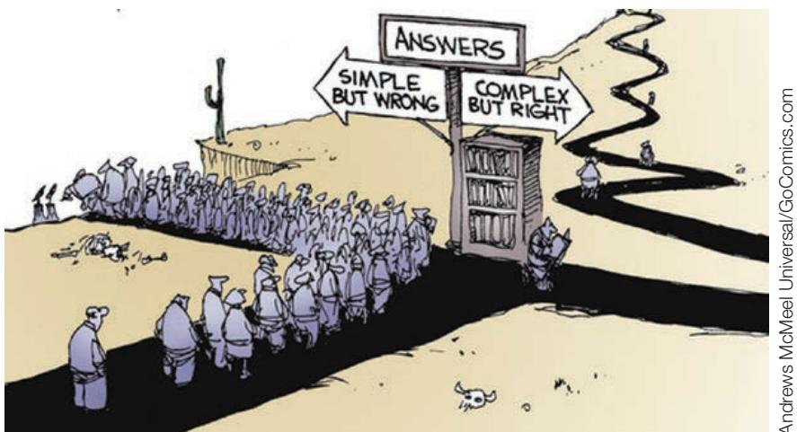

# 24-5 FIRST LESSONS FOR MACROECONOMICS AFTER THE CRISIS

Just when a new synthesis appeared to be in sight and macroeconomists felt that they had the tools to understand the economy and design policy, the financial crisis started, which led to the Great Recession. We saw in Section 24-1 that the Great Depression led to a dramatic reassessment of macroeconomics and started the Keynesian revolution. You may wonder, Will this crisis have the same effect on macroeconomics, leading to yet another revolution? It is too early to say, but my guess is probably not a revolution but a major reassessment.

By and large, the financial system, and the complex role of banks and other financial institutions in the intermediation of funds between lenders and borrowers, was ignored in most macroeconomic models. There were exceptions. Work by Doug Diamond (at Chicago) and Philip Dybvig (at Washington University in St. Louis) in the 1980s had clarified the nature of bank runs (which we examined in Chapter 6). Illiquid assets and liquid liabilities created a risk of runs even for solvent banks. The problem could be avoided only by the provision of liquidity by the central bank if and when needed. Work by Bengt Holmström (at MIT) and Jean Tirole (then at MIT, and now at Toulouse) had shown that liquidity issues were endemic to a modern economy. Not only banks but also firms could well find themselves in a position where they were solvent but illiquid, unable to raise the additional cash to finish a project or unable to repay investors when they wanted repayment. An important paper by Andrei Shleifer (at Harvard) and Robert Vishny (at Chicago) called “The Limits of Arbitrage” had shown that, after a decline in an asset price below its fundamental value, investors might not be able to take advantage of the arbitrage opportunity; indeed, they may themselves be forced to sell the asset, leading to a further decline in the price and a further deviation from fundamentals. Behavioral economists (for example, Richard Thaler, at Chicago) had pointed to the way individuals differ from the rational individual model typically used in economics, and had drawn implications for financial markets.

Thus, most of the elements needed to understand the crisis were available. Much of the work, however, was done outside macroeconomics, in the fields of finance or corporate finance. The elements were not integrated in a consistent macroeconomic model, and their interactions were poorly understood. Leverage, complexity, and liquidity, the factors that, as we saw in Chapter 6, combined to create the crisis, were nearly fully absent from the macroeconomic models used by central banks.

Now more than a decade since the start of the crisis, things have changed dramatically. Not surprisingly, researchers have turned their attention to the financial system and the nature of macrofinancial linkages. Further work is taking place on the various pieces, and these pieces are starting to be integrated into the large macroeconomic models. Lessons for policy are also being drawn, be it on the use of macroprudential tools or the dangers of high public debt. There is still a long way to go, but, in the end, macroeconomic models will be richer, with a better understanding of the financial system. Yet one has to be realistic. If history is any guide, the economy will be hit by another type of shock macroeconomists have not thought of.

The lessons from the crisis probably go beyond adding the financial sector to macroeconomic models and analysis. The Great Depression had, rightly, led most economists to question the macroeconomic properties of a market economy and to suggest a larger role for government intervention. The Great Recession is raising similar questions. Both the new classical and new Keynesian models had in common the belief that, in the medium run at least, the economy naturally returned to its natural level. The new classicals took the extreme position that output was always at its natural level. The new Keynesians took the view that, in the short run, output would likely deviate from its natural level but that, in the medium run, natural forces would eventually return the economy to potential. The Great Depression and the long slump in Japan were well known; they were seen, however, as aberrations and thought to be caused by substantial policy mistakes that could have been avoided. Many economists today believe that this optimism was excessive. The seven years spent in the liquidity trap in the United States made clear that the usual adjustment mechanism—namely, a decrease in interest rates in response to low output—could break down and actually prevent a return to normal.

If there is a consensus, it might be that, with respect to small shocks and normal fluctuations, the adjustment process works; but that, in response to large, exceptional shocks, the normal adjustment process may fail, the room for policy may be limited, and it may take a long time for the economy to repair itself. For the moment, the priority for researchers is to better understand what has happened, and for policymakers to use, as best they can, the monetary and fiscal policy tools they have, to steer the world economy back to health.

Let me end the book with a cartoon. Macroeconomics is complex. I hope the book has helped you understand it better.

## SUMMARY

The history of modern macroeconomics starts in 1936, with the publication of Keynes’s General Theory of Employment, Interest, and Money. Keynes’s contribution was formalized in the IS-LM model by John Hicks and Alvin Hansen in the 1930s and early 1940s.

The period from the early 1940s to the early 1970s can be called the golden age of macroeconomics. Among the major developments were the theories of consumption, investment, money demand, and portfolio choice; growth theory; and large macroeconometric models.

The main debate during the 1960s was between Keynesians and monetarists. Keynesians believed developments in macroeconomic theory allowed for better control of the economy. Monetarists, led by Milton Friedman, were more skeptical of the ability of governments to help stabilize the economy.

In the 1970s, macroeconomics experienced a crisis for two reasons: One was the appearance of stagflation, which came as a surprise to most economists. The other was a theoretical attack led by Robert Lucas. Lucas and his followers showed that when rational expectations were introduced (1) Keynesian models could not be used to determine policy, (2) Keynesian models could not explain long-lasting deviations of output from its natural level, and (3) the theory of policy needed to be redesigned using the tools of game theory.

Much of the 1970s and 1980s was spent integrating rational expectations into macroeconomics. As is reflected in this text, macroeconomists are now much more aware
