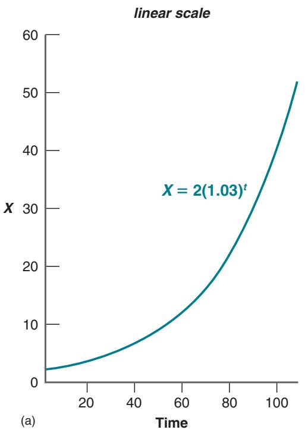
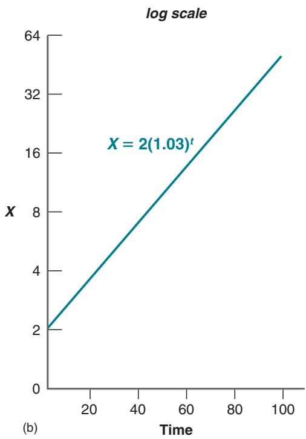
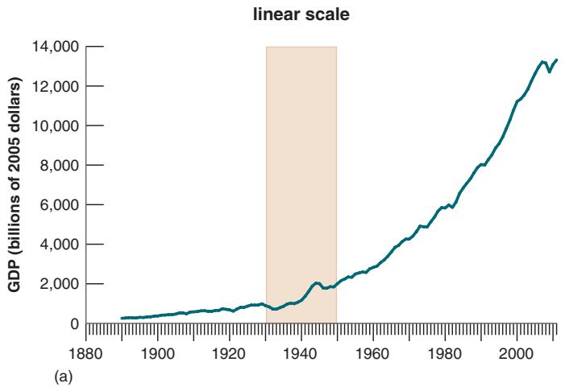
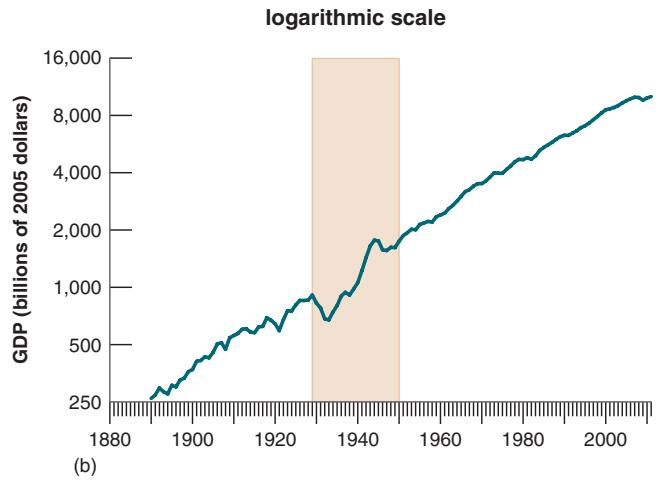
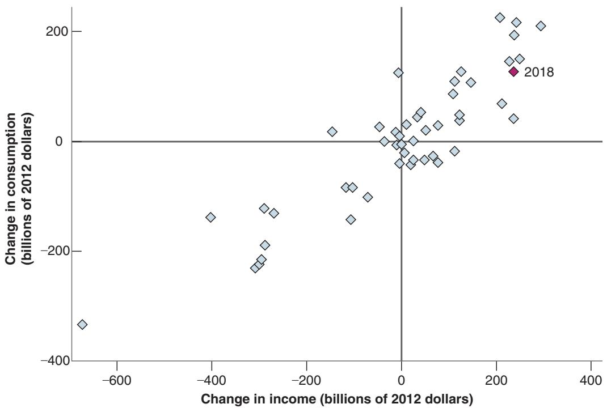
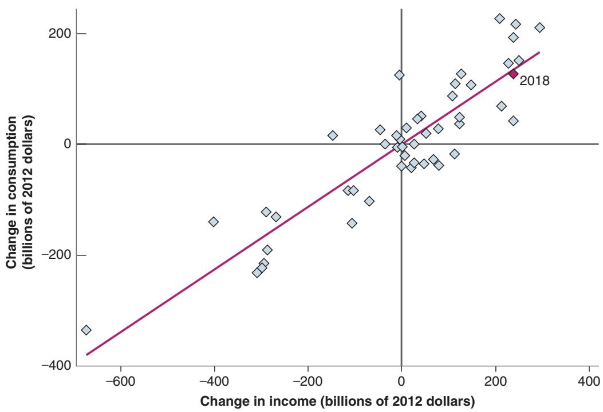

## KEY TERMS

business cycle theory, 508 effective demand, 508 liquidity preference, 508 neoclassical synthesis, 508 Keynesians, 510 monetarists, 510 Lucas critique, 512 random walk of consumption, 513

## FURTHER READINGS

Two classics are John Maynard Keynes, The General Theory of Employment, Interest, and Money (Palgrave Macmillan, 1936) and Milton Friedman and Anna Jacobson Schwartz, A Monetary History of the United States, (Princeton University Press, 1963). The first makes for hard reading, and the second is a heavy volume.

For a more accessible description of Keynes’ work and influence, read Keynes: Useful Economics for the World Economy, by Peter Temin and David Vines (MIT Press, 2014).

of the role of expectations in determining the effects of shocks and policy and of the complexity of policy than they were two decades ago.

Recent research in macroeconomic theory, up to the crisis, proceeded along three lines: New classical economists explored the extent to which fluctuations can be explained as movements in the natural level of output, as opposed to movements away from the natural level of output. New Keynesian economists explored more formally the role of market imperfections in fluctuations. New growth theorists explored the determinants of technological progress. These lines were increasingly overlapping, and, on the eve of the crisis, a new synthesis appeared to be emerging.

The crisis reflects a major intellectual failure on the part of macroeconomics: the failure to understand the macroeconomic importance of the financial system. Although many of the elements needed to understand the crisis had been developed before the crisis, they were not central to macroeconomic thinking and were not integrated in large macroeconomic models. Much research is now focused on macrofinancial linkages.

The crisis also raised a larger issue, about the adjustment process through which output returns to its natural level. If there is a consensus, it might be that with respect to small shocks and normal fluctuations, the adjustment process works and policy can accelerate this return; but that, in response to large, exceptional shocks, the normal adjustment process may fail, the room for policy may be limited, and it may take a long time for the economy to repair itself.

staggering (of wage and price decisions), 514 new classicals, 515 real business cycles, 515 RBC models, 515 new Keynesians, 515 nominal rigidities, 516 menu costs, 516 new growth theory, 516

For an account of macroeconomics in textbooks since the 1940s, read Paul Samuelson’s “Credo of a Lucky Textbook Author,” Journal of Economic Perspectives, 1997, Vol. 11 (Spring): pp. 153–160.

In the introduction to Studies in Business Cycle Theory (MIT Press, 1981), Robert Lucas develops his approach to macroeconomics and gives a guide to his contributions.

The paper that launched real business cycle theory is Edward Prescott, “Theory Ahead of Business Cycle

Measurement,” Federal Reserve Bank of Minneapolis Review, 1986 (Fall): pp. 9–22. It is not easy reading.

For more on new Keynesian economics, read David Romer, “The New Keynesian Synthesis,” Journal of Economic Perspectives, 1993, Vol. 7 (Winter): pp. 5–22.

For more on new growth theory, read Paul Romer, “The Origins of Endogenous Growth,” Journal of Economic Perspectives, 1994, Vol. 8 (Winter): pp. 3–22.

For a detailed look at the history of macroeconomic ideas, with in-depth interviews of most of the major researchers, read Brian Snowdon and Howard Vane, Modern Macroeconomics: Its Origins, Development and Current State (Edward Elgar Publishing Ltd., 2005).

For two points of view on the precrisis state of macroeconomics, read V. V. Chari and Patrick Kehoe, “Macroeconomics in Practice: How Theory Is Shaping Policy,” Journal of Economic Perspectives, 2006, 20(4): pp. 3–28; and N. Gregory Mankiw, “The Macroeconomist as Scientist and Engineer,” Journal of Economic Perspectives, 20(4): pp. 29–46.

For a skeptical view of financial markets and the contributions of Thaler and Shleifer among others, read The Myth of the Rational Market: A History of Risk, Reward, and Delusion on Wall Street, by Justin Fox (Harper Collins Publishers, 2009).

For a discussion of the fiscal and monetary policy challenges facing policymakers today: Rethinking Stabilization Policy: Evolution or Revolution?, by Olivier Blanchard and Lawrence Summers, www.nber.org/papers/w24179, 2018.

If you want to learn more about macroeconomic issues and theory:

For more on the history of economic thought in general (not just macroeconomics), a nice blog site is “The Undercover Historian,” https://beatricecherrier.wordpress. com/

Most economics journals are heavy on mathematics and hard to read, but a few make an effort to be more readerfriendly. The Journal of Economic Perspectives, in particular, has nontechnical articles on current economic research and issues. The Brookings Papers on Economic Activity, published twice a year, analyze current macroeconomic problems; so does Economic Policy, published in Europe, which focuses more on European issues.

Most regional Federal Reserve Banks also publish reviews with easy-to-read articles; these reviews are available free of charge. Among these are the Economic Review, published by the Cleveland Fed; the Economic Review, published by the Kansas City Fed; the New England Economic Review, published by the Boston Fed; and the Quarterly Review, published by the Minneapolis Fed.

More advanced treatments of current macroeconomic theory—roughly at the level of a first graduate course in macroeconomics—are given by David Romer, Advanced Macroeconomics, 5th ed. (McGraw-Hill, 2018) and by Olivier Blanchard and Stanley Fischer, Lectures on Macroeconomics (MIT Press, 1989).

## APPENDIX 1 An Introduction to the National Income and Product Accounts

This appendix introduces the basic structure and the terms used in the national income and product accounts. The basic measure of aggregate activity is gross domestic product (GDP). The national income and product accounts (NIPA), or simply national accounts, are organized around two decompositions of GDP.

One decomposes GDP from the income side: Who receives what?

The other decomposes GDP from the production side (called the product side in the national accounts): What is produced, and who buys it?

## The Income Side

Table A1-1 looks at the income side of GDP—who receives what.

The top part of the table (lines 1–8) goes from GDP to national income—the sum of the incomes received by the different factors of production:

■ The starting point, in line 1, is gross domestic product (GDP). GDP is defined as the market value of the goods and services produced by labor and property located in the United States.

■ The next three lines take us from GDP to gross national product (GNP) (line 4). GNP is an alternative measure of aggregate output. It is defined as the market value of the goods and services produced by labor and property supplied by US residents.

Until the 1990s, most countries used GNP rather than GDP as the main measure of aggregate activity. The emphasis in the US national accounts shifted from GNP to GDP in 1991. The difference between the two comes from the distinction between “located in the United States” (used for GDP) and “supplied by US residents” (used for GNP).

<table><tr><td colspan="3">Table A1-1 GDP: The Income Side, 2018 (billions of dollars)</td></tr><tr><td colspan="3">From gross domestic product to national income:</td></tr><tr><td>1 Gross domestic product (GDP)</td><td>20,494</td><td></td></tr><tr><td>2 Plus: Receipts of factor income from the rest of the world</td><td></td><td>1,076</td></tr><tr><td>3 Minus: Payments of factor income to the rest of the world</td><td></td><td>-815</td></tr><tr><td>4 Equals: Gross national product (GNP)</td><td>20,755</td><td></td></tr><tr><td>5 Minus: Consumption of fixed capital</td><td></td><td>-3,273</td></tr><tr><td>6 Equals: Net national product (NNP)</td><td>17,481</td><td></td></tr><tr><td>7 Minus: Statistical discrepancy</td><td></td><td>-62</td></tr><tr><td>8 Equals: National income</td><td>17,544</td><td></td></tr><tr><td colspan="3">Decomposition of national income:</td></tr><tr><td>9 Indirect taxes</td><td>1,429</td><td></td></tr><tr><td>10 Compensation of employees</td><td>10,856</td><td></td></tr><tr><td>11 Wages and salaries</td><td></td><td>8,834</td></tr><tr><td>12 Supplements to wages and salaries</td><td></td><td>2,021</td></tr><tr><td>13 Corporate profits and business transfers</td><td>2,263</td><td></td></tr><tr><td>14 Net interest</td><td>577</td><td></td></tr><tr><td>15 Proprietors&#x27; income</td><td>1,579</td><td></td></tr><tr><td>16 Rental income of persons</td><td>760</td><td></td></tr><tr><td colspan="3">Source: Survey of Current Business, April 2019, Tables 1-7-5 and 1-12</td></tr></table>

For example, profit from a US-owned plant in Japan is not included in US GDP, but is included in US GNP.

To go from GDP to GNP, we must first add receipts of factor income from the rest of the world, which is income from US capital or US residents abroad (line 2), then subtract payments of factor income to the rest of the world, which is income received by foreign capital and foreign residents in the United States (line 3).

In 2018, payments from the rest of the world exceeded receipts to the rest of the world by \$261 billion, so GNP was larger than GDP by \$261 billion.

The next step takes us from GNP to net national product (NNP) (line 6). The difference between GNP and NNP is the depreciation of capital, called consumption of fixed capital in the national accounts.

■ Finally, lines 7 and 8 take us from NNP to national income (line 8). National income is defined as the income that originates in the production of goods and services supplied by residents of the United States. In theory, national income and NNP should be equal. In practice, they typically differ, because they are constructed in different ways.

NNP is constructed from the top down, starting from GDP and going through the steps shown in Table A1-1. National income is constructed instead from the bottom up, by adding the different components of factor income (compensation of employees, corporate profits, and so on). If we could measure everything exactly, the two measures should be equal. In practice, the two measures differ, and the difference between the two is called the statistical discrepancy. In 2018, national income computed from the bottom up (the number in line 8) was larger than the NNP computed from the top down (the number in line 6) by \$62 billion. The statistical discrepancy is a useful reminder of the statistical problems involved in constructing the national income accounts. Although \$62 billion seems like a large error, as a percentage of GDP, it is about 0.3 percentage point.

The bottom part of the table (lines 9–15) decomposes national income into different types of income.

■ Indirect taxes (line 9). Some of the national income goes directly to the state in the form of sales taxes. (Indirect taxes are just another name for sales taxes.) The rest of national income goes either to employees or to firms:

■ Compensation of employees (line 10), or labor income, is what goes to employees. It is the largest component of national income, accounting for 61% of national income. Labor income is the sum of wages and salaries (line 11) and of supplements to wages and salaries (line 12). These range from employer contributions for social insurance (by far the largest item) to such exotic items as employer contributions to marriage fees for justices of the peace.

■ Corporate profits and business transfers (line 13). Profits are revenues minus costs (including interest payments) and minus depreciation. (Business transfers, which account for \$159 billion out of \$2,263 billion, are items such as liability payments for personal injury and corporate contributions to nonprofit organizations.)

■ Net interest (line 14) is the interest paid by firms minus the interest received by firms, plus interest received from the rest of the world minus interest paid to the rest of the world. In 2018, most of net interest represented net interest paid by firms: The United States received about as much in interest from the rest of the world as it paid to the rest to the world. So the sum of corporate profits plus net interest paid by firms was approximately \$2,263 billion + \$577 billion = \$2,840 billion or about 16% of national income.

■ Proprietors’ income (line 15) is the income received by persons who are self-employed. It is defined as the income of sole proprietorships, partnerships, and taxexempt cooperatives.

■ Rental income of persons (line 16) is the income from the rental of real property, minus depreciation on this real property. Houses produce housing services; rental income measures the income received for these services.

If the national accounts counted only actual rents, rental income would depend on the proportion of apartments and houses that were rented versus those that were owner occupied. For example, if everybody became the owner of the apartment or the house in which he or she lived, rental income would go to zero, and thus measured GDP would drop. To avoid this problem, national accounts treat houses and apartments as if they were all rented out. So, rental income is constructed as actual rents plus imputed rents on houses and apartments that are owner occupied.

Before we move to the product side, Table A1-2 shows how we can go from national income to personal disposable income, which is the income available to persons after they have received transfers and paid taxes.

■ Not all national income (line 1) is distributed to persons.

Some of the income goes to the state in the form of indirect taxes, so the first step is to subtract indirect taxes. (Line 2 in Table A1-2 is equal to line 9 in Table A1-1.)

<table><tr><td colspan="2">Table A1-2</td><td colspan="2">From National Income to Personal Disposable Income, 2018 (billions of dollars)</td></tr><tr><td>1</td><td>National income</td><td>17,544</td><td></td></tr><tr><td>2</td><td>Minus: Indirect taxes</td><td></td><td>-1,429</td></tr><tr><td>3</td><td>Minus: Corporate profits and business transfers</td><td></td><td>-2,263</td></tr><tr><td>4</td><td>Minus: Net interest</td><td></td><td>-577</td></tr><tr><td>5</td><td>Plus: Income from assets</td><td></td><td>2,768</td></tr><tr><td>6</td><td>Plus: Personal transfers</td><td></td><td>2,980</td></tr><tr><td>7</td><td>Minus: Contributions for social insurance</td><td></td><td>-1,361</td></tr><tr><td>8</td><td>Equals: Personal income</td><td>17,582</td><td></td></tr><tr><td>9</td><td>Minus: Personal tax and non-tax payments</td><td></td><td>-2,050</td></tr><tr><td>10</td><td>Equals: Personal disposable income</td><td>15,532</td><td></td></tr><tr><td colspan="4">Source: Survey of Current Business, April 2019, Tables 1-7-5, 1-12, and 2-1</td></tr></table>

Some of the corporate profits are retained by firms. Some of the interest payments by firms go to banks or go abroad. So the second step is to subtract all corporate profits and business transfers (line 3—equal to line 13 in Table A1-1) and all net interest payments (line 4—equal to line 14 in Table A1-1), and add back all income from assets (dividends and interest payments) received by persons (line 5).

■ People receive income not only from production but also from public transfers (line 6). Transfers accounted for \$2,980 billion in 2018. From these transfers must be subtracted personal contributions for social insurance, \$1,361 billion (line 7).

■ The net result of these adjustments is personal income, the income actually received by persons (line 8). Personal disposable income (line 10) is equal to personal income minus personal tax and nontax payments (line 9). In 2018, personal disposable income was \$15,532 billion, or about 75% of GDP.

## The Product Side

Table A1-3 looks at the product side of the national accounts—what is produced, and who buys it.

Start with the three components of domestic demand: consumption, investment, and government spending.

■ Consumption, called personal consumption expenditures (line 2), is by far the largest component of demand. It is defined as the sum of goods and services purchased by persons resident in the United States.

In the same way that national accounts include imputed rental income on the income side, they include imputed housing services as part of consumption.

Owners of a house are assumed to consume housing services for a price equal to the imputed rental income of that house.

Consumption is disaggregated into three components: purchases of durable goods (line 3), nondurable goods (line 4), and services (line 5). Durable goods are commodities that can be stored and have an average life of at least three years; automobile purchases are the largest item here. Nondurable goods are commodities that can be stored but have an average life of less than three years. Services are commodities that cannot be stored and must be consumed at the place and time of purchase.

■ Investment, called gross private domestic fixed investment (line 6), is the sum of two very different components.

Nonresidential investment (line 7) is the purchase of new capital goods by firms. These may be either structures (line 8)—mostly new plants— or equipment and software (line 9)—such as machines, computers, or office equipment.

Residential investment (line 10) is the purchase of new houses or apartments by persons.

■ Government purchases (line 11) equal the purchases of goods by the government plus the compensation of government employees. (The government is thought of as buying the services of the government employees.)

Government purchases equal the sum of purchases by the federal government (line 12), which themselves can be disaggregated between spending on national defense (line 13) and nondefense spending (line 14), and purchases by state and local governments (line 15).

<table><tr><td colspan="4">Table A1-3 GDP: The Product Side, 2018 (billions of dollars)</td></tr><tr><td>1</td><td>Gross domestic product</td><td>20,494</td><td></td></tr><tr><td>2</td><td>Personal consumption expenditures</td><td>13,949</td><td></td></tr><tr><td>3</td><td>Durable goods</td><td></td><td>1,459</td></tr><tr><td>4</td><td>Nondurable goods</td><td></td><td>2,879</td></tr><tr><td>5</td><td>Services</td><td></td><td>9,610</td></tr><tr><td>6</td><td>Gross private domestic fixed investment</td><td>3,650</td><td></td></tr><tr><td>7</td><td>Nonresidential</td><td></td><td>2,799</td></tr><tr><td>8</td><td>Structures</td><td></td><td></td></tr><tr><td>9</td><td>Equipment and software</td><td></td><td></td></tr><tr><td>10</td><td>Residential</td><td></td><td>794</td></tr><tr><td>11</td><td>Government purchases</td><td>3,520</td><td></td></tr><tr><td>12</td><td>Federal</td><td></td><td>1,320</td></tr><tr><td>13</td><td>National defense</td><td></td><td></td></tr><tr><td>14</td><td>Nondefense</td><td></td><td></td></tr><tr><td>15</td><td>State and local</td><td></td><td>2,201</td></tr><tr><td>16</td><td>Net exports</td><td>-625</td><td></td></tr><tr><td>17</td><td>Exports</td><td></td><td>2,531</td></tr><tr><td>18</td><td>Imports</td><td></td><td>-3,156</td></tr><tr><td>19</td><td>Change in business inventories</td><td>56</td><td></td></tr><tr><td colspan="4">Source: Survey of Current Business, April 2019, Table 1-1-5</td></tr></table>

Note that government purchases do not include transfers from the government or interest payments on government debt. These do not correspond to purchases of either goods or services and so are not included here. This means that the number for government purchases shown in Table A1-3 is substantially smaller than the number we typically hear for government spending, which includes transfers and interest payments.

■ The sum of consumption, investment, and government purchases gives the demand for goods by US firms, US persons, and the US government. If the United States were a closed economy, this would be the same as the demand for US goods. But because the US economy is open, the two numbers are different. To get to the demand for US goods, we must make two adjustments. First, we must add the foreign purchases of US goods, exports (line 17). Second, we must subtract US purchases of foreign goods, imports (line 18). In 2014, exports were smaller than imports by \$625 billion. Thus, net exports (or, equivalently, the trade balance), was equal to -\$625 billion (line 16).

■ Adding consumption, investment, government purchases, and net exports gives the total purchases of US goods. Production may, however, be less than purchases if firms satisfy the difference by decreasing inventories. Or production may be greater than purchases, in which case firms are accumulating inventories. The last line of Table A1-3 gives the change in business inventories (line 19), also sometimes called (rather misleadingly) “inventory investment.” It is defined as the change in the volume of inventories held by businesses. The change in business inventories can be positive or negative. In 2014, it was small and positive; US production was higher than total purchases of US goods by \$56 billion.

## The Federal Government in the National Income Accounts

Table A1-4 presents the basic numbers describing federal government economic activity in 2018, using NIPA numbers. (The numbers are sometimes presented using fiscal rather than calendar years. The reason for doing so is that budget projections are typically framed in terms of fiscal year rather than calendar year numbers. The fiscal year runs from October 1 of the previous calendar year to September 30 of the current calendar year.)

The reason for using the NIPA numbers rather than the official budget numbers is that they are economically more meaningful—they are a better representation of what the government is doing in the economy than the numbers presented in the various budget documents. Budget numbers presented by the government need not follow the national income accounting conventions and sometimes involve creative accounting.

<table><tr><td colspan="2">Table A1-4</td><td colspan="2">US Federal Budget Revenues and Expenditures, 2018 (billions of dollars)</td></tr><tr><td>1</td><td>Revenues</td><td>3,500</td><td></td></tr><tr><td>2</td><td>Personal taxes</td><td></td><td>1,614</td></tr><tr><td>3</td><td>Corporate profit taxes</td><td></td><td>158</td></tr><tr><td>4</td><td>Indirect taxes</td><td></td><td>160</td></tr><tr><td>5</td><td>Social insurance contributions</td><td></td><td>1,345</td></tr><tr><td>6</td><td>Other</td><td></td><td>223</td></tr><tr><td>7</td><td>Expenditures, excluding net interest payments</td><td>3,937</td><td></td></tr><tr><td>8</td><td>Consumption expenditures</td><td></td><td>1,032</td></tr><tr><td>9</td><td>Defense</td><td></td><td></td></tr><tr><td>10</td><td>Nondefense</td><td></td><td></td></tr><tr><td>11</td><td>Transfers to persons</td><td></td><td>2,180</td></tr><tr><td>12</td><td>Grants to state/local governments</td><td></td><td>578</td></tr><tr><td>13</td><td>Other</td><td></td><td>147</td></tr><tr><td>14</td><td>Primary balance (+ sign: surplus, - sign: deficit)</td><td>-437</td><td></td></tr><tr><td>15</td><td>Net interest payments</td><td>545</td><td></td></tr><tr><td>16</td><td>Real interest payments</td><td></td><td>258</td></tr><tr><td>17</td><td>Inflation component</td><td></td><td>287</td></tr><tr><td>18</td><td>Official surplus: (1) minus (7) minus (15)</td><td>-982</td><td></td></tr><tr><td>19</td><td>Inflation-adjusted surplus: (18) plus (17)</td><td>-695</td><td></td></tr><tr><td colspan="4">Source: Survey of Current Business, April 2019, Table 3-2. Inflation adjustment calculated using debt from Table B-45, Economic Report of the President.</td></tr></table>

In 2018, federal revenues were \$3,500 billion (line 1). Of those, personal taxes (also called income taxes) accounted for \$1,614 billion, or 46% of revenues; social insurance contributions (also called payroll taxes) accounted for \$1,345 billion, or 38% of revenues.

Expenditures excluding interest payments but including transfer payments to individuals were \$3,937 billion (line 7). Consumption expenditures (mostly wages and salaries of public employees and depreciation of capital) accounted for \$1,032 billion, or 26% of expenditures. Excluding defense, consumption expenditures were only \$254 billion. Transfers to persons (also called entitlement programs, mostly unemployment, retirement, and health benefits) were a much larger \$2,180 billion.

The federal government was therefore running a primary deficit of \$437 billion (line 1 minus line 7, here recorded as a negative value of the primary balance in line 14).

Net interest payments on the debt held by the public totaled \$545 billion (line 15). The official deficit was therefore equal to \$982 billion (line 14 plus line 15).

We know, however, that this measure is incorrect (see the Focus Box “Inflation Accounting and the Measurement of Deficits” in Chapter 22). It is appropriate to correct the official deficit measure for the role of inflation in reducing the real value of the public debt. The correct measure, the inflation-adjusted deficit—the sum of the official deficit plus real interest payments—was \$695 billion (line 19), or 3.4% of GDP.

## Warning

National accounts give an internally consistent description of aggregate activity. But underlying these accounts are many choices of what to include and what not to include, where to put some types of income or spending, and so on. Here are five examples.

■ Work within the home is not counted in GDP. If, for example, two neighbors decide to babysit each other’s child and pay each other for the babysitting services, measured GDP will go up, whereas true GDP clearly does not change. The solution would be to count work within the home in GDP, just as rents are imputed for owner-occupied housing. But, so far, this has not been done.

## Key Terms

■ The purchase of a house is treated as an investment, and housing services are then treated as part of consumption. Contrast this with the treatment of automobiles. Despite the fact that they provide services for a long time—although not as long a time as houses do—purchases of automobiles are not treated as investment. They are treated as consumption and appear in the national accounts only in the year in which they are bought.

■ Firms’ purchases of machines are treated as investment. The purchase of education is treated as consumption of education services. But education is clearly in part an investment; people acquire education in part to increase their future income.

■ Many government purchases have to be valued in net interest, A-2 the national accounts in the absence of a market proprietors’ income, A-2 transaction. How do we value the work of teachers rental income of persons, A-2 in teaching children to read when that transaction is personal income, A-3 mandated by the state as part of compulsory educa- personal disposable income, A-3 tion? The rule used is to value it at cost, so using the personal consumption expenditures, A-3 salaries of teachers. durable goods, A-3

The list could go on. However, the point of these examples is not to make you conclude that national accounts are wrong. Most of the accounting decisions you just saw were made for good reasons, often because of data availability or for simplicity. The point is that to use national accounts best, you should understand their logic, but also understand the choices that have been made and thus their limitations.

## Further Readings

For more details, read “A Guide to the National Income and Product Accounts of the United States,” May 2019 (www.bea.gov/national/pdf/nipaguid.pdf).

## APPENDIX 2 A Math Refresher

This appendix presents the mathematical tools and mathematical results used in this text.

## Geometric Series

Definition. A geometric series is a sum of numbers of the form:

$$
1 + x + x ^ {2} + \dots + x ^ {n}
$$

where x is a number that may be greater or smaller than one, and $x ^ { n }$ denotes x to the power n; that is, x times itself n times.

Examples of such series are:

■ The sum of spending in each round of the multiplier (Chapter 3). If c is the marginal propensity to consume, then the sum of increases in spending after $n + 1$ rounds is given by:

$$
1 + c + c ^ {2} + \dots + c ^ {n}
$$

■ The present discounted value of a sequence of payments of \$1 each year for n years (Chapter 14), when the interest rate is equal to i:

$$
1 + \frac {1}{1 + i} + \frac {1}{(1 + i) ^ {2}} + \dots + \frac {1}{(1 + i) ^ {n - 1}}
$$

We usually have two questions we want to answer with such a series:

1. What is the sum?

2. Does the sum explode as we let n increase, or does it reach a finite limit (and, if so, what is that limit)?

The following propositions tell you what you need to know to answer these questions.

Proposition 1 tells you how to compute the sum:

Proposition 1:

$$
1 + x + x ^ {2} + \dots + x ^ {n} = \frac {1 - x ^ {n + 1}}{1 - x}\tag{A2.1}
$$

Here is the proof: Multiply the sum by $( 1 - x )$ , and use the fact that $x ^ { a } x ^ { b } = x ^ { a + b }$ (that is, you must add exponents when multiplying):

$$
\begin{array}{r l} (1 + x + x ^ {2} + \dots + x ^ {n}) (1 - x) & = 1 + x + x ^ {2} + \dots + x ^ {n} \\ & - x - x ^ {2} - \dots - x ^ {n} - x ^ {n + 1} \\ & = 1 \quad \quad \quad \quad - x ^ {n + 1} \end{array}
$$

All the terms on the right except for the first and the last cancel. Dividing both sides by $( 1 - x )$ gives equation (A2.1).

This formula can be used for any x and any n. If, for example, x is 0.9 and n is 10, then the sum is 6.86. If x is 1.2 and n is 10, then the sum is 32.15.

Proposition 2 tells you what happens as n gets large:

Proposition 2: If x is less than one, the sum goes to $1 / ( 1 - x )$ as n gets large. If x is equal to or greater than one, the sum explodes as n gets large.

Here is the proof: If x is less than one, then $x ^ { n }$ goes to zero as n gets large. Thus, from equation (A2.1), the sum goes to $1 / ( 1 - x )$ . If x is greater than one, then $x ^ { n }$ becomes larger and larger as $x ^ { n }$ increases, $1 \ - \ x ^ { n }$ becomes a larger and larger negative number, and the ratio $( 1 - x ^ { n } ) / ( 1 - x )$ becomes a larger and larger positive number. Thus, the sum explodes as n gets large.

Application from Chapter 14: Consider the present value of a payment of \$1 forever, starting next year, when the interest rate is i. The present value is given by:

$$
\frac {1}{(1 + i)} + \frac {1}{(1 + i) ^ {2}} + \dots\tag{A2.2}
$$

Factoring out $1 / ( 1 + i )$ , rewrite this present value as:

$$
\frac {1}{(1 + i)} \bigg [ 1 + \frac {1}{(1 + i)} + \dots \bigg ]
$$

The term in brackets is a geometric series, with $x = 1 / ( 1 + i )$ . As the interest rate i is positive, x is less than 1. Applying Proposition 2, when n gets large, the term in brackets equals

$$
\frac {1}{1 - \frac {1}{(1 + i)}} = \frac {(1 + i)}{(1 + i - 1)} = \frac {(1 + i)}{i}
$$

Replacing the term in brackets in the previous equation by $( 1 + i ) / i$ gives:

$$
\frac {1}{(1 + i)} \bigg [ \frac {(1 + i)}{i} \bigg ] = \frac {1}{i}
$$

The present value of a sequence of payments of \$1 a year forever, starting next year, is equal to \$1 divided by the interest rate. If i is equal to 5% per year, the present value equals \$1 $\mathbf { \nabla } / 0 . 0 5 = \mathbb { S } 2 0$

## Useful Approximations

Throughout this text, we use a number of approximations that make computations easier. These approximations are most reliable when the variables x, y, and z are small, say between 0 and 10%. The numerical examples in Propositions 3–10 are based on the values $x = 0 . 0 5$ and $y = 0 . 0 3$

Proposition 3:

$$
(1 + x) (1 + y) \approx (1 + x + y)\tag{A2.3}
$$

Here is the proof. Expanding $\left( 1 + x \right) \left( 1 + y \right)$ gives $\left( 1 + x \right) \left( 1 + y \right) = 1 + x + y + x y .$ . If x and y are small, then the product xy is very small and can be ignored as an approximation (for example, if $x = 0 . 0 5$ and $y = 0 . 0 3$ then $x y = 0 . 0 0 1 5 )$ . So, $( 1 + x ) ( 1 + y )$ is approximately equal to $( 1 + x + y )$ .The approximation (on the right side) gives 1.08 compared to an exact value (on the left) of 1.0815.

Proposition 4:

$$
(1 + x) ^ {2} \approx 1 + 2 x\tag{A2.4}
$$

The proof follows directly from Proposition 3, with $y = x .$ For the value of $x = 0 . 0 5$ , the approximation gives 1.10, compared to an exact value of 1.1025.

Application from Chapter 14: From arbitrage, the relation between the two-year interest rate and the current and the expected one-year interest rates is given by:

$$
(1 + i _ {2 t}) ^ {2} = (1 + i _ {1 t}) (1 + i _ {1 t + 1} ^ {e})
$$

Using Proposition 4 for the left side of the equation gives:

$$
(1 + i _ {2 t}) ^ {2} \approx 1 + 2 i _ {2 t}
$$

Using Proposition 3 for the right side of the equation gives:

$$
(1 + i _ {1 t}) (1 + i _ {1 t + 1} ^ {e}) \approx 1 + i _ {1 t} + i _ {1 t + 1} ^ {e}
$$

Using this expression to replace $( 1 + i _ { 1 t } ) ( 1 + i _ { 1 t + 1 } ^ { e } )$ in the original arbitrage relation gives:

$$
1 + 2 i _ {2 t} = 1 + i _ {1 t} + i _ {1 t + 1} ^ {e}
$$

Or, reorganizing:

$$
i _ {2 t} = \frac {(i _ {1 t} + i _ {1 t + 1} ^ {e})}{2}
$$

The two-year interest rate is approximately equal to the average of the current and the expected one-year interest rates.

## Proposition 5:

$$
(1 + x) ^ {n} \approx 1 + n x\tag{A2.5}
$$

The proof follows by repeated application of Propositions 3 and 4. For example, $( 1 + x ) ^ { 3 } = ( 1 + x ) ^ { 2 } ( 1 + x ) \approx ( 1 + 2 x ) ( 1 + x )$ by Proposition $4 , \approx ( 1 + 2 x + x ) = 1 + 3 x$ by Proposition 3.

The approximation becomes worse as n increases, however. For example, for $x = 0 . 0 5$ and $n = 5$ , the approximation gives 1.25, compared to an exact value of 1.2763. For $n = 1 0$ , the approximation gives 1.50, compared to an exact value of 1.63.

Proposition 6:

$$
\frac {(1 + x)}{(1 + y)} \approx (1 + x - y)\tag{A2.6}
$$

Here is the proof: Consider the product of $( 1 + x - y ) ( 1 + y )$ . Expanding this product gives $( 1 + x - y ) ( 1 + y ) = 1 + x + x y - y ^ { 2 } .$ If both x and y are small, then xy and $y ^ { 2 }$ are very small, so $( 1 + x - y ) ( 1 + y ) \approx ( 1 + x )$ . Dividing both sides of this approximation by $( 1 + y )$ gives the preceding proposition.

For the values of $x = 0 . 0 5$ and $y = 0 . 0 3$ , the approximation gives 1.02, while the correct value is nearly the same, 1.019.

Application from Chapter 14: The real interest rate is defined by:

$$
(1 + r _ {t}) = \frac {(1 + i _ {t})}{(1 + \pi_ {t + 1} ^ {e})}
$$

Using Proposition 6 gives

$$
(1 + r _ {t}) \approx (1 + i _ {t} - \pi_ {t + 1} ^ {e})
$$

Simplifying:

$$
r _ {t} \approx i _ {t} - \pi_ {t + 1} ^ {e}
$$

This gives us the approximation we use at many points in this text. The real interest rate is approximately equal to the nominal interest rate minus expected inflation.

These approximations are also convenient when dealing with growth rates. Define the rate of growth of x by $g _ { x } \equiv \Delta x / x ,$ , and similarly for $z , g _ { z }$ , and $y , g _ { y } .$ The numerical examples below are based on the values $g _ { x } = 0 . 0 5$ and $g _ { y } = 0 . 0 3$

Proposition 7: If z = xy then:

$$
g _ {z} \approx g _ {x} + g _ {y}\tag{A2.7}
$$

Here is the proof: Let $\Delta z$ be the increase in z when x increases by $\Delta x$ and y increases by $\Delta y .$ . Then, by definition:

$$
z + \Delta z = (x + \Delta x) (y + \Delta y)
$$

Divide both sides by z.

The left side becomes:

$$
\frac {(z + \Delta z)}{z} = \left(1 + \frac {\Delta z}{z}\right)
$$

The right-hand side becomes

$$
\begin{array}{r l} \frac {(x + \Delta x) (y + \Delta y)}{z} & = \frac {(x + \Delta x) (y + \Delta y)}{x} \\ & = \bigg (1 + \frac {\Delta x}{x} \bigg) \bigg (1 + \frac {\Delta y}{y} \bigg) \end{array}
$$

where the first equality follows from the fact that $z = x y$ the second equality from simplifying each of the two fractions.

Using the expressions for the left and right sides gives:

$$
\left(1 + \frac {\Delta z}{z}\right) = \left(1 + \frac {\Delta x}{x}\right) \left(1 + \frac {\Delta y}{y}\right)
$$

Or, equivalently,

$$
(1 + g _ {z}) = (1 + g _ {x}) (1 + g _ {y})
$$

From Proposition 3, $( 1 + g _ { z } ) \approx ( 1 + g _ { x } + g _ { y } )$ ,or, equivalently,

$$
g _ {z} \approx g _ {x} + g _ {y}
$$

For $g _ { x } = 0 . 0 5$ and $g _ { y } = 0 . 0 3$ , the approximation gives $g _ { z } = 8 \%$ , while the correct value is 8.15%.

Application from Chapter 13: Let the production function be of the form $Y = N A$ , where Y is production, N is employment, and A is productivity. Denoting the growth rates of Y, N, and A by $g _ { Y } , g _ { N } ,$ , and $g _ { A }$ respectively, Proposition 7 implies

$$
g _ {Y} \approx g _ {N} + g _ {A}
$$

The rate of output growth is approximately equal to the rate of employment growth plus the rate of productivity growth.

Proposition 8: If $z = x / y ,$ , then

$$
g _ {z} \approx g _ {x} - g _ {y}\tag{A2.8}
$$

Here is the proof: Let ∆z be the increase in z, when x increases by ∆x and y increases by ∆y. Then, by definition:

$$
z + \Delta z = \frac {x + \Delta x}{y + \Delta y}
$$

Divide both sides by z.

The left side becomes:

$$
\left(\frac {z + \Delta z}{z}\right) = \left(1 + \frac {\Delta z}{z}\right)
$$

The right side becomes:

$$
\frac {(x + \Delta x) 1}{(y + \Delta y) z} = \frac {(x + \Delta x) y}{(y + \Delta y) x} = \frac {(x + \Delta x) / x}{(y + \Delta y) / y} = \frac {1 + (\Delta x / x)}{1 + (\Delta y / y)}
$$

where the first equality comes from the fact that $z = x / y$ the second equality comes from rearranging terms, and the third equality comes from simplifying.

Using the expressions for the left and right sides gives:

$$
1 + \Delta z / z = \frac {1 + (\Delta x / x)}{1 + (\Delta y / y)}
$$

Or, substituting:

$$
1 + g _ {z} = \frac {1 + g _ {x}}{1 + g _ {y}}
$$

From Proposition 8, $( 1 + g _ { z } ) \approx ( 1 + g _ { x } - g _ { y } ) , 0 \mathrm { r } ,$ equivalently,

$$
g _ {z} \approx g _ {x} - g _ {y}
$$

For $g _ { x } = 0 . 0 5$ and $g _ { y } = 0 . 0 3$ , the approximation gives $g _ { z } = 2 \%$ , while the correct value is 1.9%.

Application from Chapter 9: Let M be nominal money, P be the price level. It follows that the rate of growth of the real money stock M/P is given by:

$$
g _ {M / P} \approx g _ {M} - \pi
$$

where p is the rate of growth of prices or, equivalently, the rate of inflation.

## Functions

We use functions informally in this text, as a way of denoting how a variable depends on one or more other variables.

In some cases, we look at how a variable Y moves with a variable X. We write this relation as

$$
Y = \underset {+} {f (X)}
$$

A plus sign below X indicates a positive relation; an increase in X leads to an increase in Y. A minus sign below X indicates a negative relation; an increase in X leads to a decrease in Y.

In some cases, we allow the variable Y to depend on more than one variable. For example, we allow Y to depend on X and Z:

$$
\begin{array}{c} Y = f (X, Z) \\ (+, -) \end{array}
$$

The signs indicate that an increase in X leads to an increase in Y, and that an increase in Z leads to a decrease in Y.

An example of such a function is the investment function (5.1) in Chapter 5:

$$
\begin{array}{c} I = I (Y, i) \\ (+, -) \end{array}
$$

This equation says that investment, I, increases with production, Y, and decreases with the interest rate, i.

In some cases, it is reasonable to assume that the relation between two or more variables is a linear relation. A given increase in X always leads to the same increase in Y. In that case, the function is given by:

$$
Y = a + b X
$$

This relation can be represented by a line giving Y for any value of X.

The parameter a gives the value of Y when X is equal to zero. It is called the intercept because it gives the value of Y when the line representing the relation “intercepts” (crosses) the vertical axis.

The parameter b tells us by how much Y increases when X increases by one unit. It is called the slope because it is equal to the slope of the line representing the relation.

A simple linear relation is the relation Y = X, which is represented by the 45-degree line and has a slope of 1. Another example of a linear relation is the consumption function (3.2) in Chapter 3:

$$
C = c _ {0} + c _ {1} Y _ {D}
$$

where C is consumption and $Y _ { D }$ is disposable income. $c _ { 0 }$ tells us what consumption would be if disposable income were equal to zero. $c _ { 1 }$ tells us by how much consumption increases when income increases by 1 unit; $c _ { 1 }$ is called the marginal propensity to consume.

## Logarithmic Scales

A variable that grows at a constant growth rate increases by larger and larger increments over time. Take a variable X that grows over time at a constant growth rate of, say, 3% per year.

  
Figure A2-1

■ Start in year 0 and assume X = 2. A 3% increase in X represents an increase of $0 . 0 6 ( 0 . 0 3 \times 2 )$ 2.

■ Go to year 20. X is now equal to $2 ( 1 . 0 3 ) ^ { 2 0 } = 3 . 6 1$ A 3% increase now represents an increase of $0 . 1 1 ( 0 . 0 3 \times 3 . 6 1 )$

■ Go to year 100. X is equal to $2 ( 1 . 0 3 ) ^ { 1 0 0 } = 3 8 . 4 . \mathrm { A }$ 3% increase represents an increase of $1 . 1 5 ( 0 . 0 3 \times 3 8 . 4 )$ so an increase about 20 times larger than in year 0.

If we plot X against time using a standard (linear) vertical scale, the plot looks like Figure A2-1(a). The increases in X become larger and larger over time (0.06 in year 0, 0.11 in year 20, 1.15 in year 100). The curve representing X against time becomes steeper and steeper.

Another way of representing the evolution of X is to use a logarithmic scale to measure X on the vertical axis. The property of a logarithmic scale is that the same proportional increase in this variable is represented by the same vertical distance on the scale. So the behavior of a variable such as X that increases by the same proportional increase (3%) each year is now represented by a line. Figure A2-1(b) represents the behavior of X, this time using a logarithmic scale on the vertical axis. The fact that the relation is represented by a line indicates that X is growing at a constant rate over time. The higher the rate of growth, the steeper the line.

  
(a) The evolution of X (using a linear scale) (b) The evolution of X (using a logarithmic scale)

  
Figure A2-2

  
(a) US GDP since 1890 (using a linear scale) (b) US GDP since 1890 (using a logarithmic scale)  
Source: 1890–1928: Historical Statistics of the United States, Table F1-5, adjusted for level to be consistent with the post-1929 series. 1929–2011 BEA, billions of chained 2005 dollars. www.bea.gov/national/index.htm#gdp.

In contrast to X, economic variables such as GDP do not grow at a constant growth rate every year. Their growth rate may be higher in some decades, lower in others; a recession may lead to a few years of negative growth. When looking at their evolution over time, it is often more informative to use a logarithmic scale rather than a linear scale. Let’s see why.

Figure A2-2(a) plots real US GDP from 1890 to 2011 using a standard (linear) scale. Because real US GDP is about 51 times bigger in 2011 than in 1890, the same proportional increase in GDP is 51 times bigger in 2011 than in 1890. So the curve representing the evolution of GDP over time becomes steeper and steeper over time. It is difficult to see from the figure whether the US economy is growing faster or slower than it was 50 years or 100 years ago.

Figure A2-2(b) plots US GDP from 1890 to 2011 using a logarithmic scale. If the growth rate of GDP was the same every year—so the proportional increase in GDP was the same every year—the evolution of GDP would be represented by a line, the same way the evolution of X was represented by a line in Figure A2-1(b). Because the growth rate of GDP is not constant from year to year—so the proportional increase in GDP is not the same every year—the evolution of GDP is no longer represented by a line. Unlike in

Figure A2-2(a), GDP does not explode over time, and the graph is more informative. Here are two examples.

■ If, in Figure A2-2(b), we were to draw a line to fit the curve from 1890 to 1929, and another line to fit the curve from 1950 to 2011 (the two periods are separated by the shaded area in Figure A2-2(b)), the two lines would have roughly the same slope. What this tells us is that the average growth rate was roughly the same during the two periods.

■ The decline in output from 1929 to 1933 is visible in Figure A2-2(b). (By contrast, the Great Recession looks small relative to the Great Depression.) So is the strong recovery of output that follows. By the 1950s, output appears to be back to its old trend line. This suggests that the Great Depression was not associated with a permanently lower level of output.

Note in both cases that you could not have derived these conclusions by looking at Figure A2-2(a), but you can derive them by looking at Figure A2-2(b). This shows the usefulness of using a logarithmic scale.

## Key Terms

■ linear relation, A-9

■ intercept, A-10

■ slope, A-10

Source: FRED: PCECCA, GDPC1

## APPENDIX 3 An Introduction to Econometrics

How do we know that consumption depends on income? How do we know the value of the propensity to consume?

To answer these questions and, more generally, to estimate behavioral relations and find out the values of the relevant parameters, economists use econometrics—the set of statistical techniques designed for use in economics. Econometrics can get very technical, but I shall outline in this appendix the basic principles behind it, using as an example the consumption function introduced in Chapter 3. We’ll concentrate on estimating $c _ { 1 }$ , the propensity to consume out of income.

## Changes in Consumption and in Disposable Income

The propensity to consume tells us by how much consumption changes for a given change in income. A natural first step is simply to plot changes in consumption versus changes in income and see how the relation between the two looks. (For simplicity, I shall use GDP as a measure of income. Clearly, a better specification would use disposable personal income, as well as other variables such as wealth, and allow consumption to depend not only on current income but on past income as well. I ignore these complications here.)

You can see the relation in Figure A3-1.

The vertical axis in Figure A3-1 measures the annual change in consumption minus the average annual change in consumption, for each year from 1970 to 2018. More precisely:

Let $C _ { t }$ denote consumption in year t. Let $\Delta C _ { t }$ denote $C _ { t } - C _ { t - 1 } ,$ the change in consumption from year t - 1 to year t. Let ∆C denote the average annual change in consumption since 1970. The variable measured on the vertical axis is constructed as $\Delta C _ { t } - \overline { { \Delta C } } . $ A positive value of the variable represents an increase in consumption larger than average, whereas a negative value represents an increase in consumption smaller than average.

Similarly, the horizontal axis measures the annual change in income, minus the average annual change in income since 1970, $\Delta Y _ { t } - \overline { { \Delta Y } }$

A particular dot in the figure gives the deviations of the change in consumption and income from their respective means for a particular year between 1970 and 2018. In 2018, for example, the change in consumption was higher than average by \$127 billion, and the change in income was higher than average by \$237 billion. (The point corresponding to 2018 is indicated by the red dot. For our purposes, it is not important to know which year each dot refers to, just what the set of points in the diagram looks like. So, except for 2018, the years are not indicated in Figure A3-1.)

Figure A3-1 suggests two main conclusions.

■ One, there is a clear positive relation between changes in consumption and changes in income. Most of the

Changes in Consumption versus Changes in Income, 1970–2018

There is a clear positive relation between changes in consumption and changes in income.

The regression line is the line that best fits the scatter of points.

Figure A3-2  
  
Changes in Consumption and Changes in Income: The Regression Line

points lie in the upper-right and lower-left quadrants of the figure. When income increases by more than average, consumption also typically increases by more than average; when income increases by less than average, so typically does consumption.

■ Two, the relation between the two variables is good but not perfect. In particular, some points lie in the upperleft quadrant; these points correspond to years when smaller-than-average changes in income were associated with higher-than-average changes in consumption.

Econometrics allows us to state these two conclusions more precisely and to get an estimate of the propensity to consume. Using an econometrics software package, we can find the line that best fits the cloud of points in Figure A3-1. This line-fitting process is called ordinary least squares (OLS).1 The estimated equation corresponding to the line is called a regression, and the line itself is called the regression line.

In this case, the estimated equation is given by

$$
\begin{array}{c} (\Delta C _ {t} - \overline {{\Delta C}}) = 0. 5 6 (\Delta Y _ {t} - \overline {{\Delta Y}}) + \text {residual} \\ \overline {{R}} ^ {2} = 0. 8 1 \end{array}\tag{A3.1}
$$

The regression line corresponding to this estimated equation is drawn in Figure A3-2. Equation (A3.1) reports two important numbers. (Econometrics packages give more information than that reported above; a typical printout, together with further explanations, is given in the Focus Box “A Guide to Understanding Econometric Results.”)

■ The first important number is the estimated propensity to consume. The equation tells us that an increase in income of \$1 billion above normal is typically associated with an increase in consumption of \$0.56 billion above normal. In other words, the estimated propensity to consume is 0.56. It is positive but smaller than 1.

■ The second important number is $\overline { { R } } ^ { 2 }$ , which is a measure of how well the regression line fits.

Having estimated the effect of income on consumption, we can decompose the change in consumption for each year into the part that is due to the change in income—the first term on the right in equation (A3.1)—and the rest, which is called the residual. For example, the residual for 2018 is indicated in Figure A3-2 by the vertical distance from the point representing 2018 to the regression line. It turns out that the point for 2018 is nearly on the regression line (this is just a coincidence), so the residual is very small. If all the points in Figure A3-2 were exactly on the estimated line, all residuals would be zero; all changes in consumption would be explained by changes in income. As you can see, however, this is not the case. $\overline { { R } } ^ { 2 }$ is a statistic that tells us how well the line fits. $\overline { { R } } ^ { 2 }$ is always between 0 and 1. A value of 1 would imply that the relation between the two variables is perfect, that all points are exactly on the regression line. A value of
