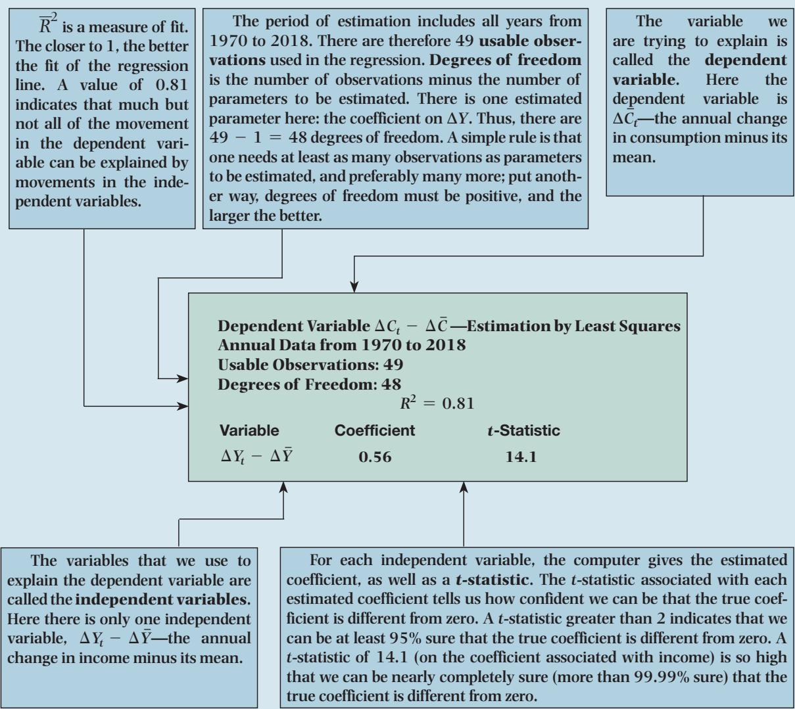
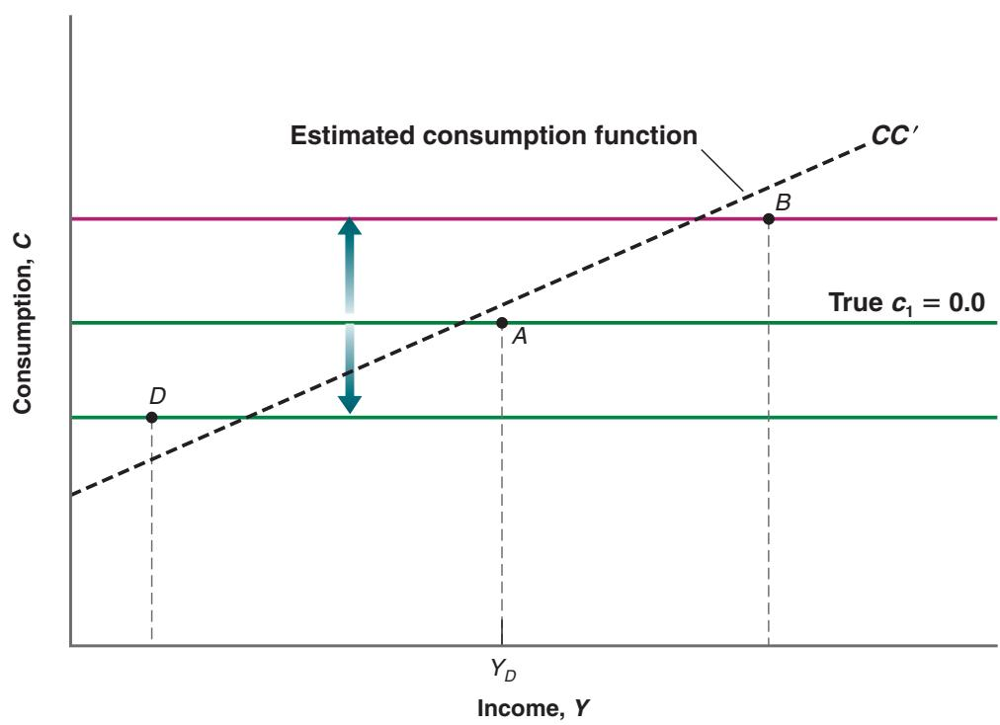

# A Guide to Understanding Econometric Results

zero would imply that the computer can see no relation between the two variables. The value of $\overline { { R } } ^ { 2 }$ of 0.81 in equation (A3.1) is high, confirming the message from Figure A3-2: Movements in income clearly affect consumption, but there is still quite a bit of movement in consumption that cannot be explained by movements in income.

## Correlation versus Causality

We have established that consumption and income typically move together. More formally, we have seen that there is a positive correlation—the technical term for co-relation—between annual changes in consumption and annual changes in income. And we have interpreted this relation as showing causality—that an increase in income causes an increase in consumption.

We need to think again about this interpretation. A positive relation between consumption and income may reflect the effect of income on consumption. But it may also reflect the effect of consumption on income. Indeed, the model we developed in Chapter 3 tells us that if, for any reason, consumers decide to spend more, then output and therefore income will increase. If part of the relation between consumption and income comes from the effect of consumption on income, interpreting equation (A3.1) as telling us about the effect of income on consumption is not right.

An example will help here. Suppose consumption

## Figure A3-3

## A Misleading Regression

The relation between income and consumption comes from the effect of consumption on income rather than from the effect of income on consumption.

does not depend on income, so that the true value of $c _ { 1 }$ is zero. (This is not realistic, but it will make the point most clearly.) So draw the consumption function as a horizontal line (a line with a zero slope) in Figure A3-3. Next, suppose income equal to Y, so that the initial combination of consumption and income is given by point A.

Now suppose that, because of improved confidence, consumers increase their consumption, so the consumption line shifts up. If demand affects output, output and therefore income will increase, so that the new combination of consumption and income will be given by, say, point B. If, instead, consumers become more pessimistic, the consumption line will shift down, and so will output, leading to a combination of consumption and income given by, say, point D.

If we look at the economy described in the previous two paragraphs, we observe points A, B, and D. If, as we did previously, we draw the best-fitting line through these points, we shall estimate an upward-sloping line, such as $C C ^ { \prime }$ , and thus a positive value for propensity to consume, $c _ { 1 }$ Remember, however, that the true value of $c _ { 1 }$ is zero. Why do we get the wrong answer—a positive value for $c _ { \mathrm { T } } ^ { \ }$ —when the true value is zero? Because we interpret the positive relation between income and consumption as showing the effect of income on consumption, where, in fact, the relation reflects the effect of consumption on income; higher consumption leads to higher demand, higher output, and so higher income.

There is an important lesson here: the difference between correlation and causality. The fact that two variables move together does not imply that movements in the first variable cause movements in the second variable. Perhaps the causality runs the other way: movements in the second variable cause movements in the first variable. Or perhaps, as is likely to be the case here, the causality runs both ways: income affects consumption, and consumption affects income.

Is there a way out of the correlation-versus-causality problem? If we are interested—and we are—in the effect of income on consumption, can we still learn that from the data? The answer: yes, but only by using more information.

Suppose we knew that a specific change in income was not caused by a change in consumption. Then, by looking at the reaction of consumption to this change in income, we could learn how consumption responds to income; we could estimate the propensity to consume.

This answer would seem to simply assume away the problem. How can we tell that a change in income is not due to a change in consumption? In fact, sometimes, we can tell. Suppose, for example, that there is an increase in exports due to strong foreign demand, leading to an increase in output and therefore an increase in income. In that case, if both income and consumption increase, it is likely that the movement in consumption reflects the effect of income on consumption, and we can then estimate the propensity to consume.

This example suggests a general strategy.

■ Find exogenous variables—that is, variables that affect income but are not in turn affected by it. Exports is a decent candidate in this case. Another one might be defense spending.

■ Look at the change in consumption in response not to all changes in income—as we did in the previous regression—but in response to the changes in income that can be explained by changes in these exogenous variables.

By following this strategy, we can be reasonably confident that what we are estimating is the effect of income on consumption, and not the other way around.

The problem of finding such exogenous variables is known as the identification problem in econometrics. These exogenous variables, when they can be found, are called instruments. Methods of estimation that rely on the use of such instruments are called instrumental variable methods.

When equation (A3.1) is estimated using an instrumental variable method—using exports as the instrument— rather than OLS as we did previously, the estimated equation becomes

$$
(\Delta C _ {t} - \overline {{\Delta C}}) = 0. 4 1 (\Delta Y _ {t} - \overline {{\Delta Y}})
$$

Note that the coefficient on income, 0.41, is smaller than the 0.56 in equation (A3.1). This decrease in the estimated propensity to consume is what we would expect. Our previous estimate in equation (A3.1) reflected not only the effect of income on consumption but also the effect of consumption back on income. The use of an instrument eliminates this second effect, which is why we find a smaller estimated effect of income on consumption.

This short introduction to econometrics is no substitute for a course in econometrics. But it gives you a sense of how economists use data to estimate relations and parameters and to identify causal relations between economic variables.
