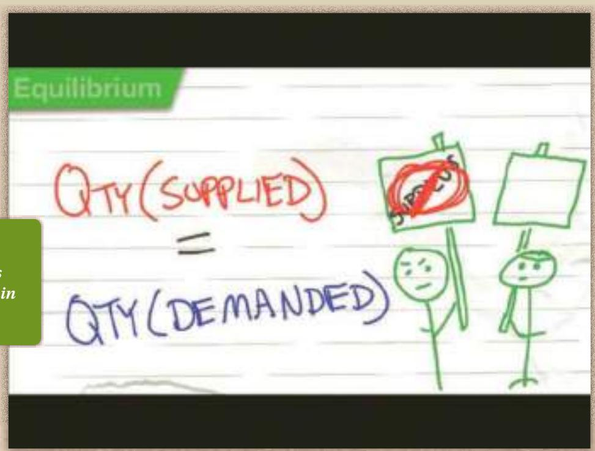
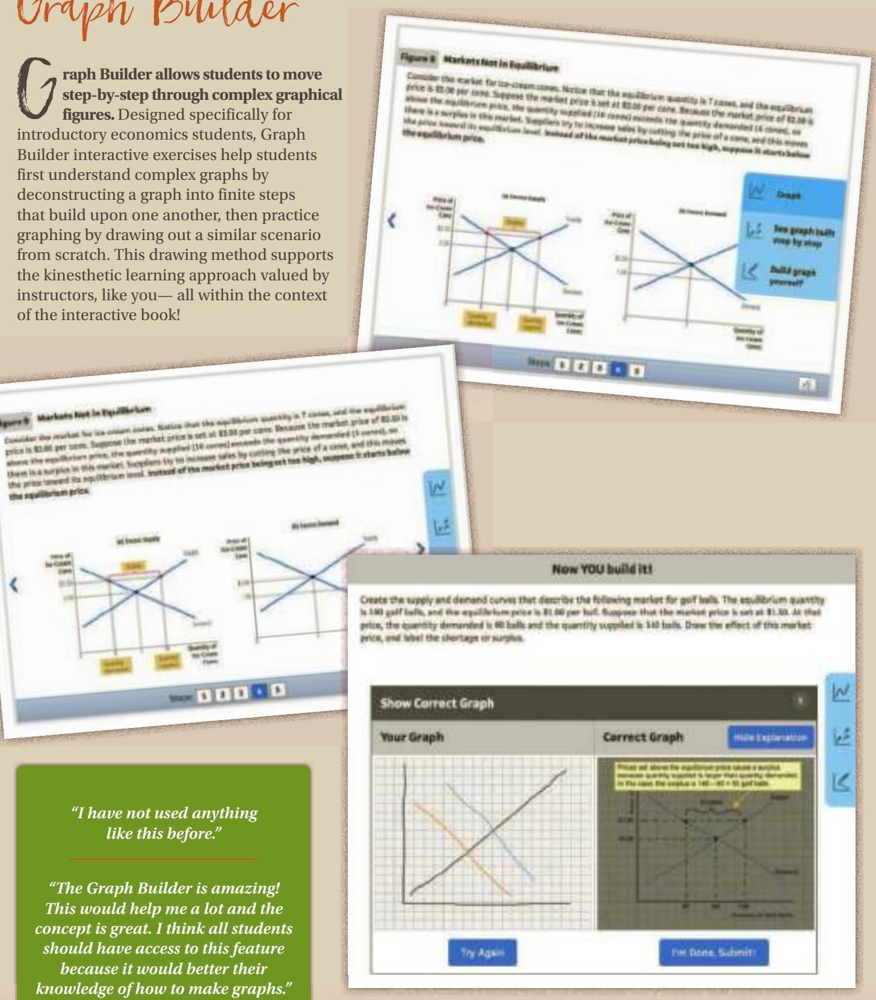
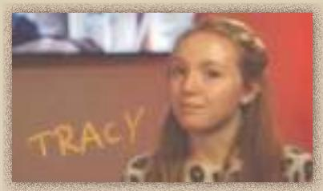
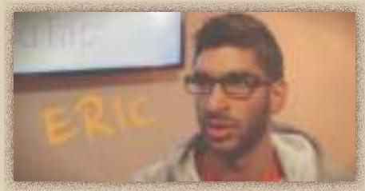
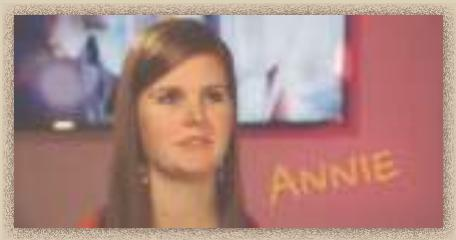
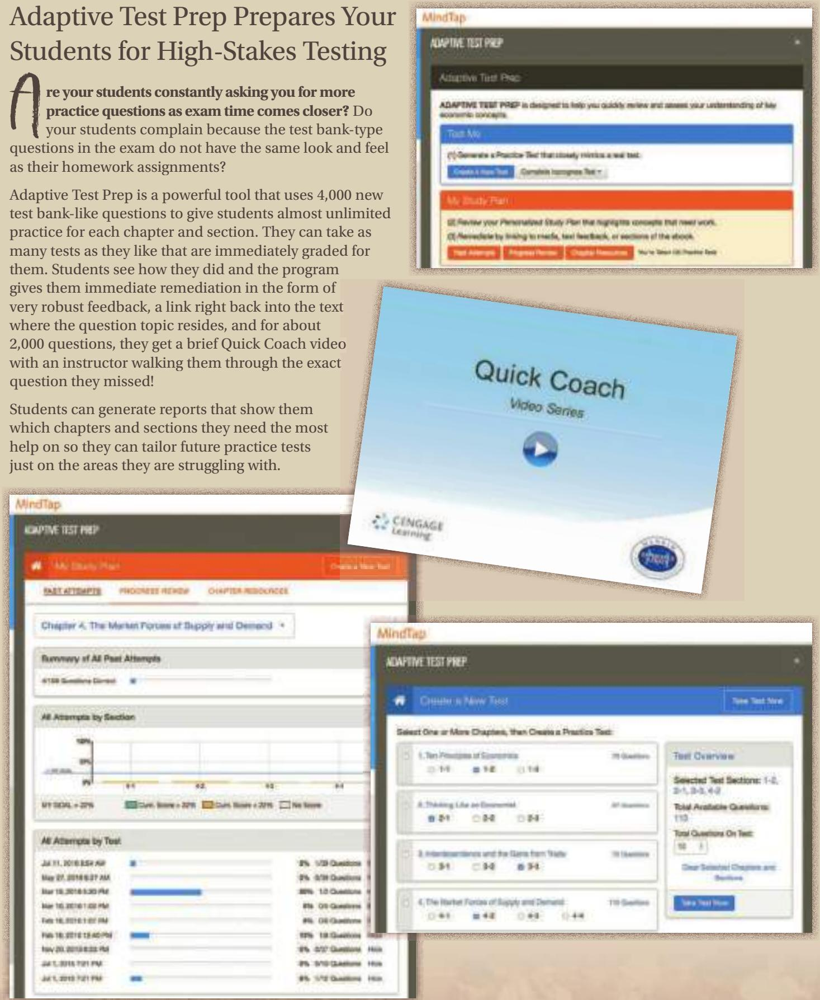

# Brief Contents

## PART I Introduction 1

1 Ten Principles of Economics 3

2 Thinking Like an Economist 19

3 Interdependence and the Gains from Trade 47

## PART II How Markets Work 63

4 The Market Forces of Supply and Demand 65

5 Elasticity and Its Application 89

6 Supply, Demand, and Government Policies 111

## PART III Markets and Welfare 131

7 Consumers, Producers, and the Efficiency of Markets 133

8 Application: The Costs of Taxation 153

9 Application: International Trade 167

## PART IV The Data of Macroeconomics 187

10 Measuring a Nation’s Income 189

11 Measuring the Cost of Living 211

## PART V The Real Economy in the Long Run 229

12 Production and Growth 231

13 Saving, Investment, and the Financial System 257

14 The Basic Tools of Finance 279

15 Unemployment 293

## PART VI Money and Prices in the Long Run 317

16 The Monetary System 319

17 Money Growth and Inflation 343

## PART VII The Macroeconomics of Open Economies 367

18 Open-Economy Macroeconomics:

Basic Concepts 369

19 A Macroeconomic Theory of the

Open Economy 393

## PART VIII Short-Run Economic Fluctuations 415

20 Aggregate Demand and Aggregate Supply 417

21 The Influence of Monetary and Fiscal Policy on Aggregate Demand 453

22 The Short-Run Trade-off between Inflation and Unemployment 479

## PART IX Final Thoughts 503

23 Six Debates over Macroeconomic Policy 505

## Preface: To the Student

“ conomics is a study of mankind in the ordinary business of life.” So wroteAlfred Marshall, the great 19th-century economist, in his textbook, PrinciplesE Alfred Marshall, the great 19th-century economist, in his textbook, Principles of Economics. We have learned much about the economy since Marshall’s time, but this definition of economics is as true today as it was in 1890, when the first edition of his text was published.

Why should you, as a student in the 21st century, embark on the study of economics? There are three reasons.

The first reason to study economics is that it will help you understand the world in which you live. There are many questions about the economy that might spark your curiosity. Why are apartments so hard to find in New York City? Why do airlines charge less for a round-trip ticket if the traveler stays over a Saturday night? Why is Robert Downey, Jr., paid so much to star in movies? Why are living standards so meager in many African countries? Why do some countries have high rates of inflation while others have stable prices? Why are jobs easy to find in some years and hard to find in others? These are just a few of the questions that a course in economics will help you answer.

The second reason to study economics is that it will make you a more astute participant in the economy. As you go about your life, you make many economic decisions. While you are a student, you decide how many years to stay in school. Once you take a job, you decide how much of your income to spend, how much to save, and how to invest your savings. Someday you may find yourself running a small business or a large corporation, and you will decide what prices to charge for your products. The insights developed in the coming chapters will give you a new perspective on how best to make these decisions. Studying economics will not by itself make you rich, but it will give you some tools that may help in that endeavor.

The third reason to study economics is that it will give you a better understanding of both the potential and the limits of economic policy. Economic questions are always on the minds of policymakers in mayors’ offices, governors’ mansions, and the White House. What are the burdens associated with alternative forms of taxation? What are the effects of free trade with other countries? What is the best way to protect the environment? How does a government budget deficit affect the economy? As a voter, you help choose the policies that guide the allocation of society’s resources. An understanding of economics will help you carry out that responsibility. And who knows: Perhaps someday you will end up as one of those policymakers yourself.

Thus, the principles of economics can be applied in many of life’s situations. Whether the future finds you following the news, running a business, or sitting in the Oval Office, you will be glad that you studied economics.

N. Gregory Mankiw December 2016

## Video Alication

ideo application features the book’s author introducing chapter content. Author Greg Mankiw introduces the important themes in every chapter by delivering a highly relevant deposition on the real-world context to the economic principles that will be appearing in the upcoming chapter. These videos are intended to motivate students to better understand how economics relates to their day-to-day lives and in the world around them.

## ConceptClip Videos

onceptClip videos help students master economics terms. These high-energy videos, embedded throughout the interactive book, address the known student challenge of understanding economics terminology when initially introduced to the subject matter. Developed by Professor Mike Brandl of The Ohio State University, these concept-based animations provide students with

memorable context to the key terminology required for your introductory economics course.

“I have always wanted supplemental material such as this to help me understand certain concepts in economics.”

## Graph Builder

G raph Builder allows students to movestep-by-step through complex graphi step-by-step through complex graphical figures. Designed specifically for introductory economics students, Graph Builder interactive exercises help students first understand complex graphs by deconstructing a graph into finite steps that build upon one another, then practice graphing by drawing out a similar scenario from scratch. This drawing method supports the kinesthetic learning approach valued by instructors, like you— all within the context of the interactive book!

## “I have not used anything like this before.”

“The Graph Builder is amazing! This would help me a lot and the concept is great. I think all students should have access to this feature because it would better their knowledge of how to make graphs.”

## Study and Test Prep

## The Mankiw Study Guide is now a part of MindTap!

he study guide by David Hakes for Mankiw’s Principles of Economics has long been the standard of what a print study guide could be. Students like how it reinforces the text and improves understanding of the chapter content. Now for the eighth edition, the study guide is integrated right into the MindTap course at no additional charge!

For each chapter, students get the same great resources that users of the print Study Guide have always received:

• The Chapter Overview

• Problems and Short Answers

• Self-Test

• Advanced Critical Thinking

• Solutions for All Study Guide Questions

  
David Hakes and Greg Mankiw

#

“Additional practice with problems is extremely helpful, especially when combined with the immediate feedback that I received via the online server.”

“The adaptive feedback system was incredibly useful, because by the time the test rolled around I didn’t always remember what I had struggled with in previous weeks.”

## Adaptive Test Prep Prepares Your Students for High-Stakes Testing

A re your students constantly asking you for more practice questions as exam time comes closer? Do your students complain because the test bank-type questions in the exam do not have the same look and feel as their homework assignments?

Adaptive Test Prep is a powerful tool that uses 4,000 new test bank-like questions to give students almost unlimited practice for each chapter and section. They can take as many tests as they like that are immediately graded for them. Students see how they did and the program gives them immediate remediation in the form of very robust feedback, a link right back into the text where the question topic resides, and for about 2,000 questions, they get a brief Quick Coach video with an instructor walking them through the exact question they missed!

Students can generate reports that show them which chapters and sections they need the most help on so they can tailor future practice tests just on the areas they are struggling with.

  
Copyright 2018 Cengage Learning. All Rights Reserved. May not be copied, scanned, or duplicated, in whole or in part. WCN 02-200-203

n writing this book, I benefited from the input of many talented people. Indeed, the list of people who have contributed to this project is so long, and their contributions so valuable, that it seems an injustice that only a single name appears on the cover.

Let me begin with my colleagues in the economics profession. The many editions of this text and its supplemental materials have benefited enormously from their input. In reviews and surveys, they have offered suggestions, identified challenges, and shared ideas from their own classroom experience. I am indebted to them for the perspectives they have brought to the text. Unfortunately, the list has become too long to thank those who contributed to previous editions, even though students reading the current edition are still benefiting from their insights.

Most important in this process has been David Hakes (University of Northern Iowa). David, a dedicated teacher, has served as a reliable sounding board for ideas and is a hardworking partner with me in putting together the superb package of supplements. In addition, a special thanks to Ron Cronovich, an insightful instructor and trusted advisor, for his many years of consultation.

A special thanks to the team of teaching economists who worked on the test bank and ancillaries for this edition, many of whom have been working on the Mankiw ancillaries from the beginning. To Ken McCormick for vetting the entire test bank (with 17,000 questions) for correctness, and to Ken Brown, Sarah Cosgrove, Harold Elder, Michael Enz, Lisa Jepsen, Bryce Kanago, Daniel Marburger, Amanda Nguyen, Alicia Rosburg, Forrest Spence, and Kelvin Wong for authoring new questions and updating existing ones.

The following reviewers of the seventh edition provided suggestions for refining the content, organization, and approach in the eighth.

Mark Abajian, San Diego Mesa College

Rahi Abouk, University of Wisconsin Milwaukee

William Aldridge, University of Alabama–Tuscaloosa

Mathew Abraham, Indiana University – Purdue University Indianapolis

Ali Ataiifar, Delaware County Community College

Nathanael Adams, Cardinal Stritch University

Donald L. Alexander, Western Michigan University

Seemi Ahmad, Dutchess Community College

May Akabogu-Collins, Mira Costa College–Oceanside

Ercument Aksoy, Los Angeles Valley College

Hassan Aly, Ohio State University

Rashid Al-Hmoud, Texas Tech University

Michelle Amaral, University of the Pacific

Shannon Aucoin, University of Louisiana Lafayette

Basil Al-Hashimi, Mesa Community College

Shahina Amin, University of Northern Iowa

Catalina Amuedo-Dorantes, San Diego State University

Vivette Ancona, Hunter College–CUNY

Aba Anil, University of Utah

Diane Anstine, North Central College

Carolyn Arcand, University of Massachusetts Boston

Lisa Augustyniak, Lake Michigan College

Becca Arnold, San Diego Community College

Wesley Austin, University of Louisiana Lafayette

Dennis Avola, Framingham State University

Regena M. Aye, Allen Community College

Sang Hoo Bae, Clark University

Karen Baehler, Hutchinson Community College

Sahar Bahmani, University of Wisconsin-Parkside

Mohsen Bahmani-Oskooee, University of Wisconsin Milwaukee

Richard Baker, Copiah-Lincoln Community College

Stacey Brook, University of Iowa

Keith Brouhle, Grinnell College

Dmitriy Chulkov, Indiana University Kokomo

Stephen Baker, Capital University

Byron Brown, Michigan State University

Lawrence Cima, John Carroll University

Tannista Banerjee, Auburn University

Crystal Brown, Anderson University

Bob Barnes, DePaul University

Cindy Clement, University of Maryland

Hamid Bastin, Shippensburg University

Kris Bruckerhoff, University of Minnesota-Crookston

James Bathgate, Western Nevada College

Matthew Clements, St. Edward’s University

Leon Battista, Albertus Magnus College

Christopher Brunt, Lake Superior State University

Sondra Collins, University of Southern Mississippi

Gerald Baumgardner, Susquehanna University

Laura Bucila, Texas Christian University

Donna Bueckman, University of Tennessee–Knoxville

Tina Collins, San Joaquin Valley College

Christoph Bauner, University of Massachusetts–Amherst

Scott Comparato, Southern Illinois University

Don Bumpass, Sam Houston State University

Elizabeth Bayley, University of Delaware

Kathleen Conway, Carnegie Mellon University

Ergin Bayrak, University of Southern California

Joe Bunting, St. Andrews University

Benjamin Burden, Temple College

Stephen Cotten, University of Houston Clear Lake

Nihal Bayraktar, Pennsylvania State University

Mariya Burdina, University of Central Oklahoma

Jim Cox, Georgia Perimeter College

Mike Belleman, St. Clair County Community College

Rob Burrus, University of North Carolina–Wilmington

Michael Craig, University of Tennessee–Knoxville

Audrey Benavidez, Del Mar College

James Butkiewicz, University of Delaware

Matt Critcher, University of Arkansas Community College at Batesville

Cynthia Benelli, University of California Santa Barbara

William Byrd, Troy University

Anna Cai, University of Alabama–Tuscaloosa

George Crowley, Troy University, Troy

Charles Bennett, Gannon University

David Cullipher, Arkansas State University-Mountain Home

Bettina Berch, Borough of Manhattan Community College

Samantha Cakir, Macalester College

Michael Carew, Baruch College

Dusan Curcic, University of Virginia

Stacey Bertke, Owensboro Community & Technical College

William Carner, Westminster College

Norman Cure, Macomb Community College

Craig Carpenter, Albion College

Tibor Besedes, Georgia Institute of Technology

John Carter, California State University-Stanislaus

Maria DaCosta, University of Wisconsin–EauClaire

Abhijeet Bhattacharya, Illinois Valley Community College

Ginette Carvalho, Fordham University

Bruce Dalgaard, St. Olaf College

Onur Celik, Quinnipiac University

Anusua Datta, Philadelphia University

Ronald Bishop, Lake Michigan College

Avik Chakrabarti, University of Wisconsin–Milwaukee

Earl Davis, Nicholls State University

Thomas Bishop, California State Channel Islands

Amanda Dawsey, University of Montana

Nicole Bissessar, Kent State University-Ashtabula

Kalyan Chakraborty, Emporia State University

Prabal De, City College of New York

Suparna Chakraborty, Baruch College–CUNY

Rooj Debasis, Kishwaukee College

Janet Blackburn, San Jacinto South College

Dennis Debrecht, Carroll University

Dustin Chambers, Salisbury University

Jeanne Boeh, Augsburg College

William DeFrance, University of Michigan-Flint

Silvana Chambers, Salisbury University

Natalia Boliari, Manhattan College

Krishnamurti Chandrasekar, New York Institute of Technology

Antonio Bos, Tusculum College

Theresa J. Devine, Brown University

Jennifer Bossard, Doane College

Paramita Dhar, Central Connecticut State University

Yong Chao, University of Louisville

James Boudreau, University of Texas– Pan American

David Chaplin, Northwest Nazarene University

Ahrash Dianat, George Mason University

Mike Bowyer, Montgomery Community College

Xudong Chen, Baldwin-Wallace College

Stephanie Dieringer, University of South Florida St. Petersburg

Yi-An Chen, University of Washington, Seattle

William Brennan, Minnesota State University–Mankato

Du Ding, Northern Arizona University

Kirill Chernomaz, San Francisco State University

Liang Ding, Macalester College

Genevieve Briand, Washington State University

Ron Cheung, Oberlin College

Parks Dodd, Georgia Institute of Technology

Scott Broadbent, Western Kentucky University

Hui-Chu Chiang, University of Central Oklahoma

Veronika Dolar, Long Island University

Greg Brock, Georgia Southern University

Zachary Donohew, University of Central Arkansas

Ivy Broder, American University

Mainul Chowdhury, Northern Illinois University

Todd Broker, Murray State University

Kirk Doran, University of Notre Dame

Craig Dorsey, College of DuPage

Caf Dowlah, Queensborough Community College–CUNY

Edgar Ghossoub, University of Texas at San Antonio

Eric Jacobson, University of Delaware

Tanya Downing, Cuesta College

Alex Gialanella, Manhattanville College

Bolormaa Jamiyansuren, Augsburg College

Michael J. Driscoll, Adelphi University

Bill Gibson, University of Vermont

Justin Jarvis, Orange Coast College

Ding Du, Northern Arizona University

Kenneth Gillingham, Yale University

Kevin Dunagan, Oakton community college

Andres Jauregui, Columbus State University

Gregory Gilpin, Montana State University

Ricot Jean, Valencia College

Nazif Durmaz, University of Houston–Victoria

Robert Godby, University of Wyoming

Michal Jerzmanowski, Clemson University

Jayendra Gokhale, Oregon State University

Tomas Dvorak, Union College

Eva Dziadula, Lake Forest College

Bonnie Johnson, California Lutheran University

Joel Goldhar, IIT/Stuart School of Business

Dirk Early, Southwestern University

Bruce Johnson, Centre College

Ann Eike, University of Kentucky

Michael Goode, Central Piedmont Community College

Paul Johnson, University of Alaska Anchorage

Harold Elder, University of Alabama–Tuscaloosa

Michael J Gootzeit, University of Memphis

Philipp Jonas, KV Community College

Lynne Elkes, Loyola University Maryland

Adam Jones, University of North Carolina–Wilmington

Jackson Grant, US Air Force Academy

Diantha Ellis, Abraham Baldwin College

Jeremy Groves, Northern Illinois University

Jason Jones, Furman University

Noha Emara, Columbia University

Roger Jordan, Baker College

Michael Enz, Framingham State University

Ilhami Gunduz, Brooklyn College–CUNY

James Jozefowicz, Indiana University of Pennsylvania

David Epstein, The College of New Jersey

Roberts Halsey, Indiana University

Sujana Kabiraj, Louisiana State University

Lee Erickson, Taylor University

Michele Hampton, Cuyahoga Community College Eastern

Simran Kahai, John Carroll University

Sarah Estelle, Hope College

Leo Kahane, Providence College

Pat Euzent, University of Central Florida–Orlando

James Hartley, Mount Holyoke College

Venoo Kakar, San Francisco State University

Mike Haupert, University of Wisconsin LaCrosse

Timothy Ewest, Wartburg College

David Kalist, Shippensburg University

Yang Fan, University of Washington

David Hedrick, Central Washington University

Lillian Kamal, University of Hartford

Amir Farmanesh, University of Maryland

Willie Kamara, North Lake College

Evert Van Der Heide, Calvin College

MohammadMahdi Farsiabi, Wayne State University

Robert Kane, State University of New York-Fredonia

Sara Helms, Samford University

Jessica Hennessey, Furman University

Julie Finnegan, Mendocino College

David Karemera, St. Cloud State University

Ryan Finseth, University of Montana

Thomas Henry, Mississippi State University

Logan Kelly, University of Wisconsin

Donna Fisher, Georgia Southern University

Alexander Hill, University of Colorado-Boulder

Craig Kerr, California State Polytechnic University-Pomona

Nikki Follis, Chadron State College

Bob Holland, Purdue University

Joseph Franklin, Newberry College

Wahhab Khandker, University of Wisconsin–LaCrosse

Paul Holmes, Ashland University

Matthew Freeman, Mississippi State University

Kim Hoolda, Fordham University

Jongsung Kim, Bryant University

Aaron Hoshide, University of Maine

Kihwan Kim, Rutgers

Gary Frey, City College of New York

Michael Hoyte, York College

Ted Fu, Shenandoah University

Elsy Kizhakethalackal, Bowling Green State University

Glenn Hsu, University of Central Oklahoma

Winnie Fung, Wheaton College

Todd Knoop, Cornell College

Marc Fusaro, Arkansas Tech University

Kuang-Chung Hsu, University of Central Oklahoma

Fred Kolb, University of Wisconsin–EauClaire

Todd Gabe, University of Maine

Mary Gade, Oklahoma State University

Jim Hubert, Seattle Central Community College

Oleg Korenok, Virginia Commonwealth University

Jonathan Gafford, Columbia State Community College

George Hughes, University of Hartford

Iris Geisler, Austin Community College

Janet Koscianski, Shippensburg University

Andrew Hussey, University of Memphis

Jacob Gelber, University of Alabama at Birmingham

Kafui Kouakou, York College

Christopher Hyer, University of New Mexico

Robert Gentenaar, Pima Downtown Community College

Mikhail Kouliavtsev, Stephen F. Austin State University

Kent Hymel, California State University–Northridge

Soma Ghosh, Albright College

Maria Kula, Roger Williams University

Miren Ivankovic, Anderson University

Nakul Kumar, Bloomsburg University

Ben Kyer, Francis Marion University

Yuexing Lan, Auburn Montgomery

Daniel Lawson, Oakland Community College

Charles Meyrick, Housatonic Community College

Germain Pichop, Oklahoma City Community College

Heather Micelli, Mira Costa College

Elena Lazzari, Marygrove College

Lodovico Pizzati, University of Southern California

Quan Le, Seattle University

Laura Middlesworth, University of Wisconsin–Eau Claire

Florenz Plassmann, Binghamton University

Chun Lee, Loyola Marymount University

Meghan Mihal, St. Thomas Aquinas College

Daniel Lee, Shippensburg University

Lana Podolak, Community College of Beaver County

Eric Miller, Oakton Community College

Jihoon Lee, Northeastern University

Phillip Mixon, Troy University–Troy

Jim Lee, Texas A&M–Corpus Christi

Gyan Pradhan, Eastern Kentucky University

Junghoon Lee, Emory University

Evan Moore, Auburn University–Montgomery

Curtis Price, University of Southern Indiana

Ryan Lee, Indiana University

Francis Mummery, California State University–Fullerton

Sang Lee, Southeastern Louisiana University

Silvia Prina, Case Western Reserve University

James Leggette, Belhaven University

John Mundy, St. Johns River State University

Thomas Prusa, Rutgers University

Bozena Leven, The College of New Jersey

Qing Li, College of the Mainland

Charles Murray, The College of Saint Rose

Conrad Puozaa, University of Mississippi

Zhen Li, Albion College

James Murray, University of Wisconsin–LaCrosse

Carlos Liard-Muriente, Central Connecticut State University

John Stuart Rabon, Missouri State University

Mark Reavis, Arkansas Tech University

Larry Lichtenstein, Canisius College

Christopher Mushrush, Illinois State University

Robert Rebelein, Vassar College

Jenny Liu, Portland State University

John Nader, Davenport University

Agne Reizgeviciute, California State University-Chico

Jialu Liu, Allegheny College

Sam Liu, West Valley College

Max Grunbaum Nagiel, Daytona State College

Matt Rendleman, Southern Illinois University

Xuepeng Liu, Kennesaw State University

Mihai Nica, University of Central Oklahoma

Jie Ma, Indiana University

Judith Ricks, Onondaga Community College

Michael Machiorlatti, Oklahoma City Community College

Scott Niederjohn, Lakeland College

Mark Nixon, Fordham University

Chaurey Ritam, Binghamton University

Bruce Madariaga, Montgomery College and Northwestern University

George Norman, Tufts University

Jared Roberts, North Carolina State University

Brinda Mahalingam, University of Alabama-Huntsville

David O’Hara, Metropolitan State University

Josh Robinson, University of Alabama-Birmingham

Brian O’Roark, Robert Morris University

C. Lucy Malakar, Lorain County Community College

Yanira Ogrodnik, Post University

Kristen Roche, Mount Mary College

Wafa Orman, University of Alabama in Huntsville

Antonio Rodriguez, Texas A&M International University

Paula Manns, Atlantic Cape Community College

Glenda Orosco, Oklahoma State University Institute of Technology

Debasis Rooj, Kishwaukee College

Gabriel Manrique, Winona State University

Larry Ross, University of Alaska

Orgul Ozturk, University of South Carolina

Dan Marburger, Arizona State University

Subhasree Basu Roy, Missouri State University

Jennifer Pakula, Saddleback College

Hardik Marfatia, Northeastern Illinois University

Jeff Rubin, Rutgers University–New Brunswick

Maria Papapavlou, San Jacinto Central College

Jason C. Rudbeck, University of Georgia

Christina Marsh, Wake Forest University

Nitin Paranjpe, Wayne State University

Jeff Ruggiero, University of Dayton

William McAndrew, Gannon University

Irene Parietti, Felician College

Robert Rycroft, University of Mary Washington

Jooyoun Park, Kent State University

Katherine McClain, University of Georgia

Dodd Parks, Georgia Institute of Technology

Allen Sanderson, University of Chicago

Malkiat Sandhu, San Jose City College

Michael McIlhon, Century College

Jason Patalinghug, University of New Haven

Lisle Sanna, Ursinus College

Steven McMullen, Hope College

Nese Sara, University of Cincinnati

Jennifer McNiece, Howard Payne University

Michael Patton, St. Louis Community College–Wildwood

Naveen Sarna, Northern Virginia Community College–Alexandria

Robert Menafee, Sinclair Community College

Wesley Pech, Wofford College

Eric Sartell, Whitworth University

Fabio Mendez, Loyola University Maryland

Josh Phillips, Iowa Central Community College

Martin Schonger, Princeton University

Andy Schuchart, Iowa Central Community College

Michael Schultz, Menlo College

Jessica Schuring, Central College

Dean Stansel, Florida Gulf Coast University

Mark Tuttle, Sam Houston State University

Danielle Schwarzmann, Towson University

Sylwia Starnawska, D’Youville College

Jennifer VanGilder, Ursinus College

Keva Steadman, Augustana College

Gerald Scott, Florida Atlantic University

Ross vanWassenhove, University of Houston

Rebecca Stein, University of Pennsylvania

Elan Segarra, San Francisco State University

Ben Vaughan, Trinity University

Dale Steinreich, Drury University

Bhaswati Sengupta, Iona College

Roumen Vesselinov, Queens College, City University of New York

Paul Stock, University of Mary Hardin-Baylor

Reshmi Sengupta, Northern Illinois University

Rubina Vohra, St. Peter’s College

Michael Stroup, Stephen F. Austin State University

Will Walsh, Samford University

Dan Settlage, University of Arkansas-Fort Smith

Chih-Wei Wang, Pacific Lutheran University

Edward Stuart, Northeastern Illinois University

David Shankle, Blue Mountain College

Jingjing Wang, University of New Mexico

Alex Shiu, McLennan Community College

Yang Su, University of Washington

Yu-hsuan Su, University of Washington

Chad Wassell, Central Washington University

Robert Shoffner, Central Piedmont Community College

Samanta Subarna, The College of New Jersey

Christine Wathen, Middlesex Community College

Mark Showalter, Brigham Young University

Abdul Sukar, Cameron University

Burak Sungu, Miami University

Sanchit Shrivastava, University of Utah

J. Douglas Wellington, Husson University

John Susenburger, Utica College

Johnny Shull, Wake Tech Community College

James Swofford, University of South Alabama

Adam Werner, California Polytechnic State University

Suann Shumaker, Las Positas College

Vera Tabakova, East Carolina U niversity

Sarah West, Macalester College

Nicholas Shunda, University of Redlands

Elizabeth Wheaton, Southern Methodist University

Ariuna Taivan, University of Minnesota-Duluth

Milan Sigetich, Southern Oregon University

Eftila Tanellari, Radford University

Oxana Wieland, University of Minnesota, Crookston

Jonathan Silberman, Oakland University

Eric Taylor, Central Piedmont Community College

Joe Silverman, Mira Costa College–Oceanside

Christopher Wimer, Bowling Green State University–Firelands College

Erdal Tekin, Georgia State University

Do Youn Won, University of Utah

Silva Simone, Murray State University

Noreen Templin, Butler Community College

Kelvin Wong, University of Minnesota

Harmeet Singh, Texas A&M University–Kingsville

Ken Woodward, Saddleback College

Thomas Tenerelli, Central Washington University

Irena Xhurxhi, York College

Catherine Skura, Sandhills Community College

Xu Xu, Mississippi state university

Gary Smith, Canisius College

Anna Terzyan, California State University-Los Angeles

Ying Yang, University of Rhode Island

Richard Smith, University of South Florida–St. Petersburg

Petros Tesfazion, Ithaca College

Young-Ro Yoon, Wayne State University

Charles Thompson, Brunswick Community College

Eric Zemjic, Kent State University

Joe Sobieralski, Southwestern Illinois College–Belleville

Yongchen Zhao, Towson University

Flint Thompson, Chippewa Valley Technical College

Mario Solis-Garcia, Macalester College

Zhen Zhu, University of Central Oklahoma

Arjun Sondhi, Wayne State University

Deborah Thorsen, Palm Beach State College–Central

Soren Soumbatiants, Franklin University

Kent Zirlott, University of Alabama–Tuscaloosa

James Tierney, University of California Irvine

Matt Souza, Indiana University – Purdue University Columbus

Joseph Zwiller, Lake Michigan College

Nekeisha Spencer, Binghamton University

Julie Trivitt, Arkansas Tech University

Arja Turunen-Red, University of New Orleans

The team of editors who worked on this book improved it tremendously. Jane Tufts, developmental editor, provided truly spectacular editing—as she always does. Michael Parthenakis, senior product manager, did a splendid job of overseeing the many people involved in such a large project. Anita Verma, senior content developer, was crucial in assembling an extensive and thoughtful group of reviewers to give me feedback on the previous edition, while putting together an excellent team to revise the supplements. Colleen Farmer, senior content project manager, had the patience and dedication necessary to turn my manuscript into this book. Kasie Jean, digital content designer and a trained economist, designed and implemented all of the valuable student resources in MindTap. Michelle Kunkler, senior art director, gave this book its clean, friendly look. Bruce Morser, the illustrator, helped make the book more visually appealing and the economics in it less abstract. Pamela Rockwell, copyeditor, refined my prose, and Lumina Datamatic’s indexer, prepared a careful and thorough index. John Carey, executive marketing manager, worked long hours getting the word out to potential users of this book. The rest of the Cengage team has, as always, been consistently professional, enthusiastic, and dedicated.

I am grateful also to Denis Fedin and Nina Vendhan, two star Harvard undergraduates, who helped me refine the manuscript and check the page proofs for this edition.

As always, I must thank my “in-house” editor Deborah Mankiw. As the first reader of most things I write, she continued to offer just the right mix of criticism and encouragement.

Finally, I would like to mention my three children Catherine, Nicholas, and Peter. Their contribution to this book was putting up with a father spending too many hours in his study. The four of us have much in common—not least of which is our love of ice cream (which becomes apparent in Chapter 4).

N. Gregory Mankiw

December 2016

  
Preface: To the Student ix Acknowledgments xv

