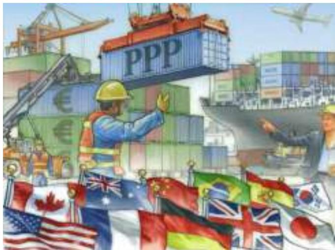

# PART VI Money and Prices in the Long Run 317

CHAPTER 16

The Monetary System 319

16-1 The Meaning of Money 320 16-1a The Functions of Money 321 16-1b The Kinds of Money 321 IN THE NEWS: Why Gold? 322 16-1c Money in the U.S. Economy 323 CASE STUDY: Where Is All the Currency? 324 FYI: Why Credit Cards Aren’t Money 325

16-2 The Federal Reserve System 325 16-2a The Fed’s Organization 325 16-2b The Federal Open Market Committee 326

16-3 Banks and the Money Supply 327 16-3a The Simple Case of 100-Percent-Reserve Banking 327 16-3b Money Creation with Fractional-Reserve Banking 328 16-3c The Money Multiplier 329

16-3d Bank Capital, Leverage, and the Financial Crisis of 2008–2009 331

16-4 The Fed’s Tools of Monetary Control 332 16-4a How the fed Influences the Quantity of Reserves 333 16-4b How the Fed Influences the Reserve Ratio 334 16-4c Problems in Controlling the Money Supply 335 CASE STUDY: Bank Runs and the Money Supply 335 IN THE NEWS: A Trip to Jekyll Island 336 16-4d The Federal Funds Rate 337

16-5 Conclusion 338 Summary 339 Key Concepts 340 Questions for Review 340 Problems and Applications 340

## CHAPTER 17

## Money Growth and Inflation 343

17-1 The Classical Theory of Inflation 345 17-1a The Level of Prices and the Value of Money 345 17-1b Money Supply, Money Demand, and Monetary Equilibrium 346 17-1c The Effects of a Monetary Injection 347 17-1d A Brief Look at the Adjustment Process 348 17-1e The Classical Dichotomy and Monetary Neutrality 349 17-1f Velocity and the Quantity Equation 350 CASE STUDY: Money and Prices during Four Hyperinflations 352 17-1g The Inflation Tax 353 FYI: Hyperinflation in Zimbabwe 354 17-1h The Fisher Effect 355

17-2 The Costs of Inflation 356 17-2a A Fall in Purchasing Power? The Inflation Fallacy 357 17-2b Shoeleather Costs 357 17-2c Menu Costs 358 17-2d Relative-Price Variability and the Misallocation of Resources 358 17-2e Inflation-Induced Tax Distortions 359 17-2f Confusion and Inconvenience 360 17-2g A Special Cost of Unexpected Inflation: Arbitrary Redistributions of Wealth 361 17-2h Inflation Is Bad, but Deflation May Be Worse 362 CASE STUDY: The Wizard of Oz and the Free-Silver Debate 362

17-3 Conclusion 363 Summary 365 Key Concepts 365 Questions for Review 365 Problems and Applications 365

