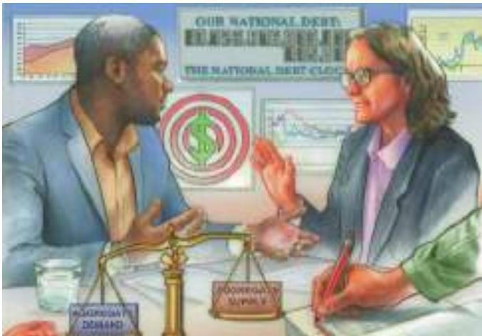

# PART VIII Short-Run Economic Fluctuations 415

## CHAPTER 20

## Aggregate Demand and Aggregate Supply 417

20-1 Three Key Facts about Economic Fluctuations 418 20-1a Fact 1: Economic Fluctuations Are Irregular and Unpredictable 418 20-1b Fact 2: Most Macroeconomic Quantities Fluctuate Together 420 20-1c Fact 3: As Output Falls, Unemployment Rises 420

20-2 Explaining Short-Run Economic Fluctuations 421 20-2a The Assumptions of Classical Economics 421 20-2b The Reality of Short-Run Fluctuations 421 20-2c The Model of Aggregate Demand and Aggregate Supply 422

20-3 The Aggregate-Demand Curve 423 20-3a Why the Aggregate-Demand Curve Slopes Downward 423 20-3b Why the Aggregate-Demand Curve Might Shift 426

20-4 The Aggregate-Supply Curve 428 20-4a Why the Aggregate-Supply Curve Is Vertical in the Long Run 428 20-4b Why the Long-Run Aggregate-Supply Curve Might Shift 429 20-4c Using Aggregate Demand and Aggregate Supply to Depict Long-Run Growth and Inflation 431 20-4d Why the Aggregate-Supply Curve Slopes Upward in the Short Run 432 20-4e Why the Short-Run Aggregate-Supply Curve Might Shift 436

20-5 Two Causes of Economic Fluctuations 437 20-5a The Effects of a Shift in Aggregate Demand 438 FYI: Monetary Neutrality Revisited 440 CASE STUDY: Two Big Shifts in Aggregate Demand: The Great Depression and World War II 441 CASE STUDY: The Great Recession of 2008–2009 442 IN THE NEWS: What Have We Learned? 444 20-5b The Effects of a Shift in Aggregate Supply 444 CASE STUDY: Oil and the Economy 447 FYI: The Origins of the Model of Aggregate Demand and Aggregate Supply 448

20-6 Conclusion 449 Summary 450 Key Concepts 450 Questions for Review 451 Problems and Applications 451

## CHAPTER 21

## The Influence of Monetary and Fiscal Policy on Aggregate Demand 453

21-1 How Monetary Policy Influences Aggregate Demand 454 21-1a The Theory of Liquidity Preference 455 21-1b The Downward Slope of the Aggregate-Demand Curve 457 FYI: Interest Rates in the Long Run and the Short Run 458 21-1c Changes in the Money Supply 459 21-1d The Role of Interest-Rate Targets in Fed Policy 461 CASE STUDY: Why the Fed Watches the Stock Market (and Vice Versa) 461 21-1e The Zero Lower Bound 462

21-2 How Fiscal Policy Influences Aggregate Demand 463 21-2a Changes in Government Purchases 463 21-2b The Multiplier Effect 464 21-2c A Formula for the Spending Multiplier 464 21-2d Other Applications of the Multiplier Effect 466 21-2e The Crowding-Out Effect 466 21-2e Changes in Taxes 468 FYI: How Fiscal Policy Might Affect Aggregate Supply 468

21-3 Using Policy to Stabilize the Economy 469 21-3a The Case for Active Stabilization Policy 469 IN THE NEWS: How Large Is the Fiscal Policy Multiplier? 470 CASE STUDY: Keynesians in the White House 472 ASK THE EXPERTS: Economic Stimulus 472 21-3b The Case against Active Stabilization Policy 472 21-3c Automatic Stabilizers 474

21-4 Conclusion 474 Summary 475 Key Concepts 476 Questions for Review 476 Problems and Applications 476

## CHAPTER 22

## The Short-Run Trade-off between Inflation and Unemployment 479

22-1 The Phillips Curve 480 22-1a Origins of the Phillips Curve 480 22-1b Aggregate Demand, Aggregate Supply, and the Phillips Curve 481

22-2 Shifts in the Phillips Curve: The Role of Expectations 483 22-2a The Long-Run Phillips Curve 483 22-2b The Meaning of “Natural” 485 22-2c Reconciling Theory and Evidence 486 22-2d The Short-Run Phillips Curve 487 22-2e The Natural Experiment for the Natural-Rate Hypothesis 488

22-3 Shifts in the Phillips Curve: The Role of Supply Shocks 489

22-4 The Cost of Reducing Inflation 492

22-4a The Sacrifice Ratio 493 22-4b Rational Expectations and the Possibility of Costless Disinflation 494

22-4c The Volcker Disinflation 495

22-4d The Greenspan Era 496

22-4e A Financial Crisis Takes Us for a Ride along the Phillips Curve 497

22-5 Conclusion 498 Summary 500 Key Concepts 500 Questions for Review 500 Problems and Applications 500

Spending Hikes Rather Than Tax Cuts? 508 23-2a Pro: The Government Should Fight Recessions with Spending Hikes 508 23-2b Con: The Government Should Fight Recessions with Tax Cuts 509

23-3 Should Monetary Policy Be Made by Rule Rather Than by Discretion? 510 23-3a Pro: Monetary Policy Should Be Made by Rule 511 23-3b Con: Monetary Policy Should Not Be Made by Rule 512 FYI: Inflation Targeting 513

23-4 Should the Central Bank Aim for Zero Inflation? 513 23-4a Pro: The Central Bank Should Aim for Zero Inflation 514 23-4b Con: The Central Bank Should Not Aim for Zero Inflation 515 IN THE NEWS: On Kiwis and Currencies 516

23-5 Should the Government Balance Its Budget? 518 23-5a Pro: The Government Should Balance Its Budget 518 23-5b Con: The Government Should Not Balance Its Budget 519

23-6 Should the Tax Laws Be Reformed to Encourage Saving? 521 23-6a Pro: The Tax Laws Should Be Reformed to Encourage Saving 521 ASK THE EXPERTS: Taxing Capital and Labor 522 23-6b Con: The Tax Laws Should Not Be Reformed to Encourage Saving 522

23-7 Conclusion 523 Summary 524 Questions for Review 525 Problems and Applications 525
