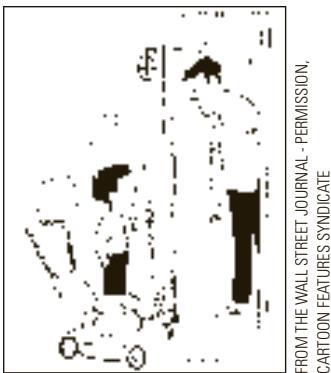
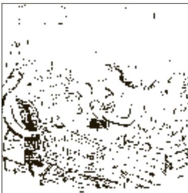

# Ten Principles of Economics

he word economy comes from the Greek word oikonomos, which means “one who manages a household.” At first, this origin might seem peculiar. But in fact, households and economies have much in common.

A household faces many decisions. It must decide which household members do which tasks and what each member receives in return: Who cooks dinner? Who does the laundry? Who gets the extra dessert at dinner? Who gets to drive the car? In short, a household must allocate its scarce resources (time, dessert, car mileage) among its various members, taking into account each member’s abilities, efforts, and desires.

Like a household, a society faces many decisions. It must find some way to decide what jobs will be done and who will do them. It needs some people to grow food, other people to make clothing, and still others to design computer software. Once society has allocated people (as well as land, buildings, and machines) to various jobs, it must also allocate the goods and services they produce. It must decide who will eat caviar and who will eat potatoes. It must decide who will drive a Tesla and who will take the bus.

The management of society’s resources is important because resources are scarce. Scarcity means that society has limited resources and therefore cannot produce all the goods and services people wish to have. Just as each member of a household cannot get everything she wants, each individual in a society cannot attain the highest standard of living to which she might aspire.

Economics is the study of how society manages its scarce resources. In most societies, resources are allocated not by an all-powerful dictator but through the combined choices of millions of households and firms. Economists, therefore, study how people make decisions: how much they work, what they buy, how much they save, and how they invest their savings. Economists also study how people interact with one another. For instance, they examine how the multitude of buyers and sellers of a good together determine the price at which the good is sold and the quantity that is sold. Finally, economists analyze the forces and trends that affect the economy as a whole, including the growth in average income, the fraction of the population that cannot find work, and the rate at which prices are rising.

The study of economics has many facets, but it is unified by several central ideas. In this chapter, we look at Ten Principles of Economics. Don’t worry if you don’t understand them all at first or if you aren’t completely convinced. We explore these ideas more fully in later chapters. The ten principles are introduced here to give you an overview of what economics is all about. Consider this chapter a “preview of coming attractions.”

## 1-1 How People Make Decisions

There is no mystery to what an economy is. Whether we are talking about the economy of Los Angeles, the United States, or the whole world, an economy is just a group of people dealing with one another as they go about their lives. Because the behavior of an economy reflects the behavior of the individuals who make up the economy, we begin our study of economics with four principles about individual decision making.

## 1-1a Principle 1: People Face Trade-offs

You may have heard the old saying, “There ain’t no such thing as a free lunch.” Grammar aside, there is much truth to this adage. To get something that we like, we usually have to give up something else that we also like. Making decisions requires trading off one goal against another.

Consider a student who must decide how to allocate her most valuable resource—her time. She can spend all of her time studying economics, spend all of it studying psychology, or divide it between the two fields. For every hour she studies one subject, she gives up an hour she could have used studying the other. And for every hour she spends studying, she gives up an hour she could have spent napping, bike riding, watching TV, or working at her part-time job for some extra spending money.

Consider parents deciding how to spend their family income. They can buy food, clothing, or a family vacation. Or they can save some of the family income for retirement or the children’s college education. When they choose to spend an extra dollar on one of these goods, they have one less dollar to spend on some other good.

When people are grouped into societies, they face different kinds of trade-offs. One classic trade-off is between “guns and butter.” The more a society spends on national defense (guns) to protect its shores from foreign aggressors, the less it can spend on consumer goods (butter) to raise the standard of living at home. Also important in modern society is the trade-off between a clean environment and a high level of income. Laws that require firms to reduce pollution raise the cost of producing goods and services. Because of these higher costs, the firms end up earning smaller profits, paying lower wages, charging higher prices, or some combination of these three. Thus, while pollution regulations yield the benefit of a cleaner environment and the improved health that comes with it, they come at the cost of reducing the incomes of the regulated firms’ owners, workers, and customers.

Another trade-off society faces is between efficiency and equality. Efficiency means that society is getting the maximum benefits from its scarce resources. Equality means that those benefits are distributed uniformly among society’s members. In other words, efficiency refers to the size of the economic pie, and equality refers to how the pie is divided into individual slices.

When government policies are designed, these two goals often conflict. Consider, for instance, policies aimed at equalizing the distribution of economic well-being. Some of these policies, such as the welfare system or unemployment insurance, try to help the members of society who are most in need. Others, such as the individual income tax, ask the financially successful to contribute more than others to support the government. Though they achieve greater equality, these policies reduce efficiency. When the government redistributes income from the rich to the poor, it reduces the reward for working hard; as a result, people work less and produce fewer goods and services. In other words, when the government tries to cut the economic pie into more equal slices, the pie gets smaller.

Recognizing that people face trade-offs does not by itself tell us what decisions they will or should make. A student should not abandon the study of psychology just because doing so would increase the time available for the study of economics. Society should not stop protecting the environment just because environmental regulations reduce our material standard of living. The poor should not be ignored just because helping them distorts work incentives. Nonetheless, people are likely to make good decisions only if they understand the options that are available to them. Our study of economics, therefore, starts by acknowledging life’s trade-offs.

1-1b Principle 2: The Cost of Something Is What You Give Up to Get It Because people face trade-offs, making decisions requires comparing the costs and benefits of alternative courses of action. In many cases, however, the cost of an action is not as obvious as it might first appear.

Consider the decision to go to college. The main benefits are intellectual enrichment and a lifetime of better job opportunities. But what are the costs? To answer this question, you might be tempted to add up the money you spend on tuition, books, room, and board. Yet this total does not truly represent what you give up to spend a year in college.

There are two problems with this calculation. First, it includes some things that are not really costs of going to college. Even if you quit school, you need a place

equality

the property of distributing economic prosperity uniformly among the members of society

to sleep and food to eat. Room and board are costs of going to college only to the extent that they are more expensive at college than elsewhere. Second, this calculation ignores the largest cost of going to college—your time. When you spend a year listening to lectures, reading textbooks, and writing papers, you cannot spend that time working at a job. For most students, the earnings they give up to attend school are the single largest cost of their education.

The opportunity cost of an item is what you give up to get that item. When making any decision, decision makers should be aware of the opportunity costs that accompany each possible action. In fact, they usually are. College athletes who can earn millions if they drop out of school and play professional sports are well aware that their opportunity cost of attending college is very high. It is not surprising that they often decide that the benefit of a college education is not worth the cost.

## 1-1c Principle 3: Rational People Think at the Margin

Economists normally assume that people are rational. Rational people systematically and purposefully do the best they can to achieve their objectives, given the available opportunities. As you study economics, you will encounter firms that decide how many workers to hire and how much of their product to manufacture and sell to maximize profits. You will also encounter individuals who decide how much time to spend working and what goods and services to buy with the resulting income to achieve the highest possible level of satisfaction.

Rational people know that decisions in life are rarely black and white but usually involve shades of gray. At dinnertime, the question you face is not “Should I fast or eat like a pig?” More likely, you will be asking yourself “Should I take that extra spoonful of mashed potatoes?” When exams roll around, your decision is not between blowing them off and studying 24 hours a day but whether to spend an extra hour reviewing your notes instead of watching TV. Economists use the term marginal change to describe a small incremental adjustment to an existing plan of action. Keep in mind that margin means “edge,” so marginal changes are adjustments around the edges of what you are doing. Rational people often make decisions by comparing marginal benefits and marginal costs.

For example, suppose you are considering calling a friend on your cell phone. You decide that talking with her for 10 minutes would give you a benefit that you value at about \$7. Your cell phone service costs you \$40 per month plus \$0.50 per minute for whatever calls you make. You usually talk for 100 minutes a month, so your total monthly bill is \$90 (\$0.50 per minute times 100 minutes, plus the \$40 fixed fee). Under these circumstances, should you make the call? You might be tempted to reason as follows: “Because I pay \$90 for 100 minutes of calling each month, the average minute on the phone costs me \$0.90. So a 10-minute call costs \$9. Because that \$9 cost is greater than the \$7 benefit, I am going to skip the call.” That conclusion is wrong, however. Although the average cost of a 10-minute call is \$9, the marginal cost—the amount your bill increases if you make the extra call—is only \$5. You will make the right decision only by comparing the marginal benefit and the marginal cost. Because the marginal benefit of \$7 is greater than the marginal cost of \$5, you should make the call. This is a principle that people innately understand: Cell phone users with unlimited minutes (that is, minutes that are free at the margin) are often prone to making long and frivolous calls.

Thinking at the margin works for business decisions as well. Consider an airline deciding how much to charge passengers who fly standby. Suppose that flying a 200-seat plane across the United States costs the airline \$100,000. In this case, the average cost of each seat is \$100,000/200, which is \$500. One might be tempted to conclude that the airline should never sell a ticket for less than \$500. But a rational airline can increase its profits by thinking at the margin. Imagine that a plane is about to take off with 10 empty seats and a standby passenger waiting at the gate is willing to pay \$300 for a seat. Should the airline sell the ticket? Of course it should. If the plane has empty seats, the cost of adding one more passenger is tiny. The average cost of flying a passenger is \$500, but the marginal cost is merely the cost of the can of soda that the extra passenger will consume. As long as the standby passenger pays more than the marginal cost, selling the ticket is profitable.

Marginal decision making can help explain some otherwise puzzling economic phenomena. Here is a classic question: Why is water so cheap, while diamonds are so expensive? Humans need water to survive, while diamonds are unnecessary. Yet people are willing to pay much more for a diamond than for a cup of water. The reason is that a person’s willingness to pay for a good is based on the marginal benefit that an extra unit of the good would yield. The marginal benefit, in turn, depends on how many units a person already has. Water is essential, but the marginal benefit of an extra cup is small because water is plentiful. By contrast, no one needs diamonds to survive, but because diamonds are so rare, people consider the marginal benefit of an extra diamond to be large.

BLEND IMAGES / ALAMY

A rational decision maker takes an action if and only if the marginal benefit of the action exceeds the marginal cost. This principle explains why people use their cell phones as much as they do, why airlines are willing to sell tickets below average cost, and why people are willing to pay more for diamonds than for water. It can take some time to get used to the logic of marginal thinking, but the study of economics will give you ample opportunity to practice.

## 1-1d Principle 4: People Respond to Incentives

An incentive is something (such as the prospect of a punishment or reward) that induces a person to act. Because rational people make decisions by comparing costs and benefits, they respond to incentives. You will see that incentives play a central role in the study of economics. One economist went so far as to suggest that the entire field could be summarized as simply “People respond to incentives. The rest is commentary.”

  
“Is the marginal benefit of this call greater than the marginal cost?”

Incentives are key to analyzing how markets work. For example, when the price of an apple rises, people decide to eat fewer apples. At the same time, apple orchards decide to hire more workers and harvest more apples. In other words, a higher price in a market provides an incentive for buyers to consume less and an incentive for sellers to produce more. As we will see, the influence of prices on the behavior of consumers and producers is crucial to how a market economy allocates scarce resources.

Public policymakers should never forget about incentives: Many policies change the costs or benefits that people face and, as a result, alter their behavior. A tax on gasoline, for instance, encourages people to drive smaller, more fuel-efficient cars. That is one reason people drive smaller cars in Europe, where gasoline taxes are high, than in the United States, where gasoline taxes are low. A higher gasoline tax also encourages people to carpool, take public transportation, and live closer to where they work. If the tax were larger, more people would be driving hybrid cars, and if it were large enough, they would switch to electric cars.

When policymakers fail to consider how their policies affect incentives, they often end up facing unintended consequences. For example, consider public policy regarding auto safety. Today, all cars have seat belts, but this was not true

incentive something that induces a person to act

60 years ago. In 1965, Ralph Nader’s book Unsafe at Any Speed generated much public concern over auto safety. Congress responded with laws requiring seat belts as standard equipment on new cars.

How does a seat belt law affect auto safety? The direct effect is obvious: When a person wears a seat belt, the probability of surviving an auto accident rises. But that’s not the end of the story because the law also affects behavior by altering incentives. The relevant behavior here is the speed and care with which drivers operate their cars. Driving slowly and carefully is costly because it uses the driver’s time and energy. When deciding how safely to drive, rational people compare, perhaps unconsciously, the marginal benefit from safer driving to the marginal cost. As a result, they drive more slowly and carefully when the benefit of increased safety is high. For example, when road conditions are icy, people drive more attentively and at lower speeds than they do when road conditions are clear.

Consider how a seat belt law alters a driver’s cost–benefit calculation. Seat belts make accidents less costly because they reduce the likelihood of injury or death. In other words, seat belts reduce the benefits of slow and careful driving. People respond to seat belts as they would to an improvement in road conditions—by driving faster and less carefully. The result of a seat belt law, therefore, is a larger number of accidents. The decline in safe driving has a clear, adverse impact on pedestrians, who are more likely to find themselves in an accident but (unlike the drivers) don’t have the benefit of added protection.

At first, this discussion of incentives and seat belts might seem like idle speculation. Yet in a classic 1975 study, economist Sam Peltzman argued that auto-safety laws have had many of these effects. According to Peltzman’s evidence, these laws give rise to fewer deaths per accident but also to more accidents. He concluded that the net result is little change in the number of driver deaths and an increase in the number of pedestrian deaths.

Peltzman’s analysis of auto safety is an offbeat and controversial example of the general principle that people respond to incentives. When analyzing any policy, we must consider not only the direct effects but also the less obvious indirect effects that work through incentives. If the policy changes incentives, it will cause people to alter their behavior.

Describe an important trade-off you recently faced. • Give an example of QuickQuiz some action that has both a monetary and nonmonetary opportunity cost.

• Describe an incentive your parents offered to you in an effort to influence your behavior.

## 1-2 How People Interact

The first four principles discussed how individuals make decisions. As we go about our lives, many of our decisions affect not only ourselves but other people as well. The next three principles concern how people interact with one another.

## 1-2a Principle 5: Trade Can Make Everyone Better Off

You may have heard on the news that the Chinese are our competitors in the world economy. In some ways, this is true because American and Chinese firms produce many of the same goods. Companies in the United States and China compete for the same customers in the markets for clothing, toys, solar panels, automobile tires, and many other items.

Yet it is easy to be misled when thinking about competition among countries. Trade between the United States and China is not like a sports contest in which one side wins and the other side loses. In fact, the opposite is true: Trade between two countries can make each country better off.

To see why, consider how trade affects your family. When a member of your family looks for a job, she competes against members of other families who are looking for jobs. Families also compete against one another when they go shopping because each family wants to buy the best goods at the lowest prices. In a sense, each family in an economy competes with all other families.

Despite this competition, your family would not be better off isolating itself from all other families. If it did, your family would need to grow its own food, make its own clothes, and build its own home. Clearly, your family gains much from its ability to trade with others. Trade allows each person to specialize in the activities she does best, whether it is farming, sewing, or home building. By trading with others, people can buy a greater variety of goods and services at lower cost.

  
CARTOON FEATURES SYNDICATE FROM THE WALL STREET JOURNAL - PERMISSION,  
“For \$5 a week you can watch baseball without being nagged to cut the grass!”

Like families, countries also benefit from the ability to trade with one another. Trade allows countries to specialize in what they do best and to enjoy a greater variety of goods and services. The Chinese, as well as the French, Egyptians, and Brazilians, are as much our partners in the world economy as they are our competitors.

## 1-2b Principle 6: Markets Are Usually a Good Way to Organize Economic Activity

The collapse of communism in the Soviet Union and Eastern Europe in the late 1980s and early 1990s was one of the last century’s most transformative events. Communist countries operated on the premise that government officials were in the best position to allocate the economy’s scarce resources. These central planners decided what goods and services were produced, how much was produced, and who produced and consumed these goods and services. The theory behind central planning was that only the government could organize economic activity in a way that promoted economic well-being for the country as a whole.

Most countries that once had centrally planned economies have abandoned the system and are instead developing market economies. In a market economy, the decisions of a central planner are replaced by the decisions of millions of firms and households. Firms decide whom to hire and what to make. Households decide which firms to work for and what to buy with their incomes. These firms and households interact in the marketplace, where prices and self-interest guide their decisions.

At first glance, the success of market economies is puzzling. In a market economy, no one is looking out for the economic well-being of society as a whole. Free markets contain many buyers and sellers of numerous goods and services, and all of them are interested primarily in their own well-being. Yet despite decentralized decision making and self-interested decision makers, market economies have proven remarkably successful in organizing economic activity to promote overall economic well-being.

In his 1776 book An Inquiry into the Nature and Causes of the Wealth of Nations, economist Adam Smith made the most famous observation in all of economics: Households and firms interacting in markets act as if they are guided by an “invisible hand” that leads them to desirable market outcomes. One of our goals in this book is to understand how this invisible hand works its magic.

market economy an economy that allocates resources through the decentralized decisions of many firms and households as they interact in markets for goods and services

As you study economics, you will learn that prices are the instrument with which the invisible hand directs economic activity. In any market, buyers look at the price when determining how much to demand, and sellers look at the price when deciding how much to supply. As a result of the decisions that buyers and sellers make, market prices reflect both the value of a good to society and the cost to society of making the good. Smith’s great insight was that prices adjust to guide these individual buyers and sellers to reach outcomes that, in many cases, maximize the well-being of society as a whole.

Smith’s insight has an important corollary: When a government prevents prices from adjusting naturally to supply and demand, it impedes the invisible hand’s ability to coordinate the decisions of the households and firms that make up an economy. This corollary explains why taxes adversely affect the allocation of resources: They distort prices and thus the decisions of households and firms. It also explains the great harm caused by policies that directly control prices, such as rent control. And it explains the failure of communism. In communist countries, prices were not determined in the marketplace but were dictated by central planners. These planners lacked the necessary information about consumers’ tastes and producers’ costs, which in a market economy is reflected in prices. Central planners failed because they tried to run the economy with one hand tied behind their backs—the invisible hand of the marketplace.

## FYI

## Adam Smith and the Invisible Hand

t may be only a coincidence that Adam Smith’s great book The Wealth of Nations was published in 1776, the exact year in which American revolutionaries signed the Declaration of Independence. But the two documents share a point of view that was prevalent at the time: Individuals are usually best left to their own devices, without the heavy hand of government guiding their actions. This political philosophy provides the intellectual basis for the market economy and for free society more generally.

Why do decentralized market economies work so well? Is it because people can be counted on to treat one another with love and kindness? Not at all. Here is Adam Smith’s description of how people interact in a market economy:

Man has almost constant occasion for the help of his brethren, and it is in vain for him to expect it from their benevolence only. He will be more

  
Adam Smith  
BETTMANN/CORBIS

likely to prevail if he can interest their self-love in his favour, and show them that it is for their own advantage to do for him what he requires of them. . . . Give me that which I want, and you shall have this which you want, is the meaning of every such offer; and it is in this manner that we obtain from one another the far greater part of those good offices which we stand in need of.

It is not from the benevolence of the butcher, the brewer, or the baker that we expect our dinner, but from their regard to their own inter-

est. We address ourselves, not

to their humanity but to their self-love, and never talk to them of our own necessities but of their advantages. Nobody but a beggar chooses to depend chiefly upon the benevolence of his fellow-citizens. . . .

Every individual . . . neither intends to promote the public interest, nor knows how much he is promoting it. . . . He intends only his own gain, and he is in this, as in many other cases, led by an invisible hand to promote an end which was no part of his intention. Nor is it always the worse for the society that it was no part of it. By pursuing his own interest he frequently promotes that of the society more effectually than when he really intends to promote it.

Smith is saying that participants in the economy are motivated by self-interest and that the “invisible hand” of the marketplace guides this self-interest into promoting general economic well-being.

Many of Smith’s insights remain at the center of modern economics. Our analysis in the coming chapters will allow us to express Smith’s conclusions more precisely and to analyze more fully the strengths and weaknesses of the market’s invisible hand. ■

## ADAM SMITH WOULD HAVE LOVED UBER

You have probably never lived in a centrally planned economy, but if you have ever tried to hail a cab in a major city, you have likely experienced a highly regulated market. In many cities, the local gov-

ernment imposes strict controls in the market for taxis. The rules usually go well beyond regulation of insurance and safety. For example, the government may limit entry into the market by approving only a certain number of taxi medallions or permits. It may determine the prices that taxis are allowed to charge. The government uses its police powers—that is, the threat of fines or jail time—to keep unauthorized drivers off the streets and to prevent all drivers from charging unauthorized prices.

Recently, however, this highly controlled market has been invaded by a disruptive force: Uber. Launched in 2009, this company provides an app for smartphones that connects passengers and drivers. Because Uber cars do not roam the streets looking for taxi-hailing pedestrians, they are technically not taxis and so are not subject to the same regulations. But they offer much the same service. Indeed, rides from Uber cars are often more convenient. On a cold and rainy day, who wants to stand on the side of the road waiting for an empty cab to drive by? It is more pleasant to remain inside, use your smartphone to arrange for a ride, and stay warm and dry until the car arrives.

RICHARD LEVINE / ALAMY

  
Technology can improve this market.

Uber cars often charge less than taxis, but not always. Uber allows drivers to raise their prices significantly when there is a surge in demand, such as during a sudden rainstorm or late on New Year’s Eve, when numerous tipsy partiers are looking for a safe way to get home. By contrast, regulated taxis are typically prevented from surge pricing.

Not everyone is fond of Uber. Drivers of traditional taxis complain that this new competition eats into their source of income. This is hardly a surprise: Suppliers of goods and services usually dislike new competitors. But vigorous competition among producers makes a market work well for consumers.

That is why economists love Uber. A 2014 survey of several dozen prominent economists asked whether car services such as Uber increased consumer wellbeing. Yes, said every single economist. The economists were also asked whether surge pricing increased consumer well-being. Yes, said 85 percent of them. Surge pricing makes consumers pay more at times, but because Uber drivers respond to incentives, it also increases the quantity of car services supplied when they are most needed. Surge pricing also helps allocate the services to those consumers who value them most highly and reduces the costs of searching and waiting for a car.

If Adam Smith were alive today, he would surely have the Uber app on his phone. ●

## 1-2c Principle 7: Governments Can Sometimes

## Improve Market Outcomes

If the invisible hand of the market is so great, why do we need government? One purpose of studying economics is to refine your view about the proper role and scope of government policy.

One reason we need government is that the invisible hand can work its magic only if the government enforces the rules and maintains the institutions that are key to a market economy. Most important, market economies need institutions to enforce property rights so individuals can own and control scarce resources.

property rights the ability of an individual to own and exercise control over scarce resources

## market failure

## externality

the impact of one person’s actions on the well-being of a bystander

market power the ability of a single economic actor (or small group of actors) to have a substantial influence on market prices

A farmer won’t grow food if she expects her crop to be stolen; a restaurant won’t serve meals unless it is assured that customers will pay before they leave; and a film company won’t produce movies if too many potential customers avoid paying by making illegal copies. We all rely on government-provided police and courts to enforce our rights over the things we produce—and the invisible hand counts on our ability to enforce those rights.

Another reason we need government is that, although the invisible hand is powerful, it is not omnipotent. There are two broad rationales for a government to intervene in the economy and change the allocation of resources that people would choose on their own: to promote efficiency or to promote equality. That is, most policies aim either to enlarge the economic pie or to change how the pie is divided.

Consider first the goal of efficiency. Although the invisible hand usually leads markets to allocate resources to maximize the size of the economic pie, this is not always the case. Economists use the term market failure to refer to a situation in which the market on its own fails to produce an efficient allocation of resources. As we will see, one possible cause of market failure is an externality, which is the impact of one person’s actions on the well-being of a bystander. The classic example of an externality is pollution. When the production of a good pollutes the air and creates health problems for those who live near the factories, the market left to its own devices may fail to take this cost into account. Another possible cause of market failure is market power, which refers to the ability of a single person or firm (or a small group) to unduly influence market prices. For example, if everyone in town needs water but there is only one well, the owner of the well is not subject to the rigorous competition with which the invisible hand normally keeps self-interest in check; she may take advantage of this opportunity by restricting the output of water so she can charge a higher price. In the presence of externalities or market power, well-designed public policy can enhance economic efficiency.

Now consider the goal of equality. Even when the invisible hand yields efficient outcomes, it can nonetheless leave sizable disparities in economic well-being. A market economy rewards people according to their ability to produce things that other people are willing to pay for. The world’s best basketball player earns more than the world’s best chess player simply because people are willing to pay more to watch basketball than chess. The invisible hand does not ensure that everyone has sufficient food, decent clothing, and adequate healthcare. This inequality may, depending on one’s political philosophy, call for government intervention. In practice, many public policies, such as the income tax and the welfare system, aim to achieve a more equal distribution of economic well-being.

To say that the government can improve on market outcomes does not mean that it always will. Public policy is made not by angels but by a political process that is far from perfect. Sometimes policies are designed simply to reward the politically powerful. Sometimes they are made by well-intentioned leaders who are not fully informed. As you study economics, you will become a better judge of when a government policy is justifiable because it promotes efficiency or equality and when it is not.

QuickQuiz Why is a country better off not isolating itself from all other countries? • Why do we have markets, and according to economists, what roles should government play in them?

## 1-3 How the Economy as a Whole Works

We started by discussing how individuals make decisions and then looked at how people interact with one another. All these decisions and interactions together make up “the economy.” The last three principles concern the workings of the economy as a whole.

## 1-3a Principle 8: A Country’s Standard of Living Depends on Its Ability to Produce Goods and Services

The differences in living standards around the world are staggering. In 2014, the average American had an income of about \$55,000. In the same year, the average Mexican earned about \$17,000, the average Chinese about \$13,000, and the average Nigerian only \$6,000. Not surprisingly, this large variation in average income is reflected in various measures of quality of life. Citizens of high-income countries have more TV sets, more cars, better nutrition, better healthcare, and a longer life expectancy than citizens of low-income countries.

Changes in living standards over time are also large. In the United States, incomes have historically grown about 2 percent per year (after adjusting for changes in the cost of living). At this rate, average income doubles every 35 years. Over the past century, average U.S. income has risen about eightfold.

What explains these large differences in living standards among countries and over time? The answer is surprisingly simple. Almost all variation in living standards is attributable to differences in countries’ productivity—that is, the amount of goods and services produced by each unit of labor input. In nations where workers can produce a large quantity of goods and services per hour, most people enjoy a high standard of living; in nations where workers are less productive, most people endure a more meager existence. Similarly, the growth rate of a nation’s productivity determines the growth rate of its average income.

The fundamental relationship between productivity and living standards is simple, but its implications are far-reaching. If productivity is the primary determinant of living standards, other explanations must be of secondary importance. For example, it might be tempting to credit labor unions or minimum-wage laws for the rise in living standards of American workers over the past century. Yet the real hero of American workers is their rising productivity. As another example, some commentators have claimed that increased competition from Japan and other countries explained the slow growth in U.S. incomes during the 1970s and 1980s. Yet the real villain was not competition from abroad but flagging productivity growth in the United States.

The relationship between productivity and living standards also has profound implications for public policy. When thinking about how any policy will affect living standards, the key question is how it will affect our ability to produce goods and services. To boost living standards, policymakers need to raise productivity by ensuring that workers are well educated, have the tools they need to produce goods and services, and have access to the best available technology.

## 1-3b Principle 9: Prices Rise When the Government Prints Too Much Money

In January 1921, a daily newspaper in Germany cost 0.30 marks. Less than two years later, in November 1922, the same newspaper cost 70,000,000 marks. All other prices in the economy rose by similar amounts. This episode is one of history’s most spectacular examples of inflation, an increase in the overall level of prices in the economy.

productivity the quantity of goods and services produced from each unit of labor input

inflation

an increase in the overall level of prices in the economy

RESERVED. REPRINTED WITH PERMISSION. TRIBUNE MEDIA SERVICES, INC. ALL RIGHTS

  
“Well it may have been 68 cents when you got in line, but it’s 74 cents now!”

Although the United States has never experienced inflation even close to that of Germany in the 1920s, inflation has at times been an economic problem. During the 1970s, for instance, when the overall level of prices more than doubled, President Gerald Ford called inflation “public enemy number one.” By contrast, inflation in the first decade of the 21st century ran about 2½ percent per year; at this rate, it would take almost 30 years for prices to double. Because high inflation imposes various costs on society, keeping inflation at a low level is a goal of economic policymakers around the world.

What causes inflation? In almost all cases of large or persistent inflation, the culprit is growth in the quantity of money. When a government creates large quantities of the nation’s money, the value of the money falls. In Germany in the early 1920s, when prices were on average tripling every month, the quantity of money was also tripling every month. Although less dramatic, the economic history of the United States points to a similar conclusion: The high inflation of the 1970s was associated with rapid growth in the quantity of money, and the return of low inflation in the 1980s was associated with slower growth in the quantity of money.

## 1-3c Principle 10: Society Faces a Short-Run Trade-off between Inflation and Unemployment

Although a higher level of prices is, in the long run, the primary effect of increasing the quantity of money, the short-run story is more complex and controversial. Most economists describe the short-run effects of monetary injections as follows:

• Increasing the amount of money in the economy stimulates the overall level of spending and thus the demand for goods and services.

• Higher demand may over time cause firms to raise their prices, but in the meantime, it also encourages them to hire more workers and produce a larger quantity of goods and services.

• More hiring means lower unemployment.

This line of reasoning leads to one final economy-wide trade-off: a short-run trade-off between inflation and unemployment.

Although some economists still question these ideas, most accept that society faces a short-run trade-off between inflation and unemployment. This simply means that, over a period of a year or two, many economic policies push inflation and unemployment in opposite directions. Policymakers face this trade-off regardless of whether inflation and unemployment both start out at high levels (as they did in the early 1980s), at low levels (as they did in the late 1990s), or someplace in between. This short-run trade-off plays a key role in the analysis of the business cycle—the irregular and largely unpredictable fluctuations in economic activity, as measured by the production of goods and services or the number of people employed.

business cycle fluctuations in economic activity, such as employment and production

Policymakers can exploit the short-run trade-off between inflation and unemployment using various policy instruments. By changing the amount that the government spends, the amount it taxes, and the amount of money it prints, policymakers can influence the overall demand for goods and services. Changes in demand in turn influence the combination of inflation and unemployment that the economy experiences in the short run. Because these instruments of economic policy are potentially so powerful, how policymakers should use them to control the economy, if at all, is a subject of continuing debate.

This debate heated up in the early years of Barack Obama’s presidency. In 2008 and 2009, the U.S. economy, as well as many other economies around the world, experienced a deep economic downturn. Problems in the financial system, caused by bad

## QuickQuiz

bets on the housing market, spilled over into the rest of the economy, causing incomes to fall and unemployment to soar. Policymakers responded in various ways to increase the overall demand for goods and services. President Obama’s first major initiative was a stimulus package of reduced taxes and increased government spending. At the same time, the nation’s central bank, the Federal Reserve, increased the supply of money. The goal of these policies was to reduce unemployment. Some feared, however, that these policies might over time lead to an excessive level of inflation.

List and briefly explain the three principles that describe how the economy as a whole works.

## 1-4 Conclusion

You now have a taste of what economics is all about. In the coming chapters, we develop many specific insights about people, markets, and economies. Mastering these insights will take some effort, but it is not an overwhelming task. The field of economics is based on a few big ideas that can be applied in many different situations.

Throughout this book, we will refer back to the Ten Principles of Economics highlighted in this chapter and summarized in Table 1. Keep these building blocks in mind: Even the most sophisticated economic analysis is founded on the ten principles introduced here.

## TABLE 1

## Ten Principles of Economics

## How People Make Decisions

1: People Face Trade-offs

2: The Cost of Something Is What You Give Up to Get It

3: Rational People Think at the Margin

4: People Respond to Incentives

## How People Interact

5: Trade Can Make Everyone Better Of

6: Markets Are Usually a Good Way to Organize Economic Activity

7: Governments Can Sometimes Improve Market Outcomes

## How the Economy as a Whole Works

8: A Country’s Standard of Living Depends on Its Ability to Produce Goods and Services

9: Prices Rise When the Government Prints Too Much Money

10: Society Faces a Short-Run Trade-off between Inflation and Unemployment

## CHAPTER QuickQuiz

## 1. Economics is best defined as the study of

a. how society manages its scarce resources.

b. how to run a business most profitably.

c. how to predict inflation, unemployment, and stock prices.

d. how the government can stop the harm from unchecked self-interest.

## 2. Your opportunity cost of going to a movie is

a. the price of the ticket.

b. the price of the ticket plus the cost of any soda and popcorn you buy at the theater.

c. the total cash expenditure needed to go to the movie plus the value of your time.

d. zero, as long as you enjoy the movie and consider it a worthwhile use of time and money.

<table><tr><td>scarcity, p. 4</td><td>marginal change, p. 6</td></tr><tr><td>economics, p. 4</td><td>incentive, p. 7</td></tr><tr><td>efficiency, p. 5</td><td>market economy, p. 9</td></tr><tr><td>equality, p. 5</td><td>property rights, p. 11</td></tr><tr><td>opportunity cost, p. 6</td><td>market failure, p. 12</td></tr><tr><td>rational people, p. 6</td><td>externality, p. 12</td></tr></table>

3. A marginal change is one that

a. is not important for public policy.

b. incrementally alters an existing plan.

c. makes an outcome inefficient.

d. does not influence incentives.

4. Adam Smith’s “invisible hand” refers to

a. the subtle and often hidden methods that businesses use to profit at consumers’ expense.

b. the ability of free markets to reach desirable outcomes, despite the self-interest of market participants.

c. the ability of government regulation to benefit consumers, even if the consumers are unaware of the regulations.

d. the way in which producers or consumers in unregulated markets impose costs on innocent bystanders.

The fundamental lessons about individual decision making are that people face trade-offs among alternative goals, that the cost of any action is measured in terms of forgone opportunities, that rational people make decisions by comparing marginal costs and marginal benefits, and that people change their behavior in response to the incentives they face.

The fundamental lessons about interactions among people are that trade and interdependence can be mutually beneficial, that markets are usually a good

## SUMMARY

5. Governments may intervene in a market economy in order to

a. protect property rights.

b. correct a market failure due to externalities.

c. achieve a more equal distribution of income.

d. All of the above.

6. If a nation has high and persistent inflation, the most likely explanation is

a. the central bank creating excessive amounts of money.

b. unions bargaining for excessively high wages.

c. the government imposing excessive levels of taxation.

d. firms using their monopoly power to enforce excessive price hikes.

way of coordinating economic activity among people, and that the government can potentially improve market outcomes by remedying a market failure or by promoting greater economic equality.

The fundamental lessons about the economy as a whole are that productivity is the ultimate source of living standards, that growth in the quantity of money is the ultimate source of inflation, and that society faces a short-run trade-off between inflation and unemployment.

## KEY CONCEPTS

market power, p. 12 productivity, p. 13 inflation, p. 13 business cycle, p. 14
