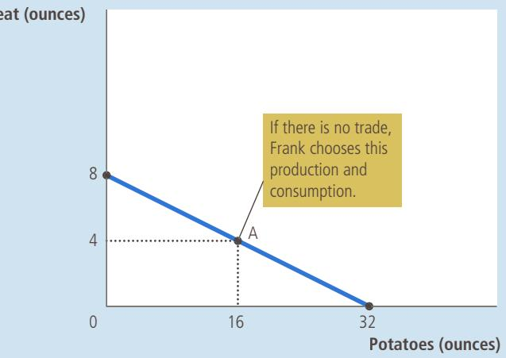
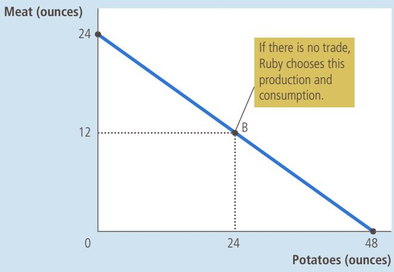
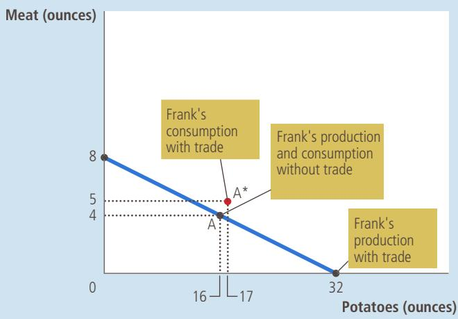
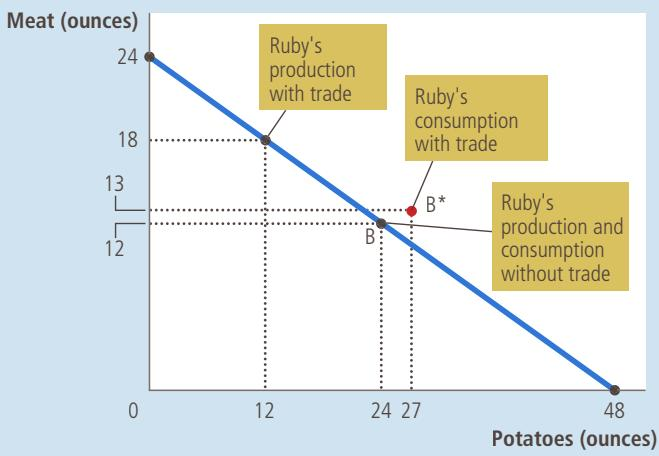

# Interdependence and the Gains from Trade

3

C onsider your typical day. You wake up in the morning and pour yourself juicefrom oranges grown in Florida and coffee from beans grown in Brazil. Over from oranges grown in Florida and coffee from beans grown in Brazil. Over breakfast, you read a newspaper written in New York on a tablet made in China. You get dressed in clothes made of cotton grown in Georgia and sewn in factories in Thailand. You drive to class in a car made of parts manufactured in more than a dozen countries around the world. Then you open up your economics textbook written by an author living in Massachusetts, published by a company located in Ohio, and printed on paper made from trees grown in Oregon.

Every day, you rely on many people, most of whom you have never met, to provide you with the goods and services that you enjoy. Such interdependence is possible because people trade with one another. Those people providing you with goods and services are not acting out of generosity. Nor is some government agency directing them to satisfy your desires. Instead, people provide you and other consumers with the goods and services they produce because they get something in return.

In subsequent chapters, we examine how an economy coordinates the activities of millions of people with varying tastes and abilities. As a starting point for this analysis, in this chapter we consider the reasons for economic interdependence. One of the Ten Principles of Economics highlighted in Chapter 1 is that trade can make everyone better off. We now examine this principle more closely. What exactly do people gain when they trade with one another? Why do people choose to become interdependent?

The answers to these questions are key to understanding the modern global economy. Most countries today import from abroad many of the goods and services they consume, and they export to foreign customers many of the goods and services they produce. The analysis in this chapter explains interdependence not only among individuals but also among nations. As we will see, the gains from trade are much the same whether you are buying a haircut from your local barber or a T-shirt made by a worker on the other side of the globe.

## 3-1 A Parable for the Modern Economy

To understand why people choose to depend on others for goods and services and how this choice improves their lives, let’s examine a simple economy. Imagine that there are only two goods in the world: meat and potatoes. And there are only two people in the world: a cattle rancher named Ruby and a potato farmer named Frank. Both Ruby and Frank would like to eat a diet of both meat and potatoes.

The gains from trade are most obvious if Ruby can produce only meat and Frank can produce only potatoes. In one scenario, Frank and Ruby could choose to have nothing to do with each other. But after several months of eating beef roasted, boiled, broiled, and grilled, Ruby might decide that self-sufficiency is not all it’s cracked up to be. Frank, who has been eating potatoes mashed, fried, baked, and scalloped, would likely agree. It is easy to see that trade would allow both of them to enjoy greater variety: Each could then have a steak with a baked potato or a burger with fries.

Although this scene illustrates most simply how everyone can benefit from trade, the gains would be similar if Frank and Ruby were each capable of producing the other good, but only at great cost. Suppose, for example, that Ruby is able to grow potatoes but her land is not very well suited for it. Similarly, suppose that Frank is able to raise cattle and produce meat but is not very good at it. In this case, Frank and Ruby can each benefit by specializing in what he or she does best and then trading with the other person.

The gains from trade are less obvious, however, when one person is better at producing every good. For example, suppose that Ruby is better at raising cattle and better at growing potatoes than Frank. In this case, should Ruby choose to remain self-sufficient? Or is there still reason for her to trade with Frank? To answer this question, we need to look more closely at the factors that affect such a decision.

## 3-1a Production Possibilities

Suppose that Frank and Ruby each work 8 hours per day and can devote this time to growing potatoes, raising cattle, or a combination of the two. The table in Figure 1 shows the amount of time each person requires to produce 1 ounce of each good. Frank can produce an ounce of potatoes in 15 minutes and an ounce of meat in 60 minutes. Ruby, who is more productive in both activities, can produce an ounce of potatoes in 10 minutes and an ounce of meat in 20 minutes. The last two columns in the table show the amounts of meat or potatoes Frank and Ruby can produce if they devote all 8 hours to producing only that good.

Panel (b) of Figure 1 illustrates the amounts of meat and potatoes that Frank can produce. If Frank devotes all 8 hours of his time to potatoes, he produces 32 ounces of potatoes (measured on the horizontal axis) and no meat. If he devotes all of his time to meat, he produces 8 ounces of meat (measured on the vertical axis) and no potatoes. If Frank divides his time equally between the two activities, spending 4 hours on each, he produces 16 ounces of potatoes and 4 ounces of meat. The figure shows these three possible outcomes and all others in between.

This graph is Frank’s production possibilities frontier. As we discussed in Chapter 2, a production possibilities frontier shows the various mixes of output

Panel (a) shows the production opportunities available to Frank the farmer and Ruby the rancher. Panel (b) shows the combinations of meat and potatoes that Frank can produce. Panel (c) shows the combinations of meat and potatoes that Ruby can produce. Both production possibilities frontiers are derived assuming that Frank and Ruby each work 8 hours per day. If there is no trade, each person’s production possibilities frontier is also his or her consumption possibilities frontier.

## FIGURE 1

The Production Possibilities Frontier

(a) Production Opportunities

<table><tr><td rowspan="2"></td><td colspan="2">Minutes Needed to Make 1 Ounce of:</td><td colspan="2">Amount Produced in 8 Hours</td></tr><tr><td>Meat</td><td>Potatoes</td><td>Meat</td><td>Potatoes</td></tr><tr><td>Frank the farmer</td><td>60 min/oz</td><td>15 min/oz</td><td>8 oz</td><td>32 oz</td></tr><tr><td>Ruby the rancher</td><td>20 min/oz</td><td>10 min/oz</td><td>24 oz</td><td>48 oz</td></tr></table>

(b) Frank’s Production Possibilities Frontier  
  
(c) Ruby’s Production Possibilities Frontier

that an economy can produce. It illustrates one of the Ten Principles of Economics in Chapter 1: People face trade-offs. Here Frank faces a trade-off between producing meat and producing potatoes.

You may recall that the production possibilities frontier in Chapter 2 was drawn bowed out. In that case, the rate at which society could trade one good for the other depended on the amounts that were being produced. Here, however, Frank’s technology for producing meat and potatoes (as summarized in Figure 1) allows him to switch between the two goods at a constant rate. Whenever Frank spends 1 hour less producing meat and 1 hour more producing potatoes, he reduces his output of meat by 1 ounce and raises his output of potatoes by 4 ounces—and this is true regardless of how much he is already producing. As a result, the production possibilities frontier is a straight line.

Panel (c) of Figure 1 shows the production possibilities frontier for Ruby. If Ruby devotes all 8 hours of her time to potatoes, she produces 48 ounces of potatoes and no meat. If she devotes all of her time to meat, she produces 24 ounces of meat and no potatoes. If Ruby divides her time equally, spending 4 hours on each activity, she produces 24 ounces of potatoes and 12 ounces of meat. Once again, the production possibilities frontier shows all the possible outcomes.

If Frank and Ruby choose to be self-sufficient rather than trade with each other, then each consumes exactly what he or she produces. In this case, the production possibilities frontier is also the consumption possibilities frontier. That is, without trade, Figure 1 shows the possible combinations of meat and potatoes that Frank and Ruby can each produce and then consume.

These production possibilities frontiers are useful in showing the trade-offs that Frank and Ruby face, but they do not tell us what Frank and Ruby will actually choose to do. To determine their choices, we need to know the tastes of Frank and Ruby. Let’s suppose they choose the combinations identified by points A and B in Figure 1. Based on his production opportunities and food preferences, Frank decides to produce and consume 16 ounces of potatoes and 4 ounces of meat, while Ruby decides to produce and consume 24 ounces of potatoes and 12 ounces of meat.

## 3-1b Specialization and Trade

After several years of eating combination B, Ruby gets an idea and goes to talk to Frank:

ruby: Frank, my friend, have I got a deal for you! I know how to improve life for both of us. I think you should stop producing meat altogether and devote all your time to growing potatoes. According to my calculations, if you work 8 hours a day growing potatoes, you’ll produce 32 ounces of potatoes. If you give me 15 of those 32 ounces, I’ll give you 5 ounces of meat in return. In the end, you’ll get to eat 17 ounces of potatoes and 5 ounces of meat every day, instead of the 16 ounces of potatoes and 4 ounces of meat you now get. If you go along with my plan, you’ll have more of both foods. [To illustrate her point, Ruby shows Frank panel (a) of Figure 2.]

frank: (sounding skeptical) That seems like a good deal for me. But I don’t understand why you are offering it. If the deal is so good for me, it can’t be good for you too.

ruby: Oh, but it is! Suppose I spend 6 hours a day raising cattle and 2 hours growing potatoes. Then I can produce 18 ounces of meat and 12 ounces of potatoes. After I give you 5 ounces of my meat in exchange for 15 ounces of your potatoes, I’ll end up with 13 ounces

The proposed trade between Frank the farmer and Ruby the rancher offers each of them a combination of meat and potatoes that would be impossible in the absence of trade. In panel (a), Frank gets to consume at point A\* rather than point A. In panel (b), Ruby gets to consume at point B\* rather than point B. Trade allows each to consume more meat and more potatoes.

## FIGURE 2

How Trade Expands the Set of Consumption Opportunities

(a) Frank’s Production and Consumption

(b) Ruby’s Production and Consumption  

(c) The Gains from Trade: A Summary

<table><tr><td rowspan="2"></td><td colspan="2">Frank</td><td colspan="2">Ruby</td></tr><tr><td>Meat</td><td>Potatoes</td><td>Meat</td><td>Potatoes</td></tr><tr><td colspan="5">Without Trade:</td></tr><tr><td>Production and Consumption</td><td>4 oz</td><td>16 oz</td><td>12 oz</td><td>24 oz</td></tr><tr><td colspan="5">With Trade:</td></tr><tr><td>Production</td><td>0 oz</td><td>32 oz</td><td>18 oz</td><td>12 oz</td></tr><tr><td>Trade</td><td>Gets 5 oz</td><td>Gives 15 oz</td><td>Gives 5 oz</td><td>Gets 15 oz</td></tr><tr><td>Consumption</td><td>5 oz</td><td>17 oz</td><td>13 oz</td><td>27 oz</td></tr><tr><td colspan="5">GAINS FROM TRADE:</td></tr><tr><td>Increase in Consumption</td><td>+1 oz</td><td>+1 oz</td><td>+1 oz</td><td>+3 oz</td></tr></table>

of meat and 27 ounces of potatoes, instead of the 12 ounces of meat and 24 ounces of potatoes that I now get. So I will also consume more of both foods than I do now. [She points out panel (b) of Figure 2.] I don’t know. . . . This sounds too good to be true.

ruby: It’s really not as complicated as it first seems. Here—I’ve summarized my proposal for you in a simple table. [Ruby shows Frank a copy of the table at the bottom of Figure 2.]

frank: (after pausing to study the table) These calculations seem correct, but I am puzzled. How can this deal make us both better off?

ruby: We can both benefit because trade allows each of us to specialize in doing what we do best. You will spend more time growing potatoes and less time raising cattle. I will spend more time raising cattle

and less time growing potatoes. As a result of specialization and trade, each of us can consume more meat and more potatoes without working any more hours.

QuickQuiz Draw an example of a production possibilities frontier for Robinson Crusoe, a shipwrecked sailor who spends his time gathering coconuts and catching fish. Does this frontier limit Crusoe’s consumption of coconuts and fish if he lives by himself? Would he face the same limits if he could trade with natives on the island?

## 3-2 Comparative Advantage: The Driving Force of Specialization

Ruby’s explanation of the gains from trade, though correct, poses a puzzle: If Ruby is better at both raising cattle and growing potatoes, how can Frank ever specialize in doing what he does best? Frank doesn’t seem to do anything best. To solve this puzzle, we need to look at the principle of comparative advantage.

As a first step in developing this principle, consider the following question: In our example, who can produce potatoes at a lower cost—Frank or Ruby? There are two possible answers, and in these two answers lie the solution to our puzzle and the key to understanding the gains from trade.

## 3-2a Absolute Advantage

One way to answer the question about the cost of producing potatoes is to compare the inputs required by the two producers. Economists use the term absolute advantage when comparing the productivity of one person, firm, or nation to that of another. The producer that requires a smaller quantity of inputs to produce a good is said to have an absolute advantage in producing that good.

In our example, time is the only input, so we can determine absolute advantage by looking at how much time each type of production takes. Ruby has an absolute advantage in producing both meat and potatoes because she requires less time than Frank to produce a unit of either good. Ruby needs to input only 20 minutes to produce an ounce of meat, whereas Frank needs 60 minutes. Similarly, Ruby needs only 10 minutes to produce an ounce of potatoes, whereas Frank needs 15 minutes. Thus, if we measure cost in terms of the quantity of inputs, Ruby has the lower cost of producing potatoes.

## 3-2b Opportunity Cost and Comparative Advantage

There is another way to look at the cost of producing potatoes. Rather than comparing inputs required, we can compare opportunity costs. Recall from Chapter 1 that the opportunity cost of some item is what we give up to get that item. In our example, we assumed that Frank and Ruby each spend 8 hours a day working. Time spent producing potatoes, therefore, takes away from time available for producing meat. When reallocating time between the two goods, Ruby and Frank give up units of one good to produce units of the other, thereby moving along the production possibilities frontier. The opportunity cost measures the trade-off between the two goods that each producer faces.

Let’s first consider Ruby’s opportunity cost. According to the table in panel (a) of Figure 1, producing 1 ounce of potatoes takes 10 minutes of work. When Ruby spends those 10 minutes producing potatoes, she spends 10 fewer minutes producing meat. Because Ruby needs 20 minutes to produce 1 ounce of meat, 10 minutes of work would yield ½ ounce of meat. Hence, Ruby’s opportunity cost of producing 1 ounce of potatoes is ½ ounce of meat.

<table><tr><td rowspan="2"></td><td colspan="2">Opportunity Cost of:</td></tr><tr><td>1 oz of Meat</td><td>1 oz of Potatoes</td></tr><tr><td>Frank the farmer</td><td>4 oz potatoes</td><td> $\frac{1}{4}$  oz meat</td></tr><tr><td>Ruby the rancher</td><td>2 oz potatoes</td><td> $\frac{1}{2}$  oz meat</td></tr></table>

## TABLE 1

The Opportunity Cost of Meat and Potatoes

Now consider Frank’s opportunity cost. Producing 1 ounce of potatoes takes him 15 minutes. Because he needs 60 minutes to produce 1 ounce of meat, 15 minutes of work would yield ¼ ounce of meat. Hence, Frank’s opportunity cost of 1 ounce of potatoes is ¼ ounce of meat.

Table 1 shows the opportunity costs of meat and potatoes for the two producers. Notice that the opportunity cost of meat is the inverse of the opportunity cost of potatoes. Because 1 ounce of potatoes costs Ruby ½ ounce of meat, 1 ounce of meat costs Ruby 2 ounces of potatoes. Similarly, because 1 ounce of potatoes costs Frank ¼ ounce of meat, 1 ounce of meat costs Frank 4 ounces of potatoes.

Economists use the term comparative advantage when describing the opportunity costs faced by two producers. The producer who gives up less of other goods to produce Good X has the smaller opportunity cost of producing Good X and is said to have a comparative advantage in producing it. In our example, Frank has a lower opportunity cost of producing potatoes than Ruby: An ounce of potatoes costs Frank only ¼ ounce of meat, but it costs Ruby ½ ounce of meat. Conversely, Ruby has a lower opportunity cost of producing meat than Frank: An ounce of meat costs Ruby 2 ounces of potatoes, but it costs Frank 4 ounces of potatoes. Thus, Frank has a comparative advantage in growing potatoes, and Ruby has a comparative advantage in producing meat.

comparative advantage the ability to produce a good at a lower opportunity cost than another producer

Although it is possible for one person to have an absolute advantage in both goods (as Ruby does in our example), it is impossible for one person to have a comparative advantage in both goods. Because the opportunity cost of one good is the inverse of the opportunity cost of the other, if a person’s opportunity cost of one good is relatively high, the opportunity cost of the other good must be relatively low. Comparative advantage reflects the relative opportunity cost. Unless two people have the same opportunity cost, one person will have a comparative advantage in one good, and the other person will have a comparative advantage in the other good.

## 3-2c Comparative Advantage and Trade

The gains from specialization and trade are based not on absolute advantage but on comparative advantage. When each person specializes in producing the good for which he or she has a comparative advantage, total production in the economy rises. This increase in the size of the economic pie can be used to make everyone better off.

In our example, Frank spends more time growing potatoes, and Ruby spends more time producing meat. As a result, the total production of potatoes rises from 40 to 44 ounces, and the total production of meat rises from 16 to 18 ounces. Frank and Ruby share the benefits of this increased production.

We can also view the gains from trade in terms of the price that each party pays the other. Because Frank and Ruby have different opportunity costs, they can both get a bargain. That is, each of them benefits from trade by obtaining a good at a price that is lower than his or her opportunity cost of that good.

Consider the proposed deal from Frank’s viewpoint. Frank receives 5 ounces of meat in exchange for 15 ounces of potatoes. In other words, Frank buys each ounce of meat for a price of 3 ounces of potatoes. This price of meat is lower than his opportunity cost for an ounce of meat, which is 4 ounces of potatoes. Thus, Frank benefits from the deal because he gets to buy meat at a good price.

Now consider the deal from Ruby’s viewpoint. Ruby buys 15 ounces of potatoes at a cost of 5 ounces of meat. That is, the price for an ounce of potatoes is 1/3 ounce of meat. This price of potatoes is lower than her opportunity cost of an ounce of potatoes, which is ½ ounce of meat. Ruby benefits because she gets to buy potatoes at a good price.

The story of Ruby the rancher and Frank the farmer has a simple moral, which should now be clear: Trade can benefit everyone in society because it allows people to specialize in activities in which they have a comparative advantage.

## 3-2d The Price of the Trade

The principle of comparative advantage establishes that there are gains from specialization and trade, but it raises a couple of related questions: What determines the price at which trade takes place? How are the gains from trade shared between the trading parties? The precise answers to these questions are beyond the scope of this chapter, but we can state one general rule: For both parties to gain from trade, the price at which they trade must lie between the two opportunity costs.

In our example, Frank and Ruby agreed to trade at a rate of 3 ounces of potatoes for each ounce of meat. This price is between Ruby’s opportunity cost (2 ounces of potatoes per ounce of meat) and Frank’s opportunity cost (4 ounces of potatoes per ounce of meat). The price need not be exactly in the middle for both parties to gain, but it must be somewhere between 2 and 4.

To see why the price has to be in this range, consider what would happen if it were not. If the price of meat were below 2 ounces of potatoes, both Frank and Ruby would want to buy meat, because the price would be below each of their opportunity costs. Similarly, if the price of meat were above 4 ounces of potatoes, both would want to sell meat, because the price would be above their opportunity costs. But there are only two members of this economy. They cannot both be buyers of meat, nor can they both be sellers. Someone has to take the other side of the deal.

A mutually advantageous trade can be struck at a price between 2 and 4. In this price range, Ruby wants to sell meat to buy potatoes, and Frank wants to sell potatoes to buy meat. Each party can buy a good at a price that is lower than his or her opportunity cost. In the end, each person specializes in the good for which he or she has a comparative advantage and, as a result, is better off.

QuickQuiz Robinson Crusoe can gather 10 coconuts or catch 1 fish per hour. Hisfriend Friday can gather 30 coconuts or catch 2 fish per hour. What is Crusoe’s opportunity cost of catching 1 fish? What is Friday’s? Who has an absolute advantage in catching fish? Who has a comparative advantage in catching fish?

FYI
