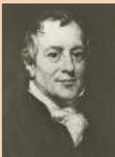
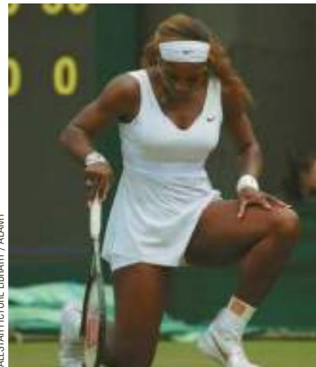

# The Legacy of Adam Smith and David Ricardo

conomists have long understood the gains from trade. Here is how the

It is a maxim of every prudent master of a family, never to attempt to make at home what it will cost him more to make than to buy. The tailor does not attempt to make his own shoes, but buys them of the shoemaker. The shoemaker does not attempt to make his own clothes but employs a tailor. The farmer attempts to make neither the one nor the other, but employs those different artificers. All of them find it for their interest to employ their whole industry in a way in which they have some advantage over their neighbors, and to purchase

  
BETTMANN/CORBIS  
David Ricardo

with a part of its produce, or what is the same thing, with the price of part of it, whatever else they have occasion for.

This quotation is from Smith’s 1776 book An Inquiry into the Nature and Causes of the Wealth of Nations, which was a landmark in the analysis of trade and economic interdependence.

Smith’s book inspired David Ricardo, a millionaire stockbroker, to become an economist. In his 1817 book

Principles of Political Economy and Taxation, Ricardo developed the principle of comparative advantage as we know it today. He considered an ex-

ample with two goods (wine and

cloth) and two countries (England and Portugal). He showed that both countries can gain by opening up trade and specializing based on comparative advantage.

Ricardo’s theory is the starting point of modern international economics, but his defense of free trade was not a mere academic exercise. Ricardo put his beliefs to work as a member of the British Parliament, where he opposed the Corn Laws, which restricted the import of grain.

The conclusions of Adam Smith and David Ricardo on the gains from trade have held up well over time. Although economists often disagree on questions of policy, they are united in their support of free trade. Moreover, the central argument for free trade has not changed much in the past two centuries. Even though the field of economics has broadened its scope and refined its theories since the time of Smith and Ricardo, economists’ opposition to trade restrictions is still based largely on the principle of comparative advantage. ■

## 3-3 Applications of Comparative Advantage

The principle of comparative advantage explains interdependence and the gains from trade. Because interdependence is so prevalent in the modern world, the principle of comparative advantage has many applications. Here are two examples, one fanciful and one of great practical importance.

## 3-3a Should Serena Williams Mow Her Own Lawn?

When Serena Williams plays at the Wimbledon tennis tournament, she spends a lot of time running around on grass. One of the most talented tennis players of all time, she can hit a ball with a speed and accuracy that most casual athletes can only dream of. Most likely, she is talented at other physical activities as well. For example, let’s imagine that Serena can mow her lawn faster than anyone else. But just because she can mow her lawn fast, does this mean she should?

To answer this question, we can use the concepts of opportunity cost and comparative advantage. Let’s say that Serena can mow her lawn in 2 hours. In that same 2 hours, she could film a television commercial and earn \$30,000. By contrast, Forrest Gump, the boy next door, can mow Serena’s lawn in 4 hours. In that same 4 hours, Forrest could work at McDonald’s and earn \$50.

ALLSTAR PICTURE LIBRARY / ALAMY

  
“They did a nice job with this grass.”

## IN THE NEWS
