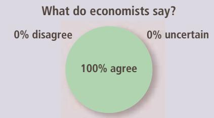
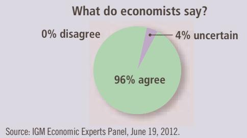

# ASK THE EXPERTS

## Trade between China and the United States

“Trade with China makes most Americans better off because, among other advantages, they can buy goods that are made or assembled more cheaply in China.”

“Some Americans who work in the production of competing goods, such as clothing and furniture, are made worse off by trade with China.”

The principle of comparative advantage states that each good should be produced by the country that has the smaller opportunity cost of producing that good. Because the opportunity cost of a car is 2 tons of food in the United States but only 1 ton of food in Japan, Japan has a comparative advantage in producing cars. Japan should produce more cars than it wants for its own use and export some of them to the United States. Similarly, because the opportunity cost of a ton of food is 1 car in Japan but only 1/2 car in the United States, the United States has a comparative advantage in producing food. The United States should produce more food than it wants to consume and export some to Japan. Through specialization and trade, both countries can have more food and more cars.

In reality, of course, the issues involved in trade among nations are more complex than this example suggests. Most important among these issues is that each country has many citizens with different interests. International trade can make some individuals worse off, even as it makes the country as a whole better off. When the United States exports food and imports cars, the impact on an American farmer is not the same as the impact on an American autoworker. Yet, contrary to the opinions sometimes voiced by politicians and pundits, international trade is not like war, in which some countries win and others lose. Trade allows all countries to achieve greater prosperity.

Source: IGM Economic Experts Panel, June 19, 2012.

Suppose that a skilled brain surgeon also happens QuickQuiz to be the world’s fastest typist. Should she do her own typing or hire a secretary? Explain.

## 3-4 Conclusion

You should now understand more fully the benefits of living in an interdependent economy. When Americans buy tube socks from China, when residents of Maine drink orange juice from Florida, and when a homeowner hires the kid next door to mow her lawn, the same economic forces are at work. The principle of comparative advantage shows that trade can make everyone better off.

Having seen why interdependence is desirable, you might naturally ask how it is possible. How do free societies coordinate the diverse activities of all the people involved in their economies? What ensures that goods and services will get from those who should be producing them to those who should be consuming them? In a world with only two people, such as Ruby the rancher and Frank the farmer, the answer is simple: These two people can bargain and allocate resources between themselves. In the real world with billions of people, the answer is less obvious. We take up this issue in the next chapter, where we see that free societies allocate resources through the market forces of supply and demand.

## CHAPTER QuickQuiz

1. In an hour, Mateo can wash 2 cars or mow 1 lawn, and Tyler can wash 3 cars or mow 1 lawn. Who has the absolute advantage in car washing, and who has the absolute advantage in lawn mowing?

a. Mateo in washing, Tyler in mowing.

b. Tyler in washing, Mateo in mowing.

c. Mateo in washing, neither in mowing.

d. Tyler in washing, neither in mowing.

2. Once again, in an hour, Mateo can wash 2 cars or mow 1 lawn, and Tyler can wash 3 cars or mow 1 lawn. Who has the comparative advantage in car washing, and who has the comparative advantage in lawn mowing? a. Mateo in washing, Tyler in mowing.

b. Tyler in washing, Mateo in mowing.

c. Mateo in washing, neither in mowing.

d. Tyler in washing, neither in mowing.

3. When two individuals produce efficiently and then make a mutually beneficial trade based on comparative advantage,

a. they both obtain consumption outside their production possibilities frontier.

b. they both obtain consumption inside their production possibilities frontier.

c. one individual consumes inside her production possibilities frontier, while the other consumes outside hers.

d. each individual consumes a point on her own production possibilities frontier.

4. Which goods will a nation typically import?

a. those goods in which the nation has an absolute advantage

b. those goods in which the nation has a comparative advantage

c. those goods in which other nations have an absolute advantage

d. those goods in which other nations have a comparative advantage

5. Suppose that in the United States, producing an aircraft takes 10,000 hours of labor and producing a shirt takes 2 hours of labor. In China, producing an aircraft takes 40,000 hours of labor and producing a shirt takes 4 hours of labor. What will these nations trade?

a. China will export aircraft, and the United States will export shirts.

b. China will export shirts, and the United States will export aircraft.

c. Both nations will export shirts.

d. There are no gains from trade in this situation.

6. Kayla can cook dinner in 30 minutes and wash the laundry in 20 minutes. Her roommate takes half as long to do each task. How should the roommates allocate the work?

a. Kayla should do more of the cooking based on her comparative advantage.

b. Kayla should do more of the washing based on her comparative advantage.

c. Kayla should do more of the washing based on her absolute advantage.

d. There are no gains from trade in this situation.

## SUMMARY

Each person consumes goods and services produced by many other people both in the United States and around the world. Interdependence and trade are desirable because they allow everyone to enjoy a greater quantity and variety of goods and services.

There are two ways to compare the ability of two people to produce a good. The person who can produce the good with the smaller quantity of inputs is said to have an absolute advantage in producing the good. The person who has the smaller opportunity cost of producing the good is said to have a comparative advantage. The gains from trade are based on comparative advantage, not absolute advantage.

Trade makes everyone better off because it allows people to specialize in those activities in which they have a comparative advantage.

The principle of comparative advantage applies to countries as well as to people. Economists use the principle of comparative advantage to advocate free trade among countries.

## KEY CONCEPTS

## QUESTIONS FOR REVIEW

1. Under what conditions is the production possibilities frontier linear rather than bowed out?

2. Explain how absolute advantage and comparative advantage differ.

3. Give an example in which one person has an absolute advantage in doing something but another person has a comparative advantage.

4. Is absolute advantage or comparative advantage more important for trade? Explain your reasoning using the example in your answer to question 3.

5. If two parties trade based on comparative advantage and both gain, in what range must the price of the trade lie?

6. Why do economists oppose policies that restrict trade among nations?

## PROBLEMS AND APPLICATIONS

1. Maria can read 20 pages of economics in an hour. She can also read 50 pages of sociology in an hour. She spends 5 hours per day studying.

a. Draw Maria’s production possibilities frontier for reading economics and sociology.

b. What is Maria’s opportunity cost of reading 100 pages of sociology?

2. American and Japanese workers can each produce 4 cars a year. An American worker can produce 10 tons of grain a year, whereas a Japanese worker can produce 5 tons of grain a year. To keep things simple, assume that each country has 100 million workers.

a. For this situation, construct a table analogous to the table in Figure 1.

b. Graph the production possibilities frontiers for the American and Japanese economies.

c. For the United States, what is the opportunity cost of a car? Of grain? For Japan, what is the opportunity cost of a car? Of grain? Put this information in a table analogous to Table 1.

d. Which country has an absolute advantage in producing cars? In producing grain?

e. Which country has a comparative advantage in producing cars? In producing grain?

f. Without trade, half of each country’s workers produce cars and half produce grain. What quantities of cars and grain does each country produce?

g. Starting from a position without trade, give an example in which trade makes each country better off.

3. Pat and Kris are roommates. They spend most of their time studying (of course), but they leave some time for their favorite activities: making pizza and brewing root beer. Pat takes 4 hours to brew a gallon of root beer and 2 hours to make a pizza. Kris takes 6 hours

to brew a gallon of root beer and 4 hours to make a pizza.

a. What is each roommate’s opportunity cost of making a pizza? Who has the absolute advantage in making pizza? Who has the comparative advantage in making pizza?

b. If Pat and Kris trade foods with each other, who will trade away pizza in exchange for root beer?

c. The price of pizza can be expressed in terms of gallons of root beer. What is the highest price at which pizza can be traded that would make both roommates better off? What is the lowest price? Explain.

4. Suppose that there are 10 million workers in Canada and that each of these workers can produce either 2 cars or 30 bushels of wheat in a year.

a. What is the opportunity cost of producing a car in Canada? What is the opportunity cost of producing a bushel of wheat in Canada? Explain the relationship between the opportunity costs of the two goods.

b. Draw Canada’s production possibilities frontier. If Canada chooses to consume 10 million cars, how much wheat can it consume without trade? Label this point on the production possibilities frontier.

c. Now suppose that the United States offers to buy 10 million cars from Canada in exchange for 20 bushels of wheat per car. If Canada continues to consume 10 million cars, how much wheat does this deal allow Canada to consume? Label this point on your diagram. Should Canada accept the deal?

5. England and Scotland both produce scones and sweaters. Suppose that an English worker can produce 50 scones per hour or 1 sweater per hour.

Suppose that a Scottish worker can produce 40 scones per hour or 2 sweaters per hour.

a. Which country has the absolute advantage in the production of each good? Which country has the comparative advantage?

b. If England and Scotland decide to trade, which commodity will Scotland export to England? Explain.

c. If a Scottish worker could produce only 1 sweater per hour, would Scotland still gain from trade? Would England still gain from trade? Explain.

6. The following table describes the production possibilities of two cities in the country of Baseballia:

<table><tr><td></td><td>Pairs of Red Socks per Worker per Hour</td><td>Pairs of White Socks per Worker per Hour</td></tr><tr><td>Boston</td><td>3</td><td>3</td></tr><tr><td>Chicago</td><td>2</td><td>1</td></tr></table>

a. Without trade, what is the price of white socks (in terms of red socks) in Boston? What is the price in Chicago?

b. Which city has an absolute advantage in the production of each color sock? Which city has a comparative advantage in the production of each color sock?

c. If the cities trade with each other, which color sock will each export?

d. What is the range of prices at which trade can occur?

7. A German worker takes 400 hours to produce a car and 2 hours to produce a case of wine. A French worker takes 600 hours to produce a car and X hours to produce a case of wine.

a. For what values of X will gains from trade be possible? Explain.

b. For what values of X will Germany export cars and import wine? Explain.

8. Suppose that in a year an American worker can produce 100 shirts or 20 computers and a Chinese worker can produce 100 shirts or 10 computers.

a. For each country, graph the production possibilities frontier. Suppose that without trade the workers in each country spend half their time producing each good. Identify this point in your graphs.

b. If these countries were open to trade, which country would export shirts? Give a specific numerical example and show it on your graphs. Which country would benefit from trade? Explain.

c. Explain at what price of computers (in terms of shirts) the two countries might trade.

d. Suppose that China catches up with American productivity so that a Chinese worker can produce 100 shirts or 20 computers. What pattern of trade would you predict now? How does this advance in Chinese productivity affect the economic wellbeing of the two countries’ citizens?

9. Are the following statements true or false? Explain in each case.

a. “Two countries can achieve gains from trade even if one of the countries has an absolute advantage in the production of all goods.”

b. “Certain talented people have a comparative advantage in everything they do.”

c. “If a certain trade is good for one person, it can’t be good for the other one.”

d. “If a certain trade is good for one person, it is always good for the other one.”

e. “If trade is good for a country, it must be good for everyone in the country.”

## PART II How Markets Work

