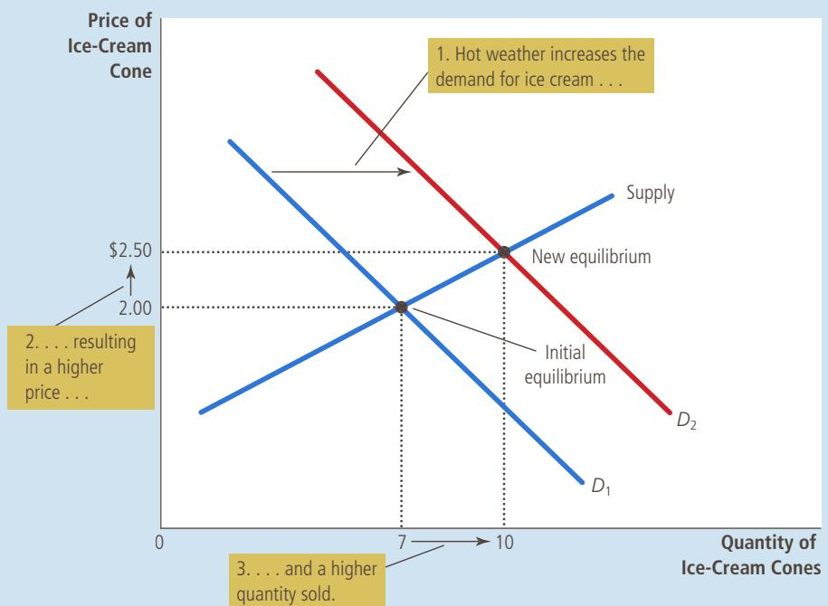
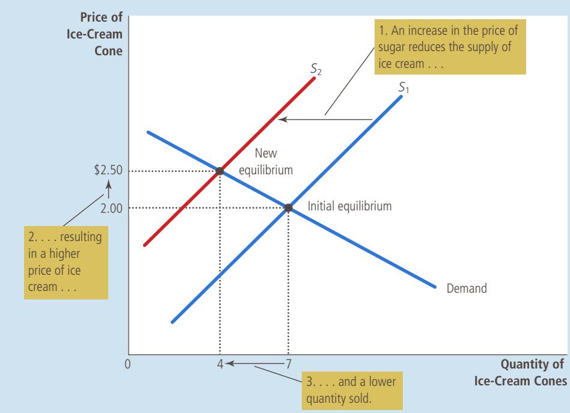
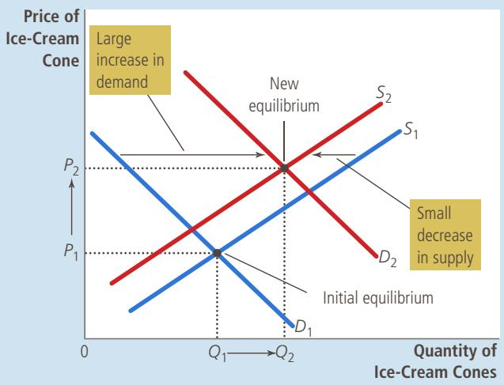
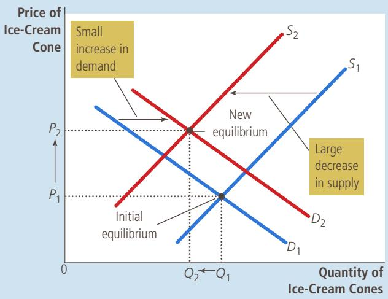
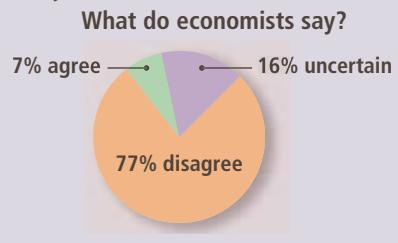

## How an Increase in Demand Affects the Equilibrium

An event that raises quantity demanded at any given price shifts the demand curve to the right. The equilibrium price and the equilibrium quantity both rise. Here an abnormally hot summer causes buyers to demand more ice cream. The demand curve shifts from $D _ { 1 }$ to $D _ { 2 } ,$ which causes the equilibrium price to rise from \$2.00 to \$2.50 and the equilibrium quantity to rise from 7 to 10 cones.

causes the equilibrium price to rise. When the price rises, the quantity supplied rises. This increase in quantity supplied is represented by the movement along the supply curve.

To summarize, a shift in the supply curve is called a “change in supply,” and a shift in the demand curve is called a “change in demand.” A movement along a fixed supply curve is called a “change in the quantity supplied,” and a movement along a fixed demand curve is called a “change in the quantity demanded.”

Example: A Change in Market Equilibrium Due to a Shift in Supply Suppose that during another summer, a hurricane destroys part of the sugarcane crop and drives up the price of sugar. How does this event affect the market for ice cream? Once again, to answer this question, we follow our three steps.

1. The change in the price of sugar, an input for making ice cream, affects the supply curve. By raising the costs of production, it reduces the amount of ice cream that firms produce and sell at any given price. The demand curve does not change because the higher cost of inputs does not directly affect the amount of ice cream consumers wish to buy.

2. The supply curve shifts to the left because, at every price, the total amount that firms are willing and able to sell is reduced. Figure 11 illustrates this decrease in supply as a shift in the supply curve from $S _ { 1 }$ to $S _ { 2 }$

3. At the old price of \$2, there is now an excess demand for ice cream, and this shortage causes firms to raise the price. As Figure 11 shows, the shift in the supply curve raises the equilibrium price from \$2.00 to \$2.50 and

## FIGURE 11

## How a Decrease in Supply Affects the Equilibrium

An event that reduces quantity supplied at any given price shifts the supply curve to the left. The equilibrium price rises, and the equilibrium quantity falls. Here an increase in the price of sugar (an input) causes sellers to supply less ice cream. The supply curve shifts from S to S , which causes the equilibrium price of ice cream to rise from \$2.00 to \$2.50 and the equilibrium quantity to fall from 7 to 4 cones.

lowers the equilibrium quantity from 7 to 4 cones. As a result of the sugar price increase, the price of ice cream rises, and the quantity of ice cream sold falls.

Example: Shifts in Both Supply and Demand Now suppose that the heat wave and the hurricane occur during the same summer. To analyze this combination of events, we again follow our three steps.

1. We determine that both curves must shift. The hot weather affects the demand curve because it alters the amount of ice cream that consumers want to buy at any given price. At the same time, when the hurricane drives up sugar prices, it alters the supply curve for ice cream because it changes the amount of ice cream that firms want to sell at any given price.

2. The curves shift in the same directions as they did in our previous analysis: The demand curve shifts to the right, and the supply curve shifts to the left. Figure 12 illustrates these shifts.

3. As Figure 12 shows, two possible outcomes might result depending on the relative size of the demand and supply shifts. In both cases, the equilibrium price rises. In panel (a), where demand increases substantially while supply falls just a little, the equilibrium quantity also rises. By contrast, in panel (b), where supply falls substantially while demand rises just a little, the equilibrium quantity falls. Thus, these events certainly raise the price of ice cream, but their impact on the amount of ice cream sold is ambiguous (that is, it could go either way).

## FIGURE 12

A Shift in Both Supply and Demand

Here we observe a simultaneous increase in demand and decrease in supply. Two outcomes are possible. In panel (a), the equilibrium price rises from $P _ { 1 }$ to $P _ { 2 } ,$ and the equilibrium quantity rises from $Q _ { 1 }$ to $Q _ { 2 } .$ . In panel (b), the equilibrium price again rises from $P _ { 1 }$ to $P _ { 2 } ,$ but the equilibrium quantity falls from $Q _ { 1 }$ to $Q _ { 2 } .$

(a) Price Rises, Quantity Rises  

(b) Price Rises, Quantity Falls  

Summary We have just seen three examples of how to use supply and demand curves to analyze a change in equilibrium. Whenever an event shifts the supply curve, the demand curve, or perhaps both curves, you can use these tools to predict how the event will alter the price and quantity sold in equilibrium. Table 4 shows the predicted outcome for any combination of shifts in the two curves. To make sure you understand how to use the tools of supply and demand, pick a few entries in this table and make sure you can explain to yourself why the table contains the prediction that it does.

## TABLE 4

What Happens to Price and Quantity When Supply or Demand Shifts?

As a quick quiz, make sure you can explain at least a few of the entries in this table using a supply-and-demand diagram.

<table><tr><td></td><td>No Change in Supply</td><td>An Increase in Supply</td><td>A Decrease in Supply</td></tr><tr><td rowspan="2">No Change in Demand</td><td>P same</td><td>P down</td><td>P up</td></tr><tr><td>Q same</td><td>Q up</td><td>Q down</td></tr><tr><td rowspan="2">An Increase in Demand</td><td>P up</td><td>P ambiguous</td><td>P up</td></tr><tr><td>Q up</td><td>Q up</td><td>Q ambiguous</td></tr><tr><td rowspan="2">A Decrease in Demand</td><td>P down</td><td>P down</td><td>P ambiguous</td></tr><tr><td>Q down</td><td>Q ambiguous</td><td>Q down</td></tr></table>

On the appropriate diagram, show what happens to the market for pizza if the price of tomatoes rises. • On a separate diagram, show what happens pizza if the price of hamburgers falls.

## 4-5 Conclusion: How Prices Allocate Resources

This chapter has analyzed supply and demand in a single market. Our discussion has centered on the market for ice cream, but the lessons learned here apply to most other markets as well. Whenever you go to a store to buy something, you are contributing to the demand for that item. Whenever you look for a job, you are contributing to the supply of labor services. Because supply and demand are such pervasive economic phenomena, the model of supply and demand is a powerful tool for analysis. We use this model repeatedly in the following chapters.

One of the Ten Principles of Economics discussed in Chapter 1 is that markets are usually a good way to organize economic activity. Although it is still too early to judge whether market outcomes are good or bad, in this chapter we have begun to see how markets work. In any economic system, scarce resources have to be allocated among competing uses. Market economies harness the forces of supply and demand to serve that end. Supply and demand together determine the prices of the economy’s many different goods and services; prices in turn are the signals that guide the allocation of resources.

For example, consider the allocation of beachfront land. Because the amount of this land is limited, not everyone can enjoy the luxury of living by the beach. Who gets this resource? The answer is whoever is willing and able to pay the price. The price of beachfront land adjusts until the quantity of land demanded exactly balances the quantity supplied. Thus, in market economies, prices are the mechanism for rationing scarce resources.

Similarly, prices determine who produces each good and how much is produced. For instance, consider farming. Because we need food to survive, it is crucial that some people work on

## ASK THE EXPERTS

## Price Gouging

“Connecticut should pass its Senate Bill 60, which states that during a ‘severe weather event emergency, no person within the chain of distribution of consumer goods and services shall sell or offer to sell consumer goods or services for a price that is unconscionably excessive.’”

  
Source: IGM Economic Experts Panel, May 2, 2012.  
“Two dollars”

  
“—and seventy-five cents.”

## IN THE NEWS
