## LINES AT THE GAS PUMP

As we discussed in Chapter 5, in 1973 the Organization of Petroleum Exporting Countries (OPEC) reduced production of crude oil, thereby increasing its price in world oil markets. Because crude oil is

the major input used to make gasoline, the higher oil prices reduced the supply of gasoline. Long lines at gas stations became commonplace, and motorists often had to wait for hours to buy only a few gallons of gas.

What was responsible for the long gas lines? Most people blame OPEC. Surely, if OPEC had not reduced production of crude oil, the shortage of gasoline would not have occurred. Yet economists blame the U.S. government regulations that limited the price oil companies could charge for gasoline.

Figure 2 reveals what happened. As panel (a) shows, before OPEC raised the price of crude oil, the equilibrium price of gasoline, $P _ { 1 } ,$ was below the price ceiling. The price regulation, therefore, had no effect. When the price of crude oil rose, however, the situation changed. The increase in the price of crude oil raised the cost of

## FIGURE 2

The Market for Gasoline with a Price Ceiling

Panel (a) shows the gasoline market when the price ceiling is not binding because the equilibrium price, $P _ { 1 } ,$ is below the ceiling. Panel (b) shows the gasoline market after an increase in the price of crude oil (an input into making gasoline) shifts the supply curve to the left from $S _ { \ l _ { 1 } }$ to S . In an unregulated market, the price would have risen from $P _ { 1 }$ to $P _ { 2 } .$ The price ceiling, however, prevents this from happening. At the binding price ceiling, consumers are willing to buy $Q _ { D } ,$ but producers of gasoline are willing to sell only $Q _ { s } .$ The difference between quantity demanded and quantity supplied, $Q _ { D } - Q _ { S } ,$ measures the gasoline shortage.

(a) The Price Ceiling on Gasoline Is Not Binding  
(b) The Price Ceiling on Gasoline Is Binding  
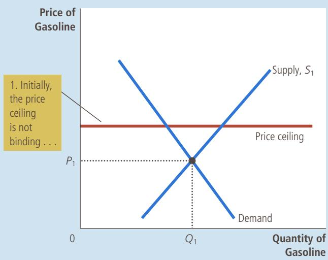

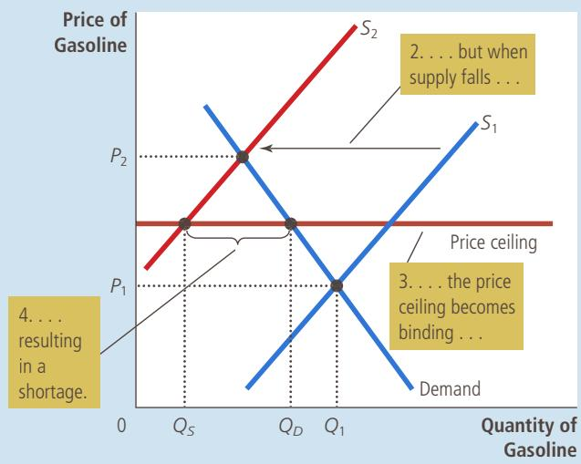

producing gasoline, and this reduced the supply of gasoline. As panel (b) shows, the supply curve shifted to the left from $S _ { \mathrm { \Omega } _ { 1 } }$ to $S _ { \gamma } .$ In an unregulated market, this shift in supply would have raised the equilibrium price of gasoline from $P _ { 1 }$ to $P _ { 2 ^ { \prime } }$ and no shortage would have resulted. Instead, the price ceiling prevented the price from rising to the equilibrium level. At the price ceiling, producers were willing to sell $Q _ { s } ,$ but consumers were willing to buy $Q _ { D } .$ Thus, the shift in supply caused a severe shortage at the regulated price.

Eventually, the laws regulating the price of gasoline were repealed. Lawmakers came to understand that they were partly responsible for the many hours Americans lost waiting in line to buy gasoline. Today, when the price of crude oil changes, the price of gasoline can adjust to bring supply and demand into equilibrium.

## RENT CONTROL IN THE SHORT RUN AND THE LONG RUN

CASE One common example of a price ceiling is rent control. In many STUDY cities, the local government places a ceiling on rents that landlords may charge their tenants. The goal of this policy is to help the poor by making housing more affordable. Economists often criticize rent control, arguing that it is a highly inefficient way to help the poor raise their standard of living. One economist called rent control “the best way to destroy a city, other than bombing.”

The adverse effects of rent control are less apparent to the general population because these effects occur over many years. In the short run, landlords have a fixed number of apartments to rent, and they cannot adjust this number quickly as market conditions change. Moreover, the number of people searching for housing in a city may not be highly responsive to rents in the short run because people take time to adjust their housing arrangements. Therefore, the short-run supply and demand for housing are relatively inelastic.

Panel (a) of Figure 3 shows the short-run effects of rent control on the housing market. As with any binding price ceiling, rent control causes a shortage. But because supply and demand are inelastic in the short run, the initial shortage caused by rent control is small. The primary effect in the short run is to reduce rents.

The long-run story is very different because the buyers and sellers of rental housing respond more to market conditions as time passes. On the supply side, landlords respond to low rents by not building new apartments and by failing to maintain existing ones. On the demand side, low rents encourage people to find their own apartments (rather than living with their parents or sharing apartments with roommates) and induce more people to move into the city. Therefore, both supply and demand are more elastic in the long run.

Panel (b) of Figure 3 illustrates the housing market in the long run. When rent control depresses rents below the equilibrium level, the quantity of apartments supplied falls substantially and the quantity of apartments demanded rises substantially. The result is a large shortage of housing.

In cities with rent control, landlords use various mechanisms to ration housing. Some landlords keep long waiting lists. Others give preference to tenants without children. Still others discriminate on the basis of race. Sometimes apartments are allocated to those willing to offer under-the-table payments to building superintendents. In essence, these bribes bring the total price of an apartment closer to the equilibrium price.

To understand fully the effects of rent control, we have to remember one of the Ten Principles of Economics from Chapter 1: People respond to incentives. In free

## FIGURE 3

Rent Control in the Short Run and in the Long Run

Panel (a) shows the short-run effects of rent control: Because the supply and demand curves for apartments are relatively inelastic, the price ceiling imposed by a rent-control law causes only a small shortage of housing. Panel (b) shows the long-run effects of rent control: Because the supply and demand curves for apartments are more elastic, rent control causes a large shortage.

(a) Rent Control in the Short Run (supply and demand are inelastic)

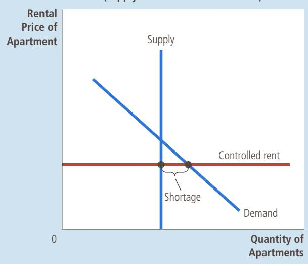  
(b) Rent Control in the Long Run (supply and demand are elastic)

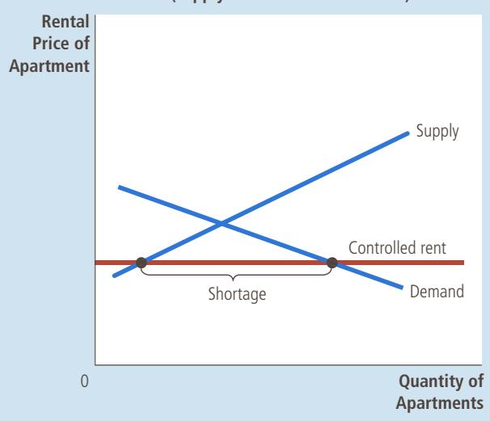

## ASK THE EXPERTS

## Rent Control

“Local ordinances that limit rent increases for some rental housing units, such as in New York and San Francisco, have had a positive impact over the past three decades on the amount and quality of broadly affordable rental housing in cities that have used them.”

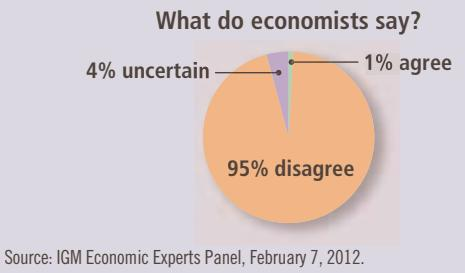

markets, landlords try to keep their buildings clean and safe because desirable apartments command higher prices. By contrast, when rent control creates shortages and waiting lists, landlords lose their incentive to respond to tenants’ concerns. Why should a landlord spend money to maintain and improve the property when people are waiting to move in as it is? In the end, tenants get lower rents, but they also get lower-quality housing.

Policymakers often react to the effects of rent control by imposing additional regulations. For example, various laws make racial discrimination in housing illegal and require landlords to provide minimally adequate living conditions. These laws, however, are difficult and costly to enforce. By contrast, when rent control is eliminated and a market for housing is regulated by the forces of competition, such laws are less necessary. In a free market, the price of housing adjusts to eliminate the shortages that give rise to undesirable landlord behavior.

## 6-1b How Price Floors Affect Market Outcomes

To examine the effects of another kind of government price control, let’s return to the market for ice cream. Imagine now that the government is persuaded by the pleas of the National Organization of Ice-Cream Makers whose members feel that the \$3 equilibrium price is too low. In this case, the government might institute a price floor. Price floors, like price ceilings, are an attempt by the government to maintain prices at other than equilibrium levels. Whereas a price ceiling places a legal maximum on prices, a price floor places a legal minimum.

When the government imposes a price floor on the ice-cream market, two outcomes are possible. If the government imposes a price floor of \$2 per cone when the equilibrium price is \$3, we obtain the outcome in panel (a) of Figure 4. In this case, because the equilibrium price is above the floor, the price floor is not binding. Market forces naturally move the economy to the equilibrium, and the price floor has no effect.

Panel (b) of Figure 4 shows what happens when the government imposes a price floor of \$4 per cone. In this case, because the equilibrium price of \$3 is below the floor, the price floor is a binding constraint on the market. The forces of supply and demand tend to move the price toward the equilibrium price, but when the market price hits the floor, it can fall no further. The market price equals the price floor. At this floor, the quantity of ice cream supplied (120 cones) exceeds the quantity demanded (80 cones). Because of this excess supply of 40 cones, some people who want to sell ice cream at the going price are unable to. Thus, a binding price floor causes a surplus.

Just as the shortages resulting from price ceilings can lead to undesirable rationing mechanisms, so can the surpluses resulting from price floors. The sellers who appeal to the personal biases of the buyers, perhaps due to racial or familial ties, may be better able to sell their goods than those who do not. By contrast, in a free market, the price serves as the rationing mechanism, and sellers can sell all they want at the equilibrium price.

In panel (a), the government imposes a price floor of \$2. Because this is below the equilibrium price of \$3, the price floor has no effect. The market price adjusts to balance supply and demand. At the equilibrium, quantity supplied and quantity demanded both equal 100 cones. In panel (b), the government imposes a price floor of \$4, which is above the equilibrium price of \$3. Therefore, the market price equals \$4. Because 120 cones are supplied at this price and only 80 are demanded, there is a surplus of 40 cones.

## FIGURE 4

A Market with a Price Floor

(a) A Price Floor That Is Not Binding  
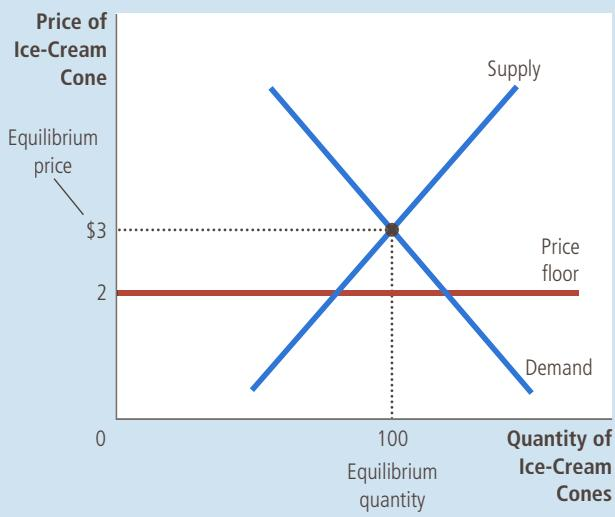

(b) A Price Floor That Is Binding  
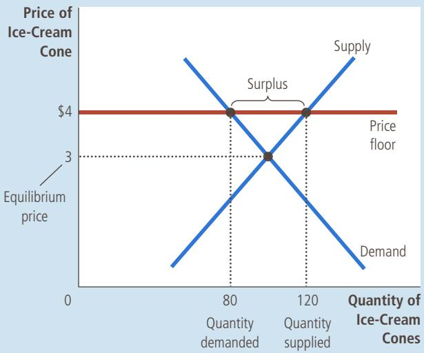

An important example of a price floor is the minimum wage. Minimum-wage laws dictate the lowest price for labor that any employer may pay. The U.S. Congress first instituted a minimum wage with the Fair Labor Standards Act of 1938 to ensure workers a minimally adequate standard of living. In 2015, the minimum wage according to federal law was \$7.25 per hour. (Some states mandate minimum wages above the federal level.) Many European nations have minimum-wage laws as well, sometimes significantly higher than in the United States. For example, even though the average income in France is almost 30 percent lower than it is in the United States, the French minimum wage is more than 30 percent higher.

To examine the effects of a minimum wage, we must consider the market for labor. Panel (a) of Figure 5 shows the labor market, which, like all markets, is subject to the forces of supply and demand. Workers determine the supply of labor, and firms determine the demand. If the government doesn’t intervene, the wage normally adjusts to balance labor supply and labor demand.

Panel (b) of Figure 5 shows the labor market with a minimum wage. If the minimum wage is above the equilibrium level, as it is here, the quantity of labor supplied exceeds the quantity demanded. The result is unemployment. Thus, while the minimum wage raises the incomes of those workers who have jobs, it lowers the incomes of workers who cannot find jobs.

To fully understand the minimum wage, keep in mind that the economy contains not a single labor market but many labor markets for different types of workers. The impact of the minimum wage depends on the skill and experience of the worker. Highly skilled and experienced workers are not affected because their equilibrium wages are well above the minimum. For these workers, the minimum wage is not binding.

## FIGURE 5

How the Minimum Wage Affects the Labor Market

Panel (a) shows a labor market in which the wage adjusts to balance labor supply and labor demand. Panel (b) shows the impact of a binding minimum wage. Because the minimum wage is a price floor, it causes a surplus: The quantity of labor supplied exceeds the quantity demanded. The result is unemployment.

(a) A Free Labor Market  
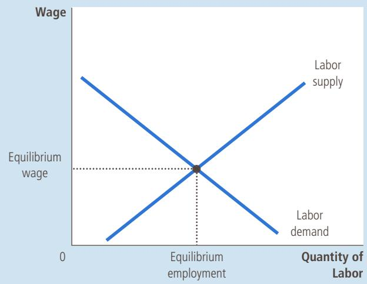

(b) A Labor Market with a Binding Minimum Wage  
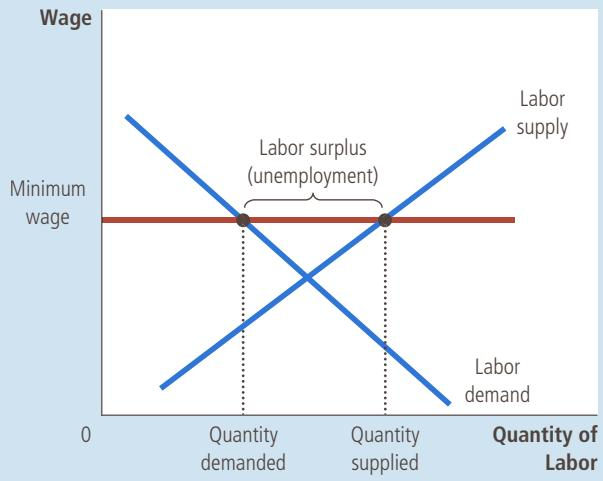

The minimum wage has its greatest impact on the market for teenage labor. The equilibrium wages of teenagers are low because teenagers are among the least skilled and least experienced members of the labor force. In addition, teenagers are often willing to accept a lower wage in exchange for on-the-job training. (Some teenagers, including many college students, are willing to work as interns for no pay at all. Because internships pay nothing, minimum-wage laws often do not apply to them. If they did, these internship opportunities might not exist.) As a result, the minimum wage is binding more often for teenagers than for other members of the labor force.

Many economists have studied how minimum-wage laws affect the teenage labor market. These researchers compare the changes in the minimum wage over time with the changes in teenage employment. Although there is some debate about how much the minimum wage affects employment, the typical study finds that a 10 percent increase in the minimum wage depresses teenage employment by 1 to 3 percent. In interpreting this estimate, note that a 10 percent increase in the minimum wage does not raise the average wage of teenagers by 10 percent. A change in the law does not directly affect those teenagers who are already paid well above the minimum, and enforcement of minimum-wage laws is not perfect. Thus, the estimated drop in employment of 1 to 3 percent is significant.

In addition to altering the quantity of labor demanded, the minimum wage alters the quantity supplied. Because the minimum wage raises the wage that teenagers can earn, it increases the number of teenagers who choose to look for jobs. Studies have found that a higher minimum wage influences which teenagers are employed. When the minimum wage rises, some teenagers who are still attending high school choose to drop out and take jobs. With more people vying for the available jobs, some of these new dropouts displace other teenagers who had already dropped out of school and now become unemployed.

The minimum wage is a frequent topic of debate. Advocates of the minimum wage view the policy as one way to raise the income of the working poor. They correctly point out that workers who earn the minimum wage can afford only a meager standard of living. In 2015, for instance, when the minimum wage was \$7.25 per hour, two adults working 40 hours a week for every week of the year at minimum-wage jobs had a total annual income of only \$30,160. This amount was 24 percent above the official poverty line for a family of four but was less than half of the median family income in the United States. Many advocates of the minimum wage admit that it has some adverse effects, including unemployment, but they believe that these effects are small and that, all things considered, a higher minimum wage makes the poor better off.

Opponents of the minimum wage contend that it is not the best way to combat poverty. They note that a high minimum wage causes unemployment, encourages teenagers to drop out of school, and prevents some unskilled workers from getting on-the-job training. Moreover, opponents of the minimum wage point out that it is a poorly targeted policy. Not all minimum-wage workers are heads of households trying to help their families escape poverty. In fact, less than a third of minimum-wage earners are in families with incomes below the

## ASK THE EXPERTS

## The Minimum Wage

“If the federal minimum wage is raised gradually to \$15-per-hour by 2020, the employment rate for low-wage U.S. workers will be substantially lower than it would be under the status quo.”

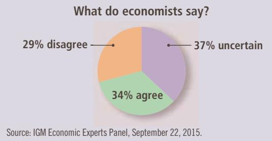

poverty line. Many are teenagers from middle-class homes working at part-time jobs for extra spending money. ●

## 6-1c Evaluating Price Controls

One of the Ten Principles of Economics discussed in Chapter 1 is that markets are usually a good way to organize economic activity. This principle explains why economists usually oppose price ceilings and price floors. To economists, prices are not the outcome of some haphazard process. Prices, they contend, are the result of the millions of business and consumer decisions that lie behind the supply and demand curves. Prices have the crucial job of balancing supply and demand and, thereby, coordinating economic activity. When policymakers set prices by legal decree, they obscure the signals that normally guide the allocation of society’s resources.

Another one of the Ten Principles of Economics is that governments can sometimes improve market outcomes. Indeed, policymakers are motivated to control prices because they view the market’s outcome as unfair. Price controls are often aimed at helping the poor. For instance, rent-control laws try to make housing affordable for everyone, and minimum-wage laws try to help people escape poverty.

Yet price controls often hurt those they are trying to help. Rent control may keep rents low, but it also discourages landlords from maintaining their buildings and makes housing hard to find. Minimum-wage laws may raise the incomes of some workers, but they also cause other workers to become unemployed.

Helping those in need can be accomplished in ways other than controlling prices. For instance, the government can make housing more affordable by paying a fraction of the rent for poor families. Unlike rent control, such rent subsidies do not reduce the quantity of housing supplied and, therefore, do not lead to housing shortages. Similarly, wage subsidies raise the living standards of the working poor without discouraging firms from hiring them. An example of a wage subsidy is the earned income tax credit, a government program that supplements the incomes of low-wage workers.

Although these alternative policies are often better than price controls, they are not perfect. Rent and wage subsidies cost the government money and, therefore, require higher taxes. As we see in the next section, taxation has costs of its own.

Define price ceiling and price floor and give an example of each. Which leads to a shortage? Which leads to a surplus? Why?

## 6-2 Taxes

All governments—from national governments around the world to local governments in small towns—use taxes to raise revenue for public projects, such as roads, schools, and national defense. Because taxes are such an important policy instrument and affect our lives in many ways, we return to the study of taxes several times throughout this book. In this section, we begin our study of how taxes affect the economy.

To set the stage for our analysis, imagine that a local government decides to hold an annual ice-cream celebration—with a parade, fireworks, and speeches by town officials. To raise revenue to pay for the event, the town decides to place a \$0.50 tax on the sale of ice-cream cones. When the plan is announced, our two lobbying groups swing into action. The American Association of Ice-Cream Eaters claims that consumers of ice cream are having trouble making ends meet, and it argues that sellers of ice cream should pay the tax. The National Organization of Ice-Cream Makers claims that its members are struggling to survive in a competitive market, and it argues that buyers of ice cream should pay the tax. The town mayor, hoping to reach a compromise, suggests that half the tax be paid by the buyers and half be paid by the sellers.

To analyze these proposals, we need to address a simple but subtle question: When the government levies a tax on a good, who actually bears the burden of the tax? The people buying the good? The people selling the good? Or if buyers and sellers share the tax burden, what determines how the burden is divided? Can the government simply legislate the division of the burden, as the mayor is suggesting, or is the division determined by more fundamental market forces? The term tax incidence refers to how the burden of a tax is distributed among the various people who make up the economy. As we will see, some surprising lessons about tax incidence can be learned by applying the tools of supply and demand.

## 6-2a How Taxes on Sellers Affect Market Outcomes

We begin by considering a tax levied on sellers of a good. Suppose the local government passes a law requiring sellers of ice-cream cones to send \$0.50 to the government for every cone they sell. How does this law affect the buyers and sellers of ice cream? To answer this question, we can follow the three steps in Chapter 4 for analyzing supply and demand: (1) We decide whether the law affects the supply curve or the demand curve. (2) We decide which way the curve shifts. (3) We examine how the shift affects the equilibrium price and quantity.

Step One The immediate impact of the tax is on the sellers of ice cream. Because the tax is not levied on buyers, the quantity of ice cream demanded at any given price is the same; thus, the demand curve does not change. By contrast, the tax on sellers makes the ice-cream business less profitable at any given price, so it shifts the supply curve.

Step Two Because the tax on sellers raises the cost of producing and selling ice cream, it reduces the quantity supplied at every price. The supply curve shifts to the left (or, equivalently, upward).

In addition to determining the direction in which the supply curve moves, we can also be precise about the size of the shift. For any market price of ice cream, the effective price to sellers—the amount they get to keep after paying the tax—is \$0.50 lower. For example, if the market price of a cone happened to be \$2.00, the effective price received by sellers would be \$1.50. Whatever the market price, sellers will supply a quantity of ice cream as if the price were \$0.50 lower than it is. Put differently, to induce sellers to supply any given quantity, the market price must now be \$0.50 higher to compensate for the effect of the tax. Thus, as shown in Figure $6 ,$ the supply curve shifts upward from $S _ { 1 }$ to $S _ { 2 }$ by the exact size of the tax (\$0.50).

Step Three Having determined how the supply curve shifts, we can now compare the initial and the new equilibriums. Figure 6 shows that the equilibrium price of ice cream rises from \$3.00 to \$3.30, and the equilibrium quantity falls from 100 to 90 cones. Because sellers sell less and buyers buy less in the new equilibrium, the tax reduces the size of the ice-cream market.

## FIGURE 6

## A Tax on Sellers

When a tax of \$0.50 is levied on sellers, the supply curve shifts up by \$0.50 from $S _ { 1 }$ to $S _ { 2 } .$ The equilibrium quantity falls from 100 to 90 cones. The price that buyers pay rises from \$3.00 to \$3.30. The price that sellers receive (after paying the tax) falls from \$3.00 to \$2.80. Even though the tax is levied on sellers, buyers and sellers share the burden of the tax.

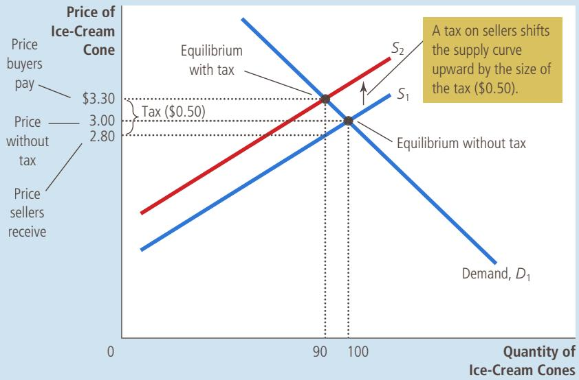

Implications We can now return to the question of tax incidence: Who pays the tax? Although sellers send the entire tax to the government, buyers and sellers share the burden. Because the market price rises from \$3.00 to \$3.30 when the tax is introduced, buyers pay \$0.30 more for each ice-cream cone than they did without the tax. Thus, the tax makes buyers worse off. Sellers get a higher price (\$3.30) from buyers than they did previously, but what they get to keep after paying the tax is only \$2.80 (\$3.30 2 \$0.50 5 \$2.80), compared with \$3.00 before the tax. Thus, the tax also makes sellers worse off.

To sum up, this analysis yields two lessons:

• Taxes discourage market activity. When a good is taxed, the quantity of the good sold is smaller in the new equilibrium.

• Buyers and sellers share the burden of taxes. In the new equilibrium, buyers pay more for the good, and sellers receive less.

## 6-2b How Taxes on Buyers Affect Market Outcomes

Now consider a tax levied on buyers of a good. Suppose that our local government passes a law requiring buyers of ice-cream cones to send \$0.50 to the government for each ice-cream cone they buy. What are the effects of this law? Again, we apply our three steps.

Step One The initial impact of the tax is on the demand for ice cream. The supply curve is not affected because, for any given price of ice cream, sellers have the same incentive to provide ice cream to the market. By contrast, buyers now have to pay a tax to the government (as well as the price to the sellers) whenever they buy ice cream. Thus, the tax shifts the demand curve for ice cream.

Step Two Next, we determine the direction of the shift. Because the tax on buyers makes buying ice cream less attractive, buyers demand a smaller quantity of ice cream at every price. As a result, the demand curve shifts to the left (or, equivalently, downward), as shown in Figure 7.

Once again, we can be precise about the size of the shift. Because of the \$0.50 tax levied on buyers, the effective price to buyers is now \$0.50 higher than the market price (whatever the market price happens to be). For example, if the market price of a cone happened to be \$2.00, the effective price to buyers would be \$2.50. Because buyers look at their total cost including the tax, they demand a quantity of ice cream as if the market price were \$0.50 higher than it actually is. In other words, to induce buyers to demand any given quantity, the market price must now be \$0.50 lower to make up for the effect of the tax. Thus, the tax shifts the demand curve downward from $D _ { 1 }$ to $D _ { 2 }$ by the exact size of the tax (\$0.50).

Step Three Having determined how the demand curve shifts, we can now see the effect of the tax by comparing the initial equilibrium and the new equilibrium. You can see in Figure 7 that the equilibrium price of ice cream falls from \$3.00 to \$2.80, and the equilibrium quantity falls from 100 to 90 cones. Once again, the tax on ice cream reduces the size of the ice-cream market. And once again, buyers and sellers share the burden of the tax. Sellers get a lower price for their product; buyers pay a lower market price to sellers than they did previously, but the effective price (including the tax buyers have to pay) rises from \$3.00 to \$3.30.

Implications If you compare Figures 6 and 7, you will notice a surprising conclusion: Taxes levied on sellers and taxes levied on buyers are equivalent. In both cases, the tax places a wedge between the price that buyers pay and the price that sellers receive. The wedge between the buyers’ price and the sellers’ price is the same, regardless of whether the tax is levied on buyers or sellers. In either case, the wedge shifts the relative position of the supply and demand curves. In the new equilibrium, buyers and sellers share the burden of the tax. The only difference between a tax levied on sellers and a tax levied on buyers is who sends the money to the government.

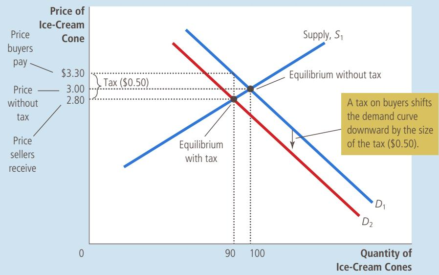

## FIGURE 7

## A Tax on Buyers

When a tax of \$0.50 is levied on buyers, the demand curve shifts down by \$0.50 from $D _ { 1 }$ to $D _ { 2 } .$ The equilibrium quantity falls from 100 to 90 cones. The price that sellers receive falls from \$3.00 to \$2.80. The price that buyers pay (including the tax) rises from \$3.00 to \$3.30. Even though the tax is levied on buyers, buyers and sellers share the burden of the tax.

The equivalence of these two taxes is easy to understand if we imagine that the government collects the \$0.50 ice-cream tax in a bowl on the counter of each icecream store. When the government levies the tax on sellers, the seller is required to place \$0.50 in the bowl after the sale of each cone. When the government levies the tax on buyers, the buyer is required to place \$0.50 in the bowl every time a cone is bought. Whether the \$0.50 goes directly from the buyer’s pocket into the bowl, or indirectly from the buyer’s pocket into the seller’s hand and then into the bowl, does not matter. Once the market reaches its new equilibrium, buyers and sellers share the burden, regardless of how the tax is levied.

## CAN CONGRESS DISTRIBUTE THE BURDEN OF A PAYROLL TAX?

If you have ever received a paycheck, you probably noticed that taxes were deducted from the amount you earned. One of these taxes is called FICA, an acronym for the Federal Insurance Contri-

butions Act. The federal government uses the revenue from the FICA tax to pay for Social Security and Medicare, the income support and healthcare programs for the elderly. FICA is an example of a payroll tax, which is a tax on the wages that firms pay their workers. In 2015, the total FICA tax for the typical worker was 15.3 percent of earnings.

Who do you think bears the burden of this payroll tax—firms or workers? When Congress passed this legislation, it tried to mandate a division of the tax burden. According to the law, half of the tax is paid by firms, and half is paid by workers. That is, half of the tax is paid out of firms’ revenues, and half is deducted from workers’ paychecks. The amount that shows up as a deduction on your pay stub is the worker contribution.

Our analysis of tax incidence, however, shows that lawmakers cannot dictate the distribution of a tax burden so easily. To illustrate, we can analyze a payroll tax as merely a tax on a good, where the good is labor and the price is the wage. The key feature of the payroll tax is that it places a wedge between the wage that firms pay and the wage that workers receive. Figure 8 shows the outcome. When a payroll tax is enacted, the wage received by workers falls, and the wage paid by firms rises. In the end, workers and firms share the burden of the tax, much as the legislation requires. Yet this division of the tax burden between workers and firms has nothing to do with the legislated division: The division of the burden in Figure 8 is not necessarily fifty-fifty, and the same outcome would prevail if the law levied the entire tax on workers or if it levied the entire tax on firms.

This example shows that the most basic lesson of tax incidence is often overlooked in public debate. Lawmakers can decide whether a tax comes from the buyer’s pocket or from the seller’s, but they cannot legislate the true burden of a tax. Rather, tax incidence depends on the forces of supply and demand.

## 6-2c Elasticity and Tax Incidence

When a good is taxed, buyers and sellers of the good share the burden of the tax. But how exactly is the tax burden divided? Only rarely will it be shared equally. To see how the burden is divided, consider the impact of taxation in the two markets in Figure 9. In both cases, the figure shows the initial demand curve, the initial supply curve, and a tax that drives a wedge between the amount paid by buyers and the amount received by sellers. (Not drawn in either panel of the figure is the new supply or demand curve. Which curve shifts depends on whether the tax is levied on buyers or sellers. As we have seen, this is irrelevant for determining the

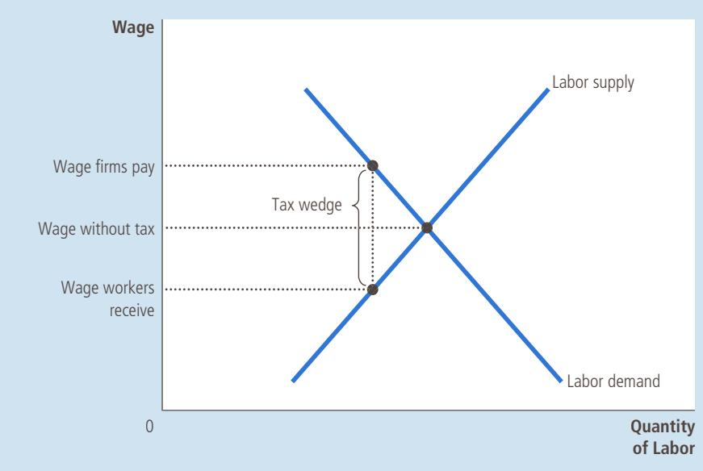

## FIGURE 8

## A Payroll Tax

A payroll tax places a wedge between the wage that workers receive and the wage that firms pay. Comparing wages with and without the tax, you can see that workers and firms share the tax burden. This division of the tax burden between workers and firms does not depend on whether the government levies the tax on workers, levies the tax on firms, or divides the tax equally between the two groups.

incidence of the tax.) The difference in the two panels is the relative elasticity of supply and demand.

Panel (a) of Figure 9 shows a tax in a market with very elastic supply and relatively inelastic demand. That is, sellers are very responsive to changes in the price of the good (so the supply curve is relatively flat), whereas buyers are not very responsive (so the demand curve is relatively steep). When a tax is imposed on a market with these elasticities, the price received by sellers does not fall by much, so sellers bear only a small burden. By contrast, the price paid by buyers rises substantially, indicating that buyers bear most of the burden of the tax.

Panel (b) of Figure 9 shows a tax in a market with relatively inelastic supply and very elastic demand. In this case, sellers are not very responsive to changes in the price (so the supply curve is steeper), whereas buyers are very responsive (so the demand curve is flatter). The figure shows that when a tax is imposed, the price paid by buyers does not rise by much, but the price received by sellers falls substantially. Thus, sellers bear most of the burden of the tax.

The two panels of Figure 9 show a general lesson about how the burden of a tax is divided: A tax burden falls more heavily on the side of the market that is less elastic. Why is this true? In essence, the elasticity measures the willingness of buyers or sellers to leave the market when conditions become unfavorable. A small elasticity of demand means that buyers do not have good alternatives to consuming this particular good. A small elasticity of supply means that sellers do not have good alternatives to producing this particular good. When the good is taxed, the side of the market with fewer good alternatives is less willing to leave the market and, therefore, bears more of the burden of the tax.

We can apply this logic to the payroll tax discussed in the previous case study. Most labor economists believe that the supply of labor is much less elastic than the demand. This means that workers, rather than firms, bear most of the burden of the payroll tax. In other words, the distribution of the tax burden is far from the fifty-fifty split that lawmakers intended.

## FIGURE 9

## How the Burden of a Tax Is Divided

In panel (a), the supply curve is elastic, and the demand curve is inelastic. In this case, the price received by sellers falls only slightly, while the price paid by buyers rises substantially. Thus, buyers bear most of the burden of the tax. In panel (b), the supply curve is inelastic, and the demand curve is elastic. In this case, the price received by sellers falls substantially, while the price paid by buyers rises only slightly. Thus, sellers bear most of the burden of the tax.

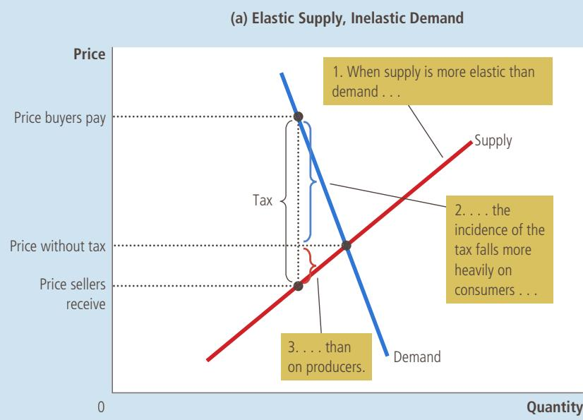

(b) Inelastic Supply, Elastic Demand  
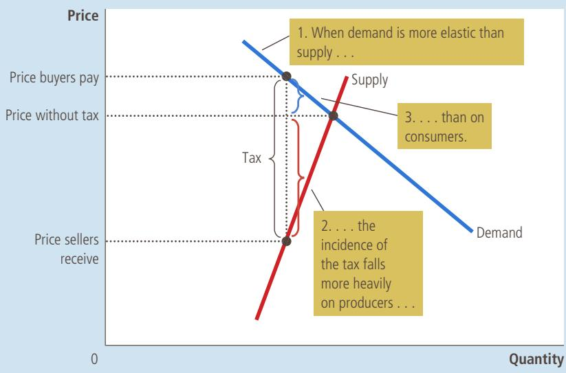

## WHO PAYS THE LUXURY TAX?

In 1990, Congress adopted a new luxury tax on items such as yachts, private airplanes, furs, jewelry, and expensive cars. The goal of the tax was to raise revenue from those who could most easily afford to

pay. Because only the rich could afford to buy such extravagances, taxing luxuries seemed a logical way of taxing the rich.

Yet, when the forces of supply and demand took over, the outcome was quite different from the one Congress intended. Consider, for example, the market for yachts. The demand for yachts is quite elastic. A millionaire can easily not buy a yacht; he can use the money to buy a bigger house, take a European vacation, or leave a larger bequest to his heirs. By contrast, the supply of yachts is relatively inelastic, at least in the short run. Yacht factories are not easily converted to alternative uses, and workers who build yachts are not eager to change careers in response to changing market conditions.

BLEND IMAGES/GETTY IMAGES

Our analysis makes a clear prediction in this case. With elastic demand and inelastic supply, the burden of a tax falls largely on the suppliers. That is, a tax on yachts places a burden largely on the firms and workers who build yachts because they end up getting a significantly lower price for their product. The workers, however, are not wealthy. Thus, the burden of a luxury tax falls more on the middle class than on the rich.

The mistaken assumptions about the incidence of the luxury tax quickly became apparent after the tax went into effect. Suppliers of luxuries made their congressional representatives well aware of the economic hardship they experienced, and Congress repealed most of the luxury tax in 1993. ●

“If this boat were any more expensive, we’d be playing golf.”

In a supply-and-demand diagram, show how a tax on car buyers of \$1,000 QuickQuiz per car affects the quantity of cars sold and the price of cars. In another diagram, show how a tax on car sellers of \$1,000 per car affects the quantity of cars sold and the price of cars. In both of your diagrams, show the change in the price paid by car buyers and the change in the price received by car sellers.

## 6-3 Conclusion

The economy is governed by two kinds of laws: the laws of supply and demand and the laws enacted by governments. In this chapter, we have begun to see how these laws interact. Price controls and taxes are common in various markets in the economy, and their effects are frequently debated in the press and among policymakers. Even a little bit of economic knowledge can go a long way toward understanding and evaluating these policies.

In subsequent chapters, we analyze many government policies in greater detail. We examine the effects of taxation more fully and consider a broader range of policies than we considered here. Yet the basic lessons of this chapter will not change: When analyzing government policies, supply and demand are the first and most useful tools of analysis.

## CHAPTER QuickQuiz

1. When the government imposes a binding price floor, it causes

a. the supply curve to shift to the left.

b. the demand curve to shift to the right.

c. a shortage of the good to develop.

d. a surplus of the good to develop.

2. In a market with a binding price ceiling, an increase in the ceiling will the quantity supplied, the quantity demanded, and reduce the

a. increase, decrease, surplus

b. decrease, increase, surplus

c. increase, decrease, shortage

d. decrease, increase, shortage

3. A \$1 per unit tax levied on consumers of a good is equivalent to

a. a \$1 per unit tax levied on producers of the good.

b. a \$1 per unit subsidy paid to producers of the good.

c. a price floor that raises the good’s price by \$1 per unit.

d. a price ceiling that raises the good’s price by \$1 per unit.

4. Which of the following would increase quantity supplied, decrease quantity demanded, and increase the price that consumers pay?

a. the imposition of a binding price floor

b. the removal of a binding price floor

c. the passage of a tax levied on producers

d. the repeal of a tax levied on producers

5. Which of the following would increase quantity supplied, increase quantity demanded, and decrease the price that consumers pay?

a. the imposition of a binding price floor

b. the removal of a binding price floor

c. the passage of a tax levied on producers

d. the repeal of a tax levied on producers

6. When a good is taxed, the burden of the tax falls mainly on consumers if

a. the tax is levied on consumers.

b. the tax is levied on producers.

c. supply is inelastic, and demand is elastic.

d. supply is elastic, and demand is inelastic.

## SUMMARY

A price ceiling is a legal maximum on the price of a good or service. An example is rent control. If the price ceiling is below the equilibrium price, then the price ceiling is binding, and the quantity demanded exceeds the quantity supplied. Because of the resulting shortage, sellers must in some way ration the good or service among buyers.

A price floor is a legal minimum on the price of a good or service. An example is the minimum wage. If the price floor is above the equilibrium price, then the price floor is binding, and the quantity supplied exceeds the quantity demanded. Because of the resulting surplus, buyers’ demands for the good or service must in some way be rationed among sellers.

When the government levies a tax on a good, the equilibrium quantity of the good falls. That is, a tax on a market shrinks the size of the market.

A tax on a good places a wedge between the price paid by buyers and the price received by sellers. When the market moves to the new equilibrium, buyers pay more for the good and sellers receive less for it. In this sense, buyers and sellers share the tax burden. The incidence of a tax (that is, the division of the tax burden) does not depend on whether the tax is levied on buyers or sellers.

The incidence of a tax depends on the price elasticities of supply and demand. Most of the burden falls on the side of the market that is less elastic because that side of the market cannot respond as easily to the tax by changing the quantity bought or sold.

## KEY CONCEPTS

price ceiling, p. 112

price floor, p. 112

tax incidence, p. 121

## QUESTIONS FOR REVIEW

1. Give an example of a price ceiling and an example of a price floor.

2. Which causes a shortage of a good—a price ceiling or a price floor? Justify your answer with a graph.

3. What mechanisms allocate resources when the price of a good is not allowed to bring supply and demand into equilibrium?

4. Explain why economists usually oppose controls on prices.

5. Suppose the government removes a tax on buyers of a good and levies a tax of the same size on sellers of the good. How does this change in tax policy affect the price that buyers pay sellers for this good, the amount buyers are out of pocket (including any tax payments they make), the amount sellers receive (net of any tax payments they make), and the quantity of the good sold?

7. What determines how the burden of a tax is divided between buyers and sellers? Why?

6. How does a tax on a good affect the price paid by buyers, the price received by sellers, and the quantity sold?
