# Consumers, Producers, and the Efficiency of Markets

CHAPTER

In previous chapters, we saw how, in market economies, the forces of supply and demand determine the prices of goods and services and the quantities sold.

When consumers go to grocery stores to buy food for Thanksgiving dinner,they may be disappointed see the high price of turkey. At the same time, they may be disappointed see the high price of turkey. At the same time, when farmers bring to market the turkeys they have raised, they probably wish that the price of turkey were even higher. These views are not surprising: Buyers always want to pay less, and sellers always want to be paid more. But is there a “right price” for turkey from the standpoint of society as a whole?

So far, however, we have described the way markets allocate scarce resources without directly addressing the question of whether these market allocations are desirable. In other words, our analysis has been positive (what is) rather than normative (what should be). We know that the price of turkey adjusts to ensure that the quantity of turkey supplied equals the quantity of turkey demanded. But at this equilibrium, is the quantity of turkey produced and consumed too small, too large, or just right?

In this chapter, we take up the topic of welfare economics, the study of how the allocation of resources affects economic well-being. We begin by examining the benefits that buyers and sellers receive from engaging in market transactions. We then examine how society can make these benefits as large as possible. This analysis leads to a profound conclusion: In any market, the equilibrium of supply and demand maximizes the total benefits received by all buyers and sellers combined.

As you may recall from Chapter 1, one of the Ten Principles of Economics is that markets are usually a good way to organize economic activity. The study of welfare economics explains this principle more fully. It also answers our question about the right price of turkey: The price that balances the supply and demand for turkey is, in a particular sense, the best one because it maximizes the total welfare of turkey consumers and turkey producers. No consumer or producer of turkeys aims to achieve this goal, but their joint action directed by market prices moves them toward a welfare-maximizing outcome, as if led by an invisible hand.

## 7-1 Consumer Surplus

We begin our study of welfare economics by looking at the benefits buyers receive from participating in a market.

## 7-1a Willingness to Pay

Imagine that you own a mint-condition recording of Elvis Presley’s first album. Because you are not an Elvis Presley fan, you decide to sell it. One way to do so is to hold an auction.

Four Elvis fans show up for your auction: Taylor, Carrie, Rihanna, and Gaga. They would all like to own the album, but each of them has a limit on the amount she is willing to pay for it. Table 1 shows the maximum price that each of the four possible buyers would pay. A buyer’s maximum is called her willingness to pay, and it measures how much that buyer values the good. Each buyer would be eager to buy the album at a price less than her willingness to pay, and she would refuse to buy the album at a price greater than her willingness to pay. At a price equal to her willingness to pay, the buyer would be indifferent about buying the good: If the price is exactly the same as the value she places on the album, she would be equally happy buying it or keeping her money.

<table><tr><td rowspan="5">Four Possible Buyers&#x27; Willingness to Pay</td><td>Buyer</td><td>Willingness to Pay</td></tr><tr><td>Taylor</td><td>$100</td></tr><tr><td>Carrie</td><td>80</td></tr><tr><td>Rihanna</td><td>70</td></tr><tr><td>Gaga</td><td>50</td></tr></table>

To sell your album, you begin the bidding process at a low price, say, \$10. Because all four buyers are willing to pay much more, the price rises quickly. The bidding stops when Taylor bids \$80 (or slightly more). At this point, Carrie, Rihanna, and Gaga have all dropped out of the bidding because they are unwilling to bid any more than \$80. Taylor pays you \$80 and gets the album. Note that the album has gone to the buyer who values it most highly.

What benefit does Taylor receive from buying the Elvis Presley album? In a sense, Taylor has found a real bargain: She is willing to pay \$100 for the album but pays only \$80. We say that Taylor receives consumer surplus of \$20. Consumer surplus is the amount a buyer is willing to pay for a good minus the amount the buyer actually pays for it.

consumer surplus the amount a buyer is willing to pay for a good minus the amount the buyer actually pays for it

Consumer surplus measures the benefit buyers receive from participating in a market. In this example, Taylor receives a \$20 benefit from participating in the auction because she pays only \$80 for a good she values at \$100. Carrie, Rihanna, and Gaga get no consumer surplus from participating in the auction because they left without the album and without paying anything.

Now consider a somewhat different example. Suppose that you had two identical Elvis Presley albums to sell. Again, you auction them off to the four possible buyers. To keep things simple, we assume that both albums are to be sold for the same price and that no one is interested in buying more than one album. Therefore, the price rises until two buyers are left.

In this case, the bidding stops when Taylor and Carrie bid \$70 (or slightly higher). At this price, Taylor and Carrie are each happy to buy an album, and Rihanna and Gaga are not willing to bid any higher. Taylor and Carrie each receive consumer surplus equal to her willingness to pay minus the price. Taylor’s consumer surplus is \$30, and Carrie’s is \$10. Taylor’s consumer surplus is higher now than in the previous example because she gets the same album but pays less for it. The total consumer surplus in the market is \$40.

## 7-1b Using the Demand Curve to Measure Consumer Surplus

Consumer surplus is closely related to the demand curve for a product. To see how they are related, let’s continue our example and consider the demand curve for this rare Elvis Presley album.

We begin by using the willingness to pay of the four possible buyers to find the market demand schedule for the album. The table in Figure 1 shows the demand schedule that corresponds to Table 1. If the price is above \$100, the quantity demanded in the market is 0 because no buyer is willing to pay that much. If the price is between \$80 and \$100, the quantity demanded is 1 because only Taylor is willing to pay such a high price. If the price is between \$70 and \$80, the quantity demanded is 2 because both Taylor and Carrie are willing to pay the price. We can continue this analysis for other prices as well. In this way, the demand schedule is derived from the willingness to pay of the four possible buyers.

The graph in Figure 1 shows the demand curve that corresponds to this demand schedule. Note the relationship between the height of the demand curve and the buyers’ willingness to pay. At any quantity, the price given by the demand curve shows the willingness to pay of the marginal buyer, the buyer who would leave the market first if the price were any higher. At a quantity of 4 albums, for instance, the demand curve has a height of \$50, the price that Gaga

The table shows the demand schedule for the buyers (listed in Table 1) of the mint-condition copy of Elvis Presley’s first album. The graph shows the corresponding demand curve. Note that the height of the demand curve reflects the buyers’ willingness to pay.

The Demand Schedule and the Demand Curve

<table><tr><td>Price</td><td>Buyers</td><td>Quantity Demanded</td></tr><tr><td>More than $100</td><td>None</td><td>0</td></tr><tr><td>$80 to $100</td><td>Taylor</td><td>1</td></tr><tr><td>$70 to $80</td><td>Taylor, Carrie</td><td>2</td></tr><tr><td>$50 to $70</td><td>Taylor, Carrie, Rihanna</td><td>3</td></tr><tr><td>$50 or less</td><td>Taylor, Carrie, Rihanna, Gaga</td><td>4</td></tr></table>

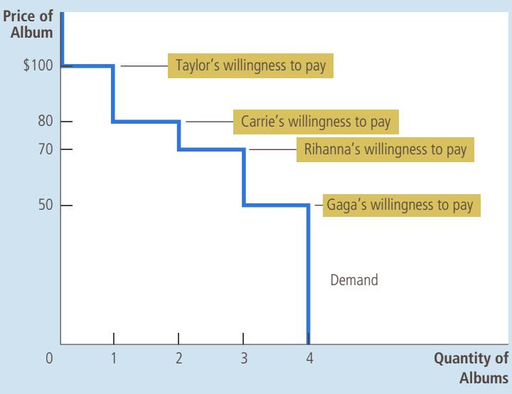

(the marginal buyer) is willing to pay for an album. At a quantity of 3 albums, the demand curve has a height of \$70, the price that Rihanna (who is now the marginal buyer) is willing to pay.

Because the demand curve reflects buyers’ willingness to pay, we can also use it to measure consumer surplus. Figure 2 uses the demand curve to compute consumer surplus in our two examples. In panel (a), the price is \$80 (or slightly above) and the quantity demanded is 1. Note that the area above the price and below the demand curve equals \$20. This amount is exactly the consumer surplus we computed earlier when only 1 album is sold.

Panel (b) of Figure 2 shows consumer surplus when the price is \$70 (or slightly above). In this case, the area above the price and below the demand curve equals the total area of the two rectangles: Taylor’s consumer surplus at this price is \$30 and Carrie’s is \$10. This area equals a total of \$40. Once again, this amount is the consumer surplus we computed earlier.

The lesson from this example holds for all demand curves: The area below the demand curve and above the price measures the consumer surplus in a market. This is true because the height of the demand curve represents the value buyers place on the good, as measured by their willingness to pay for it. The difference between this willingness to pay and the market price is each buyer’s consumer surplus. Thus, the total area below the demand curve and above the price is the sum of the consumer surplus of all buyers in the market for a good or service.

## 7-1c How a Lower Price Raises Consumer Surplus

Because buyers always want to pay less for the goods they buy, a lower price makes buyers of a good better off. But how much does buyers’ well-being rise in response to a lower price? We can use the concept of consumer surplus to answer this question precisely.

In panel (a), the price of the good is \$80 and the consumer surplus is \$20. In panel (b), the price of the good is \$70 and the consumer surplus is \$40.

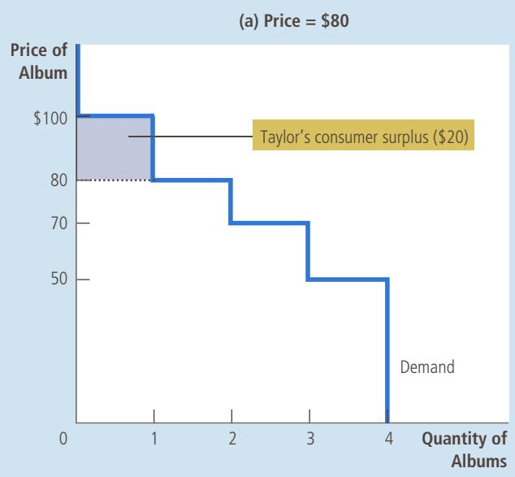  
FIGURE 2  
Measuring Consumer Surplus with the Demand Curve

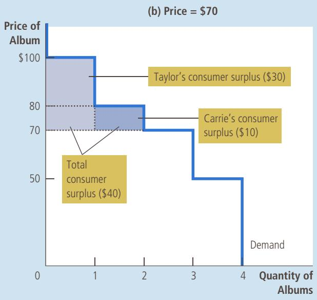

Figure 3 shows a typical demand curve. You may notice that this curve gradually slopes downward instead of taking discrete steps as in the previous two figures. In a market with many buyers, the resulting steps from each buyer dropping out are so small that they form a smooth curve. Although this curve has a different shape, the ideas we have just developed still apply: Consumer surplus is the area above the price and below the demand curve. In panel (a), consumer surplus at a price of $P _ { \uparrow }$ is the area of triangle ABC.

Now suppose that the price falls from $P _ { 1 }$ to $P _ { 2 ^ { \prime } }$ as shown in panel (b). The consumer surplus now equals area ADF. The increase in consumer surplus attributable to the lower price is the area BCFD.

This increase in consumer surplus is composed of two parts. First, those buyers who were already buying $Q _ { 1 }$ of the good at the higher price $P _ { 1 }$ are better off because now they pay less. The increase in consumer surplus of existing buyers is the reduction in the amount they pay; it equals the area of the rectangle BCED. Second, some new buyers enter the market because they are willing to buy the good at the lower price. As a result, the quantity demanded in the market increases from $Q _ { 1 }$ to $Q _ { 2 } .$ . The consumer surplus these newcomers receive is the area of the triangle CEF.

## 7-1d What Does Consumer Surplus Measure?

Our goal in developing the concept of consumer surplus is to make judgments about the desirability of market outcomes. Now that you have seen what consumer surplus is, let’s consider whether it is a good measure of economic well-being.

Imagine that you are a policymaker trying to design a good economic system. Would you care about the amount of consumer surplus? Consumer

## FIGURE 3

How Price Affects Consumer Surplus

In panel (a), the price is $P _ { 1 } ,$ the quantity demanded is $Q _ { \uparrow }$ , and consumer surplus equals the area of the triangle ABC. When the price falls from $P _ { 1 }$ to $P _ { 2 } ,$ as in panel (b), the quantity demanded rises from $Q _ { 1 }$ to $Q _ { 2 }$ and the consumer surplus rises to the area of the triangle ADF. The increase in consumer surplus (area BCFD) occurs in part because existing consumers now pay less (area BCED) and in part because new consumers enter the market at the lower price (area CEF).

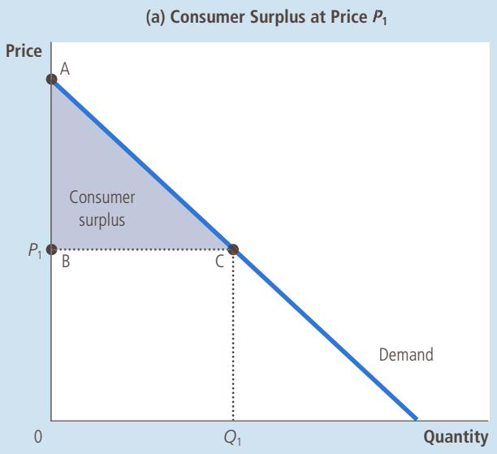

(b) Consumer Surplus at Price ${ \pmb P } _ { 2 }$  
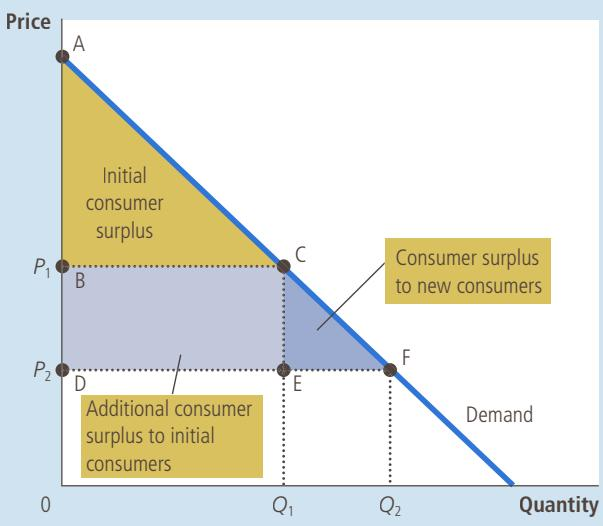

surplus, the amount that buyers are willing to pay for a good minus the amount they actually pay for it, measures the benefit that buyers receive from a good as the buyers themselves perceive it. Thus, consumer surplus is a good measure of economic well-being if policymakers want to satisfy the preferences of buyers.

In some circumstances, policymakers might choose to disregard consumer surplus because they do not respect the preferences that drive buyer behavior. For example, drug addicts are willing to pay a high price for heroin. Yet we would not say that addicts get a large benefit from being able to buy heroin at a low price (even though addicts might say they do). From the standpoint of society, willingness to pay in this instance is not a good measure of the buyers’ benefit, and consumer surplus is not a good measure of economic well-being, because addicts are not looking after their own best interests.

In most markets, however, consumer surplus does reflect economic wellbeing. Economists normally assume that buyers are rational when they make decisions. Rational people do the best they can to achieve their objectives, given their opportunities. Economists also normally assume that people’s preferences should be respected. In this case, consumers are the best judges of how much benefit they receive from the goods they buy.

Draw a demand curve for turkey. In your diagram, show a price of turkey and the consumer surplus at that price. Explain in words what this coneasures.

## 7-2 Producer Surplus

We now turn to the other side of the market and consider the benefits sellers receive from participating in a market. As you will see, our analysis of sellers welfare is similar to our analysis of buyers’ welfare.

## 7-2a Cost and the Willingness to Sell

Imagine now that you are a homeowner and want to get your house painted. You turn to four sellers of painting services: Vincent, Claude, Pablo, and Andy. Each painter is willing to do the work for you if the price is right. You decide to take bids from the four painters and auction off the job to the painter who will do the work for the lowest price.

Each painter is willing to take the job if the price he would receive exceeds his cost of doing the work. Here the term cost should be interpreted as the painters’ opportunity cost: It includes the painters’ out-of-pocket expenses (for paint, brushes, and so on) as well as the value that the painters place on their own time. Table 2 shows each painter’s cost. Because a painter’s cost is the lowest price he would accept for his work, cost is a measure of his willingness to sell his services. Each painter would be eager to sell his services at a price greater than his cost and would refuse to sell his services at a price less than his cost. At a price exactly equal to his cost, he would be indifferent about selling his services: He would be equally happy getting the job or using his time and energy for another purpose.

When you take bids from the painters, the price might start high, but it quickly falls as the painters compete for the job. Once Andy has bid \$600 (or slightly less), he is the sole remaining bidder. Andy is happy to do the job for this price because his cost is only \$500. Vincent, Claude, and Pablo are unwilling to do the job for less than \$600. Note that the job goes to the painter who can do the work at the lowest cost.

What benefit does Andy receive from getting the job? Because he is willing to do the work for \$500 but gets \$600 for doing it, we say that he receives producer surplus of \$100. Producer surplus is the amount a seller is paid minus the cost of production. Producer surplus measures the benefit sellers receive from participating in a market.

Now consider a somewhat different example. Suppose that you have two houses that need painting. Again, you auction off the jobs to the four painters. To keep things simple, let’s assume that no painter is able to paint both houses and that you will pay the same amount to paint each house. Therefore, the price falls until two painters are left.

In this case, the bidding stops when Andy and Pablo each offer to do the job for a price of \$800 (or slightly less). Andy and Pablo are willing to do the work at this price, while Vincent and Claude are not willing to bid a lower price. At a price of

<table><tr><td>Seller</td><td>Cost</td></tr><tr><td>Vincent</td><td>$900</td></tr><tr><td>Claude</td><td>800</td></tr><tr><td>Pablo</td><td>600</td></tr><tr><td>Andy</td><td>500</td></tr></table>

cost the value of everything a seller must give up to produce a good

The table shows the supply schedule for the sellers (listed in Table 2) of painting services. The graph shows the corresponding supply curve. Note that the height of the supply curve reflects the sellers’ costs.

The Supply Schedule and the Supply Curve

<table><tr><td>Price</td><td>Sellers</td><td>Quantity Demanded</td></tr><tr><td>$900 or more</td><td>Vincent, Claude, Pablo, Andy</td><td>4</td></tr><tr><td>$800 to $900</td><td>Claude, Pablo, Andy</td><td>3</td></tr><tr><td>$600 to $800</td><td>Pablo, Andy</td><td>2</td></tr><tr><td>$500 to $600</td><td>Andy</td><td>1</td></tr><tr><td>Less than $500</td><td>None</td><td>0</td></tr></table>

\$800, Andy receives producer surplus of \$300 and Pablo receives producer surplus of \$200. The total producer surplus in the market is \$500.

## 7-2b Using the Supply Curve to Measure Producer Surplus

Just as consumer surplus is closely related to the demand curve, producer surplus is closely related to the supply curve. To see how, let’s continue with our example.

We begin by using the costs of the four painters to find the supply schedule for painting services. The table in Figure 4 shows the supply schedule that corresponds to the costs in Table 2. If the price is below \$500, none of the four painters is willing to do the job, so the quantity supplied is zero. If the price is between \$500 and \$600, only Andy is willing to do the job, so the quantity supplied is 1. If the price is between \$600 and \$800, Andy and Pablo are willing to do the job, so the quantity supplied is 2, and so on. Thus, the supply schedule is derived from the costs of the four painters.

The graph in Figure 4 shows the supply curve that corresponds to this supply schedule. Note that the height of the supply curve is related to the sellers’ costs. At any quantity, the price given by the supply curve shows the cost of the marginal seller, the seller who would leave the market first if the price were any lower. At a quantity of 4 houses, for instance, the supply curve has a height of \$900, the cost that Vincent (the marginal seller) incurs to provide his painting services. At a quantity of 3 houses, the supply curve has a height of \$800, the cost that Claude (who is now the marginal seller) incurs.

Because the supply curve reflects sellers’ costs, we can use it to measure producer surplus. Figure 5 uses the supply curve to compute producer surplus in our two examples. In panel (a), we assume that the price is \$600 (or slightly less). In this case, the quantity supplied is 1. Note that the area below the price and above

In panel (a), the price of the good is \$600 and the producer surplus is \$100. In panel (b), the price of the good is \$800 and the producer surplus is \$500.

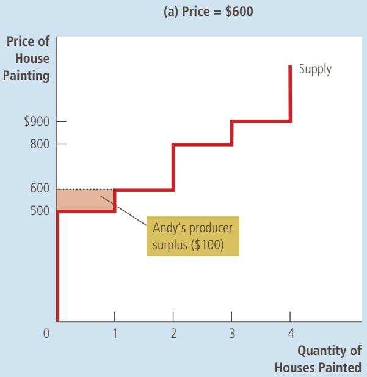  
Measuring Producer Surplus with the Supply Curve

## FIGURE 5

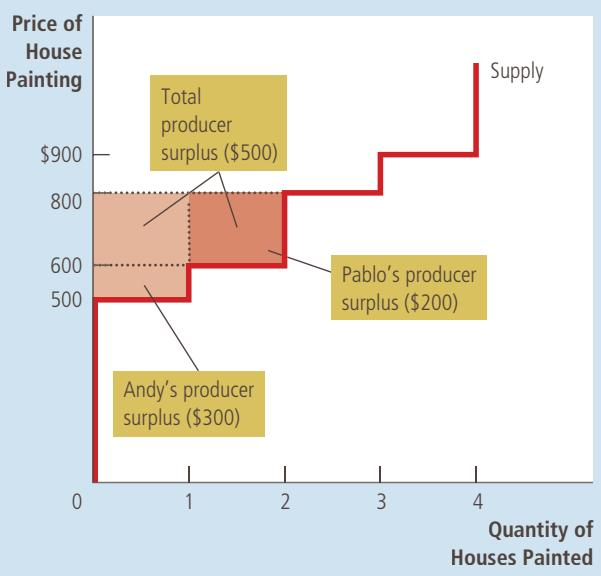

the supply curve equals \$100. This amount is exactly the producer surplus we computed earlier for Andy.

Panel (b) of Figure 5 shows producer surplus at a price of \$800 (or slightly less). In this case, the area below the price and above the supply curve equals the total area of the two rectangles. This area equals \$500, the producer surplus we computed earlier for Pablo and Andy when two houses needed painting.

The lesson from this example applies to all supply curves: The area below the price and above the supply curve measures the producer surplus in a market. The logic is straightforward: The height of the supply curve measures sellers’ costs, and the difference between the price and the cost of production is each seller’s producer surplus. Thus, the total area is the sum of the producer surplus of all sellers.

## 7-2c How a Higher Price Raises Producer Surplus

You will not be surprised to hear that sellers always want to receive a higher price for the goods they sell. But how much does sellers’ well-being rise in response to a higher price? The concept of producer surplus offers a precise answer to this question.

Figure 6 shows a typical upward-sloping supply curve that would arise in a market with many sellers. Although this supply curve differs in shape from the previous figure, we measure producer surplus in the same way: Producer surplus is the area below the price and above the supply curve. In panel (a), the price is $P _ { 1 }$ and producer surplus is the area of triangle ABC.

## FIGURE 6

How Price Affects Producer Surplus

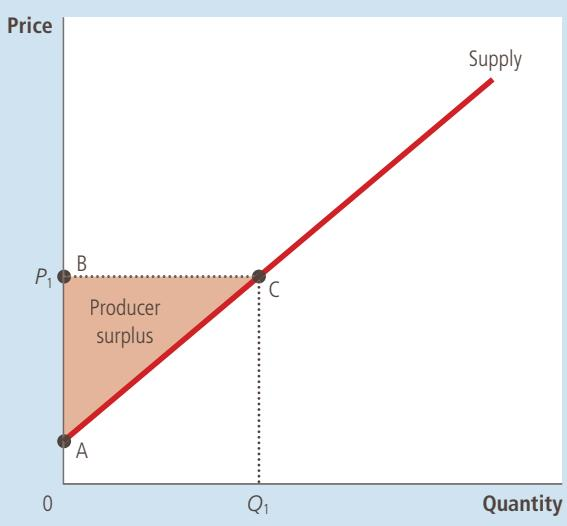

In panel (a), the price is $P _ { \uparrow }$ , the quantity supplied is $Q _ { 1 } ,$ , and producer surplus equals the area of the triangle ABC. When the price rises from $P _ { 1 }$ to $P _ { 2 } ,$ as in panel (b), the quantity supplied rises from $Q _ { 1 }$ to $Q _ { 2 }$ and the producer surplus rises to the area of the triangle ADF. The increase in producer surplus (area BCFD) occurs in part because existing producers now receive more (area BCED) and in part because new producers enter the market at the higher price (area CEF).

(a) Producer Surplus at Price $\pmb { P } _ { 1 }$  
(b) Producer Surplus at Price $P _ { 2 }$  
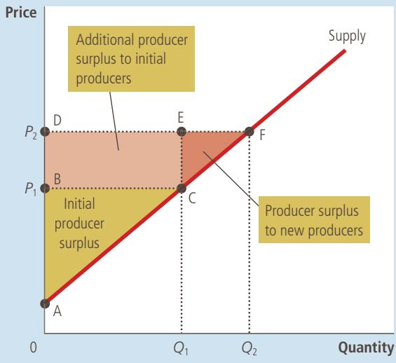

Panel (b) shows what happens when the price rises from $P _ { 1 }$ to $P _ { 2 } .$ . Producer surplus now equals area ADF. This increase in producer surplus has two parts. First, those sellers who were already selling $Q _ { 1 }$ of the good at the lower price $P _ { 1 }$ are better off because they now get more for what they sell. The increase in producer surplus for existing sellers equals the area of the rectangle BCED. Second, some new sellers enter the market because they are willing to produce the good at the higher price, resulting in an increase in the quantity supplied from $Q _ { 1 }$ to $Q _ { 2 } .$ . The producer surplus of these newcomers is the area of the triangle CEF.

As this analysis shows, we use producer surplus to measure the well-being of sellers in much the same way as we use consumer surplus to measure the wellbeing of buyers. Because these two measures of economic welfare are so similar, it is natural to use them together. Indeed, that is exactly what we do in the next section.

QuickQuiz Draw a supply curve for turkey. In your diagram, show a price of turkey and the producer surplus at that price. Explain in words what this producer surplus measures.

## 7-3 Market Efficiency

Consumer surplus and producer surplus are the basic tools that economists use to study the welfare of buyers and sellers in a market. These tools can help us address a fundamental economic question: Is the allocation of resources determined by free markets desirable?

## 7-3a The Benevolent Social Planner

To evaluate market outcomes, we introduce into our analysis a new, hypothetical character called the benevolent social planner. The benevolent social planner is an all-knowing, all-powerful, well-intentioned dictator. The planner wants to maximize the economic well-being of everyone in society. What should this planner do? Should she just leave buyers and sellers at the equilibrium that they reach naturally on their own? Or can she increase economic well-being by altering the market outcome in some way?

To answer this question, the planner must first decide how to measure the economic well-being of a society. One possible measure is the sum of consumer and producer surplus, which we call total surplus. Consumer surplus is the benefit that buyers receive from participating in a market, and producer surplus is the benefit that sellers receive. It is therefore natural to use total surplus as a measure of society’s economic well-being.

To better understand this measure of economic well-being, recall how we measure consumer and producer surplus. We define consumer surplus as

$$
\text {Consumer surplus} = \text {Value to buyers} - \text {Amount paid by buyers}.
$$

Similarly, we define producer surplus as

$$
\text {Producer surplus} = \text {Amount received by sellers} - \text {Cost to sellers}.
$$

When we add consumer and producer surplus together, we obtain

$$
\begin{array}{r l} \text {Total surplus} & = (\text {Value to buyers - Amount paid by buyers}) \\ & + (\text {Amount received by sellers - Cost to sellers}). \end{array}
$$

The amount paid by buyers equals the amount received by sellers, so the middle two terms in this expression cancel each other. As a result, we can write total surplus as

$$
\text {Total surplus} = \text {Value to buyers} - \text {Cost to sellers.}
$$

Total surplus in a market is the total value to buyers of the goods, as measured by their willingness to pay, minus the total cost to sellers of providing those goods.

If an allocation of resources maximizes total surplus, we say that the allocation exhibits efficiency. If an allocation is not efficient, then some of the potential gains from trade among buyers and sellers are not being realized. For example, an allocation is inefficient if a good is not being produced by the sellers with lowest cost. In this case, moving production from a high-cost producer to a low-cost producer will lower the total cost to sellers and raise total surplus. Similarly, an allocation is inefficient if a good is not being consumed by the buyers who value it most highly. In this case, moving consumption of the good from a buyer with a low valuation to a buyer with a high valuation will raise total surplus.

In addition to efficiency, the social planner might also care about equality— that is, whether the various buyers and sellers in the market have a similar level of economic well-being. In essence, the gains from trade in a market are like a pie to be shared among the market participants. The question of efficiency concerns whether the pie is as big as possible. The question of equality concerns how

efficiency

the property of a resource allocation of maximizing the total surplus received by all members of society

## FIGURE 7

Consumer and Producer Surplus in the Market Equilibrium Total surplus—the sum of consumer and producer surplus—is the area between the supply and demand curves up to the equilibrium quantity.

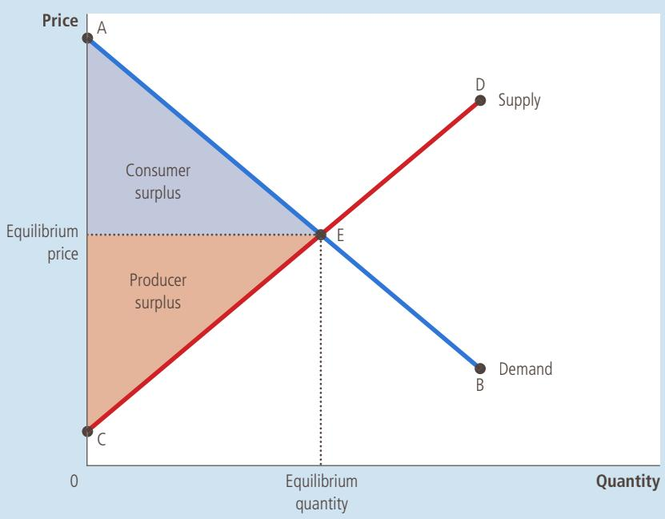

the pie is sliced and how the portions are distributed among members of society. In this chapter, we concentrate on efficiency as the social planner’s goal. Keep in mind, however, that real policymakers often care about equality as well.

## 7-3b Evaluating the Market Equilibrium

Figure 7 shows consumer and producer surplus when a market reaches the equilibrium of supply and demand. Recall that consumer surplus equals the area above the price and under the demand curve and producer surplus equals the area below the price and above the supply curve. Thus, the total area between the supply and demand curves up to the point of equilibrium represents the total surplus in this market.

Is this equilibrium allocation of resources efficient? That is, does it maximize total surplus? To answer this question, recall that when a market is in equilibrium, the price determines which buyers and sellers participate in the market. Those buyers who value the good more than the price (represented by the segment AE on the demand curve) choose to buy the good; buyers who value it less than the price (represented by the segment EB) do not. Similarly, those sellers whose costs are less than the price (represented by the segment CE on the supply curve) choose to produce and sell the good; sellers whose costs are greater than the price (represented by the segment ED) do not.

These observations lead to two insights about market outcomes:

1. Free markets allocate the supply of goods to the buyers who value them most highly, as measured by their willingness to pay.

2. Free markets allocate the demand for goods to the sellers who can produce them at the lowest cost.

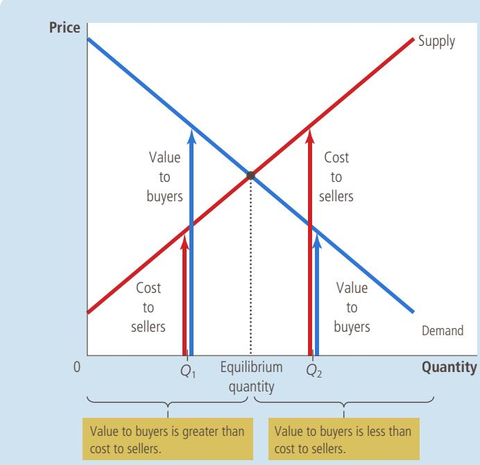

## FIGURE 8

## The Efficiency of the Equilibrium Quantity

At quantities less than the equilibrium quantity, such as $Q _ { 1 }$ the value to buyers exceeds the cost to sellers. At quantities greater than the equilibrium quantity, such as $Q _ { 2 } ,$ the cost to sellers exceeds the value to buyers. Therefore, the market equilibrium maximizes the sum of producer and consumer surplus.

Thus, given the quantity produced and sold in a market equilibrium, the social planner cannot increase economic well-being by changing the allocation of consumption among buyers or the allocation of production among sellers.

But can the social planner raise total economic well-being by increasing or decreasing the quantity of the good? The answer is no, as stated in this third insight about market outcomes:

## 3. Free markets produce the quantity of goods that maximizes the sum of consumer and producer surplus.

Figure 8 illustrates why this is true. To interpret this figure, keep in mind that the demand curve reflects the value to buyers and the supply curve reflects the cost to sellers. At any quantity below the equilibrium level, such as $Q _ { 1 } ,$ the value to the marginal buyer exceeds the cost to the marginal seller. As a result, increasing the quantity produced and consumed raises total surplus. This continues to be true until the quantity reaches the equilibrium level. Similarly, at any quantity beyond the equilibrium level, such as $Q _ { 2 ^ { \prime } }$ the value to the marginal buyer is less than the cost to the marginal seller. In this case, decreasing the quantity raises total surplus, and this continues to be true until quantity falls to the equilibrium level. To maximize total surplus, the social planner would choose the quantity where the supply and demand curves intersect.

Together, these three insights tell us that the market outcome makes the sum of consumer and producer surplus as large as it can be. In other words, the equilibrium outcome is an efficient allocation of resources. The benevolent social planner can, therefore, leave the market outcome just as she finds it. This policy of leaving well enough alone goes by the French expression laissez faire, which literally translates to “leave to do” but is more broadly interpreted as “let people do as they will.”

## IN THE NEWS
