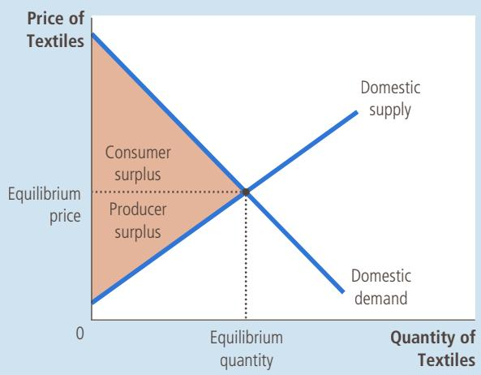
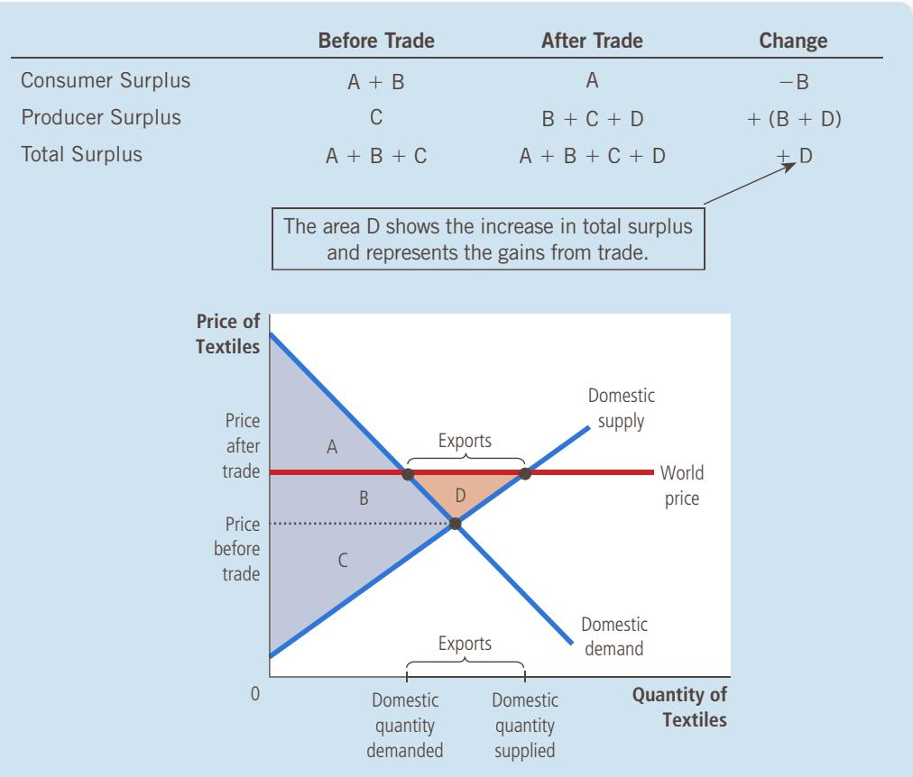
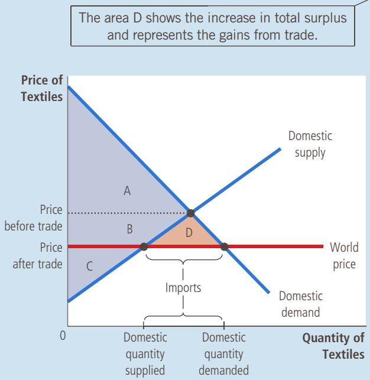
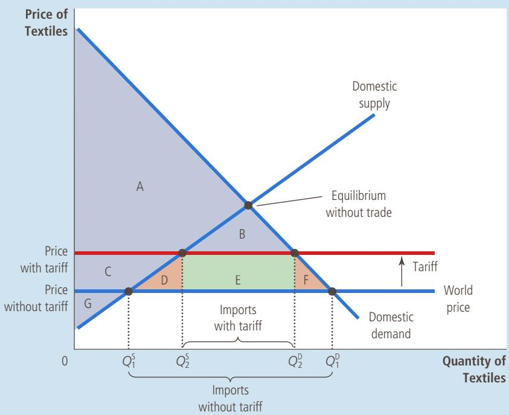

# Application: International Trade

f you check the labels on the clothes you are wearing, you will probably find that some were made in another country. A century ago, the textile and clothing industry was a major part of the U.S. economy, but that is no longer the case. Faced with foreign competitors that can produce quality goods at low cost, many U.S. firms found it increasingly difficult to produce and sell textiles and clothing at a profit. As a result, they laid off their workers and shut down their factories. Today, most of the textiles and clothing that Americans consume are imported.

The story of the textile industry raises important questions for economic policy: How does international trade affect economic well-being? Who gains and who loses from free trade among countries, and how do the gains compare to the losses?

Chapter 3 introduced the study of international trade by applying the principle of comparative advantage. According to this principle, all countries can benefit from trading with one another because trade allows each country to specialize in doing what it does best. But the analysis in Chapter 3 was incomplete. It did not explain how the international marketplace achieves these gains from trade or how the gains are distributed among the various economic participants.

We now return to the study of international trade to tackle these questions. Over the past several chapters, we have developed many tools for analyzing how markets work: supply, demand, equilibrium, consumer surplus, producer surplus, and so on. With these tools, we can learn more about how international trade affects economic well-being.

## 9-1 The Determinants of Trade

Consider the market for textiles. The textile market is well suited to studying the gains and losses from international trade: Textiles are made in many countries around the world, and there is much world trade in textiles. Moreover, the textile market is one in which policymakers often consider (and sometimes implement) trade restrictions to protect domestic producers from foreign competitors. Here we examine the textile market in the imaginary country of Isoland.

## 9-1a The Equilibrium without Trade

As our story begins, the Isolandian textile market is isolated from the rest of the world. By government decree, no one in Isoland is allowed to import or export textiles, and the penalty for violating the decree is so large that no one dares try.

Because there is no international trade, the market for textiles in Isoland consists solely of Isolandian buyers and sellers. As Figure 1 shows, the domestic price adjusts to balance the quantity supplied by domestic sellers and the quantity demanded by domestic buyers. The figure shows the consumer and producer surplus in the equilibrium without trade. The sum of consumer and producer surplus measures the total benefits that buyers and sellers receive from participating in the textile market.

## FIGURE 1

## The Equilibrium without International Trade

When an economy cannot trade in world markets, the price adjusts to balance domestic supply and demand. This figure shows consumer and producer surplus in an equilibrium without international trade for the textile market in the imaginary country of Isoland.

Now suppose that, in a political upset, Isoland elects a new president. The president campaigned on a platform of “change” and promised the voters bold new ideas. Her first act is to assemble a team of economists to evaluate Isolandian trade policy. She asks them to report on three questions:

• If the government allows Isolandians to import and export textiles, what will happen to the price of textiles and the quantity of textiles sold in the domestic textile market?

• Who will gain from free trade in textiles and who will lose, and will the gains exceed the losses?

• Should a tariff (a tax on textile imports) be part of the new trade policy?

After reviewing supply and demand in their favorite textbook (this one, of course), the Isolandian economics team begins its analysis.

## 9-1b The World Price and Comparative Advantage

The first issue our economists take up is whether Isoland is likely to become a textile importer or a textile exporter. In other words, if free trade is allowed, will Isolandians end up buying or selling textiles in world markets?

To answer this question, the economists compare the current Isolandian price of textiles to the price of textiles in other countries. We call the price prevailing in world markets the world price. If the world price of textiles is higher than the domestic price, then Isoland will export textiles once trade is permitted. Isolandian textile producers will be eager to receive the higher prices available abroad and will start selling their textiles to buyers in other countries. Conversely, if the world price of textiles is lower than the domestic price, then Isoland will import textiles. Because foreign sellers offer a better price, Isolandian textile consumers will quickly start buying textiles from other countries.

In essence, comparing the world price with the domestic price before trade reveals whether Isoland has a comparative advantage in producing textiles. The domestic price reflects the opportunity cost of textiles: It tells us how much an Isolandian must give up to obtain one unit of textiles. If the domestic price is low, the cost of producing textiles in Isoland is low, suggesting that Isoland has a comparative advantage in producing textiles relative to the rest of the world. If the domestic price is high, then the cost of producing textiles in Isoland is high, suggesting that foreign countries have a comparative advantage in producing textiles.

As we saw in Chapter 3, trade among nations is ultimately based on comparative advantage. That is, trade is beneficial because it allows each nation to specialize in doing what it does best. By comparing the world price with the domestic price before trade, we can determine whether Isoland is better or worse than the rest of the world at producing textiles.

The country Autarka does not allow international trade. In Autarka, you QuickQuiz can buy a wool suit for 3 ounces of gold. Meanwhile, in neighboring countries, you can buy the same suit for 2 ounces of gold. If Autarka were to allow free trade, would it import or export wool suits? Why?

## 9-2 The Winners and Losers from Trade

To analyze the welfare effects of free trade, the Isolandian economists begin with the assumption that Isoland is a small economy compared to the rest of the world. This small-economy assumption means that Isoland’s actions have little effect on world markets. Specifically, any change in Isoland’s trade policy will not affect the world price of textiles. The Isolandians are said to be price takers in the world economy. That is, they take the world price of textiles as given. Isoland can be an exporting country by selling textiles at this price or an importing country by buying textiles at this price.

The small-economy assumption is not necessary to analyze the gains and losses from international trade. But the Isolandian economists know from experience (and from reading Chapter 2 of this book) that making simplifying assumptions is a key part of building a useful economic model. The assumption that Isoland is a small economy simplifies the analysis, and the basic lessons do not change in the more complicated case of a large economy.

## 9-2a The Gains and Losses of an Exporting Country

Figure 2 shows the Isolandian textile market when the domestic equilibrium price before trade is below the world price. Once trade is allowed, the domestic price rises to equal the world price. No seller of textiles would accept less than the world price, and no buyer would pay more than the world price.

## FIGURE 2

International Trade in an Exporting Country Once trade is allowed, the domestic price rises to equal the world price. The supply curve shows the quantity of textiles produced domestically, and the demand curve shows the quantity consumed domestically. Exports from Isoland equal the difference between the domestic quantity supplied and the domestic quantity demanded at the world price. Sellers are better off (producer surplus rises from C to $\mathsf { B } + \mathsf { C } + \mathsf { D } )$ and buyers are worse off (consumer surplus falls from A 1 B to A). Total surplus rises by an amount equal to area D, indicating that trade raises the economic well-being of the country as a whole.

After the domestic price has risen to equal the world price, the domestic quantity supplied differs from the domestic quantity demanded. The supply curve shows the quantity of textiles supplied by Isolandian sellers. The demand curve shows the quantity of textiles demanded by Isolandian buyers. Because the domestic quantity supplied is greater than the domestic quantity demanded, Isoland sells textiles to other countries. Thus, Isoland becomes a textile exporter.

Although domestic quantity supplied and domestic quantity demanded differ, the textile market is still in equilibrium because there is now another participant in the market: the rest of the world. One can view the horizontal line at the world price as representing the rest of the world’s demand for textiles. This demand curve is perfectly elastic because Isoland, as a small economy, can sell as many textiles as it wants at the world price.

Consider the gains and losses from opening up trade. Clearly, not everyone benefits. Trade forces the domestic price to rise to the world price. Domestic producers of textiles are better off because they can now sell textiles at a higher price, but domestic consumers of textiles are worse off because they now have to buy textiles at a higher price.

To measure these gains and losses, we look at the changes in consumer and producer surplus. Before trade is allowed, the price of textiles adjusts to balance domestic supply and domestic demand. Consumer surplus, the area between the demand curve and the before-trade price, is area A 1 B. Producer surplus, the area between the supply curve and the before-trade price, is area C. Total surplus before trade, the sum of consumer and producer surplus, is area A 1 B 1 C.

After trade is allowed, the domestic price rises to the world price. Consumer surplus shrinks to area A (the area between the demand curve and the world price). Producer surplus increases to area B 1 C 1 D (the area between the supply curve and the world price). Thus, total surplus with trade is area $\mathrm { ~ A ~ } + \mathrm { ~ B ~ } + \bar { \mathrm { ~ C ~ } } + \mathrm { ~ D ~ }$

These welfare calculations show who wins and who loses from trade in an exporting country. Sellers benefit because producer surplus increases by the area B 1 D. Buyers are worse off because consumer surplus decreases by the area B. Because the gains of sellers exceed the losses of buyers by the area D, total surplus in Isoland increases.

This analysis of an exporting country yields two conclusions:

• When a country allows trade and becomes an exporter of a good, domestic producers of the good are better off, and domestic consumers of the good are worse off.

• Trade raises the economic well-being of a nation in the sense that the gains of the winners exceed the losses of the losers.

## 9-2b The Gains and Losses of an Importing Country

Now suppose that the domestic price before trade is above the world price. Once again, after trade is allowed, the domestic price must equal the world price. As Figure 3 shows, the domestic quantity supplied is less than the domestic quantity demanded. The difference between the domestic quantity demanded and the domestic quantity supplied is bought from other countries, and Isoland becomes a textile importer.

In this case, the horizontal line at the world price represents the supply of the rest of the world. This supply curve is perfectly elastic because Isoland is a small economy and, therefore, can buy as many textiles as it wants at the world price.

## FIGURE 3

## International Trade in an Importing Country

Once trade is allowed, the domestic price falls to equal the world price. The supply curve shows the amount produced domestically, and the demand curve shows the amount consumed domestically. Imports equal the difference between the domestic quantity demanded and the domestic quantity supplied at the world price. Buyers are better off (consumer surplus rises from A to $\mathsf { A } + \mathsf { B } + \mathsf { D } )$ , and sellers are worse off (producer surplus falls from $\textsf { B } + \textsf { C }$ to C). Total surplus rises by an amount equal to area D, indicating that trade raises the economic well-being of the country as a whole.

<table><tr><td></td><td>Before Trade</td><td>After Trade</td><td>Change</td></tr><tr><td>Consumer Surplus</td><td>A</td><td>A + B + D</td><td>+(B + D)</td></tr><tr><td>Producer Surplus</td><td>B + C</td><td>C</td><td>-B</td></tr><tr><td>Total Surplus</td><td>A + B + C</td><td>A + B + C + D</td><td>+ D</td></tr></table>

Once again, consider the gains and losses from trade. As in the previous case, not everyone benefits, but here the winners and losers are reversed. When trade forces the domestic price to fall, domestic consumers are better off (they can now buy textiles at a lower price), and domestic producers are worse off (they now have to sell textiles at a lower price). Changes in consumer and producer surplus measure the size of the gains and losses. Before trade, consumer surplus is area A, producer surplus is area ${ \mathrm {  ~ B ~ } } + { \mathrm {  ~ C ~ } } ,$ and total surplus is area $\mathrm { A } + \mathrm { B } + \mathrm { C } .$ . After trade is allowed, consumer surplus is area $\mathrm { A } + \mathrm { B } + \mathrm { D }$ , producer surplus is area C, and total surplus is area $\mathrm { A } + \mathrm { B } \hat { + } \mathrm { C } + \mathrm { D }$

These welfare calculations show who wins and who loses from trade in an importing country. Buyers benefit because consumer surplus increases by the area B 1 D. Sellers are worse off because producer surplus falls by the area B. The gains of buyers exceed the losses of sellers, and total surplus increases by the area D.

This analysis of an importing country yields two conclusions parallel to those for an exporting country:

• When a country allows trade and becomes an importer of a good, domestic consumers of the good are better off, and domestic producers of the good are worse off.

• Trade raises the economic well-being of a nation in the sense that the gains of the winners exceed the losses of the losers.

Having completed our analysis of trade, we can better understand one of the Ten Principles of Economics in Chapter 1: Trade can make everyone better off. If Isoland opens its textile market to international trade, the change creates winners and losers, regardless of whether Isoland ends up exporting or importing textiles. In either case, however, the gains of the winners exceed the losses of the losers, so the winners could compensate the losers and still be better off. In this sense, trade can make everyone better off. But will trade make everyone better off? Probably not. In practice, compensation for the losers from international trade is rare. Without such compensation, opening an economy to international trade is a policy that expands the size of the economic pie, but it can leave some participants in the economy with a smaller slice.

We can now see why the debate over trade policy is often contentious. Whenever a policy creates winners and losers, the stage is set for a political battle. Nations sometimes fail to enjoy the gains from trade because the losers from free trade are better organized than the winners. The losers may turn their cohesiveness into political clout and lobby for trade restrictions such as tariffs or import quotas.

## 9-2c Effects of a Tariff

The Isolandian economists next consider the effects of a tariff—a tax on imported goods. The economists quickly realize that a tariff on textiles will have no effect if Isoland becomes a textile exporter. If no one in Isoland is interested in importing textiles, a tax on textile imports is irrelevant. The tariff matters only if Isoland becomes a textile importer. Concentrating their attention on this case, the economists compare welfare with and without the tariff.

Figure 4 shows the Isolandian market for textiles. Under free trade, the domestic price equals the world price. A tariff raises the price of imported textiles above the world price by the amount of the tariff. Domestic suppliers of textiles, who compete with suppliers of imported textiles, can now sell their textiles for the world price plus the amount of the tariff. Thus, the price of textiles—both imported and domestic—rises by the amount of the tariff and is, therefore, closer to the price that would prevail without trade.

The change in price affects the behavior of domestic buyers and sellers. Because the tariff raises the price of textiles, it reduces the domestic quantity demanded from $Q _ { 1 } ^ { \mathrm { D } }$ to $Q _ { 2 } ^ { \mathrm { D } }$ and raises the domestic quantity supplied from QS to QS. Thus, the tariff reduces the quantity of imports and moves the domestic market closer to its equilibrium without trade.

Now consider the gains and losses from the tariff. Because the tariff raises the domestic price, domestic sellers are better off, and domestic buyers are worse off. In addition, the government raises revenue. To measure these gains and losses, we look at the changes in consumer surplus, producer surplus, and government revenue. These changes are summarized in the table in Figure 4.

Before the tariff, the domestic price equals the world price. Consumer surplus, the area between the demand curve and the world price, is area $\mathrm { A } + \mathrm { B } + \mathrm { C } + \mathrm { D } ^ { - } + \mathrm { E } + \mathrm { F } .$ Producer surplus, the area between the supply curve and the world price, is area G. Government revenue equals zero. Total surplus, the sum of consumer surplus, producer surplus, and government revenue, is area $\mathrm { A } + \mathrm { B } + \mathrm { C } + \mathrm { D } + \mathrm { E } + \mathrm { F } + \mathbf { \bar { G } }$

Once the government imposes a tariff, the domestic price exceeds the world price by the amount of the tariff. Consumer surplus is now area A 1 B. Producer surplus is area C 1 G. Government revenue, which is the size of the tariff multiplied by the quantity of after-tariff imports, is the area E. Thus, total surplus with the tariff is area $\mathrm { A } + \mathrm { \bar { B } } + \mathrm { C } + \mathrm { E } + \mathrm { G }$

A tariff, a tax on imports, reduces the quantity of imports and moves a market closer to the equilibrium that would exist without trade. Total surplus falls by an amount equal to area D 1 F. These two triangles represent the deadweight loss from the tariff.

<table><tr><td></td><td>Before Tariff</td><td>After Tariff</td><td>Change</td></tr><tr><td>Consumer Surplus</td><td>A + B + C + D + E + F</td><td>A + B</td><td>-(C + D + E + F)</td></tr><tr><td>Producer Surplus</td><td>G</td><td>C + G</td><td>+ C</td></tr><tr><td>Government Revenue</td><td>None</td><td>E</td><td>+ E</td></tr><tr><td>Total Surplus</td><td>A + B + C + D + E + F + G</td><td>A + B + C + E + G</td><td>-(D + F)</td></tr></table>

The area D 1 F shows the fall in total surplus and represents the deadweight loss of the tariff.

To determine the total welfare effects of the tariff, we add the change in consumer surplus (which is negative), the change in producer surplus (positive), and the change in government revenue (positive). We find that total surplus in the market decreases by the area D 1 F. This fall in total surplus is called the deadweight loss of the tariff.

A tariff causes a deadweight loss because a tariff is a type of tax. Like most taxes, it distorts incentives and pushes the allocation of scarce resources away from the optimum. In this case, we can identify two effects. First, when the tariff raises the domestic price of textiles above the world price, it encourages domestic producers to increase production from $Q _ { 1 } ^ { S }$ to $Q _ { 2 } ^ { \mathsf { S } } .$ Even though the cost of making these incremental units exceeds the cost of buying them at the world price, the tariff makes it profitable for domestic producers to manufacture them nonetheless. Second, when the tariff raises the price that domestic textile consumers have

## FYI

## Import Quotas: Another Way to Restrict Trade

eyond tariffs, another way that nations sometimes restrict international trade is by putting limits on how much of a good can be imported. In this book, we will not analyze such a policy, other than to point out the conclusion: Import quotas are much like tariffs. Both tariffs and import quotas reduce the quantity of imports, raise the domestic price of the good, decrease the welfare of domestic consumers, increase the welfare of domestic producers, and cause deadweight losses.

to the government in license fees, and the import quota works exactly like a tariff. Consumer surplus, producer surplus, and government revenue are precisely the same under the two policies.

There is only one difference between these two types of trade restriction: A tariff raises revenue for the government, whereas an import quota creates surplus for those who obtain the licenses to import. The profit for the holder of an import license is the difference between the domestic price (at which she sells the imported good) and the world price (at which she buys it).

Tariffs and import quotas are even more similar if the government charges a fee for the import licenses. Suppose the government sets the license fee equal to the difference between the domestic price and the world price. In this case, the entire profit of license holders is paid

In practice, however, countries that restrict trade with import quotas rarely do so by selling the import licenses. For example, the U.S. government has at times pressured Japan to “voluntarily” limit the sale of Japanese cars in the United States. In this case, the Japanese government allocates the import licenses to Japanese firms, and the surplus from these licenses accrues to those firms. From the standpoint of U.S. welfare, this kind of import quota is worse than a U.S. tariff on imported cars. Both a tariff and an import quota raise prices, restrict trade, and cause deadweight losses, but at least the tariff produces revenue for the U.S. government rather than profit for foreign producers. ■

to pay, it encourages them to reduce their consumption of textiles from $Q _ { 1 } ^ { \mathrm { D } }$ to $Q _ { 2 } ^ { \mathrm { D } } .$ Even though domestic consumers value these incremental units at more than the world price, the tariff induces them to cut back their purchases. Area D represents the deadweight loss from the overproduction of textiles, and area F represents the deadweight loss from the underconsumption of textiles. The total deadweight loss of the tariff is the sum of these two triangles.

## 9-2d The Lessons for Trade Policy

The team of Isolandian economists can now write to the new president:

## Dear Madam President,

You asked us three questions about opening up trade. After much hard work, we have the answers.

Question: If the government allows Isolandians to import and export textiles, what will happen to the price of textiles and the quantity of textiles sold in the domestic textile market?

Answer: Once trade is allowed, the Isolandian price of textiles will be driven to equal the price prevailing around the world.

If the world price is now higher than the Isolandian price, our price will rise. The higher price will reduce the amount of textiles Isolandians consume and raise the amount of textiles that Isolandians produce. Isoland will, therefore, become a textile exporter. This occurs because, in this case, Isoland has a comparative advantage in producing textiles.

Conversely, if the world price is now lower than the Isolandian price, our price will fall. The lower price will raise the amount of textiles that Isolandians consume and lower the amount of textiles that Isolandians produce. Isoland will, therefore, become a textile importer. This occurs because, in this case, other countries have a comparative advantage in producing textiles.

Question: Who will gain from free trade in textiles and who will lose, and will the gains exceed the losses?

Answer: The answer depends on whether the price rises or falls when trade is allowed. If the price rises, producers of textiles gain, and consumers of textiles lose. If the price falls, consumers gain, and producers lose. In both cases, the gains are larger than the losses. Thus, free trade raises the total welfare of Isolandians.

Question: Should a tariff be part of the new trade policy?

Answer: A tariff has an impact only if Isoland becomes a textile importer. In this case, a tariff moves the economy closer to the no-trade equilibrium and, like most taxes, causes deadweight losses. A tariff improves the welfare of domestic producers and raises revenue for the government, but these gains are more than offset by the losses suffered by consumers. The best policy, from the standpoint of economic efficiency, would be to allow trade without a tariff.

We hope you find these answers helpful as you decide on your new policy.

Your faithful servants,

Isolandian economics team

## 9-2e Other Benefits of International Trade

The conclusions of the Isolandian economics team are based on the standard analysis of international trade. Their analysis uses the most fundamental tools in the economist’s toolbox: supply, demand, and producer and consumer surplus. It shows that there are winners and losers when a nation opens itself up to trade, but the gains of the winners exceed the losses of the losers.

The case for free trade can be made even stronger, however, because there are several other economic benefits of trade beyond those emphasized in the standard analysis. In a nutshell, here are some of these other benefits:

• Increased variety of goods. Goods produced in different countries are not exactly the same. German beer, for instance, is not the same as American beer. Free trade gives consumers in all countries greater variety to choose from.

• Lower costs through economies of scale. Some goods can be produced at low cost only if they are produced in large quantities—a phenomenon called economies of scale. A firm in a small country cannot take full advantage of economies of scale if it can sell only in a small domestic market. Free trade gives firms access to larger world markets and allows them to realize economies of scale more fully.

Increased competition. A company shielded from foreign competitors is more likely to have market power, which in turn gives it the ability to raise prices above competitive levels. This is a type of market failure. Opening up trade fosters competition and gives the invisible hand a better chance to work its magic.
