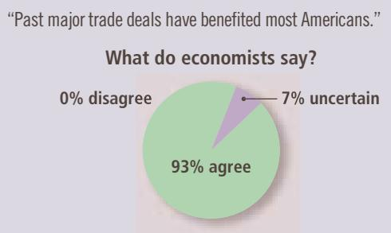
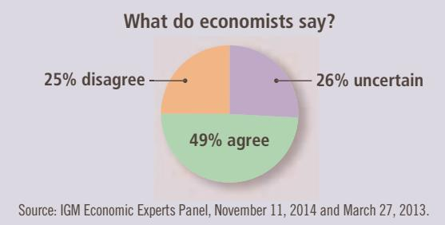

# ASK THE EXPERTS

  
“Refusing to liberalize trade unless partner countries adopt new labor or environmental rules is a bad policy, because even if the new standards would reduce distortions on some dimensions, such a policy involves threatening to maintain large distortions in the form of restricted trade.”

to found GATT after World War II in response to the high tariffs imposed during the Great Depression of the 1930s. Many economists believe that the high tariffs contributed to the worldwide economic hardship of that period. GATT has successfully reduced the average tariff among member countries from about 40 percent after World War II to about 5 percent today.

The rules established under GATT are now enforced by an international institution called the World Trade Organization (WTO). The WTO was established in 1995 and has its headquarters in Geneva, Switzerland. As of 2015, 162 countries have joined the organization, accounting for more than 97 percent of world trade. The functions of the WTO are to administer trade agreements, provide a forum for negotiations, and handle disputes among member countries.

What are the pros and cons of the multilateral approach to free trade? One advantage is that the multilateral approach has the potential to result in freer trade than a unilateral approach because it can reduce trade restrictions abroad as well as at home. If international negotiations fail, however, the result could be more restricted trade than under a unilateral approach.

In addition, the multilateral approach may have a political advantage. In most markets, producers are fewer and better organized than consumers—and thus wield greater political influence. Reducing the Isolandian tariff on textiles, for example, may be politically difficult if considered by itself. The textile companies would oppose free trade, and the buyers of textiles who would benefit are so numerous that organizing their support would be difficult. Yet suppose that Neighborland promises to reduce its tariff on wheat at the same time that Isoland reduces its tariff on textiles. In this case, the Isolandian wheat farmers, who are also politically powerful, would back the agreement. Thus, the multilateral approach to free trade can sometimes win political support when a unilateral approach cannot.

QuickQuiz The textile industry of Autarka advocates a ban on the import of wool suits. Describe five arguments its lobbyists might make. Give a response to each of these arguments.

## 9-4 Conclusion

Economists and the public often disagree about free trade. In 2015, NBC News and The Wall Street Journal asked the American public, “In general, do you think that free trade between the United States and foreign countries has helped the United States, has hurt the United States, or has not made much of a difference either way?” Only 29 percent of those polled said free international trade helped, whereas 34 percent thought it hurt. (The rest thought it made no difference or were unsure.) By contrast, economists overwhelmingly support free international trade. They view free trade as a way of allocating production efficiently and raising living standards both at home and abroad.

Economists view the United States as an ongoing experiment that confirms the virtues of free trade. Throughout its history, the United States has allowed unrestricted trade among the states, and the country as a whole has benefited from the specialization that trade allows. Florida grows oranges, Alaska pumps oil, California makes wine, and so on. Americans would not enjoy the high standard of living they do today if people could consume only those goods and services produced in their own states. The world could similarly benefit from free trade among countries.

To better understand economists’ view of trade, let’s continue our parable. Suppose that the president of Isoland, after reading the latest poll results, ignores the advice of her economics team and decides not to allow free trade in textiles. The country remains in the equilibrium without international trade.

Then, one day, some Isolandian inventor discovers a new way to make textiles at very low cost. The process is quite mysterious, however, and the inventor insists on keeping it a secret. What is odd is that the inventor doesn’t need traditional inputs such as cotton or wool. The only material input he needs is wheat. And even more oddly, to manufacture textiles from wheat, he hardly needs any labor input at all.

The inventor is hailed as a genius. Because everyone buys clothing, the lower cost of textiles allows all Isolandians to enjoy a higher standard of living. Workers who had previously produced textiles experience some hardship when their factories close, but they eventually find work in other industries. Some become farmers and grow the wheat that the inventor turns into textiles. Others enter new industries that emerge as a result of higher Isolandian living standards. Everyone understands that the displacement of workers in outmoded industries is an inevitable part of technological progress and economic growth.

After several years, a newspaper reporter decides to investigate this mysterious new textiles process. She sneaks into the inventor’s factory and learns that the inventor is a fraud. The inventor has not been making textiles at all. Instead, he has been smuggling wheat abroad in exchange for textiles from other countries. The only thing that the inventor had discovered was the gains from international trade.

When the truth is revealed, the government shuts down the inventor’s operation. The price of textiles rises, and workers return to jobs in textile factories. Living standards in Isoland fall back to their former levels. The inventor is jailed and held up to public ridicule. After all, he was no inventor. He was just an economist.

## CHAPTER QuickQuiz

1. If a nation that does not allow international trade in steel has a domestic price of steel lower than the world price, then

a. the nation has a comparative advantage in producing steel and would become a steel exporter if it opened up trade.

b. the nation has a comparative advantage in producing steel and would become a steel importer if it opened up trade.

c. the nation does not have a comparative advantage in producing steel and would become a steel exporter if it opened up trade.

d. the nation does not have a comparative advantage in producing steel and would become a steel importer if it opened up trade.

2. When the nation of Ectenia opens itself to world trade in coffee beans, the domestic price of coffee beans falls. Which of the following describes the situation?

a. Domestic production of coffee rises, and Ectenia becomes a coffee importer.

b. Domestic production of coffee rises, and Ectenia becomes a coffee exporter.

c. Domestic production of coffee falls, and Ectenia becomes a coffee importer.

d. Domestic production of coffee falls, and Ectenia becomes a coffee exporter.

3. When a nation opens itself to trade in a good and becomes an importer,

a. producer surplus decreases, but consumer surplus and total surplus both increase.

b. producer surplus decreases, consumer surplus increases, and so the impact on total surplus is ambiguous.

c. producer surplus and total surplus increase, but consumer surplus decreases.

d. producer surplus, consumer surplus, and total surplus all increase.

4. If a nation that imports a good imposes a tariff, it wil increase

a. the domestic quantity demanded.

b. the domestic quantity supplied.

c. the quantity imported from abroad.

d. all of the above.

5. Which of the following trade policies would benefit producers, hurt consumers, and increase the amount of trade?

a. the increase of a tariff in an importing country

b. the reduction of a tariff in an importing country

c. starting to allow trade when the world price is greater than the domestic price

d. starting to allow trade when the world price is less than the domestic price

6. The main difference between imposing a tariff and handing out licenses under an import quota is that a tariff increases

a. consumer surplus.

b. producer surplus.

c. international trade.

d. government revenue.

## SUMMARY

The effects of free trade can be determined by comparing the domestic price before trade with the world price. A low domestic price indicates that the country has a comparative advantage in producing the good and that the country will become an exporter. A high domestic price indicates that the rest of the world has a comparative advantage in producing the good and that the country will become an importer.

When a country allows trade and becomes an exporter of a good, producers of the good are better off, and consumers of the good are worse off. When a country allows trade and becomes an importer of a good, consumers are better off, and producers are worse off. In both cases, the gains from trade exceed the losses.

## KEY CONCEPTS

world price, p. 169

tariff, p. 173

## QUESTIONS FOR REVIEW

1. What does the domestic price that prevails without international trade tell us about a nation’s comparative advantage?

A tariff—a tax on imports—moves a market closer to the equilibrium that would exist without trade and, therefore, reduces the gains from trade. Although domestic producers are better off and the government raises revenue, the losses to consumers exceed these gains.

There are various arguments for restricting trade: protecting jobs, defending national security, helping infant industries, preventing unfair competition, and responding to foreign trade restrictions. Although some of these arguments have merit in some cases, most economists believe that free trade is usually the better policy.

2. When does a country become an exporter of a good? An importer?

3. Draw the supply-and-demand diagram for an importing country. Identify consumer surplus and producer surplus before trade is allowed. Identify consumer surplus and producer surplus with free trade. What is the change in total surplus?

4. Describe what a tariff is and its economic effects.

5. List five arguments often given to support trade restrictions. How do economists respond to these arguments?

6. What is the difference between the unilateral and multilateral approaches to achieving free trade? Give an example of each.

## PROBLEMS AND APPLICATIONS

1. The world price of wine is below the price that would prevail in Canada in the absence of trade.

a. Assuming that Canadian imports of wine are a small part of total world wine production, draw a graph for the Canadian market for wine under free trade. Identify consumer surplus, producer surplus, and total surplus in an appropriate table.

b. Now suppose that an unusual shift of the Gulf Stream leads to an unseasonably cold summer in Europe, destroying much of the grape harvest there. What effect does this shock have on the world price of wine? Using your graph and table from part (a), show the effect on consumer surplus, producer surplus, and total surplus in Canada. Who are the winners and losers? Is Canada as a whole better or worse off?

2. Suppose that Congress imposes a tariff on imported automobiles to protect the U.S. auto industry from foreign competition. Assuming that the United States is a price taker in the world auto market, show the following on a diagram: the change in the quantity of imports, the loss to U.S. consumers, the gain to U.S. manufacturers, government revenue, and the deadweight loss associated with the tariff. The loss to consumers can be decomposed into three pieces: a gain to domestic producers, revenue for the government, and a deadweight loss. Use your diagram to identify these three pieces.

3. When China’s clothing industry expands, the increase in world supply lowers the world price of clothing.

a. Draw an appropriate diagram to analyze how this change in price affects consumer surplus, producer surplus, and total surplus in a nation that imports clothing, such as the United States.

b. Now draw an appropriate diagram to show how this change in price affects consumer surplus, producer surplus, and total surplus in a nation that exports clothing, such as the Dominican Republic.

c. Compare your answers to parts (a) and (b). What are the similarities and what are the differences? Which country should be concerned about the expansion of the Chinese textile industry? Which country should be applauding it? Explain.

4. Consider the arguments for restricting trade.

a. Imagine that you are a lobbyist for timber, an established industry suffering from low-priced foreign competition, and you are trying to get Congress to pass trade restrictions. Which two or three of the five arguments discussed in the chapter do you think would be most persuasive to the average member of Congress? Explain your reasoning.

b. Now assume you are an astute student of economics (not a hard assumption, we hope). Although all the arguments for restricting trade have their shortcomings, name the two or three arguments that seem to make the most economic sense to you. For each, describe the economic rationale for and against these arguments for trade restrictions.

5. The nation of Textilia does not allow imports of clothing. In its equilibrium without trade, a T-shirt costs \$20, and the equilibrium quantity is 3 million T-shirts. One day, after reading Adam Smith’s The Wealth of Nations while on vacation, the president decides to open the Textilian market to international trade. The market price of a T-shirt falls to the world price of \$16. The number of T-shirts consumed in Textilia rises to 4 million, while the number of T-shirts produced declines to 1 million.

a. Illustrate the situation just described in a graph. Your graph should show all the numbers.

b. Calculate the change in consumer surplus, producer surplus, and total surplus that results from opening up trade. (Hint: Recall that the area of a triangle is ½ 3 base 3 height.)

6. China is a major producer of grains, such as wheat, corn, and rice. Some years ago, the Chinese government, concerned that grain exports were driving up food prices for domestic consumers, imposed a tax on grain exports.

a. Draw the graph that describes the market for grain in an exporting country. Use this graph as the starting point to answer the following questions.

b. How does an export tax affect domestic grain prices?

c. How does it affect the welfare of domestic consumers, the welfare of domestic producers, and government revenue?

d. What happens to total welfare in China, as measured by the sum of consumer surplus, producer surplus, and tax revenue?

7. Consider a country that imports a good from abroad. For each of following statements, state whether it is true or false. Explain your answer.

a. “The greater the elasticity of demand, the greater the gains from trade.”

b. “If demand is perfectly inelastic, there are no gains from trade.”

c. “If demand is perfectly inelastic, consumers do not benefit from trade.”

8. Having rejected a tariff on textiles (a tax on imports), the president of Isoland is now considering the samesized tax on textile consumption (including both imported and domestically produced textiles).

a. Using Figure 4, identify the quantity consumed and the quantity produced in Isoland under a textile consumption tax.

b. Construct a table similar to that in Figure 4 for the textile consumption tax.

c. Which raises more revenue for the government— the consumption tax or the tariff? Which has a smaller deadweight loss? Explain.

9. Assume the United States is an importer of televisions and there are no trade restrictions. U.S. consumers buy 1 million televisions per year, of which 400,000 are produced domestically and 600,000 are imported.

a. Suppose that a technological advance among Japanese television manufacturers causes the world price of televisions to fall by \$100. Draw a graph to show how this change affects the welfare of U.S. consumers and U.S. producers and how it affects total surplus in the United States.

b. After the fall in price, consumers buy 1.2 million televisions, of which 200,000 are produced domes tically and 1 million are imported. Calculate the change in consumer surplus, producer surplus, and total surplus from the price reduction.

c. If the government responded by putting a \$100 tariff on imported televisions, what would this do? Calculate the revenue that would be raised and the deadweight loss. Would it be a good policy from the standpoint of U.S. welfare? Who might support the policy?

d. Suppose that the fall in price is attributable not to technological advance but to a \$100 per television subsidy from the Japanese government to Japanese industry. How would this affect your analysis?

10. Consider a small country that exports steel. Suppose that a “pro-trade” government decides to subsidize the export of steel by paying a certain amount for each ton sold abroad. How does this export subsidy affect the domestic price of steel, the quantity of steel produced, the quantity of steel consumed, and the quantity of steel exported? How does it affect consumer surplus, producer surplus, government revenue, and total surplus? Is it a good policy from the standpoint of economic efficiency? (Hint: The analysis of an export subsidy is similar to the analysis of a tariff.)

To find additional study resources, visit cengagebrain.com, and search for “Mankiw.”

PART IV
