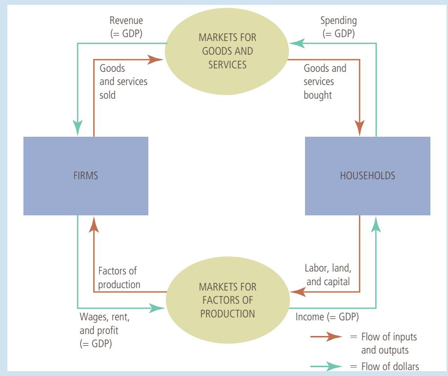
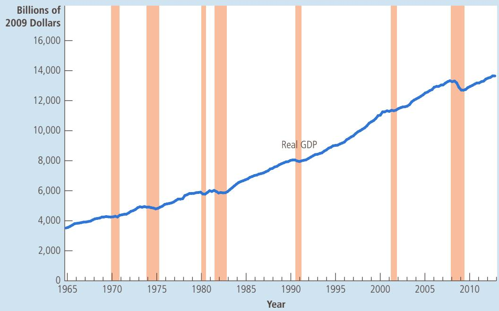

# The Data of Macroeconomics

When you finish school and start looking for a full-time job, your experiencewill, to a large extent, be shaped by prevailing economic conditions. In will, to a large extent, be shaped by prevailing economic conditions. In some years, firms throughout the economy are expanding their production of goods and services, employment is rising, and jobs are easy to find. In other years, firms are cutting back production, employment is declining, and finding a good job takes a long time. Not surprisingly, any college graduate would rather enter the labor force in a year of economic expansion than in a year of economic contraction.

Because the health of the overall economy profoundly affects all of us, changes in economic conditions are widely reported by the

media. Indeed, it is hard to pick up a newspaper, check an online news service, or turn on the TV without seeing some newly reported statistic about the economy. The statistic might measure the total income of everyone in the economy (gross domestic product, or GDP), the rate at which average prices are rising or falling (inflation/deflation), the percentage of the labor force that is out of work (unemployment), total spending at stores (retail sales), or the imbalance of trade between the United States and the rest of the world (the trade deficit). All these statistics are macroeconomic. Rather than telling us about a particular household, firm, or market, they tell us something about the entire economy.

As you may recall from Chapter 2, economics is divided into two branches: microeconomics and macroeconomics. Microeconomics is the study of how individual households and firms make decisions and how they interact with one another in markets. Macroeconomics is the study of the economy as a whole. The goal of macroeconomics is to explain the economic changes that affect many households, firms, and markets simultaneously. Macroeconomists address a broad variety of questions: Why is average income high in some countries and low in others? Why do prices sometimes rise rapidly while at other times they are more stable? Why do production and employment expand in some years and contract in others? What, if anything, can the government do to promote rapid growth in incomes, low inflation, and stable employment? These questions are all macroeconomic in nature because they concern the workings of the entire economy.

Because the economy as a whole is a collection of many households and many firms interacting in many markets, microeconomics and macroeconomics are closely linked. The basic tools of supply and demand, for instance, are as central to macroeconomic analysis as they are to microeconomic analysis. Yet studying the economy in its entirety raises some new and intriguing challenges.

In this and the next chapter, we discuss some of the data that economists and policymakers use to monitor the performance of the overall economy. These data reflect the economic changes that macroeconomists try to explain. This chapter considers gross domestic product, which measures the total income of a nation. GDP is the most closely watched economic statistic because it is thought to be the single best measure of a society’s economic well-being.

## 10-1 The Economy’s Income and Expenditure

If you were to judge how a person is doing economically, you might first look at her income. A person with a high income can more easily afford life’s necessities and luxuries. It is no surprise that people with higher incomes enjoy higher standards of living—better housing, better healthcare, fancier cars, more opulent vacations, and so on.

The same logic applies to a nation’s overall economy. When judging whether the economy is doing well or poorly, it is natural to look at the total income that everyone in the economy is earning. That is the task of gross domestic product.

GDP measures two things at once: the total income of everyone in the economy and the total expenditure on the economy’s output of goods and services. GDP can perform the trick of measuring both total income and total expenditure because these two things are the same. For an economy as a whole, income must equal expenditure.

Why is this true? An economy’s income is the same as its expenditure because every transaction has two parties: a buyer and a seller. Every dollar of spending by some buyer is a dollar of income for some seller. Suppose, for instance, that Karen pays Doug \$100 to mow her lawn. In this case, Doug is a seller of a service and Karen is a buyer. Doug earns \$100 and Karen spends \$100. Thus, the transaction contributes equally to the economy’s income and to its expenditure. GDP, whether measured as total income or total expenditure, rises by \$100.

Another way to see the equality of income and expenditure is with the circular-flow diagram in Figure 1. As you may recall from Chapter 2, this diagram describes all the transactions between households and firms in a simple economy. It simplifies matters by assuming that all goods and services are bought by households and that households spend all of their income. In this economy, when households buy goods and services from firms, these expenditures flow through the markets for goods and services. When the firms use the money they receive from sales to pay workers’ wages, landowners’ rent, and firm owners’ profit, this income flows through the markets for the factors of production. Money continuously flows from households to firms and then back to households.

GDP measures this flow of money. We can compute it for this economy in one of two ways: by adding up the total expenditure by households or by adding up the total income (wages, rent, and profit) paid by firms. Because all expenditure in the economy ends up as someone’s income, GDP is the same regardless of how we compute it.

The actual economy is, of course, more complicated than the one illustrated in Figure 1. Households do not spend all of their income; they pay some of it to the government in taxes, and they save some for use in the future. In addition, households do not buy all goods and services produced in the economy; some goods and services are bought by governments, and some are bought by firms that plan to use them in the future to produce their own output. Yet the basic lesson remains the same: Regardless of whether a household, government, or firm buys a good or service, the transaction always has a buyer and a seller. Thus, for the economy as a whole, expenditure and income are the same.

What two things does GDP measure? How can it measure two things at once?

  
Copyright 2018 Cengage Learning. All Rights Reserved. May not be copied, scanned, or duplicated, in whole or in part. WCN 02-200-203

## FIGURE 1

## The Circular-Flow Diagram

Households buy goods and services from firms, and firms use their revenue from sales to pay wages to workers, rent to landowners, and profit to firm owners. GDP equals the total amount spent by households in the market for goods and services. It also equals the total wages, rent, and profit paid by firms in the markets for the factors of production.

## 10-2 The Measurement of GDP

Having discussed the meaning of gross domestic product in general terms, let’s be more precise about how this statistic is measured. Here is a definition of GDP that focuses on GDP as a measure of total expenditure:

## gross domestic product (GDP)

•	 Gross domestic product (GDP) is the market value of all final goods and services produced within a country in a given period of time.

the market value of all final goods and services produced within a country in a given period of time

This definition might seem simple enough. But in fact, many subtle issues arise when computing an economy’s GDP. Let’s therefore consider each phrase in this definition with some care.

## 10-2a “GDP Is the Market Value . . .”

You have probably heard the adage “You can’t compare apples and oranges.” Yet GDP does exactly that. GDP adds together many different kinds of products into a single measure of the value of economic activity. To do this, it uses market prices. Because market prices measure the amount people are willing to pay for different goods, they reflect the value of those goods. If the price of an apple is twice the price of an orange, then an apple contributes twice as much to GDP as does an orange.

## 10-2b “. . . of All . . .”

GDP tries to be comprehensive. It includes all items produced in the economy and sold legally in markets. GDP measures the market value of not just apples and oranges but also pears and grapefruit, books and movies, haircuts and healthcare, and so on.

GDP also includes the market value of the housing services provided by the economy’s stock of housing. For rental housing, this value is easy to calculate— the rent equals both the tenant’s expenditure and the landlord’s income. Yet many people own their homes and, therefore, do not pay rent. The government includes this owner-occupied housing in GDP by estimating its rental value. In effect, GDP is based on the assumption that the owner is renting the house to herself. The imputed rent is included both in the homeowner’s expenditure and in her income, so it adds to GDP.

There are some products, however, that GDP excludes because measuring them is difficult. GDP excludes most items produced and sold illicitly, such as illegal drugs. It also excludes most items that are produced and consumed at home and, therefore, never enter the marketplace. Vegetables you buy at the grocery store are part of GDP; vegetables you grow in your garden are not.

These exclusions from GDP can at times lead to paradoxical results. For example, when Karen pays Doug to mow her lawn, that transaction is part of GDP. But suppose Doug and Karen marry. Even though Doug may continue to mow Karen’s lawn, the value of the mowing is now left out of GDP because Doug’s service is no longer sold in a market. Thus, their marriage reduces GDP.

## 10-2c “. . . Final . . .”

When International Paper makes paper, which Hallmark then uses to make a greeting card, the paper is called an intermediate good and the card is called a final good. GDP includes only the value of final goods. This is done because the value of intermediate goods is already included in the prices of the final goods. Adding the market value of the paper to the market value of the card would be double counting. That is, it would (incorrectly) count the paper twice.

An important exception to this principle arises when an intermediate good is produced and, rather than being used, is added to a firm’s inventory of goods for use or sale at a later date. In this case, the intermediate good is taken to be “final” for the moment, and its value as inventory investment is included as part of GDP. Thus, additions to inventory add to GDP, and when the goods in inventory are later used or sold, the reductions in inventory subtract from GDP.

## 10-2d “. . . Goods and Services . . .”

GDP includes both tangible goods (food, clothing, cars) and intangible services (haircuts, housecleaning, doctor visits). When you buy a CD by your favorite band, you are buying a good, and the purchase price is part of GDP. When you pay to hear a concert by the same band, you are buying a service, and the ticket price is also part of GDP.

## 10-2e “. . . Produced . . .”

GDP includes goods and services currently produced. It does not include transactions involving items produced in the past. When Ford produces and sells a new car, the value of the car is included in GDP. But when one person sells a used car to another person, the value of the used car is not included in GDP.

## 10-2f “. . . Within a Country . . .”

GDP measures the value of production within the geographic confines of a country. When a Canadian citizen works temporarily in the United States, her production is part of U.S. GDP. When an American citizen owns a factory in Haiti, the production at her factory is not part of U.S. GDP. (It is part of Haiti’s GDP.) Thus, items are included in a nation’s GDP if they are produced domestically, regardless of the nationality of the producer.

## 10-2g “. . . In a Given Period of Time.”

GDP measures the value of production that takes place within a specific interval of time. Usually, that interval is a year or a quarter (3 months). GDP measures the economy’s flow of income, as well as its flow of expenditure, during that interval.

When the government reports the GDP for a quarter, it usually presents GDP “at an annual rate.” This means that the figure reported for quarterly GDP is the amount of income and expenditure during the quarter multiplied by 4. The government uses this convention so that quarterly and annual figures on GDP can be compared more easily.

In addition, when the government reports quarterly GDP, it presents the data after they have been modified by a statistical procedure called seasonal adjustment. The unadjusted data show clearly that the economy produces more goods and services during some times of the year than during others. (As you might guess, December’s holiday shopping season is a high point.) When monitoring the condition of the economy, economists and policymakers often want to look beyond these regular seasonal changes. Therefore, government statisticians adjust the quarterly data to take out the seasonal cycle. The GDP data reported in the news are always seasonally adjusted.

Now let’s repeat the definition of GDP:

•	 Gross domestic product (GDP) is the market value of all final goods and services produced within a country in a given period of time.

This definition focuses on GDP as total expenditure in the economy. But don’t forget that every dollar spent by a buyer of a good or service becomes a dollar of income to the seller of that good or service. Therefore, in addition to applying this definition, the government adds up total income in the economy. The two ways of calculating GDP give almost exactly the same answer. (Why “almost”? The two measures should be precisely the same, but data sources are not perfect. The difference between the two calculations of GDP is called the statistical discrepancy.)

It should be apparent that GDP is a sophisticated measure of the value of economic activity. In advanced courses in macroeconomics, you will learn more about the subtleties that arise in its calculation. But even now you can see that each phrase in this definition is packed with meaning.

QuickQuiz

Which contributes more to GDP—the production of a pound of hamburger or the production of a pound of caviar? Why?

FYI

## Other Measures of Income

hen the U.S. Department of Commerce computes the nation’s GDP, it also computes various other measures of income to get a more complete picture of what’s happening in the economy. These other measures differ from GDP by excluding or including certain categories of income. What follows is a brief description of five of these income measures, ordered from largest to smallest.

•  Personal income i s t h e i n c o m e t h a t h o u s e h o l d s and noncorporate businesses receive. Unlike national income,

Gross national product (GNP) is the total income earned by a nation’s permanent residents (called nationals). It differs from GDP in that it includes income that our citizens earn abroad and excludes income that foreigners earn here. For example, when a Canadian citizen works temporarily in the United States, her production is part of U.S. GDP, but it is not part of U.S. GNP. (It is part of Canada’s GNP.) For most countries, including the United States, domestic residents are responsible for most domestic production, so GDP and GNP are quite close.

•  Net national product (NNP) is the total income of a nation’s residents (GNP) minus losses from depreciation. Depreciation is the wear and tear on the economy’s stock of equipment and structures, such as trucks rusting and old computer models becoming obsolete. In the national income accounts prepared by the Department of Commerce, depreciation is called the “consumption of fixed capital.”

National income is the total income earned by a nation’s residents in the production of goods and services. It is almost identical to net national product. These two measures differ because of the statistical discrepancy that arises from problems in data collection.

it excludes retained earnings,

which is income that corporations have earned but have not paid out to their owners. It also subtracts indirect business taxes (such as sales taxes), corporate income taxes, and contributions for social insurance (mostly Social Security taxes). In addition, personal income includes the interest income that households receive from their holdings of government debt and the income that households receive from government transfer programs, such as welfare and Social Security.

•  Disposable personal income is the income that households and noncorporate businesses have left after satisfying all their obligations to the government. It equals personal income minus personal taxes and certain nontax payments (such as traffic tickets).

Although the various measures of income differ in detail, they almost always tell the same story about economic conditions. When GDP grows rapidly, these other measures of income usually grow rapidly. And when GDP falls, these other measures usually fall as well. For monitoring fluctuations in the overall economy, it does not matter much which measure of income we use. ■

## 10-3 The Components of GDP

Spending in an economy takes many forms. At any moment, the Smith family may be having lunch at Burger King; Ford may be building a car factory; the U.S. Navy may be procuring a submarine; and British Airways may be buying an airplane from Boeing. GDP includes all of these various forms of spending on domestically produced goods and services.

To understand how the economy is using its scarce resources, economists study the composition of GDP among various types of spending. To do this, GDP (which we denote as Y) is divided into four components: consumption (C), investment (I), government purchases (G), and net exports (NX):

$$
Y = C + I + G + N X.
$$

This equation is an identity—an equation that must be true because of how the variables in the equation are defined. In this case, because each dollar of expenditure included in GDP is placed into one of the four components of GDP, the total of the four components must be equal to GDP. Let’s look at each of these four components more closely.

## 10-3a Consumption

Consumption is spending by households on goods and services, with the exception of purchases of new housing. Goods include durable goods, such as automobiles and appliances, and nondurable goods, such as food and clothing. Services include such intangible items as haircuts and medical care. Household spending on education is also included in consumption of services (although one might argue that it would fit better in the next component).

## 10-3b Investment

Investment is the purchase of goods (called capital goods) that will be used in the future to produce more goods and services. Investment is the sum of purchases of business capital, residential capital, and inventories. Business capital includes business structures (such as a factory or office building), equipment (such as a worker’s computer), and intellectual property products (such as the software that runs the computer). Residential capital includes the landlord’s apartment building and a homeowner’s personal residence. By convention, the purchase of a new house is the one type of household spending categorized as investment rather than consumption.

As mentioned earlier, the treatment of inventory accumulation is noteworthy. When Apple produces a computer and adds it to its inventory instead of selling it, Apple is assumed to have “purchased” the computer for itself. That is, the national income accountants treat the computer as part of Apple’s investment spending. (If Apple later sells the computer out of inventory, Apple’s inventory investment will then be negative, offsetting the positive expenditure of the buyer.) Inventories are treated this way because one aim of GDP is to measure the value of the economy’s production, and goods added to inventory are part of that period’s production.

Notice that GDP accounting uses the word investment differently from how you might hear the term in everyday conversation. When you hear the word investment, you might think of financial investments, such as stocks, bonds, and mutual funds—topics that we study later in this book. By contrast, because GDP measures expenditure on goods and services, here the word investment means

consumption spending by households on goods and services, with the exception of purchases of new housing

investment spending on business capital, residential capital, and inventories

## IN THE NEWS

## Sex, Drugs, and GDP

Some nations are debating what to include in their national income accounts.

## No Sex, Please, We’re French

By Zachary Karabell

he government of France has just made what on the face of it appears to be a nonannouncement announcement: It will not include illegal drugs and prostitution in its official calculation of the country’s gross domestic product.

What made the announcement odd was that it never has included such activities, nor have most countries. Nor do most governments announce what they do not plan to do. (“The U.S. government has no intention of sending a man to Venus.”) Yet the French decision comes in the wake of significant pressure from neighboring countries and from the European Union to integrate these activities into national accounts and economic output. That raises a host of questions: Should these activities be included, and if those are, why not others? And what exactly are we measuring—and why?

Few numbers shape our world today more than GDP. It has become the alpha and omega of national success, used by politicians and pundits as the primary gauge of national strength and treated as a numerical proxy for greatness or the lack thereof.

Yet GDP is only a statistic, replete with the limitations of all statistics. Created as an outgrowth of national accounts that were themselves only devised in the 1930s, GDP was never an all-inclusive measure, even as it is treated as such. Multiple areas of economic life were left out, including volunteer work and domestic work.

Now Eurostat, the official statistical agency of the European Union, is leading the drive to include a host of illegal activities in national calculations of GDP, most notably prostitution and illicit drugs. The argument, as a United Nations commission laid out in 2008, is fairly simple: Prostitution and illicit drugs are significant economic activities, and if they’re not factored into economic statistics, then we’re looking at an incomplete picture— which in turn will make it that much harder to craft smart policy. Additionally, different

purchases of goods (such as business capital, residential structures, and inventories) that will be used to produce other goods and services in the future.

## 10-3c Government Purchases

Government purchases include spending on goods and services by local, state, and federal governments. It includes the salaries of government workers as well as expenditures on public works. Recently, the U.S. national income accounts have switched to the longer label government consumption expenditure and gross investment, but in this book, we will use the traditional and shorter term government purchases.

The meaning of government purchases requires a bit of clarification. When the government pays the salary of an Army general or a schoolteacher, that salary is part of government purchases. But when the government pays a Social Security benefit to a person who is elderly or an unemployment insurance benefit to a worker who was recently laid off, the story is very different: These are called transfer payments because they are not made in exchange for a currently produced good or service. Transfer payments alter household income, but they do not reflect the economy’s production. (From a macroeconomic standpoint, transfer payments are like negative taxes.) Because GDP is intended to measure income from, and expenditure on, the production of goods and services, transfer payments are not counted as part of government purchases.

net exports spending on domestically produced goods by foreigners (exports) minus spending on foreign goods by domestic residents (imports)

## 10-3d Net Exports

Net exports equal the foreign purchases of domestically produced goods (exports) minus the domestic purchases of foreign goods (imports). A domestic firm’s sale

countries have different laws: In the Netherlands, for instance, prostitution is legal, as is marijuana. Those commercial transactions (or at least those that are recorded and taxed) are already part of Dutch GDP. Not including them in Italy’s or Spain’s GDPs can thus make it challenging to compare national numbers.

That is why Spain, Italy, Belgium, and the U.K. have in recent months moved to include illegal drugs and nonlicensed sex trade in their national accounts. The U.K. Office for National Statistics in particular approached its mandate with wonkish seriousness, publishing a 20- page précis of its methodology that explained how it would, say, calculate the dollar amount of prostitution (police records help) or deal with domestically produced drugs versus imported drugs. The result, which will be formally announced in September, will be an additional 10 billion pounds added to Great Britain’s GDP.

France, however, has demurred. A nation with a clichéd reputation for a certain savoir faire when it comes to sex and other nocturnal activities has decided (or at least its bureaucrats have) that in spite of an EU directive, it will not calculate the effects of illegal activities that are often nonconsensual or nonvoluntary. That is clearly the case for some prostitution—one French minister stated that “street prostitution” is largely controlled by the Mafia—and the same could be reasonably said of the use of some hard drugs, given their addictive nature.

There is undeniably a strong moralistic component in the French decision. By averring that because they are not voluntary or consensual these exchanges should not be included in GDP, the French government is placing a moral vision of what society should be ahead of an economic vision of what society is. That in turn makes an already messy statistic far messier, and that serves no one’s national interests. . . .

With all of GDP’s limitations, adding a new moral dimension would only make the number that much less useful. After all, why stop at not including prostitution because it degrades women? Why not refuse to measure coal production because it degrades the environment? Why not leave out cigarette usage because it causes cancer? The list of possible exclusions on this basis is endless.

If GDP is our current best metric for national output, then at the very least it should attempt to include all measurable output. The usually moralistic United States has actually been including legal prostitution in Nevada and now marijuana sales and consumption in Colorado, California, and Washington without any strong objections based solely on the argument that these are commercial exchanges that constitute this fuzzy entity we call “the economy.”…

Not measuring drugs and sex won’t make them go away, but it will hobble efforts to understand the messy latticework of our economic lives, all in a futile attempt to excise what we do not like. ■

S o u r c e : Slate, June 20, 2014.

to a buyer in another country, such as Boeing’s sale of an airplane to British Airways, increases net exports.

The net in net exports refers to the fact that imports are subtracted from exports. This subtraction is made because other components of GDP include imports of goods and services. For example, suppose that a household buys a \$40,000 car from Volvo, the Swedish carmaker. This transaction increases consumption by \$40,000 because car purchases are part of consumer spending. It also reduces net exports by \$40,000 because the car is an import. In other words, net exports include goods and services produced abroad (with a minus sign) because these goods and services are included in consumption, investment, and government purchases (with a plus sign). Thus, when a domestic household, firm, or government buys a good or service from abroad, the purchase reduces net exports, but because it also raises consumption, investment, or government purchases, it does not affect GDP.

## THE COMPONENTS OF U.S. GDP

Table 1 shows the composition of U.S. GDP in 2015. In this year, the GDP of the United States was almost \$18 trillion. Dividing this number by the 2015 U.S. population of 321 million yields GDP per person (sometimes called GDP per capita). In 2015 the income and expenditure of the average American was \$55,882.

Consumption made up 68 percent of GDP, or \$38,218 per person. Investment was \$9,402 per person. Government purchases were \$9,919 per person. Net exports were −\$1,657 per person. This number is negative because Americans spent more on foreign goods than foreigners spent on American goods.

## TABLE 1

GDP and Its Components This table shows total GDP for the U.S. economy in 2015 and the breakdown of GDP among its four components. When reading this table, recall the identity Y 5 C 1 I 1 G 1 NX.

<table><tr><td></td><td>Total(in billions of dollars)</td><td>Per Person(in dollars)</td><td>Percent of Total</td></tr><tr><td>Gross domestic product, Y</td><td>$17,938</td><td>$55,882</td><td>100%</td></tr><tr><td>Consumption, C</td><td>12,268</td><td>38,218</td><td>68</td></tr><tr><td>Investment, I</td><td>3,018</td><td>9,402</td><td>17</td></tr><tr><td>Government purchases, G</td><td>3,184</td><td>9,919</td><td>18</td></tr><tr><td>Net exports, NX</td><td>-532</td><td>-1,657</td><td>-3</td></tr></table>

S o u rc e : U.S. Department of Commerce. Parts may not sum to totals due to rounding.

These data come from the Bureau of Economic Analysis, the part of the U.S. Department of Commerce that produces the national income accounts. You can find more recent data on GDP on its website, http://www.bea.gov. ●

QuickQuiz

List the four components of expenditure. Which is the largest?

## 10-4 Real versus Nominal GDP

As we have seen, GDP measures the total spending on goods and services in all markets in the economy. If total spending rises from one year to the next, at least one of two things must be true: (1) the economy is producing a larger output of goods and services, or (2) goods and services are being sold at higher prices. When studying changes in the economy over time, economists want to separate these two effects. In particular, they want a measure of the total quantity of goods and services the economy is producing that is not affected by changes in the prices of those goods and services.

To do this, economists use a measure called real GDP. Real GDP answers a hypothetical question: What would be the value of the goods and services produced this year if we valued these goods and services at the prices that prevailed in some specific year in the past? By evaluating current production using prices that are fixed at past levels, real GDP shows how the economy’s overall production of goods and services changes over time.

To see more precisely how real GDP is constructed, let’s consider an example.

Table 2 shows some data for an economy that produces only two goods: hot dogs and hamburgers. The table shows the prices and quantities produced of the two goods in the years 2016, 2017, and 2018.

## 10-4a A Numerical Example

nominal GDP the production of goods and services valued at current prices

To compute total spending in this economy, we would multiply the quantities of hot dogs and hamburgers by their prices. In the year 2016, 100 hot dogs are sold at a price of \$1 per hot dog, so expenditure on hot dogs equals \$100. In the same year, 50 hamburgers are sold for \$2 per hamburger, so expenditure on hamburgers also equals \$100. Total expenditure in the economy—the sum of expenditure on hot dogs and expenditure on hamburgers—is \$200. This amount, the production of goods and services valued at current prices, is called nominal GDP.

<table><tr><td colspan="5">Prices and Quantities</td></tr><tr><td>Year</td><td>Price of Hot Dogs</td><td>Quantity of Hot Dogs</td><td>Price of Hamburgers</td><td>Quantity of Hamburgers</td></tr><tr><td>2016</td><td>$1</td><td>100</td><td>$2</td><td>50</td></tr><tr><td>2017</td><td>$2</td><td>150</td><td>$3</td><td>100</td></tr><tr><td>2018</td><td>$3</td><td>200</td><td>$4</td><td>150</td></tr><tr><td colspan="5">Calculating Nominal GDP</td></tr><tr><td>2016</td><td colspan="4">($1 per hot dog × 100 hot dogs) + ($2 per hamburger × 50 hamburgers) = $200</td></tr><tr><td>2017</td><td colspan="4">($2 per hot dog × 150 hot dogs) + ($3 per hamburger × 100 hamburgers) = $600</td></tr><tr><td>2018</td><td colspan="4">($3 per hot dog × 200 hot dogs) + ($4 per hamburger × 150 hamburgers) = $1,200</td></tr><tr><td colspan="5">Calculating Real GDP (base year 2016)</td></tr><tr><td>2016</td><td colspan="4">($1 per hot dog × 100 hot dogs) + ($2 per hamburger × 50 hamburgers) = $200</td></tr><tr><td>2017</td><td colspan="4">($1 per hot dog × 150 hot dogs) + ($2 per hamburger × 100 hamburgers) = $350</td></tr><tr><td>2018</td><td colspan="4">($1 per hot dog × 200 hot dogs) + ($2 per hamburger × 150 hamburgers) = $500</td></tr><tr><td colspan="5">Calculating the GDP Deflator</td></tr><tr><td>2016</td><td colspan="4">($200/$200) × 100 = 100</td></tr><tr><td>2017</td><td colspan="4">($600/$350) × 100 = 171</td></tr><tr><td>2018</td><td colspan="4">($1,200/$500) × 100 = 240</td></tr></table>

## TABLE 2

The table shows the calculation of nominal GDP for these 3 years. Total spending rises from \$200 in 2016 to \$600 in 2017 and then to \$1,200 in 2018. Part of this rise is attributable to the increase in the quantities of hot dogs and hamburgers, and part is attributable to the increase in the prices of hot dogs and hamburgers.

## Real and Nominal GDP

This table shows how to calculate real GDP, nominal GDP, and the GDP deflator for a hypothetical economy that produces only hot dogs and hamburgers.

To obtain a measure of the amount produced that is not affected by changes in prices, we use real GDP, which is the production of goods and services valued at constant prices. We calculate real GDP by first designating 1 year as a base year. We then use the prices of hot dogs and hamburgers in the base year to compute the value of goods and services in all the years. In other words, the prices in the base year provide the basis for comparing quantities in different years.

real GDP the production of goods and services valued at constant prices

Suppose that we choose 2016 to be the base year in our example. We can then use the prices of hot dogs and hamburgers in 2016 to compute the value of goods and services produced in 2016, 2017, and 2018. Table 2 shows these calculations. To compute real GDP for 2016, we use the prices of hot dogs and hamburgers in 2016 (the base year) and the quantities of hot dogs and hamburgers produced in 2016. (Thus, for the base year, real GDP always equals nominal GDP.) To compute real GDP for 2017, we use the prices of hot dogs and hamburgers in 2016 (the base year) and the quantities of hot dogs and hamburgers produced in 2017. Similarly, to compute real GDP for 2018, we use the prices in 2016 and the quantities in 2018. When we find that real GDP has risen from \$200 in 2016 to \$350 in 2017 and then to \$500 in 2018, we know that the increase is attributable to an increase in the quantities produced because the prices are being held fixed at base-year levels.

To sum up: Nominal GDP uses current prices to place a value on the economy’s production of goods and services. Real GDP uses constant base-year prices to place a value on the economy’s production of goods and services. Because real GDP is not affected by changes in prices, changes in real GDP reflect only changes in the amounts being produced. Thus, real GDP is a measure of the economy’s production of goods and services.

Our goal in computing GDP is to gauge how well the overall economy is performing. Because real GDP measures the economy’s production of goods and services, it reflects the economy’s ability to satisfy people’s needs and desires. Thus, real GDP is a better gauge of economic well-being than is nominal GDP. When economists talk about the economy’s GDP, they usually mean real GDP rather than nominal GDP. And when they talk about growth in the economy, they measure that growth as the percentage change in real GDP from one period to another.

## 10-4b The GDP Deflator

As we have just seen, nominal GDP reflects both the quantities of goods and services the economy is producing and the prices of those goods and services. By contrast, by holding prices constant at base-year levels, real GDP reflects only the quantities produced. From these two statistics, we can compute a third, called the GDP deflator, which reflects only the prices of goods and services.

GDP deflator

The GDP deflator is calculated as follows:

a measure of the price level calculated as the ratio of nominal GDP to real GDP times 100

$$
\text {GDP deflator} = \frac {\text {Nominal GDP}}{\text {Real GDP}} \times 1 0 0.
$$

Because nominal GDP and real GDP must be the same in the base year, the GDP deflator for the base year always equals 100. The GDP deflator for subsequent years measures the change in nominal GDP from the base year that cannot be attributable to a change in real GDP.

The GDP deflator measures the current level of prices relative to the level of prices in the base year. To see why this is true, consider a couple of simple examples. First, imagine that the quantities produced in the economy rise over time but prices remain the same. In this case, both nominal and real GDP rise at the same rate, so the GDP deflator is constant. Now suppose, instead, that prices rise over time but the quantities produced stay the same. In this second case, nominal GDP rises but real GDP remains the same, so the GDP deflator rises. Notice that, in both cases, the GDP deflator reflects what’s happening to prices, not quantities.

Let’s now return to our numerical example in Table 2. The GDP deflator is computed at the bottom of the table. For the year 2016, nominal GDP is \$200 and real GDP is \$200, so the GDP deflator is 100. (The deflator is always 100 in the base year.) For the year 2017, nominal GDP is \$600 and real GDP is \$350, so the GDP deflator is 171.

Economists use the term inflation to describe a situation in which the economy’s overall price level is rising. The inflation rate is the percentage change in some measure of the price level from one period to the next. Using the GDP deflator, the inflation rate between two consecutive years is computed as follows:

$$
\text {Inflation rate in year 2} = \frac {\text {GDP deflator in year 2 - GDP deflator in year 1}}{\text {GDP deflator in year 1}} \times 1 0 0.
$$

Because the GDP deflator rose in year 2017 from 100 to 171, the inflation rate is $1 0 0 \times ( 1 7 1 - 1 0 0 ) / 1 0 0 ,$ , or 71 percent. In 2018, the GDP deflator rose to 240 from 171 the previous year, so the inflation rate is $1 0 0 \times ( 2 4 0 - 1 7 1 ) / 1 7 1$ , or 40 percent.

The GDP deflator is one measure that economists use to monitor the average level of prices in the economy and thus the rate of inflation. The GDP deflator gets its name

Source: U.S. Department of Commerce.

because it can be used to take inflation out of nominal GDP—that is, to “deflate” nominal GDP for the rise that is due to increases in prices. We examine another measure of the economy’s price level, called the consumer price index, in the next chapter, where we also describe the differences between the two measures.

## A HALF CENTURY OF REAL GDP

Now that we know how real GDP is defined and measured, let’s look at what this macroeconomic variable tells us about the recent history of the United States. Figure 2 shows quarterly data on real GDP for the U.S. economy since 1965.

The most obvious feature of these data is that real GDP grows over time. The real GDP of the U.S. economy in 2015 was more than four times its 1965 level. Put differently, the output of goods and services produced in the United States has grown on average about 3 percent per year. This continued growth in real GDP enables most Americans to enjoy greater economic prosperity than their parents and grandparents did.

A second feature of the GDP data is that growth is not steady. The upward climb of real GDP is occasionally interrupted by periods during which GDP declines, called recessions. Figure 2 marks recessions with shaded vertical bars. (There is no ironclad rule for when the official business cycle dating committee will declare that a recession has occurred, but an old rule of thumb is two consecutive quarters of falling real GDP.) Recessions are associated not only with lower incomes but also with other forms of economic distress: rising unemployment, falling profits, increased bankruptcies, and so on.

Much of macroeconomics is aimed at explaining the long-run growth and shortrun fluctuations in real GDP. As we will see in the coming chapters, we need different models for these two purposes. Because the short-run fluctuations represent deviations from the long-run trend, we first examine the behavior of key macroeconomic variables, including real GDP, in the long run. Then in later chapters, we build on this analysis to explain short-run fluctuations. ●

  
Copyright 2018 Cengage Learning. All Rights Reserved. May not be copied, scanned, or duplicated, in whole or in part. WCN 02-200-203

## FIGURE 2

## Real GDP in the United States

This figure shows quarterly data on real GDP for the U.S. economy since 1965. Recessions— periods of falling real GDP—are marked with the shaded vertical bars.

## IN THE NEWS

## Gauging the High-Tech Economy

GDP measures the economy’s total output. Labor productivity measures output per unit of labor input. If GDP is incorrectly measured, so is productivity.
