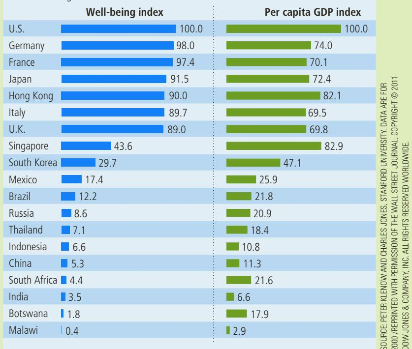

# Measuring Macroeconomic Well-Being

Can we do better than using gross domestic product?

## Nations Seek Success Beyond GDP

## By Mark Whitehouse

Money isn’t everything. But in measuring the success of nations, it isn’t easy to find a substitute.

Political leaders are increasingly expressing dissatisfaction with gross domestic product—a monetary measure of all the goods and services a country produces—as a gauge of a nation’s success in raising living standards.

In November, British Prime Minister David Cameron announced plans to build measures of national well-being that would take into account factors such as peoples’ life satisfaction, following a similar effort by French President Nicolas Sarkozy.

Their efforts cut to the core of what economics is supposed to be about: What makes us better off? How can we all have more of it? Anyone hoping for a clear-cut answer, though, is likely to be disappointed.

“There is more to life than GDP, but it will be hard to come up with a single measure to replace it and we are not sure that a single measure is the answer,” said Paul Allin, director of the Measuring National Well-Being

Project at the U.K.’s Office of National Statistics. “Maybe we live in a multidimensional world and we have to get used to handling a reasonable number of bits of information.”

After a session on creating a national success indicator at the annual meeting of the American Economic Association on Friday, Carol Graham, fellow at the Brookings Institution, summed up the situation thus: “It’s like a new science. There’s still a lot of work to be done.”

For much of the past four decades, economists have puzzled over a paradox that cast doubt on GDP as the world’s main indicator of success.

People in richer countries didn’t appear to be any happier than people in poor countries. In research beginning in the 1970s, University of Pennsylvania economist Richard Easterlin found no evidence of a link between countries’ income—as measured by GDP per person— and peoples’ reported levels of happiness.

More recent research suggests GDP isn’t quite so bad. Using more data and different statistical techniques, three economists at the University of Pennsylvania’s Wharton School—Daniel Sacks, Betsey Stevenson and Justin Wolfers—found that a given percentage increase in GDP per person tends to coincide with a similar increase in reported well-being. The correlation held across different countries and over time.

Still, for measuring the success of policy, GDP is far from ideal. Making everybody work 120 hours a week could radically boost a country’s GDP per capita, but it wouldn’t make people happier. Removing pollution limits could boost GDP per hour worked, but wouldn’t necessarily lead to a world we’d want to live in.

One approach is to enhance GDP with other objective factors such as inequality, leisure and life expectancy. In a paper presented Saturday at the American Economic Association meeting, Stanford economists Peter Klenow and Charles Jones found that doing so can make a big difference.

By their calculation, accounting for longer life expectancy, additional leisure time and lower levels of inequality makes living standards in France and Germany look almost the same as those in the U.S., which otherwise leads the pack by a large margin.

Mr. Klenow points out that the calculation is fraught with difficulties. For one, many countries have poor data on crucial factors such as life expectancy.

omits the value of goods and services produced at home. When a chef prepares a delicious meal and sells it at her restaurant, the value of that meal is part of GDP. But if the chef prepares the same meal for her family, the value she has added to the raw ingredients is left out of GDP. Similarly, child care provided in day-care centers is part of GDP, whereas child care by parents at home is not. Volunteer work also contributes to the well-being of those in society, but GDP does not reflect these contributions.

Another thing that GDP excludes is the quality of the environment. Imagine that the government eliminated all environmental regulations. Firms could then produce goods and services without considering the pollution they create,

For the purpose of comparing well-being across countries, asking people how they feel might be better than monetary measures. Angus Deaton, an economist at Princeton University, notes that placing values on the extremely different goods and services consumed in the U.S. and, say, Tajikistan, can be impossible to do in a comparable way. Just asking people about their situation could be much easier and no less accurate.

Surveys already play a meaningful role in the way many countries assess their performance, from consumer confidence in the U.S. to the Netherlands’s Life Situation Index, which

Happily ever after

More wealth doesn’t always translate into greater quality of life, when factors such as leisure and length of life are included.

  
S o u rc e : Peter Klenow and Charles Jones, Stanford University. Data are for 2000.

accounts for factors such as relationships and community involvement.

As part of its effort to gauge well-being, the U.K. plans to add more subjective questions to its household surveys.

But surveys can also send misleading policy signals. Mr. Wolfers, for example, has found that surveys of women’s subjective well-being in the U.S. suggest that they are less happy than they were four decades ago, despite improvements in wages, education and other objective measures. That, he says, doesn’t mean the feminist movement should be reversed. Rather, it could be related to rising expectations or greater frankness among the women interviewed.

Peoples’ true preferences are often revealed more by what they do than by what they say. Surveys suggest people with children tend to be less happy than those without, yet people keep having children—and nobody would advocate mass sterilization to improve overall well-being.

“What we care about in the world is not just happiness,” says Mr. Wolfers. “If you measure just one part of what makes for a full life you’re going to end up harming the other parts.”

For the time being, that leaves policy makers to choose the measures of success that seem most appropriate for the task at hand. That’s not ideal, but it’s the best economics has to offer. ■

S o u r c e : The Wall Street Journal, January 10, 2011.

and GDP might rise. Yet well-being would most likely fall. The deterioration in the quality of air and water would more than offset the gains from greater production.

GDP also says nothing about the distribution of income. A society in which 100 people have annual incomes of \$50,000 has GDP of \$5 million and, not surprisingly, GDP per person of \$50,000. So does a society in which 10 people earn \$500,000 and 90 suffer with nothing at all. Few people would look at those two situations and call them equivalent. GDP per person tells us what happens to the average person, but behind the average lies a large variety of personal experiences.

In the end, we can conclude that GDP is a good measure of economic wellbeing for most—but not all—purposes. It is important to keep in mind what GDP includes and what it leaves out.

## INTERNATIONAL DIFFERENCES IN GDP AND THE QUALITY OF LIFE

One way to gauge the usefulness of GDP as a measure of economic well-being is to examine international data. Rich and poor countries have vastly different levels of GDP per person. If a large GDP leads

to a higher standard of living, then we should observe GDP to be strongly correlated with various measures of the quality of life. And, in fact, we do.

Table 3 shows twelve large nations ranked in order of GDP per person. The table also shows life expectancy at birth, the average years of schooling among adults, and an index of life satisfaction based on asking people to gauge how they feel about their lives on a scale of 0 to 10 (with 10 being the best). These data show a clear pattern. In rich countries, such as the United States and Germany, people can expect to live to about 80, have about 13 years of schooling, and rate their life satisfaction at about 7. In poor countries, such as Bangladesh and Pakistan, people typically die about 10 years earlier, have less than half as much schooling, and rate their life satisfaction about 2 points lower on the 10-point scale.

Data on other aspects of the quality of life tell a similar story. Countries with low GDP per person tend to have more infants with low birth weight, higher rates of infant mortality, higher rates of maternal mortality, and higher rates of child malnutrition. They also have lower rates of access to electricity, paved roads, and clean drinking water. In these countries, fewer school-age children are actually in school, those who are in school must learn with fewer teachers per student, and illiteracy among adults is more common. The citizens of these nations tend to have fewer televisions, fewer telephones, and fewer opportunities to access the Internet. International data leave no doubt that a nation’s GDP per person is closely associated with its citizens’ standard of living.

Why should policymakers care about GDP?

## TABLE 3

## GDP and the Quality of Life

The table shows GDP per person and three other measures of the quality of life for twelve major countries.

Sourc e: Human Development Report 2015 United Nations. Real GDP is for 2014, expressed in 2011 dollars. Average years of schooling is among adults 25 years and older.

<table><tr><td>Country</td><td>Real GDP per Person</td><td>Life Expectancy</td><td>Average Years of Schooling</td><td>Overall Life Satisfaction (0 to 10 scale)</td></tr><tr><td>United States</td><td>$52,947</td><td>79 years</td><td>13 years</td><td>7.2</td></tr><tr><td>Germany</td><td>43,919</td><td>81</td><td>13</td><td>7.0</td></tr><tr><td>Japan</td><td>36,927</td><td>83</td><td>12</td><td>5.9</td></tr><tr><td>Russia</td><td>22,352</td><td>70</td><td>12</td><td>6.0</td></tr><tr><td>Mexico</td><td>16,056</td><td>77</td><td>9</td><td>6.7</td></tr><tr><td>Brazil</td><td>15,175</td><td>74</td><td>8</td><td>7.0</td></tr><tr><td>China</td><td>12,547</td><td>76</td><td>8</td><td>5.2</td></tr><tr><td>Indonesia</td><td>9,788</td><td>69</td><td>8</td><td>5.6</td></tr><tr><td>India</td><td>5,497</td><td>68</td><td>5</td><td>4.4</td></tr><tr><td>Nigeria</td><td>5,341</td><td>53</td><td>6</td><td>4.8</td></tr><tr><td>Pakistan</td><td>4,866</td><td>66</td><td>5</td><td>5.4</td></tr><tr><td>Bangladesh</td><td>3,191</td><td>72</td><td>5</td><td>4.6</td></tr></table>

## 10-6 Conclusion

In this chapter we learned how economists measure the total income of a nation. Measurement is, of course, only a starting point. Much of macroeconomics is aimed at revealing the long-run and short-run determinants of a nation’s gross domestic product. Why, for example, is GDP higher in the United States and Japan than in India and Nigeria? What can the governments of the poorest countries do to promote more rapid GDP growth? Why does GDP in the United States rise rapidly in some years and fall in others? What can U.S. policymakers do to reduce the severity of these fluctuations in GDP? These are the questions we will take up shortly.

At this point, it is important to acknowledge the significance of just measuring GDP. We all get some sense of how the economy is doing as we go about our lives. But the economists who study changes in the economy and the policymakers who formulate economic policies need more than this vague sense—they need concrete data on which to base their judgments. Quantifying the behavior of the economy with statistics such as GDP is, therefore, the first step to developing a science of macroeconomics.

## CHAPTER QuickQuiz

1. If the price of a hot dog is \$2 and the price of a hamburger is \$4, then 30 hot dogs contribute as much to GDP as \_ hamburgers. a. 5 b. 15 c. 30 d. 60

2. Angus the sheep farmer sells wool to Barnaby the knitter for \$20. Barnaby makes two sweaters, each of which has a market price of \$40. Collette buys one of them, while the other remains on the shelf of Barnaby’s store to be sold later. What is GDP here?

a. \$40

b. \$60

c. \$80

d. \$100

3. Which of the following does NOT add to U.S. GDP?

a. Air France buys a plane from Boeing, the U.S. aircraft manufacturer.

b. General Motors builds a new auto factory in North Carolina.

c. The city of New York pays a salary to a policeman.

d. The federal government sends a Social Security check to your grandmother.

4. An American buys a pair of shoes made in Italy. How do the U.S. national income accounts treat the transaction? a. Net exports and GDP both rise. b. Net exports and GDP both fall. c. Net exports fall, while GDP is unchanged. d. Net exports are unchanged, while GDP rises.

5. Which is the largest component of GDP? a. consumption b. investment c. government purchases d. net exports

6. If all quantities produced rise by 10 percent and all prices fall by 10 percent, which of the following occurs?

a. Real GDP rises by 10 percent, while nominal GDP falls by 10 percent.

b. Real GDP rises by 10 percent, while nominal GDP is unchanged.

c. Real GDP is unchanged, while nominal GDP rises by 10 percent.

d. Real GDP is unchanged, while nominal GDP falls by 10 percent.

## SUMMARY

Because every transaction has a buyer and a seller, the total expenditure in the economy must equal the total income in the economy.

Gross domestic product (GDP) measures an economy’s total expenditure on newly produced goods and services and the total income earned from the production of these goods and services. More precisely, GDP is the market value of all final goods and services produced within a country in a given period of time.

GDP is divided among four components of expenditure: consumption, investment, government purchases, and net exports. Consumption includes spending on goods and services by households, with the exception of purchases of new housing. Investment includes spending on business capital, residential capital, and inventories. Government purchases include spending on goods and services by local, state, and federal governments. Net exports equal the value of goods and services produced domestically and sold abroad (exports) minus the value of goods and services produced abroad and sold domestically (imports).

Nominal GDP uses current prices to value the economy’s production of goods and services. Real GDP uses constant base-year prices to value the economy’s production of goods and services. The GDP deflator— calculated from the ratio of nominal to real GDP— measures the level of prices in the economy.

GDP is a good measure of economic well-being because people prefer higher to lower incomes. But it is not a perfect measure of well-being. For example, GDP excludes the value of leisure and the value of a clean environment.

## KEY CONCEPTS

microeconomics, p. 190 macroeconomics, p. 190 gross domestic product (GDP), p. 192 consumption, p. 195

investment, p. 195 government purchases, p. 196 net exports, p. 196 nominal GDP, p. 198

real GDP, p. 199 GDP deflator, p. 200

## QUESTIONS FOR REVIEW

1. Explain why an economy’s income must equal its expenditure.

2. Which contributes more to GDP—the production of an economy car or the production of a luxury car? Why?

3. A farmer sells wheat to a baker for \$2. The baker uses the wheat to make bread, which is sold for \$3. What is the total contribution of these transactions to GDP?

4. Many years ago, Peggy paid \$500 to put together a record collection. Today, she sold her albums at a garage sale for \$100. How does this sale affect current GDP?

5. List the four components of GDP. Give an example of each.

6. Why do economists use real GDP rather than nominal GDP to gauge economic well-being?

7. In the year 2017, the economy produces 100 loaves of bread that sell for \$2 each. In the year 2018, the economy produces 200 loaves of bread that sell for \$3 each. Calculate nominal GDP, real GDP, and the GDP deflator for each year. (Use 2017 as the base year.) By what percentage does each of these three statistics rise from one year to the next?

8. Why is it desirable for a country to have a large GDP? Give an example of something that would raise GDP and yet be undesirable.

## PROBLEMS AND APPLICATIONS

1. What components of GDP (if any) would each of the following transactions affect? Explain.

a. Uncle Henry buys a new refrigerator from a domestic manufacturer.

b. Aunt Jane buys a new house from a local builder.

c. The Jackson family buys an old Victorian house from the Walker family.

d. You pay a hairdresser for a haircut.

e. Ford sells a Mustang from its inventory to the Martinez family.

f. Ford manufactures a Focus and sells it to Avis, the car rental company.

g. California hires workers to repave Highway 101.

h. The federal government sends your grandmother a Social Security check.

i. Your parents buy a bottle of French wine.

j. Honda expands its factory in Ohio.

<table><tr><td>Year</td><td>Real GDP(in 2000 dollars)</td><td>Nominal GDP(in current dollars)</td><td>GDP Deflator(base year 2000)</td></tr><tr><td>1970</td><td>3,000</td><td>1,200</td><td></td></tr><tr><td>1980</td><td>5,000</td><td></td><td>60</td></tr><tr><td>1990</td><td></td><td>6,000</td><td>100</td></tr><tr><td>2000</td><td></td><td>8,000</td><td></td></tr><tr><td>2010</td><td></td><td>15,000</td><td>200</td></tr><tr><td>2020</td><td>10,000</td><td></td><td>300</td></tr><tr><td>2030</td><td>20,000</td><td>50,000</td><td></td></tr></table>

3. The government purchases component of GDP does not include spending on transfer payments such as Social Security. Thinking about the definition of GDP, explain why transfer payments are excluded.

4. As the chapter states, GDP does not include the value of used goods that are resold. Why would including such transactions make GDP a less informative measure of economic well-being?

## 2. Fill in the blanks:

5. Below are some data from the land of milk and honey.

<table><tr><td>Year</td><td>Price of Milk</td><td>Quantity of Milk</td><td>Price of Honey</td><td>Quantity of Honey</td></tr><tr><td>2016</td><td>$1</td><td>100 quarts</td><td>$2</td><td>50 quarts</td></tr><tr><td>2017</td><td>1</td><td>200</td><td>2</td><td>100</td></tr><tr><td>2018</td><td>2</td><td>200</td><td>4</td><td>100</td></tr></table>

a. Compute nominal GDP, real GDP, and the GDP deflator for each year, using 2016 as the base year.

b. Compute the percentage change in nominal GDP, real GDP, and the GDP deflator in 2017 and 2018 from the preceding year. For each year, identify the variable that does not change. Explain why your answer makes sense.

c. Did economic well-being increase more in 2017 or 2018? Explain.

a. What is nominal GDP for each of these three years?

b. What is real GDP for each of these years?

6. Consider an economy that produces only chocolate bars. In year 1, the quantity produced is 3 bars and the price is \$4. In year 2, the quantity produced is 4 bars and the price is \$5. In year 3, the quantity produced is 5 bars and the price is \$6. Year 1 is the base year.

c. What is the GDP deflator for each of these years?

d. What is the percentage growth rate of real GDP from year 2 to year 3?

e. What is the inflation rate as measured by the GDP deflator from year 2 to year 3?

f. In this one-good economy, how might you have answered parts (d) and (e) without first answering parts (b) and (c)?

7. Consider the following data on U.S. GDP:

<table><tr><td>Year</td><td>Nominal GDP(in billions of dollars)</td><td>GDP Deflator(base year 2009)</td></tr><tr><td>2014</td><td>17,419</td><td>108.3</td></tr><tr><td>1994</td><td>7,309</td><td>73.8</td></tr></table>

a. What was the growth rate of nominal GDP between 1994 and 2014? (Hint: The growth rate of a variable X over an N-year period is calculated as $1 0 0 \times [ ( X _ { \mathrm { { f i n a l } } } / X _ { \mathrm { { i n i t i a l } } } ) ^ { 1 / N ^ { ^ { . } } } - 1 ] . )$

b. What was the growth rate of the GDP deflator between 1994 and 2014?

c. What was real GDP in 1994 measured in 2009 prices?

d. What was real GDP in 2014 measured in 2009 prices?

e. What was the growth rate of real GDP between 1994 and 2014?

f. Was the growth rate of nominal GDP higher or lower than the growth rate of real GDP? Explain.

8. Revised estimates of U.S. GDP are usually released by the government near the end of each month. Find a newspaper article that reports on the most recent release, or read the news release yourself at http:// www.bea.gov, the website of the U.S. Bureau of Economic Analysis. Discuss the recent changes in real and nominal GDP and in the components of GDP.

9. A farmer grows wheat, which she sells to a miller for \$100. The miller turns the wheat into flour, which she sells to a baker for \$150. The baker turns the wheat

into bread, which she sells to consumers for \$180. Consumers eat the bread.

a. What is GDP in this economy? Explain.

b. Value added is defined as the value of a producer’s output minus the value of the intermediate goods that the producer buys to make the output. Assuming there are no intermediate goods beyond those described above, calculate the value added of each of the three producers.

c. What is total value added of the three producers in this economy? How does it compare to the economy’s GDP? Does this example suggest another way of calculating GDP?

10. Goods and services that are not sold in markets, such as food produced and consumed at home, are generally not included in GDP. Can you think of how this might cause the numbers in the second column of Table 3 to be misleading in a comparison of the economic well-being of the United States and India? Explain.

11. The participation of women in the U.S. labor force has risen dramatically since 1970.

a. How do you think this rise affected GDP?

b. Now imagine a measure of well-being that includes time spent working in the home and taking leisure.

How would the change in this measure of well-being compare to the change in GDP?

c. Can you think of other aspects of well-being that are associated with the rise in women’s labor-force participation? Would it be practical to construct a measure of well-being that includes these aspects?

12. One day, Barry the Barber, Inc., collects \$400 for haircuts. Over this day, his equipment depreciates in value by \$50. Of the remaining \$350, Barry sends \$30 to the government in sales taxes, takes home \$220 in wages, and retains \$100 in his business to add new equipment in the future. From the \$220 that Barry takes home, he pays \$70 in income taxes. Based on this information, compute Barry’s contribution to the following measures of income.

a. gross domestic product

b. net national product

c. national income

d. personal income

e. disposable personal income

To find additional study resources, visit cengagebrain.com, and search for “Mankiw.”
