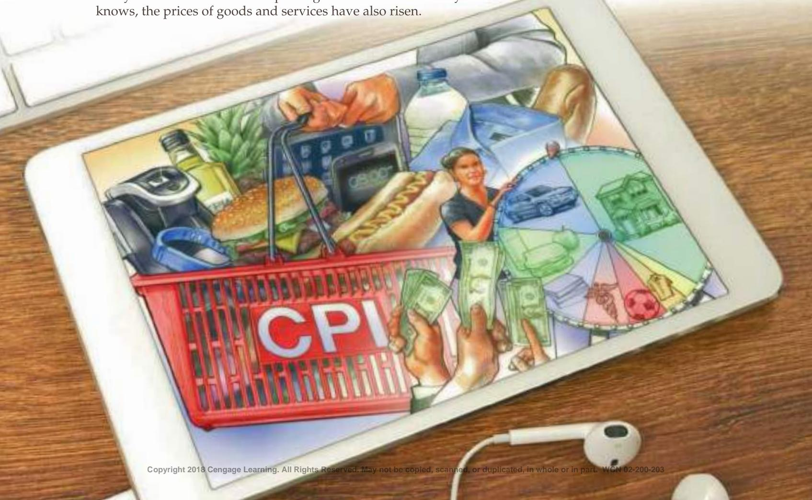
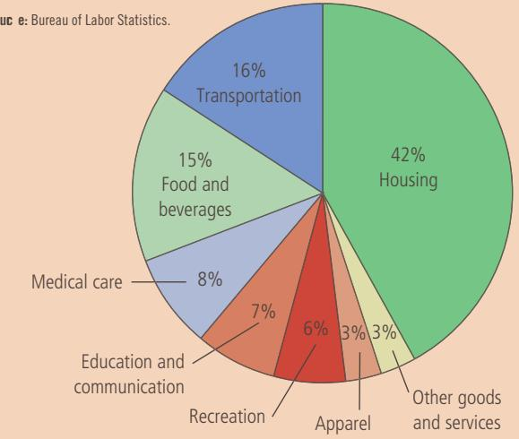

# Measuring the Cost of Living

n 1931, as the U.S. economy was suffering through the Great Depression, the New York Yankees paid famed baseball player Babe Ruth a salary of \$80,000. At the time, this pay was extraordinary, even among the stars of baseball. According to one story, a reporter asked Ruth whether he thought it was right that he made more than President Herbert Hoover, who had a salary of \$75,000. Ruth replied, “I had a better year.”

In 2015, the average salary earned by major league baseball players was about \$4 million, and Los Angeles Dodgers pitcher Clayton Kershaw was paid \$31 million. At first, this fact might lead you to think that baseball has become vastly more lucrative over the past eight decades. But as everyone knows, the prices of goods and services have also risen.

In 1931, a nickel would buy an ice-cream cone and a quarter would buy a ticket at the local movie theater. Because prices were so much lower in Babe Ruth’s day than they are today, it is not clear whether Ruth enjoyed a higher or lower standard of living than today’s players.

In the preceding chapter, we looked at how economists use gross domestic product (GDP) to measure the quantity of goods and services that the economy is producing. This chapter examines how economists measure the overall cost of living. To compare Babe Ruth’s salary of \$80,000 to salaries from today, we need to find some way of turning dollar figures into meaningful measures of purchasing power. That is exactly the job of a statistic called the consumer price index, or simply the CPI. After seeing how the CPI is constructed, we discuss how we can use such a price index to compare dollar figures from different points in time.

The CPI is used to monitor changes in the cost of living over time. When the CPI rises, the typical family has to spend more money to maintain the same standard of living. Economists use the term inflation to describe a situation in which the economy’s overall price level is rising. The inflation rate is the percentage change in the price level from the previous period. The preceding chapter showed how economists can measure inflation using the GDP deflator. The inflation rate you are likely to hear on the nightly news, however, is calculated from the CPI, which better reflects the goods and services bought by consumers.

As we will see in the coming chapters, inflation is a closely watched aspect of macroeconomic performance and is a key variable guiding macroeconomic policy. This chapter provides the background for that analysis by showing how economists measure the inflation rate using the CPI and how this statistic can be used to compare dollar figures from different times.

## 11-1 The Consumer Price Index

consumer price index (CPI) a measure of the overall cost of the goods and services bought by a typical consumer

The consumer price index (CPI) is a measure of the overall cost of the goods and services bought by a typical consumer. Every month, the Bureau of Labor Statistics (BLS), which is part of the Department of Labor, computes and reports the CPI. In this section, we discuss how the CPI is calculated and what problems arise in its measurement. We also consider how this index compares to the GDP deflator, another measure of the overall level of prices, which we examined in the preceding chapter.

## 11-1a How the CPI Is Calculated

When the BLS calculates the CPI and the inflation rate, it uses data on the prices of thousands of goods and services. To see exactly how these statistics are constructed, let’s consider a simple economy in which consumers buy only two goods: hot dogs and hamburgers. Table 1 shows the five steps that the BLS follows.

1. Fix the basket. Determine which prices are most important to the typical consumer. If the typical consumer buys more hot dogs than hamburgers, then the price of hot dogs is more important than the price of hamburgers and, therefore, should be given greater weight in measuring the cost of living. The BLS sets these weights by surveying consumers to find the basket of goods and services bought by the typical consumer. In the example in the table, the typical consumer buys a basket of 4 hot dogs and 2 hamburgers.

2. Find the prices. Find the prices of each of the goods and services in the basket at each point in time. The table shows the prices of hot dogs and hamburgers for three different years.

<table><tr><td colspan="3">Step 1: Survey Consumers to Determine a Fixed Basket of Goods</td></tr><tr><td colspan="3">Basket = 4 hot dogs, 2 hamburgers</td></tr><tr><td colspan="3">Step 2: Find the Price of Each Good in Each Year</td></tr><tr><td>Year</td><td>Price of Hot Dogs</td><td>Price of Hamburgers</td></tr><tr><td>2016</td><td>$1</td><td>$2</td></tr><tr><td>2017</td><td>2</td><td>3</td></tr><tr><td>2018</td><td>3</td><td>4</td></tr><tr><td colspan="3">Step 3: Compute the Cost of the Basket of Goods in Each Year</td></tr><tr><td>2016</td><td colspan="2">($1 per hot dog × 4 hot dogs) + ($2 per hamburger × 2 hamburgers) = $8 per basket</td></tr><tr><td>2017</td><td colspan="2">($2 per hot dog × 4 hot dogs) + ($3 per hamburger × 2 hamburgers) = $14 per basket</td></tr><tr><td>2018</td><td colspan="2">($3 per hot dog × 4 hot dogs) + ($4 per hamburger × 2 hamburgers) = $20 per basket</td></tr><tr><td colspan="3">Step 4: Choose One Year as a Base Year (2016) and Compute the CPI in Each Year</td></tr><tr><td>2016</td><td colspan="2">($8/$8) × 100 = 100</td></tr><tr><td>2017</td><td colspan="2">($14/$8) × 100 = 175</td></tr><tr><td>2018</td><td colspan="2">($20/$8) × 100 = 250</td></tr><tr><td colspan="3">Step 5: Use the CPI to Compute the Inflation Rate from Previous Year</td></tr><tr><td>2017</td><td colspan="2">(175 - 100)/100 × 100 = 75%</td></tr><tr><td>2018</td><td colspan="2">(250 - 175)/175 × 100 = 43%</td></tr></table>

3. Compute the basket’s cost. Use the data on prices to calculate the cost of the basket of goods and services at different times. The table shows this calculation for each of the three years. Notice that only the prices in this calculation change. By keeping the basket of goods the same (4 hot dogs and 2 hamburgers), we are isolating the effects of price changes from the effects of any quantity changes that might be occurring at the same time.

4. Choose a base year and compute the index. Designate one year as the base year, the benchmark against which other years are to be compared. (The choice of base year is arbitrary. The index is used to measure percentage changes in the cost of living, and these changes are the same regardless of the choice of base year.) Once the base year is chosen, the index is calculated as follows:

Calculating the Consumer Price Index and the Inflation Rate: An Example This table shows how to calculate the CPI and the inflation rate for a hypothetical economy in which consumers buy only hot dogs and hamburgers.

$$
\text {Consumer price index} = \frac {\text {Price of basket of goods and services in current year}}{\text {Price of basket in base year}} \times 1 0 0.
$$

That is, the price of the basket of goods and services in each year is divided by the price of the basket in the base year, and this ratio is then multiplied by 100. The resulting number is the CPI.

In the example in Table 1, 2016 is the base year. In this year, the basket of hot dogs and hamburgers costs \$8. Therefore, to calculate the CPI, the price of the basket in each year is divided by \$8 and multiplied by 100. The CPI is 100 in 2016. (The index is always 100 in the base year.) The CPI is 175 in 2017. This means that the price of the basket in 2017 is 175 percent of its price in the base year. Put differently, a basket of goods that costs \$100 in the base year costs

inflation rate the percentage change in the price index from the preceding period

\$175 in 2017. Similarly, the CPI is 250 in 2018, indicating that the price level in 2018 is 250 percent of the price level in the base year.

5. Compute the inflation rate. Use the CPI to calculate the inflation rate, which is the percentage change in the price index from the preceding period. That is, the inflation rate between two consecutive years is computed as follows:

$$
\text {Inflation rate in year} 2 = \frac {\text {CPI in year} 2 - \text {CPI in year} 1}{\text {CPI in year} 1} \times 1 0 0.
$$

As shown at the bottom of Table 1, the inflation rate in our example is 75 percent in 2017 and 43 percent in 2018.

Although this example simplifies the real world by including only two goods, it shows how the BLS computes the CPI and the inflation rate. The BLS collects and processes data on the prices of thousands of goods and services every month and, by following the five foregoing steps, determines how quickly the cost of living for the typical consumer is rising. When the BLS makes its monthly announcement of the CPI, you can usually hear the number on the evening television news or see it in the next day’s newspaper.

In addition to the CPI for the overall economy, the BLS calculates several other price indexes. It reports the index for some narrow categories of goods and services, such as food, clothing, and energy. It also calculates the CPI for all goods

FYI

## What’s in the CPI’s Basket?

hen constructing the consumer price index, the Bureau of Labor Statistics tries to include all the goods and services that the typical consumer buys. Moreover, it tries to weight these goods and services according to how much consumers buy of each item.

Figure 1 shows the breakdown of consumer spending into the major categories of goods and services. By far the largest category is housing, which makes up 42 percent of the typical consumer’s budget. This category includes the cost of shelter (33 percent), fuel and utilities (5 percent), and household furnishings and operation (4 percent). The next largest category, at 16 percent, is transportation, which includes spending on cars, gasoline, buses, subways, and so on. The next category, at 15 percent, is food and beverages; this includes food at home (8 percent), food away from home (6 percent), and alcoholic beverages (1 percent). Next are medical care at 8 percent, education and communication at 7 percent, and recreation at 6 percent. Apparel, which includes clothing, footwear, and jewelry, makes up 3 percent of the typical consumer’s budget.

Also included in the figure, at 3 percent of spending, is a category for other goods and services. This is a catchall for consumer purchases (such as cigarettes, haircuts, and funeral expenses) that do not naturally fit into the other categories. ■

## FIGURE 1

## The Typical Basket of Goods and Services

This figure shows how the typical consumer divides spending among various categories of goods and services. The Bureau of Labor Statistics calls each percentage the “relative importance” of the category.

Sourc e: Bureau of Labor Statistics.

and services excluding food and energy, a statistic called the core CPI. Because food and energy prices show substantial short-run volatility, the core CPI better reflects ongoing inflation trends. Finally, the BLS also calculates the producer price index (PPI), which measures the cost of a basket of goods and services bought by firms rather than consumers. Because firms eventually pass on their costs to consumers in the form of higher consumer prices, changes in the PPI are often thought to be useful in predicting changes in the CPI.

core CPI

a measure of the overall cost of consumer goods and services excluding food and energy

## 11-1b Problems in Measuring the Cost of Living

producer price index a measure of the cost of a basket of goods and services bought by firms

The goal of the consumer price index is to measure changes in the cost of living. In other words, the CPI tries to gauge how much incomes must rise to maintain a constant standard of living. The CPI, however, is not a perfect measure of the cost of living. Three problems with the index are widely acknowledged but difficult to solve.

The first problem is called substitution bias. When prices change from one year to the next, they do not all change proportionately: Some prices rise more than others. Consumers respond to these differing price changes by buying less of the goods whose prices have risen by relatively large amounts and by buying more of the goods whose prices have risen less or perhaps even have fallen. That is, consumers substitute toward goods that have become relatively less expensive. If a price index is computed assuming a fixed basket of goods, it ignores the possibility of consumer substitution and, therefore, overstates the increase in the cost of living from one year to the next.

Let’s consider a simple example. Imagine that in the base year, apples are cheaper than pears, so consumers buy more apples than pears. When the BLS constructs the basket of goods, it will include more apples than pears. Suppose that next year pears are cheaper than apples. Consumers will naturally respond to the price changes by buying more pears and fewer apples. Yet when computing the CPI, the BLS uses a fixed basket, which in essence assumes that consumers continue buying the now expensive apples in the same quantities as before. For this reason, the index will measure a much larger increase in the cost of living than consumers actually experience.

The second problem with the CPI is the introduction of new goods. When a new good is introduced, consumers have more variety from which to choose, and this in turn reduces the cost of maintaining the same level of economic wellbeing. To see why, consider a hypothetical situation: Suppose you could choose between a \$100 gift certificate at a large store that offered a wide array of goods and a \$100 gift certificate at a small store with the same prices but a more limited selection. Which would you prefer? Most people would pick the store with greater variety. In essence, the increased set of possible choices makes each dollar more valuable. The same is true with the evolution of the economy over time: As new goods are introduced, consumers have more choices, and each dollar is worth more. But because the CPI is based on a fixed basket of goods and services, it does not reflect the increase in the value of the dollar that arises from the introduction of new goods.

Again, let’s consider an example. When the iPod was introduced in 2001, consumers found it more convenient to listen to their favorite music. Devices to play music were available previously, but they were not nearly as portable and versatile. The iPod was a new option that increased consumers’ set of opportunities. For any given number of dollars, the introduction of the iPod made people better off; conversely, achieving the same level of economic well-being required a smaller number of dollars. A perfect cost-of-living index would have reflected the introduction of the iPod with a decrease in the cost of living. The CPI, however, did not decrease in response to the introduction of the iPod. Eventually, the BLS revised the basket of goods to include the iPod, and subsequently, the index reflected changes in iPod prices. But the reduction in the cost of living associated with the initial introduction of the iPod never showed up in the index.

The third problem with the CPI is unmeasured quality change. If the quality of a good deteriorates from one year to the next while its price remains the same, the value of a dollar falls, because you are getting a lesser good for the same amount of money. Similarly, if the quality rises from one year to the next, the value of a dollar rises. The BLS does its best to account for quality change. When the quality of a good in the basket changes—for example, when a car model has more horsepower or gets better gas mileage from one year to the next—the Bureau adjusts the price of the good to account for the quality change. It is, in essence,
