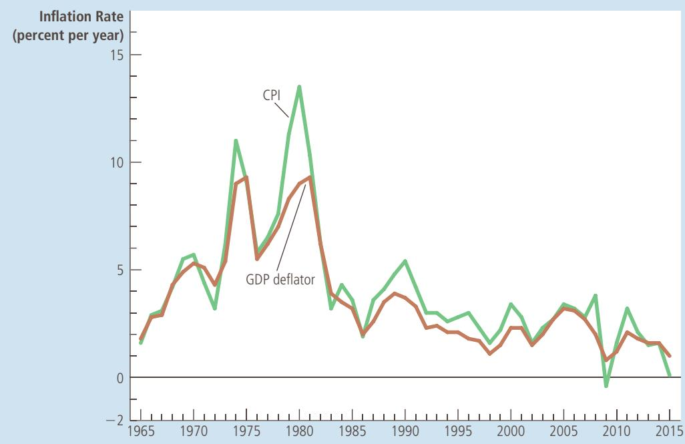
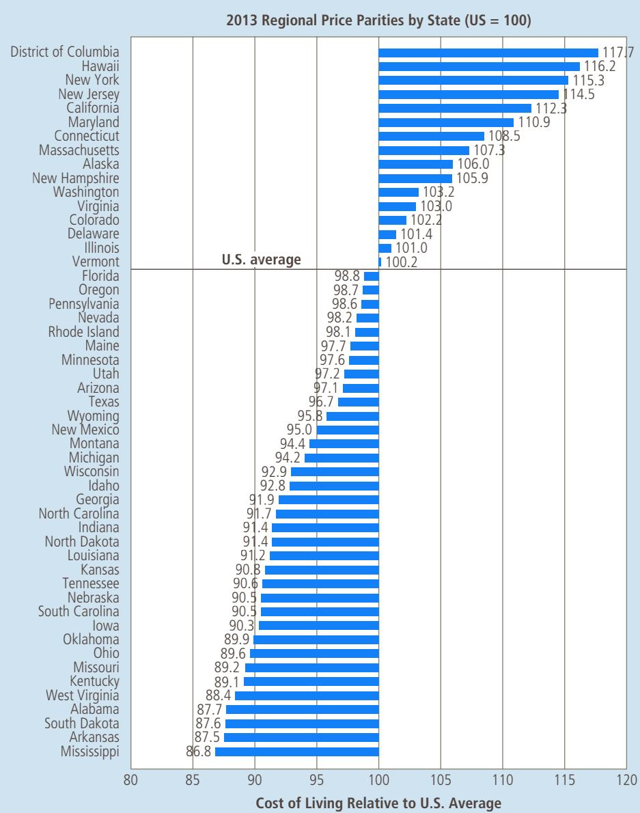
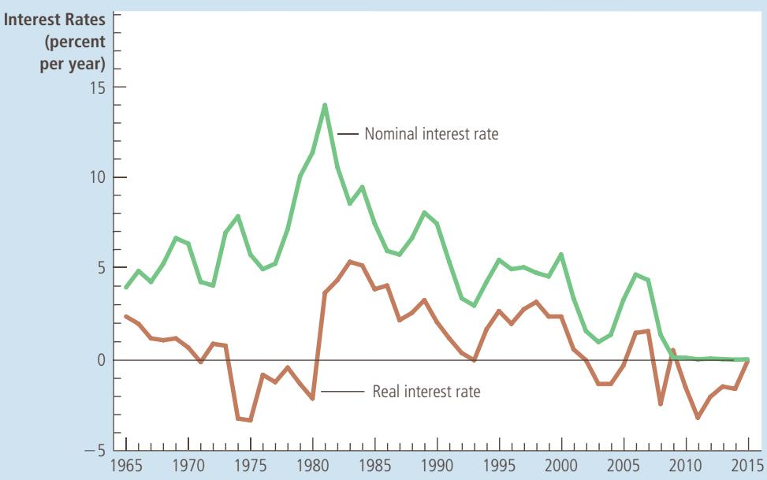

# IN THE NEWS

# Monitoring Inflation in the Internet Age

The web is providing alternative ways to collect data on the overall level of prices.

## Do We Need Google to Measure Inflation?

By Annie Lowrey

At some 23,000 retailers and businesses in 90 U.S. cities, hundreds of government workers find and mark down prices on very precise products. And I’m not kidding when I say “very precise.”

Say the relevant worker is finding the price for a motel room. She might write a report like this: Occupancy—two adults; Type of accommodation—deluxe room; Room classification/location—ocean view, room 306; Time of stay—weekend; Length of stay—one night; Bathroom facilities—one full bathroom; Kitchen facilities—none; Television—one, includes free movie channel; Telephone—one telephone, free local calls; Air-conditioned— yes; Meals included—breakfast; Parking—free self parking; Transportation—Transportation to airport, no charge; Recreation facilities—an indoor and an outdoor pool, a private beach, three tennis courts, and an exercise room.

This mind-numbingly tedious process goes on for a dizzying panoply of items:

wine, takeaway meals, bedroom furniture, surgical procedures, pet dogs, college tuition, cigarettes, haircuts, funerals. When all of the prices are marked down, the workers submit forms that are collated, checked, and input into massive spreadsheets. Then the government boils all those numbers down to one. It weights certain prices, taking into account that consumers spend more on rent than cereal, for instance. It considers product improvements and changes in spending habits. Then it comes up with a master number showing how much a customer’s spending needed to increase to buy the same goods, month-on-month. That number is the Consumer Price Index, the government’s main gauge of inflation.

Each month, the Bureau of Labor Statistics goes through all that hassle because knowing the rate of inflation is such an important measure of economic health—and it’s important to the government’s own budget. High inflation? Savers panic, watching the spending power of their accounts erode. Deflation? Everyone saves, awaiting cheaper prices in a few months. And wildly changing inflation makes it difficult for businesses and consumers to make economic decisions. Moreover, the government needs to know the rate of inflation to index certain payments, like Social Security benefits or interest payments on TIPS bonds.

But just because the government expends so much energy determining the rate of inflation does not mean it is tallying it in the smartest or most accurate way. The reigning methodology is, well, clunky. It costs Washington around \$234 million a year to get all those people to go and bear witness to a \$1.57 price increase in a packet of tube socks and then to massage those individual data points down to one number. Moreover, there is a weekslong lag between the checkers tallying up the numbers and the government announcing the changes: The inflation measure comes out only 12 times a year, though prices change, sometimes dramatically, all the time. Plus, the methodology is archaic, given that we live in the Internet age. Prices are easily available online and a lot of shopping happens on the Web rather than in stores.

But there might be a better way. In the last few months, economists have come up with new methods for calculating inflation at Internet speed—nimbler, cheaper, faster, and perhaps even more accurate than Washington’s. The first comes from the Massachusetts Institute of Technology. In

trying to compute the price of a basket of goods of constant quality. Despite these efforts, changes in quality remain a problem because quality is hard to measure.

There is still much debate among economists about how severe these measurement problems are and what should be done about them. Several studies written during the 1990s concluded that the CPI overstated inflation by about 1 percentage point per year. In response to this criticism, the BLS adopted several technical changes to improve the CPI, and many economists believe that the bias is now only about half as large as it once was. The issue is important because many government programs use the CPI to adjust for changes in the overall level of prices. Recipients of Social Security, for instance, get annual increases in benefits that are tied to the CPI. Some economists have suggested modifying these programs to correct for the measurement problems by, for instance, reducing the magnitude of the automatic benefit increases.

2007, economists Roberto Rigobon and Alberto Cavallo started tracking prices online and inputting them into a massive database. Then, last month, they unveiled the Billion Prices Project, an inflation measure based on 5 million items sold by 300 online retailers in 70 countries. (For the United States, the BPP collects about 500,000 prices.)

The BPP’s inflation measure is markedly different from the government’s. The economists just average all the prices culled online, meaning the basket of goods is whatever you can buy on the Web. (Some things, like books, are most often bought online. Some items, like cats, are not.) Plus, the researchers do not weight certain items’ prices, even if they tend to make up a bigger proportion of household spending.

Still, thus far, the BPP has tracked the CPI closely. And the online-based measure has additional advantages. It comes out daily, giving a better sense of inflation’s direction. It also lets researchers examine minute, day-to-day price changes. For instance, this month Rigobon and Cavallo noted that Black Friday discounts “had a smaller effect on average prices in 2010 than in 2009,” contrary to reports of deeper discounting this year. And it has already produced some academic insights. For instance, Cavallo found that retailers change prices less often, but more, percentage-wise, than economists previously thought.

A second inflation measure comes from Web behemoth Google and is a pet project of

the company’s chief economist, Hal Varian. As reported by the Financial Times, earlier this year, Varian decided to use Google’s vast database of Web prices to construct the “Google Price Index,” a constantly updated measure of price changes and inflation. (The idea came to him when he was searching for a pepper grinder online.) Google has not yet decided whether it will publish the price index, and has not released its methodology. But Varian said that his preliminary index tracked CPI closely, though it did show periods of deflation—the worrisome incidence of prices actually falling—where the CPI did not.

  
GOGO IMAGES CORPORATION / ALAMY  
“I wonder how much this costs online.”

The new indices lead to the big question of whether the government needs to update its methods to account for changes in the economy— taking new pricing trends into consideration, rejiggering its formula, updating more frequently. The answer might be yes. (Economists have reformed the CPI before.) But the CPI and its Stone Age method of calculation boasts one huge benefit: It’s a stable, tested measure, consistent over time, since its methodology doesn’t change much. Moreover, and somewhat remarkably, the Google and Billion Prices Project indices actually seem to confirm the accuracy of the old-fashioned CPI, tracking it closely rather than showing it to be off-base.

Ultimately, there is a good argument for more inflation measures, not just better or newer ones. The government already calculates a number of rates of inflation to give a fuller picture of price changes, the value of money, and the economy. Most notably, the BLS publishes a “core inflation” number, a measure of inflation outside volatile food and energy prices. There are dozens of other measures, as well. The new Webbased yardsticks provide even more alternatives and opportunities to examine the accuracy of the CPI—and to make new findings. That means, for now, those detective-like government rubes painstakingly checking prices on clipboards get to stay in work. ■

Source: Slate, December 20, 2010.

FEATURES SYNDICATE

## 11-1c The GDP Deflator versus the Consumer Price Index

In the preceding chapter, we examined another measure of the overall level of prices in the economy—the GDP deflator. The GDP deflator is the ratio of nominal GDP to real GDP. Because nominal GDP is current output valued at current prices and real GDP is current output valued at base-year prices, the GDP deflator reflects the current level of prices relative to the level of prices in the base year.

Economists and policymakers monitor both the GDP deflator and the CPI to gauge how quickly prices are rising. Usually, these two statistics tell a similar story. Yet two important differences can cause them to diverge.

The first difference is that the GDP deflator reflects the prices of all goods and services produced domestically, whereas the CPI reflects the prices of all goods and services bought by consumers. For example, suppose that the price of an airplane produced by Boeing and sold to the Air Force rises. Even though the plane is part of GDP, it is not part of the basket of goods and services bought by a typical consumer. Thus, the price increase shows up in the GDP deflator but not in the CPI.

FROM THE WALL STREET JOURNAL—PERMISSION, CARTOON

As another example, suppose that Volvo raises the price of its cars. Because Volvos are made in Sweden, the car is not part of U.S. GDP. But U.S. consumers buy Volvos, so the car is part of the typical consumer’s basket of goods. Hence, a price increase in an imported consumption good, such as a Volvo, shows up in the CPI but not in the GDP deflator.

  
“The price may seem a little high, but you have to remember that’s in today’s dollars.”

This first difference between the CPI and the GDP deflator is particularly important when the price of oil changes. The United States produces some oil, but much of the oil we use is imported. As a result, oil and oil products such as gasoline and heating oil make up a much larger share of consumer spending than of GDP. When the price of oil rises, the CPI rises by much more than does the GDP deflator.

The second and subtler difference between the GDP deflator and the CPI concerns how various prices are weighted to yield a single number for the overall level of prices. The CPI compares the price of a fixed basket of goods and services to the price of the basket in the base year. Only occasionally does the BLS change the basket of goods. By contrast, the GDP deflator compares the price of currently produced goods and services to the price of the same goods and services in the base year. Thus, the group of goods and services used to compute the GDP deflator changes automatically over time. This difference is not important when all prices are changing proportionately. But if the prices of different goods and services are changing by varying amounts, the way we weight the various prices matters for the overall inflation rate.

Figure 2 shows the inflation rate as measured by both the GDP deflator and the CPI for each year since 1965. You can see that sometimes the two measures diverge. When they do diverge, it is possible to go behind these numbers and explain the divergence with the two differences we have discussed. For example, in 1979 and 1980, CPI inflation spiked up more than the GDP deflator largely because oil prices more than doubled during these two years. Yet divergence between these two measures is the exception rather than the rule. In the 1970s, both the GDP deflator and the CPI show high rates of inflation. In the late 1980s, 1990s, and the first decade of the 2000s, both measures show low rates of inflation.

Explain briefly what the CPI measures and how it is constructed. • Identify one reason why the CPI is an imperfect measure of the

cost of living.

## FIGURE 2

## Two Measures of Inflation

This figure shows the inflation rate—the percentage change in the level of prices—as measured by the GDP deflator and the CPI using annual data since 1965. Notice that the two measures of inflation generally move together.

Source: U.S. Department of Labor; U.S. Department of Commerce.

## 11-2 Correcting Economic Variables for the Effects of Inflation

The purpose of measuring the overall level of prices in the economy is to allow us to compare dollar figures from different times. Now that we know how price indexes are calculated, let’s see how we might use such an index to compare a dollar figure from the past to a dollar figure in the present.

## 11-2a Dollar Figures from Different Times

We first return to the issue of Babe Ruth’s salary. Was his salary of \$80,000 in 1931 high or low compared to the salaries of today’s players?

To answer this question, we need to know the level of prices in 1931 and the level of prices today. Part of the increase in baseball salaries compensates players for higher prices today. To compare Ruth’s salary to those of today’s players, we need to inflate Ruth’s salary to turn 1931 dollars into today’s dollars.

The formula for turning dollar figures from year T into today’s dollars is the following:

$$
\text { Amount in today's dollars } = \text { Amount in year } T \text { dollars } \times \frac {\text { Price level today }}{\text { Price level in year } T}.
$$

A price index such as the CPI measures the price level and thus determines the size of the inflation correction.

Let’s apply this formula to Ruth’s salary. Government statistics show a CPI of 15.2 for 1931 and 237 for 2015. Thus, the overall level of prices has risen by a factor of 15.6 (calculated from 237/15.2). We can use these numbers to measure Ruth’s salary in 2015 dollars, as follows:

$$
\begin{array}{r l} \text {Salary in 2015 dollars} & = \text {Salary in 1931 dollars} \times \frac {\text {Price level in 2015}}{\text {Price level in 1931}} \\ & = \8 0, 0 0 0 \times \frac {2 3 7}{1 5 . 2} \\ & = \1, 2 4 7, 3 6 8. \end{array}
$$

We find that Babe Ruth’s 1931 salary is equivalent to a salary today of over \$1.2 million. That is a good income, but it is only a third of the average player’s salary today and only 4 percent of what the Dodgers pay Clayton Kershaw. Various forces, including overall economic growth and the increasing income shares earned by superstars, have substantially raised the living standards of the best athletes.

Let’s also examine President Hoover’s 1931 salary of \$75,000. To translate that figure into 2015 dollars, we again multiply the ratio of the price levels in the two years. We find that Hoover’s salary is equivalent to \$75,000 3 (237/15.2), or \$1,169,408 in 2015 dollars. This is well above President Barack Obama’s salary of \$400,000. It seems that President Hoover did have a pretty good year after all.

FYI

## Mr. Index Goes to Hollywood

Movie popularity is usually gauged by box office receipts. By that measure, Star Wars: The Force Awakens is the number-one movie of all time with domestic receipts of \$923 million, followed

by Avatar (\$761 million) a n d Tita n ic ( \$ 6 5 9 million). But this ranking ignores an obvious but important fact: Prices, including those of movie tickets, have been rising

  
“May the force of inflation be with you.”

over time. Inflation gives an advantage to newer films.

LUCAS FILMS/BADROBOT/WALTDISNEYPRODUCTIONS /

When we correct box office receipts for the effects of inflation, the story is very different. The number-one movie is now Gone with the Wind (\$1,758 million), followed by the original Star Wars (\$1,550 million) and The Sound of Music (\$1,239 million). Star Wars: The Force Awakens falls to number 11.

Gone with the Wind was released in 1939, before everyone had televisions in their homes. In the 1930s, about 90 million Americans went to the cinema each week, compared to about 25 million today. But the movies from that era don’t show up in conventional popularity rankings because ticket prices were only a quarter. And indeed, in the ranking based on nominal box office receipts, Gone with the Wind does not make the top 100 films. Scarlett and Rhett fare a lot better once we correct for the effects of inflation. ■

when comparing them. The cost of living varies not only over time but also over geography. What seems like a larger paycheck might not turn out to be so once you take into account regional differences in the prices of goods and services.

The Bureau of Economic Analysis has used the data collected for the CPI to compare prices around the United States. The resulting statistic is called regional price parities. Just as the CPI measures variation in the cost of living from year to year, regional price parities measure variation in the cost of living from state to state.

Figure 3 shows the regional price parities for 2013. For example, living in the state of New York costs 115.3 percent of what it costs to live in the typical place in the United States (that is, New York is 15.3 percent more expensive than average).

  
Copyright 2018 Cengage Learning. All Rights Reserved. May not be copied, scanned, or duplicated, in whole or in part. WCN 02-200-203

## FIGURE 3

Regional Variation in the Cost of Living This figure shows how the cost of living in the fifty U.S. states and the District of Columbia compares to the U.S. average.

S o u r c e : U.S. Department of Commerce. Data are for 2013.

Living in Mississippi costs 86.8 percent of what it costs to live in the typical place (that is, Mississippi is 13.2 percent less expensive than average).

What accounts for these differences? It turns out that the prices of goods, such as food and clothing, explain only a small part of these regional differences. Most goods are tradable: They can be easily transported from one state to another. As a consequence of regional trade, large price disparities are unlikely to persist for long.

Services explain a larger part of these regional differences. A haircut, for example, can cost more in one state than another. If barbers were willing to move to where the price of a haircut is high, or if customers were willing to fly across the country in search of cheap haircuts, then the prices of haircuts across regions might well converge. But because transporting haircuts is so costly, large price disparities can persist.

Housing services are particularly important for understanding regional differences in the cost of living. Such services represent a large share of a typical consumer’s budget. Moreover, once built, a house or apartment building can’t easily be moved, and the land on which it sits is completely immobile. As a result, differences in housing costs can be persistently large. For example, rents in New York are almost twice what they are in Mississippi.

Keep these facts in mind when it comes time to compare job offers. Look not only at the dollar salaries but also at the local prices of goods and services, especially housing. ●

## 11-2b Indexation

As we have just seen, price indexes are used to correct for the effects of inflation when comparing dollar figures from different times. This type of correction shows up in many places in the economy. When some dollar amount is automatically corrected for changes in the price level by law or contract, the amount is said to be indexed for inflation.

## indexation

the automatic correction by law or contract of a dollar amount for the effects of inflation

For example, many long-term contracts between firms and unions include partial or complete indexation of the wage to the CPI. Such a provision, called a cost-ofliving allowance (or COLA), automatically raises the wage when the CPI rises.

Indexation is also a feature of many laws. Social Security benefits, for instance, are adjusted every year to compensate the elderly for increases in prices. The brackets of the federal income tax—the income levels at which the tax rates change—are also indexed for inflation. There are, however, many ways in which the tax system is not indexed for inflation, even when perhaps it should be. We discuss these issues more fully when we discuss the costs of inflation later in this book.

## 11-2c Real and Nominal Interest Rates

Correcting economic variables for the effects of inflation is particularly important, and somewhat tricky, when we look at data on interest rates. The very concept of an interest rate necessarily involves comparing amounts of money at different points in time. When you deposit your savings in a bank account, you give the bank some money now, and the bank returns your deposit with interest in the future. Similarly, when you borrow from a bank, you get some money now, but you will have to repay the loan with interest in the future. In both cases, to fully understand the deal between you and the bank, it is crucial to acknowledge that future dollars could have a different value than today’s dollars. That is, you have to correct for the effects of inflation.

Let’s consider an example. Suppose Sally Saver deposits \$1,000 in a bank account that pays an annual interest rate of 10 percent. A year later, after Sally has accumulated \$100 in interest, she withdraws her \$1,100. Is Sally \$100 richer than she was when she made the deposit a year earlier?

The answer depends on what we mean by “richer.” Sally does have \$100 more than she had before. In other words, the number of dollars in her possession has risen by 10 percent. But Sally does not care about the amount of money itself: She cares about what she can buy with it. If prices have risen while her money was in the bank, each dollar now buys less than it did a year ago. In this case, her purchasing power—the amount of goods and services she can buy—has not risen by 10 percent.

To keep things simple, let’s suppose that Sally is a movie fan and buys only DVDs. When Sally made her deposit, a DVD cost \$10. Her deposit of \$1,000 was equivalent to 100 DVDs. A year later, after getting her 10 percent interest, she has \$1,100. How many DVDs can she buy now? It depends on what has happened to the price of a DVD. Here are some examples:

•	 Zero inflation: If the price of a DVD remains at \$10, the amount she can buy has risen from 100 to 110 DVDs. The 10 percent increase in the number of dollars means a 10 percent increase in her purchasing power.

•	 Six percent inflation: If the price of a DVD rises from \$10 to \$10.60, then the number of DVDs she can buy has risen from 100 to approximately 104. Her purchasing power has increased by about 4 percent.

Ten percent inflation: If the price of a DVD rises from \$10 to \$11, she can still buy only 100 DVDs. Even though Sally’s dollar wealth has risen, her purchasing power is the same as it was a year earlier.

•	 Twelve percent inflation: If the price of a DVD increases from \$10 to \$11.20, the number of DVDs she can buy has fallen from 100 to approximately 98. Even with her greater number of dollars, her purchasing power has decreased by about 2 percent.

And if Sally were living in an economy with deflation—falling prices—another possibility could arise:

•	 Two percent deflation: If the price of a DVD falls from \$10 to \$9.80, then the number of DVDs she can buy rises from 100 to approximately 112. Her purchasing power increases by about 12 percent.

These examples show that the higher the rate of inflation, the smaller the increase in Sally’s purchasing power. If the rate of inflation exceeds the rate of interest, her purchasing power actually falls. And if there is deflation (that is, a negative rate of inflation), her purchasing power rises by more than the rate of interest.

To understand how much a person earns in a savings account, we need to consider both the interest rate and the change in prices. The interest rate that measures the change in dollar amounts is called the nominal interest rate, and the interest rate corrected for inflation is called the real interest rate. The nominal interest rate, the real interest rate, and inflation are related approximately as follows:

$$
\text {Real interest rate} = \text {Nominal interest rate} - \text {Inflation rate}.
$$

The real interest rate is the difference between the nominal interest rate and the rate of inflation. The nominal interest rate tells you how fast the number of dollars in your bank account rises over time, while the real interest rate tells you how fast the purchasing power of your bank account rises over time.

## FIGURE 4

## Real and Nominal Interest Rates

This figure shows nominal and real interest rates using annual data since 1965. The nominal interest rate is the rate on a threemonth Treasury bill. The real interest rate is the nominal interest rate minus the inflation rate as measured by the CPI. Notice that nominal and real interest rates often do not move together.

S o u rc e : U.S. Department of Labor; U.S. Department of Treasury.

## INTEREST RATES IN THE U.S. ECONOMY

Figure 4 shows real and nominal interest rates in the U.S. economy since 1965. The nominal interest rate in this figure is the rate on threemonth Treasury bills (although data on other interest rates would be similar). The real interest rate is computed by subtracting the rate of inflation from this nominal interest rate. Here the inflation rate is measured as the percentage change in the CPI.

One feature of this figure is that the nominal interest rate almost always exceeds the real interest rate. This reflects the fact that the U.S. economy has experienced rising consumer prices in almost every year during this period. By contrast, if you look at data for the U.S. economy during the late 19th century or for the Japanese economy in some recent years, you will find periods of deflation. During deflation, the real interest rate exceeds the nominal interest rate.

The figure also shows that because inflation is variable, real and nominal interest rates do not always move together. For example, in the late 1970s, nominal interest rates were high. But because inflation was very high, real interest rates were low. Indeed, during much of the 1970s, real interest rates were negative, for inflation eroded people’s savings more quickly than nominal interest payments increased them. By contrast, in the late 1990s, nominal interest rates were lower than they had been two decades earlier. But because inflation was much lower, real interest rates were higher. In the coming chapters, we will examine the economic forces that determine both real and nominal interest rates. ●

## QuickQuiz

Henry Ford paid his workers \$5 a day in 1914. If the CPI was 10 in 1914 and 237 in 2015, how much is the Ford paycheck worth in 2015 dollars?

## 11-3 Conclusion

“A nickel ain’t worth a dime anymore,” the late, great baseball player Yogi Berra once observed. Indeed, throughout recent history, the real values behind the nickel, the dime, and the dollar have not been stable. Persistent increases in the overall level of prices have been the norm. Such inflation reduces the purchasing power of each unit of money over time. When comparing dollar figures from different times, it is important to keep in mind that a dollar today is not the same as a dollar 20 years ago or, most likely, 20 years from now.

This chapter has discussed how economists measure the overall level of prices in the economy and how they use price indexes to correct economic variables for the effects of inflation. Price indexes allow us to compare dollar figures from different points in time and, therefore, get a better sense of how the economy is changing.

The discussion of price indexes in this chapter, together with the preceding chapter’s discussion of GDP, is only the first step in the study of macroeconomics. We have not yet examined what determines a nation’s GDP or the causes and effects of inflation. To do that, we need to go beyond issues of measurement. Indeed, that is our next task. Having explained how economists measure macroeconomic quantities and prices in the past two chapters, we are now ready to develop the models that explain movements in these variables.

Here is our strategy in the upcoming chapters. First, we look at the long-run determinants of real GDP and related variables, such as saving, investment, real interest rates, and unemployment. Second, we look at the long-run determinants of the price level and related variables, such as the money supply, inflation, and nominal interest rates. Last of all, having seen how these variables are determined in the long run, we examine the more complex question of what causes short-run fluctuations in real GDP and the price level. In all of these chapters, the measurement issues we have just discussed will provide the foundation for the analysis.

## CHAPTER QuickQuiz

1. The CPI measures approximately the same economic phenomenon as a. nominal GDP. b. real GDP. c. the GDP deflator. d. the unemployment rate.

2. The largest component in the basket of goods and services used to compute the CPI is a. food and beverages. b. housing. c. medical care. d. apparel.

3. If a Pennsylvania gun manufacturer raises the price of rifles it sells to the U.S. Army, its price hikes will increase

a. both the CPI and the GDP deflator.

b. neither the CPI nor the GDP deflator.

c. the CPI but not the GDP deflator.

d. the GDP deflator but not the CPI.

4. Because consumers can sometimes substitute cheaper goods for those that have risen in price, a. the CPI overstates inflation. b. the CPI understates inflation. c. the GDP deflator overstates inflation. d. the GDP deflator understates inflation.

5. If the CPI is 200 in year 1980 and 300 today, then \$600 in 1980 has the same purchasing power as today. a. \$400 b. \$500 c. \$700 d. \$900

6. You deposit \$2,000 in a savings account, and a year later you have \$2,100. Meanwhile, the CPI rises from 200 to 204. In this case, the nominal interest rate is \_\_\_\_\_ percent, and the real interest rate is percent.

a. 1, 5

b. 3, 5

c. 5, 1

d. 5, 3

## SUMMARY

The consumer price index (CPI) shows the cost of a basket of goods and services relative to the cost of the same basket in the base year. The index is used to measure the overall level of prices in the economy. The percentage change in the CPI measures the inflation rate.

The CPI is an imperfect measure of the cost of living for three reasons. First, it does not take into account consumers’ ability to substitute toward goods that become relatively cheaper over time. Second, it does not take into account increases in the purchasing power of the dollar due to the introduction of new goods. Third, it is distorted by unmeasured changes in the quality of goods and services. Because of these measurement problems, the CPI overstates true inflation.

Like the CPI, the GDP deflator measures the overall level of prices in the economy. The two price indexes usually move together, but there are important differences. The GDP deflator differs from the CPI because it includes goods and services produced rather than goods and services consumed. As a result, imported goods affect the CPI but not the GDP deflator. In addition, while the CPI uses a fixed basket of goods, the GDP deflator automatically changes the group of goods and services over time as the composition of GDP changes.

Dollar figures from different times do not represent a valid comparison of purchasing power. To compare a dollar figure from the past to a dollar figure today, the older figure should be inflated using a price index.

Various laws and private contracts use price indexes to correct for the effects of inflation. The tax laws, however, are only partially indexed for inflation.

A correction for inflation is especially important when looking at data on interest rates. The nominal interest rate is the interest rate usually reported; it is the rate at which the number of dollars in a savings account increases over time. By contrast, the real interest rate takes into account changes in the value of the dollar over time. The real interest rate equals the nominal interest rate minus the rate of inflation.

## KEY CONCEPTS

consumer price index (CPI), p. 212 inflation rate, p. 214 core CPI, p. 215

producer price index, p. 215 indexation, p. 222

nominal interest rate, p. 223 real interest rate, p. 223

## QUESTIONS FOR REVIEW

1. Which do you think has a greater effect on the CPI: a 10 percent increase in the price of chicken or a 10 percent increase in the price of caviar? Why?

2. Describe the three problems that make the CPI an imperfect measure of the cost of living.

3. If the price of imported French wine rises, is the CPI or the GDP deflator affected more? Why?

4. Over a long period of time, the price of a candy bar rose from \$0.20 to \$1.20. Over the same period, the CPI rose from 150 to 300. Adjusted for overall inflation, how much did the price of the candy bar change?

5. Explain the meaning of nominal interest rate and real interest rate. How are they related?

## PROBLEMS AND APPLICATIONS

1. Suppose that the year you were born someone bought \$100 of goods and services for your baby shower. How much would you guess it would cost today to buy a similar amount of goods and services? Now find data on the CPI and compute the answer based on it. (You can find the BLS’s inflation calculator here: http:// www.bls.gov/data/inflation\_calculator.htm).

2. The residents of Vegopia spend all of their income on cauliflower, broccoli, and carrots. In 2016, they spend a total of \$200 for 100 heads of cauliflower, \$75 for 50 bunches of broccoli, and \$50 for 500 carrots. In 2017, they spend a total of \$225 for 75 heads of cauliflower, \$120 for 80 bunches of broccoli, and \$100 for 500 carrots.

a. Calculate the price of one unit of each vegetable in each year.

b. Using 2016 as the base year, calculate the CPI for each year.

c. What is the inflation rate in 2017?

3. Suppose that people consume only three goods, as shown in this table:

<table><tr><td></td><td>Tennis Balls</td><td>Golf Balls</td><td>Bottles of Gatorade</td></tr><tr><td>2017 price</td><td>$2</td><td>$4</td><td>$1</td></tr><tr><td>2017 quantity</td><td>100</td><td>100</td><td>200</td></tr><tr><td>2018 price</td><td>$2</td><td>$6</td><td>$2</td></tr><tr><td>2018 quantity</td><td>100</td><td>100</td><td>200</td></tr></table>

a. What is the percentage change in the price of each of the three goods?

b. Using a method similar to the CPI, compute the percentage change in the overall price level.

c. If you were to learn that a bottle of Gatorade increased in size from 2017 to 2018, should that information affect your calculation of the inflation rate? If so, how?

d. If you were to learn that Gatorade introduced new flavors in 2018, should that information affect your calculation of the inflation rate? If so, how?

4. Go to the website of the Bureau of Labor Statistics (http://www.bls.gov) and find data on the CPI. By how much has the index including all items risen over the past year? For which categories of spending have prices risen the most? The least? Have any categories experienced price declines? Can you explain any of these facts?

5. A small nation of ten people idolizes the TV show The Voice. All they produce and consume are karaoke machines and CDs, in the following amounts:

<table><tr><td rowspan="2"></td><td colspan="2">Karaoke Machines</td><td colspan="2">CDs</td></tr><tr><td>Quantity</td><td>Price</td><td>Quantity</td><td>Price</td></tr><tr><td>2017</td><td>10</td><td>$40</td><td>30</td><td>$10</td></tr><tr><td>2018</td><td>12</td><td>60</td><td>50</td><td>12</td></tr></table>

a. Using a method similar to the CPI, compute the percentage change in the overall price level. Use 2017 as the base year and fix the basket at 1 karaoke machine and 3 CDs.

b. Using a method similar to the GDP deflator, compute the percentage change in the overall price level. Also use 2017 as the base year.

c. Is the inflation rate in 2018 the same using the two methods? Explain why or why not.

6. Which of the problems in the construction of the CPI might be illustrated by each of the following situations? Explain.

a. the invention of cell phones

b. the introduction of air bags in cars

c. increased personal computer purchases in response to a decline in their price

d. more scoops of raisins in each package of Raisin Bran

e. greater use of fuel-efficient cars after gasoline prices increase

7. A dozen eggs cost \$0.88 in January 1980 and \$2.11 in January 2015. The average wage for production workers was \$7.58 per hour in January 1980 and \$19.64 in January 2015.

a. By what percentage did the price of eggs rise?

b. By what percentage did the wage rise?

c. In each year, how many minutes did a worker have to work to earn enough to buy a dozen eggs?

d. Did workers’ purchasing power in terms of eggs rise or fall?

8. The chapter explains that Social Security benefits are increased each year in proportion to the increase in the CPI, even though most economists believe that the CPI overstates actual inflation.

a. If the elderly consume the same market basket as other people, does Social Security provide the elderly with an improvement in their standard of living each year? Explain.

b. In fact, the elderly consume more healthcare compared to younger people, and healthcare costs have risen faster than overall inflation. What would you do to determine whether the elderly are actually better off from year to year?

9. Suppose that a borrower and a lender agree on the nominal interest rate to be paid on a loan. Then inflation turns out to be higher than they both expected. a. Is the real interest rate on this loan higher or lower than expected?

b. Does the lender gain or lose from this unexpectedly high inflation? Does the borrower gain or lose?

c. Inflation during the 1970s was much higher than most people had expected when the decade began. How did this affect homeowners who obtained fixed-rate mortgages during the 1960s? How did it affect the banks that lent the money?

To find additional study resources, visit cengagebrain.com, and search for “Mankiw.”

PART V
