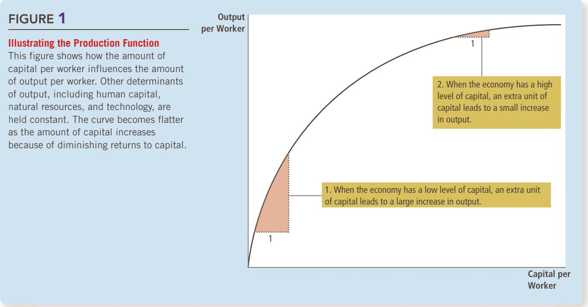

# The Real Economy in the Long Run

## Production and Growth

When you travel around the world, you see tremendous variation in thestandard of living. The average income in a rich country, such as the United standard of living. The average income in a rich country, such as the United States, Japan, or Germany, is about ten times the average income in a poor country, such as India, Nigeria, or Nicaragua. These large differences in income are reflected in large differences in the quality of life. People in richer countries have better nutrition, safer housing, better healthcare, and longer life expectancy as well as more automobiles, more telephones, and more computers.

Even within a country, there are large changes in the standard of living over time. In the United States over the past century, average income as measured by real gross domestic product (GDP) per person has grown by about 2 percent per year. Although 2 percent might

seem small, this rate of growth implies that average income doubles every 35 years. Because of this growth, most Americans enjoy much greater economic prosperity than did their parents, grandparents, and great-grandparents.

Growth rates vary substantially from country to country. From 2000 to 2014, GDP per person in China grew at a rate of 11 percent per year, accumulating to a 357 percent increase in average income. A country experiencing such rapid growth can, in one generation, go from being among the poorest in the world to being among the richest. By contrast, in the same time span, income per person in Zimbabwe fell by a total of 13 percent, leaving the typical citizen mired in poverty.

What explains these diverse experiences? How can rich countries maintain their high standard of living? What policies can poor countries pursue to promote more rapid growth and join the developed world? These are among the most important questions in macroeconomics. As the Nobel-Prize-winning economist Robert Lucas put it, “The consequences for human welfare in questions like these are simply staggering: Once one starts to think about them, it is hard to think about anything else.”

In the previous two chapters, we discussed how economists measure macroeconomic quantities and prices. We can now begin to study the forces that determine these variables. As we have seen, an economy’s GDP measures both the total income earned in the economy and the total expenditure on the economy’s output of goods and services. The level of real GDP is a good gauge of economic prosperity, and the growth of real GDP is a good gauge of economic progress. In this chapter we focus on the long-run determinants of the level and growth of real GDP. Later, we study the short-run fluctuations of real GDP around its long-run trend.

We proceed here in three steps. First, we examine international data on real GDP per person. These data will give you some sense of how much the level and growth of living standards vary around the world. Second, we examine the role of productivity—the amount of goods and services produced for each hour of a worker’s time. In particular, we see that a nation’s standard of living is determined by the productivity of its workers, and we consider the factors that determine a nation’s productivity. Third, we consider the link between productivity and the economic policies that a nation pursues.

## 12-1 Economic Growth around the World

As a starting point for our study of long-run growth, let’s look at the experiences of some of the world’s economies. Table 1 shows data on real GDP per person for thirteen countries. For each country, the data span over a century of history. The first and second columns of the table present the countries and time periods. (The time periods differ somewhat from country to country because of differences in data availability.) The third and fourth columns show estimates of real GDP per person more than a century ago and for a recent year.

The data on real GDP per person show that living standards vary widely from country to country. Income per person in the United States, for instance, is now about four times that in China and about ten times that in India. The poorest countries have average levels of income not seen in the developed world for many decades. The typical resident of Pakistan in 2014 had about the same real income as the typical resident of the United Kingdom in 1870. The typical Bangladeshi in 2014 had considerably less real income than a typical American in 1870.

<table><tr><td rowspan="2">Country</td><td rowspan="2">Period</td><td colspan="2">Real GDP per Person</td><td rowspan="2">Growth Rate (per year)</td></tr><tr><td>At Beginning of  $Period^a$ </td><td>At End of  $Period^a$ </td></tr><tr><td>Brazil</td><td>1900–2014</td><td>$ 828</td><td>$15,590</td><td>2.61%</td></tr><tr><td>Japan</td><td>1890–2014</td><td>1,600</td><td>37,920</td><td>2.59</td></tr><tr><td>China</td><td>1900–2014</td><td>762</td><td>13,170</td><td>2.53</td></tr><tr><td>Mexico</td><td>1900–2014</td><td>1,233</td><td>16,640</td><td>2.31</td></tr><tr><td>Germany</td><td>1870–2014</td><td>2,324</td><td>46,850</td><td>2.11</td></tr><tr><td>Indonesia</td><td>1900–2014</td><td>948</td><td>10,190</td><td>2.10</td></tr><tr><td>Canada</td><td>1870–2014</td><td>2,527</td><td>43,360</td><td>1.99</td></tr><tr><td>India</td><td>1900–2014</td><td>718</td><td>5,630</td><td>1.82</td></tr><tr><td>United States</td><td>1870–2014</td><td>4,264</td><td>55,860</td><td>1.80</td></tr><tr><td>Pakistan</td><td>1900–2014</td><td>785</td><td>5,090</td><td>1.65</td></tr><tr><td>Argentina</td><td>1900–2014</td><td>2,440</td><td>12,510</td><td>1.44</td></tr><tr><td>Bangladesh</td><td>1900–2014</td><td>663</td><td>3,330</td><td>1.43</td></tr><tr><td>United Kingdom</td><td>1870–2014</td><td>5,117</td><td>39,040</td><td>1.42</td></tr></table>

TABLE 1  
The Variety of Growth Experiences  
aReal GDP is measured in 2014 dollars.  
Sourc e: Robert J. Barro and Xavier Sala-i-Martin, Economic Growth (New York: McGraw-Hill, 1995), Tables 10.2 and 10.3; World Bank online data; and author’ calculations. To account for international price differences, data are PPP-adjusted when available.

The last column of the table shows each country’s growth rate. The growth rate measures how rapidly real income per person grew in the typical year. In the United States, for example, where real income per person was \$4,264 in 1870 and \$55,860 in 2014, the growth rate was 1.80 percent per year. This means that if real income per person, beginning at \$4,264, were to increase by 1.80 percent for each of 144 years, it would end up at \$55,860. Of course, income did not rise exactly 1.80 percent every year: Some years it rose by more, other years it rose by less, and in still other years it fell. The growth rate of 1.80 percent per year ignores short-run fluctuations around the long-run trend and represents an average rate of growth for real income per person over many years.

The countries in Table 1 are ordered by their growth rate from the most to the least rapid. Here you can see the large variety in growth experiences. High on the list are Brazil and China, which went from being among the poorest nations in the world to being among middle-income nations. Also high on the list is Japan, which went from being a middle-income nation to being among the richest nations.

Near the bottom of the list you can find Pakistan and Bangladesh, which were among the poorest nations at the end of the nineteenth century and remain so today. At the bottom of the list is the United Kingdom. In 1870, the United Kingdom was the richest country in the world, with average income about 20 percent higher than that of the United States and more than twice Canada’s. Today, average income in the United Kingdom is 30 percent below that of the United States and 10 percent below Canada’s.

These data show that the world’s richest countries have no guarantee they will stay the richest and that the world’s poorest countries are not doomed to remain forever in poverty. But what explains these changes over time? Why do some countries zoom ahead while others lag behind? These are precisely the questions that we take up next.

What has been the approximate long-run growth rate of real GDP per person QuickQuiz in the United States? Name a country that has had faster growth and a country that has had slower growth.

## 12-2 Productivity: Its Role and Determinants

Explaining why living standards vary so much around the world is, in one sense, very easy. The answer can be summarized in a single word—productivity. But in another sense, the international variation in living standards is deeply puzzling. To explain why incomes are so much higher in some countries than in others, we must look at the many factors that determine a nation’s productivity.

## 12-2a Why Productivity Is So Important

Let’s begin our study of productivity and economic growth by developing a simple model based loosely on Daniel Defoe’s famous novel Robinson Crusoe about a sailor stranded on a desert island. Because Crusoe lives alone, he

## FYI

## Are You Richer Than the Richest American?

merican Heritage magazine once published a list of the richest Americans of all time. The number 1 spot went to John D. Rockefeller, the oil entrepreneur who lived from 1839 to 1937. According to the magazine’s calculations, his wealth would today be the equivalent of about \$200 billion, almost three times that of Bill Gates, the software entrepreneur who is today’s richest American.

Despite his great wealth, Rockefeller did not enjoy many of the conveniences that we now take for granted. He couldn’t watch television, play video games, surf the Internet, or send e-mail. During the heat of

BETTMANN/GETTY IMAGES

  
John D. Rockefeller

summer, he couldn’t cool his home with air-conditioning. For much of his life, he couldn’t travel by car or plane, and he couldn’t use a telephone to call friends or family. If he became ill, he couldn’t take advantage of many medicines, such as antibiotics, that doctors today routinely use to prolong and enhance life.

Now consider: How m u c h m o n e y w o u l d someone have to pay you to give up for the rest of your life all the modern conveniences that Rockefeller

## lived without? Would you do it for \$200

billion? Perhaps not. And if you wouldn’t, is it fair to say that you are better off than John D. Rockefeller, allegedly the richest American ever?

The preceding chapter discussed how standard price indexes, which are used to compare sums of money from different points in time, fail to fully reflect the introduction of new goods in the economy. As a result, the rate of inflation is overestimated. The flip side of this observation is that the rate of real economic growth is underestimated. Pondering Rockefeller’s life shows how significant this problem might be. Because of tremendous technological advances, the average American today is arguably “richer” than the richest American a century ago, even if that fact is lost in standard economic statistics. ■

catches his own fish, grows his own vegetables, and makes his own clothes. We can think of Crusoe’s activities—his production and consumption of fish, vegetables, and clothing—as a simple economy. By examining Crusoe’s economy, we can learn some lessons that also apply to more complex and realistic economies.

What determines Crusoe’s standard of living? In a word, productivity, the quantity of goods and services produced from each unit of labor input. If Crusoe is good at catching fish, growing vegetables, and making clothes, he lives well. If he is bad at doing these things, he lives poorly. Because Crusoe gets to consume only what he produces, his living standard is tied to his productivity.

In the case of Crusoe’s economy, it is easy to see that productivity is the key determinant of living standards and that growth in productivity is the key determinant of growth in living standards. The more fish Crusoe can catch per hour, the more he eats at dinner. If Crusoe finds a better place to catch fish, his productivity rises. This increase in productivity makes Crusoe better off: He can eat the extra fish, or he can spend less time fishing and devote more time to making other goods he enjoys.

Productivity’s key role in determining living standards is as true for nations as it is for stranded sailors. Recall that an economy’s GDP measures two things at once: the total income earned by everyone in the economy and the total expenditure on the economy’s output of goods and services. GDP can measure these two things simultaneously because, for the economy as a whole, they must be equal. Put simply, an economy’s income is the economy’s output.

Like Crusoe, a nation can enjoy a high standard of living only if it can produce a large quantity of goods and services. Americans live better than Nigerians because American workers are more productive than Nigerian workers. The Japanese have enjoyed more rapid growth in living standards than Argentineans because Japanese workers have experienced more rapid growth in productivity. Indeed, one of the Ten Principles of Economics in Chapter  1 is that a country’s standard of living depends on its ability to produce goods and services.

Hence, to understand the large differences in living standards we observe across countries or over time, we must focus on the production of goods and services. But seeing the link between living standards and productivity is only the first step. It leads naturally to the next question: Why are some economies so much better at producing goods and services than others?

## 12-2b How Productivity Is Determined

Although productivity is uniquely important in determining Robinson Crusoe’s standard of living, many factors determine Crusoe’s productivity. Crusoe will be better at catching fish, for instance, if he has more fishing poles, if he has been trained in the best fishing techniques, if his island has a plentiful fish supply, or if he invents a better fishing lure. Each of these determinants of Crusoe’s productivity—which we can call physical capital, human capital, natural resources, and technological knowledge—has a counterpart in more complex and realistic economies. Let’s consider each factor in turn.

Physical Capital per Worker Workers are more productive if they have tools with which to work. The stock of equipment and structures used to produce goods and services is called physical capital, or just capital. For example,

## FYI

## A Picture Is Worth a Thousand Statistics

eorge Bernard Shaw once said, “It is the mark of a truly intelligent person to be moved by statistics.” Most of us, however, have trouble being moved by data on GDP—until we see with our own eyes what these statistics represent.

The three photos on these pages show a typical family from each of three countries—the United Kingdom, Mexico, and Mali. Each family was photographed outside their home, together with all their material possessions.

These nations have very different standards of living, as judged by these photos, GDP, or other statistics.

The United Kingdom is an advanced economy. In 2014, its income per person was \$39,040. A baby born in the United Kingdom can expect a relatively healthy childhood: Only 4 out of 1,000 children die before reaching age 5. Almost the entire population has access to modern sanitation facilities, such as a bathroom and sewer system, to safely remove human waste. Educational attainment is high: Among individuals of college age, 60 percent are enrolled in higher education.

Mexico is a middle-income country. In 2014, its income per person was \$16,640. About 13 out of 1,000 children die

before age 5. About 85 percent

have access to modern sanitation. Among those of college age, 30 percent are enrolled.

Mali is a poor country. In 2014, its income per person was only \$1,510. Life is often cut short: 115 out of 1,000 children die before age 5. Only 25 percent of the population has access to modern sanitation. And educational attainment in Mali is low: Among those of college age, only 7 percent are enrolled.

Economists who study economic growth try to understand what causes such large differences in the standard of living. ■

  
A Typical Family in the United Kingdom  
DAVID REED - FROM MATER IAL WORLD

PETERMENZEL/MENZELPHOTO.COM

A Typical Family in Mexico  
  
PETERMENZEL/MENZELPHOTO.COM  
A Typical Family in Mali

when woodworkers make furniture, they use saws, lathes, and drill presses. More tools allow the woodworkers to produce their output more quickly and more accurately: A worker with only basic hand tools can make less furniture each week than a worker with sophisticated and specialized woodworking equipment.

As you may recall, the inputs used to produce goods and services—labor, capital, and so on—are called the factors of production. An important feature of capital is that it is a produced factor of production. That is, capital is an input into the production process that in the past was an output from the production process. The woodworker uses a lathe to make the leg of a table. Earlier, the lathe itself was the output of a firm that manufactures lathes. The lathe manufacturer in turn used other equipment to make its product. Thus, capital is a factor of production used to produce all kinds of goods and services, including more capital.

Human Capital per Worker A second determinant of productivity is human capital. Human capital is the economist’s term for the knowledge and skills that workers acquire through education, training, and experience. Human capital includes the skills accumulated in early childhood programs, grade school, high school, college, and on-the-job training for adults in the labor force.

Education, training, and experience are less tangible than lathes, bulldozers, and buildings, but human capital is similar to physical capital in many ways. Like physical capital, human capital raises a nation’s ability to produce goods and services. Also like physical capital, human capital is a produced factor of production. Producing human capital requires inputs in the form of teachers, libraries, and student time. Indeed, students can be viewed as “workers” who have the important job of producing the human capital that will be used in future production.

Natural Resources per Worker A third determinant of productivity is natural resources. Natural resources are inputs into production that are provided by nature, such as land, rivers, and mineral deposits. Natural resources take two forms: renewable and nonrenewable. A forest is an example of a renewable resource. When one tree is cut down, a seedling can be planted in its place to be harvested in the future. Oil is an example of a nonrenewable resource. Because oil is produced by nature over many millions of years, there is only a limited supply. Once the supply of oil is depleted, it is impossible to create more.

Differences in natural resources are responsible for some of the differences in standards of living around the world. The historical success of the United States was driven in part by the large supply of land well suited for agriculture. Today, some countries in the Middle East, such as Kuwait and Saudi Arabia, are rich simply because they happen to be on top of some of the largest pools of oil in the world.

Although natural resources can be important, they are not necessary for an economy to be highly productive in producing goods and services. Japan, for instance, is one of the richest countries in the world, despite having few natural resources. International trade makes Japan’s success possible. Japan imports many of the natural resources it needs, such as oil, and exports its manufactured goods to economies rich in natural resources.

Technological Knowledge A fourth determinant of productivity is technological knowledge—the understanding of the best ways to produce goods and services. A hundred years ago, most Americans worked on farms because farm technology required a high input of labor to feed the entire population. Today, thanks to advances in farming technology, a small fraction of the population can produce enough food to feed the entire country. This technological change made labor available to produce other goods and services.

technological knowledge society’s understanding of the best ways to produce goods and services

Technological knowledge takes many forms. Some technology is common knowledge—after one person uses it, everyone becomes aware of it. For example, once Henry Ford successfully introduced assembly-line production, other carmakers quickly followed suit. Other technology is proprietary—it is known only by the company that discovers it. Only the Coca-Cola Company, for instance, knows the secret recipe for making its famous soft drink. Still other technology is proprietary for a short time. When a pharmaceutical company discovers a new drug, the patent system gives that company a temporary right to be its exclusive manufacturer. When the patent expires, however, other companies are allowed to make the drug. All these forms of technological knowledge are important for the economy’s production of goods and services.

It is worthwhile to distinguish between technological knowledge and human capital. Although they are closely related, there is an important difference.

## FYI

## The Production Function

conomists often use a production function to describe the relationship between the quantity of inputs used in production and the quantity of output from production. For example, suppose Y denotes the quantity of output, L the quantity of labor, K the quantity of physical capital, H the quantity of human capital, and N the quantity of natural resources. Then we might write

$$
Y = A F (L, K, H, N),
$$

where F( ) is a function that shows how the inputs are combined to produce output. A is a variable that reflects the available production technology. As technology improves, A rises, so the economy produces more output from any given combination of inputs.

Many production functions have a property called constant returns to scale. If a production function has constant returns to scale, then doubling all inputs causes the amount of output to double as well. Mathematically, we write that a production function has constant returns to scale if, for any positive number x,

$$
x Y = A F (x L, x K, x H, x N).
$$

A doubling of all inputs would be represented in this equation by x 5 2. The right side shows the inputs doubling, and the left side shows output doubling.

Production functions with constant

returns to scale have an interesting and useful implication. To see this implication, set x 5 1/L so that the preceding equation becomes

$$
Y / L = A F (1, K / L, H / L, N / L).
$$

Notice that Y/L is output per worker, which is a measure of productivity. This equation says that labor productivity depends on physical capital per worker (K/L), human capital per worker (H/L), and natural resources per worker (N/L). Productivity also depends on the state of technology, as reflected by the variable A. Thus, this equation provides a mathematical summary of the four determinants of productivity we have just discussed. ■

Technological knowledge refers to society’s understanding about how the world works. Human capital refers to the resources expended transmitting this understanding to the labor force. To use a relevant metaphor, technological knowledge is the quality of society’s textbooks, whereas human capital is the amount of time that the population has devoted to reading them. Workers productivity depends on both.

## ARE NATURAL RESOURCES A LIMIT TO GROWTH?

Today, the world’s population is over 7 billion, more than four times what it was a century ago. At the same time, many people are enjoying a much higher standard of living than did their greatgrandparents. A perennial debate concerns whether this growth in n and living standards can continue in the future.

Many commentators have argued that natural resources will eventually limit how much the world’s economies can grow. At first, this argument might seem hard to ignore. If the world has only a fixed supply of nonrenewable natural resources, how can population, production, and living standards continue to grow over time? Eventually, won’t supplies of oil and minerals start to run out? When these shortages start to occur, won’t they stop economic growth and, perhaps, even force living standards to fall?

Despite the apparent appeal of such arguments, most economists are less concerned about such limits to growth than one might guess. They argue that technological progress often yields ways to avoid these limits. If we compare the economy today to the economy of the past, we see various ways in which the use of natural resources has improved. Modern cars have better gas mileage. New houses have better insulation and require less energy to heat and cool. More efficient oil rigs waste less oil in the process of extraction. Recycling allows some nonrenewable resources to be reused. The development of alternative fuels, such as ethanol instead of gasoline, allows us to substitute renewable for nonrenewable resources.

Seventy years ago, some conservationists were concerned about the excessive use of tin and copper. At the time, these were crucial commodities: Tin was used to make many food containers, and copper was used to make telephone wire. Some people advocated mandatory recycling and rationing of tin and copper so that supplies would be available for future generations. Today, however, plastic has replaced tin as a material for making many food containers, and phone calls often travel over fiber-optic cables, which are made from sand. Technological progress has made once crucial natural resources less necessary.

But are all these efforts enough to permit continued economic growth? One way to answer this question is to look at the prices of natural resources. In a market economy, scarcity is reflected in market prices. If the world were running out of natural resources, then the prices of those resources would be rising over time. But in fact, the opposite is more often true. Natural resource prices exhibit substantial short-run fluctuations, but over long spans of time, the prices of most natural resources (adjusted for overall inflation) are stable or falling. It appears that our ability to conserve these resources is growing more rapidly than their supplies are dwindling. Market prices give no reason to believe that natural resources are a limit to economic growth. ●

## 12-3 Economic Growth and Public Policy

So far, we have determined that a society’s standard of living depends on its ability to produce goods and services and that its productivity in turn depends on physical capital per worker, human capital per worker, natural resources per worker, and technological knowledge. Let’s now turn to the question faced by policymakers around the world: What can government policy do to raise productivity and living standards?

## 12-3a Saving and Investment

Because capital is a produced factor of production, a society can change the amount of capital it has. If today the economy produces a large quantity of new capital goods, then tomorrow it will have a larger stock of capital and be able to produce more goods and services. Thus, one way to raise future productivity is to invest more current resources in the production of capital.

One of the Ten Principles of Economics presented in Chapter 1 is that people face trade-offs. This principle is especially important when considering the accumulation of capital. Because resources are scarce, devoting more resources to producing capital requires devoting fewer resources to producing goods and services for current consumption. That is, for society to invest more in capital, it must consume less and save more of its current income. The growth that arises from capital accumulation is not a free lunch: It requires that society sacrifice consumption of goods and services in the present to enjoy higher consumption in the future.

The next chapter examines in more detail how an economy’s financial markets coordinate saving and investment. It also examines how government policies influence the amount of saving and investment that take place. At this point, it is important to note that encouraging saving and investment is one way that a government can encourage growth and, in the long run, raise an economy’s standard of living.

## 12-3b Diminishing Returns and the Catch-Up Effect

Suppose that a government pursues policies that raise the nation’s saving rate—the percentage of GDP devoted to saving rather than consumption. What happens? With the nation saving more, fewer resources are needed to make consumption goods and more resources are available to make capital goods. As a result, the capital stock increases, leading to rising productivity and more rapid growth in GDP. But how long does this higher rate of growth last? Assuming that the saving rate remains at its new, higher level, does the growth rate of GDP stay high indefinitely or only for a period of time?

The traditional view of the production process is that capital is subject to diminishing returns: As the stock of capital rises, the extra output produced from an additional unit of capital falls. In other words, when workers already have a large quantity of capital to use in producing goods and services, giving them an additional unit of capital increases their productivity only slightly. This is illustrated in Figure 1, which shows how the amount of capital per worker determines the amount of output per worker, holding constant all the other determinants of output (such as natural resources and technological knowledge).

Because of diminishing returns, an increase in the saving rate leads to higher growth only for a while. As the higher saving rate allows more capital to be accumulated, the benefits from additional capital become smaller over time, and

diminishing returns the property whereby the benefit from an extra unit of an input declines as the quantity of the input increases

## FIGURE 1

## Illustrating the Production Function

This figure shows how the amount of capital per worker influences the amount of output per worker. Other determinants of output, including human capital, natural resources, and technology, are held constant. The curve becomes flatter as the amount of capital increases because of diminishing returns to capital.

so growth slows down. In the long run, the higher saving rate leads to a higher level of productivity and income but not to higher growth in these variables. Reaching this long run, however, can take quite a while. According to studies of international data on economic growth, increasing the saving rate can lead to substantially higher growth for a period of several decades.

catch-up effect the property whereby countries that start off poor tend to grow more rapidly than countries that start off rich

The property of diminishing returns to capital has another important implication: Other things being equal, it is easier for a country to grow fast if it starts out relatively poor. This effect of initial conditions on subsequent growth is sometimes called the catch-up effect. In poor countries, workers lack even the most rudimentary tools and, as a result, have low productivity. Thus, small amounts of capital investment can substantially raise these workers’ productivity. By contrast, workers in rich countries have large amounts of capital with which to work, and this partly explains their high productivity. Yet with the amount of capital per worker already so high, additional capital investment has a relatively small effect on productivity. Studies of international data on economic growth confirm this catch-up effect: Controlling for other variables, such as the percentage of GDP devoted to investment, poor countries tend to grow at faster rates than rich countries.

This catch-up effect can help explain some otherwise puzzling facts. Here’s an example: From 1960 to 1990, the United States and South Korea devoted a similar share of GDP to investment. Yet over this time, the United States experienced only mediocre growth of about 2 percent, while South Korea experienced spectacular growth of more than 6 percent. The explanation is the catch-up effect. In 1960, South Korea had GDP per person less than one-tenth the U.S. level, in part because previous investment had been so low. With a small initial capital stock, the benefits to capital accumulation were much greater in South Korea, and this gave South Korea a higher subsequent growth rate.

This catch-up effect shows up in other aspects of life. When a school gives an end-of-year award to the “Most Improved” student, that student is usually one who began the year with relatively poor performance. Students who began the year not studying find improvement easier than students who always worked hard. Note that it is good to be “Most Improved,” given the starting point, but it is even better to be “Best Student.” Similarly, economic growth over the last several decades has been much more rapid in South Korea than in the United States, but GDP per person is still higher in the United States.

## 12-3c Investment from Abroad

So far, we have discussed how policies aimed at increasing a country’s saving rate can increase investment and, thereby, long-term economic growth. Yet saving by domestic residents is not the only way for a country to invest in new capital. The other way is investment by foreigners.

Investment from abroad takes several forms. Ford Motor Company might build a car factory in Mexico. A capital investment that is owned and operated by a foreign entity is called foreign direct investment. Alternatively, an American might buy stock in a Mexican corporation (that is, buy a share in the ownership of the corporation), and the corporation can use the proceeds from the stock sale to build a new factory. An investment that is financed with foreign money but operated by domestic residents is called foreign portfolio investment. In both cases, Americans provide the resources necessary to increase the stock of capital in Mexico. That is, American saving is being used to finance Mexican investment.

When foreigners invest in a country, they do so because they expect to earn a return on their investment. Ford’s car factory increases the Mexican capital stock and, therefore, increases Mexican productivity and Mexican GDP. Yet Ford takes some of this additional income back to the United States in the form of profit. Similarly, when an American investor buys Mexican stock, the investor has a right to a portion of the profit that the Mexican corporation earns.

Investment from abroad, therefore, does not have the same effect on all measures of economic prosperity. Recall that gross domestic product (GDP) is the income earned within a country by both residents and nonresidents, whereas gross national product (GNP) is the income earned by residents of a country both at home and abroad. When Ford opens its car factory in Mexico, some of the income the factory generates accrues to people who do not live in Mexico. As a result, foreign investment in Mexico raises the income of Mexicans (measured by GNP) by less than it raises the production in Mexico (measured by GDP).

Nonetheless, investment from abroad is one way for a country to grow. Even though some of the benefits from this investment flow back to the foreign owners, this investment does increase the economy’s stock of capital, leading to higher productivity and higher wages. Moreover, investment from abroad is one way for poor countries to learn the state-of-the-art technologies developed and used in richer countries. For these reasons, many economists who advise governments in less developed economies advocate policies that encourage investment from abroad. Often, this means removing restrictions that governments have imposed on foreign ownership of domestic capital.

An organization that tries to encourage the flow of capital to poor countries is the World Bank. This international organization obtains funds from the world’s advanced countries, such as the United States, and uses these resources to make loans to less developed countries so that they can invest in roads, sewer systems, schools, and other types of capital. It also offers the countries advice about how the funds might best be used. The World Bank and its sister organization, the International Monetary Fund, were set up after World War II. One lesson from the war was that economic distress often leads to political turmoil, international tensions, and military conflict. Thus, every country has an interest in promoting economic prosperity around the world. The World Bank and the International Monetary Fund were established to achieve that common goal.

## 12-3d Education

Education—investment in human capital—is at least as important as investment in physical capital for a country’s long-run economic success. In the United States, each year of schooling has historically raised a person’s wage by an average of about 10 percent. In less developed countries, where human capital is especially scarce, the gap between the wages of educated and uneducated workers is even larger. Thus, one way government policy can enhance the standard of living is to provide good schools and to encourage the population to take advantage of them.

Investment in human capital, like investment in physical capital, has an opportunity cost. When students are in school, they forgo the wages they could have earned as members of the labor force. In less developed countries, children often drop out of school at an early age, even though the benefit of additional schooling is very high, simply because their labor is needed to help support the family.

Some economists have argued that human capital is particularly important for economic growth because human capital conveys positive externalities. An externality is the effect of one person’s actions on the well-being of a bystander. An educated person, for instance, might generate new ideas about how best to produce goods and services. If these ideas enter society’s pool of knowledge so that everyone can use them, then the ideas are an external benefit of education. In this case, the return from schooling for society is even greater than the return for the individual. This argument would justify the large subsidies to human-capital investment that we observe in the form of public education.

One problem facing some poor countries is the brain drain—the emigration of many of the most highly educated workers to rich countries, where these workers can enjoy a higher standard of living. If human capital does have positive externalities, then this brain drain makes those people left behind even poorer. This problem offers policymakers a dilemma. On the one hand, the United States and other rich countries have the best systems of higher education, and it would seem natural for poor countries to send their best students abroad to earn higher degrees. On the other hand, those students who have spent time abroad may choose not to return home, and this brain drain will reduce the poor nation’s stock of human capital even further.

## 12-3e Health and Nutrition

The term human capital usually refers to education, but it can also be used to describe another type of investment in people: expenditures that lead to a healthier population. Other things being equal, healthier workers are more productive. The right investments in the health of the population provide one way for a nation to increase productivity and raise living standards.

According to the late economic historian Robert Fogel, improved health from better nutrition has been a significant factor in long-run economic growth. Fogel estimated that in Great Britain in 1780, about one in five people were so malnourished that they were incapable of manual labor. Among those who could work, insufficient caloric intake substantially reduced the work effort they could put forth. As nutrition improved, so did workers’ productivity.

Fogel studied these historical trends in part by looking at the height of the population. Short stature can be an indicator of malnutrition, especially during gestation and the early years of life. Fogel found that as nations develop economically, people eat more and the population gets taller. From 1775 to 1975, the average caloric intake in Great Britain rose by 26 percent and the height of the average man rose by 3.6 inches. Similarly, during the spectacular economic growth in South Korea from 1962 to 1995, caloric consumption rose by 44 percent and average male height rose by 2 inches. Of course, a person’s height is determined by a combination of genetics and environment. But because the genetic makeup of a population is slow to change, such increases in average height are most likely due to changes in the environment—nutrition being the obvious explanation.

Moreover, studies have found that height is an indicator of productivity. Looking at data on a large number of workers at a point in time, researchers have found that taller workers tend to earn more. Because wages reflect a worker’s productivity, this finding suggests that taller workers tend to be more productive. The effect of height on wages is especially pronounced in poorer countries, where malnutrition is a bigger risk.

Fogel won the Nobel Prize in Economics in 1993 for his work in economic history, which includes not only his studies of nutrition but also his studies of American slavery and the role of railroads in the development of the American economy. In the lecture he gave when he was awarded the prize, he surveyed the evidence on health and economic growth. He concluded that “improved gross nutrition accounts for roughly 30 percent of the growth of per capita income in Britain between 1790 and 1980.”

Today, malnutrition is fortunately rare in developed nations such as Great Britain and the United States. (Obesity is a more widespread problem.) But for people in developing nations, poor health and inadequate nutrition remain obstacles to higher productivity and improved living standards. The United Nations estimates that almost a third of the population in sub-Saharan Africa is undernourished.

The causal link between health and wealth runs in both directions. Poor countries are poor in part because their populations are not healthy, and their populations are not healthy in part because they are poor and cannot afford adequate healthcare and nutrition. It is a vicious circle. But this fact opens the possibility of a virtuous circle: Policies that lead to more rapid economic growth would naturally improve health outcomes, which in turn would further promote economic growth.
