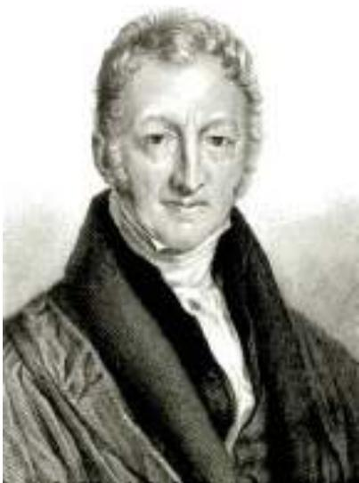

## 12-3f Property Rights and Political Stability

Another way policymakers can foster economic growth is by protecting property rights and promoting political stability. This issue goes to the very heart of how market economies work.

Production in market economies arises from the interactions of millions of individuals and firms. When you buy a car, for instance, you are buying the output of a car dealer, a car manufacturer, a steel company, an iron ore mining company, and so on. This division of production among many firms allows the economy’s factors of production to be used as effectively as possible. To achieve this outcome, the economy has to coordinate transactions among these firms, as well as between firms and consumers. Market economies achieve this coordination through market prices. That is, market prices are the instrument with which the invisible hand of the marketplace brings supply and demand into balance in each of the many thousands of markets that make up the economy.

An important prerequisite for the price system to work is an economy-wide respect for property rights. Property rights refer to the ability of people to exercise authority over the resources they own. A mining company will not make the effort to mine iron ore if it expects the ore to be stolen. The company mines the ore only if it is confident that it will benefit from the ore’s subsequent sale. For this reason, courts serve an important role in a market economy: They enforce property rights. Through the criminal justice system, the courts discourage theft. In addition, through the civil justice system, the courts ensure that buyers and sellers live up to their contracts.

Those of us in developed countries tend to take property rights for granted, but those living in less developed countries understand that a lack of property rights can be a major problem. In many countries, the system of justice does not work well. Contracts are hard to enforce, and fraud often goes unpunished. In more extreme cases, the government not only fails to enforce property rights but actually infringes upon them. To do business in some countries, firms are expected to bribe government officials. Such corruption impedes the coordinating power of markets. It also discourages domestic saving and investment from abroad.

One threat to property rights is political instability. When revolutions and coups are common, there is doubt about whether property rights will be respected in the future. If a revolutionary government might confiscate the capital of some businesses, as was often true after communist revolutions, domestic residents have less incentive to save, invest, and start new businesses. At the same time, foreigners have less incentive to invest in the country. Even the threat of revolution can act to depress a nation’s standard of living.

Thus, economic prosperity depends in part on political prosperity. A country with an efficient court system, honest government officials, and a stable constitution will enjoy a higher economic standard of living than a country with a poor court system, corrupt officials, and frequent revolutions and coups.

## 12-3g Free Trade

Some of the world’s poorest countries have tried to achieve more rapid economic growth by pursuing inward-oriented policies. These policies attempt to increase productivity and living standards within the country by avoiding interaction with the rest of the world. Domestic firms often advance the infant-industry argument, claiming they need protection from foreign competition to thrive and grow. Together with a general distrust of foreigners, this argument has at times led policymakers in less developed countries to impose tariffs and other trade restrictions.

Most economists today believe that poor countries are better off pursuing outward-oriented policies that integrate these countries into the world economy. International trade in goods and services can improve the economic well-being of a country’s citizens. Trade is, in some ways, a type of technology. When a country exports wheat and imports textiles, the country benefits as if it had invented a technology for turning wheat into textiles. A country that eliminates trade restrictions will, therefore, experience the same kind of economic growth that would occur after a major technological advance.

The adverse impact of inward orientation becomes clear when one considers the small size of many less developed economies. The total GDP of Argentina, for instance, is about that of Houston, Texas. Imagine what would happen if the Houston city council were to prohibit city residents from trading with people living outside the city limits. Without being able to take advantage of the gains from trade, Houston would need to produce all the goods it consumes. It would also have to produce all its own capital goods, rather than importing state-ofthe-art equipment from other cities. Living standards in Houston would fall immediately, and the problem would likely only get worse over time. This is precisely what happened when Argentina pursued inward-oriented policies throughout much of the 20th century. In contrast, countries that pursued outwardoriented policies, such as South Korea, Singapore, and Taiwan, enjoyed high rates of economic growth.

The amount that a nation trades with others is determined not only by government policy but also by geography. Countries with natural seaports find trade easier than countries without this resource. It is not a coincidence that many of the world’s major cities, such as New York, San Francisco, and Hong Kong, are located next to oceans. Similarly, because landlocked countries find international trade more difficult, they tend to have lower levels of income than countries with easy access to the world’s waterways. For example, countries with more than 80 percent of their population living within 100 kilometers of a coast have an average GDP per person about four times as large as countries with less than 20 percent of their population living near a coast. The critical importance of access to the sea helps explain why the African continent, which contains many landlocked countries, is so poor.

## 12-3h Research and Development

The primary reason that living standards are higher today than they were a century ago is that technological knowledge has advanced. The telephone, the transistor, the computer, and the internal combustion engine are among the thousands of innovations that have improved the ability to produce goods and services.

Most technological advances come from private research by firms and individual inventors, but there is also a public interest in promoting these efforts. To a large extent, knowledge is a public good: That is, once one person discovers an idea, the idea enters society’s pool of knowledge and other people can freely use it. Just as government has a role in providing a public good such as national defense, it also has a role in encouraging the research and development of new technologies.

The U.S. government has long played a role in the creation and dissemination of technological knowledge. A century ago, the government sponsored research about farming methods and advised farmers how best to use their land. More recently, the U.S. government, through the Air Force and NASA, has supported aerospace research; as a result, the United States is a leading maker of rockets and planes. The government continues to encourage advances in knowledge with research grants from the National Science Foundation and the National Institutes of Health and with tax breaks for firms engaging in research and development.

Yet another way in which government policy encourages research is through the patent system. When a person or firm creates an innovative product, such as a new drug, the inventor can apply for a patent. If the product is deemed truly original,

## ASK THE EXPERTS

## Innovation and Growth

“Future innovations worldwide will not be transformational enough to promote sustained per-capita economic growth rates in the United States and western Europe over the next century as high as those over the past 150 years.”

What do economists say?

  
S o u r c e : IGM Economic Experts Panel, February 11, 2014.

## IN THE NEWS

## Curmudgeon versus Optimist

When economists look ahead to future technological progress, their crystal ball is often foggy.

## Has All the Important Stuff Already Been Invented?

By Timothy Aeppel

obert Gordon, a curmudgeonly 73-year-old economist, believes our best days are over. After a century of life-changing innovations that spurred growth, he says, human progress is slowing to a crawl.

J o e l M o k y r, a c h e e r f u l 6 7 - y e a r- o l d economist, imagines a coming age of new inventions, including gene therapies to prolong our life span and miracle seeds that can feed the world without fertilizers.

These big-name colleagues at Northwestern University represent opposite poles in the debate over the future of the 21st century economy: rapid innovation driven by robotic manufacturing, 3-D printing and cloud computing, versus years of job losses, stagnant wages and rising income inequality.

The divergent views are more than academic. For many Americans, the recession left behind the scars of lost jobs, lower wages and depressed home prices. The question is whether tough times are here for good. The answer depends on who you ask.

“I think the rate of innovation is just getting faster and faster,” Mr. Mokyr said over noodles and spicy chicken at a Thai restaurant near the campus where he and Mr. Gordon have taught for four decades.

“What’s the evidence of that?” snapped Mr. Gordon. “There isn’t any.”

The men get along fine when talk is limited to, say, faculty gossip. About the future, though, they bicker constantly. When Mr. Mokyr described life-prolonging medical advances, Mr. Gordon cut in: “Extending life without curing Alzheimer’s means people who can walk but can’t think.”

Mr. Gordon landed at Northwestern from the University of Chicago in the fall of 1973, a year before Mr. Mokyr arrived there from Yale after finishing his Ph.D. Their tit-for-tat repartee makes them popular speakers—for economists, at least….

The professors headlined a Bank of Korea event in Seoul earlier this month. “We always go mano-a-mano,” Mr. Mokyr said. “But we often end up talking about different things. Bob’s a macroeconomist, I’m an economic historian.”

Mr. Mokyr has long studied how new tools have led to economic breakthroughs. For example, how the development of telescopes allowed for rapid advances in astronomy. History makes him certain his colleague is wrong.

Mr. Gordon’s ideas, in fact, fly in the face of modern economic orthodoxy. Since Nobel economist Robert Solow first argued in the 1950s that growth was driven by new technology, most economists have embraced the idea. Progress may be uneven, according to this view, but there is no reason to expect the world to run out of ideas.

“Bob says the low-hanging fruit has been picked, because we won’t invent indoor plumbing again,” Mr. Mokyr said. In speeches, Mr. Gordon often displays images of a flush toilet and iPhone and asks: Which would you give up?

Mr. Mokyr said many economists before Mr. Gordon have proclaimed the end of progress, but these pessimists have always been proven wrong. It was a popular theme during the Depression, he said, but modern economists now recognize the 1930s as a period of rapid technological progress with such advances as the development of jet engines and radar.

Today, Mr. Mokyr said, fast computing is a new tool that will open the way to new inventions in the future.

The darkness of Mr. Mokyr’s family history contrasts with his optimism for the future. His parents were Dutch Jews who survived the Holocaust. His father, a civil servant, died of cancer when Mr. Mokyr was a year old. He was raised by his mother in a small apartment in the port city of Haifa in Israel. “My mother was not an optimist,” he said. “She had lived a very tough life.”

Mr. Gordon, the more famous of the two men, has the credentials to buck conventional wisdom. His parents and a brother were Ph.D. economists. His father, an expert on business cycles, taught at the University of California, Berkeley, for decades….

  
ROBERT GORDON  
Curmudgeon

If anything, his family should have made him an optimist. Mr. Gordon’s father grew up grindingly poor, at one point supporting three younger brothers after his own father died; his eventual success mirrored the larger transformation of the U.S. into the world’s richest country.

“His generation saw the move from crowded tenements in the 1920s to suburbia in the 1950s—with everyone having a yard and a car,” Mr. Gordon said, a leap showing how much progress has since slowed.

Mr. Gordon sees a hobbled U.S. economy ahead. Americans are getting older, leaving too few workers to support the aging population. The problem is even worse in other Western economies.

An aging citizenry is among a list of troubles, including the declining share of working-age men with jobs; stagnant rates of Americans earning college degrees; jobs lost abroad and high government debt. The biggest obstacle, he said, is growing income inequality.

To compensate, Mr. Gordon said, economies need technological advances. The problem is that the biggest breakthroughs— like electrification or the discovery of antibiotics—are behind us. Electricity changed how people lived and worked, and it spawned hundreds of new industries. The technology that allowed people to communicate instantly or travel quickly over long distances were 19th- and 20th-century innovations.

More recent inventions—including the Internet—won’t pack the same punch, he said: “The rapid progress made over the past 250 years could well turn out to be a unique episode in human history.”

Cellphones, he said, are just a refinement of the telephone. “Look at what an ideal kitchen looked like in 1955—it’s not that different than today,” Mr. Gordon said. “It’s nothing like moving from clothes lines to clothes dryers.”…

Mr. Gordon said his ideas began taking shape between semesters at graduate school. He worked during the summer of 1965 for a team of economists analyzing the dazzling productivity growth that began around 1920 and ran through World War II and the postwar boom.

Except for an upturn in the 1990s, growth has been tepid ever since.

“Everyone has looked for a big overarching factor to explain this,” he said. “But it occurred to me, it could be as simple as that we’d run out of the great inventions.”

Mr. Gordon said his ideas evolved from there. In 2000, he published a paper saying that computer technology, hailed as the driver of the “new economy,” was far less impressive than earlier big inventions. He generated more controversy with a 2012 academic paper titled “Is U.S. Economic Growth Over?”

The paper included a dire prediction: The economy will grow less than half as fast as the remarkable 2% average it notched between 1870 and 2007. “Americans got used to their standard of living doubling from that of their parents. No more,” he told investment managers in Germany this year.

  
Optimist  
JOELMOKYR

If he is right, the standard of living for the average American—measured in per capita income—will in the future take 78 years to double, compared with the 35 years it took between 1972 and 2007….

Much of Mr. Gordon’s work focuses on an economy’s output. Mr. Mokyr, meanwhile, is more interested in how new inventions improve the quality of life in ways that don’t show up in traditional measures: new medicines that treat chronic pain or allow older people to stay active years longer. A hip replacement, he said, let him keep riding his bike to and from work.

“For Bob, it’s all about the measure of input and output—especially output,” said Mr. Mokyr. That is why the aging population is such a big problem for Mr. Gordon, since retired people stop producing.

Mr. Gordon countered that many of the innovations Mr. Mokyr anticipates—such as new technology to clean air and water pollution—will solve problems created by past economic growth. Those shouldn’t be counted the same way as breakthroughs that add to output, he said.

“Maybe the problem is that we didn’t measure growth in the past correctly,” Mr. Mokyr retorted, “because we didn’t account for the costs.”

The two men agree on one point. “One of the main missions I have in life is to point out to my students how lucky they are to be born in the 20th century,” Mr. Mokyr said. “Compared to what life was like 100 or 200 years ago, we’re incredibly fortunate.” ■

Source: The Wall Street Journal, June 16, 2014.

the government awards the patent, which gives the inventor the exclusive right to make the product for a specified number of years. In essence, the patent gives the inventor a property right over her invention, turning her new idea from a public good into a private good. By allowing inventors to profit from their inventions—even if only temporarily—the patent system enhances the incentive for individuals and firms to engage in research.

## 12-3i Population Growth

Economists and other social scientists have long debated how population affects a society. The most direct effect is on the size of the labor force: A large population means more workers to produce goods and services. The tremendous size of the Chinese population is one reason China is such an important player in the world economy.

At the same time, however, a large population means more people to consume those goods and services. So while a large population means a larger total output of goods and services, it need not mean a higher standard of living for the typical citizen. Indeed, both large and small nations are found at all levels of economic development.

Beyond these obvious effects of population size, population growth interacts with the other factors of production in ways that are more subtle and open to debate.

Stretching Natural Resources Thomas Robert Malthus (1766–1834), an English minister and early economic thinker, is famous for his book called An Essay on the Principle of Population as It Affects the Future Improvement of Society. In it, he offered what may be history’s most chilling forecast. Malthus argued that an everincreasing population would continually strain society’s ability to provide for itself. As a result, mankind was doomed to forever live in poverty.

Malthus’s logic was simple. He began by noting that “food is necessary to the existence of man” and that “the passion between the sexes is necessary and will remain nearly in its present state.” He concluded that “the power of population is infinitely greater than the power in the earth to produce subsistence for man.” According to Malthus, the only check on population growth was “misery and vice.” Attempts by charities or governments to alleviate poverty were counterproductive, he argued, because they merely allowed the poor to have more children, placing even greater strains on society’s productive capabilities.

  
Thomas Robert Malthus

Malthus may have correctly described the world at the time when he lived, but fortunately, his dire forecast was far off the mark. The world population has increased about sixfold over the past two centuries, but living standards around the world are on average much higher. As a result of economic growth, chronic hunger and malnutrition are less common now than they were in Malthus’s day. Modern famines occur from time to time but are more often the result of an unequal income distribution or political instability than inadequate food production.

2002 ARPL / TOPHAM / THE IMAGEWORKS

Where did Malthus go wrong? As we discussed in a case study earlier in this chapter, growth in human ingenuity has offset the effects of a larger population. Pesticides, fertilizers, mechanized farm equipment, new crop varieties, and other technological advances that Malthus never imagined have allowed each farmer to feed ever greater numbers of people. Even with more mouths to feed, fewer farmers are necessary because each farmer is much more productive.

Diluting the Capital Stock Whereas Malthus worried about the effects of population on the use of natural resources, some modern theories of economic growth emphasize its effects on capital accumulation. According to these theories, high population growth reduces GDP per worker because rapid growth in the number of workers forces the capital stock to be spread more thinly. In other words, when population growth is rapid, each worker is equipped with less capital. A smaller quantity of capital per worker leads to lower productivity and lower GDP per worker.

This problem is most apparent in the case of human capital. Countries with high population growth have large numbers of school-age children. This places a larger burden on the educational system. It is not surprising, therefore, that educational attainment tends to be low in countries with high population growth.

The differences in population growth around the world are large. In developed countries, such as the United States and those in Western Europe, the population has risen only about 1 percent per year in recent decades and is expected to rise even more slowly in the future. By contrast, in many poor African countries, population grows at about 3 percent per year. At this rate, the population doubles every 23 years. This rapid population growth makes it harder to provide workers with the tools and skills they need to achieve high levels of productivity.

Rapid population growth is not the main reason that less developed countries are poor, but some analysts believe that reducing the rate of population growth would help these countries raise their standards of living. In some countries, this goal is accomplished directly with laws that regulate the number of children families may have. For example, from 1980 to 2015, China allowed only one child per family; couples who violated this rule were subject to substantial fines. In countries with greater freedom, the goal of reduced population growth is accomplished less directly by increasing awareness of birth control techniques.

Another way in which a country can influence population growth is to apply one of the Ten Principles of Economics: People respond to incentives. Bearing a child, like any decision, has an opportunity cost. When the opportunity cost rises, people will choose to have smaller families. In particular, women with the opportunity to receive a good education and desirable employment tend to want fewer children than those with fewer opportunities outside the home. Hence, policies that foster equal treatment of women may be one way for less developed economies to reduce the rate of population growth and, perhaps, raise their standards of living.

Promoting Technological Progress Rapid population growth may depress economic prosperity by reducing the amount of capital each worker has, but it may also have some benefits. Some economists have suggested that world population growth has been an engine of technological progress and economic prosperity. The mechanism is simple: If there are more people, then there are more scientists, inventors, and engineers to contribute to technological advance, which benefits everyone.

Economist Michael Kremer provided some support for this hypothesis in an article titled “Population Growth and Technological Change: One Million b.c. to 1990,” which was published in the Quarterly Journal of Economics in 1993. Kremer began by noting that over the broad span of human history, world growth rates have increased with world population. For example, world growth was more rapid when the world population was 1 billion (which occurred around the year 1800) than when the population was only 100 million (around 500 b.c.). This fact is consistent with the hypothesis that a larger population induces more technological progress.

Kremer’s second piece of evidence comes from comparing regions of the world. The melting of the polar icecaps at the end of the Ice Age around 10,000 b.c. flooded the land bridges and separated the world into several distinct regions that could not communicate with one another for thousands of years. If technological progress is more rapid when there are more people to discover things, then larger regions should have experienced more rapid growth.

According to Kremer, that is exactly what happened. The most successful region of the world in 1500 (when Columbus reestablished contact) comprised the “Old World” civilizations of the large Eurasia-Africa region. Next in technological development were the Aztec and Mayan civilizations in the Americas, followed by the hunter-gatherers of Australia, and then the primitive people of Tasmania, who lacked even fire-making and most stone and bone tools.
