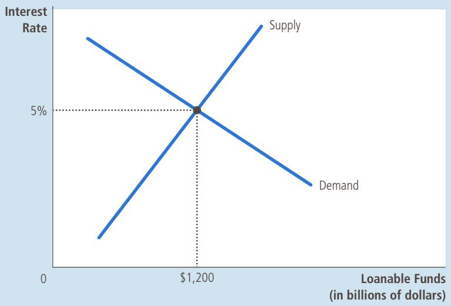
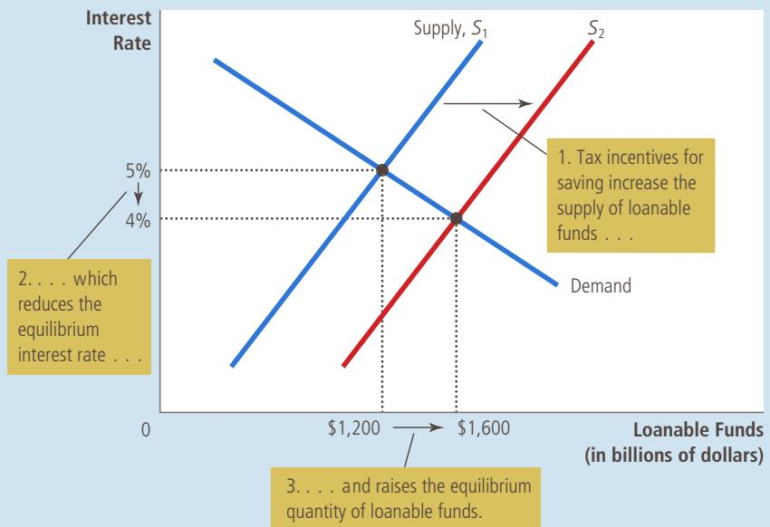
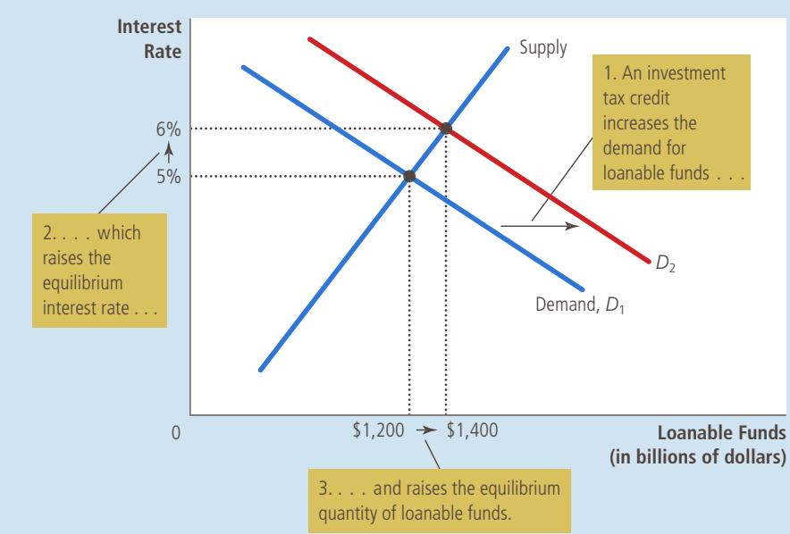
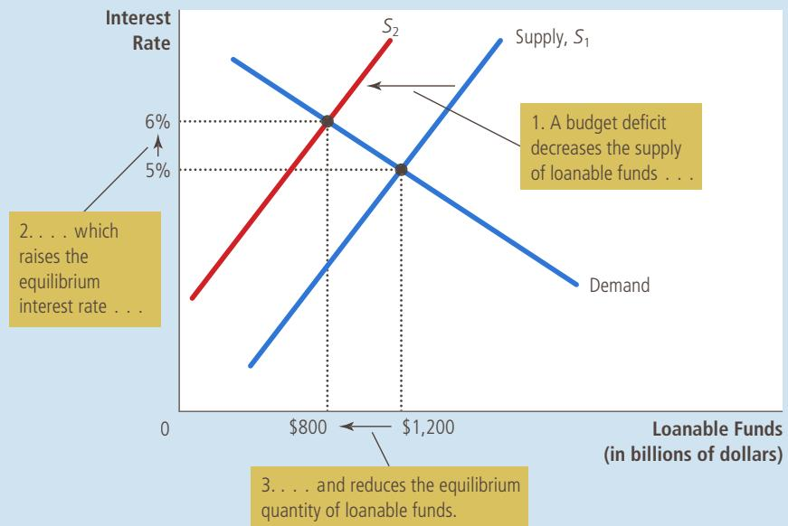
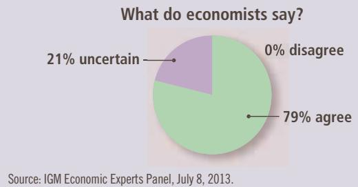

# Saving, Investment, and the Financial System

magine that you have just graduated from college (with a degree in economics, of course) and you decide to start your own business—an economic forecasting firm. Before you make any money selling your forecasts, you have to incur substantial costs to set up your business. You have to buy computers with which to make your forecasts, as well as desks, chairs, and filing cabinets to furnish your new office. Each of these items is a type of capital that your firm will use to produce and sell its services.

How do you obtain the funds to invest in these capital goods? Perhaps you are able to pay for them out of your past savings. More likely, however, like most entrepreneurs, you do not have enough money of your own

13

to finance the start of your business. As a result, you have to get the money you need from other sources.

There are various ways to finance these capital investments. You could borrow the money, perhaps from a bank or from a friend or relative. In this case, you would promise not only to return the money to the lender at a later date but also to pay the lender interest for the use of the money. Alternatively, you could convince someone to provide the money you need for your business in exchange for a share of your future profits, whatever they might happen to be. In either case, your investment in computers and office equipment is being financed by someone else’s saving.

The financial system consists of the institutions that help to match one person’s saving with another person’s investment. As we discussed in the previous chapter, saving and investment are key ingredients to long-run economic growth: When a country saves a large portion of its GDP, more resources are available for investment in capital, and higher capital raises a country’s productivity and living standard. The previous chapter, however, did not explain how the economy coordinates saving and investment. At any time, some people want to save some of their income for the future and others want to borrow to finance investments in new and growing businesses. What brings these two groups of people together? What ensures that the supply of funds from those who want to save balances the demand for funds from those who want to invest?

This chapter examines how the financial system works. First, we discuss the large variety of institutions that make up the financial system in our economy. Second, we examine the relationship between the financial system and some key macroeconomic variables—notably saving and investment. Third, we develop a model of the supply and demand for funds in financial markets. In the model, the interest rate is the price that adjusts to balance supply and demand. The model shows how various government policies affect the interest rate and, thereby, society’s allocation of scarce resources.

## 13-1 Financial Institutions in the U.S. Economy

At the broadest level, the financial system moves the economy’s scarce resources from savers (people who spend less than they earn) to borrowers (people who spend more than they earn). Savers save for various reasons—to put a child through college in several years or to retire comfortably in several decades. Similarly, borrowers borrow for various reasons—to buy a house in which to live or to start a business with which to make a living. Savers supply their money to the financial system with the expectation that they will get it back with interest at a later date. Borrowers demand money from the financial system with the knowledge that they will be required to pay it back with interest at a later date.

The financial system is made up of various financial institutions that help coordinate the actions of savers and borrowers. As a prelude to analyzing the economic forces that drive the financial system, let’s discuss the most important of these institutions. Financial institutions can be grouped into two categories: financial markets and financial intermediaries. We consider each category in turn.

## 13-1a Financial Markets

Financial markets are the institutions through which a person who wants to save can directly supply funds to a person who wants to borrow. The two most important financial markets in our economy are the bond market and the stock market.

The Bond Market When Intel, the giant maker of computer chips, wants to borrow to finance construction of a new factory, it can borrow directly from the public. It does this by selling bonds. A bond is a certificate of indebtedness that specifies the obligations of the borrower to the holder of the bond. Put simply, a bond is an IOU. It identifies the time at which the loan will be repaid, called the date of maturity, and the rate of interest that will be paid periodically until the loan matures. The buyer of a bond gives his money to Intel in exchange for this promise of interest and eventual repayment of the amount borrowed (called the principal). The buyer can hold the bond until maturity, or he can sell the bond at an earlier date to someone else.

There are millions of different bonds in the U.S. economy. When large corporations, the federal government, or state and local governments need to borrow to finance the purchase of a new factory, a new jet fighter, or a new school, they usually do so by issuing bonds. If you look at The Wall Street Journal or the business section of your local newspaper, you will find a listing of the prices and interest rates on some of the most important bond issues. These bonds differ according to three significant characteristics.

The first characteristic is a bond’s term—the length of time until the bond matures. Some bonds have short terms, such as a few months, while others have terms as long as 30 years. (The British government has even issued a bond that never matures, called a perpetuity. This bond pays interest forever, but the principal is never repaid.) The interest rate on a bond depends, in part, on its term. Long-term bonds are riskier than short-term bonds because holders of long-term bonds have to wait longer for repayment of principal. If a holder of a long-term bond needs his money earlier than the distant date of maturity, he has no choice but to sell the bond to someone else, perhaps at a reduced price. To compensate for this risk, long-term bonds usually pay higher interest rates than short-term bonds.

The second important characteristic of a bond is its credit risk—the probability that the borrower will fail to pay some of the interest or principal. Such a failure to pay is called a default. Borrowers can (and sometimes do) default on their loans by declaring bankruptcy. When bond buyers perceive that the probability of default is high, they demand a higher interest rate as compensation for this risk. Because the U.S. government is considered a safe credit risk, government bonds tend to pay low interest rates. By contrast, financially shaky corporations raise money by issuing junk bonds, which pay very high interest rates. Buyers of bonds can judge credit risk by checking with various private agencies that evaluate the credit risk of different bonds. For example, Standard & Poor’s rates bonds from AAA (the safest) to D (those already in default).

The third important characteristic of a bond is its tax treatment—the way the tax laws treat the interest earned on the bond. The interest on most bonds is taxable income; that is, the bond owner has to pay a portion of the interest he earns in income taxes. By contrast, when state and local governments issue bonds, called municipal bonds, the bond owners are not required to pay federal income tax on the interest income. Because of this tax advantage, bonds issued by state and local governments typically pay a lower interest rate than bonds issued by corporations or the federal government.

The Stock Market Another way for Intel to raise funds to build a new semiconductor factory is to sell stock in the company. Stock represents ownership in a firm and is, therefore, a claim to the profits that the firm makes. For example, if Intel sells a total of 1,000,000 shares of stock, then each share represents ownership of 1/1,000,000 of the business.

The sale of stock to raise money is called equity finance, whereas the sale of bonds is called debt finance. Although corporations use both equity and debt finance to raise money for new investments, stocks and bonds are very different. The owner of shares of Intel stock is a part owner of Intel, while the owner of an Intel bond is a creditor of the corporation. If Intel is very profitable, the stockholders enjoy the benefits of these profits, whereas the bondholders get only the interest on their bonds. And if Intel runs into financial difficulty, the bondholders are paid what they are due before stockholders receive anything at all. Compared to bonds, stocks offer the holder both higher risk and potentially higher return.

After a corporation issues stock by selling shares to the public, these shares trade among stockholders on organized stock exchanges. In these transactions, the corporation itself receives no money when its stock changes hands. The most important stock exchanges in the U.S. economy are the New York Stock Exchange and the NASDAQ (National Association of Securities Dealers Automated Quotations). Most of the world’s countries have their own stock exchanges on which the shares of local companies trade.

The prices at which shares trade on stock exchanges are determined by the supply of and demand for the stock in these companies. Because stock represents ownership in a corporation, the demand for a stock (and thus its price) reflects people’s perception of the corporation’s future profitability. When people become optimistic about a company’s future, they raise their demand for its stock and thereby bid up the price of a share of stock. Conversely, when people’s expectations of a company’s prospects decline, the price of a share falls.

Various stock indexes are available to monitor the overall level of stock prices. A stock index is computed as an average of a group of stock prices. The most famous stock index is the Dow Jones Industrial Average, which has been computed regularly since 1896. It is now based on the prices of the stocks of thirty major U.S. companies, such as General Electric, Microsoft, Coca-Cola, Boeing, Apple, and Wal-Mart. Another well-known stock index is the Standard & Poor’s 500 Index, which is based on the prices of the stocks of 500 major companies. Because stock prices reflect expected profitability, these stock indexes are watched closely as possible indicators of future economic conditions.

## 13-1b Financial Intermediaries

Financial intermediaries are financial institutions through which savers can indirectly provide funds to borrowers. The term intermediary reflects the role of these institutions in standing between savers and borrowers. Here we consider two of the most important financial intermediaries: banks and mutual funds.

Banks If the owner of a small grocery store wants to finance an expansion of his business, he probably takes a strategy quite different from that of Intel. Unlike Intel, a small grocer would find it difficult to raise funds in the bond and stock markets. Most buyers of stocks and bonds prefer to buy those issued by larger, more familiar companies. The small grocer, therefore, most likely finances his business expansion with a loan from a local bank.

Banks are the financial intermediaries with which people are most familiar. A primary job of banks is to take in deposits from people who want to save and use these deposits to make loans to people who want to borrow. Banks pay depositors interest on their deposits and charge borrowers slightly higher interest on their loans. The difference between these rates of interest covers the banks costs and returns some profit to the owners of the banks.

## FYI

## Key Numbers for Stock Watchers

on three key numbers. These numbers are reported on the financial pages of some newspapers, and you can easily obtain them online as well (such as at Yahoo! Finance):

Price. The single most important piece of information about a stock is the price of a share. News services usually present several prices. The “last” price is the price at which the stock more recently traded. The “previous close” is the price of the last transaction that occurred before the stock exchange closed on its previous day of trading. A news service may also give the “high” and “low” prices over the past day of trading and, sometimes, over the past year as well. It may also report the change from the previous day’s closing price.

Dividend. Corporations pay out some of their profits to their stockholders; this amount is called the dividend. (Profits not paid out are called retained earnings and are used by the corporation for additional investment.) News services often report the dividend paid over the previous year for each share of stock. They sometimes report the dividend yield, which is the dividend expressed as a percentage of the stock’s price.

Price-earnings ratio. A corporation’s earnings, or accounting profit, is the amount of revenue it receives for the sale of its products minus its costs of production as measured by

its accountants. Earnings per share is the company’s total earnings divided by the number of shares of stock outstanding.

The price-earnings ratio,

often called the P/E, is the price of a corporation’s stock divided by the amount the corporation earned per share over the past year. Historically, the typical price-earnings ratio is about 15. A higher P/E indicates that a corporation’s stock is expensive relative to its recent earnings; this might indicate either that people expect earnings to rise in the future or that the stock is overvalued. Conversely, a lower P/E indicates that a corporation’s stock is cheap relative to its recent earnings; this might indicate either that people expect earnings to fall or that the stock is undervalued.

Why do news services report all these data? Many people who invest their savings in stock follow these numbers closely when deciding which stocks to buy and sell. By contrast, other stockholders follow a buy-andhold strategy: They buy the stock of well-run companies, hold it for long periods of time, and do not respond to the daily fluctuations. ■

Besides being financial intermediaries, banks play another important role in the economy: They facilitate purchases of goods and services by allowing people to write checks against their deposits and to access those deposits with debit cards. In other words, banks help create a special asset that people can use as a medium of exchange. A medium of exchange is an item that people can easily use to engage in transactions. A bank’s role in providing a medium of exchange distinguishes it from many other financial institutions. Stocks and bonds, like bank deposits, are a possible store of value for the wealth that people have accumulated in past saving, but access to this wealth is not as easy, cheap, and immediate as just writing a check or swiping a debit card. For now, we ignore this second role of banks, but we will return to it when we discuss the monetary system later in the book.

Mutual Funds A financial intermediary of increasing importance in the U.S. economy is the mutual fund. A mutual fund is an institution that sells shares to the public and uses the proceeds to buy a selection, or portfolio, of various types of stocks, bonds, or both stocks and bonds. The shareholder of the mutual fund accepts all the risk and return associated with the portfolio. If the value of the portfolio rises, the shareholder benefits; if the value of the portfolio falls, the shareholder suffers the loss.

The primary advantage of mutual funds is that they allow people with small amounts of money to diversify their holdings. Buyers of stocks and bonds are well advised to heed the adage: Don’t put all your eggs in one basket. Because the

## mutual fund

an institution that sells shares to the public and uses the proceeds to buy a portfolio of stocks and bonds

UNITED FEATURE SYNDICATE, INC. ARLO & JANIS REPRINTED BY PERMISSION OF

A   hy JimmyJahon  

value of any single stock or bond is tied to the fortunes of one company, holding a single kind of stock or bond is very risky. By contrast, people who hold a diverse portfolio of stocks and bonds face less risk because they have only a small stake in each company. Mutual funds make this diversification easy. With only a few hundred dollars, a person can buy shares in a mutual fund and, indirectly, become the part owner or creditor of hundreds of major companies. For this service, the company operating the mutual fund charges shareholders a fee, usually between 0.25 and 2.0 percent of assets each year.

A second advantage claimed by mutual fund companies is that mutual funds give ordinary people access to the skills of professional money managers. The managers of most mutual funds pay close attention to the developments and prospects of the companies in which they buy stock. These managers buy the stock of companies they view as having a profitable future and sell the stock of companies with less promising prospects. This professional management, it is argued, should increase the return that mutual fund depositors earn on their savings.

Financial economists, however, are often skeptical of this argument. With thousands of money managers paying close attention to each company’s prospects, the price of a company’s stock is usually a good reflection of the company’s true value. As a result, it is hard to “beat the market” by buying good stocks and selling bad ones. In fact, mutual funds called index funds, which buy all the stocks in a given stock index, perform somewhat better on average than mutual funds that take advantage of active trading by professional money managers. The explanation for the superior performance of index funds is that they keep costs low by buying and selling very rarely and by not having to pay the salaries of professional money managers.

## 13-1c Summing Up

The U.S. economy contains a large variety of financial institutions. In addition to the bond market, the stock market, banks, and mutual funds, there are also pension funds, credit unions, insurance companies, and even the local loan shark. These institutions differ in many ways. When analyzing the macroeconomic role of the financial system, however, it is more important to keep in mind that, despite their differences, these financial institutions all serve the same goal: directing the resources of savers into the hands of borrowers.

What is a share of stock? What is a bond? Explain their differences and similarities.

## 13-2 Saving and Investment in the National Income Accounts

Events that occur within the financial system are central to understanding developments in the overall economy. As we have just seen, the institutions that make up this system—the bond market, the stock market, banks, and mutual funds—have the role of coordinating the economy’s saving and investment. And as we saw in the previous chapter, saving and investment are important determinants of long-run growth in GDP and living standards. As a result, macroeconomists need to understand how financial markets work and how various events and policies affect them.

As a starting point for analyzing financial markets, we discuss the key macroeconomic variables that measure activity in these markets. Our emphasis here is not on behavior but on accounting. Accounting refers to how various numbers are defined and added up. A personal accountant might help an individual add up his income and expenses. A national income accountant does the same thing for the economy as a whole. The national income accounts include, in particular, GDP and the many related statistics.

The rules of national income accounting include several important identities. Recall that an identity is an equation that must be true because of the way the variables in the equation are defined. Identities are useful to keep in mind, for they clarify how different variables are related to one another. Here we consider some accounting identities that shed light on the macroeconomic role of financial markets.

## 13-2a Some Important Identities

Recall that gross domestic product (GDP) is both total income in an economy and the total expenditure on the economy’s output of goods and services. GDP (denoted as Y) is divided into four components of expenditure: consumption (C), investment (I), government purchases (G), and net exports (NX). We write

$$
Y = C + I + G + N X.
$$

This equation is an identity because every dollar of expenditure that shows up on the left side also shows up in one of the four components on the right side. Because of the way each of the variables is defined and measured, this equation must always hold.

In this chapter, we simplify our analysis by assuming that the economy we are examining is closed. A closed economy is one that does not interact with other economies. In particular, a closed economy does not engage in international trade in goods and services, nor does it engage in international borrowing and lending. Actual economies are open economies—that is, they interact with other economies around the world. Nonetheless, assuming a closed economy is a useful simplification with which we can learn some lessons that apply to all economies. Moreover, this assumption applies perfectly to the world economy (for interplanetary trade is not yet common).

Because a closed economy does not engage in international trade, imports and exports are exactly zero. Therefore, net exports (NX) are also zero. We can now simplify the identity as

$$
Y = C + I + G.
$$

This equation states that GDP is the sum of consumption, investment, and government purchases. Each unit of output sold in a closed economy is consumed, invested, or bought by the government.

To see what this identity can tell us about financial markets, subtract C and G from both sides of this equation. We then obtain

$$
Y - C - G = I.
$$

The left side of this equation $( Y - C - G )$ is the total income in the economy that remains after paying for consumption and government purchases: This amount is called national saving, or just saving, and is denoted S. Substituting S for $Y - C - G ,$ we can write the last equation as

$$
S = I.
$$

This equation states that saving equals investment.

To understand the meaning of national saving, it is helpful to manipulate the definition a bit more. Let T denote the amount that the government collects from households in taxes minus the amount it pays back to households in the form of transfer payments (such as Social Security and welfare). We can then write national saving in either of two ways:

$$
S = Y - C - G
$$

or

$$
S = (Y - T - C) + (T - G).
$$

These equations are the same because the two $T ^ { \prime }$ s in the second equation cancel each other, but each reveals a different way of thinking about national saving. In particular, the second equation separates national saving into two pieces: private saving $( Y - T - C )$ and public saving $( T - G )$

budget deficit a shortfall of tax revenue from government spending

private saving the income that households have left after paying for taxes and consumption

budget surplus an excess of tax revenue over government spending

public saving the tax revenue that the government has left after paying for its spending

Consider each of these two pieces. Private saving is the amount of income that households have left after paying their taxes and paying for their consumption. In particular, because households receive income of $\dot { Y , }$ pay taxes of $T ,$ and spend C on consumption, private saving is $Y - T - C$ . Public saving is the amount of tax revenue that the government has left after paying for its spending. The government receives $T$ in tax revenue and spends $G$ on goods and services. If $T$ exceeds $G ,$ the government runs a budget surplus because it receives more money than it spends. This surplus of $T - G$ represents public saving. If the government spends more than it receives in tax revenue, then $G$ is larger than T. In this case, the government runs a budget deficit, and public saving $( T - G )$ is a negative number.

Now consider how these accounting identities are related to financial markets. The equation $S = I$ reveals an important fact: For the economy as a whole, saving must be equal to investment. Yet this fact raises some important questions: What mechanisms lie behind this identity? What coordinates those people who are deciding how much to save and those people who are deciding how much to invest? The answer is the financial system. The bond market, the stock market, banks, mutual funds, and other financial markets and intermediaries stand between the two sides of the $S = I$ equation. They take in the nation’s saving and direct it to the nation’s investment.

## 13-2b The Meaning of Saving and Investment

The terms saving and investment can sometimes be confusing. Most people use these terms casually and sometimes interchangeably. By contrast, the macroeconomists who put together the national income accounts use these terms carefully and distinctly.

Consider an example. Suppose that Larry earns more than he spends and deposits his unspent income in a bank or uses it to buy some stock or a bond from a corporation. Because Larry’s income exceeds his consumption, he adds to the nation’s saving. Larry might think of himself as “investing” his money, but a macroeconomist would call Larry’s act saving rather than investment.

In the language of macroeconomics, investment refers to the purchase of new capital, such as equipment or buildings. When Moe borrows from the bank to build himself a new house, he adds to the nation’s investment. (Remember, the purchase of a new house is the one form of household spending that is investment rather than consumption.) Similarly, when the Curly Corporation sells some stock and uses the proceeds to build a new factory, it also adds to the nation’s investment.

Although the accounting identity S = I shows that saving and investment are equal for the economy as a whole, this does not have to be true for every individual household or firm. Larry’s saving can be greater than his investment, and he can deposit the excess in a bank. Moe’s saving can be less than his investment, and he can borrow the shortfall from a bank. Banks and other financial institutions make these individual differences between saving and investment possible by allowing one person’s saving to finance another person’s investment.

QuickQuiz

Define private saving, public saving, national saving, and investment. How are they related?

## 13-3 The Market for Loanable Funds

Having discussed some of the important financial institutions in our economy and the macroeconomic role of these institutions, we are ready to build a model of financial markets. Our purpose in building this model is to explain how financial markets coordinate the economy’s saving and investment. The model also gives us a tool with which we can analyze various government policies that influence saving and investment.

To keep things simple, we assume that the economy has only one financial market, called the market for loanable funds. All savers go to this market to deposit their saving, and all borrowers go to this market to take out their loans. Thus, the term loanable funds refers to all income that people have chosen to save and lend out, rather than use for their own consumption, and to the amount that investors have chosen to borrow to fund new investment projects. In the market for loanable funds, there is one interest rate, which is both the return to saving and the cost of borrowing.

market for loanable funds the market in which those who want to save supply funds and those who want to borrow to invest demand funds

The assumption of a single financial market, of course, is not realistic. As we have seen, the economy has many types of financial institutions. But as we discussed in Chapter 2, the art in building an economic model is simplifying the world in order to explain it. For our purposes here, we can ignore the diversity of financial institutions and assume that the economy has a single financial market.

## 13-3a Supply and Demand for Loanable Funds

The economy’s market for loanable funds, like other markets in the economy, is governed by supply and demand. To understand how the market for loanable funds operates, therefore, we first look at the sources of supply and demand in that market.

The supply of loanable funds comes from people who have some extra income they want to save and lend out. This lending can occur directly, such as when a household buys a bond from a firm, or it can occur indirectly, such as when a household makes a deposit in a bank, which then uses the funds to make loans. In both cases, saving is the source of the supply of loanable funds.

The demand for loanable funds comes from households and firms who wish to borrow to make investments. This demand includes families taking out mortgages to buy new homes. It also includes firms borrowing to buy new equipment or build factories. In both cases, investment is the source of the demand for loanable funds.

The interest rate is the price of a loan. It represents the amount that borrowers pay for loans and the amount that lenders receive on their saving. Because a high interest rate makes borrowing more expensive, the quantity of loanable funds demanded falls as the interest rate rises. Similarly, because a high interest rate makes saving more attractive, the quantity of loanable funds supplied rises as the interest rate rises. In other words, the demand curve for loanable funds slopes downward, and the supply curve for loanable funds slopes upward.

Figure 1 shows the interest rate that balances the supply and demand for loanable funds. In the equilibrium shown, the interest rate is 5 percent, and the quantity of loanable funds demanded and the quantity of loanable funds supplied both equal \$1,200 billion.

The adjustment of the interest rate to the equilibrium level occurs for the usual reasons. If the interest rate were lower than the equilibrium level, the quantity of loanable funds supplied would be less than the quantity of loanable funds demanded. The resulting shortage of loanable funds would encourage lenders to

## FIGURE 1

## The Market for Loanable Funds

The interest rate in the economy adjusts to balance the supply and demand for loanable funds. The supply of loanable funds comes from national saving, including both private saving and public saving. The demand for loanable funds comes from firms and households that want to borrow for purposes of investment. Here the equilibrium interest rate is 5 percent, and \$1,200 billion of loanable funds are supplied and demanded.

raise the interest rate they charge. A higher interest rate would encourage saving (thereby increasing the quantity of loanable funds supplied) and discourage borrowing for investment (thereby decreasing the quantity of loanable funds demanded). Conversely, if the interest rate were higher than the equilibrium level, the quantity of loanable funds supplied would exceed the quantity of loanable funds demanded. As lenders compete for the scarce borrowers, interest rates would be driven down. In this way, the interest rate approaches the equilibrium level at which the supply and demand for loanable funds exactly balance.

Recall that economists distinguish between the real interest rate and the nominal interest rate. The nominal interest rate is the monetary return to saving and the monetary cost of borrowing. It is the interest rate as usually reported. The real interest rate is the nominal interest rate corrected for inflation; it equals the nominal interest rate minus the inflation rate. Because inflation erodes the value of money over time, the real interest rate more accurately reflects the real return to saving and the real cost of borrowing. Therefore, the supply and demand for loanable funds depend on the real (rather than nominal) interest rate, and the equilibrium in Figure 1 should be interpreted as determining the real interest rate in the economy. For the rest of this chapter, when you see the term interest rate, you should remember that we are talking about the real interest rate.

This model of the supply and demand for loanable funds shows that financial markets work much like other markets in the economy. In the market for milk, for instance, the price of milk adjusts so that the quantity of milk supplied balances the quantity of milk demanded. In this way, the invisible hand coordinates the behavior of dairy farmers and the behavior of milk drinkers. Once we realize that saving represents the supply of loanable funds and investment represents the demand, we can see how the invisible hand coordinates saving and investment. When the interest rate adjusts to balance supply and demand in the market for loanable funds, it coordinates the behavior of people who want to save (the suppliers of loanable funds) and the behavior of people who want to invest (the demanders of loanable funds).

We can now use this analysis of the market for loanable funds to examine various government policies that affect the economy’s saving and investment. Because this model is just supply and demand in a particular market, we analyze any policy using the three steps discussed in Chapter 4. First, we decide whether the policy shifts the supply curve or the demand curve. Second, we determine the direction of the shift. Third, we use the supply-and-demand diagram to see how the equilibrium changes.

## 13-3b Policy 1: Saving Incentives

Many economists and policymakers have advocated increases in how much people save. Their argument is simple. One of the Ten Principles of Economics in Chapter 1 is that a country’s standard of living depends on its ability to produce goods and services. And as we discussed in the preceding chapter, saving is an important long-run determinant of a nation’s productivity. If the United States could somehow raise its saving rate, more resources would be available for capital accumulation, GDP would grow more rapidly, and over time, U.S. citizens would enjoy a higher standard of living.

Another of the Ten Principles of Economics is that people respond to incentives. Many economists have used this principle to suggest that the low rate of saving is at least partly attributable to tax laws that discourage saving. The U.S. federal government, as well as many state governments, collects revenue by taxing income, including interest and dividend income. To see the effects of this policy, consider a 25-year-old who saves \$1,000 and buys a 30-year bond that pays an interest rate of 9 percent. In the absence of taxes, the \$1,000 grows to \$13,268 when the individual reaches age 55. Yet if that interest is taxed at a rate of, say, 33 percent, the after-tax interest rate is only 6 percent. In this case, the \$1,000 grows to only \$5,743 over the 30 years. The tax on interest income substantially reduces the future payoff from current saving and, as a result, reduces the incentive for people to save.

In response to this problem, some economists and lawmakers have proposed reforming the tax code to encourage greater saving. For example, one proposal is to expand eligibility for special accounts, such as Individual Retirement Accounts, that allow people to shelter some of their saving from taxation. Let’s consider the effect of such a saving incentive on the market for loanable funds, as illustrated in Figure 2. We analyze this policy following our three steps.

First, which curve would this policy affect? Because the tax change would alter the incentive for households to save at any given interest rate, it would affect the quantity of loanable funds supplied at each interest rate. Thus, the supply of loanable funds would shift. The demand for loanable funds would remain the same because the tax change would not directly affect the amount that borrowers want to borrow at any given interest rate.

Second, which way would the supply curve shift? Because saving would be taxed less heavily than under current law, households would increase their saving by consuming a smaller fraction of their income. Households would use this additional saving to increase their deposits in banks or to buy more bonds. The supply of loanable funds would increase, and the supply curve would shift to the right from $S _ { 1 }$ to $S _ { 2 } ,$ as shown in Figure 2.

Finally, we can compare the old and new equilibria. In the figure, the increased supply of loanable funds reduces the interest rate from 5 percent to 4 percent. The lower interest rate raises the quantity of loanable funds demanded from \$1,200 billion to \$1,600 billion. That is, the shift in the supply curve moves the market

## FIGURE 2

## Saving Incentives Increase the Supply of Loanable Funds

A change in the tax laws to encourage Americans to save more would shift the supply of loanable funds to the right from $S _ { 1 }$ to $S _ { 2 } .$ As a result, the equilibrium interest rate would fall, and the lower interest rate would stimulate investment. Here the equilibrium interest rate falls from 5 percent to 4 percent, and the equilibrium quantity of loanable funds saved and invested rises from \$1,200 billion to \$1,600 billion.

equilibrium along the demand curve. With a lower cost of borrowing, households and firms are motivated to borrow more to finance greater investment. Thus, if a reform of the tax laws encouraged greater saving, the result would be lower interest rates and greater investment.

This analysis of the effects of increased saving is widely accepted among economists, but there is less consensus about what kinds of tax changes should be enacted. Many economists endorse tax reform aimed at increasing saving to stimulate investment and growth. Yet others are skeptical that these tax changes would have much effect on national saving. These skeptics also doubt the equity of the proposed reforms. They argue that, in many cases, the benefits of the tax changes would accrue primarily to the wealthy, who are least in need of tax relief.

## 13-3c Policy 2: Investment Incentives

Suppose that Congress passed a tax reform aimed at making investment more attractive. In essence, this is what Congress does when it institutes an investment tax credit, which it does from time to time. An investment tax credit gives a tax advantage to any firm building a new factory or buying a new piece of equipment. Let’s consider the effect of such a tax reform on the market for loanable funds, as illustrated in Figure 3.

First, would the law affect supply or demand? Because the tax credit would reward firms that borrow and invest in new capital, it would alter investment at any given interest rate and, thereby, change the demand for loanable funds. By contrast, because the tax credit would not affect the amount that households save at any given interest rate, it would not affect the supply of loanable funds.

Second, which way would the demand curve shift? Because firms would have an incentive to increase investment at any interest rate, the quantity of loanable funds demanded would be higher at any given interest rate. Thus, the demand curve for loanable funds would move to the right, as shown by the shift from $D _ { 1 }$ to $D _ { 2 }$ in the figure.

## FIGURE 3

## Investment Incentives Increase the Demand for Loanable Funds

If the passage of an investment tax credit encouraged firms to invest more, the demand for loanable funds would increase. As a result, the equilibrium interest rate would rise, and the higher interest rate would stimulate saving. Here, when the demand curve shifts from $D _ { 1 }$ to $D _ { 2 } ,$ the equilibrium interest rate rises from 5 percent to 6 percent, and the equilibrium quantity of loanable funds saved and invested rises from \$1,200 billion to \$1,400 billion.

Third, consider how the equilibrium would change. In Figure 3, the increased demand for loanable funds raises the interest rate from 5 percent to 6 percent, and the higher interest rate in turn increases the quantity of loanable funds supplied from \$1,200 billion to \$1,400 billion, as households respond by increasing the amount they save. This change in household behavior is represented here as a movement along the supply curve. Thus, if a reform of the tax laws encouraged greater investment, the result would be higher interest rates and greater saving.

## 13-3d Policy 3: Government Budget Deficits and Surpluses

A perpetual topic of political debate is the status of the government budget. Recall that a budget deficit is an excess of government spending over tax revenue. Governments finance budget deficits by borrowing in the bond market, and the accumulation of past government borrowing is called the government debt. A budget surplus, an excess of tax revenue over government spending, can be used to repay some of the government debt. If government spending exactly equals tax revenue, the government is said to have a balanced budget.

Imagine that the government starts with a balanced budget and then, because of an increase in government spending, starts running a budget deficit. We can analyze the effects of the budget deficit by following our three steps in the market for loanable funds, as illustrated in Figure 4.

First, which curve shifts when the government starts running a budget deficit? Recall that national saving—the source of the supply of loanable funds— is composed of private saving and public saving. A change in the government budget balance represents a change in public saving and, therefore, in the supply of loanable funds. Because the budget deficit does not influence the amount that households and firms want to borrow to finance investment at any given interest rate, it does not alter the demand for loanable funds.

Second, which way does the supply curve shift? When the government runs a budget deficit, public saving is negative, and this reduces national saving. In other words, when the government borrows to finance its budget deficit, it reduces

## FIGURE 4

The Effect of a Government Budget Deficit When the government spends more than it receives in tax revenue, the resulting budget deficit lowers national saving. The supply of loanable funds decreases, and the equilibrium interest rate rises. Thus, when the government borrows to finance its budget deficit, it crowds out households and firms that otherwise would borrow to finance investment. Here, when the supply curve shifts from $S _ { 1 }$ to $S _ { 2 } ,$ the equilibrium interest rate rises from 5 percent to 6 percent, and the equilibrium quantity of loanable funds saved and invested falls from \$1,200 billion to \$800 billion.

the supply of loanable funds available to finance investment by households and firms. Thus, a budget deficit shifts the supply curve for loanable funds to the left from $S _ { 1 }$ to $S _ { 2 } ,$ as shown in Figure 4.

Third, we can compare the old and new equilibria. In the figure, when the budget deficit reduces the supply of loanable funds, the interest rate rises from 5 percent to 6 percent. This higher interest rate then alters the behavior of the households and firms that participate in the loan market. In particular, many demanders of loanable funds are discouraged by the higher interest rate. Fewer families buy new homes, and fewer firms choose to build new factories. The fall in investment because of government borrowing is called crowding out and is represented in Figure 4 by the movement along the demand curve from a quantity of \$1,200 billion in loanable funds to a quantity of \$800 billion. That is, when the government borrows to finance its budget deficit, it crowds out private borrowers who are trying to finance investment.

Thus, the most basic lesson about budget deficits follows directly from their effects on the supply and demand for loanable funds: When the government reduces national saving by running a budget deficit, the interest rate rises and investment falls. Because investment is important for long-run economic growth, government budget deficits reduce the economy’s growth rate.

Why, you might ask, does a budget deficit affect the supply of loanable funds, rather than the demand for them? After all, the government finances a budget deficit by selling bonds, thereby borrowing from the private sector. Why does increased borrowing by the government shift the supply curve, whereas increased borrowing by private investors shifts the demand curve? To answer this question, we need to examine more precisely the meaning of “loanable funds.” The model as presented here takes this term to mean the flow of resources available to fund private investment; thus, a government budget deficit reduces the supply of loanable funds. If, instead, we

had defined the term “loanable funds” to mean the flow of resources available from private saving, then the government budget deficit would increase demand rather than reduce supply. Changing the interpretation of the term would cause a semantic change in how we described the model, but the bottom line from the analysis would be the same: In either case, a budget deficit increases the interest rate, thereby crowding out private borrowers who are relying on financial markets to fund private investment projects.

## ASK THE EXPERTS

So far, we have examined a budget deficit that results from an increase in government spending, but a budget deficit that results from a tax cut has similar effects. A tax cut reduces public saving, $T - G$ . Private saving, $Y - T - C ,$ might increase because of lower T, but as long as households respond to the lower taxes by consuming more, C increases, so private saving rises by less than public saving declines. Thus, national saving $( S = \dot { Y ^ { - } } C - G )$ , the sum of public and private saving, declines. Once again, the budget deficit reduces the supply of loanable funds, drives up the interest rate, and crowds out borrowers trying to finance capital investments.

Now that we understand the impact of budget deficits, we can turn the analysis around and see that government budget surpluses have the opposite effects. When the government collects more in tax revenue than it spends, it saves the difference by retiring some of the outstanding government

## Fiscal Policy and Saving

“Sustained tax and spending policies that boost consumption in ways that reduce the saving rate are likely to lower long-run living standards.”

  
Source: IGM Economic Experts Panel, July 8, 2013.

debt. This budget surplus, or public saving, contributes to national saving. Thus, a budget surplus increases the supply of loanable funds, reduces the interest rate, and stimulates investment. Higher investment, in turn, means greater capital accumulation and more rapid economic growth.

