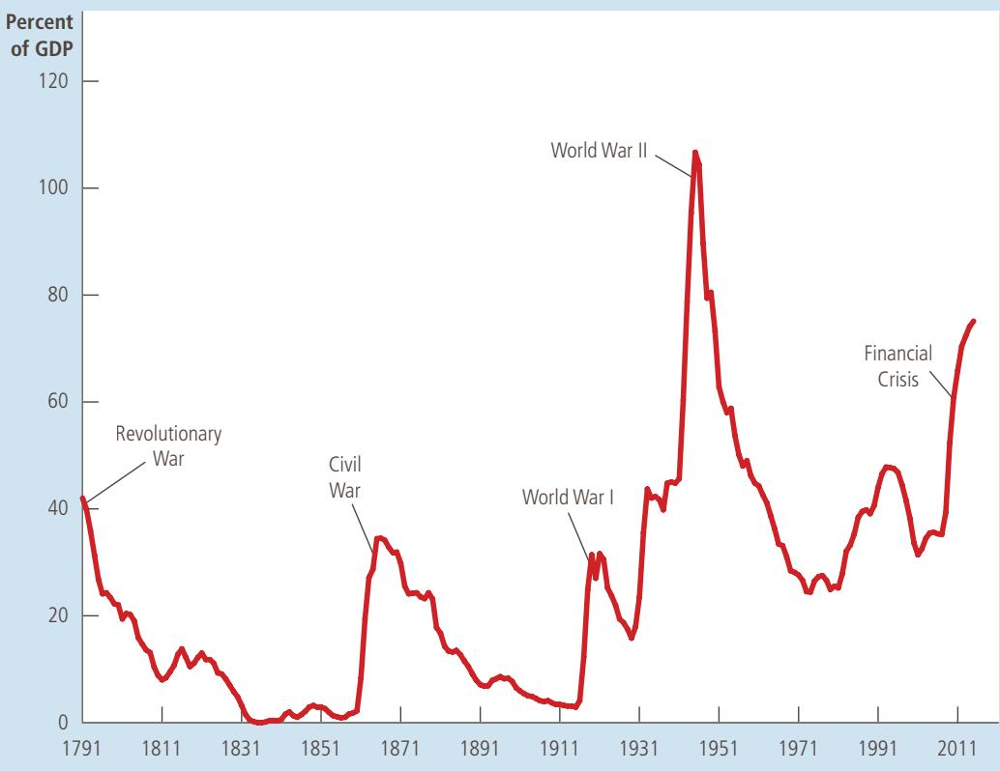

## THE HISTORY OF U.S. GOVERNMENT DEBT

How indebted is the U.S. government? The answer to this question varies substantially over time. Figure 5 shows the debt of the U.S. federal government expressed as a percentage of U.S. GDP. It shows that the government debt has fluctuated from zero in 1836 to 107 percent of GDP in 1945.

The behavior of the debt-to-GDP ratio is one gauge of what’s happening with the government’s finances. Because GDP is a rough measure of the government’s tax base, a declining debt-to-GDP ratio indicates that the government indebtedness is shrinking relative to its ability to raise tax revenue. This suggests that the government is, in some sense, living within its means. By contrast, a rising debt-to-GDP ratio means that the government indebtedness is increasing relative to its ability to raise tax revenue. It is often interpreted as meaning that fiscal policy—government spending and taxes—cannot be sustained forever at current levels.

## FIGURE 5

The U.S. Government Debt

The debt of the U.S. federal government, expressed here as a percentage of GDP, has varied throughout history. Wartime spending is typically associated with substantial increases in government debt. Source: U.S. Department of Treasury; U.S. Department of Commerce; and T. S. Berry, “Production and Population since 1789,” Bostwick Paper No. 6, Richmond, 1988.

  
Copyright 2018 Cengage Learning. All Rights Reserved. May not be copied, scanned, or duplicated, in whole or in part. WCN 02-200-203

Throughout history, the primary cause of fluctuations in government debt has been war. When wars occur, government spending on national defense rises substantially to pay for soldiers and military equipment. Taxes sometimes rise as well but typically by much less than the increase in spending. The result is a budget deficit and increasing government debt. When the war is over, government spending declines and the debt-to-GDP ratio starts declining as well.

There are two reasons to believe that debt financing of war is an appropriate policy. First, it allows the government to keep tax rates smooth over time. Without debt financing, tax rates would have to rise sharply during wars, and this would cause a substantial decline in economic efficiency. Second, debt financing of wars shifts part of the cost of wars to future generations, who will have to pay off the government debt. This is arguably a fair distribution of the burden, for future generations get some of the benefit when one generation fights a war to defend the nation against foreign aggressors.

One large increase in government debt that cannot be explained by war is the increase that occurred beginning around 1980. When President Ronald Reagan took office in 1981, he was committed to smaller government and lower taxes. Yet he found cutting government spending to be more difficult politically than cutting taxes. The result was the beginning of a period of large budget deficits that continued not only through Reagan’s time in office but also for many years thereafter. As a result, government debt rose from 26 percent of GDP in 1980 to 48 percent of GDP in 1993.

Because government budget deficits reduce national saving, investment, and long-run economic growth, the rise in government debt during the 1980s troubled many economists and policymakers. When Bill Clinton moved into the Oval Office in 1993, deficit reduction was his first major goal. Similarly, when the Republicans took control of Congress in 1995, deficit reduction was high on their legislative agenda. Both of these efforts substantially reduced the size of the government budget deficit. In addition, a booming economy in the late 1990s brought in even more tax revenue. Eventually, the federal budget turned from deficit to surplus, and the debt-to-GDP ratio declined significantly for several years.

This fall in the debt-to-GDP ratio, however, stopped during the presidency of George W. Bush, as the budget surplus turned back into a budget deficit. There were three main reasons for this change. First, President Bush signed into law several major tax cuts, which he had promised during the 2000 presidential campaign. Second, in 2001, the economy experienced a recession (a reduction in economic activity), which automatically decreased tax revenue and increased government spending. Third, there were increases in government spending on homeland security following the September 11, 2001 attacks and on the subsequent wars in Iraq and Afghanistan.

Truly dramatic increases in the debt-to-GDP ratio started occurring in 2008, as the economy experienced a financial crisis and a deep recession. (The accompanying FYI box addresses this topic briefly, but we will study it more fully in coming chapters.) The recession automatically increased the budget deficit, and several policy measures enacted during the Bush and Obama administrations aimed at combating the recession reduced tax revenue and increased government spending even more. From 2009 to 2012, the federal government’s budget deficit averaged about 9 percent of GDP, levels not seen since World War II. The borrowing to finance these deficits led to an increase in the debt-to-GDP ratio from 39 percent in 2008 to 70 percent in 2012. After 2012, as the economy recovered, the budget deficits shrank, and the increases in the debt-to-GDP ratio became smaller.

FYI

## Financial Crises

n 2008 and 2009, the U.S. economy and many other major economies around the world experienced a financial crisis, which in turn led to a deep downturn in economic activity. We will examine these events in detail later in this book. But because this chapter introduces the financial system, let’s discuss briefly the key elements of financial crises.

The first element of a financial crisis is a large decline in some asset prices. In 2008 and 2009, that asset was real estate. The price of housing, after experiencing a boom earlier in the decade, fell by about 30 percent over just a few years. Such a large decline in real estate prices had not been seen in the United States since the 1930s.

The second element of a financial crisis is widespread insolvencies at financial institutions. (A company is insolvent when its debts exceed the value of its assets.) In 2008 and 2009, many banks and other financial firms had in effect placed bets on real estate prices by holding mortgages backed by that real estate. When house prices fell, large numbers of homeowners stopped repaying their loans. These defaults pushed several major financial institutions toward bankruptcy.

The third element of a financial crisis is a decline in confidence in financial institutions. Although some deposits in banks are insured by government policies, not all are. As insolvencies mounted, every financial institution became a possible candidate for the next bankruptcy. Individuals and firms with uninsured deposits in those institutions pulled out their money. Facing a rash of withdrawals, banks started selling off assets (sometimes at reduced “fire-sale” prices) and cut back on new lending.

The fourth element of a financial crisis is a credit crunch. With many financial institutions facing difficulties, prospective borrowers had trouble getting

loans, even if they had profitable

investment projects. In essence, the financial system had trouble performing its normal function of directing the resources of savers into the hands of borrowers with the best investment opportunities.

The fifth element of a financial crisis is an economic downturn. With people unable to obtain financing for new investment projects, the overall demand for goods and services declined. As a result, for reasons we discuss more fully later in the book, national income fell and unemployment rose.

The sixth and final element of a financial crisis is a vicious circle. The economic downturn reduced the profitability of many companies and the value of many assets. Thus, we started over again at step one, and the problems in the financial system and the economic downturn reinforced each other.

Financial crises, such as the one of 2008 and 2009, can have severe consequences. Fortunately, they do end. Financial institutions eventually get back on their feet, perhaps with some help from government policy, and they return to their normal function of financial intermediation. ■

## 13-4 Conclusion

“Neither a borrower nor a lender be,” Polonius advises his son in Shakespeare’s Hamlet. If everyone followed this advice, this chapter would have been unnecessary.

Few economists would agree with Polonius. In our economy, people borrow and lend often, and usually for good reason. You may borrow one day to start your own business or to buy a home. And people may lend to you in the hope that the interest you pay will allow them to enjoy a more prosperous retirement. The financial system’s job is to coordinate all this borrowing and lending activity.

In many ways, financial markets are like other markets in the economy. The price of loanable funds—the interest rate—is governed by the forces of supply and demand, just as other prices in the economy are. And we can analyze shifts in supply or demand in financial markets as we do in other markets. One of the Ten Principles of Economics introduced in Chapter 1 is that markets are usually a good way to organize economic activity. This principle applies to financial markets as well. When financial markets bring the supply and demand for loanable funds into balance, they help allocate the economy’s scarce resources to their most efficient uses.

In one way, however, financial markets are special. Financial markets, unlike most other markets, serve the important role of linking the present and the future. Those who supply loanable funds—savers—do so because they want to convert some of their current income into future purchasing power. Those who demand loanable funds—borrowers—do so because they want to invest today in order to have additional capital in the future to produce goods and services. Thus, wellfunctioning financial markets are important not only for current generations but also for future generations who will inherit many of the resulting benefits.

## CHAPTER QuickQuiz

1. Elaine wants to buy and operate an ice-cream truck but doesn’t have the financial resources to start the business. She borrows \$10,000 from her friend George, to whom she promises an interest rate of 7 percent, and gets another \$20,000 from her friend Jerry, to whom she promises a third of her profits. What best describes this situation? a. George is a stockholder, and Elaine is a bondholder. b. George is a stockholder, and Jerry is a bondholder. c. Jerry is a stockholder, and Elaine is a bondholder. d. Jerry is a stockholder, and George is a bondholder.

2. If the government collects more in tax revenue than it spends, and households consume more than they get in after-tax income, then a. private and public saving are both positive. b. private and public saving are both negative. c. private saving is positive, but public saving is negative. d. private saving is negative, but public saving is positive.

3. A closed economy has income of \$1,000, government spending of \$200, taxes of \$150, and investment of \$250. What is private saving?

a. \$100

b. \$200

c. \$300

d. \$400

## SUMMARY

The U.S. financial system is made up of many types of financial institutions, such as the bond market, the stock market, banks, and mutual funds. All these institutions act to direct the resources of households that want to save some of their income into the hands of households and firms that want to borrow.

•	 National income accounting identities reveal some important relationships among macroeconomic

4. If a popular TV show on personal finance convinces Americans to save more for retirement, the curve for loanable funds would shift, driving the equi librium interest rate a. supply, up b. supply, down c. demand, up d. demand, down

5. If the business community becomes more optimistic about the profitability of capital, the curve for loanable funds would shift, driving the equilibrium interest rate a. supply, up b. supply, down c. demand, up d. demand, down

6. From 2008 to 2012, the ratio of government debt to GDP in the United States a. increased markedly. b. decreased markedly. c. was stable at a historically high level. d. was stable at a historically low level.

variables. In particular, for a closed economy, national saving must equal investment. Financial institutions are the mechanism through which the economy matches one person’s saving with another person’s investment.

The interest rate is determined by the supply and demand for loanable funds. The supply of loanable funds comes from households that want to save some of their income and lend it out. The demand for loanable funds comes from households and firms that want to borrow for investment. To analyze how any policy or event affects the interest rate, one must consider how it affects the supply and demand for loanable funds.

National saving equals private saving plus public saving. A government budget deficit represents negative public saving and, therefore, reduces national saving and the supply of loanable funds available to finance investment. When a government budget deficit crowds out investment, it reduces the growth of productivity and GDP.

## KEY CONCEPTS

financial system, p. 258 financial markets, p. 258 bond, p. 259 stock, p. 259 financial intermediaries, p. 260 mutual fund, p. 261 national saving (saving), p. 264 private saving, p. 264 public saving, p. 264 budget surplus, p. 264

budget deficit, p. 264 market for loanable funds, p. 265 crowding out, p. 271

## QUESTIONS FOR REVIEW

1. What is the role of the financial system? Name and describe two markets that are part of the financial system in the U.S. economy. Name and describe two financial intermediaries.

2. Why is it important for people who own stocks and bonds to diversify their holdings? What type of financial institution makes diversification easier?

3. What is national saving? What is private saving? What is public saving? How are these three variables related?

4. What is investment? How is it related to national saving in a closed economy?

5. Describe a change in the tax code that might increase private saving. If this policy were implemented, how would it affect the market for loanable funds?

6. What is a government budget deficit? How does it affect interest rates, investment, and economic growth?

## PROBLEMS AND APPLICATIONS

1. For each of the following pairs, which bond would you expect to pay a higher interest rate? Explain.

a. a bond of the U.S. government or a bond of an Eastern European government

b. a bond that repays the principal in year 2020 or a bond that repays the principal in year 2040

c. a bond from Coca-Cola or a bond from a software company you run in your garage

d. a bond issued by the federal government or a bond issued by New York State

2. Many workers hold large amounts of stock issued by the firms at which they work. Why do you suppose companies encourage this behavior? Why might a

person not want to hold stock in the company where he works?

3. Explain the difference between saving and investment as defined by a macroeconomist. Which of the following situations represent investment and which represent saving? Explain.

a. Your family takes out a mortgage and buys a new house.

b. You use your \$200 paycheck to buy stock in AT&T.

c. Your roommate earns \$100 and deposits it in his account at a bank.

d. You borrow \$1,000 from a bank to buy a car to use in your pizza delivery business.

4. Suppose GDP is \$8 trillion, taxes are \$1.5 trillion, private saving is \$0.5 trillion, and public saving is \$0.2 trillion. Assuming this economy is closed, calculate consumption, government purchases, national saving, and investment.

5. Economists in Funlandia, a closed economy, have collected the following information about the economy for a particular year:

$$
Y = 1 0, 0 0 0
$$

$$
C = 6, 0 0 0
$$

$$
T = 1, 5 0 0
$$

$$
G = 1, 7 0 0
$$

The economists also estimate that the investment function is:

$$
I = 3, 3 0 0 - 1 0 0 r,
$$

where r is the country’s real interest rate, expressed as a percentage. Calculate private saving, public saving, national saving, investment, and the equilibrium real interest rate.

6. Suppose that Intel is considering building a new chipmaking factory.

a. Assuming that Intel needs to borrow money in the bond market, why would an increase in interest rates affect Intel’s decision about whether to build the factory?

b. If Intel has enough of its own funds to finance the new factory without borrowing, would an increase in interest rates still affect Intel’s decision about whether to build the factory? Explain.

7. Three students have each saved \$1,000. Each has an investment opportunity in which he or she can invest up to \$2,000. Here are the rates of return on the students’ investment projects:

<table><tr><td>Harry</td><td>5 percent</td></tr><tr><td>Ron</td><td>8 percent</td></tr><tr><td>Hermione</td><td>20 percent</td></tr></table>

a. If borrowing and lending are prohibited, so each student uses only personal saving to finance his or her own investment project, how much will each student have a year later when the project pays its return?

b. Now suppose their school opens up a market for loanable funds in which students can borrow and lend among themselves at an interest rate r. What would determine whether a student would choose to be a borrower or lender in this market?

c. Among these three students, what would be the quantity of loanable funds supplied and quantity demanded at an interest rate of 7 percent? At 10 percent?

d. At what interest rate would the loanable funds market among these three students be in equilibrium? At this interest rate, which student(s) would borrow and which student(s) would lend?

e. At the equilibrium interest rate, how much does each student have a year later after the investment projects pay their return and loans have been repaid? Compare your answers to those you gave in part (a). Who benefits from the existence of the loanable funds market—the borrowers or the lenders? Is anyone worse off?

8. Suppose the government borrows \$20 billion more next year than this year.

a. Use a supply-and-demand diagram to analyze this policy. Does the interest rate rise or fall?

b. What happens to investment? To private saving? To public saving? To national saving? Compare the size of the changes to the \$20 billion of extra government borrowing.

c. How does the elasticity of supply of loanable funds affect the size of these changes?

d. How does the elasticity of demand for loanable funds affect the size of these changes?

e. Suppose households believe that greater government borrowing today implies higher taxes to pay off the government debt in the future. What does this belief do to private saving and the supply of loanable funds today? Does it increase or decrease the effects you discussed in parts (a) and (b)?

9. This chapter explains that investment can be increased both by reducing taxes on private saving and by reducing the government budget deficit.

a. Why is it difficult to implement both of these policies at the same time?

b. What would you need to know about private saving to judge which of these two policies would be a more effective way to raise investment?

To find additional study resources, visit cengagebrain.com, and search for “Mankiw.”
