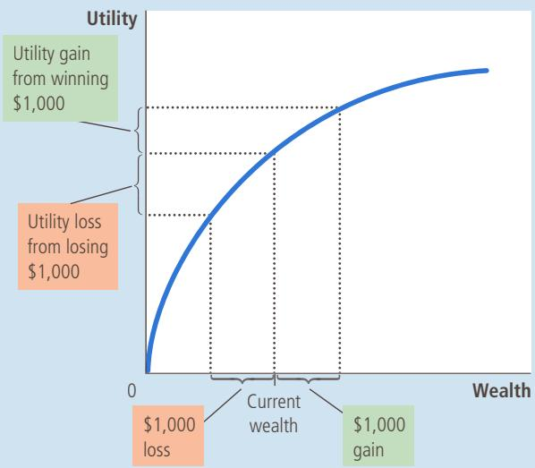
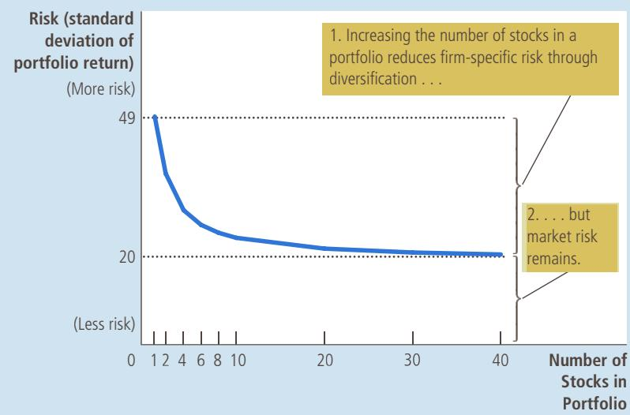
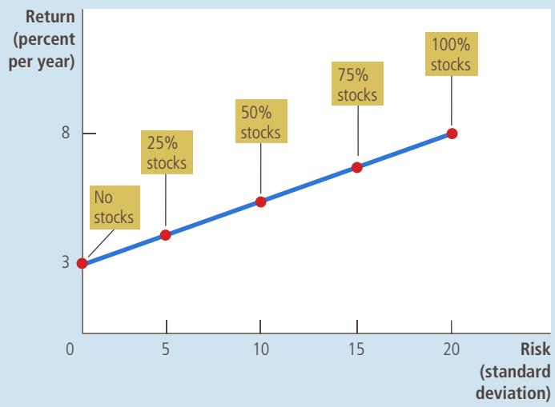
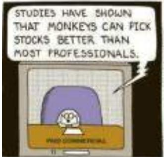
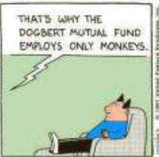
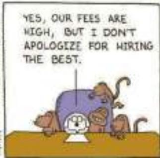
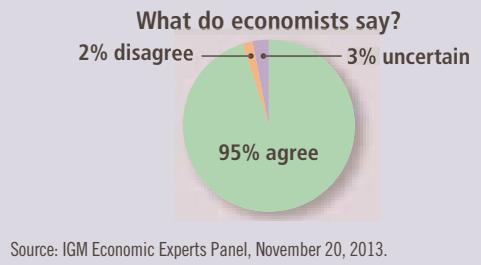
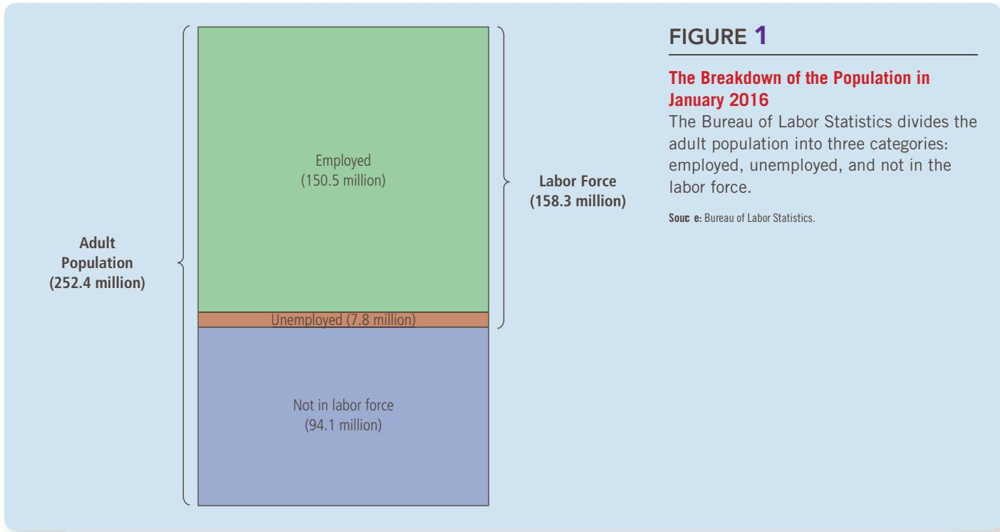

# The Magic of Compounding and the Rule of 70

uppose you observe that one country has an average growth rate Sof 1 percent per year, while another has an average growth rate of 3 percent per year. At first, this might not seem like a big deal. What difference can 2 percent make?

The answer is: a big difference. Growth rates that seem small when written in percentage terms are large after they are compounded for many years.

Consider an example. Suppose that two college graduates—Elliot and Darlene—both take their first jobs at the age of 22 earning \$30,000 a year. Elliot lives in an economy where all incomes grow at 1 percent per year, while Darlene lives in one where incomes grow at 3 percent per year. Straightforward calculations show what happens. Forty years later, when both are 62 years old, Elliot earns \$45,000 a year, while Darlene earns \$98,000. Because of that difference of 2 percentage points in the growth rate, Darlene’s salary is more than twice Elliot’s.

An old rule of thumb, called the rule of 70, is helpful in understanding growth rates and the effects of compounding. According to the rule of 70, if some variable grows at a rate of x percent per year, then that variable doubles in approximately 70/x years. In Elliot’s economy, incomes grow at 1 percent per year, so it takes about 70 years for incomes to double. In

Darlene’s economy, incomes grow at 3 percent per year, so it takes about 70/3, or 23, years for incomes to double.

The rule of 70 applies not

## only to a growing economy but also to

a growing savings account. Here is an example: In 1791, Ben Franklin died and left \$5,000 to be invested for a period of 200 years to benefit medical students and scientific research. If this money had earned 7 percent per year (which would, in fact, have been possible), the investment would have doubled in value every 10 years. Over 200 years, it would have doubled 20 times. At the end of 200 years of compounding, the investment would have been worth 220 × \$5,000, which is about \$5 billion. (In fact, Franklin’s \$5,000 grew to only \$2 million over 200 years because some of the money was spent along the way.)

As these examples show, growth rates and interest rates compounded over many years can lead to some spectacular results. That is probably why Albert Einstein once called compounding “the greatest mathematical discovery of all time.”

To make the right choice, you need to calculate the present value of the stream of payments. Let’s suppose the interest rate is 7 percent. After performing 50 calculations similar to those above (one calculation for each payment) and adding up the results, you would learn that the present value of this million-dollar prize at a 7 percent interest rate is only \$276,000. You are better off picking the immediate payment of \$400,000. The million dollars may seem like more money, but the future cash flows, once discounted to the present, are worth far less.

QuickQuiz

The interest rate is 7 percent. What is the present value of \$150 to be received in 10 years?

## 14-2 Managing Risk

Life is full of gambles. When you go skiing, you risk breaking your leg in a fall. When you drive to work, you risk a car accident. When you put some of your savings in the stock market, you risk a fall in stock prices. The rational response to this risk is not necessarily to avoid it at any cost but to take it into account in your decision making. Let’s consider how a person might do that.

## 14-2a Risk Aversion

risk aversion a dislike of uncertainty

Most people are risk averse. This means more than that people dislike bad things happening to them. It means that they dislike bad things more than they like comparable good things.

For example, suppose a friend offers you the following opportunity. She will toss a coin. If it comes up heads, she will pay you \$1,000. But if it comes up tails, you will have to pay her \$1,000. Would you accept the bargain? You wouldn’t if you were risk averse. For a risk-averse person, the pain of losing the \$1,000 would exceed the pleasure from winning \$1,000.

Economists have developed models of risk aversion using the concept of utility, which is a person’s subjective measure of well-being or satisfaction. Every level of wealth provides a certain amount of utility, as shown by the utility function in Figure 1. But the function exhibits the property of diminishing marginal utility: The more wealth a person has, the less utility she gets from an additional dollar. Thus, in the figure, the utility function gets flatter as wealth increases. Because of diminishing marginal utility, the utility lost from losing the \$1,000 bet is more than the utility gained from winning it. As a result, people are risk averse.

Risk aversion provides the starting point for explaining various things we observe in the economy. Let’s consider three of them: insurance, diversification, and the risk-return trade-off.

## 14-2b The Markets for Insurance

One way to deal with risk is to buy insurance. The general feature of insurance contracts is that a person facing a risk pays a fee to an insurance company, which in return agrees to accept all or part of the risk. There are many types of insurance. Car insurance covers the risk of your being in an auto accident, fire insurance covers the risk that your house will burn down, health insurance covers the risk that you might need expensive medical treatment, and life insurance covers the risk that you will die and leave your family without your income. There is also insurance against the risk of living too long: For a fee paid today, an insurance company will pay you an annuity—a regular income every year until you die.

In a sense, every insurance contract is a gamble. It is possible that you will not be in an auto accident, that your house will not burn down, and that you will not need expensive medical treatment. In most years, you will pay the insurance company the premium and get nothing in return except peace of mind. Indeed,

## FIGURE 1

## The Utility Function

This utility function shows how utility, a subjective measure of satisfaction, depends on wealth. As wealth rises, the utility function becomes flatter, reflecting the property of diminishing marginal utility. Because of diminishing marginal utility, a \$1,000 loss decreases utility by more than a \$1,000 gain increases it.

the insurance company is counting on the fact that most people will not make claims on their policies; otherwise, it couldn’t pay out large claims to the unlucky few and still stay in business.

From the standpoint of the economy as a whole, the role of insurance is not to eliminate the risks inherent in life but to spread them around more efficiently. Consider fire insurance, for instance. Owning fire insurance does not reduce the risk of losing your home in a fire. But if that unlucky event occurs, the insurance company compensates you. The risk, rather than being borne by you alone, is shared among the thousands of insurance-company shareholders. Because people are risk averse, it is easier for 10,000 people to bear 1/10,000 of the risk than for one person to bear the entire risk herself.

The markets for insurance suffer from two types of problems that impede their ability to spread risk. One problem is adverse selection: A high-risk person is more likely to apply for insurance than a low-risk person because a high-risk person would benefit more from insurance protection. A second problem is moral hazard: After people buy insurance, they have less incentive to be careful about their risky behavior because the insurance company will cover much of the resulting losses. Insurance companies are aware of these problems, but they cannot fully guard against them. An insurance company cannot perfectly distinguish between high-risk and low-risk customers, and it cannot monitor all of its customers’ risky behavior. The price of insurance reflects the actual risks that the insurance company will face after the insurance is bought. The high price of insurance is why some people, especially those who know themselves to be low-risk, decide against buying it and, instead, endure some of life’s uncertainty on their own.

## 14-2c Diversification of Firm-Specific Risk

In 2002, Enron, a large and once widely respected company, went bankrupt amid accusations of fraud and accounting irregularities. Several of the company’s top executives were prosecuted and ended up going to prison. The saddest part of the story, however, involved thousands of lower-level employees. Not only did they lose their jobs but many lost their life savings as well. The employees had put about two-thirds of their retirement funds in Enron stock, which became worthless.

If there is one piece of practical advice that finance offers to risk-averse people, it is this: “Don’t put all your eggs in one basket.” You may have heard this before, but finance has turned this folk wisdom into a science. It goes by the name diversification.

The market for insurance is one example of diversification. Imagine a town with 10,000 homeowners, each facing the risk of a house fire. If someone starts an insurance company and each person in town becomes both a shareholder and a policyholder of the company, they all reduce their risk through diversification. Each person now faces 1/10,000 of the risk of 10,000 possible fires, rather than the entire risk of a single fire in her own home. Unless the entire town catches fire at the same time, the downside that each person faces is much smaller.

When people use their savings to buy financial assets, they can also reduce risk through diversification. A person who buys stock in a company is placing a bet on the future profitability of that company. That bet is often quite risky because companies’ fortunes are hard to predict. Microsoft evolved from a start-up by some geeky teenagers into one of the world’s most valuable companies in only a few years; Enron went from one of the world’s most respected companies to an almost worthless one in only a few months. Fortunately, a shareholder need not

## FIGURE 2

## Diversification Reduces Risk

This figure shows how the risk of a portfolio, measured here with a statistic called the standard deviation, depends on the number of stocks in the portfolio. The investor is assumed to put an equal percentage of her portfolio in each of the stocks. Increasing the number of stocks reduces, but does not eliminate, the amount of risk in a stock portfolio. Sourc e: Adapted from Meir Statman, “How Many Stocks Make a Diversified Portfolio?” Journal of Financial and Quantitative Analysis 22 (September 1987): 353–364.

tie her own fortune to that of any single company. Risk can be reduced by placing a large number of small bets, rather than a small number of large ones.

Figure 2 shows how the risk of a portfolio of stocks depends on the number of stocks in the portfolio. Risk is measured here with a statistic called the standard deviation, which you may have learned about in a math or statistics class. The standard deviation measures the volatility of a variable—that is, how much the variable is likely to fluctuate. The higher the standard deviation of a portfolio’s return, the more volatile its return is likely to be, and the riskier it is that someone holding the portfolio will fail to get the return that she expected.

The figure shows that the risk of a stock portfolio falls substantially as the number of stocks increases. For a portfolio with a single stock, the standard deviation is 49 percent. Going from 1 stock to 10 stocks eliminates about half the risk. Going from 10 to 20 stocks reduces the risk by another 10 percent. As the number of stocks continues to increase, risk continues to fall, although the reductions in risk after 20 or 30 stocks are small.

Notice that it is impossible to eliminate all risk by increasing the number of stocks in the portfolio. Diversification can eliminate firm-specific risk—the uncertainty associated with the specific companies. But diversification cannot eliminate market risk—the uncertainty associated with the entire economy, which affects all companies traded on the stock market. For example, when the economy goes into a recession, most companies experience falling sales, reduced profit, and low stock returns. Diversification reduces the risk of holding stocks, but it does not eliminate it.

market risk risk that affects all companies in the stock market

## 14-2d The Trade-off between Risk and Return

One of the Ten Principles of Economics in Chapter 1 is that people face trade-offs. The trade-off that is most relevant for understanding financial decisions is the trade-off between risk and return.

As we have seen, there are risks inherent in holding stocks, even in a diversified portfolio. But risk-averse people are willing to accept this uncertainty because they are compensated for doing so. Historically, stocks have offered much higher rates of return than alternative financial assets, such as bonds and bank savings accounts. Over the past two centuries, stocks offered an average real return of about 8 percent per year, while short-term government bonds paid a real return of only 3 percent per year.

When deciding how to allocate their savings, people have to decide how much risk they are willing to undertake to earn a higher return. For example, consider a person choosing how to allocate her portfolio between two asset classes:

The first asset class is a diversified group of risky stocks, with an average return of 8 percent and a standard deviation of 20 percent. (You may recall from a math or statistics class that a normal random variable stays within 2 standard deviations of its average about 95 percent of the time. Thus, while actual returns are centered around 8 percent, they typically vary from a gain of 48 percent to a loss of 32 percent.)

•	 The second asset class is a safe alternative, with a return of 3 percent and a standard deviation of zero. The safe alternative can be either a bank savings account or a government bond.

Figure 3 illustrates the trade-off between risk and return. Each point in this figure represents a particular allocation of a portfolio between risky stocks and the safe asset. The figure shows that the more the individual puts into stocks, the greater both the risk and the return are.

Acknowledging the risk-return trade-off does not, by itself, tell us what a person should do. The choice of a particular combination of risk and return depends on a person’s risk aversion, which reflects her own preferences. But it is important for stockholders to recognize that the higher average return that they enjoy comes at the price of higher risk.

Describe three ways that a risk-averse person might reduce the risk she faces.

## FIGURE 3

## The Trade-off between Risk and Return

When people increase the percentage of their savings that they have invested in stocks, they increase the average return they can expect to earn, but they also increase the risks they face.

## 14-3 Asset Valuation

Now that we have developed a basic understanding of the two building blocks of finance—time and risk—let’s apply this knowledge. This section considers a simple question: What determines the price of a share of stock? As with most prices, the answer is supply and demand. But that is not the end of the story. To understand stock prices, we need to think more deeply about what determines a person’s willingness to pay for a share of stock.

## 14-3a Fundamental Analysis

Let’s imagine that you have decided to put 60 percent of your savings into stock, and to achieve diversification, you have decided to buy twenty different stocks. If you open up the newspaper, you will find thousands of stocks listed. How should you pick the twenty for your portfolio?

When you buy stock, you are buying shares in a business. To decide which businesses you want to own, it is natural to consider two things: the value of that share of the business and the price at which the shares are being sold. If the price is less than the value, the stock is said to be undervalued. If the price is more than the value, the stock is said to be overvalued. If the price and the value are equal, the stock is said to be fairly valued. When choosing twenty stocks for your portfolio, you should prefer undervalued stocks. In these cases, you are getting a bargain by paying less than the business is worth.

This is easier said than done. Learning the price is easy: You can just look it up. Determining the value of the business is the hard part. The term fundamental analysis refers to the detailed analysis of a company to estimate its value. Many Wall Street firms hire stock analysts to conduct such fundamental analysis and offer advice about which stocks to buy.

The value of a stock to a stockholder is what she gets out of owning it, which includes the present value of the stream of dividend payments and the final sale price. Recall that dividends are the cash payments that a company makes to its shareholders. A company’s ability to pay dividends, as well as the value of the stock when the stockholder sells her shares, depends on the company’s ability to earn profits. Its profitability, in turn, depends on a large number of factors: the demand for its product, how much competition it faces, how much capital it has in place, whether its workers are unionized, how loyal its customers are, what kinds of government regulations and taxes it faces, and so on. The goal of fundamental analysis is to take all these factors into account to determine how much a share of stock in the company is worth.

If you want to rely on fundamental analysis to pick a stock portfolio, there are three ways to do it. One way is to do all the necessary research yourself, such as by reading through companies’ annual reports. A second way is to rely on the advice of Wall Street analysts. A third way is to buy shares in a mutual fund, which has a manager who conducts fundamental analysis and makes the decision for you.

## 14-3b The Efficient Markets Hypothesis

There is another way to choose twenty stocks for your portfolio: Pick them randomly by, for instance, putting the stock pages on your bulletin board and throwing darts at them. This may sound crazy, but there is reason to believe that it won’t lead you too far astray. That reason is called the efficient markets hypothesis.

efficient markets hypothesis the theory that asset prices reflect all publicly available information about the value of an asset

informational efficiency the description of asset prices that rationally reflect all available information

To understand this theory, the starting point is to acknowledge that each company listed on a major stock exchange is followed closely by many money managers, such as the individuals who run mutual funds. Every day, these managers monitor news stories and conduct fundamental analysis to try to determine the stock’s value. Their job is to buy a stock when its price falls below its fundamental value and to sell it when its price rises above its fundamental value.

The second piece to the efficient markets hypothesis is that the equilibrium of supply and demand sets the market price. This means that, at the market price, the number of shares being offered for sale exactly equals the number of shares that people want to buy. In other words, at the market price, the number of people who think the stock is overvalued exactly balances the number of people who think it’s undervalued. As judged by the typical person in the market, all stocks are fairly valued all the time.

According to this theory, the stock market exhibits informational efficiency: It reflects all available information about the value of the asset. Stock prices change when information changes. When good news about the company’s prospects becomes public, the value and the stock price both rise. When the company’s prospects deteriorate, the value and price both fall. But at any moment in time, the market price is the best guess of the company’s value based on available information.

random walk the path of a variable whose changes are impossible to predict

One implication of the efficient markets hypothesis is that stock prices should follow a random walk. This means that changes in stock prices are impossible to predict from available information. If, based on publicly available information, a person could predict that a stock price would rise by 10 percent tomorrow, then the stock market must be failing to incorporate that information today. According to this theory, the only thing that can move stock prices is news that changes the market’s perception of the company’s value. But news must be unpredictable— otherwise, it wouldn’t really be news. For the same reason, changes in stock prices should be unpredictable.

If the efficient markets hypothesis is correct, then there is little point in spending many hours studying the business page to decide which twenty stocks to add to your portfolio. If prices reflect all available information, no stock is a better buy than any other. The best you can do is to buy a diversified portfolio.

## RANDOM WALKS AND INDEX FUNDS

CASE The efficient markets hypothesis is a theory about how financial STUDY markets work. The theory may not be completely true: As we discuss in the next section, there is reason to doubt that stockholders are always rational and that stock prices are informationally efficient at every moment. Nonetheless, the efficient markets hypothesis does much better as a description of the world than you might expect.

  
SYNDICATE, INC. 1997 SCOTT ADAMS / DIST. BY UNITED FEATURE

There is much evidence that stock prices, even if not exactly a random walk, are very close to it. For example, you might be tempted to buy stocks that have recently risen and avoid stocks that have recently fallen (or perhaps just the opposite). But statistical studies have shown that following such trends (or bucking them) fails to outperform the market. The correlation between how well a stock does one year and how well it does the following year is about zero.

Some of the best evidence in favor of the efficient markets hypothesis comes from the performance of index funds. An index fund is a mutual fund that buys all the stocks in a given stock index. The performance of these funds can be compared with that of actively managed mutual funds, where a professional portfolio manager picks stocks based on extensive research and alleged expertise. In essence, an index fund buys all stocks, whereas active funds are supposed to buy only the best stocks.

## ASK THE EXPERTS

In practice, active managers usually fail to beat index funds. For example, in the 15-year period ending February 2016, 81 percent of stock mutual funds performed worse than a broadly based index fund holding all stocks traded on U.S. stock exchanges. Over this period, the average annual return on stock funds fell short of the return on the index fund by 0.89 percentage points. Most active

## Diversification

“In general, absent any inside information, an equity investor can expect to do better by choosing a well-diversified, low-cost index fund than by picking a few stocks.”

portfolio managers failed to beat the market because they trade more frequently, incurring more trading costs, and because they charge greater fees as compensation for their alleged expertise.

What about the 19 percent of managers who did beat the market? Perhaps they are smarter than average, or perhaps they were luckier. If you have 5,000 people flipping coins ten times, on average about 5 will flip ten heads; these 5 might claim an exceptional coin-flipping skill, but they would have trouble replicating the feat. Similarly, studies have shown that mutual fund managers with a history of superior performance usually fail to maintain it in subsequent periods.

The efficient markets hypothesis says that it is impossible to beat the market. The accumulation of many studies of financial markets confirms that beating the market is, at best, extremely difficult. Even if the efficient markets hypothesis is not an exact description of the world, it contains a large element of truth. ●

## 14-3c Market Irrationality

The efficient markets hypothesis assumes that people buying and selling stock rationally process the information they have about the stock’s underlying value. But is the stock market really that rational? Or do stock prices sometimes deviate from reasonable expectations of their true value?

There is a long tradition suggesting that fluctuations in stock prices are partly psychological. In the 1930s, economist John Maynard Keynes suggested that asset markets are driven by the “animal spirits” of investors—irrational waves of optimism and pessimism. In the 1990s, as the stock market soared to new heights, Fed Chairman Alan Greenspan questioned whether the boom reflected “irrational exuberance.” Stock prices did subsequently fall, but whether the exuberance of the 1990s was irrational given the information available at the time remains debatable. Whenever the price of an asset rises above what appears to be its fundamental value, the market is said to be experiencing a speculative bubble.

The possibility of speculative bubbles in the stock market arises in part because the value of the stock to a stockholder depends not only on the stream of dividend payments but also on the final sale price. Thus, a person might be willing to pay more than a stock is worth today if she expects another person to pay even more for it tomorrow. When evaluating a stock, you have to estimate not only the value of the business but also what other people will think the business is worth in the future.

There is much debate among economists about the frequency and importance of departures from rational pricing. Believers in market irrationality point out (correctly) that the stock market often moves in ways that are hard to explain on the basis of news that might alter a rational valuation. Believers in the efficient markets hypothesis point out (correctly) that it is impossible to know the correct, rational valuation of a company, so one should not quickly jump to the conclusion that any particular valuation is irrational. Moreover, if the market were irrational, a rational person should be able to take advantage of this fact; yet as the previous case study discussed, beating the market is nearly impossible.

QuickQuiz Fortune magazine regularly publishes a list of the “most respected” companies. According to the efficient markets hypothesis, if you restrict your stock portfolio to these companies, will you earn a better-than-average return? Explain.

## 14-4 Conclusion

This chapter has developed some of the basic tools that people should (and often do) use as they make financial decisions. The concept of present value reminds us that a dollar in the future is less valuable than a dollar today, and it gives us a way to compare sums of money at different points in time. The theory of risk management reminds us that the future is uncertain and that risk-averse people can take precautions to guard against this uncertainty. The study of asset valuation tells us that the stock price of any company should reflect its expected future profitability.

Although most of the tools of finance are well established, there is more controversy about the validity of the efficient markets hypothesis and whether stock prices are, in practice, rational estimates of a company’s true worth. Rational or not, the large movements in stock prices that we observe have important macroeconomic implications. Stock market fluctuations often go hand in hand with fluctuations in the economy more broadly. We revisit the stock market when we study economic fluctuations later in the book.

## CHAPTER QuickQuiz

1. If the interest rate is zero, then \$100 to be paid in 10 years has a present value that is a. less than \$100. b. exactly \$100. c. more than \$100. d. indeterminate.

2. If the interest rate is 10 percent, then the future value in 2 years of \$100 today is a. \$80. b. \$83. c. \$120. d. \$121.

3. If the interest rate is 10 percent, then the present value of \$100 to be paid in 2 years is a. \$80 b. \$83. c. \$120. d. \$121.

4. The ability of insurance to spread risk is limited by a. risk aversion and moral hazard. b. risk aversion and adverse selection. c. moral hazard and adverse selection. d. risk aversion only.

5. The benefit of diversification when constructing a portfolio is that it can eliminate

a. speculative bubbles.

b. risk aversion.

c. firm-specific risk.

d. market risk.

6. According to the efficient markets hypothesis,

a. changes in stock prices are impossible to predict from public information.

b. excessive diversification can reduce an investor’s expected portfolio returns.

c. the stock market moves based on the changing animal spirits of investors.

d. actively managed mutual funds should give higher returns than index funds.

## SUMMARY

Because savings can earn interest, a sum of money today is more valuable than the same sum of money in the future. A person can compare sums from different times using the concept of present value. The present value of any future sum is the amount that would be needed today, given prevailing interest rates, to produce that future sum.

Because of diminishing marginal utility, most people are risk averse. Risk-averse people can reduce risk by buying insurance, diversifying their holdings, and choosing a portfolio with lower risk and lower return.

The value of an asset equals the present value of the cash flows the owner will receive. For a share of stock, these cash flows include the stream of dividends and the final sale price. According to the efficient markets hypothesis, financial markets process available information rationally, so a stock price always equals the best estimate of the value of the underlying business. Some economists question the efficient markets hypothesis, however, and believe that irrational psychological factors also influence asset prices.

## KEY CONCEPTS

finance, p. 280 present value, p. 280 future value, p. 280 compounding, p. 280 risk aversion, p. 282 diversification, p. 284 firm-specific risk, p. 285 market risk, p. 285

fundamental analysis, p. 287 efficient markets hypothesis, p. 287 informational efficiency, p. 288 random walk, p. 288

## QUESTIONS FOR REVIEW

1. The interest rate is 7 percent. Use the concept of present value to compare \$200 to be received in 10 years and \$300 to be received in 20 years.

2. What benefit do people get from the market for insurance? What two problems impede the insurance market from working perfectly?

3. What is diversification? Does a stockholder get a greater benefit from diversification when going from 1 to 10 stocks or when going from 100 to 120 stocks?

4. Comparing stocks and government bonds, which type of asset has more risk? Which pays a higher average return?

5. What factors should a stock analyst think about in determining the value of a share of stock?

6. Describe the efficient markets hypothesis, and give a piece of evidence consistent with this hypothesis.

7. Explain the view of those economists who are skeptical of the efficient markets hypothesis.

## PROBLEMS AND APPLICATIONS

1. According to an old myth, Native Americans sold the island of Manhattan about 400 years ago for \$24. If they had invested this amount at an interest rate of 7 percent per year, how much, approximately, would they have today?

2. A company has an investment project that would cost \$10 million today and yield a payoff of \$15 million in 4 years.

a. Should the firm undertake the project if the interest rate is 11 percent? 10 percent? 9 percent? 8 percent?

b. Can you figure out the exact cutoff for the interest rate between profitability and nonprofitability?

3. Bond A pays \$8,000 in 20 years. Bond B pays \$8,000 in 40 years. (To keep things simple, assume these are zero-coupon bonds, which means the \$8,000 is the only payment the bondholder receives.)

a. If the interest rate is 3.5 percent, what is the value of each bond today? Which bond is worth more? Why? (Hint: You can use a calculator, but the rule of 70 should make the calculation easy.)

b. If the interest rate increases to 7 percent, what is the value of each bond? Which bond has a larger percentage change in value?

c. Based on the example above, complete the two blanks in this sentence: “The value of a bond [rises/falls] when the interest rate increases, and bonds with a longer time to maturity are [more/less] sensitive to changes in the interest rate.”

4. Your bank account pays an interest rate of 8 percent. You are considering buying a share of stock in XYZ Corporation for \$110. After 1, 2, and 3 years, it will pay a dividend of \$5. You expect to sell the stock after 3 years for \$120. Is XYZ a good investment? Support your answer with calculations.

5. For each of the following kinds of insurance, give an example of behavior that can be called moral hazard and another example of behavior that can be called adverse selection.

a. health insurance

b. car insurance

c. life insurance

6. Which kind of stock would you expect to pay the higher average return: stock in an industry that is very sensitive to economic conditions (such as an automaker) or stock in an industry that is relatively insensitive to economic conditions (such as a water company)? Why?

7. A company faces two kinds of risk. A firm-specific risk is that a competitor might enter its market and take some of its customers. A market risk is that the economy might enter a recession, reducing sales. Which of these two risks would more likely cause the company’s shareholders to demand a higher return? Why?

8. When company executives buy and sell stock based on private information they obtain as part of their jobs, they are engaged in insider trading.

a. Give an example of inside information that might be useful for buying or selling stock.

b. Those who trade stocks based on inside information usually earn very high rates of return. Does this fact violate the efficient markets hypothesis?

c. Insider trading is illegal. Why do you suppose that is?

9. Jamal has a utility function U 5 W1/2, where W is his wealth in millions of dollars and U is the utility he obtains from that wealth. In the final stage of a game show, the host offers Jamal a choice between (A) \$4 million for sure, or (B) a gamble that pays \$1 million with probability 0.6 and \$9 million with probability 0.4. a. Graph Jamal’s utility function. Is he risk averse? Explain.

b. Does A or B offer Jamal a higher expected prize? Explain your reasoning with appropriate calculations. (Hint: The expected value of a random variable is the weighted average of the possible outcomes, where the probabilities are the weights.)

c. Does A or B offer Jamal a higher expected utility? Again, show your calculations.

d. Should Jamal pick A or B? Why?

To find additional study resources, visit cengagebrain.com, and search for “Mankiw.”

osing a job can be the most distressing economic event in a person’s life. Most people rely on their labor earnings to maintain their standard of living, and many people also get a sense of personal accomplishment from working. A job loss means a lower living standard in the present, anxiety about the future, and reduced self-esteem. It is not surprising, therefore, that politicians campaigning for office often speak about how their proposed policies will help create jobs.

In previous chapters, we have seen some of the forces that determine the level and growth of a country’s standard of living. A country that saves and invests a high fraction of its income, for instance, enjoys more rapid growth in its capital stock and GDP than a similar country that saves and invests less. An even more obvious determinant of a country’s

standard of living is the amount of unemployment it typically experiences. People who would like to work but cannot find a job are not contributing to the economy’s production of goods and services. Although some degree of unemployment is inevitable in a complex economy with thousands of firms and millions of workers, the amount of unemployment varies substantially over time and across countries. When a country keeps its workers as fully employed as possible, it achieves a higher level of GDP than it would if it left many of its workers idle.

This chapter begins our study of unemployment. The problem of unemployment can be divided into two categories: the long-run problem and the shortrun problem. The economy’s natural rate of unemployment refers to the amount of unemployment that the economy normally experiences. Cyclical unemployment refers to the year-to-year fluctuations in unemployment around its natural rate, and it is closely associated with the short-run ups and downs of economic activity. Cyclical unemployment has its own explanation, which we defer until we study short-run economic fluctuations later in this book. In this chapter, we discuss the determinants of an economy’s natural rate of unemployment. As we will see, the designation natural does not imply that this rate of unemployment is desirable. Nor does it imply that it is constant over time or impervious to economic policy. It just means that this unemployment does not go away on its own even in the long run.

We begin the chapter by looking at some of the relevant facts that describe unemployment. In particular, we examine three questions: How does the government measure the economy’s rate of unemployment? What problems arise in interpreting the unemployment data? How long are the unemployed typically without work?

We then turn to the reasons economies always experience some unemployment and the ways in which policymakers can help the unemployed. We discuss four explanations for the economy’s natural rate of unemployment: job search, minimum-wage laws, unions, and efficiency wages. As we will see, long-run unemployment does not arise from a single problem that has a single solution. Instead, it reflects a variety of related problems. As a result, there is no easy way for policymakers to reduce the economy’s natural rate of unemployment and, at the same time, to alleviate the hardships experienced by the unemployed.

## 15-1 Identifying Unemployment

Let’s start by examining more precisely what the term unemployment means.

## 15-1a How Is Unemployment Measured?

Measuring unemployment is the job of the Bureau of Labor Statistics (BLS), which is part of the Department of Labor. Every month, the BLS produces data on unemployment and on other aspects of the labor market, including types of employment, length of the average workweek, and the duration of unemployment. These data come from a regular survey of about 60,000 households, called the Current Population Survey.

Based on the answers to survey questions, the BLS places each adult (age 16 and older) in each surveyed household into one of three categories:

•	 Employed: This category includes those who worked as paid employees, worked in their own business, or worked as unpaid workers in a family member’s business. Both full-time and part-time workers are counted. This category also includes those who were not working but who had jobs from which they were temporarily absent because of, for example, vacation, illness, or bad weather.

Unemployed: This category includes those who were not employed, were available for work, and had tried to find employment during the previous four weeks. It also includes those waiting to be recalled to a job from which they had been laid off.

•	 Not in the labor force: This category includes those who fit neither of the first two categories, such as full-time students, homemakers, and retirees.

Figure 1 shows the breakdown into these categories for January 2016.

Once the BLS has placed all the individuals covered by the survey in a category, it computes various statistics to summarize the state of the labor market. The BLS defines the labor force as the sum of the employed and the unemployed:

$$
\text {Labor force} = \text {Number of employed} + \text {Number of unemployed}.
$$

The BLS defines the unemployment rate as the percentage of the labor force that is unemployed:

$$
\text {Unemployment rate} = \frac {\text {Number of unemployed}}{\text {Labor force}} \times 1 0 0.
$$

The BLS computes unemployment rates for the entire adult population and for specific groups defined by race, gender, and so on.

unemployment rate the percentage of the labor force that is unemployed

## FIGURE 1

The BLS uses the same survey to produce data on labor-force participation. The labor-force participation rate measures the percentage of the total adult population of the United States that is in the labor force:

the percentage of the adult population that is in the labor force

$$
\text { Labor - force   participation   rate } = \frac {\text { Labor   force }}{\text { Adult   population }} \times 1 0 0.
$$

This statistic tells us the fraction of the population that has chosen to participate in the labor market. The labor-force participation rate, like the unemployment rate, is computed for both the entire adult population and more specific groups.

To see how these data are computed, consider the figures for January 2016. At that time, 150.5 million people were employed, and 7.8 million people were unemployed. The labor force was

$$
\text { Labor   force } = 1 5 0. 5 + 7. 8 = 1 5 8. 3 \text {   million. }
$$

The unemployment rate was

$$
\text {Unemployment rate} = (7. 8 / 1 5 8. 3) \times 1 0 0 = 4. 9 \text { percent.}
$$

Because the adult population was 252.4 million, the labor-force participation rate was

$$
\text {Labor - force participation rate} = (158.3 / 252.4) \times 100 = 62.7 \text { percent.}
$$

Hence, in January 2016, almost two-thirds of the U.S. adult population were participating in the labor market, and 4.9 percent of those labor-market participants were without work.

Table 1 shows the statistics on unemployment and labor-force participation for various groups within the U.S. population. Three comparisons are most apparent. First, women of prime working age (25 to 54 years old) have lower rates of labor-force participation than men, but once in the labor force, men and women have similar rates of unemployment. Second, prime-age blacks have similar rates of labor-force participation as prime-age whites, but they have much higher rates
