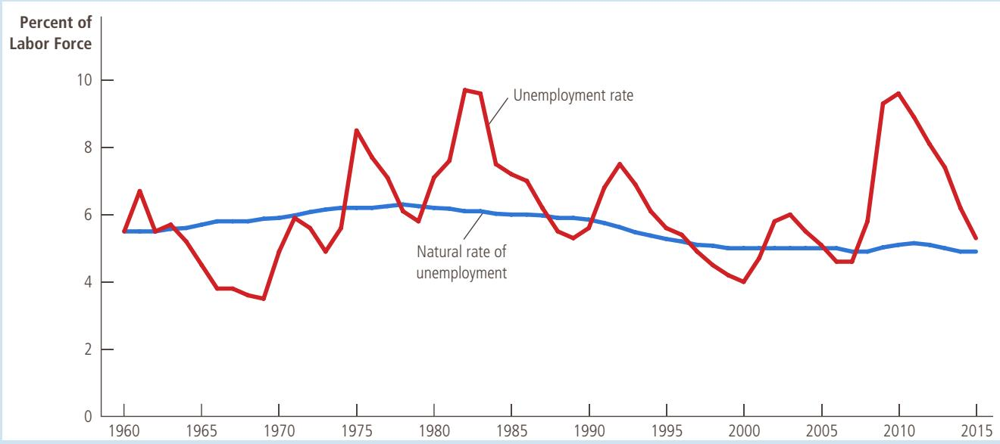
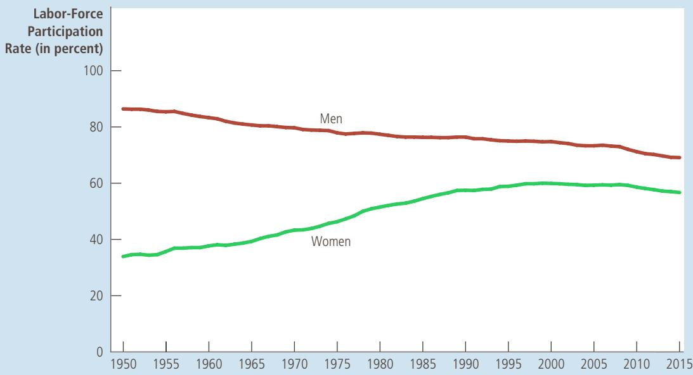
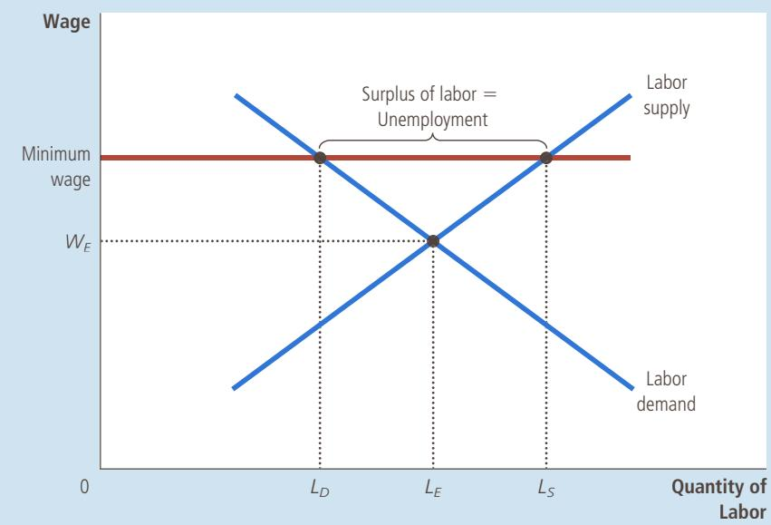

## TABLE 1

The Labor-Market Experiences of Various Demographic Groups This table shows the unemployment rate and the labor-force participation rate of various groups in the U.S. population for 2014.

S o u rc e : Bureau of Labor Statistics.

<table><tr><td>Demographic Group</td><td>Unemployment Rate</td><td>Labor-Force Participation Rate</td></tr><tr><td>Adults of Prime Working Age (ages 25–54)</td><td></td><td></td></tr><tr><td>White, male</td><td>4.4%</td><td>89.4%</td></tr><tr><td>White, female</td><td>4.6</td><td>74.3</td></tr><tr><td>Black, male</td><td>10.1</td><td>80.7</td></tr><tr><td>Black, female</td><td>9.1</td><td>75.8</td></tr><tr><td>Teenagers (ages 16–19)</td><td></td><td></td></tr><tr><td>White, male</td><td>19.2</td><td>35.6</td></tr><tr><td>White, female</td><td>15.5</td><td>36.8</td></tr><tr><td>Black, male</td><td>36.5</td><td>25.9</td></tr><tr><td>Black, female</td><td>29.7</td><td>28.4</td></tr></table>

S o u rc e : U.S. Department of Labor, Congressional Budget Office.

of unemployment. Third, teenagers have much lower rates of labor-force participation and much higher rates of unemployment than older workers. More generally, these data show that labor-market experiences vary widely among groups within the economy.

The BLS data on the labor market also allow economists and policymakers to monitor changes in the economy over time. Figure 2 shows the unemployment rate in the United States since 1960. The figure shows that the economy always has some unemployment and that the amount changes from year to year. The normal rate of unemployment around which the unemployment rate fluctuates is called the natural rate of unemployment, and the deviation of unemployment from its natural rate is called cyclical unemployment. The natural rate of unemployment shown in the figure is a series estimated by economists at the Congressional Budget Office. For 2015, they estimated a natural rate of 4.9 percent, close to the actual unemployment rate of 5.3 percent. Later in this book, we discuss short-run economic fluctuations, including the year-to-year fluctuations in unemployment around its natural rate. In the rest of this chapter, however, we ignore the short-run fluctuations and examine why there is always some unemployment in market economies.

natural rate of unemployment the normal rate of unemployment around which the unemployment rate fluctuates

cyclical unemployment the deviation of unemployment from its natural rate

## LABOR-FORCE PARTICIPATION OF MEN AND WOMEN IN THE U.S. ECONOMY

STUDY Women’s role in American society has changed dramatically over the past century. Social commentators have pointed to many causes for this change. In part, it is attributable to new technologies, such as the washing machine, clothes dryer, refrigerator, freezer, and dishwasher, which have reduced the amount of time required to complete routine household tasks. In part, it

This graph uses annual data on the U.S. unemployment rate to show the percentage of the labor force without a job. The natural rate of unemployment is the normal level of unemployment around which the unemployment rate fluctuates.

FIGURE 2

Unemployment Rate since 1960

is attributable to improved birth control, which has reduced the number of children born to the typical family. This change in women’s role is also partly attributable to changing political and social attitudes, which in turn may have been facilitated by the advances in technology and birth control. Together these developments have had a profound impact on society in general and on the economy in particular.

Nowhere is that impact more obvious than in data on labor-force participation. Figure 3 shows the labor-force participation rates of men and women in the United States since 1950. Just after World War II, men and women had very different roles in society. Only 33 percent of women were working or looking for work, in contrast to 87 percent of men. Since then, this difference in participation rates has gradually diminished, as growing numbers of women have entered the labor force and some men have left it. Data for 2015 show that 57 percent of women were in the labor force, in contrast to 69 percent of men. As measured by labor-force participation, men and women are now playing a more equal role in the economy.

The increase in women’s labor-force participation is easy to understand, but the fall in men’s may seem puzzling. There are several reasons for this decline. First, young men now stay in school longer than their fathers and grandfathers did. Second, older men now retire earlier and live longer. Third, with more women employed, more fathers now stay at home to raise their children. Full-time students, retirees, and stay-at-home dads are all counted as being out of the labor force. ●

## 15-1b Does the Unemployment Rate Measure What We Want It To?

Measuring the amount of unemployment in the economy might seem a straightforward task, but it is not. While it is easy to distinguish between a person with a full-time job and a person who is not working at all, it is much harder to distinguish between a person who is unemployed and a person who is not in the labor force.

## FIGURE 3

Labor-Force Participation Rates for Men and Women since 1950

This figure shows the percentage of adult men and women who are members of the labor force. It shows that, over the past 60 years, women have entered the labor force and men have left it.

S o u rc e : U.S. Department of Labor.

  
Copyright 2018 Cengage Learning. All Rights Reserved. May not be copied, scanned, or duplicated, in whole or in part. WCN 02-200-203

Movements into and out of the labor force are, in fact, common. More than one-third of the unemployed are recent entrants into the labor force. These entrants include young workers looking for their first jobs. They also include, in greater numbers, older workers who had previously left the labor force but have now returned to look for work. Moreover, not all unemployment ends with the job seeker finding a job. Almost half of all spells of unemployment end when the unemployed person leaves the labor force.

Because people move into and out of the labor force so often, statistics on unemployment are difficult to interpret. On the one hand, some of those who report being unemployed may not, in fact, be trying hard to find a job. They may be calling themselves unemployed because they want to qualify for a government program that gives financial assistance to the unemployed or because they are working but paid “under the table” to avoid taxes on their earnings. It may be more accurate to view these individuals as out of the labor force or, in some cases, employed. On the other hand, some of those who report being out of the labor force may want to work. These individuals may have tried to find a job and may have given up after an unsuccessful search. Such individuals, called discouraged workers, do not show up in unemployment statistics, even though they are truly workers without jobs.

Because of these and other problems, the BLS calculates several other measures of labor underutilization, in addition to the official unemployment rate. These alternative measures are presented in Table 2. In the end, it is best to view the official unemployment rate as a useful but imperfect measure of joblessness.

<table><tr><td colspan="2">Measure and Description</td><td>Rate</td></tr><tr><td>U-1</td><td>Persons unemployed 15 weeks or longer, as a percent of the civilian labor force (includes only very long-term unemployed)</td><td>2.0%</td></tr><tr><td>U-2</td><td>Job losers and persons who have completed temporary jobs, as a percent of the civilian labor force (excludes job leavers)</td><td>2.3</td></tr><tr><td>U-3</td><td>Total unemployed, as a percent of the civilian labor force (official unemployment rate)</td><td>4.9</td></tr><tr><td>U-4</td><td>Total unemployed, plus discouraged workers, as a percent of the civilian labor force plus discouraged workers</td><td>5.3</td></tr><tr><td>U-5</td><td>Total unemployed plus all marginally attached workers, as a percent of the civilian labor force plus all marginally attached workers</td><td>6.2</td></tr><tr><td>U-6</td><td>Total unemployed, plus all marginally attached workers, plus total employed part-time for economic reasons, as a percent of the civilian labor force plus all marginally attached workers</td><td>9.9</td></tr></table>

discouraged workers individuals who would like to work but have given up looking for a job

Note: The Bureau of Labor Statistics defines terms as follows:

• Marginally attached workers are persons who currently are neither working nor looking for work but indicate that they want and are available for a job and have looked for work sometime in the recent past.

Discouraged workers are marginally attached workers who have given a job-marketrelated reason for not currently looking for a job.

• Persons employed part-time for economic reasons are those who want and are available for full-time work but have had to settle for a part-time schedule.

## TABLE 2

Measures of Labor Underutilization The table shows various measures of joblessness for the U.S. economy. The data are for January 2016.

S o u rc e : U.S. Department of Labor.

## 15-1c How Long Are the Unemployed without Work?

In judging how serious the problem of unemployment is, one question to consider is whether unemployment is typically a short-term or long-term condition. If unemployment is short-term, one might conclude that it is not a big problem. Workers may require a few weeks between jobs to find the openings that best suit their tastes and skills. Yet if unemployment is long-term, one might conclude that it is a serious problem. Workers unemployed for many months are more likely to suffer economic and psychological hardship.

Because the duration of unemployment can affect our view about how big a problem unemployment is, economists have devoted much energy to studying data on the duration of unemployment spells. In this work, they have uncovered a result that is important, subtle, and seemingly contradictory: Most spells of unemployment are short, but most unemployment observed at any given time is long-term.

To see how this statement can be true, consider an example. Suppose that you visited the government’s unemployment office every week for a year to survey the unemployed. Each week you find that there are four unemployed workers. Three of these workers are the same individuals for the whole year, while the fourth person changes every week. Based on this experience, would you say that unemployment is typically short-term or long-term?

Some simple calculations help answer this question. In this example, you meet a total of 55 unemployed people over the course of a year; 52 of them are unemployed for one week, and 3 are unemployed for the full year. This means that 52/55, or 95 percent, of unemployment spells end in one week. Yet whenever you walk into the unemployment office, three of the four people you meet will be unemployed for the entire year. So, even though 95 percent of unemployment spells end in one week, 75 percent of the unemployment observed at any moment is attributable to those individuals who are unemployed for a full year. In this example, as in the world, most spells of unemployment are short, but most unemployment observed at any given time is long-term.

This subtle conclusion implies that economists and policymakers must be careful when interpreting data on unemployment and when designing policies to help the unemployed. Most people who become unemployed will soon find jobs. Yet most of the economy’s unemployment problem is attributable to the relatively few workers who are jobless for long periods of time.

## 15-1d Why Are There Always Some People Unemployed?

We have discussed how the government measures the amount of unemployment, the problems that arise in interpreting unemployment statistics, and the findings of labor economists on the duration of unemployment. You should now have a good idea about what unemployment is.

This discussion, however, has not explained why economies experience unemployment. In most markets in the economy, prices adjust to bring quantity supplied and quantity demanded into balance. In an ideal labor market, wages would adjust to balance the quantity of labor supplied and the quantity of labor demanded. This adjustment of wages would ensure that all workers are always fully employed.

Of course, reality does not resemble this ideal. There are always some workers without jobs, even when the overall economy is doing well. In other words, the unemployment rate never falls to zero; instead, it fluctuates around the natural rate of unemployment. To understand this natural rate, the remaining sections of this chapter examine the reasons actual labor markets depart from the ideal of full employment.

To preview our conclusions, we will find that there are four ways to explain unemployment in the long run. The first explanation is that it takes time for workers to search for the jobs that are best suited for them. The unemployment that results from the process of matching workers and jobs is sometimes called frictional unemployment, and it is often thought to explain relatively short spells of unemployment.

The next three explanations for unemployment suggest that the number of jobs available in some labor markets may be insufficient to give a job to everyone who wants one. This occurs when the quantity of labor supplied exceeds the quantity demanded. Unemployment of this sort is sometimes called structural unemployment, and it is often thought to explain longer spells of unemployment. As we will see, this kind of unemployment results when wages are set above the level that brings supply and demand into equilibrium. We will examine three possible reasons for an above-equilibrium wage: minimum-wage laws, unions, and efficiency wages.

How is the unemployment rate measured? • How might the unemployment QuickQuiz rate overstate the amount of joblessness? How might it understate the amount of joblessness?

frictional unemployment unemployment that results because it takes time for workers to search for the jobs that best suit their tastes and skills

structural unemployment unemployment that results because the number of jobs available in some labor markets is insufficient to provide a job for everyone who wants one

## FYI

## The Jobs Number

hen the Bureau of Labor Statistics announces the unemployment rate at the beginning of every month, it also announces the number of jobs the economy has gained or lost. As an indicator of short-run economic trends, the jobs number gets as much attention as the unemployment rate.

Where does the jobs number come from? You might guess that it comes from the same survey of 60,000 households that yields the unemployment rate. And indeed the household survey does produce data on total employment. The jobs number that gets the most attention, however, comes from a separate survey of 160,000 business establishments, which have over 40 million workers on their payrolls. The results from the establishment survey are announced at the same time as the results from the household survey.

Both surveys yield information about total employment, but the results are not always the same. One reason is that the establishment survey has a larger sample, which makes it more reliable. Another

reason is that the surveys are not measuring exactly the same thing. For example, a person who has two part-time jobs at different companies would be counted

as one employed person in the house-

hold survey but as two jobs in the establishment survey. As another example, a person running his own small business would be counted as employed in the household survey but would not show up at all in the establishment survey, because the establishment survey counts only employees on business payrolls.

The establishment survey is closely watched for its data on jobs, but it says nothing about unemployment. To measure the number of unemployed, we need to know how many people without jobs are trying to find them. The household survey is the only source of that information. ■

## 15-2 Job Search

job search the process by which workers find appropriate jobs given their tastes and skills

One reason economies always experience some unemployment is job search. Job search is the process of matching workers with appropriate jobs. If all workers and all jobs were the same, so that all workers were equally well suited for all jobs, job search would not be a problem. Laid-off workers would quickly find new jobs that were well suited for them. But in fact, workers differ in their tastes and skills, jobs differ in their attributes, and information about job candidates and job vacancies is disseminated slowly among the many firms and households in the economy.

## 15-2a Why Some Frictional Unemployment Is Inevitable

Frictional unemployment is often the result of changes in the demand for labor among different firms. When consumers decide that they prefer Ford to General Motors cars, Ford increases employment and General Motors lays off workers. The former General Motors workers must now search for new jobs, and Ford must decide which new workers to hire for the various jobs that have opened up. The result of this transition is a period of unemployment.

Similarly, because different regions of the country produce different goods, employment can rise in one region while it falls in another. Consider, for instance, what happens when the world price of oil falls. Oil-producing firms in Texas and North Dakota respond to the lower price by cutting back on production and employment. At the same time, cheaper gasoline stimulates car sales, so auto-producing firms in Michigan and Ohio raise production and employment. The opposite happens when the world price of oil rises. Changes in the composition of demand among industries or regions are called sectoral shifts. Because it takes time for workers to search for jobs in the new sectors, sectoral shifts temporarily cause unemployment.

Changing patterns of international trade are also a source of frictional unemployment. In Chapter 3, we learned that nations export goods for which they have a comparative advantage and import goods for which other nations have a comparative advantage. Comparative advantage, however, need not be stable over time. As the world economy evolves, nations may find themselves importing and exporting different goods than they have in the past. Workers will therefore need to move among industries. As they make this transition, they may find themselves unemployed for a period of time.

Frictional unemployment is inevitable simply because the economy is always changing. For example, in the U.S. economy from 2004 to 2014, employment fell by 838,000 in construction and 2.1 million in manufacturing. During the same period, employment rose by 321,000 in mining, 629,000 in computer systems design, 1.9 million in food services, and 2.6 million in healthcare. This churning of the labor force is normal in a well-functioning and dynamic economy. Because workers tend to move toward those industries in which they are most valuable, the long-run result of the process is higher productivity and higher living standards. But along the way, workers in declining industries find themselves out of work and searching for new jobs. The result is some amount of frictional unemployment.

## 15-2b Public Policy and Job Search

Even if some frictional unemployment is inevitable, the precise amount is not. The faster information spreads about job openings and worker availability, the more rapidly the economy can match workers and firms. The Internet, for instance, may help facilitate job search and reduce frictional unemployment. In addition, public policy may play a role. If policy can reduce the time it takes unemployed workers to find new jobs, it can reduce the economy’s natural rate of unemployment.

Government programs try to facilitate job search in various ways. One way is through government-run employment agencies, which give out information about job vacancies. Another way is through public training programs, which aim to ease workers’ transition from declining to growing industries and to help disadvantaged groups escape poverty. Advocates of these programs believe that they make the economy operate more efficiently by keeping the labor force more fully employed and that they reduce the inequities inherent in a constantly changing market economy.

Critics of these programs question whether the government should get involved with the process of job search. They argue that it is better to let the private market match workers and jobs. In fact, most job search in our economy takes place without intervention by the government. Newspaper ads, online job sites, college career offices, headhunters, and word of mouth all help spread information about job openings and job candidates. Similarly, much worker education is done privately, either through schools or through on-the-job training. These critics contend that the government is no better—and most likely worse—at disseminating the right information to the right workers and deciding what kinds of worker training would be most valuable. They claim that these decisions are best made privately by workers and employers.

## 15-2c Unemployment Insurance

One government program that increases the amount of frictional unemployment, without intending to do so, is unemployment insurance. This program is designed to offer workers partial protection against job loss. The unemployed who quit their jobs, were fired for cause, or just entered the labor force are not eligible. Benefits are paid only to the unemployed who were laid off because their previous employers no longer needed their skills. The terms of the program vary over time and across states, but a typical worker covered by unemployment insurance in the United States receives 50 percent of his former wages for 26 weeks.

While unemployment insurance reduces the hardship of unemployment, it also increases the amount of unemployment. The explanation is based on one of the Ten Principles of Economics in Chapter 1: People respond to incentives. Because unemployment benefits stop when a worker takes a new job, the unemployed devote less effort to job search and are more likely to turn down unattractive job offers. In addition, because unemployment insurance makes unemployment less onerous, workers are less likely to seek guarantees of job security when they negotiate with employers over the terms of employment.

Many studies by labor economists have analyzed the incentive effects of unemployment insurance. One study examined an experiment run by the state of Illinois in 1985. When unemployed workers applied to collect unemployment insurance benefits, the state randomly selected some of them and offered each a \$500 bonus if they found new jobs within 11 weeks. This group was then compared to a control group not offered the incentive. The average spell of unemployment for the group offered the bonus was 7 percent shorter than the average spell for the control group. This experiment shows that the design of the unemployment insurance system influences the effort that the unemployed devote to job search.

Several other studies examined search effort by following a group of workers over time. Unemployment insurance benefits, rather than lasting forever, usually run out after 6 months or 1 year. These studies found that when the unemployed become ineligible for benefits, the probability of their finding a new job rises markedly. Thus, receiving unemployment insurance benefits does reduce the search effort of the unemployed.

Even though unemployment insurance reduces search effort and raises unemployment, we should not necessarily conclude that the policy is bad. The program does achieve its primary goal of reducing the income uncertainty that workers face. In addition, when workers turn down unattractive job offers, they have the opportunity to look for jobs that better suit their tastes and skills. Some economists argue that unemployment insurance improves the ability of the economy to match each worker with the most appropriate job.

The study of unemployment insurance shows that the unemployment rate is an imperfect measure of a nation’s overall level of economic well-being. Most economists agree that eliminating unemployment insurance would reduce the amount of unemployment in the economy. Yet economists disagree on whether economic well-being would be enhanced or diminished by this change in policy.

How would an increase in the world price of oil affect the amount of QuickQuiz frictional unemployment? Is this unemployment undesirable? What public policies might affect the amount of unemployment caused by this price change?

## 15-3 Minimum-Wage Laws

Having seen how frictional unemployment results from the process of matching workers and jobs, let’s now examine how structural unemployment results when the number of jobs is insufficient for the number of workers.

To understand structural unemployment, we begin by reviewing how minimum-wage laws can cause unemployment. Minimum wages are not the predominant reason for unemployment in our economy, but they have an important effect on certain groups with particularly high unemployment rates. Moreover, the analysis of minimum wages is a natural place to start because, as we will see, it can be used to understand some of the other reasons for structural unemployment.

Figure 4 reviews the basic economics of a minimum wage. When a minimum-wage law forces the wage to remain above the level that balances supply and demand, it raises the quantity of labor supplied and reduces the quantity of labor demanded compared to the equilibrium level. There is a surplus of labor. Because there are more workers willing to work than there are jobs, some workers are unemployed.

While minimum-wage laws are one reason unemployment exists in the U.S. economy, they do not affect everyone. The vast majority of workers have wages well above the legal minimum, so the law does not prevent most wages from adjusting to balance supply and demand. Minimum-wage laws matter most for the least skilled and least experienced members of the labor force, such as teenagers. Their equilibrium wages tend to be low and, therefore, are more likely to fall below the legal minimum. It is only among these workers that minimum-wage laws explain the existence of unemployment.

Figure 4 is drawn to show the effects of a minimum-wage law, but it also illustrates a more general lesson: If the wage is kept above the equilibrium level for any reason, the result is unemployment. Minimum-wage laws are just one reason wages

## FIGURE 4

## Unemployment from a Wage above the Equilibrium Level

In this labor market, supply and demand are balanced at the wage $W _ { \ E }$ . At this equilibrium wage, the quantity of labor supplied and the quantity of labor demanded both equal $L _ { E } .$ By contrast, if the wage is forced to remain above the equilibrium level, perhaps because of a minimum-wage law, the quantity of labor supplied rises to $L _ { s }$ and the quantity of labor demanded falls to $L _ { D } .$ The resulting surplus of labor, $L _ { S } - L _ { D } ,$ represents unemployment.

may be “too high.” In the remaining two sections of this chapter, we consider two other reasons wages may be kept above the equilibrium level: unions and efficiency wages. The basic economics of unemployment in these cases is the same as that shown in Figure 4, but these explanations of unemployment can apply to many more of the economy’s workers.

At this point, however, we should stop and notice that the structural unemployment that arises from an above-equilibrium wage is, in an important sense, different from the frictional unemployment that arises from the process of job search. The need for job search is not due to the failure of wages to balance labor supply and labor demand. When job search is the explanation for unemployment, workers are searching for the jobs that best suit their tastes and skills. By contrast, when the wage is above the equilibrium level, the quantity of labor supplied exceeds the quantity of labor demanded, and workers are unemployed because they are waiting for jobs to open up.

Draw the supply curve and the demand curve for a labor market in which QuickQuiz the wage is fixed above the equilibrium level. Show the quantity of labor supplied, the quantity demanded, and the amount of unemployment.

## WHO EARNS THE MINIMUM WAGE?

In 2015, the Department of Labor released a study of which workers reported earnings at or below the minimum wage in 2014, when the minimum wage was \$7.25 per hour. (A reported wage below the

minimum is possible because some workers are exempt from the statute, because enforcement is imperfect, and because some workers round down when reporting their wages on surveys.) Here is a summary of the findings:

•	 In 2014, 77 million workers were paid at hourly rates (as opposed to being on salary or self-employed), representing about half of the labor force. Among

## IN THE NEWS
