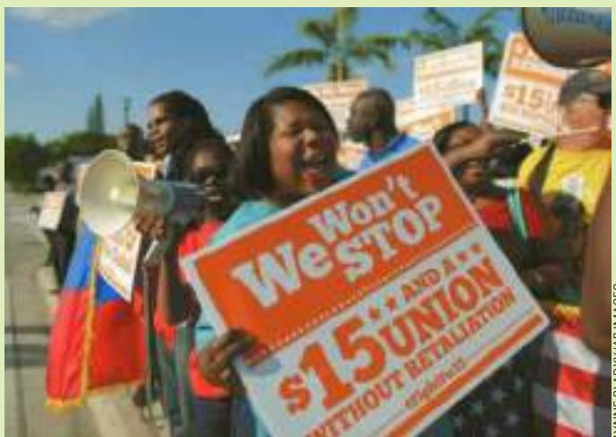

# Should the minimum wage be raised to \$15 an hour?

An economist who studies the minimum wage says there are better ways to help the working poor.

## Why Market Forces Will Overwhelm a Higher Minimum Wage

By David Neumark

he slogans are everywhere: Fight for 15; People Not Profits; One Job Should Be Enough. Worsening income inequality and the persistence of poverty have spurred a movement to raise the minimum wage, at both the national and state levels. Some West Coast cities have already voted to boost their minimum wage to \$15, or more than double the federal standard. And Los Angeles is now considering a similarly aggressive move.

The labor market problems that these higher minimum wages are intended to fix are very real. But would a higher wage floor address the underlying problems? A large body of research shows that the answer is almost certainly no, and that there are better solutions, although they are harder for policymakers to embrace.

There are several reasons why workers’ wages are currently too low to provide what many view as an acceptable standard of living. One big factor is that technological changes have increased the value of higher-skilled work and reduced the value of lower-skilled work. Globalization, meanwhile, has brought many lower-skilled American workers into greater competition with their counterparts in other countries.

Simply requiring employers to pay \$15 won’t provide much ballast against these market forces. In fact, data indicate that minimum wages are ineffective at delivering benefits to poor or low-income families, and that many of the benefits flow to higher-income families. That’s because minimum wages target low wages rather than low family incomes. And many minimum-wage workers are not poor or even in low-income families; nearly a quarter are teenagers who will eventually find better-paid jobs. Moreover, most poor families have no workers at all.

As a result, for every \$5 in higher wages that a higher minimum imposes on employers, only about \$1 goes to poor families, whereas roughly twice as much goes to families with incomes above the median.

Higher minimum wages also reduce employment for the least-skilled workers. Certainly not every one of the hundreds of studies on the topic confirms this conclusion. But there are also studies claiming that humans have not contributed to climate change, and that supply-side economics did not contribute to massive budget deficits. The most comprehensive survey of minimum wage studies, which I conducted with William Wascher of the Federal Reserve System, found that two-thirds of studies point to negative employment effects, as do over 80% of the more credible studies.

Yet another reason to be wary of raising the minimum wage is that modest job loss overall may mask much steeper job loss among the least skilled. Economists use the phrase “labor-labor substitution” to describe employers responding to a higher minimum wage by replacing their lowest-skilled workers with higher-skilled workers, whom they are more willing to hire at the higher minimum.

Based on my research, I think it is likely that a \$15 minimum wage in Los Angeles will lead

hourly paid workers, about 4 percent reported wages at or below the prevailing federal minimum. Thus, the minimum wage directly affects about 2 percent of all workers.

•	 Minimum-wage workers are more likely to be female. Among hourly paid workers, 5 percent of women had wages at or below the minimum wage, compared with 3 percent of men.

•	 Minimum-wage workers tend to be young. Among employed teenagers (ages 16 to 19) paid by the hour, about 15 percent earned the minimum wage or less, compared with 3 percent of hourly paid workers age 25 and older.

•	 Minimum-wage workers tend to be less educated. Among hourly paid workers age 16 and older, about 7 percent of those without a high school diploma earned the minimum wage or less, compared with about 4 percent of those who completed a high school diploma (but did not attend college) and about 2 percent for those who had obtained a college degree.

some teenagers currently focused on their education to take part-time jobs at the new, higher minimum, and displace low-skilled workers from the jobs they now hold. That seems like a bad outcome.

If we really want to help low-skilled workers, we need to recognize that the solutions that actually work are expensive, difficult to achieve or both.

Guaranteeing a minimally acceptable standard of living for those who work entails redistribution of some kind. Minimum wage is one form of redistribution — although we don’t always think of it as such — but it’s a blunt instrument. Using the tax system is clearly better.

T h e E a r n e d I n c o m e Ta x C r e d i t , f o r instance, targets low-income families very well. Research establishes that it provides generous government subsidies to these families’ labor market earnings and that it leads more people to work, which probably explains its bipartisan support.

Some decry the EITC as “corporate welfare,” because the labor market entry it encourages pushes down market wages. But that is precisely why it increases employment. If it did not lower wages, employers would not hire additional workers, and those not hired would be more dependent on public programs.

Of course we could still do more. We could make the EITC more generous, including increasing it for those without children who

a r e e l i g i b l e only for minuscule payments. M o r e r a d i c a l l y, we might con - sider whether all low-income families, irrespective of employment, s h o u l d r e c e i v e m o r e g e n e r a l income support in the form of direct cash payments. One might think of these payments

LYNNE SLADKY/AP IMAGES

as a “public dividend” from the extraordinary productivity of the U.S. economy, which has permitted those at the top to earn dramatically increasing salaries while incomes at the bottom have stagnated.

These alternative policies would have to be financed by higher taxes, but that’s a good thing. Redistribution through taxes is paid for by those with the highest incomes. In contrast, higher minimum wages are paid for by those who happen to own businesses in low-wage industries, and the consumers of the products of those industries, who are more likely to be poor.

Progressives who want to help low-income families by pushing for higher minimum wages would do better to channel their energy toward methods of redistribution that do less to harm the least-skilled, and more to help them.

And assuming that something is going to change in response to stagnating incomes, conservatives may be happier with the consequences of well-designed redistribution policies than the kind of high minimum wage floor Los Angeles is contemplating. For now, redistribution is a dead letter that provokes anguished cries of “socialism.” But it doesn’t have to be. ■

David Neumark is Chancellor’s Professor of Economics at University of California at Irvine.

Source: Los Angeles Times, May 15, 2015.

•	 Minimum-wage workers are more likely to be working part-time. Among part-time workers (those who usually work less than 35 hours per week), 10 percent were paid the minimum wage or less, compared to 2 percent of full-time workers.

The industry with the highest proportion of workers with reported hourly wages at or below the minimum wage was leisure and hospitality (18 percent). Over half of all workers paid at or below the minimum wage were employed in this industry, primarily in food services and drinking establishments. For many of these workers, tips supplement the hourly wages received.

The proportion of hourly paid workers earning the prevailing federal minimum wage or less has changed substantially over time. It trended downward from 13 percent in 1979, when data collection first began on a regular basis, to 2 percent in 2006. It then increased to 4 percent in 2014. This recent increase is in part attributable to a legislated increase in the minimum wage from \$5.15 per hour in 2006 to \$7.25 per hour in 2014. ●
