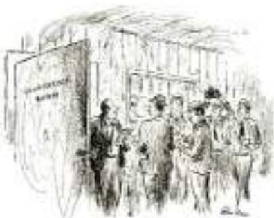
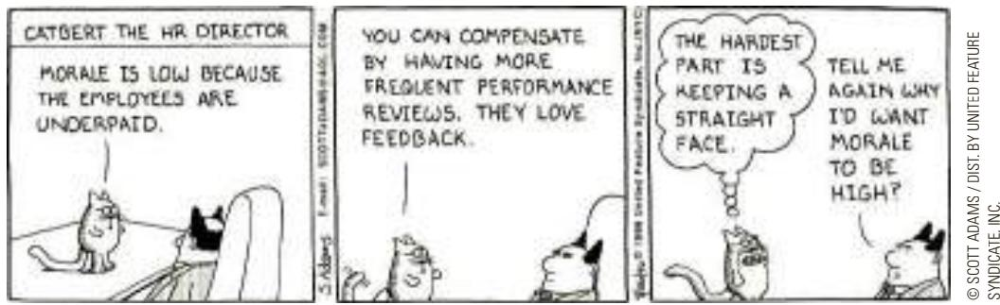

# 15-4 Unions and Collective Bargaining

union

a worker association that bargains with employers over wages, benefits, and working conditions

strike

A union is a worker association that bargains with employers over wages, benefits, and working conditions. Only 11 percent of U.S. workers now belong to unions, but unions played a much larger role in the U.S. labor market in the past. In the 1940s and 1950s, when union membership was at its peak, about a third of the U.S. labor force was unionized.

Moreover, for a variety of historical reasons, unions continue to play a large role in many European countries. In Belgium, Norway, and Sweden, for instance, more than half of workers belong to unions. In France and Germany, a majority of workers have wages set by collective bargaining by law, even though only some of these workers are themselves union members. In these cases, wages are not determined by the equilibrium of supply and demand in competitive labor markets.

## 15-4a The Economics of Unions

A union is a type of cartel. Like any cartel, a union is a group of sellers acting together in the hope of exerting their joint market power. Most workers in the U.S. economy discuss their wages, benefits, and working conditions with their employers as individuals. By contrast, workers in a union do so as a group. The process by which unions and firms agree on the terms of employment is called collective bargaining.

the organized withdrawal of labor from a firm by a union

When a union bargains with a firm, it asks for higher wages, better benefits, and better working conditions than the firm would offer in the absence of a union. If the union and the firm do not reach agreement, the union can organize a withdrawal of labor from the firm, called a strike. Because a strike reduces production, sales, and profit, a firm facing a strike threat is likely to agree to pay higher wages than it otherwise would. Economists who study the effects of unions typically find that union workers earn about 10 to 20 percent more than similar workers who do not belong to unions.

When a union raises the wage above the equilibrium level, it raises the quantity of labor supplied and reduces the quantity of labor demanded, resulting in unemployment. Workers who remain employed at the higher wage are better off, but those who were previously employed and are now unemployed are worse off. Indeed, unions are often thought to cause conflict between different groups of workers—between the insiders who benefit from high union wages and the outsiders who do not get the union jobs.

The outsiders can respond to their status in one of two ways. Some of them remain unemployed and wait for the chance to become insiders and earn the high union wage. Others take jobs in firms that are not unionized. Thus, when unions raise wages in one part of the economy, the supply of labor increases in other parts of the economy. This increase in labor supply, in turn, reduces wages in industries that are not unionized. In other words, workers in unions reap the benefit of collective bargaining, while workers not in unions bear some of the cost.

The role of unions in the economy depends in part on the laws that govern union organization and collective bargaining. Normally, explicit agreements among members of a cartel are illegal. When firms selling similar products agree to set high prices, the agreement is considered a “conspiracy in restraint of trade,” and the government prosecutes the firms in civil and criminal court for violating the antitrust laws. By contrast, unions are exempt from these laws. The policymakers who wrote the antitrust laws believed that workers needed greater market power as they bargained with employers. Indeed, various laws are designed to encourage the formation of unions. In particular, the Wagner Act of 1935 prevents employers from interfering when workers try to organize unions and requires employers to bargain with unions in good faith. The National Labor Relations Board (NLRB) is the government agency that enforces workers’ right to unionize.

WWW.CARTOONBANK.COM © ALAN DUNN/THE NEW YORKER COLLECTION/

Legislation affecting the market power of unions is a perennial topic of political debate. State lawmakers sometimes debate right-to-work laws, which give workers in a unionized firm the right to choose whether to join the union. In the absence of such laws, unions can insist during collective bargaining that firms make union membership a requirement for employment. At times, lawmakers in Washington have debated a proposed law that would prevent firms from hiring permanent replacements for workers who are on strike. This law would make strikes more costly for firms, thereby increasing the market power of unions. These and similar policy decisions will help determine the future of the union movement.

  
“Gentlemen, nothing stands in the way of a final accord except that management wants profit maximization and the union wants more moola.”

## 15-4b Are Unions Good or Bad for the Economy?

Economists disagree about whether unions are good or bad for the economy as a whole. Let’s consider both sides of the debate.

Critics argue that unions are merely a type of cartel. When unions raise wages above the level that would prevail in competitive markets, they reduce the quantity of labor demanded, cause some workers to be unemployed, and reduce the wages in the rest of the economy. The resulting allocation of labor is, critics argue, both inefficient and inequitable. It is inefficient because high union wages reduce employment in unionized firms below the efficient, competitive level. It is inequitable because some workers benefit at the expense of other workers.

Advocates contend that unions are a necessary antidote to the market power of the firms that hire workers. The extreme case of this market power is the “company town,” where a single firm does most of the hiring in a geographical region. In a company town, if workers do not accept the wages and working conditions that the firm offers, they have little choice but to move or stop working. In the absence of a union, therefore, the firm could use its market power to pay lower wages and offer worse working conditions than would prevail if it had to compete with other firms for the same workers. In this case, a union may balance the firm’s market power and protect the workers from being at the mercy of the firm’s owners.

Advocates of unions also claim that unions are important for helping firms respond efficiently to workers’ concerns. Whenever a worker takes a job, the worker and the firm must agree on many attributes of the job in addition to the wage: hours of work, overtime, vacations, sick leave, health benefits, promotion schedules, job security, and so on. By representing workers’ views on these issues, unions allow firms to provide the right mix of job attributes. Even if unions have the adverse effect of pushing wages above the equilibrium level and causing unemployment, they have the benefit of helping firms keep a happy and productive workforce.

In the end, there is no consensus among economists about whether unions are good or bad for the economy. Like many institutions, their influence is probably beneficial in some circumstances and adverse in others.

How does a union in the auto industry affect wages and employment at General Motors and Ford? How does it affect wages and employment in

other industries?

## 15-5 The Theory of Efficiency Wages

efficiency wages above-equilibrium wages paid by firms to increase worker productivity

A fourth reason economies always experience some unemployment—in addition to job search, minimum-wage laws, and unions—is suggested by the theory of efficiency wages. According to this theory, firms operate more efficiently if wages are above the equilibrium level. Therefore, it may be profitable for firms to keep wages high even in the presence of a surplus of labor.

In some ways, the unemployment that arises from efficiency wages is similar to the unemployment that arises from minimum-wage laws and unions. In all three cases, unemployment is the result of wages above the level that balances the quantity of labor supplied and the quantity of labor demanded. Yet there is also an important difference. Minimum-wage laws and unions prevent firms from lowering wages in the presence of a surplus of workers. Efficiency-wage theory states that such a constraint on firms is unnecessary in many cases because firms may be better off keeping wages above the equilibrium level.

Why should firms want to keep wages high? This decision may seem odd at first, for wages are a large part of firms’ costs. Normally, we expect profit-maximizing firms to want to keep costs—and therefore wages—as low as possible. The novel insight of efficiency-wage theory is that paying high wages might be profitable because they might raise the efficiency of a firm’s workers.

There are several types of efficiency-wage theory. Each type suggests a different explanation for why firms may want to pay high wages. Let’s now consider four of these types.

## 15-5a Worker Health

The first and simplest type of efficiency-wage theory emphasizes the link between wages and worker health. Better-paid workers eat a more nutritious diet, and workers who eat a better diet are healthier and more productive. A firm may find it more profitable to pay high wages and have healthy, productive workers than to pay lower wages and have less healthy, less productive workers.

This type of efficiency-wage theory can be relevant for explaining unemployment in less developed countries where inadequate nutrition can be a problem. In these countries, firms may fear that cutting wages would, in fact, adversely influence their workers’ health and productivity. In other words, nutrition concerns may explain why firms maintain above-equilibrium wages despite a surplus of labor. Worker health concerns are far less relevant for firms in rich countries such as the United States, where the equilibrium wages for most workers are well above the level needed for an adequate diet.

## 15-5b Worker Turnover

A second type of efficiency-wage theory emphasizes the link between wages and worker turnover. Workers quit jobs for many reasons: to take jobs at other firms, to move to other parts of the country, to leave the labor force, and so on. The frequency with which they quit depends on the entire set of incentives they face, including the benefits of leaving and the benefits of staying. The more a firm pays its workers, the less often its workers will choose to leave. Thus, a firm can reduce turnover among its workers by paying them a high wage.

Why do firms care about turnover? The reason is that it is costly for firms to hire and train new workers. Moreover, even after they are trained, newly hired workers are not as productive as experienced ones. Firms with higher turnover, therefore, will tend to have higher production costs. Firms may find it profitable to pay wages above the equilibrium level to reduce worker turnover.

## 15-5c Worker Quality

A third type of efficiency-wage theory emphasizes the link between wages and worker quality. All firms want workers who are talented, and they strive to pick the best applicants to fill job openings. But because firms cannot perfectly gauge the quality of applicants, hiring has a degree of randomness to it. When a firm pays a high wage, it attracts a better pool of workers to apply for its jobs and thereby increases the quality of its workforce. If the firm responded to a surplus of labor by reducing the wage, the most competent applicants—who are more likely to have better alternative opportunities than less competent applicants— may choose not to apply. If this influence of the wage on worker quality is strong enough, it may be profitable for the firm to pay a wage above the level that balances supply and demand.

## 15-5d Worker Effort

A fourth and final type of efficiency-wage theory emphasizes the link between wages and worker effort. In many jobs, workers have some discretion over how hard to work. As a result, firms monitor the efforts of their workers, and workers caught shirking their responsibilities are fired. But because monitoring is costly and imperfect, not all shirkers are caught immediately. A firm in such a circumstance is always looking for ways to deter shirking.

One solution is paying wages above the equilibrium level. High wages make workers more eager to keep their jobs and thus motivate them to put forward their best effort. If the wage were at the level that balanced supply and demand, workers would have less reason to work hard because if they were fired, they could quickly find new jobs at the same wage. Therefore, firms may raise wages above the equilibrium level to provide an incentive for workers not to shirk their responsibilities.

## HENRY FORD AND THE VERY GENEROUS \$5-A-DAY WAGE

CASE Henry Ford was an industrial visionary. As founder of the Ford STUDY Motor Company, he was responsible for introducing modern techniques of production. Rather than building cars with small teams of skilled craftsmen, Ford built cars on assembly lines in which unskilled workers were taught to perform the same simple tasks over and over again. The output of this assembly process was the Model T Ford, one of the most famous early automobiles.

In 1914, Ford introduced another innovation: the \$5 workday. This might not seem like much today, but back then \$5 was about twice the going wage. It was also far above the wage that balanced supply and demand. When the new \$5-a-day wage was announced, long lines of job seekers formed outside the Ford factories. The number of workers willing to work at this wage far exceeded the number of workers Ford needed.

Ford’s high-wage policy had many of the effects predicted by efficiency-wage theory. Turnover fell, absenteeism fell, and productivity rose. Workers were so much more efficient that Ford’s production costs were lower despite higher wages. Thus, paying a wage above the equilibrium level was profitable for the firm. An historian of the early Ford Motor Company wrote, “Ford and his associates freely declared on many occasions that the high-wage policy turned out to be good business. By this they meant that it had improved the discipline of the workers, given them a more loyal interest in the institution, and raised their personal efficiency.” Henry Ford himself called the \$5-a-day wage “one of the finest cost-cutting moves we ever made.”

Why did it take a Henry Ford to introduce this efficiency wage? Why were other firms not already taking advantage of this seemingly profitable business strategy? According to some analysts, Ford’s decision was closely linked to his use of the assembly line. Workers organized in an assembly line are highly interdependent. If one worker is absent or works slowly, other workers are less able to complete their own tasks. Thus, while assembly lines made production more efficient, they also raised the importance of low worker turnover, high worker effort, and high worker quality. As a result, paying efficiency wages may have been a better strategy for the Ford Motor Company than for other businesses at the time. ●

labor demanded.

Give four explanations for why firms might find it profitable to pay wages above the level that balances quantity of labor supplied and quantity of

## 15-6 Conclusion

In this chapter, we discussed the measurement of unemployment and the reasons economies always experience some degree of unemployment. We have seen how job search, minimum-wage laws, unions, and efficiency wages can all help explain why some workers do not have jobs. Which of these four explanations for the natural rate of unemployment are the most important for the U.S. economy and other economies around the world? Unfortunately, there is no easy way to tell. Economists differ in which of these explanations of unemployment they consider most important.

The analysis in this chapter yields an important lesson: Although the economy will always have some unemployment, its natural rate does change over time. Many events and policies can alter the amount of unemployment the economy typically experiences. As the information revolution changes the process of job search, as Congress and state legislatures adjust the minimum wage, as workers form or quit unions, and as firms change their reliance on efficiency wages, the natural rate of unemployment evolves. Unemployment is not a simple problem with a simple solution. But how we choose to organize our society can profoundly influence how prevalent a problem it is.

## CHAPTER QuickQuiz

1. The population of Ectenia is 100 people: 40 work full-time, 20 work half-time but would prefer to work full-time, 10 are looking for a job, 10 would like to work but are so discouraged they have given up looking, 10 are not interested in working because they are full-time students, and 10 are retired. What is the number of unemployed?

a. 10

b. 20

c. 30

d. 40

2. Using the numbers in the preceding question, what is the size of Ectenia’s labor force? a. 50 b. 60 c. 70 d. 80

3. The main policy goal of the unemployment insurance system is to reduce the

a. search effort of the unemployed.

b. income uncertainty that workers face.

c. role of unions in wage setting.

d. amount of frictional unemployment.

4. In a competitive labor market, when the government increases the minimum wage, the result is a(n) in the quantity of labor supplied and a(n) in the quantity of labor demanded.

a. increase, increase

b. increase, decrease

c. decrease, increase

d. decrease, decrease

5. Unionized workers are paid about \_\_\_\_\_ percent more than similar nonunion workers. a. 2 b. 5 c. 15 d. 40

6. According to the theory of efficiency wages, a. firms may find it profitable to pay aboveequilibrium wages.

b. an excess supply of labor puts downward pressure on wages.

c. sectoral shifts are the main source of frictional unemployment.

d. right-to-work laws reduce the bargaining power of unions.

## SUMMARY

The unemployment rate is the percentage of those who would like to work who do not have jobs. The Bureau of Labor Statistics calculates this statistic monthly based on a survey of thousands of households.

The unemployment rate is an imperfect measure of joblessness. Some people who call themselves unemployed may actually not want to work, and some people who would like to work have left the labor force after an unsuccessful search and therefore are not counted as unemployed.

In the U.S. economy, most people who become unemployed find work within a short period of time. Nonetheless, most unemployment observed at any given time is attributable to the few people who are unemployed for long periods of time.

One reason for unemployment is the time it takes workers to search for jobs that best suit their tastes and skills. This frictional unemployment is increased as a result of unemployment insurance, a government policy designed to protect workers’ incomes.

A second reason our economy always has some unemployment is minimum-wage laws. By raising the wage of unskilled and inexperienced workers above the equilibrium level, minimum-wage laws raise the quantity of labor supplied and reduce the quantity demanded. The resulting surplus of labor represents unemployment.

A third reason for unemployment is the market power of unions. When unions push the wages in unionized industries above the equilibrium level, they create a surplus of labor.

A fourth reason for unemployment is suggested by the theory of efficiency wages. According to this theory, firms find it profitable to pay wages above the equilibrium level. High wages can improve worker health, lower worker turnover, raise worker quality, and increase worker effort.

## KEY CONCEPTS

labor force, p. 295 unemployment rate, p. 295 labor-force participation rate, p. 296 natural rate of unemployment, p. 297 cyclical unemployment, p. 297

discouraged workers, p. 299

frictional unemployment, p. 301

structural unemployment, p. 301

job search, p. 302

unemployment insurance, p. 303 union, p. 308 collective bargaining, p. 308 strike, p. 308 efficiency wages, p. 310

## QUESTIONS FOR REVIEW

1. What are the three categories into which the Bureau of Labor Statistics divides everyone? How does the BLS compute the labor force, the unemployment rate, and the labor-force participation rate?

2. Is unemployment typically short-term or long-term? Explain.

3. Why is frictional unemployment inevitable? How might the government reduce the amount of frictional unemployment?

4. Are minimum-wage laws a better explanation for structural unemployment among teenagers or among college graduates? Why?

5. How do unions affect the natural rate of unemployment?

6. What claims do advocates of unions make to argue that unions are good for the economy?

7. Explain four ways in which a firm might increase its profits by raising the wages it pays.

## PROBLEMS AND APPLICATIONS

1. In June 2009, at the trough of the Great Recession, the Bureau of Labor Statistics announced that of all adult Americans, 140,196,000 were employed, 14,729,000 were unemployed, and 80,729,000 were not in the labor force. Use this information to calculate:

a. the adult population

b. the labor force

c. the labor-force participation rate

d. the unemployment rate

2. Explain whether each of the following events increases, decreases, or has no effect on the unemployment rate and the labor-force participation rate.

a. After a long search, Jon finds a job.

b. Tyrion, a full-time college student, graduates and is immediately employed.

c. After an unsuccessful job search, Arya gives up looking and retires.

d. Daenerys quits her job to become a stay-at-home mom.

e. Sansa has a birthday, becomes an adult, but has no interest in working.

f. Jaime has a birthday, becomes an adult, and starts looking for a job.

g. Cersei dies while enjoying retirement.

h. Jorah dies working long hours at the office.

3. Go to the website of the Bureau of Labor Statistics (http://www.bls.gov). What is the national unemployment rate right now? Find the unemployment rate for the demographic group that best fits a description of you (for example, based on age, sex, and race). Is it higher or lower than the national average? Why do you think this is so?

4. Between January 2010 and January 2016, U.S. employment increased by 12.1 million workers, but the number of unemployed workers declined by only 7.3 million. How are these numbers consistent with each other? Why might one expect a reduction in the number of people counted as unemployed to be smaller than the increase in the number of people employed?

5. Economists use labor-market data to evaluate how well an economy is using its most valuable resource— its people. Two closely watched statistics are the unemployment rate and the employment–population ratio (calculated as the percentage of the adult population that is employed). Explain what happens to each of these in the following scenarios. In your opinion,

which statistic is the more meaningful gauge of how well the economy is doing?

a. An auto company goes bankrupt and lays off its workers, who immediately start looking for new jobs.

b. After an unsuccessful search, some of the laid-off workers quit looking for new jobs.

c. Numerous students graduate from college but cannot find work.

d. Numerous students graduate from college and immediately begin new jobs.

e. A stock market boom induces newly enriched 60-year-old workers to take early retirement.

f. Advances in healthcare prolong the life of many retirees.

6. Are the following workers more likely to experience short-term or long-term unemployment? Explain.

a. a construction worker who is laid off because of bad weather

b. a manufacturing worker who loses his job at a plant in an isolated area

c. a stagecoach-industry worker who is laid off because of competition from railroads

d. a short-order cook who loses his job when a new restaurant opens across the street

e. an expert welder with little formal education who loses his job when the company installs automatic welding machinery

7. Using a diagram of the labor market, show the effect of an increase in the minimum wage on the wage paid to workers, the number of workers supplied, the number of workers demanded, and the amount of unemployment.

8. Consider an economy with two labor markets—one for manufacturing workers and one for service work ers. Suppose initially that neither is unionized.

a. If manufacturing workers formed a union, what impact would you predict on the wages and employment in manufacturing?

b. How would these changes in the manufacturing labor market affect the supply of labor in the market for service workers? What would happen to the equilibrium wage and employment in this labor market?

9. Structural unemployment is sometimes said to result from a mismatch between the job skills that employers want and the job skills that workers have. To explore this idea, consider an economy with two industries: auto manufacturing and aircraft manufacturing.

a. If workers in these two industries require similar amounts of training, and if workers at the beginning of their careers can choose which industry to train for, what would you expect to happen to the wages in these two industries? How long would this process take? Explain.

b. Suppose that one day the economy opens itself to international trade and, as a result, starts importing autos and exporting aircraft. What would happen to the demand for labor in these two industries?

c. Suppose that workers in one industry cannot be quickly retrained for the other. How would these shifts in demand affect equilibrium wages both in the short run and in the long run?

d. If for some reason wages fail to adjust to the new equilibrium levels, what would occur?

10. Suppose that Congress passes a law requiring employers to provide employees some benefit (such as healthcare) that raises the cost of an employee by \$4 per hour.

a. What effect does this employer mandate have on the demand for labor? (In answering this and the following questions, be quantitative when you can.)

b. If employees place a value on this benefit exactly equal to its cost, what effect does this employer mandate have on the supply of labor?

c. If the wage can freely adjust to balance supply and demand, how does this law affect the wage and the level of employment? Are employers better or worse off? Are employees better or worse off?

d. Suppose that, before the mandate, the wage in this market was \$3 above the minimum wage. In this case, how does the employer mandate affect the wage, the level of employment, and the level of unemployment?

e. Now suppose that workers do not value the mandated benefit at all. How does this alternative assumption change your answers to parts (b) and (c)?

To find additional study resources, visit cengagebrain.com, and search for “Mankiw.”

PART VI
