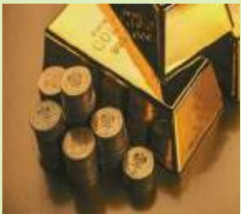
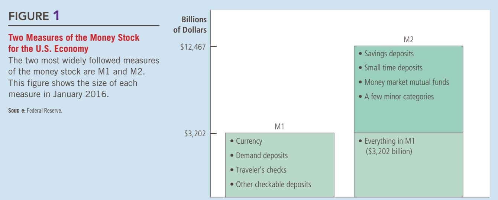

# Money and Prices in the Long Run

# The Monetary System

When you walk into a restaurant to buy a meal, you get something of value—afull stomach. To pay for this service, you might hand the restaurateur full stomach. To pay for this service, you might hand the restaurateur several worn-out pieces of greenish paper decorated with strange symbols, government buildings, and the portraits of famous dead Americans. Or you might hand her a single piece of paper with the name of a bank and your signature. Or you might show her a plastic card and sign a paper slip. Whether you pay by cash, check, or debit card, the restaurateur is happy to work hard to satisfy your gastronomical desires in exchange for these pieces of paper, which, in and of themselves, are worthless.

Anyone who has lived in a modern economy is familiar with this social custom. Even though paper money has no intrinsic value, the restaurateur is confident

that, in the future, some third person will accept it in exchange for something that the restaurateur does value. And that third person is confident that some fourth person will accept the money, with the knowledge that yet a fifth person will accept the money . . . and so on. To the restaurateur and to other people in our society, your cash, check, or debit card receipt represents a claim to goods and services in the future.

The social custom of using money for transactions is extraordinarily useful in a large, complex society. Imagine, for a moment, that there was no item in the economy widely accepted in exchange for goods and services. People would have to rely on barter—the exchange of one good or service for another—to obtain the things they need. To get your restaurant meal, for instance, you would have to offer the restaurateur something of immediate value. You could offer to wash some dishes, mow her lawn, or give her your family’s secret recipe for meat loaf. An economy that relies on barter will have trouble allocating its scarce resources efficiently. In such an economy, trade is said to require the double coincidence of wants—the unlikely occurrence that two people each have a good or service that the other wants.

The existence of money makes trade easier. The restaurateur does not care whether you can produce a valuable good or service for her. She is happy to accept your money, knowing that other people will do the same for her. Such a convention allows trade to be roundabout. The restaurateur accepts your money and uses it to pay her chef; the chef uses her paycheck to send her child to day care; the day care center uses this tuition to pay a teacher; and the teacher hires you to mow her lawn. As money flows from person to person in the economy, it facilitates production and trade, thereby allowing each person to specialize in what she does best and raising everyone’s standard of living.

In this chapter, we begin to examine the role of money in the economy. We discuss what money is, the various forms that money takes, how the banking system helps create money, and how the government controls the quantity of money in circulation. Because money is so important in the economy, we devote much effort in the rest of this book to learning how changes in the quantity of money affect various economic variables, including inflation, interest rates, production, and employment. Consistent with our long-run focus in the previous four chapters, in the next chapter we examine the long-run effects of changes in the quantity of money. The short-run effects of monetary changes are a more complex topic, which we take up later in the book. This chapter provides the background for all of this further analysis.

## 16-1 The Meaning of Money

What is money? This might seem like an odd question. When you read that billionaire Mark Zuckerberg has a lot of money, you know what that means: He is so rich that he can buy almost anything he wants. In this sense, the term money is used to mean wealth.

## money

Economists, however, use the word in a more specific sense: Money is the set of assets in the economy that people regularly use to buy goods and services from each other. The cash in your wallet is money because you can use it to buy a meal at a restaurant or a shirt at a store. By contrast, if you happened to own a large share of Facebook, as Mark Zuckerberg does, you would be wealthy, but this asset is not considered a form of money. You could not buy a meal or a shirt with this wealth without first obtaining some cash. According to the economist’s definition, money includes only those few types of wealth that are regularly accepted by sellers in exchange for goods and services.

## 16-1a The Functions of Money

Money has three functions in the economy: It is a medium of exchange, a unit of account, and a store of value. These three functions together distinguish money from other assets in the economy, such as stocks, bonds, real estate, art, and even baseball cards. Let’s examine each of these functions of money.

A medium of exchange is an item that buyers give to sellers when they purchase goods and services. When you go to a store to buy a shirt, the store gives you the shirt and you give the store your money. This transfer of money from buyer to seller allows the transaction to take place. When you walk into a store, you are confident that the store will accept your money for the items it is selling because money is the commonly accepted medium of exchange.

A unit of account is the yardstick people use to post prices and record debts. When you go shopping, you might observe that a shirt costs \$50 and a hamburger costs \$5. Even though it would be accurate to say that the price of a shirt is 10 hamburgers and the price of a hamburger is 1/10 of a shirt, prices are never quoted in this way. Similarly, if you take out a loan from a bank, the size of your future loan repayments will be measured in dollars, not in a quantity of goods and services. When we want to measure and record economic value, we use money as the unit of account.

A store of value is an item that people can use to transfer purchasing power from the present to the future. When a seller accepts money today in exchange for a good or service, that seller can hold the money and become a buyer of another good or service at another time. Money is not the only store of value in the economy: A person can also transfer purchasing power from the present to the future by holding nonmonetary assets such as stocks and bonds. The term wealth is used to refer to the total of all stores of value, including both money and nonmonetary assets.

Economists use the term liquidity to describe the ease with which an asset can be converted into the economy’s medium of exchange. Because money is the economy’s medium of exchange, it is the most liquid asset available. Other assets vary widely in their liquidity. Most stocks and bonds can be sold easily with small cost, so they are relatively liquid assets. By contrast, selling a house, a Rembrandt painting, or a 1948 Joe DiMaggio baseball card requires more time and effort, so these assets are less liquid.

When people decide how to allocate their wealth, they have to balance the liquidity of each possible asset against the asset’s usefulness as a store of value. Money is the most liquid asset, but it is far from perfect as a store of value. When prices rise, the value of money falls. In other words, when goods and services become more expensive, each dollar in your wallet can buy less. This link between the price level and the value of money is key to understanding how money affects the economy, a topic we start to explore in the next chapter.

## 16-1b The Kinds of Money

When money takes the form of a commodity with intrinsic value, it is called commodity money. The term intrinsic value means that the item would have value even if it were not used as money. One example of commodity money is gold. Gold has intrinsic value because it is used in industry and in the making of jewelry. Although today we no longer use gold as money, historically gold was a common form of money because it is relatively easy to carry, measure, and verify for impurities. When an economy uses gold as money (or uses paper money that is convertible into gold on demand), it is said to be operating under a gold standard.

## liquidity

Another example of commodity money is cigarettes. In prisoner-of-war camps during World War II, prisoners traded goods and services with one another using cigarettes as the store of value, unit of account, and medium of exchange. Similarly, as the Soviet Union was breaking up in the late 1980s, cigarettes started replacing the ruble as the preferred currency in Moscow. In both cases, even nonsmokers were happy to accept cigarettes in an exchange, knowing that they could use the cigarettes to buy other goods and services.

Money without intrinsic value is called fiat money. A fiat is an order or decree, and fiat money is established as money by government decree. For example, compare the paper dollars in your wallet (printed by the U.S. government) and the paper dollars from a game of Monopoly (printed by the Parker Brothers game company). Why can you use the first to pay your bill at a restaurant but not the second? The answer is that the U.S. government has decreed its dollars to be valid money. Each paper dollar in your wallet reads: “This note is legal tender for all debts, public and private.”

Although the government is central to establishing and regulating a system of fiat money (by prosecuting counterfeiters, for example), other factors are also required for the success of such a monetary system. To a large extent, the acceptance of fiat money depends as much on expectations and social convention as on government decree. The Soviet government in the 1980s never abandoned the ruble as the official currency. Yet the people of Moscow preferred to accept cigarettes (or even American dollars) in exchange for goods and services because they were more confident that these alternative monies would be accepted by others in the future.

## IN THE NEWS

## Why Gold?

For many centuries, when societies have used a form of commodity money, the most common choice has been the gold standard. This outcome may have a sound scientific basis.

A Chemist Explains Why Gold Beat Out Lithium, Osmium, Einsteinium...

By Jacob Goldstein and David Kestenbaum

he periodic table lists 118 different chemical elements. And yet, for thousands of years, humans have really, really liked one of them in particular: gold. Gold has been used as money for millennia, and its price has been going through the roof.

Why gold? Why not osmium, lithium, or ruthenium?

We went to an expert to find out: Sanat Kumar, a chemical engineer at Columbia University. We asked him to take the periodic table, and start eliminating anything that wouldn’t work as money.

The periodic table looks kind of like a bingo card. Each square has a different element in it—one for carbon, another for gold, and so on.

Sanat starts with the far-right column of the table. The elements there have a really appealing characteristic: They’re not going to change. They’re chemically stable.

But there’s also a big drawback: They’re gases. You could put all your gaseous money in a jar, but if you opened the jar, you’d be broke. So Sanat crosses out the right-hand column.

Then he swings over to the far left-hand column, and points to one of the elements there: Lithium

“If you expose lithium to air, it will cause a huge fire that can burn through concrete walls,” he says.

Money that spontaneously bursts into flames is clearly a bad idea. In fact, you don’t want your money undergoing any kind of spontaneous chemical reactions. And it turns out that a lot of the elements in the periodic table are pretty reactive.

Not all of them burst into flames. But sometimes they corrode, start to fall apart.

So Sanat crosses out another 38 elements, because they’re too reactive.

Then we ask him about those two weird rows at the bottom of the table. They’re always

## 16-1c Money in the U.S. Economy

As we will see, the quantity of money circulating in the economy, called the money stock, has a powerful influence on many economic variables. But before we consider why that is true, we need to ask a preliminary question: What is the quantity of money? In particular, suppose you were given the task of measuring how much money there is in the U.S. economy. What would you include in your measure?

The most obvious asset to include is currency—the paper bills and coins in the hands of the public. Currency is clearly the most widely accepted medium of exchange in our economy. There is no doubt that it is part of the money stock.

currency the paper bills and coins in the hands of the public

Yet currency is not the only asset that you can use to buy goods and services. Many stores also accept personal checks. Wealth held in your checking account is almost as convenient for buying things as wealth held in your wallet. To measure the money stock, therefore, you might want to include demand deposits—balances in bank accounts that depositors can access on demand simply by writing a check or swiping a debit card at a store.

Once you start to consider balances in checking accounts as part of the money stock, you are led to consider the large variety of other accounts that people hold at banks and other financial institutions. Bank depositors usually cannot write checks against the balances in their savings accounts, but they can easily transfer funds from savings into checking accounts. In addition, depositors in money market mutual funds can often write checks against their balances. Thus, these other accounts should plausibly be part of the U.S. money stock.

demand deposits balances in bank accounts that depositors can access on demand by writing a check

broken out separately from the main table, and they have some great names—promethium, einsteinium.

But it turns out they’re radioactive—put some einsteinium in your pocket, and a year later, you’ll be dead.

So we’re down from 118 elements to 30, and we’ve come up with a list of three key requirements:

1 . Not a gas.

2. Doesn’t corrode or burst into flames.

FIKMIK/SHUTTERSTOCK

3 . Doesn’t kill you.

Now Sanat adds a new requirement: You want the thing you pick to be rare. This lets him cross off a lot of the boxes near the top of the table, because the elements clustered there tend to be more abundant.

At the same time, you don’t want to pick an element that’s too rare. So osmium—which apparently comes to earth via meteorites—gets the axe.

  
In Gold We Trust

That leaves us with just five elements: rhodium, palladium, silver, platinum and gold. And all of them, as it happens, are considered precious metals.

But even here we can cross things out. Silver has been widely used as money, of course. But it’s reactive—it tarnishes. So Sanat says it’s not the best choice.

Early civilizations couldn’t have used rhodium or palladium, because they weren’t discovered until the early 1800s.

That leaves platinum and gold, both of which can be found in rivers and streams.

But if you were in the ancient world and wanted to make platinum coins, you would have needed some sort of magic furnace from the future. The melting point for platinum is over 3,000 degrees Fahrenheit.

Gold happens to melt at a much lower temperature, which made it much easier for preindustrial people to work with.

So we ask Sanat: If we could run the clock back and start history again, could things go a different way, or would gold emerge again as the element of choice?

“For the earth, with every parameter we have, gold is the sweet spot,” he says. “It would come out no other way.”

In a complex economy such as ours, it is not easy to draw a line between assets that can be called “money” and assets that cannot. The coins in your pocket clearly are part of the money stock, and the Empire State Building clearly is not, but there are many assets in between these extremes for which the choice is less clear. Because different analysts can reasonably disagree about where to draw the dividing line between monetary and nonmonetary assets, various measures of the money stock are available for the U.S. economy. Figure 1 shows the two most commonly used, designated M1 and M2. M2 includes more assets in its measure of money than does M1.

For our purposes in this book, we need not dwell on the differences between the various measures of money. None of our discussion will hinge on the distinction between M1 and M2. The important point is that the money stock for the U.S. economy includes not only currency but also deposits in banks and other financial institutions that can be readily accessed and used to buy goods and services.

## WHERE IS ALL THE CURRENCY?

One puzzle about the money stock of the U.S. economy concerns the amount of currency. In January 2016, there was \$1.4 trillion of currency outstanding. To put this number in perspective, we can divide it by 252 million, the number of adults (age 16 and older) in the

United States. This calculation implies that the average adult holds over \$5,500 of currency. Most people are surprised to learn that our economy has so much currency because they carry far less than this in their wallets.

Who is holding all this currency? No one knows for sure, but there are two plausible explanations.

The first explanation is that much of the currency is held abroad. In foreign countries without a stable monetary system, people often prefer U.S. dollars to domestic assets. Estimates suggest that over half of U.S. dollars circulate outside the United States.

The second explanation is that much of the currency is held by drug dealers, tax evaders, and other criminals. For most people in the U.S. economy, currency is not a particularly good way to hold wealth. Not only can currency be lost or stolen

FYI

## Why Credit Cards Aren’t Money

t might seem natural to include credit cards as part of the economy’s stock of money. After all, people use credit cards to make many of their purchases. Aren’t credit cards, therefore, a medium of exchange?

At first this argument may seem persuasive, but credit cards are excluded from all measures of the quantity of money. The reason is that credit cards are not really a method of payment but rather a method of deferring payment. When you buy a meal with a credit card, the bank that issued the card pays the restaurant what it is due. At a later date, you will have to repay the bank (perhaps with interest). When the time comes to pay your credit card bill, you will probably do so by writing a check against your checking account. The balance in this checking account is part of the economy’s stock of money.

Notice that credit cards are different from debit cards, which automatically withdraw funds from a bank account to pay for items bought. Rather than allowing the user to postpone payment for a purchase, a debit card gives the user immediate access to deposits in

a bank account. In this sense, a debit card is more similar to a check than to a credit card. The account balances that lie behind debit cards are included in

measures of the quantity of money.

Even though credit cards are not considered a form of money, they are nonetheless important for analyzing the monetary system. People who have credit cards can pay many of their bills together at the end of the month, rather than sporadically as they make purchases. As a result, people who have credit cards probably hold less money on average than people who do not have credit cards. Thus, the introduction and increased popularity of credit cards may reduce the amount of money that people choose to hold. ■

but it also does not earn interest, whereas a bank deposit does. Thus, most people hold only small amounts of currency. By contrast, criminals may avoid putting their wealth in banks because a bank deposit gives police a paper trail that they can use to trace illegal activities. For criminals, currency may be the best store of value available.

QuickQuiz

List and describe the three functions of money.

## 16-2 The Federal Reserve System

Whenever an economy uses a system of fiat money, as the U.S. economy does, some agency must be responsible for regulating the system. In the United States, that agency is the Federal Reserve, often simply called the Fed. If you look at the top of a dollar bill, you will see that it is called a “Federal Reserve Note.” The Fed is an example of a central bank—an institution designed to oversee the banking system and regulate the quantity of money in the economy. Other major central banks around the world include the Bank of England, the Bank of Japan, and the European Central Bank.

## 16-2a The Fed’s Organization

The Federal Reserve was created in 1913 after a series of bank failures in 1907 convinced Congress that the United States needed a central bank to ensure the health of the nation’s banking system. Today, the Fed is run by its board of governors, which has seven members appointed by the president and confirmed by the Senate. The governors have 14-year terms. Just as federal judges are given

Federal Reserve (Fed) the central bank of the United States

central bank an institution designed to oversee the banking system and regulate the quantity of money in the economy

lifetime appointments to insulate them from politics, Fed governors are given long terms to give them independence from short-term political pressures when they formulate monetary policy.

Among the seven members of the board of governors, the most important is the chair. The chair directs the Fed staff, presides over board meetings, and testifies regularly about Fed policy in front of congressional committees. The president appoints the chair to a 4-year term. As this book was going to press, the chair of the Fed was Janet Yellen, a former economics professor who was appointed to the Fed job by President Barack Obama in 2014.

The Federal Reserve System is made up of the Federal Reserve Board in Washington, D.C., and twelve regional Federal Reserve Banks located in major cities around the country. The presidents of the regional banks are chosen by each bank’s board of directors, whose members are typically drawn from the region’s banking and business community.

The Fed has two related jobs. The first is to regulate banks and ensure the health of the banking system. This task is largely the responsibility of the regional Federal Reserve Banks. In particular, the Fed monitors each bank’s financial condition and facilitates bank transactions by clearing checks. It also acts as a bank’s bank. That is, the Fed makes loans to banks when banks themselves want to borrow. When financially troubled banks find themselves short of cash, the Fed acts as a lender of last resort—a lender to those who cannot borrow anywhere else—to maintain stability in the overall banking system.

The Fed’s second and more important job is to control the quantity of money that is made available in the economy, called the money supply. Decisions by policymakers concerning the money supply constitute monetary policy. At the Federal Reserve, monetary policy is made by the Federal Open Market Committee (FOMC). The FOMC meets about every six weeks in Washington, D.C., to discuss the condition of the economy and consider changes in monetary policy.

## 16-2b The Federal Open Market Committee

The Federal Open Market Committee is made up of the seven members of the board of governors and five of the twelve regional bank presidents. All twelve regional presidents attend each FOMC meeting, but only five get to vote. Voting rights rotate among the twelve regional presidents over time. The president of the New York Fed always gets a vote, however, because New York is the traditional financial center of the U.S. economy and because all Fed purchases and sales of government bonds are conducted at the New York Fed’s trading desk.

Through the decisions of the FOMC, the Fed has the power to increase or decrease the number of dollars in the economy. In simple metaphorical terms, you can imagine the Fed printing dollar bills and dropping them around the country by helicopter. Similarly, you can imagine the Fed using a giant vacuum cleaner to suck dollar bills out of people’s wallets. Although in practice the Fed’s methods for changing the money supply are more complex and subtle than this, the helicopter-vacuum metaphor is a good first step to understanding the meaning of monetary policy.

Later in this chapter, we discuss how the Fed actually changes the money supply, but it is worth noting here that the Fed’s primary tool is the open-market operation—the purchase and sale of U.S. government bonds. (Recall that a U.S.

government bond is a certificate of indebtedness of the federal government.) If the FOMC decides to increase the money supply, the Fed creates dollars and uses them to buy government bonds from the public in the nation’s bond markets. After the purchase, these dollars are in the hands of the public. Thus, an openmarket purchase of bonds by the Fed increases the money supply. Conversely, if the FOMC decides to decrease the money supply, the Fed sells government bonds from its portfolio to the public in the nation’s bond markets. After the sale, the dollars the Fed receives for the bonds are out of the hands of the public. Thus, an open-market sale of bonds by the Fed decreases the money supply.

Central banks are important institutions because changes in the money supply can profoundly affect the economy. One of the Ten Principles of Economics introduced in Chapter 1 is that prices rise when the government prints too much money. Another of the Ten Principles of Economics is that society faces a short-run trade-off between inflation and unemployment. The power of the Fed rests on these principles. For reasons we discuss more fully in the coming chapters, the Fed’s policy decisions are key determinants of the economy’s rate of inflation in the long run and the economy’s employment and production in the short run. Indeed, the Fed’s chair has been called the second most powerful person in the United States.

QuickQuiz

What are the primary responsibilities of the Federal Reserve? If the Fed wants to increase the supply of money, how does it usually do so?

## 16-3 Banks and the Money Supply

So far, we have introduced the concept of “money” and discussed how the Federal Reserve controls the supply of money by buying and selling government bonds in open-market operations. This explanation of the money supply is correct, but it is not complete. In particular, it omits the key role that banks play in the monetary system.

Recall that the amount of money you hold includes both currency (the bills in your wallet and coins in your pocket) and demand deposits (the balance in your checking account). Because demand deposits are held in banks, the behavior of banks can influence the quantity of demand deposits in the economy and, therefore, the money supply. This section examines how banks affect the money supply and, in doing so, how they complicate the Fed’s job of controlling the money supply.

  
“I’ve heard a lot about money, and now I’d like to try some.”

## 16-3a The Simple Case of 100-Percent-Reserve Banking

To see how banks influence the money supply, let’s first imagine a world without any banks at all. In this simple world, currency is the only form of money. To be concrete, let’s suppose that the total quantity of currency is \$100. The supply of money is, therefore, \$100.

Now suppose that someone opens a bank, appropriately called First National Bank. First National Bank is only a depository institution—that is, it accepts deposits but does not make loans. The purpose of the bank is to give depositors a safe place to keep their money. Whenever a person deposits some money,

reserve ratio the fraction of deposits that banks hold as reserves

the bank keeps the money in its vault until the depositor withdraws it, writes a check, or uses a debit card to access her balance. Deposits that banks have received but have not loaned out are called reserves. In this imaginary economy, all deposits are held as reserves, so this system is called 100-percent-reserve banking.

We can express the financial position of First National Bank with a T-account, which is a simplified accounting statement that shows changes in a bank’s assets and liabilities. Here is the T-account for First National Bank if the economy’s entire \$100 of money is deposited in the bank:

First National Bank

<table><tr><td colspan="2">Assets</td><td colspan="2">Liabilities</td></tr><tr><td>Reserves</td><td>$100.00</td><td>Deposits</td><td>$100.00</td></tr></table>

On the left side of the T-account are the bank’s assets of \$100 (the reserves it holds in its vaults). On the right side are the bank’s liabilities of \$100 (the amount it owes to its depositors). Because the assets and liabilities exactly balance, this accounting statement is called a balance sheet.

Now consider the money supply in this imaginary economy. Before First National Bank opens, the money supply is the \$100 of currency that people are holding. After the bank opens and people deposit their currency, the money supply is the \$100 of demand deposits. (There is no longer any currency outstanding, since it is all in the bank vault.) Each deposit in the bank reduces currency and raises demand deposits by exactly the same amount, leaving the money supply unchanged. Thus, if banks hold all deposits in reserve, banks do not influence the supply of money.

## 16-3b Money Creation with Fractional-Reserve Banking

Eventually, the bankers at First National Bank may start to reconsider their policy of 100-percent-reserve banking. Leaving all that money idle in their vaults seems unnecessary. Why not lend some of it out and earn a profit by charging interest on the loans? Families buying houses, firms building new factories, and students paying for college would all be happy to pay interest to borrow some of that money for a while. First National Bank has to keep some reserves so that currency is available if depositors want to make withdrawals. But if the flow of new deposits is roughly the same as the flow of withdrawals, First National needs to keep only a fraction of its deposits in reserve. Thus, First National adopts a system called fractional-reserve banking.

The fraction of total deposits that a bank holds as reserves is called the reserve ratio. This ratio is influenced by both government regulation and bank policy. As we discuss more fully later in the chapter, the Fed sets a minimum amount of reserves that banks must hold, called a reserve requirement. In addition, banks may hold reserves above the legal minimum, called excess reserves, so they can be more confident that they will not run short of cash. For our purpose here, we take the reserve ratio as given to examine how fractional-reserve banking influences the money supply.

Let’s suppose that First National has a reserve ratio of 1/10, or 10 percent. This means that it keeps 10 percent of its deposits in reserve and loans out the rest. Now let’s look again at the bank’s T-account:

First National Bank

<table><tr><td colspan="2">Assets</td><td colspan="2">Liabilities</td></tr><tr><td>Reserves</td><td>$10.00</td><td>Deposits</td><td>$100.00</td></tr><tr><td>Loans</td><td>90.00</td><td></td><td></td></tr></table>

First National still has \$100 in liabilities because making the loans did not alter the bank’s obligation to its depositors. But now the bank has two kinds of assets: It has \$10 of reserves in its vault, and it has loans of \$90. (These loans are liabilities of the people borrowing from First National, but they are assets of the bank because the borrowers will later repay the loans.) In total, First National’s assets still equal its liabilities.

Once again consider the supply of money in the economy. Before First National makes any loans, the money supply is the \$100 of deposits. Yet when First National lends out some of these deposits, the money supply increases. The depositors still have demand deposits totaling \$100, but now the borrowers hold \$90 in currency. The money supply (which equals currency plus demand deposits) equals \$190. Thus, when banks hold only a fraction of deposits in reserve, the banking system creates money.

At first, this creation of money by fractional-reserve banking may seem too good to be true: It appears that the bank has created money out of thin air. To make this feat seem less miraculous, note that when First National Bank loans out some of its reserves and creates money, it does not create any wealth. Loans from First National give the borrowers some currency and thus the ability to buy goods and services. Yet the borrowers are also taking on debts, so the loans do not make them any richer. In other words, as a bank creates the asset of money, it also creates a corresponding liability for those who borrowed the created money. At the end of this process of money creation, the economy is more liquid in the sense that there is more of the medium of exchange, but the economy is no wealthier than before.

## 16-3c The Money Multiplier

The creation of money does not stop with First National Bank. Suppose the borrower from First National uses the \$90 to buy something from someone who then deposits the currency in Second National Bank. Here is the T-account for Second National Bank:

Second National Bank

<table><tr><td colspan="2">Assets</td><td colspan="2">Liabilities</td></tr><tr><td>Reserves</td><td>$ 9.00</td><td>Deposits</td><td>$90.00</td></tr><tr><td>Loans</td><td>81.00</td><td></td><td></td></tr></table>

After the deposit, this bank has liabilities of \$90. If Second National also has a reserve ratio of 10 percent, it keeps assets of \$9 in reserve and makes \$81 in loans. In this way, Second National Bank creates an additional \$81 of money. If this \$81 is eventually deposited in Third National Bank, which also has a reserve ratio of

10 percent, this bank keeps \$8.10 in reserve and makes \$72.90 in loans. Here is the T-account for Third National Bank:

Third National Bank

<table><tr><td colspan="2">Assets</td><td colspan="2">Liabilities</td></tr><tr><td>Reserves</td><td>$ 8.10</td><td>Deposits</td><td>$81.00</td></tr><tr><td>Loans</td><td>72.90</td><td></td><td></td></tr></table>

The process goes on and on. Each time that money is deposited and a bank loan is made, more money is created.

How much money is eventually created in this economy? Let’s add it up:

$$
\begin{array}{c c} \text {Original deposit} & = \\ \text {First National lending} & = \\ \text {Second National lending} & = \\ \text {Third National lending} & = \\ \hline \bullet & \bullet \\ \bullet & \bullet \\ \bullet & \bullet \\ \hline \text {Total money supply} & = \\ \end{array} \quad = \$ 100.00
$$

It turns out that even though this process of money creation can continue forever, it does not create an infinite amount of money. If you laboriously add the infinite sequence of numbers in the preceding example, you find that the \$100 of reserves generates \$1,000 of money. The amount of money the banking system generates with each dollar of reserves is called the money multiplier. In this imaginary economy, where the \$100 of reserves generates \$1,000 of money, the money multiplier is 10.

What determines the size of the money multiplier? It turns out that the answer is simple: The money multiplier is the reciprocal of the reserve ratio. If R is the reserve ratio for all banks in the economy, then each dollar of reserves generates 1/R dollars of money. In our example, $\dot { R } = 1 / 1 0 ,$ , so the money multiplier is 10.

This reciprocal formula for the money multiplier makes sense. If a bank holds \$1,000 in deposits, then a reserve ratio of 1/10 (10 percent) means that the bank must hold \$100 in reserves. The money multiplier just turns this idea around: If the banking system as a whole holds a total of \$100 in reserves, it can have only \$1,000 in deposits. In other words, if R is the ratio of reserves to deposits at each bank (that is, the reserve ratio), then the ratio of deposits to reserves in the banking system (that is, the money multiplier) must be 1/R.

This formula shows how the amount of money banks create depends on the reserve ratio. If the reserve ratio were only 1/20 (5 percent), then the banking system would have 20 times as much in deposits as in reserves, implying a money multiplier of 20. Each dollar of reserves would generate \$20 of money. Similarly, if the reserve ratio were 1/4 (25 percent), deposits would be 4 times reserves, the money multiplier would be 4, and each dollar of reserves would generate \$4 of money. Thus, the higher the reserve ratio, the less of each deposit banks loan out, and the smaller the money multiplier. In the special case of 100-percent-reserve banking, the reserve ratio is 1, the money multiplier is 1, and banks do not make loans or create money.

## 16-3d Bank Capital, Leverage, and the Financial Crisis of 2008–2009

In the previous sections, we have seen a simplified explanation of how banks work. But the reality of modern banking is a bit more complicated, and these complications played a key role in the financial crisis of 2008 and 2009. Before looking at that crisis, we need to learn a bit more about how banks actually function.

In the bank balance sheets you have seen so far, a bank accepts deposits and either uses those deposits to make loans or holds them as reserves. More realistically, a bank gets financial resources not only from accepting deposits but also, like other companies, from issuing equity and debt. The resources that a bank obtains from issuing equity to its owners are called bank capital. A bank uses these financial resources in various ways to generate profit for its owners. It not only makes loans and holds reserves but also buys financial securities, such as stocks and bonds.

Here is a more realistic example of a bank’s balance sheet:

More Realistic National Bank

<table><tr><td colspan="2">Assets</td><td colspan="2">Liabilities and Owners’ Equity</td></tr><tr><td>Reserves</td><td>$200</td><td>Deposits</td><td>$800</td></tr><tr><td>Loans</td><td>700</td><td>Debt</td><td>150</td></tr><tr><td>Securities</td><td>100</td><td>Capital (owners’ equity)</td><td>50</td></tr></table>

On the right side of this balance sheet are the bank’s liabilities and capital (also called owners’ equity). This bank obtained \$50 of resources from its owners. It also took in \$800 of deposits and issued \$150 of debt. The total of \$1,000 was put to use in three ways; these are listed on the left side of the balance sheet, which shows the bank’s assets. This bank held \$200 in reserves, made \$700 in bank loans, and used \$100 to buy financial securities, such as government or corporate bonds. The bank decides how to allocate its resources among asset classes based on their risk and return, as well as on any regulations (such as reserve requirements) that restrict the bank’s choices.

By the rules of accounting, the reserves, loans, and securities on the left side of the balance sheet must always equal, in total, the deposits, debt, and capital on the right side of the balance sheet. There is no magic in this equality. It occurs because the value of the owners’ equity is, by definition, the value of the bank’s assets (reserves, loans, and securities) minus the value of its liabilities (deposits and debt). Therefore, the left and right sides of the balance sheet always sum to the same total.

Many businesses in the economy rely on leverage, the use of borrowed money to supplement existing funds for investment purposes. Indeed, whenever anyone uses debt to finance an investment project, she is applying leverage. Leverage is particularly important for banks, however, because borrowing and lending are at the heart of what they do. To fully understand banking, therefore, it is crucial to understand how leverage works.

The leverage ratio is the ratio of the bank’s total assets to bank capital. In this example, the leverage ratio is \$1,000/\$50, or 20. A leverage ratio of 20 means that for every dollar of capital that the bank owners have contributed, the bank has

leverage

the use of borrowed money to supplement existing funds for purposes of investment

leverage ratio the ratio of assets to bank capital

\$20 of assets. Of the \$20 of assets, \$19 are financed with borrowed money—either by taking in deposits or issuing debt.

You may have learned in a science class that a lever can amplify a force: A boulder that you cannot move with your arms alone will move more easily if you use a lever. A similar result occurs with bank leverage. To see how this amplification works, let’s continue with this numerical example. Suppose that the bank’s assets were to rise in value by 5 percent because, say, some of the securities the bank was holding rose in price. Then the \$1,000 of assets would now be worth \$1,050. Because the depositors and debt holders are still owed \$950, the bank capital rises from \$50 to \$100. Thus, when the leverage rate is 20, a 5-percent increase in the value of assets increases the owners’ equity by 100 percent.

The same principle works on the downside, but with troubling consequences. Suppose that some people who borrowed from the bank default on their loans, reducing the value of the bank’s assets by 5 percent, to \$950. Because the depositors and debt holders have the legal right to be paid before the bank owners, the value of the owners’ equity falls to zero. Thus, when the leverage ratio is 20, a 5-percent fall in the value of the bank’s assets leads to a 100-percent fall in bank capital. If the value of assets were to fall by more than 5 percent, the bank’s assets would fall below its liabilities. In this case, the bank would be insolvent, and it would be unable to pay off its debt holders and depositors in full.

capital requirement a government regulation specifying a minimum amount of bank capita

Bank regulators require banks to hold a certain amount of capital. The goal of such a capital requirement is to ensure that banks will be able to pay off their depositors (without having to resort to government-provided deposit insurance funds). The amount of capital required depends on the kind of assets a bank holds. If the bank holds safe assets such as government bonds, regulators require less capital than if the bank holds risky assets such as loans to borrowers whose credit is of dubious quality.

Economic turmoil can result when banks find themselves with too little capital to satisfy capital requirements. An example of this phenomenon occurred in 2008 and 2009, when many banks realized they had incurred sizable losses on some of their assets—specifically, mortgage loans and securities backed by mortgage loans. The shortage of capital induced the banks to reduce lending, a phenomenon called a credit crunch, which in turn contributed to a severe downturn in economic activity. (This event is discussed more fully in Chapter 20.) To address this problem, the U.S. Treasury, working together with the Federal Reserve, put many billions of dollars of public funds into the banking system to increase the amount of bank capital. As a result, it temporarily made the U.S. taxpayer a part owner of many banks. The goal of this unusual policy was to recapitalize the banking system so that bank lending could return to a more normal level, which in fact occurred by late 2009.

QuickQuiz

Describe how banks create money.

## 16-4 The Fed’s Tools of Monetary Control

As we have already discussed, the Federal Reserve is responsible for controlling the supply of money in the economy. Now that we understand how banking works, we are in a better position to understand how the Fed carries out this job. Because banks create money in a system of fractional-reserve banking, the Fed’s control of the money supply is indirect. When the Fed decides to change the money supply, it must consider how its actions will work through the banking system.

The Fed has various tools in its monetary toolbox. We can group the tools into two groups: those that influence the quantity of reserves and those that influence the reserve ratio and thereby the money multiplier.
