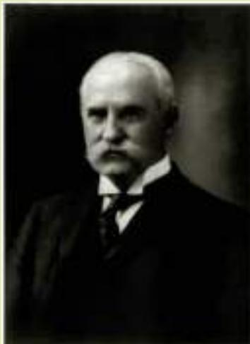

# IN THE NEWS

# A Trip to Jekyll Island

Here’s the story of how the Federal Reserve came into being.

## The Stranger-Than-Fiction Story of How the Fed Was Created

By Roger Lowenstein

ccording to opinion surveys, no institution save the Internal Revenue Service is held in lower regard than the Federal Reserve. It’s also a font of conspiracy theories stoked by radical libertarians, who insist the Fed is debauching the currency and will ultimately bankrupt the country.

The Fed’s unpopularity would make sense if it had, say, failed to intervene and save the system during the 2008 financial crisis. But, in fact, the Fed did rescue the economy….

Nonetheless, dissatisfaction is alive in Congress, where various bills would strip the Fed’s autonomy and subject sensitive monetary decisions to the scrutiny of elected politicians. Some bills would go even further and explore a return to the gold standard.

For central bank watchers, this dynamic — effective policy rewarded with populist scorn — is nothing new. In America, it has always been thus.

At Alexander Hamilton’s urging, Congress first chartered a national bank — the ur-Fed — in 1791. However, Thomas Jefferson, who famously mistrusted banks (he thought agriculture more virtuous), and who was fearful of a strong central government, opposed this development. After 20 years, the Jeffersonians won and Congress let the charter expire.

This decision led to disaster: ruinous inflation. So Congress chartered a Second Bank of the United States, which began in 1817, providing the growing country with a better, more uniform currency and improved its public finances. But success couldn’t save it. Andrew Jackson despised the Second Bank as a tool of East Coast elites, and it too was abolished.

For most of the 19th century, the U.S., unlike most nations in Europe, did not have a lender of last resort. Frequent panics and credit shortages were the result. Yet some of the very people who could have benefited most from a central bank, such as farmers who were starved for credit, preferred the status quo. Like Jackson and Jefferson before them, they were fearful that a government bank would tyrannize the people, perhaps in cahoots with Wall Street.

After a financial panic in 1907 virtually shut down the banking system, reformers began to press once more for a central bank. But popular mistrust remained so pronounced that they were afraid to go public.

This is the point — 105 years ago — when the story seems to have been hijacked by a future Hollywood scriptwriter.

On a November evening in 1910, a powerful senator, Rhode Island Republican Nelson W. Aldrich, boarded his private rail car near

Today, bank runs are not a major problem for the U.S. banking system or the Fed. The federal government now guarantees the safety of deposits at most banks, primarily through the Federal Deposit Insurance Corporation (FDIC). Depositors do not make runs on their banks because they are confident that, even if their bank goes bankrupt, the FDIC will make good on the deposits. The policy of government deposit insurance has costs: Bankers whose deposits are guaranteed may have too little incentive to avoid bad risks when making loans. But one benefit of deposit insurance is a more stable banking system. As a result, most people see bank runs only in the movies. ●

## 16-4d The Federal Funds Rate

If you read about U.S. monetary policy in the newspaper, you will find much discussion of the federal funds rate. This raises several questions:

Q: What is the federal funds rate?

A: The federal funds rate is the short-term interest rate that banks charge one another for loans. If one bank finds itself short of reserves while another bank has excess reserves, the second bank can lend some reserves to the first. The loans are temporary—typically overnight. The price of the loan is the federal funds rate.

New York. A light snow was falling, muting the hushed, conspiratorial tones of his guests, which is exactly how Aldrich wanted it.

The reform-minded banker Paul Warburg, one of his guests, was toting a hunting rifle, but he had no interest in hunting. The party also included a member of the powerful Morgan bank, as well as an assistant U.S. Treasury secretary, and Frank Vanderlip, head of the country’s largest bank, National City.

“On what sort of errand are we going?” Vanderlip inquired.

“It may be a wild-goose chase; it may the biggest thing you and I ever did,” Warburg replied.

Masquerading as duck hunters, they disembarked in Brunswick, Ga., and traveled by launch to Jekyll Island, home of an exclusive club surrounded by pine and palmetto groves. Over the course of a week, Aldrich and his bankers mapped out a draft of what was to become the Federal Reserve Act, changing the U.S. economy forever.

Congress was never told that Aldrich’s bill had been drafted by Wall Street moguls. His bill did not pass, but it was the basis of a successor bill, the Federal Reserve Act, which Woodrow Wilson signed in 1913. Years later, when the Jekyll trip was revealed to the public, extremists seized on this stranger-than-fiction episode to bolster their claim that the Fed was a bankers’ plot against the American people. For conspiracy theorists, the bankers’ conclave on Jekyll became a metaphor for the Fed itself. The obvious irony is that, fearing Americans’ irrational suspicion of central banking, Aldrich and his crew

LIBRARY OFCONGRESS PRINTS AND PHOTOGRAPHS

  
Senator Nelson Aldrich

## federal funds rate the interest rate at which banks make overnight loans to one another

resorted to a plot that, ultimately, deepened the country’s paranoia.

Despite their clandestine tactics, the financiers’ motives were actually patriotic. Aldrich had visited Europe and studied its central banks. He wanted expert help to draft an American equivalent. And in between sumptuous meals featuring wild turkey and freshly scalloped oysters, his group of wealthy bankers earnestly wrestled with issues that still provoke us today: How should power over the economy be apportioned between Washington and localities? How should the central bank set interest rates and the money supply?

The Federal Reserve today is not perfect. But it is more transparent than ever, thanks to reforms instituted by the previous chairman, Ben S. Bernanke, and it is no less necessary than was a central bank in 1791. Americans’ paranoia is unjustified, just as it has always been. ■

Roger Lowenstein is the author of “America’s Bank: The Epic Struggle to Create the Federal Reserve.”

Source: Los Angeles Times, November 2, 2015.

Q: How is the federal funds rate different from the discount rate?

A: The discount rate is the interest rate banks pay to borrow directly from the Federal Reserve through the discount window. Borrowing reserves from another bank in the federal funds market is an alternative to borrowing reserves from the Fed, and a bank short of reserves will typically do whichever is cheaper. In practice, the discount rate and the federal funds rate move closely together.

Q: Does the federal funds rate matter only for banks?

A: Not at all. Although only banks borrow directly in the federal funds market, the economic impact of this market is much broader. Because different parts of the financial system are highly interconnected, interest rates on different kinds of loans are strongly correlated with one another. So when the federal funds rate rises or falls, other interest rates often move in the same direction.

Q: What does the Federal Reserve have to do with the federal funds rate?

A: In recent years, the Federal Reserve has set a target goal for the federal funds rate. When the Federal Open Market Committee meets approximately every 6 weeks, it decides whether to raise or lower that target.

Q: How can the Fed make the federal funds rate hit the target it sets?

A: Although the actual federal funds rate is set by supply and demand in the market for loans among banks, the Fed can use open-market operations to influence that market. For example, when the Fed buys bonds in openmarket operations, it injects reserves into the banking system. With more reserves in the system, fewer banks find themselves in need of borrowing reserves to meet reserve requirements. The fall in demand for borrowing reserves decreases the price of such borrowing, which is the federal funds rate. Conversely, when the Fed sells bonds and withdraws reserves from the banking system, more banks find themselves short of reserves, and they bid up the price of borrowing reserves. Thus, open-market purchases lower the federal funds rate, and open-market sales raise the federal funds rate.

Q: But don’t these open-market operations affect the money supply?

A: Yes, absolutely. When the Fed announces a change in the federal funds rate, it is committing itself to the open-market operations necessary to make that change happen, and these open-market operations will alter the supply of money. Decisions by the FOMC to change the target for the federal funds rate are also decisions to change the money supply. They are two sides of the same coin. Other things being equal, a decrease in the target for the federal funds rate means an expansion in the money supply, and an increase in the target for the federal funds rate means a contraction in the money supply.

QuickQuiz

If the Fed wanted to use all of its policy tools to decrease the money supply, what would it do?

## 16-5 Conclusion

Some years ago, a book made the best-seller list with the title Secrets of the Temple: How the Federal Reserve Runs the Country. Though no doubt an exaggeration, this title did highlight the important role of the monetary system in our daily lives. Whenever we buy or sell anything, we are relying on the extraordinarily useful social convention called “money.” Now that we know what money is and what determines its supply, we can discuss how changes in the quantity of money affect the economy. We begin to address that topic in the next chapter.

## CHAPTER QuickQuiz

1. The money supply includes all of the following EXCEPT a. metal coins. b. paper currency. c. lines of credit accessible with credit cards. d. bank balances accessible with debit cards.

2. Chloe takes \$100 of currency from her wallet and deposits it into her checking account. If the bank adds the entire \$100 to reserves, the money supply , but if the bank lends out some of the \$100, the money supply a. increases, increases even more b. increases, increases by less c. is unchanged, increases d. decreases, decreases by less

4. A bank has capital of \$200 and a leverage ratio of 5. If the value of the bank’s assets declines by 10 percent, then its capital will be reduced to a. \$100. b. \$150. c. \$180. d. \$185.

5. Which of the following actions by the Fed would reduce the money supply? a. an open-market purchase of government bonds b. a reduction in banks’ reserve requirements c. an increase in the interest rate paid on reserves d. a decrease in the discount rate on Fed lending

3. If the reserve ratio is ¼ and the central bank increases the quantity of reserves in the banking system by \$120, the money supply increases by a. \$90.

b. \$150.

6. In a system of fractional-reserve banking, even without any action by the central bank, the money supply declines if households choose to hold currency or if banks choose to hold excess reserves.

c. \$160.

a. more, more

b. more, less

d. \$480.

c. less, more

d. less, less

## SUMMARY

The term money refers to assets that people regularly use to buy goods and services.

Money serves three functions. As a medium of exchange, it is the item used to make transactions. As a unit of account, it provides the way to record prices and other economic values. As a store of value, it offers a way to transfer purchasing power from the present to the future.

Commodity money, such as gold, is money that has intrinsic value: It would be valued even if it were not used as money. Fiat money, such as paper dollars, is money without intrinsic value: It would be worthless if it were not used as money.

In the U.S. economy, money takes the form of currency and various types of bank deposits, such as checking accounts.

The Federal Reserve, the central bank of the United States, is responsible for regulating the U.S. monetary system. The Fed chair is appointed by the president and confirmed by Congress every 4 years. The chair is the head of the Federal Open Market Committee, which meets about every 6 weeks to consider changes in monetary policy.

•	 Bank depositors provide resources to banks by depositing their funds into bank accounts. These deposits are part of a bank’s liabilities. Bank owners also provide resources (called bank capital) for the bank. Because of leverage (the use of borrowed funds for investment), a small change in the value of a bank’s assets can lead to a large change in the value of the bank’s capital. To protect depositors, bank regulators require banks to hold a certain minimum amount of capital.

The Fed controls the money supply primarily through open-market operations: The purchase of government bonds increases the money supply, and the sale of government bonds decreases the money supply. The Fed also uses other tools to control the money supply. It can expand the money supply by decreasing the discount rate, increasing its lending to banks, lowering reserve requirements, or decreasing the interest rate on reserves. It can contract the money supply by increasing the discount rate, decreasing its lending to banks, raising reserve requirements, or increasing the interest rate on reserves.

When individuals deposit money in banks and banks loan out some of these deposits, the quantity of money in the economy increases. Because the banking system influences the money supply in this way, the Fed’s control of the money supply is imperfect.

The Federal Reserve has in recent years set monetary policy by choosing a target for the federal funds rate, a short-term interest rate at which banks make loans to one another. As the Fed achieves its target, it adjusts the money supply.

## KEY CONCEPTS

money, p. 320 medium of exchange, p. 321 unit of account, p. 321 store of value, p. 321 liquidity, p. 321 commodity money, p. 321 fiat money, p. 322 currency, p. 323 demand deposits, p. 323

Federal Reserve (Fed), p. 325

central bank, p. 325

money supply, p. 326

monetary policy, p. 326

reserves, p. 328

fractional-reserve banking, p. 328

reserve ratio, p. 328

money multiplier, p. 330

bank capital, p. 331 leverage, p. 331 leverage ratio, p. 331 capital requirement, p. 332 open-market operations, p. 333 discount rate, p. 333 reserve requirements, p. 334 federal funds rate, p. 337

## QUESTIONS FOR REVIEW

1. What distinguishes money from other assets in the economy?

2. What is commodity money? What is fiat money? Which kind do we use?

3. What are demand deposits and why should they be included in the stock of money?

7. Bank A has a leverage ratio of 10, while Bank B has a leverage ratio of 20. Similar losses on bank loans at the two banks cause the value of their assets to fall by 7 percent. Which bank shows a larger change in bank capital? Does either bank remain solvent? Explain.

4. Who is responsible for setting monetary policy in the United States? How is this group chosen?

8. What is the discount rate? What happens to the money supply when the Fed raises the discount rate?

5. If the Fed wants to increase the money supply with open-market operations, what does it do?

9. What are reserve requirements? What happens to the money supply when the Fed raises reserve requirements?

6. Why don’t banks hold 100-percent reserves? How is the amount of reserves banks hold related to the amount of money the banking system creates?

10. Why can’t the Fed control the money supply perfectly?

## PROBLEMS AND APPLICATIONS

1. Which of the following are considered money in the U.S. economy? Which are not? Explain your answers by discussing each of the three functions of money.

c. The Fed increases the interest rate it pays on reserves.

a. a U.S. penny

b. a Mexican peso

d. Citibank repays a loan it had previously taken from the Fed.

c. a Picasso painting

e. After a rash of pickpocketing, people decide to hold less currency.

d. a plastic credit card

2. Explain whether each of the following events increases or decreases the money supply.

f. Fearful of bank runs, bankers decide to hold more excess reserves.

a. The Fed buys bonds in open-market operations.

b. The Fed reduces the reserve requirement.

g. The FOMC increases its target for the federal funds rate.

3. Your uncle repays a \$100 loan from Tenth National Bank (TNB) by writing a \$100 check from his TNB checking account. Use T-accounts to show the effect of this transaction on your uncle and on TNB. Has your uncle’s wealth changed? Explain.

4. Beleaguered State Bank (BSB) holds \$250 million in deposits and maintains a reserve ratio of 10 percent. a. Show a T-account for BSB.

b. Now suppose that BSB’s largest depositor withdraws \$10 million in cash from her account. If BSB decides to restore its reserve ratio by reducing the amount of loans outstanding, show its new T-account.

c. Explain what effect BSB’s action will have on other banks.

d. Why might it be difficult for BSB to take the action described in part (b)? Discuss another way for BSB to return to its original reserve ratio.

5. You take \$100 you had kept under your mattress and deposit it in your bank account. If this \$100 stays in the banking system as reserves and if banks hold reserves equal to 10 percent of deposits, by how much does the total amount of deposits in the banking system increase? By how much does the money supply increase?

6. Happy Bank starts with \$200 in bank capital. It then accepts \$800 in deposits. It keeps 12.5 percent (1/8th) of deposits in reserve. It uses the rest of its assets to make bank loans.

a. Show the balance sheet of Happy Bank.

b. What is Happy Bank’s leverage ratio?

c. Suppose that 10 percent of the borrowers from Happy Bank default and these bank loans become worthless. Show the bank’s new balance sheet.

d. By what percentage do the bank’s total assets decline? By what percentage does the bank’s capital decline? Which change is larger? Why?

7. The Fed conducts a \$10 million open-market purchase of government bonds. If the required reserve ratio is 10 percent, what are the largest and smallest possible increases in the money supply that could result? Explain.

8. Assume that the reserve requirement is 5 percent. All other things being equal, will the money supply expand more if the Fed buys \$2,000 worth of bonds or if someone deposits in a bank \$2,000 that she had been hiding in her cookie jar? If one creates more, how much more does it create? Support your thinking.

9. Suppose that the reserve requirement for checking deposits is 10 percent and that banks do not hold any excess reserves.

a. If the Fed sells \$1 million of government bonds, what is the effect on the economy’s reserves and money supply?

b. Now suppose the Fed lowers the reserve requirement to 5 percent, but banks choose to hold another 5 percent of deposits as excess reserves. Why might banks do so? What is the overall change in the money multiplier and the money supply as a result of these actions?

10. Assume that the banking system has total reserves of \$100 billion. Assume also that required reserves are 10 percent of checking deposits and that banks hold no excess reserves and households hold no currency.

a. What is the money multiplier? What is the money supply?

b. If the Fed now raises required reserves to 20 percent of deposits, what are the change in reserves and the change in the money supply?

11. Assume that the reserve requirement is 20 percent. Also assume that banks do not hold excess reserves and there is no cash held by the public. The Fed decides that it wants to expand the money supply by \$40 million.

a. If the Fed is using open-market operations, will it buy or sell bonds?

b. What quantity of bonds does the Fed need to buy or sell to accomplish the goal? Explain your reasoning.

12. The economy of Elmendyn contains 2,000 \$1 bills.

a. If people hold all money as currency, what is the quantity of money?

b. If people hold all money as demand deposits and banks maintain 100 percent reserves, what is the quantity of money?

c. If people hold equal amounts of currency and demand deposits and banks maintain 100 percent reserves, what is the quantity of money?

d. If people hold all money as demand deposits and banks maintain a reserve ratio of 10 percent, what is the quantity of money?

e. If people hold equal amounts of currency and demand deposits and banks maintain a reserve ratio of 10 percent, what is the quantity of money?

To find additional study resources, visit cengagebrain.com, and search for “Mankiw.”
