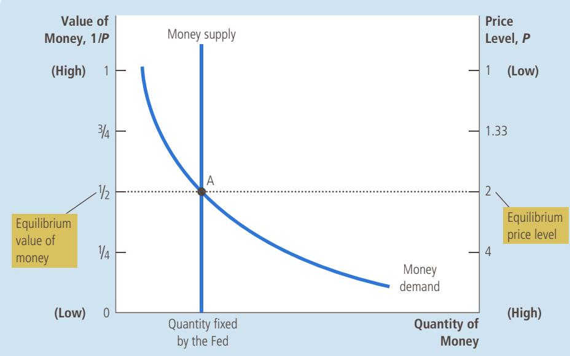
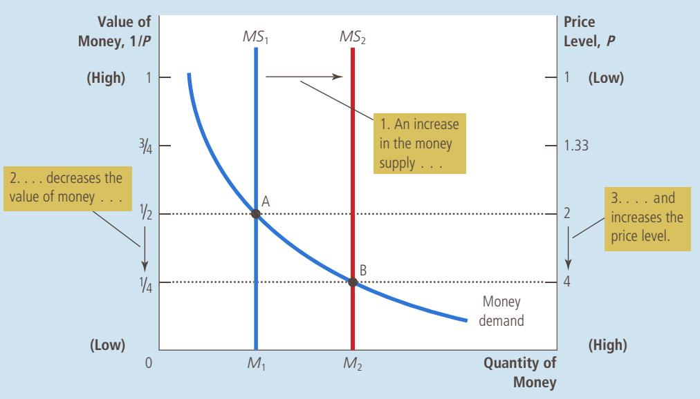
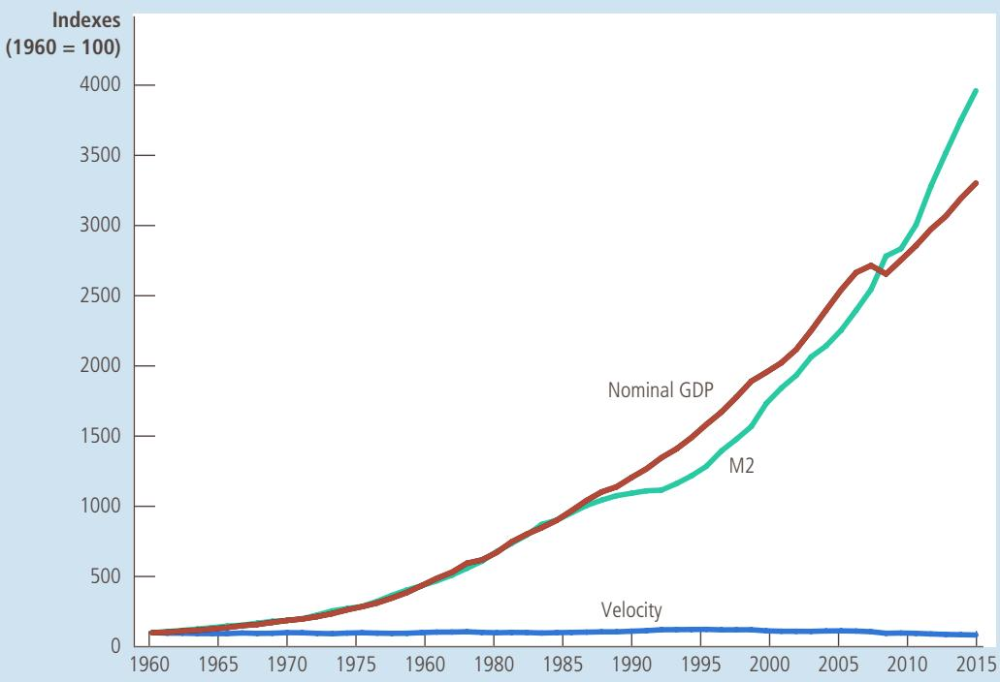
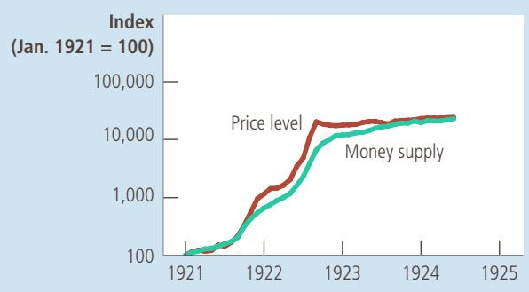
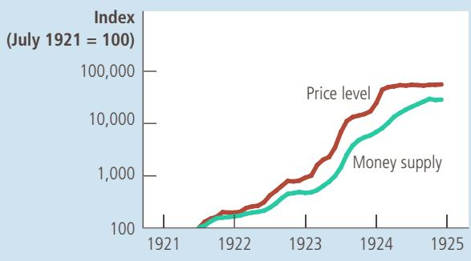
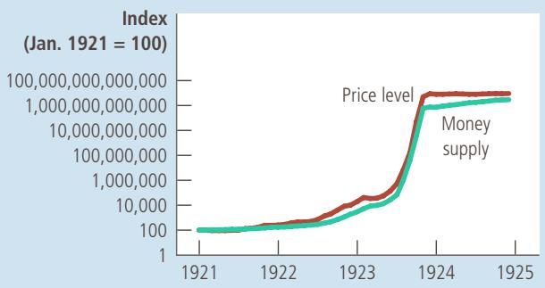
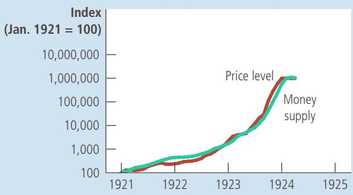
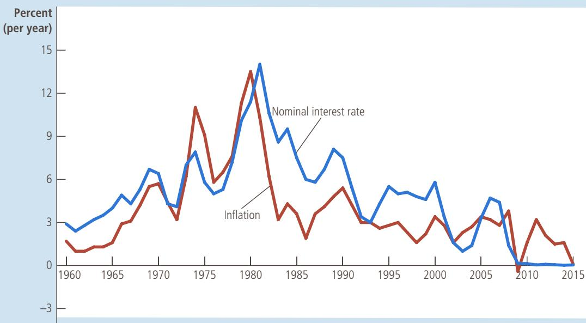

# Money Growth and Inflation

oday, if you want to buy an ice-cream cone, you need at least a couple of dollars, but that has not always been the case. In the 1930s, my grandmother ran a sweet shop in Trenton, New Jersey, where she sold ice-cream cones in two sizes. A cone with a small scoop of ice cream cost 3 cents. Hungry customers could buy a large scoop for a nickel.

You may not be surprised at the increase in the price of ice cream. In most modern economies, most prices tend to rise over time. This increase in the overall level of prices is called inflation. Earlier in the book, we examined how economists measure the inflation rate as the percentage change in the consumer price index (CPI), the GDP deflator, or some other index of the overall price level. These price indexes show that, in the United States over the past 80 years, prices have risen on average 3.6 percent per year. Accumulated over so many years, a 3.6 percent annual inflation rate leads to a seventeenfold increase in the price level.

Inflation may seem natural and inevitable to a person who grew up in the United States during recent decades, but in fact, it is not inevitable at all. There were long periods in the 19th century during which most prices fell—a phenomenon called deflation. The average level of prices in the U.S. economy was 23 percent lower in 1896 than in 1880, and this deflation was a major issue in the presidential election of 1896. Farmers, who had accumulated large debts, suffered when declines in crop prices reduced their incomes and thus their ability to pay off their debts. They advocated government policies to reverse the deflation.

Although inflation has been the norm in more recent history, there has been substantial variation in the rate at which prices rise. From 2005 to 2015, prices rose at an average rate of 1.2 percent per year. By contrast, in the 1970s, prices rose by 7.8 percent per year, which meant the price level more than doubled over the decade. The public often views such high rates of inflation as a major economic problem. In fact, when President Jimmy Carter ran for reelection in 1980, challenger Ronald Reagan pointed to high inflation as one of the failures of Carter’s economic policy.

International data show an even broader range of inflation experiences. In 2015, while the inflation rate in the United States was a mere 0.1 percent, it was 1.5 percent in China, 4.9 percent in India, 15 percent in Russia, and 84 percent in Venezuela. And even the high inflation rates in Russia and Venezuela are moderate by some standards. In February 2008, the central bank of Zimbabwe announced the inflation rate in its economy had reached 24,000 percent; some independent estimates put the figure even higher. An extraordinarily high rate of inflation such as this is called hyperinflation.

What determines whether an economy experiences inflation and, if so, how much? This chapter answers this question by developing the quantity theory of money. Chapter 1 summarized this theory as one of the Ten Principles of Economics: Prices rise when the government prints too much money. This insight has a long and venerable tradition among economists. The quantity theory was discussed by the famous 18th-century philosopher and economist David Hume and was advocated more recently by the prominent economist Milton Friedman. This theory can explain moderate inflations, such as those we have experienced in the United States, as well as hyperinflations.

After developing a theory of inflation, we turn to a related question: Why is inflation a problem? At first glance, the answer to this question may seem obvious: Inflation is a problem because people don’t like it. In the 1970s, when the United States experienced a relatively high rate of inflation, opinion polls placed inflation as the most important issue facing the nation. President Ford echoed this sentiment in 1974 when he called inflation “public enemy number one.” Ford wore a “WIN” button on his lapel—for Whip Inflation Now.

But what, exactly, are the costs that inflation imposes on a society? The answer may surprise you. Identifying the various costs of inflation is not as straightforward as it first appears. As a result, although all economists decry hyperinflation, some economists argue that the costs of moderate inflation are not nearly as large as the public believes.

## 17-1 The Classical Theory of Inflation

We begin our study of inflation by developing the quantity theory of money. This theory is often called “classical” because it was developed by some of the earliest economic thinkers. Most economists today rely on this theory to explain the longrun determinants of the price level and the inflation rate.

## 17-1a The Level of Prices and the Value of Money

Suppose we observe that over some period of time the price of an ice-cream cone rises from a nickel to a dollar. What conclusion should we draw from the fact that people are willing to give up so much more money in exchange for a cone? It is possible that people have come to enjoy ice cream more (perhaps because some chemist has developed a miraculous new flavor). But that is probably not the case. It is more likely that people’s enjoyment of ice cream has stayed roughly the same and that, over time, the money used to buy ice cream has become less valuable. Indeed, the first insight about inflation is that it is more about the value of money than about the value of goods.

This insight helps point the way toward a theory of inflation. When the consumer price index and other measures of the price level rise, commentators are often tempted to look at the many individual prices that make up these price indexes: “The CPI rose by 3 percent last month, led by a 20 percent rise in the price of coffee and a 30 percent rise in the price of heating oil.” Although this approach does contain some interesting information about what’s happening in the economy, it also misses a key point: Inflation is an economy-wide phenomenon that concerns, first and foremost, the value of the economy’s medium of exchange.

The economy’s overall price level can be viewed in two ways. So far, we have viewed the price level as the price of a basket of goods and services. When the price level rises, people have to pay more for the goods and services they buy. Alternatively, we can view the price level as a measure of the value of money. A rise in the price level means a lower value of money because each dollar in your wallet now buys a smaller quantity of goods and services.

It may help to express these ideas mathematically. Suppose P is the price level as measured by the consumer price index or the GDP deflator. Then P measures the number of dollars needed to buy a basket of goods and services. Now turn this idea around: The quantity of goods and services that can be bought with \$1 equals 1/P. In other words, if P is the price of goods and services measured in terms of money, 1/P is the value of money measured in terms of goods and services.

  
WWW.CARTOONBANK.COM © FRANK MODELL/ THE NEW YORKER COLLECTION/  
“So what’s it going to be? The same size as last year or the same price as last year?”

This mathematics is simplest to understand in an economy that produces only a single good, say, ice-cream cones. In that case, P would be the price of a cone. When the price of a cone (P) is \$2, then the value of a dollar (1/P) is half a cone. When the price (P) rises to \$3, the value of a dollar (1/P) falls to a third of a cone. The actual economy produces thousands of goods and services, so we use a price index rather than the price of a single good. But the logic remains the same: When the overall price level rises, the value of money falls.

## 17-1b Money Supply, Money Demand, and Monetary Equilibrium

What determines the value of money? The answer to this question, like many in economics, is supply and demand. Just as the supply and demand for bananas determines the price of bananas, the supply and demand for money determines the value of money. Thus, our next step in developing the quantity theory of money is to consider the determinants of money supply and money demand.

First consider money supply. In the preceding chapter, we discussed how the Federal Reserve, together with the banking system, determines the supply of money. When the Fed sells bonds in open-market operations, it receives dollars in exchange and contracts the money supply. When the Fed buys government bonds, it pays out dollars and expands the money supply. In addition, if any of these dollars are deposited in banks, which hold some as reserves and loan out the rest, the money multiplier swings into action, and these open-market operations can have an even greater effect on the money supply. For our purposes in this chapter, we ignore the complications introduced by the banking system and simply take the quantity of money supplied as a policy variable that the Fed controls.

Now consider money demand. Most fundamentally, the demand for money reflects how much wealth people want to hold in liquid form. Many factors influence the quantity of money demanded. The amount of currency that people hold in their wallets, for instance, depends on how much they rely on credit cards and on whether an automatic teller machine is easy to find. And as we will emphasize in Chapter 21, the quantity of money demanded depends on the interest rate that a person could earn by using the money to buy an interestbearing bond rather than leaving it in his wallet or low-interest checking account.

Although many variables affect the demand for money, one variable stands out in importance: the average level of prices in the economy. People hold money because it is the medium of exchange. Unlike other assets, such as bonds or stocks, people can use money to buy the goods and services on their shopping lists. How much money they choose to hold for this purpose depends on the prices of those goods and services. The higher prices are, the more money the typical transaction requires, and the more money people will choose to hold in their wallets and checking accounts. That is, a higher price level (a lower value of money) increases the quantity of money demanded.

What ensures that the quantity of money the Fed supplies balances the quantity of money people demand? The answer depends on the time horizon being considered. Later in this book, we examine the short-run answer and learn that interest rates play a key role. The long- run answer, however, is much simpler. In the long run, money supply and money demand are brought into equilibrium by the overall level of prices. If the price level is above the equilibrium level, people will want to hold more money than the Fed has created, so the price level must fall to balance supply and demand. If the price level is below the equilibrium level, people will want to hold less money than the Fed has created, and the price level must rise to balance supply and demand. At the equilibrium price level, the quantity of money that people want to hold exactly balances the quantity of money supplied by the Fed.

Figure 1 illustrates these ideas. The horizontal axis of this graph shows the quantity of money. The left vertical axis shows the value of money 1/P, and the right vertical axis shows the price level P. Notice that the price-level axis on the right is inverted: A low price level is shown near the top of this axis, and a high price level is shown near the bottom. This inverted axis illustrates that when the value of money is high (as shown near the top of the left axis), the price level is low (as shown near the top of the right axis).

## FIGURE 1

## How the Supply and Demand for Money Determine the Equilibrium Price Level

The horizontal axis shows the quantity of money. The left vertical axis shows the value of money, and the right vertical axis shows the price level. The supply curve for money is vertical because the quantity of money supplied is fixed by the Fed. The demand curve for money slopes downward because people want to hold a larger quantity of money when each dollar buys less. At the equilibrium, point A, the value of money (on the left axis) and the price level (on the right axis) have adjusted to bring the quantity of money supplied and the quantity of money demanded into balance.

The two curves in this figure are the supply and demand curves for money. The supply curve is vertical because the Fed has fixed the quantity of money available. The demand curve for money slopes downward, indicating that when the value of money is low (and the price level is high), people demand a larger quantity of it to buy goods and services. At the equilibrium, shown in the figure as point A, the quantity of money demanded balances the quantity of money supplied. This equilibrium of money supply and money demand determines the value of money and the price level.

## 17-1c The Effects of a Monetary Injection

Let’s now consider the effects of a change in monetary policy. To do so, imagine that the economy is in equilibrium and then, suddenly, the Fed doubles the supply of money by printing some dollar bills and dropping them around the country from helicopters. (Or, less dramatically and more realistically, the Fed could inject money into the economy by buying some government bonds from the public in open-market operations.) What happens after such a monetary injection? How does the new equilibrium compare to the old one?

Figure 2 shows what happens. The monetary injection shifts the supply curve to the right from $M S _ { 1 }$ to $M \bar { S } _ { 2 ^ { \prime } } ^ { - }$ and the equilibrium moves from point A to point B. As a result, the value of money (shown on the left axis) decreases from 1/2 to $^ 1 / _ { 4 . }$ and the equilibrium price level (shown on the right axis) increases from 2 to 4. In other words, when an increase in the money supply makes dollars more plentiful, the result is an increase in the price level that makes each dollar less valuable.

This explanation of how the price level is determined and why it might change over time is called the quantity theory of money. According to the quantity theory, the quantity of money available in an economy determines the value of money, and growth in the quantity of money is the primary cause of inflation. As economist Milton Friedman once put it, “Inflation is always and everywhere a monetary phenomenon.”

quantity theory of money a theory asserting that the quantity of money available determines the price level and that the growth rate in the quantity of money available determines the inflation rate

## FIGURE 2

## An Increase in the Money Supply

When the Fed increases the supply of money, the money supply curve shifts from MS to MS2. The value of money (on the left axis) and the price level (on the right axis) adjust to bring supply and demand back into balance. The equilibrium moves from point A to point B. Thus, when an increase in the money supply makes dollars more plentiful, the price level increases, making each dollar less valuable.

## 17-1d A Brief Look at the Adjustment Process

So far, we have compared the old equilibrium and the new equilibrium after an injection of money. How does the economy move from the old to the new equilibrium? A complete answer to this question requires an understanding of short-run fluctuations in the economy, which we examine later in this book. Here, we briefly consider the adjustment process that occurs after a change in the money supply.

The immediate effect of a monetary injection is to create an excess supply of money. Before the injection, the economy was in equilibrium (point A in Figure 2). At the prevailing price level, people had exactly as much money as they wanted. But after the helicopters drop the new money and people pick it up off the streets, people have more dollars in their wallets than they want. At the prevailing price level, the quantity of money supplied now exceeds the quantity demanded.

People try to get rid of this excess supply of money in various ways. They might use it to buy goods and services. Or they might use this excess money to make loans to others by buying bonds or by depositing the money in a bank savings account. These loans allow other people to buy goods and services. In either case, the injection of money increases the demand for goods and services.

The economy’s ability to supply goods and services, however, has not changed. As we saw in the chapter on production and growth, the economy’s output of goods and services is determined by the available labor, physical capital, human capital, natural resources, and technological knowledge. None of these is altered by the injection of money.

Thus, the greater demand for goods and services causes the prices of goods and services to increase. The increase in the price level, in turn, increases the quantity of money demanded because people are using more dollars for every transaction. Eventually, the economy reaches a new equilibrium (point B in Figure 2) at which the quantity of money demanded again equals the quantity of money supplied.

In this way, the overall price level for goods and services adjusts to bring money supply and money demand into balance.

## 17-1e The Classical Dichotomy and Monetary Neutrality

We have seen how changes in the money supply lead to changes in the average level of prices of goods and services. How do monetary changes affect other economic variables, such as production, employment, real wages, and real interest rates? This question has long intrigued economists, including David Hume in the 18th century.

Hume and his contemporaries suggested that economic variables should be divided into two groups. The first group consists of nominal variables—variables measured in monetary units. The second group consists of real variables— variables measured in physical units. For example, the income of corn farmers is a nominal variable because it is measured in dollars, whereas the quantity of corn they produce is a real variable because it is measured in bushels. Nominal GDP is a nominal variable because it measures the dollar value of the economy’s output of goods and services; real GDP is a real variable because it measures the total quantity of goods and services produced and is not influenced by the current prices of those goods and services. The separation of real and nominal variables is now called the classical dichotomy. (A dichotomy is a division into two groups, and classical refers to the earlier economic thinkers.)

Applying the classical dichotomy is tricky when we turn to prices. Most prices are quoted in units of money and, therefore, are nominal variables. When we say that the price of corn is \$2 a bushel or that the price of wheat is \$1 a bushel, both prices are nominal variables. But what about a relative price—the price of one thing compared to another? In our example, we could say that the price of a bushel of corn is 2 bushels of wheat. This relative price is not measured in terms of money. When comparing the prices of any two goods, the dollar signs cancel, and the resulting number is measured in physical units. Thus, while dollar prices are nominal variables, relative prices are real variables.

This lesson has many applications. For instance, the real wage (the dollar wage adjusted for inflation) is a real variable because it measures the rate at which people exchange goods and services for a unit of labor. Similarly, the real interest rate (the nominal interest rate adjusted for inflation) is a real variable because it measures the rate at which people exchange goods and services today for goods and services in the future.

Why separate variables into these groups? The classical dichotomy is useful because different forces influence real and nominal variables. According to classical analysis, nominal variables are influenced by developments in the economy’s monetary system, whereas money is largely irrelevant for explaining real variables.

This idea was implicit in our discussion of the real economy in the long run. In previous chapters, we examined how real GDP, saving, investment, real interest rates, and unemployment are determined without mentioning the existence of money. In that analysis, the economy’s production of goods and services depends on technology and factor supplies, the real interest rate balances the supply and demand for loanable funds, the real wage balances the supply and demand for labor, and unemployment results when the real wage is kept above the equilibrium level. These conclusions have nothing to do with the quantity of money supplied.

Changes in the supply of money, according to classical analysis, affect nominal variables but not real ones. When the central bank doubles the money supply, the price level doubles, the dollar wage doubles, and all other dollar values double. Real variables, such as production, employment, real wages, and real interest rates, are unchanged. The irrelevance of monetary changes for real variables is called monetary neutrality.

An analogy helps explain monetary neutrality. As the unit of account, money is the yardstick we use to measure economic transactions. When a central bank doubles the money supply, all prices double, and the value of the unit of account falls by half. A similar change would occur if the government were to reduce the length of the yard from 36 to 18 inches: With the new, shorter yardstick, all measured distances (nominal variables) would double, but the actual distances (real variables) would remain the same. The dollar, like the yard, is merely a unit of measurement, so a change in its value should not have real effects.

Is monetary neutrality realistic? Not completely. A change in the length of the yard from 36 to 18 inches would not matter in the long run, but in the short run, it would lead to confusion and mistakes. Similarly, most economists today believe that over short periods of time—within the span of a year or two—monetary changes affect real variables. Hume himself also doubted that monetary neutrality would apply in the short run. (We will study short-run non-neutrality later in the book, and this topic will help explain why the Fed changes the money supply over time.)

Yet classical analysis is right about the economy in the long run. Over the course of a decade, monetary changes have significant effects on nominal variables (such as the price level) but only negligible effects on real variables (such as real GDP). When studying long-run changes in the economy, the neutrality of money offers a good description of how the world works.

## 17-1f Velocity and the Quantity Equation

We can obtain another perspective on the quantity theory of money by considering the following question: How many times per year is the typical dollar bill used to pay for a newly produced good or service? The answer to this question is given by a variable called the velocity of money. In physics, the term velocity refers to the speed at which an object travels. In economics, the velocity of money refers to the speed at which the typical dollar bill travels around the economy from wallet to wallet.

To calculate the velocity of money, we divide the nominal value of output (nominal GDP) by the quantity of money. If P is the price level (the GDP deflator), Y the quantity of output (real GDP), and M the quantity of money, then velocity is

$$
V = (P \times Y) / M.
$$

To see why this makes sense, imagine a simple economy that produces only pizza. Suppose that the economy produces 100 pizzas in a year, that a pizza sells for \$10, and that the quantity of money in the economy is \$50. Then the velocity of money is

$$
\begin{array}{r l} V & = (10 \times 100) / 50 \\ & = 20. \end{array}
$$

In this economy, people spend a total of \$1,000 per year on pizza. For this \$1,000 of spending to take place with only \$50 of money, each dollar bill must change hands on average 20 times per year.

With slight algebraic rearrangement, this equation can be rewritten as

$$
M \times V = P \times Y.
$$

This equation states that the quantity of money (M) times the velocity of money (V) equals the price of output (P) times the amount of output (Y). It is called the quantity equation because it relates the quantity of money (M) to the nominal value of output $( P \times Y )$ . The quantity equation shows that an increase in the quantity of money in an economy must be reflected in one of the other three variables: The price level must rise, the quantity of output must rise, or the velocity of money must fall.

In many cases, it turns out that the velocity of money is relatively stable. For example, Figure 3 shows nominal GDP, the quantity of money (as measured by M2), and the velocity of money for the U.S. economy since 1960. During this period, the money supply and nominal GDP both increased more than thirtyfold. By contrast, the velocity of money, although not exactly constant, has not changed

quantity equation the equation M 3 V 5 P 3 Y, which relates the quantity of money, the velocity of money, and the dollar value of the economy’s output of goods and services

This figure shows the nominal value of output as measured by nominal GDP, the quantity of money as measured by M2, and the velocity of money as measured by their ratio. For comparability, all three series have been scaled to equal 100 in 1960. Notice that nominal GDP and the quantity of money have grown dramatically over this period, while velocity has been relatively stable.

Sourc e: U.S. Department of Commerce; Federal Reserve Board.

## FIGURE 3

Nominal GDP, the Quantity of Money, and the Velocity of Money

dramatically. Thus, for some purposes, the assumption of constant velocity is a good approximation.

We now have all the elements necessary to explain the equilibrium price level and inflation rate. They are as follows:

1. The velocity of money is relatively stable over time.

2. Because velocity is stable, when the central bank changes the quantity of money (M), it causes proportionate changes in the nominal value of output (P 3 Y).

3. The economy’s output of goods and services (Y) is primarily determined by factor supplies (labor, physical capital, human capital, and natural resources) and the available production technology. In particular, because money is neutral, money does not affect output.

4. With output (Y) determined by factor supplies and technology, when the central bank alters the money supply (M) and induces proportional changes in the nominal value of output (P 3 Y), these changes are reflected in changes in the price level (P).

5. Therefore, when the central bank increases the money supply rapidly, the result is a high rate of inflation.

These five steps are the essence of the quantity theory of money.

## MONEY AND PRICES DURING FOUR HYPERINFLATIONS

Although earthquakes can wreak havoc on a society, they have the beneficial by-product of providing much useful data for seismologists. These data can shed light on alternative theories and,

thereby, help society predict and deal with future threats. Similarly, hyperinflations offer monetary economists a natural experiment they can use to study the effects of money on the economy.

Hyperinflations are interesting in part because the changes in the money supply and price level are so large. Indeed, hyperinflation is generally defined as inflation that exceeds 50 percent per month. This means that the price level increases more than 100-fold over the course of a year.

The data on hyperinflation show a clear link between the quantity of money and the price level. Figure 4 graphs data from four classic hyperinflations that occurred during the 1920s in Austria, Hungary, Germany, and Poland. Each graph shows the quantity of money in the economy and an index of the price level. The slope of the money line represents the rate at which the quantity of money was growing, and the slope of the price line represents the inflation rate. The steeper the lines, the higher the rates of money growth or inflation.

Notice that in each graph the quantity of money and the price level are almost parallel. In each instance, growth in the quantity of money is moderate at first and so is inflation. But over time, the quantity of money in the economy starts growing faster and faster. At about the same time, inflation also takes off. Then when the quantity of money stabilizes, the price level stabilizes as well. These episodes illustrate well one of the Ten Principles of Economics: Prices rise when the government prints too much money. ●

inflation tax

This figure shows the quantity of money and the price level during four hyperinflations. (Note that these variables are graphed on logarithmic scales. This means that equal vertical distances on the graph represent equal percentage changes in the variable.) In each case, the quantity of money and the price level move closely together. The strong association between these two variables is consistent with the quantity theory of money, which states that growth in the money supply is the primary cause of inflation.

## FIGURE 4

Money and Prices during Four Hyperinflations

S o u rc e : Adapted from Thomas J. Sargent, “The End of Four Big Inflations,” in Robert Hall, ed., Inflation (Chicago: University of Chicago Press, 1983), pp. 41–93.

(a) Austria  

(b) Hungary  
  
(d) Poland

(c) Germany  

## 17-1g The Inflation Tax

If inflation is so easy to explain, why do countries experience hyperinflation? That is, why do the central banks of these countries choose to print so much money that its value is certain to fall rapidly over time?

The answer is that the governments of these countries are using money creation as a way to pay for their spending. When the government wants to build roads, pay salaries to its soldiers, or give transfer payments to the poor or elderly, it first has to raise the necessary funds. Normally, the government does this by levying taxes, such as income and sales taxes, and by borrowing from the public by selling government bonds. Yet the government can also pay for spending simply by printing the money it needs.

When the government raises revenue by printing money, it is said to levy an inflation tax. The inflation tax is not exactly like other taxes, however, because no one receives a bill from the government for this tax. Instead, the inflation tax is

government raises by

creating money

ISTOCK/GETTYIMAGES

subtler. When the government prints money, the price level rises, and the dollars in your wallet become less valuable. Thus, the inflation tax is like a tax on everyone who holds money.

The importance of the inflation tax varies from country to country and over time. In the United States in recent years, the inflation tax has been a trivial source of revenue: It has accounted for less than 3 percent of government revenue. During the 1770s, however, the Continental Congress of the fledgling United States relied heavily on the inflation tax to pay for military spending. Because the new government had a limited ability to raise funds through regular taxes or borrowing, printing dollars was the easiest way to pay the American soldiers. As the quantity theory predicts, the result was a high rate of inflation: Prices measured in terms of the continental dollar rose more than a 100-fold over a few years.

Almost all hyperinflations follow the same pattern as the hyperinflation during the American Revolution. The government has high spending, inadequate tax revenue, and limited ability to borrow. As a result, it turns to the printing press to pay for its spending. The massive increases in the quantity of money lead to massive inflation. The inflation ends when the government institutes fiscal reforms—such as cuts in government spending—that eliminate the need for the inflation tax.

## FYI

## Hyperinflation in Zimbabwe

During the first decade of the 2000s, the nation of Zimbabwe experienced one of history’s most extreme examples of hyperinflation. In many ways, the story is common: Large government budget deficits led to the creation of large quantities of money and high rates of inflation. The hyperinflation ended in April 2009 when the Zimbabwe central bank stopped printing the Zimbabwe dollar and the nation started using foreign currencies such as the U.S. dollar and the South African rand as the medium of exchange.

Estimates vary about how high inflation in Zimbabwe got, but the magnitude of the problem is well documented by the denomination of the notes being issued by the central bank. Before the hyperinflation started, the Zimbabwe dollar was worth a bit more than one U.S. dollar, so the denominations of the paper currency were similar to those one would find in the United States. A person might carry, for example, a 10-dollar note in his wallet. In January 2008, however, after years of high inflation, the Reserve Bank of Zimbabwe issued notes worth 10 million Zimbabwe dollars, which was then equivalent to about 4 U.S. dollars. But even that did not prove to be large enough. A year later, the central bank announced it would issue notes worth 10 trillion Zimbabwe dollars, then worth about 3 U.S. dollars.

As prices rose and the central bank printed ever-larger denominations of money, the older, smaller-denomination currency lost

value and became almost worthless. One indication of this phenomenon can be found on this sign from a public restroom in Zimbabwe, shown below. ■

TOILET PAPER ONLY NO ZIM DOLLARS NO NEWSPAPER

## 17-1h The Fisher Effect

According to the principle of monetary neutrality, an increase in the rate of money growth raises the rate of inflation but does not affect any real variable. An important application of this principle concerns the effect of money on interest rates. Interest rates are important variables for macroeconomists to understand because they link the economy of the present and the economy of the future through their effects on saving and investment.

To understand the relationship between money, inflation, and interest rates, recall the distinction between the nominal interest rate and the real interest rate. The nominal interest rate is the interest rate you hear about at your bank. If you have a savings account, for instance, the nominal interest rate tells you how fast the number of dollars in your account will rise over time. The real interest rate corrects the nominal interest rate for the effect of inflation to tell you how fast the purchasing power of your savings account will rise over time. The real interest rate is the nominal interest rate minus the inflation rate:

$$
\text {Real interest rate} = \text {Nominal interest rate} - \text {Inflation rate}.
$$

For example, if the bank posts a nominal interest rate of 7 percent per year and the inflation rate is 3 percent per year, then the real value of the deposits grows by 4 percent per year.

We can rewrite this equation to show that the nominal interest rate is the sum of the real interest rate and the inflation rate:

$$
\text {Nominal interest rate} = \text {Real interest rate} + \text {Inflation rate}.
$$

This way of looking at the nominal interest rate is useful because different economic forces determine each of the two terms on the right side of this equation. As we discussed earlier in the book, the supply and demand for loanable funds determine the real interest rate. And according to the quantity theory of money, growth in the money supply determines the inflation rate.

Let’s now consider how growth in the money supply affects interest rates. In the long run over which money is neutral, a change in money growth should not affect the real interest rate. The real interest rate is, after all, a real variable. For the real interest rate not to be affected, the nominal interest rate must adjust one-forone to changes in the inflation rate. Thus, when the Fed increases the rate of money growth, the long-run result is both a higher inflation rate and a higher nominal interest rate. This adjustment of the nominal interest rate to the inflation rate is called the Fisher effect, after Irving Fisher (1867–1947), the economist who first studied it.

Keep in mind that our analysis of the Fisher effect has maintained a long-run perspective. The Fisher effect need not hold in the short run because inflation may be unanticipated. A nominal interest rate is a payment on a loan, and it is typically set when the loan is first made. If a jump in inflation catches the borrower and lender by surprise, the nominal interest rate they agreed on will fail to reflect the higher inflation. But if inflation remains high, people will eventually come to expect it, and loan agreements will reflect this expectation. To be precise, therefore, the Fisher effect states that the nominal interest rate adjusts to expected inflation. Expected inflation moves with actual inflation in the long run, but that is not necessarily true in the short run.

The Fisher effect is crucial for understanding changes over time in the nominal interest rate. Figure 5 shows the nominal interest rate and the inflation rate in

## FIGURE 5

The Nominal Interest Rate and the Inflation Rate

This figure uses annual data since 1960 to show the nominal interest rate on three-month Treasury bills and the inflation rate as measured by the consumer price index. The close association between these two variables is evidence for the Fisher effect: When the inflation rate rises, so does the nominal interest rate.

S o u rc e : U.S. Department of Treasury; U.S. Department of Labor.  

the U.S. economy since 1960. The close association between these two variables is clear. The nominal interest rate rose from the early 1960s through the 1970s because inflation was also rising during this time. Similarly, the nominal interest rate fell from the early 1980s through the 1990s because the Fed got inflation under control. In recent years, both the nominal interest rate and the inflation rate have been low by historical standards.

The government of a country increases the growth rate of the money QuickQuiz supply from 5 percent per year to 50 percent per year. What happens to prices? What happens to nominal interest rates? Why might the government be doing this?

## 17-2 The Costs of Inflation

In the late 1970s, when the U.S. inflation rate reached about 10 percent per year, inflation dominated debates over economic policy. And even though inflation has been low over the past 20 years, it remains a closely watched macroeconomic variable. One study found that inflation is the economic term mentioned most often in U.S. newspapers (ahead of second-place finisher unemployment and thirdplace finisher productivity).

Inflation is closely watched and widely discussed because it is thought to be a serious economic problem. But is that true? And if so, why?

## 17-2a A Fall in Purchasing Power? The Inflation Fallacy

If you ask the typical person why inflation is bad, he will tell you that the answer is obvious: Inflation robs him of the purchasing power of his hard-earned dollars. When prices rise, each dollar of income buys fewer goods and services. Thus, it might seem that inflation directly lowers living standards.

Yet further thought reveals a fallacy in this answer. When prices rise, buyers of goods and services pay more for what they buy. At the same time, however, sellers of goods and services get more for what they sell. Because most people earn their incomes by selling their services, such as their labor, inflation in incomes goes hand in hand with inflation in prices. Thus, inflation does not in itself reduce people’s real purchasing power.

People believe the inflation fallacy because they do not appreciate the principle of monetary neutrality. A worker who receives an annual raise of 10 percent tends to view that raise as a reward for his own talent and effort. When an inflation rate of 6 percent reduces the real value of that raise to only 4 percent, the worker might feel that he has been cheated of what is rightfully his due. In fact, as we discussed in the chapter on production and growth, real incomes are determined by real variables, such as physical capital, human capital, natural resources, and the available production technology. Nominal incomes are determined by those factors and the overall price level. If the Fed were to lower the inflation rate from 6 percent to zero, our worker’s annual raise would fall from 10 percent to 4 percent. He might feel less robbed by inflation, but his real income would not rise more quickly.

If nominal incomes tend to keep pace with rising prices, why then is inflation a problem? It turns out that there is no single answer to this question. Instead, economists have identified several costs of inflation. Each of these costs shows some way in which persistent growth in the money supply does, in fact, have some adverse effect on real variables.

## 17-2b Shoeleather Costs

As we have discussed, inflation is like a tax on the holders of money. The tax itself is not a cost to society: It is only a transfer of resources from households to the government. Yet most taxes give people an incentive to alter their behavior to avoid paying the tax, and this distortion of incentives causes deadweight losses for society as a whole. Like other taxes, the inflation tax also causes deadweight losses because people waste scarce resources trying to avoid it.

How can a person avoid paying the inflation tax? Because inflation erodes the real value of the money in your wallet, you can avoid the inflation tax by holding less money. One way to do this is to go to the bank more often. For example, rather than withdrawing \$200 every four weeks, you might withdraw \$50 once a week. By making more frequent trips to the bank, you can keep more of your wealth in your interest-bearing savings account and less in your wallet, where inflation erodes its value.

The cost of reducing your money holdings is called the shoeleather cost of inflation because making more frequent trips to the bank causes your shoes to wear out more quickly. Of course, this term is not to be taken literally: The actual cost of reducing your money holdings is not the wear and tear on your shoes but the time and convenience you must sacrifice to keep less money on hand than you would if there were no inflation.

The shoeleather costs of inflation may seem trivial. Indeed, they are in the U.S. economy, which has had only moderate inflation in recent years. But this cost is magnified in countries experiencing hyperinflation. Here is a description of one person’s experience in Bolivia during its hyperinflation (as reported in the August 13, 1985, issue of The Wall Street Journal):

When Edgar Miranda gets his monthly teacher’s pay of 25 million pesos, he hasn’t a moment to lose. Every hour, pesos drop in value. So, while his wife rushes to market to lay in a month’s supply of rice and noodles, he is off with the rest of the pesos to change them into black-market dollars.

Mr. Miranda is practicing the First Rule of Survival amid the most out-of-control inflation in the world today. Bolivia is a case study of how runaway inflation undermines a society. Price increases are so huge that the figures build up almost beyond comprehension. In one six-month period, for example, prices soared at an annual rate of 38,000 percent. By official count, however, last year’s inflation reached 2,000 percent, and this year’s is expected to hit 8,000 percent—though other estimates range many times higher. In any event, Bolivia’s rate dwarfs Israel’s 370 percent and Argentina’s 1,100 percent—two other cases of severe inflation.

It is easier to comprehend what happens to the thirty-eight-year-old Mr. Miranda’s pay if he doesn’t quickly change it into dollars. The day he was paid 25 million pesos, a dollar cost 500,000 pesos. So he received \$50. Just days later, with the rate at 900,000 pesos, he would have received \$27.

As this story shows, the shoeleather costs of inflation can be substantial. With the high inflation rate, Mr. Miranda does not have the luxury of holding the local money as a store of value. Instead, he is forced to convert his pesos quickly into goods or into U.S. dollars, which offer a more stable store of value. The time and effort that Mr. Miranda expends to reduce his money holdings are a waste of resources. If the monetary authority pursued a low-inflation policy, Mr. Miranda would be happy to hold pesos, and he could put his time and effort to more productive use. In fact, shortly after this article was written, the Bolivian inflation rate was reduced substantially with a more restrictive monetary policy.
