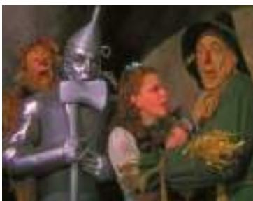

## 17-2c Menu Costs

Most firms do not change the prices of their products every day. Instead, firms often announce prices and leave them unchanged for weeks, months, or even years. One survey found that the typical U.S. firm changes its prices about once a year.

Firms change prices infrequently because there are costs to changing prices. Costs of price adjustment are called menu costs, a term derived from a restaurant’s cost of printing a new menu. Menu costs include the costs of deciding on new prices, printing new price lists and catalogs, sending these new price lists and catalogs to dealers and customers, advertising the new prices, and even dealing with customer annoyance over price changes.

Inflation increases the menu costs that firms must bear. In the current U.S. economy, with its low inflation rate, annual price adjustment is an appropriate business strategy for many firms. But when high inflation makes firms’ costs rise rapidly, annual price adjustment is impractical. During hyperinflations, for example, firms must change their prices daily or even more often just to keep up with all the other prices in the economy.

## 17-2d Relative-Price Variability and the Misallocation of Resources

Suppose that the Eatabit Eatery prints a new menu with new prices every January and then leaves its prices unchanged for the rest of the year. If there is no inflation, Eatabit’s relative prices—the prices of its meals compared to other prices in the economy—would be constant over the course of the year. By contrast, if the inflation rate is 12 percent per year, Eatabit’s relative prices will automatically fall by 1 percent each month. The restaurant’s relative prices will be high in the early months of the year, just after it has printed a new menu, and low in the later months. And the higher the inflation rate, the greater is this automatic variability. Thus, because prices change only once in a while, inflation causes relative prices to vary more than they otherwise would.

Why does this matter? The reason is that market economies rely on relative prices to allocate scarce resources. Consumers decide what to buy by comparing the quality and prices of various goods and services. Through these decisions, they determine how the scarce factors of production are allocated among industries and firms. When inflation distorts relative prices, consumer decisions are distorted and markets are less able to allocate resources to their best use.

## 17-2e Inflation-Induced Tax Distortions

Almost all taxes distort incentives, cause people to alter their behavior, and lead to a less efficient allocation of the economy’s resources. Many taxes, however, become even more problematic in the presence of inflation. The reason is that lawmakers often fail to take inflation into account when writing the tax laws. Economists who have studied the tax code conclude that inflation tends to raise the tax burden on income earned from savings.

One example of how inflation discourages saving is the tax treatment of capital gains—the profits made by selling an asset for more than its purchase price. Suppose that in 1988 you used some of your savings to buy stock in IBM for \$30 and that in 2016 you sold the stock for \$130. According to the tax law, you have earned a capital gain of \$100, which you must include in your income when computing how much income tax you owe. But because the overall price level doubled from 1988 to 2016, the \$30 you invested in 1988 is equivalent (in terms of purchasing power) to \$60 in 2016. When you sell your stock for \$130, you have a real gain (an increase in purchasing power) of only \$70. The tax code, however, does not take account of inflation and assesses you a tax on a gain of \$100. Thus, inflation exaggerates the size of capital gains and inadvertently increases the tax burden on this type of income.

Another example is the tax treatment of interest income. The income tax treats the nominal interest earned on savings as income, even though part of the nominal interest rate merely compensates for inflation. To see the effects of this policy, consider the numerical example in Table 1. The table compares two economies, both of which tax interest income at a rate of 25 percent. In Economy A, inflation is zero and the nominal and real interest rates are both 4 percent. In this case, the 25 percent tax on interest income reduces the real interest rate from 4 percent to 3 percent. In Economy B, the real interest rate is again 4 percent but the inflation rate is 8 percent. As a result of the Fisher effect, the nominal interest rate is 12 percent. Because the income tax treats this entire 12 percent interest as income, the government takes 25 percent of it, leaving an after-tax nominal interest rate of only 9 percent and an after-tax real interest rate of only 1 percent. In this case, the 25 percent tax on interest income reduces the real interest rate from 4 percent to 1 percent. Because the after-tax real interest rate provides the incentive to save, saving is much less attractive in the economy with inflation (Economy B) than in the economy with stable prices (Economy A).

The taxes on nominal capital gains and on nominal interest income are two examples of how the tax code interacts with inflation. There are many others. Because of these inflation-induced tax changes, higher inflation tends to

## TABLE 1

How Inflation Raises the Tax Burden on Saving In the presence of zero inflation, a 25 percent tax on interest income reduces the real interest rate from 4 percent to 3 percent. In the presence of 8 percent inflation, the same tax reduces the real interest rate from 4 percent to 1 percent.

<table><tr><td></td><td>Economy A(price stability)</td><td>Economy B(inflation)</td></tr><tr><td>Real interest rate</td><td>4%</td><td>4%</td></tr><tr><td>Inflation rate</td><td>0</td><td>8</td></tr><tr><td>Nominal interest rate(real interest rate + inflation rate)</td><td>4</td><td>12</td></tr><tr><td>Reduced interest due to 25 percent tax(0.25 × nominal interest rate)</td><td>1</td><td>3</td></tr><tr><td>After-tax nominal interest rate(0.75 × nominal interest rate)</td><td>3</td><td>9</td></tr><tr><td>After-tax real interest rate(after-tax nominal interest rate – inflation rate)</td><td>3</td><td>1</td></tr></table>

discourage people from saving. Recall that the economy’s saving provides the resources for investment, which in turn is a key ingredient to long-run economic growth. Thus, when inflation raises the tax burden on saving, it tends to depress the economy’s long-run growth rate. There is, however, no consensus among economists about the size of this effect.

One solution to this problem, other than eliminating inflation, is to index the tax system. That is, the tax laws could be rewritten to take account of the effects of inflation. In the case of capital gains, for example, the tax code could adjust the purchase price using a price index and assess the tax only on the real gain. In the case of interest income, the government could tax only real interest income by excluding that portion of the interest income that merely compensates for inflation. To some extent, the tax laws have moved in the direction of indexation. For example, the income levels at which income tax rates change are adjusted automatically each year based on changes in the consumer price index. Yet many other aspects of the tax laws—such as the tax treatment of capital gains and interest income—are not indexed.

In an ideal world, the tax laws would be written so that inflation would not alter anyone’s real tax liability. In the real world, however, tax laws are far from perfect. More complete indexation would probably be desirable, but it would further complicate a tax code that many people already consider too complex.

## 17-2f Confusion and Inconvenience

Imagine that we took a poll and asked people the following question: “This year the yard is 36 inches. How long do you think it should be next year?” Assuming we could get people to take us seriously, they would tell us that the yard should stay the same length—36 inches. Anything else would just complicate life needlessly.

What does this finding have to do with inflation? Recall that money, as the economy’s unit of account, is what we use to quote prices and record debts. In other words, money is the yardstick with which we measure economic transactions. The job of the Federal Reserve is a bit like the job of the Bureau of

Standards—to ensure the reliability of a commonly used unit of measurement. When the Fed increases the money supply and creates inflation, it erodes the real value of the unit of account.

It is difficult to judge the costs of the confusion and inconvenience that arise from inflation. Earlier, we discussed how the tax code incorrectly measures real incomes in the presence of inflation. Similarly, accountants incorrectly measure firms’ earnings when prices are rising over time. Because inflation causes dollars at different times to have different real values, computing a firm’s profit—the difference between its revenue and costs—is more complicated in an economy with inflation. Therefore, to some extent, inflation makes investors less able to sort successful from unsuccessful firms, which in turn impedes financial markets in their role of allocating the economy’s saving to alternative types of investment.

## 17-2g A Special Cost of Unexpected Inflation: Arbitrary Redistributions of Wealth

So far, the costs of inflation we have discussed occur even if inflation is steady and predictable. Inflation has an additional cost, however, when it comes as a surprise. Unexpected inflation redistributes wealth among the population in a way that has nothing to do with either merit or need. These redistributions occur because many loans in the economy are specified in terms of the unit of account—money.

Consider an example. Suppose that Sam Student takes out a \$20,000 loan at a 7 percent interest rate from Bigbank to attend college. In 10 years, the loan will come due. After his debt has compounded for 10 years at 7 percent, Sam will owe Bigbank \$40,000. The real value of this debt will depend on inflation over the decade. If Sam is lucky, the economy will have a hyperinflation. In this case, wages and prices will rise so high that Sam will be able to pay the \$40,000 debt out of pocket change. By contrast, if the economy goes through a major deflation, then wages and prices will fall, and Sam will find the \$40,000 debt a greater burden than he anticipated.

This example shows that unexpected changes in prices redistribute wealth among debtors and creditors. A hyperinflation enriches Sam at the expense of Bigbank because it diminishes the real value of the debt; Sam can repay the loan in dollars that are less valuable than he anticipated. Deflation enriches Bigbank at Sam’s expense because it increases the real value of the debt; in this case, Sam has to repay the loan in dollars that are more valuable than he anticipated. If inflation were predictable, then Bigbank and Sam could take inflation into account when setting the nominal interest rate. (Recall the Fisher effect.) But if inflation is hard to predict, it imposes risk on Sam and Bigbank that both would prefer to avoid.

This cost of unexpected inflation is important to consider together with another fact: Inflation is especially volatile and uncertain when the average rate of inflation is high. This is seen most simply by examining the experience of different countries. Countries with low average inflation, such as Germany in the late 20th century, tend to have stable inflation. Countries with high average inflation, such as many countries in Latin America, tend to have unstable inflation. There are no known examples of economies with high, stable inflation. This relationship between the level and volatility of inflation points to another cost of inflation. If a country pursues a high-inflation monetary policy, it will have to bear not only the costs of high expected inflation but also the arbitrary redistributions of wealth associated with unexpected inflation.

## 17-2h Inflation Is Bad, but Deflation May Be Worse

In recent U.S. history, inflation has been the norm. But the level of prices has fallen at times, such as during the late 19th century and early 1930s. From 1998 to 2012, Japan experienced a 4-percent decline in its overall price level. So as we conclude our discussion of the costs of inflation, we should briefly consider the costs of deflation as well.

Some economists have suggested that a small and predictable amount of deflation may be desirable. Milton Friedman pointed out that deflation would lower the nominal interest rate (via the Fisher effect) and that a lower nominal interest rate would reduce the cost of holding money. The shoeleather costs of holding money would, he argued, be minimized by a nominal interest rate close to zero, which in turn would require deflation equal to the real interest rate. This prescription for moderate deflation is called the Friedman rule.

Yet there are also costs of deflation. Some of these mirror the costs of inflation. For example, just as a rising price level induces menu costs and relative-price variability, so does a falling price level. Moreover, in practice, deflation is rarely as steady and predictable as Friedman recommended. More often, it comes as a surprise, resulting in the redistribution of wealth toward creditors and away from debtors. Because debtors are often poorer, these redistributions in wealth are particularly painful.

Perhaps most important, deflation often arises because of broader macroeconomic difficulties. As we will see in future chapters, falling prices result when some event, such as a monetary contraction, reduces the overall demand for goods and services in the economy. This fall in aggregate demand can lead to falling incomes and rising unemployment. In other words, deflation is often a symptom of deeper economic problems.

## THE WIZARD OF OZ AND THE FREE-SILVER DEBATE

CASE As a child, you probably saw the movie The Wizard of Oz, based on a STUDY children’s book written in 1900. The movie and book tell the story of a young girl, Dorothy, who finds herself lost in a strange land far from home. You probably did not know, however, that some scholars believe that the story is actually an allegory about U.S. monetary policy in the late 19th century.

From 1880 to 1896, the price level in the U.S. economy fell by 23 percent. Because this event was unanticipated, it led to a major redistribution of wealth. Most farmers in the western part of the country were debtors. Their creditors were the bankers in the east. When the price level fell, it caused the real value of these debts to rise, which enriched the banks at the expense of the farmers.

According to Populist politicians of the time, the solution to the farmers’ problem was the free coinage of silver. During this period, the United States was operating with a gold standard. The quantity of gold determined the money supply and, thereby, the price level. The free-silver advocates wanted silver, as well as gold, to be used as money. If adopted, this proposal would have increased the money supply, pushed up the price level, and reduced the real burden of the farmers’ debts.

The debate over silver was heated, and it was central to the politics of the 1890s. A common election slogan of the Populists was “We Are Mortgaged. All but Our Votes.” One prominent advocate of free silver was William Jennings Bryan, the Democratic nominee for president in 1896. He is remembered in part for a speech at the Democratic Party’s nominating convention in which he said, “You shall not press down upon the brow of labor this crown of thorns. You shall not crucify mankind upon a cross of gold.” Rarely since then have politicians waxed so poetic about alternative approaches to monetary policy. Nonetheless, Bryan lost the election to Republican William McKinley, and the United States remained on the gold standard.

L. Frank Baum, author of the book The Wonderful Wizard of Oz, was a midwestern journalist. When he sat down to write a story for children, he made the characters represent protagonists in the major political battle of his time. Here is how economic historian Hugh Rockoff, writing in the Journal of Political Economy in 1990, interprets the story:

Dorothy: Traditional American values

Toto: Prohibitionist party, also called the Teetotalers

Scarecrow: Farmers

Tin Woodsman: Industrial workers

Cowardly Lion: William Jennings Bryan

Munchkins: Citizens of the East

Wicked Witch of the East: Grover Cleveland

Wicked Witch of the West: William McKinley

Wizard: Marcus Alonzo Hanna, chairman of the

Republican Party

Oz: Abbreviation for ounce of gold

Yellow Brick Road: Gold standard

At the end of Baum’s story, Dorothy does find her way home, but it is not by just following the yellow brick road. After a long and perilous journey, she learns that the wizard is incapable of helping her or her friends. Instead, Dorothy finally discovers the magical power of her silver slippers. (When the book was made into a movie in 1939, Dorothy’s slippers were changed from silver to ruby. The Hollywood filmmakers were more interested in showing off the new technology of Technicolor than in telling a story about 19th-century monetary policy.)

MGM / THEKOBAL COLLECTION/PICTURE DESK

The Populists lost the debate over the free coinage of silver, but they eventually got the monetary expansion and inflation that they wanted. In 1898, prospectors discovered gold near the Klondike River in the Canadian Yukon. Increased supplies of gold also arrived from the mines of South Africa. As a result, the money supply and the price level started to rise in the United States and in other countries operating on the gold standard. Within 15 years, prices in the United States were back to the levels that had prevailed in the 1880s, and farmers were better able to handle their debts. ●

  
An early debate over monetary policy

QuickQuiz

List and describe six costs of inflation.

## 17-3 Conclusion

This chapter discussed the causes and costs of inflation. The primary cause of inflation is growth in the quantity of money. When the central bank creates money in large quantities, the value of money falls quickly. To maintain stable prices, the central bank must maintain strict control over the money supply.

The costs of inflation are more subtle. They include shoeleather costs, menu costs, increased variability of relative prices, unintended changes in tax liabilities, confusion and inconvenience, and arbitrary redistributions of wealth. Are these costs, in total, large or small? All economists agree that they become huge during hyperinflation. But during periods of moderate inflation—when prices rise by less than 10 percent per year—the size of these costs is more open to debate.

This chapter presented many of the most important lessons about inflation, but the analysis is incomplete. When the central bank reduces the rate of money growth, prices rise less rapidly, as the quantity theory suggests. Yet as the economy makes the transition to the lower inflation rate, the change in monetary policy will likely disrupt production and employment. That is, even though monetary policy is neutral in the long run, it has profound effects on real variables in the short run. Later in this book we will examine the reasons for short-run monetary nonneutrality to enhance our understanding of the causes and effects of inflation.

## CHAPTER QuickQuiz

1. The classical principle of monetary neutrality states that changes in the money supply do not influence variables and is thought most applicable in the run. a. nominal, short b. nominal, long c. real, short d. real, long

2. If nominal GDP is \$400, real GDP is \$200, and the money supply is \$100, then a. the price level is ½, and velocity is 2. b. the price level is ½, and velocity is 4. c. the price level is 2, and velocity is 2. d. the price level is 2, and velocity is 4.

3. According to the quantity theory of money, which variable in the quantity equation is most stable over long periods of time? a. money b. velocity c. price level d. output

4. Hyperinflations occur when the government runs a large budget , which the central bank finances with a substantial monetary a. deficit, contraction b. deficit, expansion c. surplus, contraction d. surplus, expansion

5. According to the quantity theory of money and the Fisher effect, if the central bank increases the rate of money growth,

a. inflation and the nominal interest rate both increase.

b. inflation and the real interest rate both increase.

c. the nominal interest rate and the real interest rate both increase.

d. inflation, the real interest rate, and the nominal interest rate all increase.

6. If an economy always has inflation of 10 percent per year, which of the following costs of inflation will it NOT suffer?

a. shoeleather costs from reduced holdings of money b. menu costs from more frequent price adjustment c. distortions from the taxation of nominal capital gains

d. arbitrary redistributions between debtors and creditors

## SUMMARY

The overall level of prices in an economy adjusts to bring money supply and money demand into balance. When the central bank increases the supply of money, it causes the price level to rise. Persistent growth in the quantity of money supplied leads to continuing inflation.

The principle of monetary neutrality asserts that changes in the quantity of money influence nominal variables but not real variables. Most economists believe that monetary neutrality approximately describes the behavior of the economy in the long run.

A government can pay for some of its spending simply by printing money. When countries rely heavily on this “inflation tax,” the result is hyperinflation.

One application of the principle of monetary neutrality is the Fisher effect. According to the Fisher effect, when the inflation rate rises, the nominal interest rate rises by the same amount so that the real interest rate remains the same.

Many people think that inflation makes them poorer because it raises the cost of what they buy. This view is a fallacy, however, because inflation also raises nominal incomes.

Economists have identified six costs of inflation: shoeleather costs associated with reduced money holdings, menu costs associated with more frequent adjustment of prices, increased variability of relative prices, unintended changes in tax liabilities due to nonindexation of the tax code, confusion and inconvenience resulting from a changing unit of account, and arbitrary redistributions of wealth between debtors and creditors. Many of these costs are large during hyperinflation, but the size of these costs for moderate inflation is less clear.

## KEY CONCEPTS

quantity theory of money, p. 347 nominal variables, p. 349 real variables, p. 349 classical dichotomy, p. 349

monetary neutrality, p. 350 velocity of money, p. 350 quantity equation, p. 351 inflation tax, p. 353

Fisher effect, p. 355 shoeleather costs, p. 357 menu costs, p. 358

## QUESTIONS FOR REVIEW

1. Explain how an increase in the price level affects the real value of money.

2. According to the quantity theory of money, what is the effect of an increase in the quantity of money?

3. Explain the difference between nominal and real variables and give two examples of each. According to the principle of monetary neutrality, which variables are affected by changes in the quantity of money?

4. In what sense is inflation like a tax? How does thinking about inflation as a tax help explain hyperinflation?

5. According to the Fisher effect, how does an increase in the inflation rate affect the real interest rate and the nominal interest rate?

6. What are the costs of inflation? Which of these costs do you think are most important for the U.S. economy?

7. If inflation is less than expected, who benefits— debtors or creditors? Explain.

## PROBLEMS AND APPLICATIONS

1. Suppose that this year’s money supply is \$500 billion, nominal GDP is \$10 trillion, and real GDP is \$5 trillion.

a. What is the price level? What is the velocity of money?

b. Suppose that velocity is constant and the economy’s output of goods and services rises by 5 percent each year. What will happen to nominal

GDP and the price level next year if the Fed keeps the money supply constant?

c. What money supply should the Fed set next year if it wants to keep the price level stable?

d. What money supply should the Fed set next year if it wants inflation of 10 percent?

2. Suppose that changes in bank regulations expand the availability of credit cards so that people need to hold less cash.

a. How does this event affect the demand for money?

b. If the Fed does not respond to this event, what will happen to the price level?

c. If the Fed wants to keep the price level stable, what should it do?

3. It is sometimes suggested that the Federal Reserve should try to achieve zero inflation. If we assume that velocity is constant, does this zero-inflation goal require that the rate of money growth equal zero? If yes, explain why. If no, explain what the rate of money growth should equal.

4. Suppose that a country’s inflation rate increases sharply. What happens to the inflation tax on the holders of money? Why is wealth that is held in savings accounts not subject to a change in the inflation tax? Can you think of any way holders of savings accounts are hurt by the increase in the inflation rate?

5. Let’s consider the effects of inflation in an economy composed of only two people: Bob, a bean farmer, and Rita, a rice farmer. Bob and Rita both always consume equal amounts of rice and beans. In 2016, the price of beans was \$1 and the price of rice was \$3.

a. Suppose that in 2017 the price of beans was \$2 and the price of rice was \$6. What was inflation? Was Bob better off, worse off, or unaffected by the changes in prices? What about Rita?

b. Now suppose that in 2017 the price of beans was \$2 and the price of rice was \$4. What was inflation? Was Bob better off, worse off, or unaffected by the changes in prices? What about Rita?

c. Finally, suppose that in 2017 the price of beans was \$2 and the price of rice was \$1.50. What was inflation? Was Bob better off, worse off, or unaffected by the changes in prices? What about Rita?

d. What matters more to Bob and Rita—the overall inflation rate or the relative price of rice and beans?

6. If the tax rate is 40 percent, compute the before-tax real interest rate and the after-tax real interest rate in each of the following cases.

a. The nominal interest rate is 10 percent, and the inflation rate is 5 percent.

b. The nominal interest rate is 6 percent, and the inflation rate is 2 percent.

c. The nominal interest rate is 4 percent, and the inflation rate is 1 percent.

7. Recall that money serves three functions in the economy. What are those functions? How does inflation affect the ability of money to serve each of these functions?

8. Suppose that people expect inflation to equal 3 percent, but in fact, prices rise by 5 percent. Describe how this unexpectedly high inflation rate would help or hurt the following:

a. the government

b. a homeowner with a fixed-rate mortgage

c. a union worker in the second year of a labor contract

d. a college that has invested some of its endowment in government bonds

9. Explain whether the following statements are true, false, or uncertain.

a. “Inflation hurts borrowers and helps lenders, because borrowers must pay a higher rate of interest.”

b. “If prices change in a way that leaves the overall price level unchanged, then no one is made better or worse off.”

c. “Inflation does not reduce the purchasing power of most workers.”

To find additional study resources, visit cengagebrain.com, and search for “Mankiw.”

PART VII
