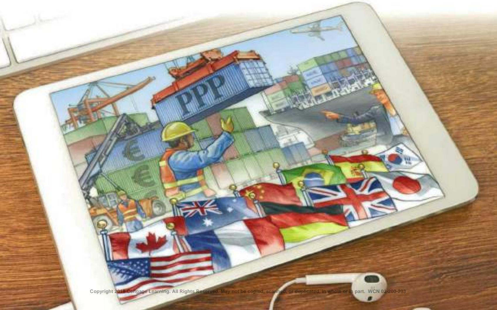
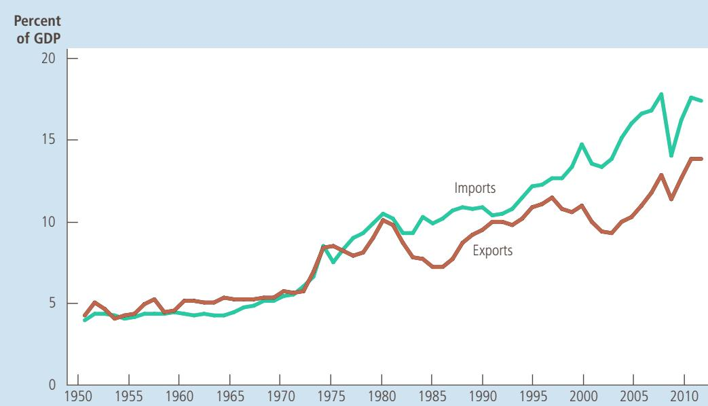

# The Macroeconomics of Open Economies

# Open-Economy Macroeconomics: Basic Concepts

When you decide to buy a car, you may compare the latest models offeredby Ford and Toyota. When you take your next vacation, you may consider by Ford and Toyota. When you take your next vacation, you may consider spending it on a beach in Florida or in Mexico. When you start saving for your retirement, you may choose between a mutual fund that buys stock in U.S. companies and one that buys stock in foreign companies. In all these cases, you are participating not just in the U.S. economy but also in economies around the world.

International trade yields clear benefits: Trade allows people to produce what they produce best and to consume the great variety of goods and services produced around the world. Indeed, one of the Ten Principles of Economics highlighted in Chapter 1 is that trade can make everyone better off. International trade can raise living standards in all countries by allowing each country to specialize in producing those goods and services in which it has a comparative advantage.

closed economy an economy that does not interact with other economies in the world

So far, our development of macroeconomics has largely ignored the economy’s interaction with other economies around the world. For most questions in macroeconomics, international issues are peripheral. For instance, when we discuss the natural rate of unemployment and the causes of inflation, the effects of international trade can safely be ignored. Indeed, to keep their models simple, macroeconomists often assume a closed economy—an economy that does not interact with other economies.

Yet when macroeconomists study an open economy—an economy that interacts freely with other economies around the world—they encounter a whole set of new issues. This chapter and the next provide an introduction to open-economy macroeconomics. We begin in this chapter by discussing the key macroeconomic variables that describe an open economy’s interactions in world markets. You may have noticed mention of these variables—exports, imports, the trade balance, and exchange rates—in the news. Our first job is to understand what these data mean. In the next chapter, we develop a model to explain how these variables are determined and how they are affected by various government policies.

## 18-1 The International Flows of Goods and Capital

exports goods and services that are produced domestically and sold abroad

## imports

goods and services that are produced abroad and sold domestically

## net exports

the value of a nation’s exports minus the value of its imports; also called the trade balance

## trade balance

the value of a nation’s exports minus the value of its imports; also called net exports

## trade surplus

an excess of exports over imports

trade deficit an excess of imports over exports

An open economy interacts with other economies in two ways: It buys and sells goods and services in world product markets, and it buys and sells capital assets such as stocks and bonds in world financial markets. Here we discuss these two activities and the close relationship between them.

## 18-1a The Flow of Goods: Exports, Imports, and Net Exports

Exports are domestically produced goods and services that are sold abroad, and imports are foreign-produced goods and services that are sold domestically. When Boeing, the U.S. aircraft manufacturer, builds a plane and sells it to Air France, the sale is an export for the United States and an import for France. When Volvo, the Swedish car manufacturer, makes a car and sells it to a U.S. resident, the sale is an import for the United States and an export for Sweden.

The net exports of any country are the difference between the value of its exports and the value of its imports:

Net exports 5 Value of country’s exports 2 Value of country’s imports.

The Boeing sale raises U.S. net exports, and the Volvo sale reduces U.S. net exports. Because net exports tell us whether a country is, in total, a seller or a buyer in world markets for goods and services, net exports are also called the trade balance. If net exports are positive, exports are greater than imports, indicating that the country sells more goods and services abroad than it buys from other countries. In this case, the country is said to run a trade surplus. If net exports are negative, exports are less than imports, indicating that the country sells fewer goods and services abroad than it buys from other countries. In this case, the country is said to run a trade deficit. If net exports are zero, its exports and imports are exactly equal, and the country is said to have balanced trade.

In the next chapter, we develop a theory that explains an economy’s trade balance, but even at this early stage, it is easy to think of many factors that might influence a country’s exports, imports, and net exports. Those factors include the following:

•	 The tastes of consumers for domestic and foreign goods

•	 The prices of goods at home and abroad

•	 The exchange rates at which people can use domestic currency to buy foreign currencies

•	 The incomes of consumers at home and abroad

•	 The cost of transporting goods from country to country

•	 Government policies toward international trade

As these variables change, so does the amount of international trade.

balanced trade a situation in which exports equal imports

  
COLLECTION/ WWW.CARTOONBANK.COM © MORT GERBERG/ THE NEW YORKER  
“But we’re not just talking about buying a car—we’re talking about confronting this country’s trade deficit with Japan.”

## THE INCREASING OPENNESS OF THE U.S. ECONOMY

CASE One dramatic change in the U.S. economy over the past six decades STUDY has been the increasing importance of international trade and finance. This change is illustrated in Figure 1, which shows the total value of goods and services exported to other countries and imported from other countries expressed as a percentage of gross domestic product. In the 1950s, imports and exports of goods and services were typically between 4 and 5 percent of GDP. In recent years, they have been about three times that level. The trading partners of the United States include a diverse group of countries. As of 2015, the largest trading partner, as measured by imports and exports combined, was China, followed by Canada, Mexico, Japan, Germany, South Korea, and the United Kingdom.

## FIGURE 1

## The Internationalization of the U.S. Economy

This figure shows exports and imports of the U.S. economy as a percentage of U.S. GDP since 1950. The substantial increases over time show the increasing importance of international trade and finance.

S o u rc e : U.S. Department of Commerce.

The increase in international trade over the past several decades is partly due to improvements in transportation. In 1950, the average merchant ship carried less than 10,000 tons of cargo; today, many ships carry more than 100,000 tons. The long-distance jet was introduced in 1958 and the wide-body jet in 1967, making air transport far cheaper than it had been previously. These developments allow goods that once had to be produced locally to be traded around the world. Cut flowers grown in Israel are flown to the United States to be sold. Fresh fruits and vegetables that can grow only in summer in the United States can now be consumed in winter as well because they can be shipped from countries in the Southern Hemisphere.

The increase in international trade has also been influenced by advances in telecommunications, which have allowed businesses to reach overseas customers more easily. For example, the first transatlantic telephone cable was not laid until 1956. As recently as 1966, the technology allowed only 138 simultaneous conversations between North America and Europe. Today, because e-mail is such a common form of business communication, it is almost as easy to communicate with a customer across the world as it is to communicate with one across town.

Technological progress has also fostered international trade by changing the kinds of goods that economies produce. When bulky raw materials (such as steel) and perishable goods (such as foodstuffs) were a large part of the world’s output,

IN THE NEWS
