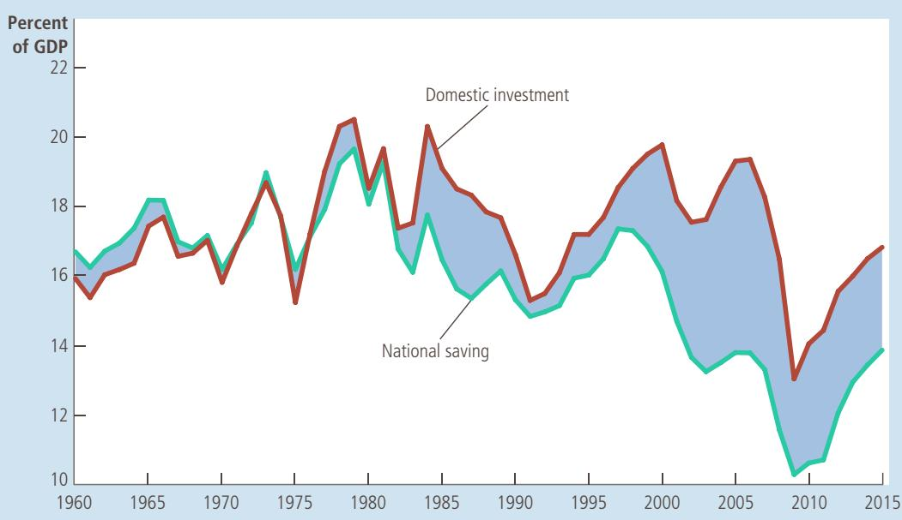
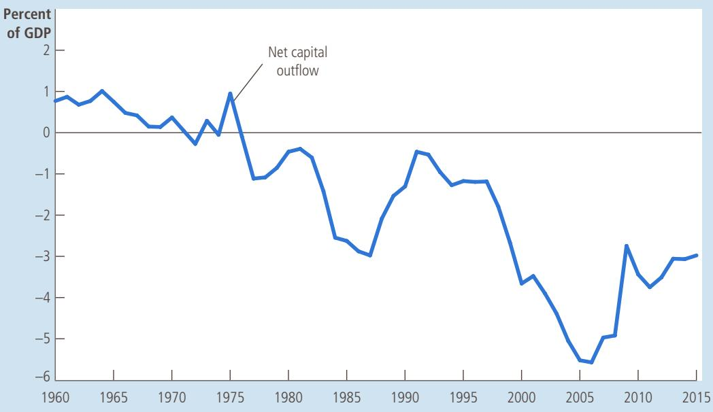
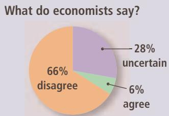
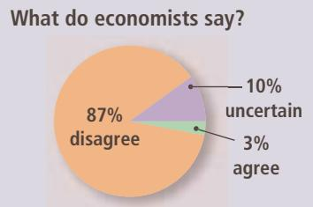
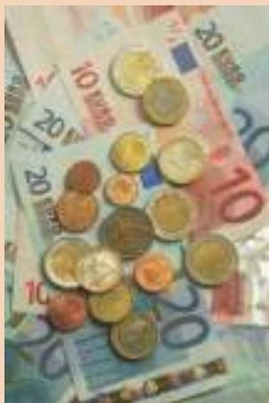

# The Complicated Politics of Trade Agreements

The political maneuvering over the Trans-Pacific Partnership in 2015 is a good example of how difficult ratifying a trade deal can be.

The Great Trans-Pacific Partnership Debate

By Doyle McManus

he White House released the text of its new trade deal, the Trans-Pacific Partnership, last week, and like any good citizen, I tried my best to read it. But the 12-country agreement is more than 2,700 pages long, plus annexes, and a lot of it sounds like this: “The parties shall at all times endeavor to agree on the interpretation and application of this agreement, and shall make every attempt through cooperation and consultations to arrive at a mutually satisfactory resolution.”

And that’s one of the lucid bits. Those members of Congress who say they’ve read the whole thing? They’re fibbing.

There are three ways a befuddled citizen can figure out what to think about a complex deal like the TPP.

The first is tribal: Listen for signals from the politicians you support and assume they’ve made the right decisions. But that’s not so easy when it comes to the TPP because the agreement divides both parties.

It’s no surprise that President Obama is strongly in favor of a deal he and his aides just finished negotiating. “It’s an agreement that puts American workers first and will help middle-class families get ahead,” he said. “It includes the strongest commitments on labor and the environment of any trade agreement in history.” The Democratic presidential candidates don’t agree. Bernie Sanders says the TPP is “even worse” than he expected. Hillary Rodham Clinton opposes it too, and hopes you’ll forget that she once called it “the gold standard” of trade deals.

Among Republicans, “establishment” candidates Jeb Bush and John Kasich support the agreement, as do Ben Carson and Marco Rubio. But Donald Trump and Ted Cruz have said they are opposed.

A second approach is to listen to what interested parties say and choose sides based on where your sympathies lie.

Manufacturing workers and their unions think another free-trade deal will inevitably hurt them. The last half-century of globalization has coincided with a massive loss of blue-collar jobs; not all of the erosion was due to trade, but to labor, the TPP looks like more of the same. “A bad deal for American workers,” AFL-CIO President Richard Trumka said.

Environmentalists are condemning the deal too, mostly because it doesn’t crack

transporting goods was often costly and sometimes impossible. By contrast, goods produced with modern technology are often light and easy to transport. Consumer electronics, for instance, have low weight for every dollar of value, which makes them easy to produce in one country and sell in another. An even more extreme example is the film industry. Once a studio in Hollywood makes a movie, it can send copies of the film around the world at almost zero cost. And indeed, movies are a major export of the United States.

Governments’ trade policies have also been a factor in increasing international trade. As we discussed earlier in this book, economists have long believed that free trade between countries is mutually beneficial. Over time, most policymakers around the world have come to accept these conclusions. International agreements, such as the North American Free Trade Agreement (NAFTA) and the General Agreement on Tariffs and Trade (GATT), have gradually lowered tariffs, import quotas, and other trade barriers. As this book was going to press, the United States was debating whether to ratify a new trade agreement—the Trans-Pacific Partnership—which President Obama’s representatives had negotiated with eleven other Pacific Rim nations. (See the accompanying In the News box.) Thus, the pattern of increasing trade illustrated in Figure 1 is a phenomenon that most economists and policymakers endorse and encourage.

down on climate change. But this is, after all, a trade deal; talks on global warming are already underway.

Big business is mostly in favor of the deal, although not universally so. Tobacco companies are unhappy that it deprives them of the right to sue countries that restrict trade by limiting cigarette sales. Pharmaceutical companies complain that they aren’t getting enough protection for their patents. (Doctors Without Borders thinks they are getting too much.)

Hollywood, Silicon Valley and agribusiness mostly like the deal, which protects entertainment copyrights, eases the flow of data across borders and opens doors for U.S. exports of meat and rice to Asia. California would reap benefits that the Rust Belt won’t see.

Now for the final, labor-intensive approach: Listen to smart people who don’t have a vested interest but are trying to analyze the deal in a comprehensive way.

For a start, I consulted with Joseph A. Massey, a former U.S. trade negotiator with China and Japan who has served as an advisor to Republicans and Democrats.

Massey made three points.

First, he said, the TPP’s impact has probably been oversold. “It has benefits for U.S. export industries, but I think they’re modest,” he said. “It’s clearly good for the entertainment and tech sectors. But it’s not revolutionary.”

Second, he said, the biggest threat to jobs in the United States isn’t free-trade agreements; it’s domestic policy. “We’ve neglected our own manufacturing sector,” he said. “Germany is a party to trade agreements too, but they’ve done a much better job at maintaining a skilled blue-collar workforce. We need more incentives for companies to invest here, employ American workers and invest in their training.”

Third, he noted, the TPP isn’t only about trade. It’s also about economic reform, higher labor standards and environmental protection in developing countries such as Vietnam and Malaysia. And it’s a way to knit countries on the Pacific Rim into a trading system that the United States helped design instead of one run by Asia’s growing power, China.

Obama hasn’t been subtle about pushing that geopolitical argument. “If we don’t pass this agreement—if America doesn’t write those rules—then countries like China will,” he said last week.

To foreign policy strategists, that’s a compelling pitch. To American workers, it’s not.

So are we better off with or without the TPP? If Congress ratifies it, that won’t turbocharge the U.S. economy. If Congress blocks the deal, that won’t stop globalization. And like any trade agreement, it creates winners and losers.

One political lesson is clear: The bipartisan consensus that enabled Bill Clinton and George W. Bush to pass trade agreements has broken down, mostly because, to many Americans, their costs have been clearer than their benefits.

To win Congress’ approval of the deal— an important part of Obama’s second-term agenda and his legacy—the president still has a lot of persuading to do. ■

Source: Los Angeles Times, November 8, 2015.

## 18-1b The Flow of Financial Resources: Net Capital Outflow

So far, we discussed how residents of an open economy participate in world markets for goods and services. In addition, residents of an open economy participate in world financial markets. A U.S. resident with \$25,000 could use that money to buy a car from Toyota or, instead, to buy stock in the Toyota Corporation. The first transaction would represent a flow of goods, whereas the second would represent a flow of capital.

The term net capital outflow refers to the difference between the purchase of foreign assets by domestic residents and the purchase of domestic assets by foreigners:

$$
\begin{array}{r l} \text {Net capital outflow} & = \text {Purchase of foreign assets by domestic residents} \\ & \quad - \text {Purchase of domestic assets by foreigners.} \end{array}
$$

When a U.S. resident buys stock in Petrobras, the Brazilian energy company, the purchase increases the first term on the right side of this equation and, therefore, increases U.S. net capital outflow. When a Japanese resident buys a bond issued by the U.S. government, the purchase increases the second term on the right side of this equation and, therefore, decreases U.S. net capital outflow.

The flow of capital between the U.S. economy and the rest of the world takes two forms. If McDonald’s opens up a fast-food outlet in Russia, that is an example of foreign direct investment. Alternatively, if an American buys stock in a Russian corporation, that is an example of foreign portfolio investment. In the first case, the American owner (McDonald’s Corporation) actively manages the investment, whereas in the second case, the American owner (the stockholder) has a more passive role. In both cases, U.S. residents are buying assets located in another country, so both purchases increase U.S. net capital outflow.

The net capital outflow (sometimes called net foreign investment) can be either positive or negative. When it is positive, domestic residents are buying more foreign assets than foreigners are buying domestic assets. Capital is said to be flowing out of the country. When the net capital outflow is negative, domestic residents are buying less foreign assets than foreigners are buying domestic assets. Capital is said to be flowing into the country. That is, when net capital outflow is negative, a country is experiencing a capital inflow.

We develop a theory to explain net capital outflow in the next chapter. Here let’s consider briefly some of the more important variables that influence net capital outflow:

•	 The real interest rates paid on foreign assets

•	 The real interest rates paid on domestic assets

•	 The perceived economic and political risks of holding assets abroad

•	 The government policies that affect foreign ownership of domestic assets

For example, consider U.S. investors deciding whether to buy Mexican government bonds or U.S. government bonds. (Recall that a bond is, in effect, an IOU of the issuer.) To make this decision, U.S. investors compare the real interest rates offered on the two bonds. The higher a bond’s real interest rate, the more attractive it is. While making this comparison, however, U.S. investors must also take into account the risk that one of these governments might default on its debt (that is, not pay interest or principal when it is due), as well as any restrictions that the Mexican government has imposed, or might impose in the future, on foreign investors in Mexico.

## 18-1c The Equality of Net Exports and Net Capital Outflow

We have seen that an open economy interacts with the rest of the world in two ways—in world markets for goods and services and in world financial markets. Net exports and net capital outflow each measure a type of imbalance in these markets. Net exports measure an imbalance between a country’s exports and its imports. Net capital outflow measures an imbalance between the amount of foreign assets bought by domestic residents and the amount of domestic assets bought by foreigners.

An important but subtle fact of accounting states that, for an economy as a whole, net capital outflow (NCO) must always equal net exports (NX):

$$
N C O = N X.
$$

This equation holds because every transaction that affects one side of this equation affects the other side by exactly the same amount. This equation is an identity—an equation that must hold because of how the variables in the equation are defined and measured.

To see why this accounting identity is true, let’s consider an example. Imagine that you are a computer programmer residing in the United States. One day, you write some software and sell it to a Japanese consumer for 10,000 yen. The sale of software is an export of the United States, so it increases U.S. net exports. What else happens to ensure that this identity holds? The answer depends on what you do with the 10,000 yen you are paid.

First, let’s suppose that you simply stuff the yen in your mattress. (We might say you have a yen for yen.) In this case, you are using some of your income to invest in the Japanese economy. That is, a domestic resident (you) has acquired a foreign asset (the Japanese currency). The increase in U.S. net exports is matched by an increase in the U.S. net capital outflow.

More realistically, however, if you want to invest in the Japanese economy, you won’t do so by holding on to Japanese currency. More likely, you would use the 10,000 yen to buy stock in a Japanese corporation, or you might buy a Japanese government bond. Yet the result of your decision is much the same: A domestic resident ends up acquiring a foreign asset. The increase in U.S. net capital outflow (the purchase of the Japanese stock or bond) exactly equals the increase in U.S. net exports (the sale of software).

Let’s now change the example. Suppose that instead of using the 10,000 yen to buy a Japanese asset, you use them to buy a good made in Japan, such as a Sony TV. As a result of the TV purchase, U.S. imports increase. Together, the software export and the TV import represent balanced trade. Because exports and imports increase by the same amount, net exports are unchanged. In this case, no American ends up acquiring a foreign asset and no foreigner ends up acquiring a U.S. asset, so there is also no impact on U.S. net capital outflow.

A final possibility is that you go to a local bank to exchange your 10,000 yen for U.S. dollars. But this doesn’t change the situation because the bank now has to do something with the 10,000 yen. It can buy Japanese assets (a U.S. net capital outflow); it can buy a Japanese good (a U.S. import); or it can sell the yen to another American who wants to make such a transaction. In the end, U.S. net exports must equal U.S. net capital outflow.

This example all started when a U.S. programmer sold some software abroad, but the story is much the same when Americans buy goods and services from other countries. For example, if Walmart buys \$50 million of clothing from China and sells it to American consumers, something must happen to that \$50 million. One possibility is that China could use the \$50 million to invest in the U.S. economy. This capital inflow from China might take the form of Chinese purchases of U.S. government bonds. In this case, the purchase of the clothing reduces U.S. net exports, and the sale of bonds reduces U.S. net capital outflow. Alternatively, China could use the \$50 million to buy a plane from Boeing, the U.S. aircraft manufacturer. In this case, the U.S. import of clothing balances the U.S. export of aircraft, so net exports and net capital outflow are both unchanged. In all cases, the transactions have the same effect on net exports and net capital outflow.

We can summarize these conclusions for the economy as a whole.

•	 When a nation is running a trade surplus $( N X > 0 ) .$ , it is selling more goods and services to foreigners than it is buying from them. What is it doing with the foreign currency it receives from the net sale of goods and services abroad? It must be using it to buy foreign assets. Capital is flowing out of the country $( N C O > 0 )$

•	 When a nation is running a trade deficit (NX , 0), it is buying more goods and services from foreigners than it is selling to them. How is it financing the net purchase of these goods and services in world markets? It must be selling assets abroad. Capital is flowing into the country $( N C O < 0 )$

The international flow of goods and services and the international flow of capital are two sides of the same coin.

## 18-1d Saving, Investment, and Their Relationship to the International Flows

A nation’s saving and investment are crucial to its long-run economic growth. As we saw in an earlier chapter, saving and investment are equal in a closed economy. But matters are not as simple in an open economy. Let’s now consider how saving and investment are related to the international flows of goods and capital as measured by net exports and net capital outflow.

As you may recall, the term net exports appeared earlier in the book when we discussed the components of gross domestic product. The economy’s GDP (denoted Y) is divided among four components: consumption (C), investment (I), government purchases (G), and net exports (NX). We write this as

$$
Y = C + I + G + N X.
$$

Total expenditure on the economy’s output of goods and services is the sum of expenditure on consumption, investment, government purchases, and net exports. Because each dollar of expenditure is placed into one of these four components, this equation is an accounting identity: It must be true because of the way the variables are defined and measured.

Recall that national saving is the income of the nation that is left after paying for current consumption and government purchases. National saving (S) equals $Y - C - G$ . If we rearrange the equation to reflect this fact, we obtain

$$
\begin{array}{c} Y - C - G = I + N X \\ S = I + N X. \end{array}
$$

Because net exports (NX) also equal net capital outflow (NCO), we can write this equation as

$$
\begin{array}{c} S = \quad I \quad + \quad N C O \\ \text {Saving} = \frac {\text {Domestic}}{\text {investment}} + \frac {\text {Net capital}}{\text {outflow}}. \end{array}
$$

This equation shows that a nation’s saving must equal its domestic investment plus its net capital outflow. In other words, when a U.S. citizen saves a dollar of her income for the future, that dollar can be used to finance the accumulation of domestic capital or it can be used to finance the purchase of foreign capital.

This equation should look somewhat familiar. Earlier in the book, when we analyzed the role of the financial system, we considered this identity for the special case of a closed economy. In a closed economy, net capital outflow is zero $( \bar { N } C O = 0 )$ , so saving equals investment $( S = I )$ . By contrast, an open economy has two uses for its saving: domestic investment and net capital outflow.

As before, we can view the financial system as standing between the two sides of this identity. For example, suppose the Garcia family decides to save some of its income for retirement. This decision contributes to national saving, the left side of our equation. If the Garcias deposit their saving in a mutual fund, the mutual fund may use some of the deposit to buy stock issued by General Motors, which uses the proceeds to build a factory in Ohio. In addition, the mutual fund may use some of the Garcias’ deposit to buy stock issued by Toyota, which uses the proceeds to build a factory in Osaka. These transactions show up on the right side of the equation. From the standpoint of U.S. accounting, the General Motors expenditure on a new factory is domestic investment, and the purchase of Toyota stock by a U.S. resident is net capital outflow. Thus, all saving in the U.S. economy shows up as investment in the U.S. economy or as U.S. net capital outflow.

The bottom line is that saving, investment, and international capital flows are inextricably linked. When a nation’s saving exceeds its domestic investment, its net capital outflow is positive, indicating that the nation is using some of its saving to buy assets abroad. When a nation’s domestic investment exceeds its saving, its net capital outflow is negative, indicating that foreigners are financing some of this investment by purchasing domestic assets.

## 18-1e Summing Up

Table 1 summarizes many of the ideas presented so far in this chapter. It describes the three possibilities for an open economy: a country with a trade deficit, a country with balanced trade, and a country with a trade surplus.

Consider first a country with a trade surplus. By definition, a trade surplus means that the value of exports exceeds the value of imports. Because net exports are exports minus imports, net exports, NX, are positive. As a result, income, $\boldsymbol { Y } = \boldsymbol { C } ^ { \mathrm { ~ } } + \boldsymbol { I } + \boldsymbol { G } + \boldsymbol { N } \boldsymbol { X } ,$ , must be greater than domestic spending, $C + I + G$ . But if income, Y, is more than spending, $C + I + G ,$ then saving, $S = { \check { Y } } - C - G ,$ must be more than investment, I. Because the country is saving more than it is investing, it must be sending some of its saving abroad. That is, the net capital outflow must be positive.

Similar logic applies to a country with a trade deficit (such as the U.S. economy in recent years). By definition, a trade deficit means that the value of exports is less than the value of imports. Because net exports are exports minus imports, net exports, NX, are negative. Thus, income, $Y \overset { \cdot } { = } C + I + G \overset { \cdot } { + } N X ,$ , must be less than

## TABLE 1

International Flows of Goods and Capital: Summary This table shows the three possible outcomes for an open economy.

<table><tr><td>Trade Deficit</td><td>Balanced Trade</td><td>Trade Surplus</td></tr><tr><td>Exports &lt; Imports</td><td>Exports = Imports</td><td>Exports &gt; Imports</td></tr><tr><td>Net Exports &lt; 0</td><td>Net Exports = 0</td><td>Net Exports &gt; 0</td></tr><tr><td> $Y < C + I + G$ </td><td> $Y = C + I + G$ </td><td> $Y > C + I + G$ </td></tr><tr><td>Saving &lt; Investment</td><td>Saving = Investment</td><td>Saving &gt; Investment</td></tr><tr><td>Net Capital Outflow &lt; 0</td><td>Net Capital Outflow = 0</td><td>Net Capital Outflow &gt; 0</td></tr></table>

domestic spending, $C + I + G$ . But if income, Y, is less than spending, $C + I + G ,$ then saving, $S = { \check { Y } } - C - G ,$ , must be less than investment, I. Because the country is investing more than it is saving, it must be financing some domestic investment by selling assets abroad. That is, the net capital outflow must be negative.

A country with balanced trade falls between these cases. Exports equal imports, so net exports are zero. Income equals domestic spending, and saving equals investment. The net capital outflow equals zero.

## IS THE U.S. TRADE DEFICIT A NATIONAL PROBLEM?

CASE You may have heard the press call the United States “the world’s STUDY largest debtor.” The nation earned that description by borrowing heavily in world financial markets during the past three decades to finance large trade deficits. Why did the United States do this, and should this practice give Americans reason to worry?

To answer these questions, let’s see what the macroeconomic accounting identities tell us about the U.S. economy. Panel (a) of Figure 2 shows national saving and domestic investment as a percentage of GDP since 1960. Panel (b) shows net capital outflow (that is, the trade balance) as a percentage of GDP. Notice that, as the identities require, net capital outflow always equals national saving minus domestic investment. The figure shows that both national saving and domestic investment, as a percentage of GDP, fluctuate substantially over time. Before 1980, they tended to fluctuate together, so the net capital outflow was typically small— between −1 and 1 percent of GDP. Since 1980, national saving has often fallen well below domestic investment, leading to sizable trade deficits and substantial inflows of capital. That is, the net capital outflow is often a large negative number.

To understand the fluctuations in Figure 2, we need to go beyond these data and discuss the policies and events that influence national saving and domestic investment. History shows that there is no single cause of trade deficits. Rather, they can arise under a variety of circumstances. Here are three prominent historical episodes.

Unbalanced fiscal policy: From 1980 to 1987, the flow of capital into the United States went from 0.5 to 3.0 percent of GDP. This 2.5 percentage point change is largely attributable to a fall in national saving of 2.7 percentage points. This decline in national saving, in turn, is often explained by the decline in public saving— that is, the increase in the government budget deficit. These budget deficits arose because President Ronald Reagan cut taxes and increased defense spending, while he found his proposed cuts in nondefense spending harder to enact.

(a) National Saving and Domestic Investment (as a percentage of GDP)  

(b) Net Capital Out	ow (as a percentage of GDP)  

An investment boom: A different story explains the trade deficits that arose during the following decade. From 1991 to 2000, the capital flow into the United States went from 0.5 to 3.7 percent of GDP. None of this 3.2 percentage point change is attributable to a decline in saving; in fact, saving increased over this time, as the government’s budget switched from deficit to surplus. But investment went from 15.3 to 19.8 percent of GDP, as the economy enjoyed a boom in information technology and many firms were eager to make these high-tech investments.

## FIGURE 2

## National Saving, Domestic Investment, and Net Capital Outflow

Panel (a) shows national saving and domestic investment as a percentage of GDP. Panel (b) shows net capital outflow as a percentage of GDP. You can see from the figure that national saving has been lower since 1980 than it was before 1980. This fall in national saving has been reflected primarily in reduced net capital outflow rather than in reduced domestic investment.

S o u rc e : U.S. Department of Commerce.

ASK THE EXPERTS

## Trade Balances and Trade Negotiations

“A typical country can increase its citizens’ welfare by enacting policies that would increase its trade surplus (or decrease its trade deficit).”

What do economists say?

  
“An important reason why many workers in Michigan and Ohio have lost jobs in recent years is because US presidential administrations over the past 30 years have not been tough enough in trade negotiations.”  
What do economists say?

  
Source: IGM Economic Experts Panel, December 9, 2014 and March 22, 2016.

An economic downturn and recovery: During the period from 2000 to 2015, the capital flow into the United States remained large. The consistency of this variable, however, stands in stark contrast to the remarkable changes in saving and investment. From 2000 to 2009, both fell by about 6 percentage points. Investment fell because tough economic times made capital accumulation less profitable, while national saving fell because the government began running extraordinarily large budget deficits in response to the downturn. From 2009 to 2015, as the economy recovered, these forces reversed themselves, and both saving and investment increased by about 3 percentage points.

Are these trade deficits and international capital flows a problem for the U.S. economy? There is no easy answer to this question. One has to evaluate the circumstances and the possible alternatives.

Consider first a trade deficit induced by a fall in saving, as occurred during the 1980s. Lower saving means that the nation is putting away less of its income to provide for its future. Once national saving has fallen, however, there is no reason to deplore the resulting trade deficits. If national saving fell without inducing a trade deficit, investment in the United States would have to fall. This fall in investment, in turn, would adversely affect the growth in the capital stock, labor productivity, and real wages. In other words, given that U.S. saving has declined, it is better to have foreigners invest in the U.S. economy than no one at all.

Now consider a trade deficit induced by an investment boom, like the trade deficits of the 1990s. In this case, the economy is borrowing from abroad to finance the purchase of new capital goods. If this additional capital provides a good return in the form of higher production of goods and services, then the economy should be able to handle the debt that is being accumulated. On the other hand, if the investment projects fail to yield the expected returns, the debts will look less desirable, at least with the benefit of hindsight.

Just as an individual can go into debt in either a prudent or a profligate manner, so can a nation. A trade deficit is not a problem in itself, but it can sometimes be a symptom of a problem. ●

QuickQuiz

Define net exports and net capital outflow. Explain how they are related.

## 18-2 The Prices for International Transactions: Real and Nominal Exchange Rates

So far, we have discussed measures of the flow of goods and services and the flow of capital across a nation’s border. In addition to these quantity variables, macroeconomists also study variables that measure the prices at which these international transactions take place. Just as the price in any market serves the important role of coordinating buyers and sellers in that market, international prices help coordinate the decisions of consumers and producers as they interact in world markets. Here we discuss the two most important international prices: the nominal and real exchange rates.

## 18-2a Nominal Exchange Rates

The nominal exchange rate is the rate at which a person can trade the currency of one country for the currency of another. For example, when you go to a bank, you might see a posted exchange rate of 80 yen per dollar. If you give the bank 1 U.S. dollar, you will receive 80 Japanese yen in return; and if you give the bank 80 Japanese yen, you will receive 1 U.S. dollar. (In actuality, the bank will post slightly different prices for buying and selling yen. The difference gives the bank some profit for offering this service. For our purposes here, we can ignore these differences.)

An exchange rate can always be expressed in two ways. If the exchange rate is 80 yen per dollar, it is also 1/80 (5 0.0125) dollar per yen. Throughout this book, we always express the nominal exchange rate as units of foreign currency per U.S. dollar, such as 80 yen per dollar.

If the exchange rate changes so that a dollar buys more foreign currency, that change is called an appreciation of the dollar. If the exchange rate changes so that a dollar buys less foreign currency, that change is called a depreciation of the dollar. For example, when the exchange rate rises from 80 to 90 yen per dollar, the dollar is said to appreciate. At the same time, because a Japanese yen now buys less of the U.S. currency, the yen is said to depreciate. When the exchange rate falls from 80 to 70 yen per dollar, the dollar is said to depreciate, and the yen is said to appreciate.

At times, you may have heard the media report that the dollar is either “strong” or “weak.” These descriptions usually refer to recent changes in the nominal exchange rate. When a currency appreciates, it is said to strengthen because it can then buy more foreign currency. Similarly, when a currency depreciates, it is said to weaken.

For any country, there are many nominal exchange rates. The U.S. dollar can be used to buy Japanese yen, British pounds, Mexican pesos, and so on. When economists study changes in the exchange rate, they often use indexes that average these many exchange rates. Just as the consumer price index turns the many prices in the economy into a single measure of the price level, an exchange-rate index turns these many exchange rates into a single measure of the international value of a currency. So when economists talk about the dollar appreciating or depreciating, they often are referring to an exchange-rate index that takes into account many individual exchange rates.

## 18-2b Real Exchange Rates

The real exchange rate is the rate at which a person can trade the goods and services of one country for the goods and services of another. For example, if you go shopping and find that a pound of Swiss cheese is twice as expensive as a pound of American cheese, the real exchange rate is 1/2 pound of Swiss cheese per pound of American cheese. Notice that, like the nominal exchange rate, we express the real exchange rate as units of the foreign item per unit of the domestic item. But in this instance, the item is a good rather than a currency.

Real and nominal exchange rates are closely related. For example, suppose that a bushel of American rice sells for \$100 and a bushel of Japanese rice sells for 16,000 yen. What is the real exchange rate between American and Japanese rice? To answer this question, we must first use the nominal exchange rate to convert

appreciation an increase in the value of a currency as measured by the amount of foreign currency it can buy

## depreciation

a decrease in the value of a currency as measured by the amount of foreign currency it can buy

## FYI

## The Euro

ou may have once heard of, or perhaps even seen, currencies such as the French franc, the German mark, or the Italian lira. These types of money no longer exist. During the 1990s, many European nations decided to give up their national currencies and instead use a common currency called the euro. The euro started circulating on January 1, 2002, when twelve nations began using it as their official money. As of 2016, there were nineteen nations using the euro. Several European nations, such as the United Kingdom, Sweden, and Denmark, have declined joining and have kept their own currencies.

Monetary policy for the euro area is set by the European Central Bank (ECB), with

  
PETER STONE / ALAMY

representatives from all of the participating countries. The ECB issues the euro and controls the supply of this money, much as the Federal Reserve controls the supply of dollars in the U.S. economy.

Why did these countries adopt a common currency? One benefit of a common currency is that it makes trade easier. Imagine if each of the fifty U.S. states had a different currency. Every time you crossed a state border, you would need to change your money and perform the kind of exchange-rate calculations discussed in the text. This would be inconvenient, and it might deter you from buying goods and services outside your own state. The countries of Europe decided that as their economies became more integrated, it would be better to avoid this inconvenience.

To some extent, the adoption of a common currency in Europe was a political decision based on concerns beyond the scope of standard

economics. Some advocates of the euro wanted to reduce

nationalistic feelings

and to make Europeans appreciate more fully their shared history and destiny. A single money for most of the continent, they argued, would help achieve this goal.

There are, however, costs of choosing a common currency. If the nations of Europe have only one money, they can have only one monetary policy. If they disagree about what monetary policy is best, they will have to

reach some kind of agreement, rather than each country going its own way. Because adopting a single money has both benefits and costs, there is debate among economists about whether Europe’s adoption of the euro was a good decision.

From 2010 to 2015, the euro question heated up as several European nations dealt with a variety of economic difficulties. Greece, in particular, had run up a large government debt and found itself facing possible default. As a result, it had to raise taxes and cut back government spending substantially. Some observers suggested that dealing with these problems would have been easier if the government had had an additional tool—a national monetary policy. The possibility of Greece’s leaving the euro area and reintroducing its own currency was even discussed. In the end, that outcome did not occur, but it remained a possibility for the future. ■

the prices into a common currency. If the nominal exchange rate is 80 yen per dollar, then a price for American rice of \$100 per bushel is equivalent to 8,000 yen per bushel. American rice is half as expensive as Japanese rice. The real exchange rate is $^ 1 / _ { 2 }$ bushel of Japanese rice per bushel of American rice.

We can summarize this calculation for the real exchange rate with the following formula:

$$
\text {Real exchange rate} = \frac {\text {Nominal exchange rate} \times \text {Domestic price}}{\text {Foreign price}}.
$$

Using the numbers in our example, the formula applies as follows:1 2 1

$$
\begin{array}{r l} \text {Real exchange rate} & = \frac {(8 0 \text {yen / dollar}) \times (1 0 0 / \text {bushel of American rice})}{1 6 , 0 0 0 \text {yen / bushel of Japanese rice}} \\ & = \frac {8 , 0 0 0 \text {yen / bushel of American rice}}{1 6 , 0 0 0 \text {yen / bushel of Japanese rice}} \\ & = \frac {1}{2} \text {bushel of Japanese rice / bushel of American rice}. \end{array}
$$

Thus, the real exchange rate depends on the nominal exchange rate and on the prices of goods in the two countries measured in the local currencies.

Why does the real exchange rate matter? As you might guess, the real exchange rate is a key determinant of how much a country exports and imports. When Uncle Ben’s, Inc., is deciding whether to buy U.S. rice or Japanese rice to put into its boxes, it will ask which rice is cheaper. The real exchange rate gives the answer. As another example, imagine that you are deciding whether to take a seaside vacation in Miami, Florida, or in Cancún, Mexico. You might ask your travel agent the price of a hotel room in Miami (measured in dollars), the price of a hotel room in Cancún (measured in pesos), and the exchange rate between pesos and dollars. If you decide where to vacation by comparing costs, you are basing your decision on the real exchange rate.

When studying an economy as a whole, macroeconomists focus on overall prices rather than the prices of individual items. That is, to measure the real exchange rate, they use price indexes, such as the consumer price index, which measure the price of a basket of goods and services. By using a price index for a U.S. basket (P), a price index for a foreign basket (P\*), and the nominal exchange rate between the U.S. dollar and foreign currencies (e), we can compute the overall real exchange rate between the United States and other countries as follows:

$$
\text {Real exchange rate} = (e \times P) / P ^ {*}.
$$

This real exchange rate measures the price of a basket of goods and services available domestically relative to a basket of goods and services available abroad.

As we examine more fully in the next chapter, a country’s real exchange rate is a key determinant of its net exports of goods and services. A depreciation (fall) in the U.S. real exchange rate means that U.S. goods have become cheaper relative to foreign goods. This change encourages consumers both at home and abroad to buy more U.S. goods and fewer goods from other countries. As a result, U.S. exports rise and U.S. imports fall; both of these changes raise U.S. net exports. Conversely, an appreciation (rise) in the U.S. real exchange rate means that U.S. goods have become more expensive compared to foreign goods, so U.S. net exports fall.

Define nominal exchange rate and real exchange rate, and explain how QuickQuiz they are related. • If the nominal exchange rate goes from 100 to 120 yen per dollar, has the dollar appreciated or depreciated?

## 18-3 A First Theory of Exchange-Rate Determination: Purchasing-Power Parity

Exchange rates vary substantially over time. In 1970, a U.S. dollar could be used to buy 3.65 German marks or 627 Italian lira. In 1998, as both Germany and Italy were getting ready to adopt the euro as their common currency, a U.S. dollar

purchasing-power parity a theory of exchange rates whereby a unit of any given currency should be able to buy the same quantity of goods in all countries

bought 1.76 German marks or 1,737 Italian lira. In other words, over this period, the value of the dollar fell by more than half compared to the mark, while it more than doubled compared to the lira.

What explains these large and opposite changes? Economists have developed many models to explain how exchange rates are determined, each emphasizing just some of the many forces at work. Here we develop the simplest theory of exchange rates, called purchasing-power parity. This theory states that a unit of any given currency should be able to buy the same quantity of goods in all countries. Many economists believe that purchasing-power parity describes the forces that determine exchange rates in the long run. We now consider the logic on which this long-run theory of exchange rates is based, as well as the theory’s implications and limitations.

## 18-3a The Basic Logic of Purchasing-Power Parity

The theory of purchasing-power parity is based on a principle called the law of one price. This law asserts that a good must sell for the same price in all locations. Otherwise, there would be opportunities for profit left unexploited. For example, suppose that coffee beans sold for less in Seattle than in Dallas. A person could buy coffee in Seattle for, say, \$4 a pound and then sell it in Dallas for \$5 a pound, making a profit of \$1 per pound from the difference in price. The process of taking advantage of price differences for the same item in different markets is called arbitrage. In our example, as people took advantage of this arbitrage opportunity, they would increase the demand for coffee in Seattle and increase the supply in Dallas. The price of coffee would rise in Seattle (in response to greater demand) and fall in Dallas (in response to greater supply). This process would continue until, eventually, the prices were the same in the two markets.

Now consider how the law of one price applies to the international marketplace. If a dollar (or any other currency) could buy more coffee in the United States than in Japan, international traders could profit by buying coffee in the United States and selling it in Japan. This export of coffee from the United States to Japan would drive up the U.S. price of coffee and drive down the Japanese price. Conversely, if a dollar could buy more coffee in Japan than in the United States, traders could buy coffee in Japan and sell it in the United States. This import of coffee into the United States from Japan would drive down the U.S. price of coffee and drive up the Japanese price. In the end, the law of one price tells us that a dollar must buy the same amount of coffee in all countries.

This logic leads us to the theory of purchasing-power parity. According to this theory, a currency must have the same purchasing power in all countries. That is, a U.S. dollar must buy the same quantity of goods in the United States and Japan, and a Japanese yen must buy the same quantity of goods in Japan and the United States. Indeed, the name of this theory describes it well. Parity means equality, and purchasing power refers to the value of money in terms of the quantity of goods it can buy. Purchasing-power parity states that a unit of a currency must have the same real value in every country.
