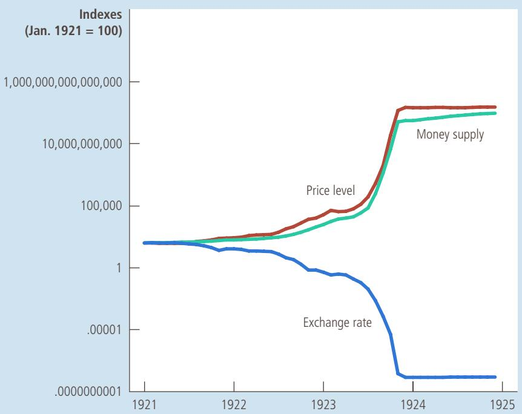

## 18-3b Implications of Purchasing-Power Parity

What does the theory of purchasing-power parity say about exchange rates? It tells us that the nominal exchange rate between the currencies of two countries depends on the price levels in those countries. If a dollar buys the same quantity of goods in the United States (where prices are measured in dollars) as in Japan (where prices are measured in yen), then the number of yen per dollar must reflect the prices of goods in the United States and Japan. For example, if a pound of coffee costs 500 yen in Japan and \$5 in the United States, then the nominal exchange rate must be 100 yen per dollar (500 $\mathrm { y e n } / \$ 5=100$ yen per dollar). Otherwise, the purchasing power of the dollar would not be the same in the two countries.

To see more fully how this works, it is helpful to use just a bit of mathematics. Suppose that P is the price of a basket of goods in the United States (measured in dollars), $P ^ { * }$ is the price of a basket of goods in Japan (measured in yen), and e is the nominal exchange rate (the number of yen a dollar can buy). Now consider the quantity of goods a dollar can buy at home and abroad. At home, the price level is $P ,$ so the purchasing power of \$1 at home is 1/P. That is, a dollar can buy $1 / P$ quantity of goods. Abroad, a dollar can be exchanged into e units of foreign currency, which in turn have purchasing power e/P\*. For the purchasing power of a dollar to be the same in the two countries, it must be the case that

$$
1 / P = e / P ^ {*}.
$$

With rearrangement, this equation becomes

$$
1 = e P / P ^ {*}.
$$

Notice that the left side of this equation is a constant and the right side is the real exchange rate. Thus, if the purchasing power of the dollar is always the same at home and abroad, then the real exchange rate—the relative price of domestic and foreign goods—cannot change.

To see the implication of this analysis for the nominal exchange rate, we can rearrange the last equation to solve for the nominal exchange rate:

$$
e = P ^ {*} / P.
$$

That is, the nominal exchange rate equals the ratio of the foreign price level (measured in units of the foreign currency) to the domestic price level (measured in units of the domestic currency). According to the theory of purchasing-power parity, the nominal exchange rate between the currencies of two countries must reflect the price levels in those countries.

A key implication of this theory is that nominal exchange rates change when price levels change. As we saw in the preceding chapter, the price level in any country adjusts to bring the quantity of money supplied and the quantity of money demanded into balance. Because the nominal exchange rate depends on the price levels, it also depends on the money supply and demand in each country. When a central bank in any country increases the money supply and causes the price level to rise, it also causes that country’s currency to depreciate relative to other currencies in the world. In other words, when the central bank prints large quantities of money, that money loses value both in terms of the goods and services it can buy and in terms of the amount of other currencies it can buy.

We can now answer the question that began this section: Why did the U.S. dollar lose value compared to the German mark and gain value compared to the Italian lira? The answer is that Germany pursued a less inflationary monetary policy than the United States, and Italy pursued a more inflationary monetary policy. From 1970 to 1998, inflation in the United States was 5.3 percent per year. By contrast, inflation was 3.5 percent in Germany and 9.6 percent in Italy. As U.S. prices rose relative to German prices, the value of the dollar fell relative to the mark. Similarly, as U.S. prices fell relative to Italian prices, the value of the dollar rose relative to the lira.

Germany and Italy now have a common currency—the euro. This means that the two countries share a single monetary policy and that the inflation rates in the two countries will be closely linked. But the historical lessons of the lira and the mark will apply to the euro as well. Whether the U.S. dollar buys more or fewer euros 20 years from now than it does today depends on whether the European Central Bank produces more or less inflation in Europe than the Federal Reserve does in the United States.

## THE NOMINAL EXCHANGE RATE DURING A HYPERINFLATION

Macroeconomists can only rarely conduct controlled experiments. Most often, they must glean what they can from the natural experiments that history gives them. One natural experiment is hyperinflation—the high inflation that arises when a government turns to the printing press high inflation that arises when a government turns to the printing press to pay for large amounts of government spending. Because hyperinflations are so extreme, they illustrate some basic economic principles with clarity.

Consider the German hyperinflation of the early 1920s. Figure 3 shows the German money supply, the German price level, and the nominal exchange rate (measured as U.S. cents per German mark) for that period. Notice that these series move closely together. When the supply of money starts growing quickly, the price level also takes off, and the German mark depreciates. When the money supply stabilizes, so do the price level and the exchange rate.

The pattern shown in this figure appears during every hyperinflation. It leaves no doubt that there is a fundamental link among money, prices, and the nominal exchange rate. The quantity theory of money discussed in the previous chapter explains how the money supply affects the price level. The theory of purchasingpower parity discussed here explains how the price level affects the nominal exchange rate. ●

## FIGURE 3

## Money, Prices, and the Nominal Exchange Rate during the German Hyperinflation

This figure shows the money supply, the price level, and the nominal exchange rate (measured as U.S. cents per mark) for the German hyperinflation from January 1921 to December 1924. Notice how similarly these three variables move. When the quantity of money started growing quickly, the price level followed and the mark depreciated relative to the dollar. When the German central bank stabilized the money supply, the price level and exchange rate stabilized as well.

S o u rc e : Adapted from Thomas J. Sargent, “The End of Four Big Inflations,” in Robert Hall, ed., Inflation (Chicago: University of Chicago Press, 1983), pp. 41–93.

## 18-3c Limitations of Purchasing-Power Parity

Purchasing-power parity provides a simple model of how exchange rates are determined. For understanding many economic phenomena, the theory works well. In particular, it can explain many long-term trends, such as the depreciation of the U.S. dollar against the German mark and the appreciation of the U.S. dollar against the Italian lira. It can also explain the major changes in exchange rates that occur during hyperinflations.

Yet the theory of purchasing-power parity is not completely accurate. That is, exchange rates do not always move to ensure that a dollar has the same real value in all countries all the time. There are two reasons the theory of purchasing-power parity does not always hold in practice.

The first reason is that many goods are not easily traded. Imagine, for instance, that haircuts are more expensive in Paris than in New York. International travelers might avoid getting their haircuts in Paris, and some haircutters might move from New York to Paris. Yet such arbitrage would be too limited to eliminate the differences in prices. Thus, the deviation from purchasing-power parity might persist, and a dollar (or euro) would continue to buy less of a haircut in Paris than in New York.

The second reason that purchasing-power parity does not always hold is that even tradable goods are not always perfect substitutes when they are produced in different countries. For example, some consumers prefer German cars, and others prefer American cars. Moreover, consumer tastes can change over time. If German cars suddenly become more popular, the increase in demand will drive up the price of German cars compared to American cars. Despite this difference in prices in the two markets, there might be no opportunity for profitable arbitrage because consumers do not view the two cars as equivalent.

Thus, both because some goods are not tradable and because some tradable goods are not perfect substitutes for their foreign counterparts, purchasing-power parity is not a perfect theory of exchange-rate determination. For these reasons, real exchange rates fluctuate over time. Nonetheless, the theory of purchasing-power parity does provide a useful first step in understanding exchange rates. The basic logic is persuasive: As the real exchange rate drifts from the level predicted by purchasing-power parity, people have greater incentive to move goods across national borders. Even if the forces of purchasing-power parity do not completely fix the real exchange rate, they provide a reason to expect that changes in the real exchange rate are most often small or temporary. As a result, large and persistent movements in nominal exchange rates typically reflect changes in price levels at home and abroad.

## THE HAMBURGER STANDARD

CASE When economists apply the theory of purchasing-power parity STUDY to explain exchange rates, they need data on the prices of a basket of goods available in different countries. One analysis of this sort is conducted by The Economist, an international newsmagazine. The magazine occasionally collects data on a basket of goods consisting of “two all-beef patties, special sauce, lettuce, cheese, pickles, onions, on a sesame seed bun.” It’s called the “Big Mac” and is sold by McDonald’s around the world.

Once we have the prices of Big Macs in two countries denominated in the local currencies, we can compute the exchange rate predicted by the theory of purchasing-power parity. The predicted exchange rate is the one that makes the cost of a Big Mac the same in the two countries. For instance, if the price of a Big

  
©TESTING/SHUTTERSTOCK.COM  
You can find a Big Mac almost anywhere you look.

a. exports and imports are both higher.

Mac is \$5 in the United States and 500 yen in Japan, purchasing-power parity would predict an exchange rate of 100 yen per dollar.

How well does purchasing-power parity work when applied using Big Mac prices? Here are some examples from January 2016, when the price of a Big Mac was \$4.93 in the United States:

<table><tr><td>Country</td><td>Price of a Big Mac</td><td>Predicted Exchange Rate</td><td>Actual Exchange Rate</td></tr><tr><td>Indonesia</td><td>30,500 rupiah</td><td>6,187 rupiah/$</td><td>13,947 rupiah/$</td></tr><tr><td>South Korea</td><td>4,300 won</td><td>872 won/$</td><td>1,198 won/$</td></tr><tr><td>Japan</td><td>370 yen</td><td>75 yen/$</td><td>119 yen/$</td></tr><tr><td>Mexico</td><td>49 pesos</td><td>9.9 pesos/$</td><td>17.4 pesos/$</td></tr><tr><td>Sweden</td><td>45 krona</td><td>9.1 krona/$</td><td>8.6 krona/$</td></tr><tr><td>Euro area</td><td>3.72 euros</td><td>0.75 euros/$</td><td>0.93 euros/$</td></tr><tr><td>Britain</td><td>2.89 pounds</td><td>0.59 pound/$</td><td>0.68 pound/$</td></tr></table>

You can see that the predicted and actual exchange rates are not exactly the same. After all, international arbitrage in Big Macs is not easy. Yet the two exchange rates are usually in the same ballpark. Purchasing-power parity is not a precise theory of exchange rates, but it often provides a reasonable first approximation. ●

Over the past 20 years, Mexico has had high inflation and Japan has had QuickQuiz low inflation. What do you predict has happened to the number of Mexican pesos a person can buy with a Japanese yen?

## 18-4 Conclusion

The purpose of this chapter has been to develop some basic concepts that macroeconomists use to study open economies. You should now understand how a nation’s trade balance is related to the international flow of capital and how national saving can differ from domestic investment in an open economy. You should understand that when a nation is running a trade surplus, it must be sending capital abroad, and that when it is running a trade deficit, it must be experiencing a capital inflow. You should also understand the meaning of the nominal and real exchange rates, as well as the implications and limitations of purchasing-power parity as a theory of how exchange rates are determined.

The macroeconomic variables defined here offer a starting point for analyzing an open economy’s interactions with the rest of the world. In the next chapter, we develop a model that can explain what determines these variables. We can then discuss how various events and policies affect a country’s trade balance and the rate at which nations make exchanges in world markets.

## CHAPTER QuickQuiz

2. In an open economy, national saving equals domestic investment

c. plus the government’s budget deficit.

3. If the value of a nation’s imports exceeds the value of its exports, which of the following is NOT true? a. Net exports are negative.

b. GDP is less than the sum of consumption, investment, and government purchases.

c. Domestic investment is greater than national saving.

d. The nation is experiencing a net outflow of capital.

4. If a nation’s currency doubles in value on foreign exchange markets, the currency is said to reflecting a change in the exchange rate.

a. appreciate, nominal

b. appreciate, real

c. depreciate, nominal

d. depreciate, real

5. If a cup of coffee costs 2 euros in Paris and \$6 in New York and purchasing-power parity holds, what is the exchange rate? a. 1/4 euro per dollar b. 1/3 euro per dollar c. 3 euros per dollar d. 4 euros per dollar

6. The theory of purchasing-power parity says that higher inflation in a nation causes the nation’s currency to , leaving the exchange rate unchanged.

a. appreciate, nominal

b. appreciate, real

c. depreciate, nominal

d. depreciate, real

## SUMMARY

Net exports are the value of domestic goods and services sold abroad (exports) minus the value of foreign goods and services sold domestically (imports). Net capital outflow is the acquisition of foreign assets by domestic residents (capital outflow) minus the acquisition of domestic assets by foreigners (capital inflow). Because every international transaction involves an exchange of an asset for a good or service, an economy’s net capital outflow always equals its net exports.

An economy’s saving can be used either to finance investment at home or to buy assets abroad. Thus, national saving equals domestic investment plus net capital outflow.

The nominal exchange rate is the relative price of the currency of two countries, and the real exchange rate is the relative price of the goods and services of two countries. When the nominal exchange rate changes so that each dollar buys more foreign currency, the dollar is said to appreciate or strengthen. When the nominal exchange rate changes so that each dollar buys less foreign currency, the dollar is said to depreciate or weaken.

According to the theory of purchasing-power parity, a dollar (or a unit of any other currency) should be able to buy the same quantity of goods in all countries. This theory implies that the nominal exchange rate between the currencies of two countries should reflect the price levels in those countries. As a result, countries with relatively high inflation should have depreciating currencies, and countries with relatively low inflation should have appreciating currencies.

## KEY CONCEPTS

closed economy, p. 370 open economy, p. 370 exports, p. 370 imports, p. 370 net exports, p. 370

trade balance, p. 370 trade surplus, p. 370 trade deficit, p. 370 balanced trade, p. 371 net capital outflow, p. 374 nominal exchange rate, p. 381 appreciation, p. 381 depreciation, p. 381 real exchange rate, p. 381 purchasing-power parity, p. 384

## QUESTIONS FOR REVIEW

1. Define net exports and net capital outflow. Explain how and why they are related.

2. Explain the relationship among saving, investment, and net capital outflow.

3. If a Japanese car costs 1,500,000 yen, a similar American car costs \$30,000, and a dollar can buy 100 yen, what are the nominal and real exchange rates?

4. Describe the economic logic behind the theory of purchasing-power parity.

5. If the Fed started printing large quantities of U.S. dollars, what would happen to the number of Japanese yen a dollar could buy? Why?

## PROBLEMS AND APPLICATIONS

1. How would the following transactions affect U.S. exports, imports, and net exports?

a. An American art professor spends the summer touring museums in Europe.

b. Students in Paris flock to see the latest movie from Hollywood.

c. Your uncle buys a new Volvo.

d. The student bookstore at Oxford University in England sells a copy of this textbook.

e. A Canadian citizen shops at a store in northern Vermont to avoid Canadian sales taxes.

2. Would each of the following transactions be included in net exports or net capital outflow? Be sure to say whether it would represent an increase or a decrease in that variable.

a. An American buys a Sony TV.

b. An American buys a share of Sony stock.

c. The Sony pension fund buys a bond from the U.S. Treasury.

d. A worker at a Sony plant in Japan buys some Georgia peaches from an American farmer.

3. Describe the difference between foreign direct investment and foreign portfolio investment. Who is more likely to engage in foreign direct investment—a corporation or an individual investor? Who is more likely to engage in foreign portfolio investment?

4. How would the following transactions affect U.S. net capital outflow? Also, state whether each involves direct investment or portfolio investment.

a. An American cellular phone company establishes an office in the Czech Republic.

b. Harrods of London sells stock to the General Electric pension fund.

c. Honda expands its factory in Marysville, Ohio.

d. A Fidelity mutual fund sells its Volkswagen stock to a French investor.

5. Would each of the following groups be happy or unhappy if the U.S. dollar appreciated? Explain.

a. Dutch pension funds holding U.S. government bonds

b. U.S. manufacturing industries

c. Australian tourists planning a trip to the United States

d. an American firm trying to purchase property overseas

6. What is happening to the U.S. real exchange rate in each of the following situations? Explain.

a. The U.S. nominal exchange rate is unchanged, but prices rise faster in the United States than abroad.

b. The U.S. nominal exchange rate is unchanged, but prices rise faster abroad than in the United States.

c. The U.S. nominal exchange rate declines, and prices are unchanged in the United States and abroad.

d. The U.S. nominal exchange rate declines, and prices rise faster abroad than in the United States.

7. A can of soda costs \$1.25 in the United States and 25 pesos in Mexico. What is the peso–dollar exchange rate (measured in pesos per dollar) if purchasingpower parity holds? If a monetary expansion caused all prices in Mexico to double, so that soda rose to 50 pesos, what would happen to the peso–dollar exchange rate?

8. A case study in the chapter analyzed purchasingpower parity for several countries using the price of Big Macs. Here are data for a few more countries:

<table><tr><td>Country</td><td>Price of a Big Mac</td><td>Predicted Exchange Rate</td><td>Actual Exchange Rate</td></tr><tr><td>Chile</td><td>2,100 pesos</td><td>___ pesos/$</td><td>715 pesos/$</td></tr><tr><td>Hungary</td><td>900 forints</td><td>___ forints/$</td><td>293 forints/$</td></tr><tr><td>Czech Republic</td><td>75 korunas</td><td>___ korunas/$</td><td>25.1 korunas/$</td></tr><tr><td>Brazil</td><td>13.5 real</td><td>___ real/$</td><td>4.02 real/$</td></tr><tr><td>Canada</td><td>5.84 C$</td><td>___ C$/$</td><td>1.41 C$/$</td></tr></table>

a. For each country, compute the predicted exchange rate of the local currency per U.S. dollar. (Recall that the U.S. price of a Big Mac was \$4.93.)

b. According to purchasing-power parity, what is the predicted exchange rate between the Hungarian forint and the Canadian dollar? What is the actual exchange rate?

c. How well does the theory of purchasing-power parity explain exchange rates?

9. Purchasing-power parity holds between the nations of Ectenia and Wiknam, where the only commodity is Spam.

a. In 2015, a can of Spam costs 4 dollars in Ectenia and 24 pesos in Wiknam. What is the exchange rate between Ectenian dollars and Wiknamian pesos?

b. Over the next 20 years, inflation is expected to be 3.5 percent per year in Ectenia and 7 percent per year in Wiknam. If this inflation comes to pass, what will the price of Spam and the exchange rate be in 2035? (Hint: Recall the rule of 70 from Chapter 14.)

c. Which of these two nations will likely have a higher nominal interest rate? Why?

d. A friend of yours suggests a get-rich-quick scheme: Borrow from the nation with the lower nominal interest rate, invest in the nation with the higher nominal interest rate, and profit from the interest-rate differential. Do you see any potential problems with this idea? Explain.

To find additional study resources, visit cengagebrain.com, and search for “Mankiw.”
