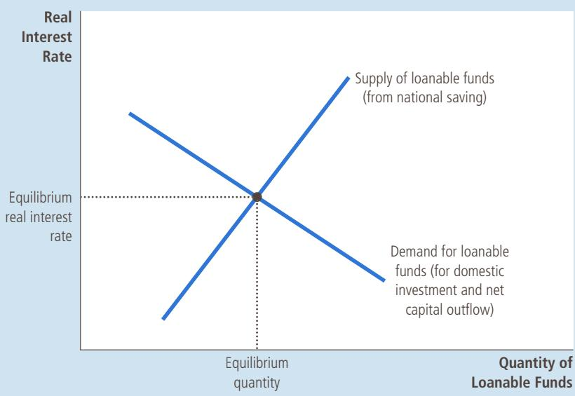
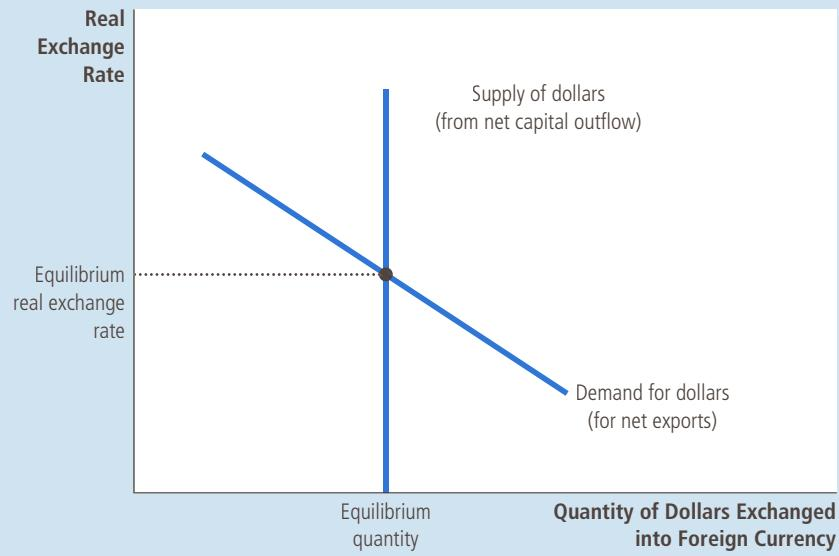
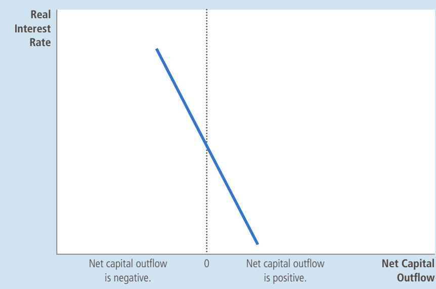
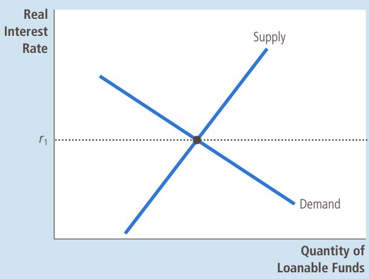
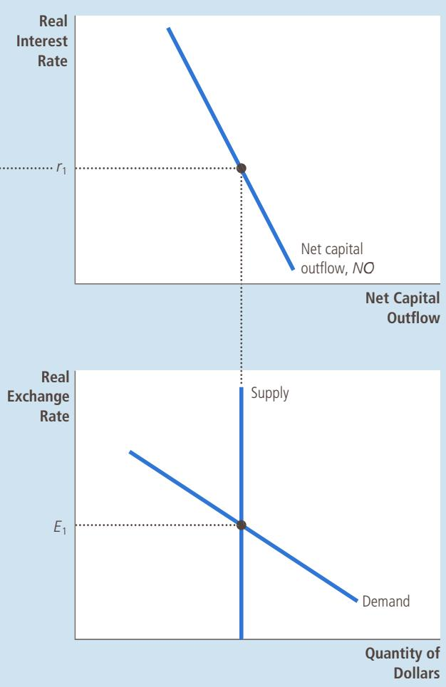
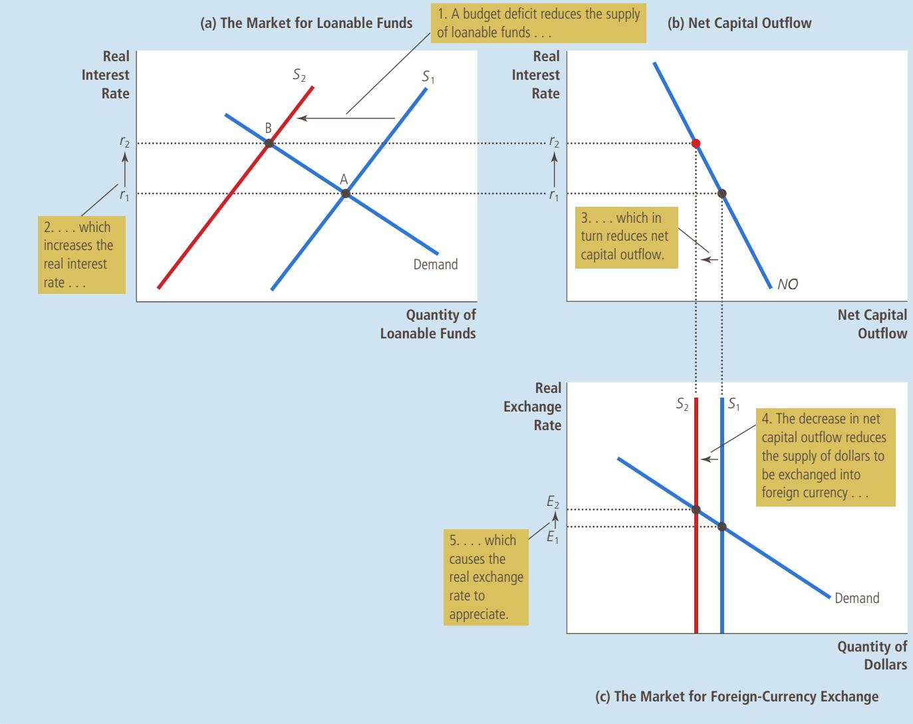
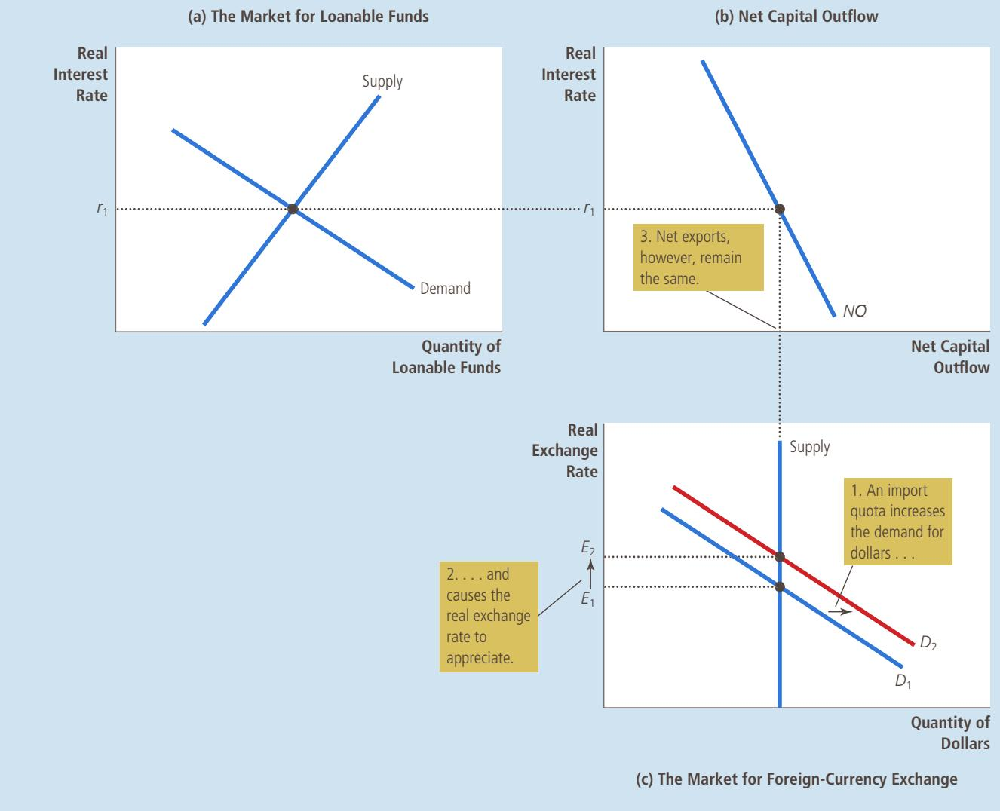
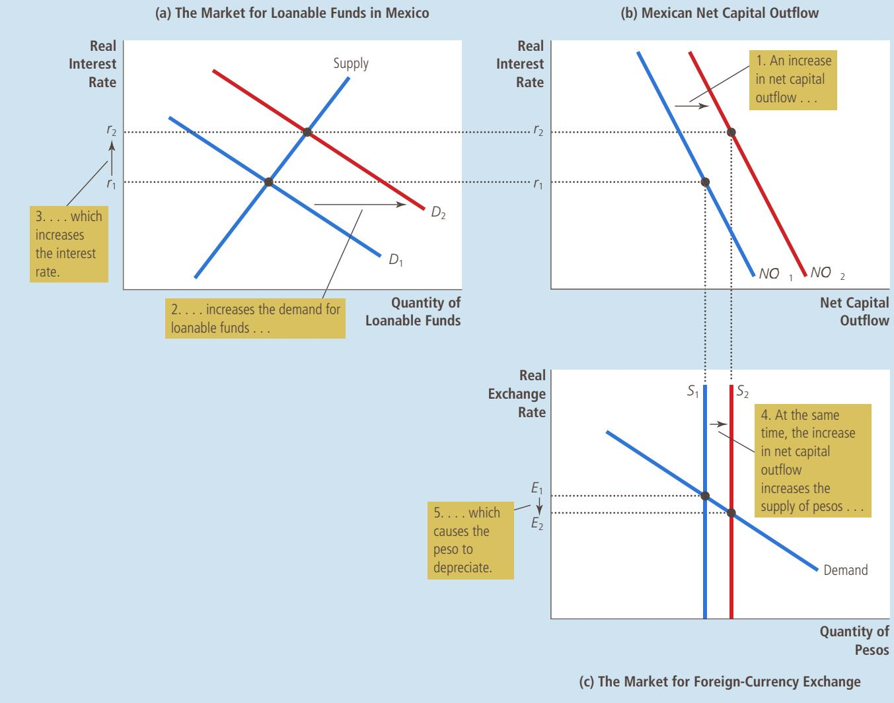
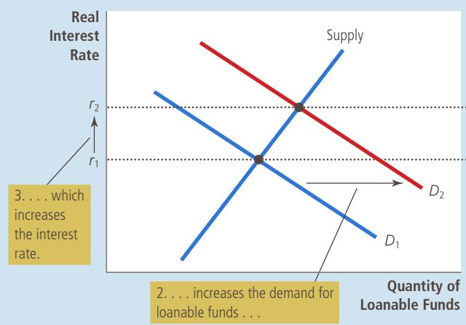

# A Macroeconomic Theory of the Open Economy

O ver the past three decades, the United States has consistently imported moregoods and services than it has exported. That is, U.S. net exports have been goods and services than it has exported. That is, U.S. net exports have been negative. While economists debate whether these trade deficits are a problem for the U.S. economy, the nation’s business community often has a strong opinion. Many business leaders claim that the trade deficits reflect unfair competition : Foreign firms are allowed to sell their products in U.S. markets, they contend, while foreign governments impede U.S. firms from selling U.S. products abroad.

Imagine that you are the president and you want to end these trade deficits. What should you do? Should you try to limit imports, perhaps by imposing a quota on textiles from China or cars from Japan? Or should you try to influence the nation’s trade deficit in some other way?

19

To understand the factors that determine a country’s trade balance and how government policies can affect it, we need a macroeconomic theory that explains how an open economy works. The preceding chapter introduced some of the key macroeconomic variables that describe an economy’s relationship with other economies, including net exports, net capital outflow, and the real and nominal exchange rates. This chapter develops a model that identifies the forces that determine these variables and explains how these variables are related to one another.

To develop this macroeconomic model of an open economy, we build on our previous analysis in two ways. First, the model takes the economy’s GDP as given. We assume that the economy’s output of goods and services, as measured by real GDP, is determined by the supplies of the factors of production and by the available production technology that turns these inputs into output. Second, the model takes the economy’s price level as given. We assume that the price level adjusts to bring the supply and demand for money into balance. In other words, this chapter takes as a starting point the lessons learned in previous chapters about the determination of the economy’s output and price level.

The goal of the model in this chapter is to highlight the forces that determine the economy’s trade balance and exchange rate. In one sense, the model is simple : It applies the tools of supply and demand to an open economy. Yet the model is also more complicated than others we have seen because it involves looking simultaneously at two related markets: the market for loanable funds and the market for foreign-currency exchange. After we develop this model of the open economy, we use it to examine how various events and policies affect the economy’s trade balance and exchange rate. We will then be able to determine the government policies that are most likely to reverse the trade deficits that the U.S. economy has experienced over the past three decades.

## 19-1 Supply and Demand for Loanable Funds and for Foreign-Currency Exchange

To understand the forces at work in an open economy, we focus on supply and demand in two markets. The first is the market for loanable funds, which coordinates the economy’s saving, investment, and flow of loanable funds abroad (called the net capital outflow). The second is the market for foreign-currency exchange, which coordinates people who want to exchange the domestic currency for the currency of other countries. In this section, we discuss supply and demand in each of these markets separately. In the next section, we put these markets together to explain the overall equilibrium for an open economy.

## 19-1a The Market for Loanable Funds

When we first analyzed the role of the financial system in Chapter 13, we made the simplifying assumption that the financial system consists of only one market, called the market for loanable funds. All savers go to this market to deposit their saving, and all borrowers go to this market to get their loans. In this market, there is one interest rate, which is both the return to saving and the cost of borrowing.

To understand the market for loanable funds in an open economy, the place to start is the identity discussed in the preceding chapter:

$$
\begin{array}{c} S \quad = \quad I \quad + \quad N C O \\ \text {Saving} \quad = \frac {\text {Domestic}}{\text {investment}} \quad + \quad \text {Net capital} \\ \text {outflow} \end{array} .
$$

Whenever a nation saves a dollar of its income, it can use that dollar to finance the purchase of domestic capital or to finance the purchase of an asset abroad. The two sides of this identity represent the two sides of the market for loanable funds. The supply of loanable funds comes from national saving (S), and the demand for loanable funds comes from domestic investment (I) and net capital outflow (NCO).

Loanable funds should be interpreted as the domestically generated flow of resources available for capital accumulation. The purchase of a capital asset adds to the demand for loanable funds, regardless of whether that asset is located at home (I) or abroad (NCO). Because net capital outflow can be either positive or negative, it can either add to or subtract from the demand for loanable funds that arises from domestic investment. When NCO > 0, the country is experiencing a net outflow of capital; the net purchase of capital overseas adds to the demand for domestically generated loanable funds. When NCO < 0, the country is experiencing a net inflow of capital; the capital resources coming from abroad reduce the demand for domestically generated loanable funds.

As we learned in our earlier discussion of the market for loanable funds, the quantity of loanable funds supplied and the quantity of loanable funds demanded depend on the real interest rate. A higher real interest rate encourages people to save and, therefore, raises the quantity of loanable funds supplied. A higher interest rate also makes borrowing to finance capital projects more costly; thus, it discourages investment and reduces the quantity of loanable funds demanded.

In addition to influencing national saving and domestic investment, the real interest rate in a country affects that country’s net capital outflow. To see why, consider two mutual funds—one in the United States and one in Germany— deciding whether to buy a U.S. government bond or a German government bond. Each mutual fund manager would make this decision in part by comparing the real interest rates in the United States and Germany. When the U.S. real interest rate rises, the U.S. bond becomes more attractive to both mutual funds. Thus, an increase in the U.S. real interest rate discourages Americans from buying foreign assets and encourages foreigners to buy U.S. assets. For both reasons, a high U.S. real interest rate reduces U.S. net capital outflow.

We illustrate the market for loanable funds with the familiar supply-anddemand diagram in Figure 1. As in our earlier analysis of the financial system, the supply curve slopes upward because a higher interest rate increases the quantity of loanable funds supplied, and the demand curve slopes downward because a higher interest rate decreases the quantity of loanable funds demanded. Unlike the situation in our previous discussion, however, the demand side of the market now represents both domestic investment and net capital outflow. That is, in an open economy, the demand for loanable funds comes not only from those who want loanable funds to buy domestic capital goods but also from those who want loanable funds to buy foreign assets.

The interest rate adjusts to bring the supply and demand for loanable funds into balance. If the interest rate were below the equilibrium level, the quantity of loanable funds supplied would be less than the quantity demanded. The resulting shortage of loanable funds would push the interest rate upward. Conversely, if the interest rate were above the equilibrium level, the quantity of loanable funds supplied would exceed the quantity demanded. The surplus of loanable funds would drive the interest rate downward. At the equilibrium interest rate, the supply of loanable funds exactly balances the demand. In other words, at the equilibrium interest rate, the amount that people want to save exactly balances the desired quantities of domestic investment and net capital outflow.

## FIGURE 1

## The Market for Loanable Funds

The interest rate in an open economy, as in a closed economy, is determined by the supply and demand for loanable funds. National saving is the source of the supply of loanable funds. Domestic investment and net capital outflow are the sources of the demand for loanable funds. At the equilibrium interest rate, the amount that people want to save exactly balances the amount that people want to borrow for the purpose of buying domestic capital and foreign assets.

## 19-1b The Market for Foreign-Currency Exchange

The second market in our model of the open economy is the market for foreigncurrency exchange. Participants in this market trade U.S. dollars in exchange for foreign currencies. To understand the market for foreign-currency exchange, we begin with another identity from the last chapter:

$$
N C O \quad = \quad N X
$$

$$
\text {Net capital outflow} = \text {Net exports.}
$$

This identity states that the imbalance between the purchase and sale of capital assets abroad (NCO) equals the imbalance between exports and imports of goods and services (NX). For example, when the U.S. economy is running a trade surplus (NX . 0), foreigners are buying more U.S. goods and services than Americans are buying foreign goods and services. What are Americans doing with the foreign currency they are getting from this net sale of goods and services abroad? They must be buying foreign assets, so U.S. capital is flowing abroad $( N C O > 0 )$ Conversely, if the United States is running a trade deficit (NX , 0), Americans are spending more on foreign goods and services than they are earning from selling abroad. Some of this spending must be financed by selling American assets abroad, so foreign capital is flowing into the United States (NCO , 0).

Our model of the open economy treats the two sides of this identity as representing the two sides of the market for foreign-currency exchange. Net capital outflow represents the quantity of dollars supplied for the purpose of buying foreign assets. For example, when a U.S. mutual fund wants to buy a Japanese government bond, it needs to change dollars into yen, so it supplies dollars in the market for foreign-currency exchange. Net exports represent the quantity of dollars demanded for the purpose of buying U.S. net exports of goods and services. For example, when a Japanese airline wants to buy a plane made by Boeing, it needs to change its yen into dollars, so it demands dollars in the market for foreign-currency exchange.

What price balances the supply and demand in the market for foreign-currency exchange? The answer is the real exchange rate. As we saw in the preceding chapter, the real exchange rate is the relative price of domestic and foreign goods and, therefore, is a key determinant of net exports. When the U.S. real exchange rate appreciates, U.S. goods become more expensive relative to foreign goods, making U.S. goods less attractive to consumers both at home and abroad. As a result, exports from the United States fall, and imports into the United States rise. For both reasons, net exports fall. Hence, an appreciation of the real exchange rate reduces the quantity of dollars demanded in the market for foreign-currency exchange.

Figure 2 shows supply and demand in the market for foreign-currency exchange. The demand curve slopes downward for the reason we just discussed : A higher real exchange rate makes U.S. goods more expensive and reduces the quantity of dollars demanded to buy those goods. The supply curve is vertical because the quantity of dollars supplied for net capital outflow does not depend on the real exchange rate. (As discussed earlier, net capital outflow depends on the real interest rate. When discussing the market for foreign-currency exchange, we take the real interest rate and net capital outflow as given.)

It might seem strange at first that net capital outflow does not depend on the exchange rate. After all, a higher exchange value of the U.S. dollar not only makes foreign goods less expensive for American buyers but also makes foreign assets less expensive. One might guess that this would make foreign assets more attractive. But remember that an American investor will eventually want to

The real exchange rate is determined by the supply and demand for foreign-currency exchange. The supply of dollars to be exchanged into foreign currency comes from net capital outflow. Because net capital outflow does not depend on the real exchange rate, the supply curve is vertical. The demand for dollars comes from net exports. Because a lower real exchange rate stimulates net exports (and thus increases the quantity of dollars demanded to pay for these net exports), the demand curve slopes downward. At the equilibrium real exchange rate, the number of dollars people supply to buy foreign assets exactly balances the number of dollars people demand to buy net exports.

## FIGURE 2

The Market for Foreign-Currency Exchange

turn the foreign asset, as well as any profits earned on it, back into dollars. For example, a high value of the dollar makes it less expensive for an American to buy stock in a Japanese company, but when that stock pays dividends, those will be in yen. As these yen are exchanged for dollars, the high value of the dollar means that the dividend will buy fewer dollars. Thus, changes in the exchange rate influence both the cost of buying foreign assets and the benefit of owning them, and these two effects offset each other. For these reasons, our model of the open economy posits that net capital outflow does not depend on the real exchange rate, as represented by the vertical supply curve in Figure 2.

The real exchange rate moves to ensure equilibrium in this market. It adjusts to balance the supply and demand for dollars just as the price of any good adjusts to balance supply and demand for that good. If the real exchange rate were below the equilibrium level, the quantity of dollars supplied would be less than the quantity demanded. The resulting shortage of dollars would push the value of the dollar upward. Conversely, if the real exchange rate were above the equilibrium level, the quantity of dollars supplied would exceed the quantity demanded. The surplus of dollars would drive the value of the dollar downward. At the equilibrium real exchange rate, the demand for dollars by foreigners arising from the U.S. net exports of goods and services exactly balances the supply of dollars from Americans arising from U.S. net capital outflow.

QuickQuiz

Describe the sources of supply and demand in the market for loanable funds and the market for foreign-currency exchange.

## FYI

## Purchasing-Power Parity as a Special Case

n alert reader of this book might ask: Why are we developing a theory of the exchange rate here? Didn’t we already do that in the preceding chapter?

As you may recall, the preceding chapter developed a theory of the exchange rate called purchasing-power parity. This theory asserts that a dollar (or any other currency) must buy the same quantity of goods and services in every country. As a result, the real exchange rate is fixed, and all changes in the nominal exchange rate between two currencies reflect changes in the price levels in the two countries.

The model of the exchange rate developed here is related to the theory of purchasing-power parity. According to the theory of purchasingpower parity, international trade responds quickly to international price differences. If goods were cheaper in one country than in another, they would be exported from the first country and imported into the second until the price difference disappeared. In other words, the theory of purchasing-power parity assumes that net exports are highly responsive to small changes in the real exchange rate. If net exports were in fact so responsive, the demand curve in Figure 2 would be horizontal.

Thus, the theory of purchasing-power parity can be viewed as a special case of the model considered here. In that special case, the demand curve for foreign

currency exchange, instead of sloping

downward, is horizontal at the level of the real exchange rate that ensures parity of purchasing power at home and abroad.

While this special case is a good place to start when studying exchange rates, it is far from the end of the story. In practice, foreign and domestic goods are not always perfect substitutes, and there are costs that impede trade. This chapter, therefore, assumes that the demand curve for foreign-currency exchange slopes downward. This allows for the possibility that the real exchange rate changes over time, as in fact it often does in the real world. ■

## 19-2 Equilibrium in the Open Economy

So far, we have discussed supply and demand in two markets: the market for loanable funds and the market for foreign-currency exchange. Let’s now consider how these markets are related to each other.

## 19-2a Net Capital Outflow: The Link between the Two Markets

We begin by recapping what we’ve learned so far in this chapter. We have been discussing how the economy coordinates four important macroeconomic variables: national saving (S), domestic investment (I), net capital outflow (NCO), and net exports (NX). Keep in mind the following identities:

$$
S = I + N C O
$$

and

$$
N C O = N X.
$$

In the market for loanable funds, supply comes from national saving (S), demand comes from domestic investment (I) and net capital outflow (NCO), and the real interest rate balances supply and demand. In the market for foreign-currency exchange, supply comes from net capital outflow (NCO), demand comes from net exports (NX), and the real exchange rate balances supply and demand.

Net capital outflow is the variable that links these two markets. In the market for loanable funds, net capital outflow is a piece of demand. An American who wants to buy an asset abroad must finance this purchase by obtaining resources in the U.S. market for loanable funds. In the market for foreign-currency exchange, net capital outflow is the source of supply. An American who wants to buy an asset in another country must supply dollars to exchange them for the currency of that country.

The key determinant of net capital outflow, as we have discussed, is the real interest rate. When the U.S. interest rate is high, owning U.S. assets is more attractive, and U.S. net capital outflow is low. Figure 3 shows this negative relationship between the

## FIGURE 3

## How Net Capital Outflow Depends on the Interest Rate

Because a higher domestic real interest rate makes domestic assets more attractive, it reduces net capital outflow. Note the position of zero on the horizontal axis: Net capital outflow can be positive or negative. A negative value of net capital outflow means that the economy is experiencing a net inflow of capital.

interest rate and net capital outflow. This net-capital-outflow curve is the link between the market for loanable funds and the market for foreign-currency exchange.

## 19-2b Simultaneous Equilibrium in Two Markets

We can now put all the pieces of our model together in Figure 4. This figure shows how the market for loanable funds and the market for foreign-currency exchange jointly determine the important macroeconomic variables of an open economy.

Panel (a) of the figure shows the market for loanable funds (taken from Figure 1). As before, national saving is the source of the supply of loanable funds. Domestic investment and net capital outflow are the source of the demand for loanable funds. The equilibrium real interest rate (r ) brings the quantity of loanable funds supplied and the quantity of loanable funds demanded into balance.

## FIGURE 4

The Real Equilibrium in an Open Economy

In panel (a), the supply and demand for loanable funds determine the real interest rate. In panel (b), the interest rate determines net capital outflow, which provides the supply of dollars in the market for foreign-currency exchange. In panel (c), the supply and demand for dollars in the market for foreign-currency exchange determine the real exchange rate.

(c) The Market for Foreign-Currency Exchange  
(a) The Market for Loanable Funds  

(b) Net Capital Outow  

Panel (b) of the figure shows net capital outflow (taken from Figure 3). The interest rate comes from panel (a) and then determines net capital outflow. A higher interest rate at home makes domestic assets more attractive, and this in turn reduces net capital outflow. Therefore, the net-capital-outflow curve in panel (b) slopes downward.

Panel (c) of the figure shows the market for foreign-currency exchange (taken from Figure 2). Because foreign assets must be purchased with foreign currency, the quantity of net capital outflow from panel (b) determines the supply of dollars to be exchanged into foreign currencies. The real exchange rate does not affect net capital outflow, so the supply curve is vertical. The demand for dollars comes from net exports. Because a depreciation of the real exchange rate increases net exports, the demand curve for foreign-currency exchange slopes downward. The equilibrium real exchange rate (E ) brings into balance the quantity of dollars supplied and the quantity of dollars demanded in the market for foreign-currency exchange.

The two markets shown in Figure 4 determine two relative prices: the real interest rate and the real exchange rate. The real interest rate determined in panel (a) is the price of goods and services in the present relative to goods and services in the future. The real exchange rate determined in panel (c) is the price of domestic goods and services relative to foreign goods and services. These two relative prices adjust simultaneously to balance supply and demand in these two markets. As they do so, they determine national saving, domestic investment, net capital outflow, and net exports. We can use this model to see how all these variables change when some policy or event causes one of these curves to shift.

## QuickQuiz

In the model of the open economy just developed, two markets determine two relative prices. What are the markets? What are the two relative prices?

FYI

## Disentangling Supply and Demand

uppose the owner of an apple orchard decides to consume some of his own apples. Does this decision represent an increase in the demand for apples or a decrease in the supply? Either answer is defensible, and as long as we are careful in our subsequent analysis, nothing important will hinge on which answer we choose. Sometimes how we divide things between supply and demand is a bit arbitrary.

In the macroeconomic model of the open economy developed in this chapter, the division of transactions between “supply” and “demand” is also a bit arbitrary. This is true both in the market for loanable funds and in the market for foreign-currency exchange.

Consider first the market for loanable funds. The model treats the net capital outflow as part of the demand for loanable funds. Yet instead of writing S 5 I 1 NCO, we could just as easily have written S2 NCO5 I . When the equation is rewritten in this way, a capital outflow looks like a reduction in the supply of loanable funds. Either way would have worked. The first interpretation (S 5 I 1 NCO) emphasizes loanable funds generated domestically whether used at home or abroad. The second interpretation (S 2 NCO 5 I) emphasizes loanable funds available

for domestic investment whether generated at home or abroad. The difference is more semantic than substantive.

Similarly, consider the

market for foreign-currency exchange.

In our model, net exports are the source of the demand for dollars, and net capital outflow is the source of the supply. Thus, when a U.S. resident imports a car made in Japan, our model treats that transaction as a decrease in the quantity of dollars demanded (because net exports fall) rather than an increase in the quantity of dollars supplied. Similarly, when a Japanese citizen buys a U.S. government bond, our model treats that transaction as a decrease in the quantity of dollars supplied (because net capital outflow falls) rather than an increase in the quantity of dollars demanded. This definition of terms may seem somewhat unnatural at first, but it will prove useful when analyzing the effects of various policies. ■

## 19-3 How Policies and Events Affect an Open Economy

Having developed a model to explain how key macroeconomic variables are determined in an open economy, we can now use the model to analyze how changes in policy and other events alter the economy’s equilibrium. As we proceed, keep in mind that our model is just supply and demand in two markets : the market for loanable funds and the market for foreign-currency exchange. When using the model to analyze any event, we can apply the three steps outlined in Chapter 4. First, we determine which of the supply and demand curves the event affects. Second, we determine the direction in which the curves shift. Third, we use the supply-and-demand diagrams to examine how these shifts alter the economy’s equilibrium.

## 19-3a Government Budget Deficits

When we first discussed the supply and demand for loanable funds earlier in the book, we examined the effects of government budget deficits, which occur when government spending exceeds government revenue. Because a government budget deficit represents negative public saving, it reduces national saving (the sum of public and private saving). Thus, a government budget deficit reduces the supply of loanable funds, drives up the interest rate, and crowds out investment.

Now let’s consider the effects of a budget deficit in an open economy. First, which curve in our model shifts? As in a closed economy, the initial impact of the budget deficit is on national saving and, therefore, on the supply curve for loanable funds. Second, in which direction does this supply curve shift? Again as in a closed economy, a budget deficit represents negative public saving, so it reduces national saving and shifts the supply curve for loanable funds to the left. This is shown as the shift from $S _ { 1 }$ to $S _ { 2 }$ in panel (a) of Figure 5.

Our third and final step is to compare the old and new equilibria. Panel (a) shows the impact of a U.S. budget deficit on the U.S. market for loanable funds. With fewer funds available for borrowers in U.S. financial markets, the interest rate rises from $r _ { 1 }$ to $r _ { 2 }$ to balance supply and demand. Faced with a higher interest rate, borrowers in the market for loanable funds choose to borrow less. This change is represented in the figure as the movement from point A to point B along the demand curve for loanable funds. In particular, households and firms reduce their purchases of capital goods. As in a closed economy, budget deficits crowd out domestic investment.

In an open economy, however, the reduced supply of loanable funds has additional effects. Panel (b) shows that the increase in the interest rate from $r _ { 1 }$ to $r _ { 2 }$ reduces net capital outflow. (This fall in net capital outflow is also part of the decrease in the quantity of loanable funds demanded in the movement from point A to point B in panel (a).) Because saving kept at home now earns higher rates of return, investing abroad is less attractive, and domestic residents buy fewer foreign assets. Higher interest rates also attract foreign investors, who want to earn the higher returns on U.S. assets. Thus, when budget deficits raise interest rates, both domestic and foreign behaviors cause U.S. net capital outflow to fall.

Panel (c) shows how budget deficits affect the market for foreign-currency exchange. Because net capital outflow is reduced, Americans need less foreign currency to buy foreign assets and, therefore, supply fewer dollars in the market for foreign-currency exchange. The supply curve for dollars shifts leftward from $S _ { 1 }$ to $S _ { 2 } .$ The reduced supply of dollars causes the real exchange rate to appreciate from $E _ { 1 }$ to $E _ { 2 } .$ . That is, the dollar becomes more valuable compared to

When the government runs a budget deficit, it reduces the supply of loanable funds from $S _ { 1 }$ to $S _ { 2 }$ in panel (a). The interest rate rises from $r _ { 1 }$ to $r _ { 2 }$ to balance the supply and demand for loanable funds. In panel (b), the higher interest rate reduces net capital outflow. Reduced net capital outflow, in turn, reduces the supply of dollars in the market for foreign-currency exchange from $S _ { 1 }$ to $S _ { 2 }$ in panel (c). This fall in the supply of dollars causes the real exchange rate to appreciate from $E _ { 1 }$ to $E _ { 2 }$ . The appreciation of the exchange rate pushes the trade balance toward deficit.

foreign currencies. This appreciation, in turn, makes U.S. goods more expensive compared to foreign goods. Because people both in the United States and abroad switch their purchases away from the more expensive U.S. goods, exports from the United States fall and imports into the United States rise. For both reasons, U.S. net exports fall. Hence, in an open economy, government budget deficits raise real interest rates, crowd out domestic investment, cause the currency to appreciate, and push the trade balance toward deficit.

trade policy a government policy that directly influences the quantity of goods and services that a country imports or exports

An important example of this lesson occurred in the United States in the 1980s. Shortly after Ronald Reagan was elected president in 1980, the fiscal policy of the U.S. federal government changed dramatically. The president and Congress enacted large cuts in taxes, but they did not cut government spending by nearly as much. The result was a large budget deficit. Our model of the open economy predicts that such a policy should have led to a trade deficit, and in fact it did, as we saw in a case study in the preceding chapter. Because the budget deficit and trade deficit during this period were so closely related in both theory and practice, they were nicknamed the twin deficits. We should not, however, view these twins as identical, for many factors beyond fiscal policy can influence the trade deficit.

## 19-3b Trade Policy

A trade policy is a government policy that directly influences the quantity of goods and services that a country imports or exports. Trade policy takes various forms, usually with the purpose of supporting a particular domestic industry. One common trade policy is a tariff, a tax on imported goods. Another is an import quota, a limit on the quantity of a good produced abroad that can be sold domestically.

Let’s consider the macroeconomic impact of trade policy. Suppose that the U.S. auto industry, concerned about competition from Japanese automakers, convinces the U.S. government to impose a quota on the number of cars that can be imported from Japan. In making their case, lobbyists for the auto industry assert that the trade restriction would shrink the size of the U.S. trade deficit. Are they right? Our model, illustrated in Figure $6 ,$ offers an answer.

The first step in analyzing the trade policy is to determine which curve shifts. The initial impact of the import restriction is, not surprisingly, on imports. Because net exports equal exports minus imports, the policy also affects net exports. And because net exports are the source of demand for dollars in the market for foreigncurrency exchange, the policy affects the demand curve in this market.

The second step is to determine the direction in which this demand curve shifts. Because the quota restricts the number of Japanese cars sold in the United States, it reduces imports at any given real exchange rate. Net exports, which equal exports minus imports, will therefore rise for any given real exchange rate. Because foreigners need dollars to buy U.S. net exports, there is an increased demand for dollars in the market for foreign-currency exchange. This increase in the demand for dollars is shown in panel (c) of Figure 6 as the shift from $D _ { 1 }$ to $D _ { 2 } .$

The third step is to compare the old and new equilibria. As we can see in panel (c), the increase in the demand for dollars causes the real exchange rate to appreciate from $E _ { 1 }$ to $E _ { 2 } .$ . Because nothing has happened in the market for loanable funds in panel (a), there is no change in the real interest rate. Because there is no change in the real interest rate, there is also no change in net capital outflow, shown in panel (b). And because there is no change in net capital outflow, there can be no change in net exports, even though the import quota has reduced imports.

It might seem puzzling that net exports stay the same while imports fall. This puzzle is resolved by noting the change in the real exchange rate: When the dollar appreciates in value in the market for foreign-currency exchange, domestic goods become more expensive relative to foreign goods. This appreciation encourages imports and discourages exports, and both of these changes work to offset the direct increase in net exports due to the import quota. In the end, an import quota reduces both imports and exports, but net exports (exports minus imports) are unchanged.

When the U.S. government imposes a quota on the import of Japanese cars, nothing happens in the market for loanable funds in panel (a) or to net capital outflow in panel (b). The only effect is a rise in net exports (exports minus imports) for any given real exchange rate. As a result, the demand for dollars in the market for foreign-currency exchange rises, as shown by the shift from $D _ { 1 }$ to $D _ { 2 }$ in panel (c). This increase in the demand for dollars causes the value of the dollar to appreciate from $E _ { 1 }$ to $E _ { 2 }$ . This appreciation of the dollar tends to reduce net exports, offsetting the direct effect of the import quota on the trade balance.

## FIGURE 6

The Effects of an Import Quota

We have thus come to a surprising implication: Trade policies do not affect the trade balance. That is, policies that directly influence exports or imports do not alter net exports. This conclusion seems less surprising if one recalls the accounting identity:

$$
N X = N C O = S - I.
$$

Net exports equal net capital outflow, which equals national saving minus domestic investment. Trade policies do not alter the trade balance because they do not alter national saving or domestic investment. For given levels of national saving and domestic investment, the real exchange rate adjusts to keep the trade balance the same, regardless of the trade policies the government puts in place.

Although trade policies do not affect a country’s overall trade balance, these policies do affect specific firms, industries, and countries. When the U.S. government imposes an import quota on Japanese cars, General Motors has less competition from abroad and will sell more cars. At the same time, because the dollar has appreciated in value, Boeing, the U.S. aircraft maker, will find it harder to compete with Airbus, the European aircraft maker. U.S. exports of aircraft will fall, and U.S. imports of aircraft will rise. In this case, the import quota on Japanese cars will increase net exports of cars and decrease net exports of planes. In addition, it will increase net exports from the United States to Japan and decrease net exports from the United States to Europe. The overall trade balance of the U.S. economy, however, stays the same.

The effects of trade policies are, therefore, more microeconomic than macroeconomic. Although advocates of trade policies sometimes suggest (contrary to what our model predicts) that these policies can alter a country’s trade balance, they are usually more motivated by concerns about particular firms or industries. One should not be surprised, for instance, to hear an executive from General Motors advocating import quotas for Japanese cars. Economists usually oppose such trade policies. Free trade allows economies to specialize in doing what they do best, making residents of all countries better off. Trade restrictions interfere with these gains from trade and, thus, reduce overall economic well-being.

## 19-3c Political Instability and Capital Flight

In 1994, political instability in Mexico, including the assassination of a prominent political leader, made world financial markets nervous. People began to view Mexico as a much less stable country than they had previously thought. They decided to pull some of their assets out of Mexico and move these funds to the United States and other “safe havens.” Such a large and sudden movement of funds out of a country is called capital flight. To see the implications of capital flight for the Mexican economy, we again follow our three steps for analyzing a change in equilibrium, but this time, we apply our model of the open economy from the perspective of Mexico rather than the United States.

Consider first which curves in our model capital flight affects. When investors around the world observe political problems in Mexico, they decide to sell some of their Mexican assets and use the proceeds to buy U.S. assets. This act increases Mexican net capital outflow and, therefore, affects both markets in our model. Most obviously, it affects the net-capital-outflow curve, and this in turn influences the supply of pesos in the market for foreign-currency exchange. In addition, because the demand for loanable funds comes from both domestic investment and net capital outflow, capital flight affects the demand curve in the market for loanable funds.

Now consider the direction in which these curves shift. When net capital outflow increases, there is greater demand for loanable funds to finance these purchases of capital assets abroad. Thus, as panel (a) of Figure 7 shows, the demand curve for loanable funds shifts to the right from $D _ { 1 }$ to $D _ { 2 } .$ In addition, because net capital outflow is higher for any interest rate, the net-capital-outflow curve also shifts to the right from $N C O _ { 1 }$ to ${ \dot { N } } C O _ { 2 } ,$ as in panel (b).

## FIGURE 7

If people decide that Mexico is a risky place to keep their savings, they will move their capital to safe havens such as the United States, resulting in an increase in Mexican net capital outflow. Consequently, the demand for loanable funds in Mexico rises from $D _ { 1 }$ to $D _ { 2 }$ as shown in panel (a), driving up the Mexican real interest rate from $r _ { 1 }$ to $r _ { 2 } .$ Because net capital outflow is higher for any interest rate, that curve also shifts to the right from $N C O _ { 1 }$ to $N C O _ { 2 }$ in panel (b). At the same time, in the market for foreign-currency exchange, the supply of pesos rises from $S _ { 1 }$ to $S _ { 2 } ,$ as shown in panel (c). This increase in the supply of pesos causes the peso to depreciate from $E _ { 1 }$ to $E _ { 2 } ,$ so the peso becomes less valuable compared to other currencies.

The Effects of Capital Flight

To see the effects of capital flight on the Mexican economy, we compare the old and new equilibria. Panel (a) of Figure 7 shows that the increased demand for loanable funds causes the interest rate in Mexico to rise from $r _ { 1 }$ to $r _ { 2 } .$ Panel (b) shows that Mexican net capital outflow increases. (Although the rise in the interest rate does make Mexican assets more attractive, this only partly offsets the impact of

IN THE NEWS
