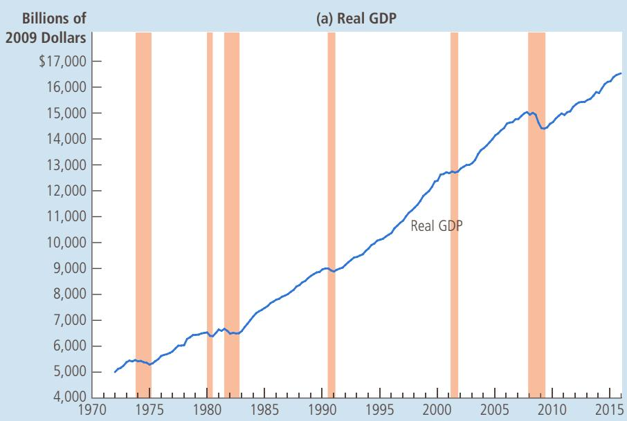
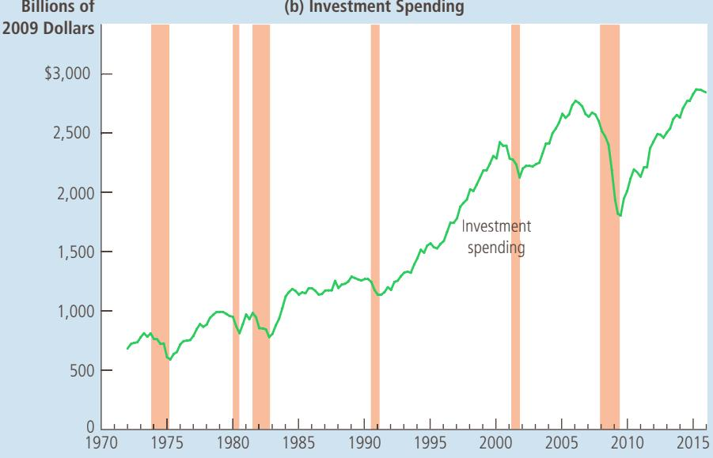
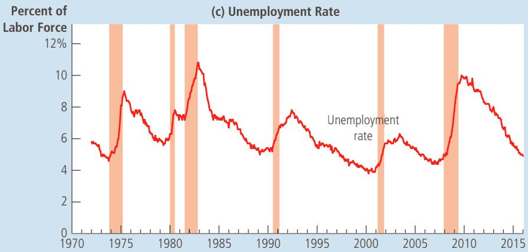
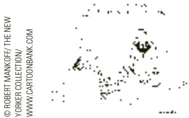
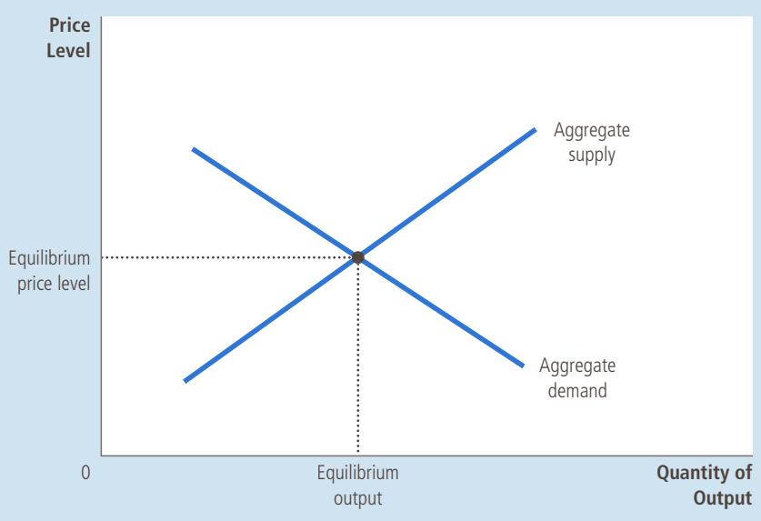
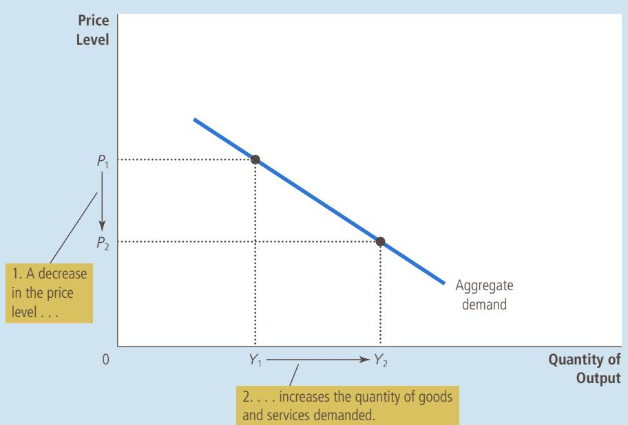
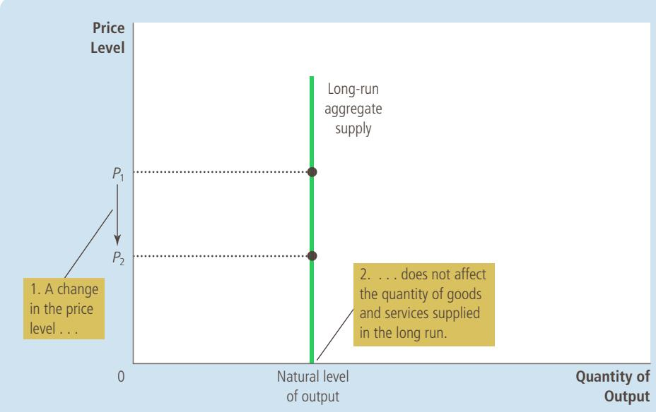
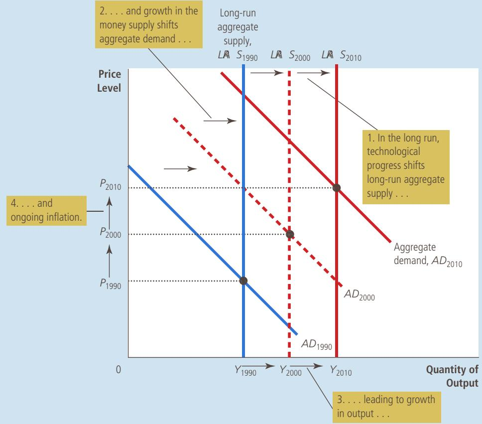
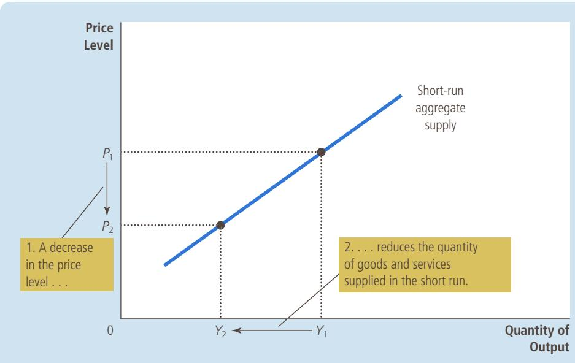

# Short-Run Economic Fluctuations

# Aggregate Demand and Aggregate Supply

CHAPTER

20

conomic activity fluctuates from year to year. In most years, the production of goods and services rises. Because of increases in the labor force, increases in the capital stock, and advances in technological knowledge, the economy can produce more and more over time. This growth allows everyone to enjoy a higher standard of living. On average, over the past half century, the production of the U.S. economy as measured by real GDP has grown by about 3 percent per year.

In some years, however, instead of expanding, the economy contracts. Firms find themselves unable to sell all the goods and services they have to offer, so they reduce production. Workers are laid off, unemployment becomes widespread, and factories are left idle. With the economy producing fewer goods and services, real GDP and other measures of income decline. Such a period of falling incomes and rising unemployment is called a recession if it is relatively mild and a depression if it is more severe.

An example of such a downturn occurred in 2008 and 2009. From the fourth quarter of 2007 to the second quarter of 2009, real GDP for the U.S. economy fell by 4.2 percent. The rate of unemployment rose from 4.4 percent in May 2007 to 10.0 percent in October 2009—the highest level in more than a quarter century. Not surprisingly, students graduating during this time found that desirable jobs were hard to come by.

What causes short-run fluctuations in economic activity? What, if anything, can public policy do to prevent periods of falling incomes and rising unemployment? When recessions and depressions occur, how can policymakers reduce their length and severity? These are the questions we take up now.

The variables that we study are largely those we have seen in previous chapters. They include GDP, unemployment, interest rates, and the price level. Also familiar are the policy instruments of government spending, taxes, and the money supply. What differs from our earlier analysis is the time horizon. So far, our goal has been to explain the behavior of these variables in the long run. Our goal now is to explain their short-run deviations from long-run trends. In other words, instead of focusing on the forces that explain economic growth from generation to generation, we are now interested in the forces that explain economic fluctuations from year to year.

There is some debate among economists about how best to analyze short-run fluctuations, but most economists use the model of aggregate demand and aggregate supply. Learning how to use this model for analyzing the short-run effects of various events and policies is the primary task ahead. This chapter introduces the model’s two pieces: the aggregate-demand curve and the aggregate-supply curve. Before turning to the model, however, let’s look at some of the key facts that describe the ups and downs of the economy.

## 20-1 Three Key Facts about Economic Fluctuations

Short-run fluctuations in economic activity have occurred in all countries throughout history. As a starting point for understanding these year-to-year fluctuations, let’s discuss some of their most important properties.

## 20-1a Fact 1: Economic Fluctuations Are Irregular and Unpredictable

Fluctuations in the economy are often called the business cycle. As this term suggests, economic fluctuations correspond to changes in business conditions. When real GDP grows rapidly, business is good. During such periods of economic expansion, most firms find that customers are plentiful and that profits are growing. When real GDP falls during recessions, businesses have trouble. During such periods of economic contraction, most firms experience declining sales and dwindling profits.

The term business cycle is somewhat misleading because it suggests that economic fluctuations follow a regular, predictable pattern. In fact, economic fluctuations are not at all regular, and they are almost impossible to predict with much accuracy. Panel (a) of Figure 1 shows the real GDP of the

This figure shows real GDP in panel (a), investment spending in panel (b), and unemployment in panel (c) for the U.S. economy. Recessions are shown as the shaded areas. Notice that real GDP and investment spending decline during recessions, while unemployment rises.

  
(b) Investment Spending

## A Look at Short-Run Economic Fluctuations

## FIGURE 1

Source: U.S. Department of Commerce; U.S. Department of Labor.

WWW.CARTOONBANK.COM YORKER COLLECTION/ © ROBERT MANKOFF/ THE NEW

  
“You’re fired. Pass it on.”

U.S. economy since 1972. The shaded areas represent times of recession. As the figure shows, recessions do not come at regular intervals. Sometimes recessions are close together, such as the recessions of 1980 and 1982. Sometimes the economy goes many years without a recession. The longest period in U.S. history without a recession was the economic expansion from 1991 to 2001.

## 20-1b Fact 2: Most Macroeconomic Quantities Fluctuate Together

Real GDP is the variable most commonly used to monitor short-run changes in the economy because it is the most comprehensive measure of economic activity. Real GDP measures the value of all final goods and services produced within a given period of time. It also measures the total income (adjusted for inflation) of everyone in the economy.

It turns out, however, that for monitoring short-run fluctuations, it does not really matter which measure of economic activity one looks at. Most macroeconomic variables that measure some type of income, spending, or production fluctuate closely together. When real GDP falls in a recession, so do personal income, corporate profits, consumer spending, investment spending, industrial production, retail sales, home sales, auto sales, and so on. Because recessions are economy-wide phenomena, they show up in many sources of macroeconomic data.

Although many macroeconomic variables fluctuate together, they fluctuate by different amounts. In particular, as panel (b) of Figure 1 shows, investment spending varies greatly over the business cycle. Even though investment averages about one-sixth of GDP, declines in investment account for about two-thirds of the declines in GDP during recessions. In other words, when economic conditions deteriorate, much of the decline is attributable to reductions in spending on new factories, housing, and inventories.

## 20-1c Fact 3: As Output Falls, Unemployment Rises

Changes in the economy’s output of goods and services are strongly correlated with changes in the economy’s utilization of its labor force. In other words, when real GDP declines, the rate of unemployment rises. This fact is hardly surprising: When firms choose to produce a smaller quantity of goods and services, they lay off workers, expanding the pool of unemployed.

Panel (c) of Figure 1 shows the unemployment rate in the U.S. economy since 1972. Once again, the shaded areas in the figure indicate periods of recession. The figure shows clearly the impact of recessions on unemployment. In each of the recessions, the unemployment rate rises substantially. When the recession ends and real GDP starts to expand, the unemployment rate gradually declines. Because there are always some workers between jobs, the unemployment rate never approaches zero. Instead, it fluctuates around its natural rate of about 5 or 6 percent.

## 20-2 Explaining Short-Run Economic Fluctuations

Describing what happens to economies as they fluctuate over time is easy. Explaining what causes these fluctuations is more difficult. Indeed, compared to the topics we have studied in previous chapters, the theory of economic fluctuations remains controversial. In this chapter, we begin to develop the model that most economists use to explain short-run fluctuations in economic activity.

## 20-2a The Assumptions of Classical Economics

In previous chapters, we developed theories to explain what determines most important macroeconomic variables in the long run. Chapter 12 explained the level and growth of productivity and real GDP. Chapters 13 and 14 explained how the financial system works and how the real interest rate adjusts to balance saving and investment. Chapter 15 explained why there is always some unemployment in the economy. Chapters 16 and 17 explained the monetary system and how changes in the money supply affect the price level, the inflation rate, and the nominal interest rate.

All of this previous analysis was based on two related ideas: the classical dichotomy and monetary neutrality. Recall that the classical dichotomy is the separation of variables into real variables (those that measure quantities or relative prices) and nominal variables (those measured in terms of money). According to classical macroeconomic theory, changes in the money supply affect nominal variables but not real variables. As a result of this monetary neutrality, Chapters 12 through 15 were able to examine the determinants of real variables (real GDP, the real interest rate, and unemployment) without introducing nominal variables (the money supply and the price level).

In a sense, money does not matter in a classical world. If the quantity of money in the economy were to double, everything would cost twice as much, and everyone’s income would be twice as high. But so what? The change would be nominal (by the standard meaning of “nearly insignificant”). The things that people really care about—whether they have a job, how many goods and services they can afford, and so on—would be exactly the same.

This classical view is sometimes described by the saying, “Money is a veil.” That is, nominal variables may be the first things we see when we observe an economy because economic variables are often expressed in units of money. But what’s important are the real variables and the economic forces that determine them. According to classical theory, to understand these real variables, we need to look behind the veil.

## 20-2b The Reality of Short-Run Fluctuations

Do these assumptions of classical macroeconomic theory apply to the world in which we live? The answer to this question is of central importance to understanding how the economy works. Most economists believe that classical theory describes the world in the long run but not in the short run.

Consider again the impact of money on the economy. Most economists believe that, beyond a period of several years, changes in the money supply affect prices and other nominal variables but do not affect real GDP, unemployment, and other real variables—just as classical theory says. When studying year-to-year changes in the economy, however, the assumption of monetary neutrality is no longer appropriate. In the short run, real and nominal variables are highly intertwined, and changes in the money supply can temporarily push real GDP away from its long-run trend.

Even the classical economists themselves, such as David Hume, realized that classical economic theory did not hold in the short run. From his vantage point in 18th-century England, Hume observed that when the money supply expanded after gold discoveries, it took some time for prices to rise, and in the meantime, the economy enjoyed higher employment and production.

## model of aggregate demand and aggregate supply

the model that most economists use to explain short-run fluctuations in economic activity around its long-run trend

aggregate-demand curve a curve that shows the quantity of goods and services that households, firms, the government, and customers abroad want to buy at each price level

To understand how the economy works in the short run, we need a new model. This new model can be built using many of the tools we developed in previous chapters, but it must abandon the classical dichotomy and the neutrality of money. We can no longer separate our analysis of real variables such as output and employment from our analysis of nominal variables such as money and the price level. Our new model focuses on how real and nominal variables interact.

## 20-2c The Model of Aggregate Demand and Aggregate Supply

Our model of short-run economic fluctuations focuses on the behavior of two variables. The first variable is the economy’s output of goods and services, as measured by real GDP. The second is the average level of prices, as measured by the CPI or the GDP deflator. Notice that output is a real variable, whereas the price level is a nominal variable. By focusing on the relationship between these two variables, we are departing from the classical assumption that real and nominal variables can be studied separately.

We analyze fluctuations in the economy as a whole with the model of aggregate demand and aggregate supply, which is illustrated in Figure 2. On the vertical axis is the overall price level in the economy. On the horizontal axis is the overall quantity of goods and services produced in the economy. The aggregatedemand curve shows the quantity of goods and services that households, firms,

## FIGURE 2

Aggregate Demand and Aggregate Supply Economists use the model of aggregate demand and aggregate supply to analyze economic fluctuations. On the vertical axis is the overall level of prices. On the horizontal axis is the economy’s total output of goods and services. Output and the price level adjust to the point at which the aggregate-supply and aggregate-demand curves intersect.

the government, and customers abroad want to buy at each price level. The aggregate-supply curve shows the quantity of goods and services that firms produce and sell at each price level. According to this model, the price level and the quantity of output adjust to bring aggregate demand and aggregate supply into balance.

aggregate-supply curve a curve that shows the quantity of goods and services that firms choose to produce and sell at each price level

It is tempting to view the model of aggregate demand and aggregate supply as nothing more than a large version of the model of market demand and market supply introduced in Chapter 4. But in fact, this model is quite different. When we consider demand and supply in a specific market—ice cream, for instance—the behavior of buyers and sellers depends on the ability of resources to move from one market to another. When the price of ice cream rises, the quantity demanded falls because buyers will use their incomes to buy products other than ice cream. Similarly, a higher price of ice cream raises the quantity supplied because firms that produce ice cream can increase production by hiring workers away from other parts of the economy. This microeconomic substitution from one market to another is impossible for the economy as a whole. After all, the quantity that our model is trying to explain—real GDP—measures the total quantity of goods and services produced by all firms in all markets. To understand why the aggregatedemand curve slopes downward and why the aggregate-supply curve slopes upward, we need a macroeconomic theory that explains the total quantity of goods and services demanded and the total quantity of goods and services supplied. Developing such a theory is our next task.

How does the economy’s behavior in the short run differ from its behavior QuickQuiz in the long run? • Draw the model of aggregate demand and aggregate supply. What variables are on the two axes?

## 20-3 The Aggregate-Demand Curve

The aggregate-demand curve tells us the quantity of all goods and services demanded in the economy at any given price level. As Figure 3 illustrates, the aggregate-demand curve slopes downward. This means that, other things being equal, a decrease in the economy’s overall level of prices (from, say, $P _ { 1 }$ to $\bar { P _ { 2 } } )$ raises the quantity of goods and services demanded (from $Y _ { 1 }$ to $Y _ { 2 } )$ . Conversely, an increase in the price level reduces the quantity of goods and services demanded.

## 20-3a Why the Aggregate-Demand Curve Slopes Downward

Why does a change in the price level move the quantity of goods and services demanded in the opposite direction? To answer this question, it is useful to recall that an economy’s GDP (which we denote as Y) is the sum of its consumption (C), investment (I), government purchases (G), and net exports (NX):

$$
Y = C + I + G + N X.
$$

Each of these four components contributes to the aggregate demand for goods and services. For now, we assume that government spending is fixed by policy. The other three components of spending—consumption, investment, and net exports—depend on economic conditions and, in particular, on the price level. Therefore, to understand the downward slope of the aggregate-demand curve, we must examine how the price level affects the quantity of goods and services demanded for consumption, investment, and net exports.

## FIGURE 3

## The Aggregate-Demand Curve

A fall in the price level from $P _ { 1 }$ to $P _ { 2 }$ increases the quantity of goods and services demanded from $Y _ { 1 }$ to $Y _ { 2 } .$ There are three reasons for this negative relationship. As the price level falls, real wealth rises, interest rates fall, and the exchange rate depreciates. These effects stimulate spending on consumption, investment, and net exports. Increased spending on any or all of these components of output means a larger quantity of goods and services demanded.

The Price Level and Consumption: The Wealth Effect Consider the money that you hold in your wallet and your bank account. The nominal value of this money is fixed: One dollar is always worth one dollar. Yet the real value of a dollar is not fixed. If a candy bar costs one dollar, then a dollar is worth one candy bar. If the price of a candy bar falls to 50 cents, then one dollar is worth two candy bars. Thus, when the price level falls, the dollars you are holding rise in value, which increases your real wealth and your ability to buy goods and services.

This logic gives us the first reason the aggregate-demand curve slopes downward. A decrease in the price level raises the real value of money and makes consumers wealthier, which in turn encourages them to spend more. The increase in consumer spending means a larger quantity of goods and services demanded. Conversely, an increase in the price level reduces the real value of money and makes consumers poorer, which in turn reduces consumer spending and the quantity of goods and services demanded.

The Price Level and Investment: The Interest-Rate Effect The price level is one determinant of the quantity of money demanded. When the price level is lower, households do not need to hold as much money to buy the goods and services they want. Therefore, when the price level falls, households try to reduce their holdings of money by lending some of it out. For instance, a household might use its excess money to buy interest-bearing bonds. Or it might deposit its excess money in an interest-bearing savings account, and the bank would use these funds to make more loans. In either case, as households try to convert some of their money into interest-bearing assets, they drive down interest rates. (The next chapter analyzes this process in more detail.)

Interest rates, in turn, affect spending on goods and services. Because a lower interest rate makes borrowing less expensive, it encourages firms to borrow more to invest in new plants and equipment, and it encourages households to borrow more to invest in new housing. (A lower interest rate might also stimulate consumer spending, especially spending on large durable purchases such as cars, which are often bought on credit.) Thus, a lower interest rate increases the quantity of goods and services demanded.

This logic gives us the second reason the aggregate-demand curve slopes downward. A lower price level reduces the interest rate, encourages greater spending on investment goods, and thereby increases the quantity of goods and services demanded. Conversely, a higher price level raises the interest rate, discourages investment spending, and decreases the quantity of goods and services demanded.

The Price Level and Net Exports: The Exchange-Rate Effect As we have just discussed, a lower price level in the United States lowers the U.S. interest rate. In response to the lower interest rate, some U.S. investors will seek higher returns by investing abroad. For instance, as the interest rate on U.S. government bonds falls, a mutual fund might sell U.S. government bonds to buy German government bonds. As the mutual fund tries to convert its dollars into euros to buy the German bonds, it increases the supply of dollars in the market for foreigncurrency exchange.

The increased supply of dollars to be turned into euros causes the dollar to depreciate relative to the euro. This leads to a change in the real exchange rate— the relative price of domestic and foreign goods. Because each dollar buys fewer units of foreign currencies, foreign goods become more expensive relative to domestic goods.

The change in relative prices affects spending, both at home and abroad. Because foreign goods are now more expensive, Americans buy less from other countries, causing U.S. imports of goods and services to decrease. At the same time, because U.S. goods are now cheaper, foreigners buy more from the United States, so U.S. exports increase. Net exports equal exports minus imports, so both of these changes cause U.S. net exports to increase. Thus, the fall in the real exchange value of the dollar leads to an increase in the quantity of goods and services demanded.

This logic yields the third reason the aggregate-demand curve slopes downward. When a fall in the U.S. price level causes U.S. interest rates to fall, the real value of the dollar declines in foreign exchange markets. This depreciation stimulates U.S. net exports and thereby increases the quantity of goods and services demanded. Conversely, when the U.S. price level rises and causes U.S. interest rates to rise, the real value of the dollar increases, and this appreciation reduces U.S. net exports and the quantity of goods and services demanded.

Summing Up There are three distinct but related reasons a fall in the price level increases the quantity of goods and services demanded:

1. Consumers are wealthier, which stimulates the demand for consumption goods.

2. Interest rates fall, which stimulates the demand for investment goods.

3. The currency depreciates, which stimulates the demand for net exports.

The same three effects work in reverse: When the price level rises, decreased wealth depresses consumer spending, higher interest rates depress investment spending, and a currency appreciation depresses net exports.

Here is a thought experiment to hone your intuition about these effects. Imagine that one day you wake up and notice that, for some mysterious reason, the prices of all goods and services have fallen by half, so the dollars you are holding are worth twice as much. In real terms, you now have twice as much money as you had when you went to bed the night before. What would you do with the extra money? You could spend it at your favorite restaurant, increasing consumer spending. You could lend it out (by buying a bond or depositing it in your bank), reducing interest rates and increasing investment spending. Or you could invest it overseas (by buying shares in an international mutual fund), reducing the real exchange value of the dollar and increasing net exports. Whichever of these three responses you choose, the fall in the price level leads to an increase in the quantity of goods and services demanded. This is what the downward slope of the aggregate-demand curve represents.

It is important to keep in mind that the aggregate-demand curve (like all demand curves) is drawn holding “other things equal.” In particular, our three explanations of the downward-sloping aggregate-demand curve assume that the money supply is fixed. That is, we have been considering how a change in the price level affects the demand for goods and services, holding the amount of money in the economy constant. As we will see, a change in the quantity of money shifts the aggregate-demand curve. At this point, just keep in mind that the aggregate-demand curve is drawn for a given quantity of the money supply.

## 20-3b Why the Aggregate-Demand Curve Might Shift

The downward slope of the aggregate-demand curve shows that a fall in the price level raises the overall quantity of goods and services demanded. Many other factors, however, affect the quantity of goods and services demanded at a given price level. When one of these other factors changes, the quantity of goods and services demanded at every price level changes and the aggregate-demand curve shifts.

Let’s consider some examples of events that shift aggregate demand. We can categorize them according to the component of spending that is most directly affected.

Shifts Arising from Changes in Consumption Suppose Americans suddenly become more concerned about saving for retirement and, as a result, reduce their current consumption. Because the quantity of goods and services demanded at any price level is lower, the aggregate-demand curve shifts to the left. Conversely, imagine that a stock market boom makes people wealthier and less concerned about saving. The resulting increase in consumer spending means a greater quantity of goods and services demanded at any given price level, so the aggregate-demand curve shifts to the right.

Thus, any event that changes how much people want to consume at a given price level shifts the aggregate-demand curve. One policy variable that has this effect is the level of taxation. When the government cuts taxes, it encourages people to spend more, so the aggregate-demand curve shifts to the right. When the government raises taxes, people cut back on their spending and the aggregatedemand curve shifts to the left.

Shifts Arising from Changes in Investment Any event that changes how much firms want to invest at a given price level also shifts the aggregate-demand curve. For instance, imagine that the computer industry introduces a faster line of computers and many firms decide to invest in new computer systems. Because the quantity of goods and services demanded at any price level is higher, the aggregate-demand curve shifts to the right. Conversely, if firms become pessimistic about future business conditions, they may cut back on investment spending, shifting the aggregate-demand curve to the left.

Tax policy can also influence aggregate demand through investment. For example, an investment tax credit (a tax rebate tied to a firm’s investment spending) increases the quantity of investment goods that firms demand at any given interest rate and therefore shifts the aggregate-demand curve to the right. The repeal of an investment tax credit reduces investment and shifts the aggregate-demand curve to the left.

Another policy variable that can influence investment and aggregate demand is the money supply. As we discuss more fully in the next chapter, an increase in the money supply lowers the interest rate in the short run. This decrease in the interest rate makes borrowing less costly, which stimulates investment spending and thereby shifts the aggregate-demand curve to the right. Conversely, a decrease in the money supply raises the interest rate, discourages investment spending, and thereby shifts the aggregate-demand curve to the left. Many economists believe that throughout U.S. history, changes in monetary policy have been an important source of shifts in aggregate demand.

Shifts Arising from Changes in Government Purchases The most direct way that policymakers shift the aggregate-demand curve is through government purchases. For example, suppose Congress decides to reduce purchases of new weapons systems. Because the quantity of goods and services demanded at any price level is lower, the aggregate-demand curve shifts to the left. Conversely, if state governments start building more highways, the result is a greater quantity of goods and services demanded at any price level, so the aggregate-demand curve shifts to the right.

Shifts Arising from Changes in Net Exports Any event that changes net exports for a given price level also shifts aggregate demand. For instance, when Europe experiences a recession, it buys fewer goods from the United States. This reduces U.S. net exports at every price level and shifts the aggregate-demand curve for the U.S. economy to the left. When Europe recovers from its recession, it starts buying U.S. goods again and the aggregate-demand curve shifts to the right.

Net exports can also change because international speculators cause movements in the exchange rate. Suppose, for instance, that these speculators lose confidence in foreign economies and want to move some of their wealth into the U.S. economy. In doing so, they bid up the value of the U.S. dollar in the foreign exchange market. This appreciation of the dollar makes U.S. goods more expensive compared to foreign goods, which depresses net exports and shifts the aggregatedemand curve to the left. Conversely, speculation that causes a depreciation of the dollar stimulates net exports and shifts the aggregate-demand curve to the right.

Summing Up In the next chapter, we analyze the aggregate-demand curve in more detail. There we examine more precisely how the tools of monetary and fiscal policy can shift aggregate demand and whether policymakers should use these tools for that purpose. At this point, however, you should have some idea about why the aggregatedemand curve slopes downward and what kinds of events and policies can shift this curve. Table 1 summarizes what we have learned so far.

## TABLE 1

## Why Does the Aggregate-Demand Curve Slope Downward?

1. The Wealth Effect: A lower price level increases real wealth, which stimulates spending on consumption.

2. The Interest-Rate Effect: A lower price level reduces the interest rate, which stimulates spending on investment.

3. The Exchange-Rate Effect: A lower price level causes the real exchange rate to depreciate, which stimulates spending on net exports.

## Why Might the Aggregate-Demand Curve Shift?

1. Shifts Arising from Changes in Consumption: An event that causes consumers to spend more at a given price level (a tax cut, a stock market boom) shifts the aggregate-demand curve to the right. An event that causes consumers to spend less at a given price level (a tax hike, a stock market decline) shifts the aggregate-demand curve to the left.

2. Shifts Arising from Changes in Investment: An event that causes firms to invest more at a given price level (optimism about the future, a fall in interest rates due to an increase in the money supply) shifts the aggregate-demand curve to the right. An event that causes firms to invest less at a given price level (pessimism about the future, a rise in interest rates due to a decrease in the money supply) shifts the aggregate-demand curve to the left.

3. Shifts Arising from Changes in Government Purchases: An increase in government purchases of goods and services (greater spending on defense or highway construction) shifts the aggregate-demand curve to the right. A decrease in government purchases on goods and services (a cutback in defense or highway spending) shifts the aggregatedemand curve to the left.

4. Shifts Arising from Changes in Net Exports: An event that raises spending on net exports at a given price level (a boom overseas, speculation that causes an exchangerate depreciation) shifts the aggregate-demand curve to the right. An event that reduces spending on net exports at a given price level (a recession overseas, speculation that causes an exchange-rate appreciation) shifts the aggregate-demand curve to the left.

Explain the three reasons the aggregate-demand curve slopes downward. QuickQuiz • Give an example of an event that would shift the aggregate-demand curve. In which direction would this event shift the curve?

## 20-4 The Aggregate-Supply Curve

The aggregate-supply curve tells us the total quantity of goods and services that firms produce and sell at any given price level. Unlike the aggregate-demand curve, which always slopes downward, the aggregate-supply curve shows a relationship that depends crucially on the time horizon examined. In the long run, the aggregatesupply curve is vertical, whereas in the short run, the aggregate-supply curve slopes upward. To understand short-run economic fluctuations, and how the short-run behavior of the economy deviates from its long-run behavior, we need to examine both the long-run aggregate-supply curve and the short-run aggregate-supply curve.

## 20-4a Why the Aggregate-Supply Curve Is Vertical in the Long Run

What determines the quantity of goods and services supplied in the long run? We implicitly answered this question earlier in the book when we analyzed the process of economic growth. In the long run, an economy’s production of goods and services (its real GDP) depends on its supplies of labor, capital, and natural resources and on the available technology used to turn these factors of production into goods and services.

When we analyzed these forces that govern long-run growth, we did not need to make any reference to the overall level of prices. We examined the price level in a separate chapter, where we saw that it was determined by the quantity of money. We learned that if two economies were identical except that one had twice as much money in circulation, the price level would be twice as high in the economy with more money. But since the amount of money does not affect technology or the supplies of labor, capital, and natural resources, the output of goods and services in the two economies would be the same.

Because the price level does not affect the long-run determinants of real GDP, the long-run aggregate-supply curve is vertical, as in Figure 4. In other words, in the long run, the economy’s labor, capital, natural resources, and technology determine the total quantity of goods and services supplied, and this quantity supplied is the same regardless of what the price level happens to be.

The vertical long-run aggregate-supply curve is a graphical representation of the classical dichotomy and monetary neutrality. As we have already discussed, classical macroeconomic theory is based on the assumption that real variables do not depend on nominal variables. The long-run aggregate-supply curve is consistent with this idea because it implies that the quantity of output (a real variable) does not depend on the level of prices (a nominal variable). As noted earlier, most economists believe this principle works well when studying the economy over a period of many years but not when studying year-to-year changes. Thus, the aggregate-supply curve is vertical only in the long run.

## 20-4b Why the Long-Run Aggregate-Supply Curve Might Shift

Because classical macroeconomic theory predicts the quantity of goods and services produced by an economy in the long run, it also explains the position of the long-run aggregate-supply curve. The long-run level of production is

## FIGURE 4

The Long-Run Aggregate-Supply Curve In the long run, the quantity of output supplied depends on the economy’s quantities of labor, capital, and natural resources and on the technology for turning these inputs into output. Because the quantity supplied does not depend on the overall price level, the long-run aggregate-supply curve is vertical at the natural level of output.

sometimes called potential output or full-employment output. To be more precise, we call it the natural level of output because it shows what the economy produces when unemployment is at its natural, or normal, rate. The natural level of output is the rate of production toward which the economy gravitates in the long run.

Any change in the economy that alters the natural level of output shifts the long-run aggregate-supply curve. Because output in the classical model depends on labor, capital, natural resources, and technological knowledge, we can categorize shifts in the long-run aggregate-supply curve as arising from these four sources.

Shifts Arising from Changes in Labor Imagine that an economy experiences an increase in immigration. Because there would be a greater number of workers, the quantity of goods and services supplied would increase. As a result, the long-run aggregate-supply curve would shift to the right. Conversely, if many workers left the economy to go abroad, the long-run aggregate-supply curve would shift to the left.

The position of the long-run aggregate-supply curve also depends on the natural rate of unemployment, so any change in the natural rate of unemployment shifts the long-run aggregate-supply curve. For example, if Congress were to raise the minimum wage substantially, the natural rate of unemployment would rise and the economy would produce a smaller quantity of goods and services. As a result, the long-run aggregate-supply curve would shift to the left. Conversely, if a reform of the unemployment insurance system were to encourage unemployed workers to search harder for new jobs, the natural rate of unemployment would fall and the long-run aggregate-supply curve would shift to the right.

Shifts Arising from Changes in Capital An increase in the economy’s capital stock increases productivity and, thereby, the quantity of goods and services supplied. As a result, the long-run aggregate-supply curve shifts to the right. Conversely, a decrease in the economy’s capital stock decreases productivity and the quantity of goods and services supplied, shifting the long-run aggregatesupply curve to the left.

Notice that the same logic applies regardless of whether we are discussing physical capital such as machines and factories or human capital such as college degrees. An increase in either type of capital will raise the economy’s ability to produce goods and services and, thus, shift the long-run aggregate-supply curve to the right.

Shifts Arising from Changes in Natural Resources An economy’s production depends on its natural resources, including its land, minerals, and weather. The discovery of a new mineral deposit shifts the long-run aggregate-supply curve to the right. A change in weather patterns that makes farming more difficult shifts the long-run aggregate-supply curve to the left.

In many countries, crucial natural resources are imported. A change in the availability of these resources can also shift the aggregate-supply curve. For example, as we discuss later in this chapter, events occurring in the world oil market have historically been an important source of shifts in aggregate supply for the United States and other oil-importing nations.

Shifts Arising from Changes in Technological Knowledge Perhaps the most important reason that the economy today produces more than it did a generation ago is that our technological knowledge has advanced. The invention of the computer, for instance, has allowed us to produce more goods and services from any given amounts of labor, capital, and natural resources. As computer use has spread throughout the economy, it has shifted the long-run aggregate-supply curve to the right.

Although not literally technological, many other events act like changes in technology. For instance, opening up international trade has effects similar to inventing new production processes because it allows a country to specialize in higher-productivity industries; therefore, it also shifts the long-run aggregatesupply curve to the right. Conversely, if the government passes new regulations preventing firms from using some production methods, perhaps to address worker safety or environmental concerns, the result is a leftward shift in the longrun aggregate-supply curve.

Summing Up Because the long-run aggregate-supply curve reflects the classical model of the economy we developed in previous chapters, it provides a new way to describe our earlier analysis. Any policy or event that raised real GDP in previous chapters can now be described as increasing the quantity of goods and services supplied and shifting the long-run aggregate-supply curve to the right. Any policy or event that lowered real GDP in previous chapters can now be described as decreasing the quantity of goods and services supplied and shifting the long-run aggregate-supply curve to the left.

## 20-4c Using Aggregate Demand and Aggregate Supply to Depict Long-Run Growth and Inflation

Having introduced the economy’s aggregate-demand curve and the long-run aggregate-supply curve, we now have a new way to describe the economy’s longrun trends. Figure 5 illustrates the changes that occur in an economy from decade to decade. Notice that both curves are shifting. Although many forces influence the economy in the long run and can in theory cause such shifts, the two most important forces in practice are technology and monetary policy. Technological progress enhances an economy’s ability to produce goods and services, and the resulting increases in output are reflected in continual shifts of the long-run aggregate-supply curve to the right. At the same time, because the Fed increases the money supply over time, the aggregate-demand curve also shifts to the right. As the figure illustrates, the result is continuing growth in output (as shown by increasing Y) and continuing inflation (as shown by increasing P). This is just another way of representing the classical analysis of growth and inflation we conducted in earlier chapters.

The purpose of developing the model of aggregate demand and aggregate supply, however, is not to dress our previous long-run conclusions in new clothing. Instead, it is to provide a framework for short-run analysis, as we will see in a moment. As we develop the short-run model, we keep the analysis simple by omitting the continuing growth and inflation shown by the shifts in Figure 5. But always remember that long-run trends are the background on which shortrun fluctuations are superimposed. The short-run fluctuations in output and the price level that we will be studying should be viewed as deviations from the long-run trends of output growth and inflation.

## FIGURE 5

Long-Run Growth and Inflation in the Model of Aggregate Demand and Aggregate Supply

As the economy becomes better able to produce goods and services over time, primarily because of technological progress, the long-run aggregate-supply curve shifts to the right. At the same time, as the Fed increases the money supply, the aggregate-demand curve also shifts to the right. In this figure, output grows from $Y _ { _ { 1 9 9 0 } }$ to $Y _ { 2 0 0 0 }$ and then to $Y _ { 2 0 1 0 }$ and the price level rises from $P _ { 1 9 9 0 } : 0 ~ P _ { 2 0 0 0 }$ and then to $P _ { 2 0 1 0 } .$ Thus, the model of aggregate demand and aggregate supply offers a new way to describe the classical analysis of growth and inflation.

## 20-4d Why the Aggregate-Supply Curve Slopes Upward in the Short Run

The key difference between the economy in the short run and in the long run is the behavior of aggregate supply. The long-run aggregate-supply curve is vertical because, in the long run, the overall level of prices does not affect the economy’s ability to produce goods and services. By contrast, in the short run, the price level does affect the economy’s output. That is, over a period of a year or two, an increase in the overall level of prices in the economy tends to raise the quantity of goods and services supplied, and a decrease in the level of prices tends to reduce the quantity of goods and services supplied. As a result, the short-run aggregatesupply curve slopes upward, as shown in Figure 6.

Why do changes in the price level affect output in the short run? Macroeconomists have proposed three theories for the upward slope of the short-run

