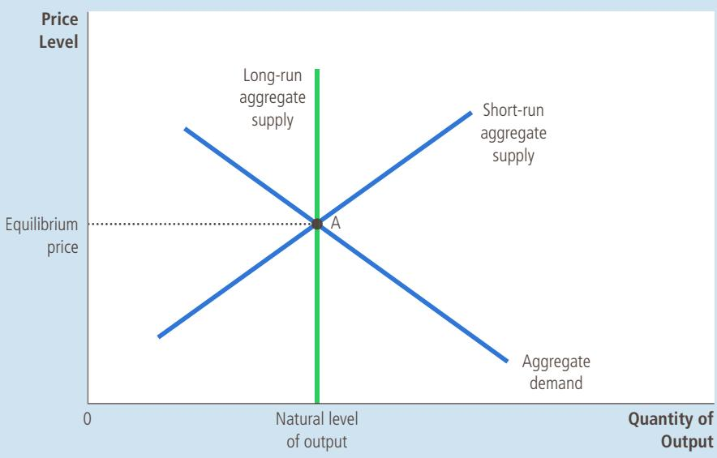
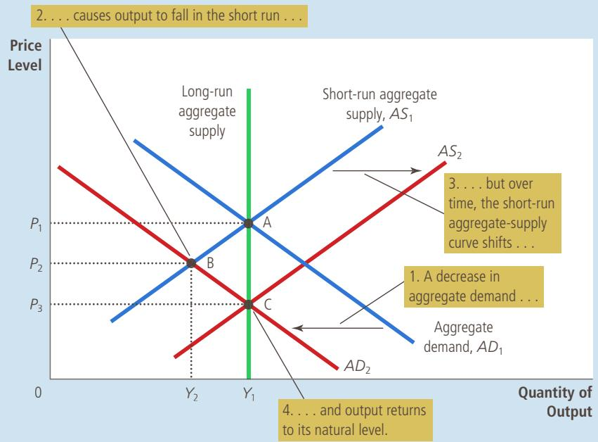
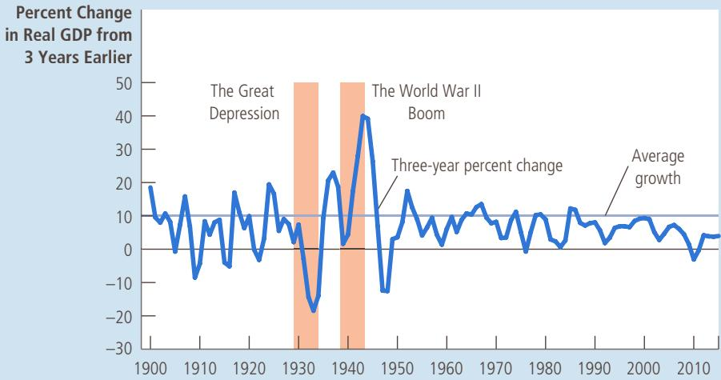
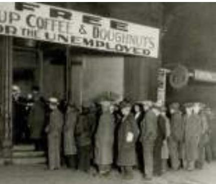

## FIGURE 6

The Short-Run Aggregate-Supply Curve In the short run, a fall in the price level from $P _ { 1 }$ to $P _ { 2 }$ reduces the quantity of output supplied from $Y _ { 1 }$ to $Y _ { 2 } .$ This positive relationship could be due to sticky wages, sticky prices, or misperceptions. Over time, wages, prices, and perceptions adjust, so this positive relationship is only temporary.

aggregate-supply curve. In each theory, a specific market imperfection causes the supply side of the economy to behave differently in the short run than it does in the long run. The following theories differ in their details, but they share a common theme: The quantity of output supplied deviates from its long-run, or natural, level when the actual price level in the economy deviates from the price level that people expected to prevail. When the price level rises above the level that people expected, output rises above its natural level, and when the price level falls below the expected level, output falls below its natural level.

The Sticky-Wage Theory The first explanation of the upward slope of the shortrun aggregate-supply curve is the sticky-wage theory. This theory is the simplest of the three approaches to aggregate supply, and some economists believe it highlights the most important reason why the economy in the short run differs from the economy in the long run. Therefore, it is the theory of short-run aggregate supply that we emphasize in this book.

According to this theory, the short-run aggregate-supply curve slopes upward because nominal wages are slow to adjust to changing economic conditions. In other words, wages are “sticky” in the short run. To some extent, the slow adjustment of nominal wages is attributable to long-term contracts between workers and firms that fix nominal wages, sometimes for as long as 3 years. In addition, this prolonged adjustment may be attributable to slowly changing social norms and notions of fairness that influence wage setting.

An example can help explain how sticky nominal wages can result in a shortrun aggregate-supply curve that slopes upward. Imagine that a year ago a firm expected the price level today to be 100, and based on this expectation, it signed a contract with its workers agreeing to pay them, say, \$20 an hour. In fact, the price level turns out to be only 95. Because prices have fallen below expectations, the firm gets 5 percent less than expected for each unit of its product that it sells. The cost of labor used to make the output, however, is stuck at \$20 per hour. Production is now less profitable, so the firm hires fewer workers and reduces the quantity of output supplied. Over time, the labor contract will expire, and the firm can renegotiate with its workers for a lower wage (which they may accept because prices are lower), but in the meantime, employment and production will remain below their long-run levels.

The same logic works in reverse. Suppose the price level turns out to be 105 and the wage remains stuck at \$20. The firm sees that the amount it is paid for each unit sold is up by 5 percent, while its labor costs are not. In response, it hires more workers and increases the quantity of output supplied. Eventually, the workers will demand higher nominal wages to compensate for the higher price level, but for a while, the firm can take advantage of the profit opportunity by increasing employment and production above their long-run levels.

In short, according to the sticky-wage theory, the short-run aggregate-supply curve slopes upward because nominal wages are based on expected prices and do not respond immediately when the actual price level turns out to be different from what was expected. This stickiness of wages gives firms an incentive to produce less output when the price level turns out lower than expected and to produce more when the price level turns out higher than expected.

The Sticky-Price Theory Some economists have advocated another approach to explaining the upward slope of the short-run aggregate-supply curve, called the sticky-price theory. As we just discussed, the sticky-wage theory emphasizes that nominal wages adjust slowly over time. The sticky-price theory emphasizes that the prices of some goods and services also adjust sluggishly in response to changing economic conditions. This slow adjustment of prices occurs in part because there are costs to adjusting prices, called menu costs. These menu costs include the cost of printing and distributing catalogs and the time required to change price tags. As a result of these costs, prices as well as wages may be sticky in the short run.

To see how sticky prices explain the aggregate-supply curve’s upward slope, suppose that each firm in the economy announces its prices in advance based on the economic conditions it expects to prevail over the coming year. Suppose further that after prices are announced, the economy experiences an unexpected contraction in the money supply, which (as we have learned) will reduce the overall price level in the long run. What happens in the short run? Although some firms reduce their prices quickly in response to the unexpected change in economic conditions, many other firms want to avoid additional menu costs. As a result, they temporarily lag behind in cutting their prices. Because these lagging firms have prices that are too high, their sales decline. Declining sales, in turn, cause these firms to cut back on production and employment. In other words, because not all prices adjust immediately to changing conditions, an unexpected fall in the price level leaves some firms with higher-than-desired prices, and these higher-than-desired prices depress sales and induce firms to reduce the quantity of goods and services they produce.

Similar reasoning applies when the money supply and price level turn out to be above what firms expected when they originally set their prices. While some firms raise their prices quickly in response to the new economic environment, other firms lag behind, keeping their prices at the lower-than-desired levels. These low prices attract customers, which induces these firms to increase employment and production. Thus, during the time these lagging firms are operating with outdated prices, there is a positive association between the overall price level and the quantity of output. This positive association is represented by the upward slope of the short-run aggregate-supply curve.

The Misperceptions Theory A third approach to explaining the upward slope of the short-run aggregate-supply curve is the misperceptions theory. According to this theory, changes in the overall price level can temporarily mislead suppliers about what is happening in the individual markets in which they sell their output. As a result of these short-run misperceptions, suppliers respond to changes in the level of prices, and this response leads to an upward-sloping aggregate-supply curve.

To see how this might work, suppose the overall price level falls below the level that suppliers expected. When suppliers see the prices of their products fall, they may mistakenly believe that their relative prices have fallen; that is, they may believe that their prices have fallen compared to other prices in the economy. For example, wheat farmers may notice a fall in the price of wheat before they notice a fall in the prices of the many items they buy as consumers. They may infer from this observation that the reward for producing wheat is temporarily low, and they may respond by reducing the quantity of wheat they supply. Similarly, workers may notice a fall in their nominal wages before they notice that the prices of the goods they buy are also falling. They may infer that the reward for working is temporarily low and respond by reducing the quantity of labor they supply. In both cases, a lower price level causes misperceptions about relative prices, and these misperceptions induce suppliers to respond to the lower price level by decreasing the quantity of goods and services supplied.

Similar misperceptions arise when the price level is above what was expected. Suppliers of goods and services may notice the price of their output rising and infer, mistakenly, that their relative prices are rising. They would conclude that it is a good time to produce. Until their misperceptions are corrected, they respond to the higher price level by increasing the quantity of goods and services supplied. This behavior results in a short-run aggregate-supply curve that slopes upward.

Summing Up There are three alternative explanations for the upward slope of the short-run aggregate-supply curve: (1) sticky wages, (2) sticky prices, and (3) misperceptions about relative prices. Economists debate which of these theories is correct, and it is possible that each contains an element of truth. For our purposes in this book, the similarities of the theories are more important than the differences. All three theories suggest that output deviates in the short run from its natural level when the actual price level deviates from the price level that people had expected to prevail. We can express this mathematically as follows:

$$
\begin{array}{l l l} \text {Quantity} & = & \text {Natural} \\ \text {of output} & = & \text {level of} \\ \text {supplied} & & \text {output} \end{array} + a \left( \begin{array}{c c c} \text {Actual} & & \text {Expected} \\ \text {price} & - & \text {price} \\ \text {level} & & \text {level} \end{array} \right)
$$

where a is a number that determines how much output responds to unexpected changes in the price level.

Notice that each of the three theories of short-run aggregate supply emphasizes a problem that is likely to be temporary. Whether the upward slope of the aggregate-supply curve is attributable to sticky wages, sticky prices, or misperceptions, these conditions will not persist forever. Over time, nominal wages will become unstuck, prices will become unstuck, and misperceptions about relative prices will be corrected. In the long run, it is reasonable to assume that wages and prices are flexible rather than sticky and that people are not confused about relative prices. Thus, while we have several good theories to explain why the short-run aggregate-supply curve slopes upward, they are all consistent with a long-run aggregate-supply curve that is vertical.

## 20-4e Why the Short-Run Aggregate-Supply Curve Might Shift

The short-run aggregate-supply curve tells us the quantity of goods and services supplied in the short run for any given level of prices. This curve is similar to the longrun aggregate-supply curve, but it is upward-sloping rather than vertical because of sticky wages, sticky prices, and misperceptions. Thus, when thinking about what shifts the short-run aggregate-supply curve, we have to consider all those variables that shift the long-run aggregate-supply curve. In addition, we have to consider a new variable—the expected price level—that influences the wages that are stuck, the prices that are stuck, and the perceptions about relative prices that may be flawed.

Let’s start with what we know about the long-run aggregate-supply curve. As we discussed earlier, shifts in the long-run aggregate-supply curve normally arise from changes in labor, capital, natural resources, or technological knowledge. These same variables shift the short-run aggregate-supply curve. For example, when an increase in the economy’s capital stock increases productivity, the economy is able to produce more output, so both the long-run and short-run aggregate-supply curves shift to the right. When an increase in the minimum wage raises the natural rate of unemployment, the economy has fewer employed workers and thus produces less output, so both the long-run and short-run aggregate-supply curves shift to the left.

The important new variable that affects the position of the short-run aggregate-supply curve is the price level that people expected to prevail. As we have discussed, the quantity of goods and services supplied depends, in the short run, on sticky wages, sticky prices, and misperceptions. Yet wages, prices, and perceptions are set based on the expected price level. So when people change their expectations of the price level, the short-run aggregate-supply curve shifts.

To make this idea more concrete, let’s consider a specific theory of aggregate supply—the sticky-wage theory. According to this theory, when workers and firms expect the price level to be high, they are likely to reach a bargain with a higher level of nominal wages. Higher wages raise firms’ costs, and for any given actual price level, higher costs reduce the quantity of goods and services supplied. Thus, when the expected price level rises, wages are higher, costs increase, and firms produce a smaller quantity of goods and services at any given actual price level. Thus, the short-run aggregate-supply curve shifts to the left. Conversely, when the expected price level falls, wages are lower, costs decline, firms increase output at any given price level, and the short-run aggregate-supply curve shifts to the right.

A similar logic applies in each theory of aggregate supply. The general lesson is the following: An increase in the expected price level reduces the quantity of goods and services supplied and shifts the short-run aggregate-supply curve to the left. A decrease in the expected price level raises the quantity of goods and services supplied and shifts the shortrun aggregate-supply curve to the right. As we will see in the next section, the influence of expectations on the position of the short-run aggregate-supply curve plays a key role in explaining how the economy makes the transition from the short run to the long run. In the short run, expectations are fixed and the economy finds itself at the intersection of the aggregate-demand curve and the short-run aggregate-supply curve. In the long run, if people observe that the price level is different from what they expected, their expectations adjust and the short-run aggregate-supply curve shifts. This shift ensures that the economy eventually finds itself at the intersection of the aggregate-demand curve and the long-run aggregate-supply curve.

You should now have some understanding about why the short-run aggregatesupply curve slopes upward and what events and policies can cause this curve to shift. Table 2 summarizes our discussion.

## Why Does the Short-Run Aggregate-Supply Curve Slope Upward?

## TABLE 2

1. The Sticky-Wage Theory: An unexpectedly low price level raises the real wage, which causes firms to hire fewer workers and produce a smaller quantity of goods and services.

2. The Sticky-Price Theory: An unexpectedly low price level leaves some firms with higherthan-desired prices, which depresses their sales and leads them to cut back production.

The Short-Run Aggregate-Supply Curve: Summary

3. The Misperceptions Theory: An unexpectedly low price level leads some suppliers to think their relative prices have fallen, which induces a fall in production.

## Why Might the Short-Run Aggregate-Supply Curve Shift?

1. Shifts Arising from Changes in Labor: An increase in the quantity of labor available (perhaps due to a fall in the natural rate of unemployment) shifts the aggregate-supply curve to the right. A decrease in the quantity of labor available (perhaps due to a rise in the natural rate of unemployment) shifts the aggregate-supply curve to the left.

2. Shifts Arising from Changes in Capital: An increase in physical or human capital shifts the aggregate-supply curve to the right. A decrease in physical or human capital shifts the aggregate-supply curve to the left.

3. Shifts Arising from Changes in Natural Resources: An increase in the availability of natural resources shifts the aggregate-supply curve to the right. A decrease in the availability of natural resources shifts the aggregate-supply curve to the left.

4. Shifts Arising from Changes in Technology: An advance in technological knowledge shifts the aggregate-supply curve to the right. A decrease in the available technology (perhaps due to government regulation) shifts the aggregate-supply curve to the left.

5. Shifts Arising from Changes in the Expected Price Level: A decrease in the expected price level shifts the short-run aggregate-supply curve to the right. An increase in the expected price level shifts the short-run aggregate-supply curve to the left.

## QuickQuiz

Explain why the long-run aggregate-supply curve is vertical. • Explain three theories for why the short-run aggregate-supply curve slopes upward.

• What variables shift both the long-run and short-run aggregate-supply curves? • What variable shifts the short-run aggregate-supply curve but not the long-run aggregate-supply curve?

## 20-5 Two Causes of Economic Fluctuations

Now that we have introduced the model of aggregate demand and aggregate supply, we have the basic tools we need to analyze fluctuations in economic activity. In particular, we can use what we have learned about aggregate demand and aggregate supply to examine the two basic causes of short-run fluctuations : shifts in aggregate demand and shifts in aggregate supply.

To keep things simple, we assume the economy begins in long-run equilibrium, as shown in Figure 7. Output and the price level are determined in the long run by the intersection of the aggregate-demand curve and the long-run aggregatesupply curve, shown as point A in the figure. At this point, output is at its natural level. Because the economy is always in a short-run equilibrium, the short-run aggregate-supply curve passes through this point as well, indicating that the expected price level has adjusted to this long-run equilibrium. That is, when an economy is in its long-run equilibrium, the expected price level must equal the actual price level so that the intersection of aggregate demand with short-run

## FIGURE 7

## The Long-Run Equilibrium

The long-run equilibrium of the economy is found where the aggregatedemand curve crosses the long-run aggregate-supply curve (point A). When the economy reaches this long-run equilibrium, the expected price level will have adjusted to equal the actual price level. As a result, the short-run aggregate-supply curve crosses this point as well.

aggregate supply is the same as the intersection of aggregate demand with longrun aggregate supply.

## 20-5a The Effects of a Shift in Aggregate Demand

Suppose that a wave of pessimism suddenly overtakes the economy. The cause might be a scandal in the White House, a crash in the stock market, or the outbreak of war overseas. Because of this event, many people lose confidence in the future and alter their plans. Households cut back on their spending and delay major purchases, and firms put off buying new equipment.

What is the macroeconomic impact of such a wave of pessimism? In answering this question, we can follow the three steps we used in Chapter 4 when analyzing supply and demand in specific markets. First, we determine whether the event affects aggregate demand or aggregate supply. Second, we determine the direction that the curve shifts. Third, we use the diagram of aggregate demand and aggregate supply to compare the initial and the new equilibrium. The new wrinkle is that we need to add a fourth step: We have to keep track of a new shortrun equilibrium, a new long-run equilibrium, and the transition between them. Table 3 summarizes the four steps to analyzing economic fluctuations.

## TABLE 3

Four Steps for Analyzing Macroeconomic Fluctuations

1. Decide whether the event shifts the aggregate-demand curve or the aggregate-supply curve (or perhaps both).

2. Decide the direction in which the curve shifts.

3. Use the diagram of aggregate demand and aggregate supply to determine the impact on output and the price level in the short run.

4. Use the diagram of aggregate demand and aggregate supply to analyze how the economy moves from its new short-run equilibrium to its new long-run equilibrium.

## FIGURE 8

## A Contraction in Aggregate Demand

A fall in aggregate demand is represented with a leftward shift in the aggregatedemand curve from $A D _ { 1 }$ to $A D _ { 2 } .$ In the short run, the economy moves from point A to point B. Output falls from $Y _ { \tau }$ to $Y _ { 2 } ,$ and the price level falls from $P _ { 1 }$ to $P _ { 2 } .$ Over time, as the expected price level adjusts, the short-run aggregate-supply curve shifts to the right from $A S _ { \ l _ { 1 } }$ to $A S _ { \gamma }$ and the economy reaches point $\complement ,$ where the new aggregatedemand curve crosses the long-run aggregate-supply curve. In the long run, the price level falls to $P _ { 3 } ,$ and output returns to its natural level, $Y _ { 1 } .$

The first two steps are straightforward. First, because the wave of pessimism affects spending plans, it affects the aggregate-demand curve. Second, because households and firms now want to buy a smaller quantity of goods and services for any given price level, the event reduces aggregate demand. As Figure 8 shows, the aggregate-demand curve shifts to the left from $A D _ { \ u _ { 1 } }$ to $A D _ { 2 }$

With this figure, we can perform step three: By comparing the initial and the new equilibrium, we can see the effects of the fall in aggregate demand. In the short run, the economy moves along the initial short-run aggregate-supply curve, $A S _ { 1 } ,$ going from point A to point B. As the economy moves between these two points, output falls from $Y _ { 1 }$ to $Y _ { 2 }$ and the price level falls from $P _ { \uparrow }$ to $P _ { 2 } .$ . The falling level of output indicates that the economy is in a recession. Although not shown in the figure, firms respond to lower sales and production by reducing employment. Thus, the pessimism that caused the shift in aggregate demand is, to some extent, self-fulfilling: Pessimism about the future leads to falling incomes and rising unemployment.

Now comes step four—the transition from the short-run equilibrium to the new long-run equilibrium. Because of the reduction in aggregate demand, the price level initially falls from $P _ { 1 }$ to $P _ { 2 } .$ The price level is thus below the level that people were expecting $( P _ { 1 } )$ before the sudden fall in aggregate demand. People can be surprised in the short run, but they will not remain surprised. Over time, their expectations catch up with this new reality, and the expected price level falls as well. The fall in the expected price level alters wages, prices, and perceptions, which in turn influences the position of the short-run aggregate-supply curve. For example, according to the sticky-wage theory, once workers and firms come to expect a lower level of prices, they start to strike bargains for lower nominal wages; the reduction in labor costs encourages firms to hire more workers and expand production at any given level of prices. Thus, the fall in the expected price level shifts the short-run aggregate-supply curve to the right from $A S _ { \ l _ { 1 } }$ to $A S _ { 2 }$ in Figure 8. This shift allows the economy to approach point $C ,$ where the new aggregate-demand curve $( A D _ { 2 } )$ crosses the long-run aggregate-supply curve.

In the new long-run equilibrium, point C, output is back to its natural level. The economy has corrected itself: The decline in output is reversed in the long run, even without action by policymakers. Although the wave of pessimism has reduced aggregate demand, the price level has fallen sufficiently (to $P _ { 3 } )$ to offset the shift in the aggregate-demand curve, and people have come to expect this new lower price level as well. Thus, in the long run, the shift in aggregate demand is reflected fully in the price level and not at all in the level of output. In other words, the long-run effect of a shift in aggregate demand is a nominal change (the price level is lower) but not a real change (output is the same).

What should policymakers do when faced with a sudden fall in aggregate demand? In this analysis, we assumed they did nothing. Another possibility is that, as soon as the economy heads into recession (moving from point A to point B), policymakers could take action to increase aggregate demand. As we noted earlier, an increase in government spending or an increase in the money supply would increase the quantity of goods and services demanded at any price and, therefore, would shift the aggregate-demand curve to the right. If policymakers act with sufficient speed and precision, they can offset the initial shift in aggregate demand, return the aggregate-demand curve to $A D _ { 1 ^ { \prime } }$ and bring the economy back to point A. If the policy is successful, the painful period of depressed output and employment can be reduced in length and severity. The next chapter discusses in more detail the ways in which monetary and fiscal policy influence aggregate demand, as well as some of the practical difficulties in using these policy instruments.

To sum up, this story about shifts in aggregate demand has three important lessons:

•	 In the short run, shifts in aggregate demand cause fluctuations in the economy’s output of goods and services.

•	 In the long run, shifts in aggregate demand affect the overall price level but do not affect output.

•	 Because policymakers influence aggregate demand, they can potentially mitigate the severity of economic fluctuations.

## FYI

## Monetary Neutrality Revisited

ccording to classical economic theory, money is neutral. That is, changes in the quantity of money affect nominal variables such as the price level but not real variables such as output. Earlier in this chapter, we noted that most economists accept this conclusion as a description of how the economy works in the long run but not in the short run. With the model of aggregate demand and aggregate supply, we can illustrate this conclusion and explain it more fully.

Suppose that the Federal Reserve reduces the quantity of money in the economy. What effect does this change have? As we discussed, the money supply is one determinant of aggregate demand. The reduction in the money supply shifts the aggregate-demand curve to the left.

The analysis looks just like Figure 8. Even though the cause of the shift in aggregate demand is different, we would observe the same effects on output and the price level. In the short run, both output and the price level fall. The economy experiences a recession. But over time, the expected price level falls as well. Firms and workers respond to their new expectations by, for instance, agreeing to lower nominal wages. As they do so, the short-

run aggregate-supply curve shifts

to the right. Eventually, the economy finds itself back on the long-run aggregate-supply curve.

Figure 8 shows when money matters for real variables and when it does not. In the long run, money is neutral, as represented by the movement of the economy from point A to point C. But in the short run, a change in the money supply has real effects, as represented by the movement of the economy from point A to point B. An old saying summarizes the analysis: “Money is a veil, but when the veil flutters, real output sputters.”

At the beginning of this chapter, we established three key facts about economic fluctuations by looking at data since 1972. Let’s now take a longer look at U.S. economic history. Figure 9 shows data since 1900

on the percentage change in real GDP over the previous 3 years. In an average 3-year period, real GDP grows about 10 percent—a bit more than 3 percent per year. The business cycle, however, causes fluctuations around this average. Two episodes jump out as being particularly significant: the large drop in real GDP in the early 1930s and the large increase in real GDP in the early 1940s. Both of these events are attributable to shifts in aggregate demand.

The economic calamity of the early 1930s is called the Great Depression, and it is by far the largest economic downturn in U.S. history. Real GDP fell by 27 percent from 1929 to 1933, and unemployment rose from 3 percent to 25 percent. At the same time, the price level fell by 22 percent over these 4 years. Many other countries experienced similar declines in output and prices during this period.

Economic historians continue to debate the causes of the Great Depression, but most explanations center on a large decline in aggregate demand. What caused aggregate demand to contract? Here is where the disagreement arises.

Many economists place primary blame on the decline in the money supply: From 1929 to 1933, the money supply fell by 28 percent. As you may recall from our discussion of the monetary system, this decline in the money supply was due to problems in the banking system. As households withdrew their money from financially shaky banks and bankers became more cautious and started holding greater reserves, the process of money creation under fractional-reserve banking went into reverse. The Fed, meanwhile, failed to offset this fall in the money multiplier with expansionary open-market operations. As a result, the money supply declined. Many economists blame the Fed’s failure to act for the Great Depression’s severity.

Over the course of U.S. economic history, two fluctuations stand out as especially large. During the early 1930s, the economy went through the Great Depression, when the production of goods and services plummeted. During the early 1940s, the United States entered World War II and the economy experienced rapidly rising production. Both of these events are usually explained by large shifts in aggregate demand.

## FIGURE 9

U.S. Real GDP Growth since 1900

S o u rc e : Louis D. Johnston and Samuel H. Williamson, “What Was GDP Then?” http://www.measuringworth.com/usgdp/; Department of Commerce (Bureau of Economic Analysis).

  
The outcome of a massive decrease in aggregate demand  
BETTMANN/CORBIS

Other economists have suggested alternative reasons for the collapse in aggregate demand. For example, stock prices fell about 90 percent during this period, depressing household wealth and thereby consumer spending. In addition, the banking problems may have prevented some firms from obtaining the financing they wanted for new projects and business expansions, reducing investment spending. It is possible that all these forces may have acted together to contract aggregate demand during the Great Depression.

The second significant episode in Figure 9—the economic boom of the early 1940s—is easier to explain. The cause of this event was World War II. As the United States entered the war overseas, the federal government had to devote more resources to the military. Government purchases of goods and services increased almost fivefold from 1939 to 1944. This huge expansion in aggregate demand almost doubled the economy’s production of goods and services and led to a 20 percent increase in the price level (although widespread government price controls limited the rise in prices). Unemployment fell from 17 percent in 1939 to about 1 percent in 1944—the lowest level in U.S. history. ●

## THE GREAT RECESSION OF 2008–2009

In 2008 and 2009, the U.S. economy experienced a financial crisis and a severe downturn in economic activity. In many ways, it was the worst macroeconomic event in more than half a century.

The story of this downturn begins a few years earlier with a substantial boom in the housing market. The boom was, in part, fueled by low interest rates. In the aftermath of the recession of 2001, the Federal Reserve lowered interest rates to historically low levels. Low interest rates helped the economy recover, but by making it less expensive to get a mortgage and buy a home, they also contributed to a rise in housing prices.

In addition to low interest rates, various developments in the mortgage market made it easier for subprime borrowers—those borrowers with a higher risk of default based on their income and credit history—to get loans to buy homes. One development was securitization, the process by which a financial institution (specifically, a mortgage originator) makes loans and then (with the help of an investment bank) bundles them together into financial instruments called mortgage-backed securities. These mortgage-backed securities were then sold to other institutions (such as banks and insurance companies), which may not have fully appreciated the risks in these securities. Some economists blame inadequate regulation for these high-risk loans. Others blame misguided government policy: Certain policies encouraged this highrisk lending to make the goal of homeownership more attainable for low-income families. Together, these many forces drove up housing demand and housing prices. From 1995 to 2006, average housing prices in the United States more than doubled.

The high price of housing, however, proved unsustainable. From 2006 to 2009, housing prices nationwide fell about 30 percent. Such price fluctuations should not necessarily be a problem in a market economy. After all, price movements are how markets equilibrate supply and demand. In this case, however, the price decline had two related repercussions that caused a sizable fall in aggregate demand.

The first repercussion was a substantial rise in mortgage defaults and home foreclosures. During the housing boom, many homeowners had bought their homes with mostly borrowed money and minimal down payments. When housing prices declined, these homeowners were underwater (they owed more on their mortgages than their homes were worth). Many of these homeowners stopped repaying their loans. The banks servicing the mortgages responded to these defaults by taking the houses away in foreclosure procedures and then selling them off. The banks goal was to recoup whatever they could from the bad loans. As you might have expected from your study of supply and demand, the increase in the number of homes for sale exacerbated the downward spiral of house prices. As house prices fell, spending on the construction of housing also collapsed.

A second repercussion was that the various financial institutions that owned mortgage-backed securities suffered huge losses. In essence, by borrowing large sums to buy high-risk mortgages, these companies had bet that house prices would keep rising; when this bet turned bad, they found themselves at or near the point of bankruptcy. Because of these large losses, many financial institutions did not have funds to loan out and the ability of the financial system to channel resources to those who could best use them was impaired. Even creditworthy customers found themselves unable to borrow to finance investment spending.

As a result of all these events, the economy experienced a large contractionary shift in aggregate demand. Real GDP and employment both fell sharply. The introduction to this chapter has already cited the figures, but they are worth repeating: Real GDP declined by 4.2 percent between the fourth quarter of 2007 and the second quarter of 2009, and the rate of unemployment rose from 4.4 percent in May 2007 to 10.0 percent in October 2009. This experience served as a vivid reminder that deep economic downturns and personal hardship they cause are not a relic of history but a constant risk in the modern economy.

As the crisis unfolded, the U.S. government responded in a variety of ways. Three policy actions—all aimed in part at returning aggregate demand to its previous level—are most noteworthy.

First, the Fed cut its target for the federal funds rate from 5.25 percent in September 2007 to about zero in December 2008. The Federal Reserve also started buying mortgage-backed securities and other private loans in open-market operations. By purchasing these instruments from the banking system, the Fed provided banks with additional funds in the hope that the banks would makes loans more readily available.

Second, in an even more unusual move in October 2008, Congress appropriated \$700 billion for the Treasury to use to rescue the financial system. Much of this money was used for equity injections into banks. That is, the Treasury put funds into the banking system, which the banks could use to make loans and otherwise continue their normal operations; in exchange for these funds, the U.S. government became a part owner of these banks, at least temporarily. The goal of this policy was to stem the crisis on Wall Street and make it easier for businesses and individuals to obtain loans.

Finally, when Barack Obama became president in January 2009, his first major initiative was a large increase in government spending. After a relatively brief congressional debate over the form of the legislation, the new president signed a \$787 billion stimulus bill on February 17, 2009. This policy move is discussed more fully in the next chapter when we consider the impact of fiscal policy on aggregate demand.

The recovery from this recession officially began in June 2009. But it was, by historical standards, only a meager recovery. From the second quarter of 2009 to the fourth quarter of 2015, real GDP growth averaged only 2.1 percent per year, well below the average rate of growth over the past half century of about 3 percent. Although unemployment fell to 5.0 percent by the end of 2015, much of the decline was attributable to individuals leaving the labor force rather than finding jobs. In December 2015, the employment-to-population ratio was only 1.3 percentage points higher than at its trough during the Great Recession and was more than 3 percentage points lower than before the downturn began.

Which, if any, of the many policy moves were most important for ending the recession? And what other policies might have promoted a more robust recovery? These are surely questions that macroeconomic historians will debate in the years to come. ●

## IN THE NEWS

## What Have We Learned?

Since the financial crisis and Great Recession of 2008–2009, economists have asked themselves how this episode should change the field of macroeconomics.

## Olivier Blanchard’s Five Lessons for Economists from the Financial Crisis

By David Wessel

deepest recession in 75 years teach academic economists and policymakers on whose watch it happened? At a recent London School of Economics forum, convened to honor Bank of England Governor Mervyn King, Olivier Blanchard offered some answers.

Mr. Blanchard, 64 years old, is well positioned to offer such reconsideration. An internationally prominent macroeconomist, he spent 25 years on the MIT faculty before becoming chief economist at the International Monetary Fund in September 2008, just before the collapse of Lehman Brothers.

Here are Mr. Blanchard’s five lessons in his own words, lightly edited by The Wall Street Journal’s David Wessel:

## #1: Humility is in order.

The Great Moderation [the economically tranquil period from 1987 to 2007] convinced too many of us that the large-economy crisis—a nancial crisis, a banking crisis— was a thing of the past. It wasn’t going to happen again, except maybe in emerging markets. History was marching on.

My generation, which was born after World War II, lived with the notion that the world was getting to be a better and better place. We knew how to do things better, not only in economics but in other elds as well. What we have learned is that’s not true. History repeats itself. We should have known.

## #2: The nancial system matters— a lot.

It’s not the rst time that we’re confronted with what [former U.S. Defense Secretary Donald] Rumsfeld called “unknown unknowns,” things that happened that we hadn’t thought about. There is another example in macroeconomics:

The oil shocks of the 1970s during which we were students and we hadn’t thought about it. It took a few years, more than a few years, for economists to understand what was going on. After a few years, we concluded that we could think of the oil shock as yet another macroeconomic shock. We did not need to understand the plumbing. We didn’t need to understand the details of the oil market. When there’s an increase in the price of energy or materials, we can just integrate it into our macro models—the implications of energy prices on ination and so on.

This is different. What we have learned about the nancial system is that the problem is in the plumbing and that we have to understand the plumbing. Before I came to the Fund, I thought of the nancial system as a set of arbitrage equations. Basically the Federal Reserve would choose one interest rate, and then the expectations hypothesis would give all the rates everywhere else with premia which might vary, but not very much.

It was really easy. I thought of people on Wall Street as basically doing this for me so I didn’t have to think about it.

What we have learned is that that’s not the case. In the nancial system, a myriad of distortions or small shocks build on each other. When there are enough small shocks, enough distortions, things can go very bad. This has fundamental implications for macroeconomics. We do macro on the assumption that we can look at aggregates in some way and then just have them interact in simple models. I still think that’s the way to go, but this shows the limits of that approach. When it comes to the nancial system, it’s very clear that the details of the plumbing matter.

## #3 Interconnectedness matters.

This crisis started in the U.S. and across the ocean in a matter of days and weeks. Each crisis, even in small islands, potentially has effects on the rest of the world. The complexity of the cross border claims by creditors and by debtors clearly is something that many of us had not fully realized: the cross border movements triggered by the risk-on/risk-off movements, which countries are safe havens, and when and why? Understanding this has become absolutely essential. What happens in one part of the world cannot be ignored by the rest of the world. The fact that we all spend so

## 20-5b The Effects of a Shift in Aggregate Supply

Imagine once again an economy in its long-run equilibrium. Now suppose that suddenly some firms experience an increase in their costs of production. For example, bad weather in farm states might destroy some crops, driving up the

much time thinking about Cyprus in the last few days is an example of that.

It’s also true on the trade side. We used to think if one country was doing badly, then exports to that country would do badly and therefore the exporting countries would do badly. In our models, the effect was relatively small. One absolutely striking fact of the crisis is the collapse of trade in 2009. Output went down. Trade collapsed. Countries which felt they were not terribly exposed through trade turned out to be enormously exposed.

## #4 We don’t know if macro-prudential tools work.

It’s very clear that the traditional monetary and scal tools are just not good enough to deal with the very specic problems in the nancial system. This has led to the development of macro-prudential tools, which may or may not become the third leg of macroeconomic policies.

[Macro-prudential tools allow a central bank to restrain lending in specic sectors without raising interest rates for the whole economy, such as increasing the minimum down payment required to get a mortgage, which reduces the loan-to-value ratio.] In principle, they can address specic issues in the nancial sector. If there is a problem somewhere you can target the tool at the problem and not use the policy interest rate, which basically is kind of an atomic bomb without any precision.

The big question here is: How reliable are these tools? How much can they be used? The answer—from some experiments before the crisis with loan-to-value ratios and during the crisis with variations in cyclical bank capital ratios or loan-to-value ratios or capital controls, such as in Brazil—is this: They work but they don’t work great. People and institutions nd ways around them. In the process of reducing the problem somewhere you tend to create distortions elsewhere.

## #5 Central bank independence wasn’t designed for what central banks are now asked to do.

There is two-way interaction between monetary policy and macro-prudential tools. When [Fed chair] Ben Bernanke does expansionary monetary policy, quantitative easing, and interest rates on many assets

  
MANDELNGAN/AFP/GETTYIMAGES  
Olivier Blanchard

are close to zero, there’s a tendency by many players to take risks to increase their rate of return. Some of this risk actually we want them to take. Some we don’t want them to take. That is the interaction of monetary policy on the nancial system.

You also have it the other way around. If you use macro-prudential tools to, say, slow down the building in the housing sector you have an effect on aggregate demand, which is going to decrease output.

The question is: How do you organize the use of these tools? It makes sense to have them under the same roof. In practice this means the central bank. But that poses questions not only about coordination between the two functions, but also about central bank independence.

One of the major achievements of the last 20 years is that most central banks have become independent of elected governments. Independence was given because the mandate and the tools were very clear. The mandate was primarily ination, which can be observed over time. The tool was some short-term interest rate that could be used by the central bank to try to achieve the ination target. In this case, you can give some independence to the institution in charge of this because the objective is perfectly well dened, and everybody can basically observe how well the central bank does..

If you think now of central banks as having a much larger set of responsibilities and a much larger set of tools, then the issue of central bank independence becomes much more difcult. Do you actually want to give the central bank the independence to choose loanto-value ratios without any supervision from the political process? Isn’t this going to lead to a democratic decit in a way in which the central bank becomes too powerful? I’m sure there are ways out. Perhaps there could be independence with respect to some dimensions of monetary policy—the traditional ones— and some supervision for the rest or some interaction with a political process. ■

Source: Republished with permission of The Wall Street Journal, from, “What Have We Learned? The Wall Street Journal, April 1, 2013”; permission conveyed through Copyright Clearance Center, Inc. ”

cost of producing food products. Or a war in the Middle East might interrupt the shipping of crude oil, driving up the cost of producing oil products.

To analyze the macroeconomic impact of such an increase in production costs, we follow the same four steps as always. First, which curve is affected? Because production costs affect the firms that supply goods and services, changes in
