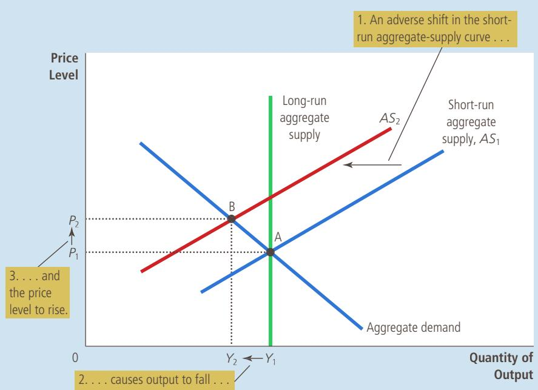
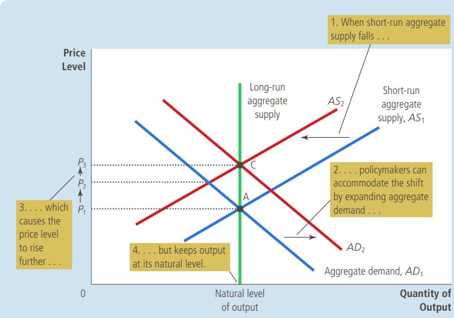

## FIGURE 10

An Adverse Shift in Aggregate Supply When some event increases firms’ costs, the short-run aggregate-supply curve shifts to the left from $A S _ { 1 }$ to $A S _ { 2 } .$ The economy moves from point A to point B. The result is stagflation: Output falls from $Y _ { 1 }$ to $\boldsymbol { Y } _ { 2 } ,$ and the price level rises from $P _ { 1 }$ to $P _ { 2 } .$

stagflation a period of falling output and rising prices

production costs alter the position of the aggregate-supply curve. Second, in which direction does the curve shift? Because higher production costs make selling goods and services less profitable, firms now supply a smaller quantity of output for any given price level. Thus, as Figure 10 shows, the short-run aggregatesupply curve shifts to the left, from $A S _ { 1 }$ to $A S _ { 2 } .$ . (Depending on the event, the longrun aggregate-supply curve might also shift. To keep things simple, however, we will assume that it does not.)

The figure allows us to perform step three of comparing the initial and the new equilibrium. In the short run, the economy goes from point A to point B, moving along the existing aggregate-demand curve. The output of the economy falls from $Y _ { 1 }$ to $Y _ { 2 } ,$ and the price level rises from $P _ { 1 }$ to $P _ { 2 } .$ Because the economy is experiencing both stagnation (falling output) and inflation (rising prices), such an event is sometimes called stagflation.

Now consider step four—the transition from the short-run equilibrium to the long-run equilibrium. According to the sticky-wage theory, the key issue is how stagflation affects nominal wages. Firms and workers may at first respond to the higher level of prices by raising their expectations of the price level and setting higher nominal wages. In this case, firms’ costs will rise yet again, and the shortrun aggregate-supply curve will shift farther to the left, making the problem of stagflation even worse. This phenomenon of higher prices leading to higher wages, in turn leading to even higher prices, is sometimes called a wage-price spiral.

At some point, this spiral of ever-rising wages and prices will slow. The low level of output and employment will put downward pressure on workers’ wages because workers have less bargaining power when unemployment is high. As nominal wages fall, producing goods and services becomes more profitable and the short-run aggregate-supply curve shifts to the right. As it shifts back toward $A S _ { 1 } ,$ the price level falls and the quantity of output approaches its natural level. In

## FIGURE 11

## Accommodating an Adverse Shift in Aggregate Supply

Faced with an adverse shift in aggregate supply from $A S _ { 1 }$ to $A S _ { 2 } ,$ policymakers who can influence aggregate demand might try to shift the aggregate-demand curve to the right from $A D _ { 1 }$ to $A D _ { 2 } .$ The economy would move from point A to point C. This policy would prevent the supply shift from reducing output in the short run, but the price level would permanently rise from $P _ { 1 }$ to $P _ { 3 }$

the long run, the economy returns to point A, where the aggregate-demand curve crosses the long-run aggregate-supply curve.

This transition back to the initial equilibrium assumes, however, that aggregate demand is held constant throughout the process. In the real world, that may not be the case. Policymakers who control monetary and fiscal policy might attempt to offset some of the effects of the shift in the short-run aggregate-supply curve by shifting the aggregate-demand curve. This possibility is shown in Figure 11. In this case, changes in policy shift the aggregate-demand curve to the right, from $A D _ { 1 }$ to $A D _ { 2 } -$ —exactly enough to prevent the shift in aggregate supply from affecting output. The economy moves directly from point A to point C. Output remains at its natural level, and the price level rises from $P _ { 1 }$ to $P _ { 3 } .$ . In this case, policymakers are said to accommodate the shift in aggregate supply. An accommodative policy accepts a permanently higher level of prices to maintain a higher level of output and employment.

To sum up, this story about shifts in aggregate supply has two important lessons:

•	 Shifts in aggregate supply can cause stagflation—a combination of recession (falling output) and inflation (rising prices).

•	 Policymakers who can influence aggregate demand can potentially mitigate the adverse impact on output but only at the cost of exacerbating the problem of inflation.

## OIL AND THE ECONOMY

CASE Some of the largest economic fluctuations in the U.S. economy since STUDY 1970 have originated in the oil fields of the Middle East. Crude oil is a key input into the production of many goods and services, and much of the world’s oil comes from Saudi Arabia, Kuwait, and other Middle Eastern countries. When some event (usually political in origin) reduces the supply of crude oil flowing from this region, the price of oil rises around the world. Firms in the United States that produce gasoline, tires, and many other products experience rising costs, and they find it less profitable to supply their output of goods and services at any given price level. The result is a leftward shift in the aggregate-supply curve, which in turn leads to stagflation.

The first episode of this sort occurred in the mid-1970s. The countries with large oil reserves got together as members of OPEC, the Organization of the Petroleum Exporting Countries. OPEC is a cartel—a group of sellers that attempts to thwart competition and reduce production to raise prices. And indeed, oil prices rose substantially. From 1973 to 1975, oil approximately doubled in price. Oil-importing countries around the world experienced simultaneous inflation and recession. The U.S. inflation rate as measured by the CPI exceeded 10 percent for the first time in decades. Unemployment rose from 4.9 percent in 1973 to 8.5 percent in 1975.

Almost the same thing happened a few years later. In the late 1970s, the OPEC countries again restricted the supply of oil to raise the price. From 1978 to 1981, the price of oil more than doubled. Once again, the result was stagflation. Inflation, which had subsided somewhat after the first OPEC event, again rose above 10 percent per year. But because the Fed was not willing to accommodate such a large rise in inflation, a recession was soon to follow. Unemployment rose from about 6 percent in 1978 and 1979 to about 10 percent a few years later.

The world market for oil can also be a source of favorable shifts in aggregate supply. In 1986, squabbling broke out among members of OPEC. Member countries reneged on their agreements to restrict oil production. In the world market for crude oil, prices fell by about half. This fall in oil prices reduced costs to U.S. firms, which now found it more profitable to supply goods and services at any given price level. As a result, the aggregate-supply

FYI
