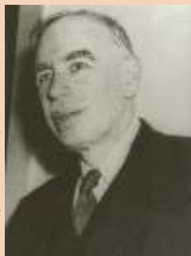

# The Origins of the Model of Aggregate Demand and Aggregate Supply

KEYSTONE/HULTON ARCHIVE/GETTYIMAGES

ow that we have a preliminary understanding of the model of aggregate demand and aggregate supply, it is worthwhile to step back from it and consider its history. How did this model of short-run fluctuations develop? The answer is that this model, to a large extent, is a by-product of the Great Depression of the 1930s. Economists and policymakers at the time were puzzled about what had caused this calamity and were uncertain about how to deal with it.

  
John Maynard Keynes

In 1936, economist John Maynard Keynes published a book titled The General Theory of Employment, Interest, and Money, which attempted to explain short-run economic fluctuations in general and the Great Depression in particular. Keynes’s primary message was that recessions and depressions can occur because of inadequate aggregate demand for goods and services.

Keynes had long been a critic of classical economic theory—the theory we examined earlier in the book—because it could explain only the long-run

effects of policies. A few years before offering The General Theory, Keynes had written the following about classical economics:

The long run is a misleading guide to current affairs. In the long run we are all dead. Economists set themselves too easy, too useless a task if in tempestuous seasons they can only tell us when the storm is long past, the ocean will be flat.

Keynes’s message was aimed at policymakers as well as economists. As the world’s economies suffered with high unemployment, Keynes advocated policies to increase aggregate demand, including government spending on public works.

In the next chapter, we examine in detail how policymakers can use the tools of monetary and fiscal policy to influence aggregate demand. The analysis in the next chapter, as well as in this one, owes much to the legacy of John Maynard Keynes. ■

curve shifted to the right. The U.S. economy experienced the opposite of stagflation: Output grew rapidly, unemployment fell, and the inflation rate reached its lowest level in many years.

In recent years, the world market for oil has not been as important a source of economic fluctuations for the U.S. economy. Part of the reason is that conservation efforts, changes in technology, and the availability of alternative energy sources have reduced the economy’s dependence on oil. The amount of oil used to produce a unit of real GDP has declined by more than 50 percent since the OPEC shocks of the 1970s. As a result, the economic impact of any change in oil prices on the U.S. economy is much smaller today than it was in the past. (Of course, some nations rely on oil exports as a major source of their income, and this makes oil prices crucial for them, but that is another story.) ●

YASSER AL-ZAYYAT/GETTYIMAGES

  
Changes in Middle East oil production are one source of U.S. economic fluctuations.

QuickQuiz Suppose that the election of a popular presidential candidate suddenly increases people’s confidence in the future. Use the model of aggregate demand and aggregate supply to analyze the effect on the economy.

## 20-6 Conclusion

This chapter has achieved two goals. First, we have discussed some of the important facts about short-run fluctuations in economic activity. Second, we have introduced a basic model to explain those fluctuations, called the model of aggregate demand and aggregate supply. We continue our study of this model in the next chapter to understand more fully what causes fluctuations in the economy and how policymakers might respond to these fluctuations.

## CHAPTER QuickQuiz

1. When the economy goes into a recession, real GDP and unemployment a. rises, rises b. rises, falls c. falls, rises d. falls, falls

2. A sudden crash in the stock market shifts

a. the aggregate-demand curve.

b. the short-run aggregate-supply curve, but not the long-run aggregate-supply curve.

c. the long-run aggregate-supply curve, but not the short-run aggregate-supply curve.

d. both the short-run and the long-run aggregate-supply curves.

3. A change in the expected price level shifts

a. the aggregate-demand curve.

b. the short-run aggregate-supply curve, but not the long-run aggregate-supply curve.

c. the long-run aggregate-supply curve, but not the short-run aggregate-supply curve.

d. both the short-run and the long-run aggregate-supply curves.

4. An increase in the aggregate demand for goods and services has a larger impact on output and a larger impact on the price level a. in the short run, in the long run b. in the long run, in the short run c. in the short run, also in the short run d. in the long run, also in the long run

5. Stagflation is caused by a. a leftward shift in the aggregate-demand curve. b. a rightward shift in the aggregate-demand curve. c. a leftward shift in the aggregate-supply curve. d. a rightward shift in the aggregate-supply curve.

6. The idea that economic downturns result from an inadequate aggregate demand for goods and services is derived from the work of which economist? a. Adam Smith b. David Hume c. David Ricardo d. John Maynard Keynes

## SUMMARY

All societies experience short-run economic fluctuations around long-run trends. These fluctuations are irregular and largely unpredictable. When recessions occur, real GDP and other measures of income, spending, and production fall, while unemployment rises.

Classical economic theory is based on the assumption that nominal variables such as the money supply and the price level do not influence real variables such as output and employment. Most economists believe that this assumption is accurate in the long run but not in the short run. Economists analyze short-run economic fluctuations using the model of aggregate demand and aggregate supply. According to this model, the output of goods and services and the overall level of prices adjust to balance aggregate demand and aggregate supply.

The aggregate-demand curve slopes downward for three reasons. The first is the wealth effect: A lower price level raises the real value of households’ money holdings, which stimulates consumer spending. The second is the interest-rate effect: A lower price level reduces the quantity of money households demand; as households try to convert money into interestbearing assets, interest rates fall, which stimulates investment spending. The third is the exchange-rate effect: As a lower price level reduces interest rates, the dollar depreciates in the market for foreign-currency exchange, which stimulates net exports.

Any event or policy that raises consumption, investment, government purchases, or net exports at a given price level increases aggregate demand. Any event or policy that reduces consumption, investment, government purchases, or net exports at a given price level decreases aggregate demand.

The long-run aggregate-supply curve is vertical. In the long run, the quantity of goods and services supplied depends on the economy’s labor, capital, natural resources, and technology but not on the overall level of prices.

Three theories have been proposed to explain the upward slope of the short-run aggregate-supply curve. According to the sticky-wage theory, an unexpected fall in the price level temporarily raises real wages, which induces firms to reduce employment and production. According to the sticky-price theory, an unexpected fall in the price level leaves some firms with prices that are temporarily too high, which reduces their sales and causes them to cut back production. According to the misperceptions theory, an unexpected fall in the price level leads suppliers to mistakenly believe that their relative prices have fallen, which induces them to reduce production. All three theories imply that output deviates from its natural level when the actual price level deviates from the price level that people expected.

Events that alter the economy’s ability to produce output, such as changes in labor, capital, natural resources, or technology, shift the short-run aggregatesupply curve (and may shift the long-run aggregatesupply curve as well). In addition, the position of the short-run aggregate-supply curve depends on the expected price level.

One possible cause of economic fluctuations is a shift in aggregate demand. When the aggregate-demand curve shifts to the left, for instance, output and prices fall in the short run. Over time, as a change in the expected price level causes wages, prices, and perceptions to adjust, the short-run aggregate-supply curve shifts to the right. This shift returns the economy to its natural level of output at a new, lower price level.

A second possible cause of economic fluctuations is a shift in aggregate supply. When the short-run aggregate-supply curve shifts to the left, the effect is falling output and rising prices—a combination called stagflation. Over time, as wages, prices, and perceptions adjust, the short-run aggregate-supply curve shifts back to the right, returning the price level and output to their original levels.

## KEY CONCEPTS

recession, p. 418 depression, p. 418

## QUESTIONS FOR REVIEW

1. Name two macroeconomic variables that decline when the economy goes into a recession. Name one macroeconomic variable that rises during a recession.

2. Draw a diagram with aggregate demand, short-run aggregate supply, and long-run aggregate supply. Be careful to label the axes correctly.

3. List and explain the three reasons the aggregatedemand curve slopes downward.

4. Explain why the long-run aggregate-supply curve is vertical.

5. List and explain the three theories for why the shortrun aggregate-supply curve slopes upward.

6. What might shift the aggregate-demand curve to the left? Use the model of aggregate demand and aggregate supply to trace through the short-run and long-run effects of such a shift on output and the price level.

7. What might shift the aggregate-supply curve to the left? Use the model of aggregate demand and aggregate supply to trace through the short-run and long-run effects of such a shift on output and the price level.

## PROBLEMS AND APPLICATIONS

1. Suppose the economy is in a long-run equilibrium.

a. Draw a diagram to illustrate the state of the economy. Be sure to show aggregate demand, short-run aggregate supply, and long-run aggregate supply.

b. Now suppose that a stock market crash causes aggregate demand to fall. Use your diagram to show what happens to output and the price level in the short run. What happens to the unemployment rate?

c. Use the sticky-wage theory of aggregate supply to explain what will happen to output and the price level in the long run (assuming no change in policy). What role does the expected price level play in this adjustment? Be sure to illustrate your analysis in a graph.

2. Explain whether each of the following events will increase, decrease, or have no effect on long-run aggregate supply.

a. The United States experiences a wave of immigration.

b. Congress raises the minimum wage to \$15 per hour.

c. Intel invents a new and more powerful computer chip.

d. A severe hurricane damages factories along the East Coast.

3. Suppose an economy is in long-run equilibrium.

a. Use the model of aggregate demand and aggregate supply to illustrate the initial equilibrium (call it point A). Be sure to include both short-run and long-run aggregate supply.

b. The central bank raises the money supply by 5 percent. Use your diagram to show what happens to output and the price level as the economy moves from the initial to the new shortrun equilibrium (call it point B).

c. Now show the new long-run equilibrium (call it point C). What causes the economy to move from point B to point C?

d. According to the sticky-wage theory of aggregate supply, how do nominal wages at point A compare to nominal wages at point B? How do nominal wages at point A compare to nominal wages at point C?

e. According to the sticky-wage theory of aggregate supply, how do real wages at point A compare to real wages at point B? How do real wages at point A compare to real wages at point C?

f. Judging by the impact of the money supply on nominal and real wages, is this analysis consistent with the proposition that money has real effects in the short run but is neutral in the long run?

4. In 1939, with the U.S. economy not yet fully recovered from the Great Depression, President Roosevelt proclaimed that Thanksgiving would fall a week earlier than usual so that the shopping period before Christmas would be longer. Explain what President Roosevelt might have been trying to achieve, using the model of aggregate demand and aggregate supply.

5. Explain why the following statements are false.

a. “The aggregate-demand curve slopes downward because it is the horizontal sum of the demand curves for individual goods.”

b. “The long-run aggregate-supply curve is vertical because economic forces do not affect long-run aggregate supply.”

c. “If firms adjusted their prices every day, then the short-run aggregate-supply curve would be horizontal.”

d. “Whenever the economy enters a recession, its long-run aggregate-supply curve shifts to the left.”

6. For each of the three theories for the upward slope of the short-run aggregate-supply curve, carefully explain the following:

a. how the economy recovers from a recession and returns to its long-run equilibrium without any policy intervention

b. what determines the speed of that recovery

7. The economy begins in long-run equilibrium. Then one day, the president appoints a new chair of the Federal Reserve. This new chairman is well known for her view that inflation is not a major problem for an economy.

a. How would this news affect the price level that people would expect to prevail?

b. How would this change in the expected price level affect the nominal wage that workers and firms agree to in their new labor contracts?

c. How would this change in the nominal wage affect the profitability of producing goods and services at any given price level?

d. How does this change in profitability affect the short-run aggregate-supply curve?

e. If aggregate demand is held constant, how does this shift in the aggregate-supply curve affect the price level and the quantity of output produced?

f. Do you think this Fed chairman was a good appointment?

8. Explain whether each of the following events shifts the short-run aggregate-supply curve, the aggregatedemand curve, both, or neither. For each event that does shift a curve, draw a diagram to illustrate the effect on the economy.

a. Households decide to save a larger share of their income.

b. Florida orange groves suffer a prolonged period of below-freezing temperatures.

c. Increased job opportunities overseas cause many people to leave the country.

9. For each of the following events, explain the short-run and long-run effects on output and the price level, assuming policymakers take no action.

a. The stock market declines sharply, reducing consumers’ wealth.

b. The federal government increases spending on national defense.

c. A technological improvement raises productivity.

d. A recession overseas causes foreigners to buy fewer U.S. goods.

10. Suppose firms become very optimistic about future business conditions and invest heavily in new capital equipment.

a. Draw an aggregate-demand/aggregate-supply diagram to show the short-run effect of this optimism on the economy. Label the new levels of prices and real output. Explain in words why the aggregate quantity of output supplied changes.

b. Now use the diagram from part (a) to show the new long-run equilibrium of the economy. (For now, assume there is no change in the longrun aggregate-supply curve.) Explain in words why the aggregate quantity of output demanded changes between the short run and the long run.

c. How might the investment boom affect the longrun aggregate-supply curve? Explain.

To find additional study resources, visit cengagebrain.com, and search for “Mankiw.”
