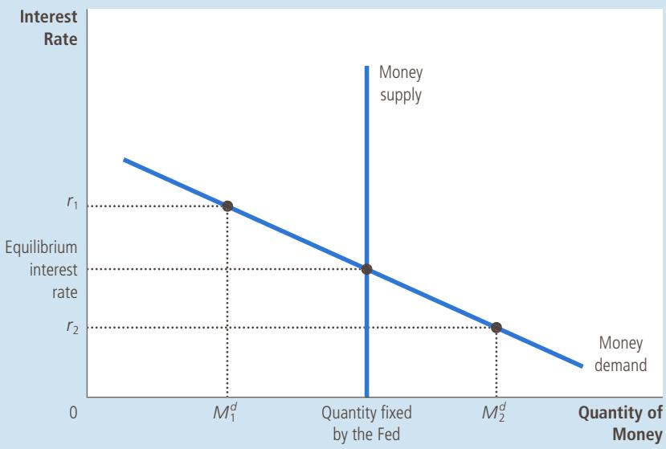
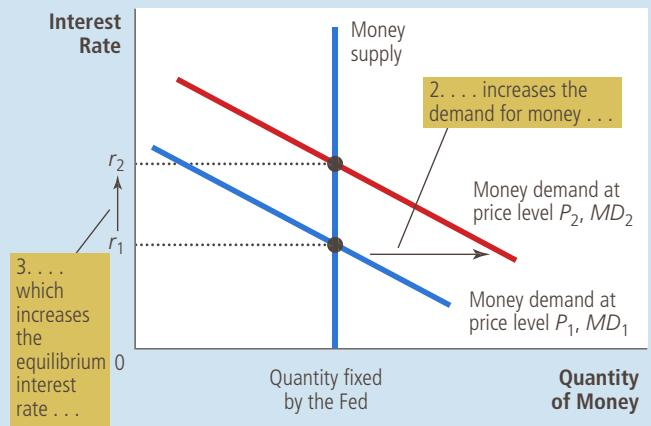
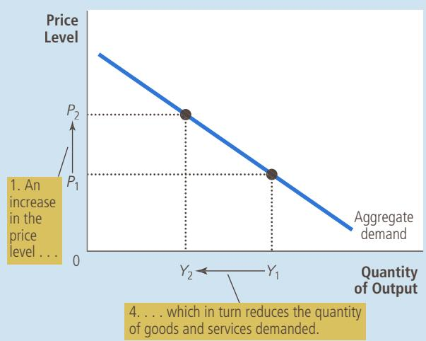
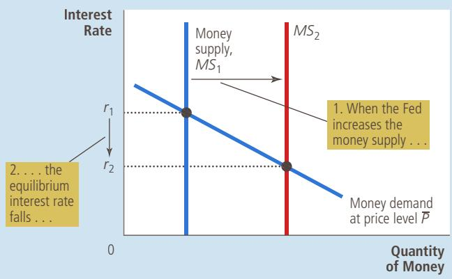
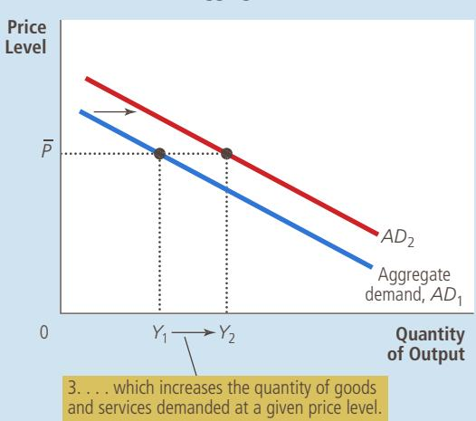
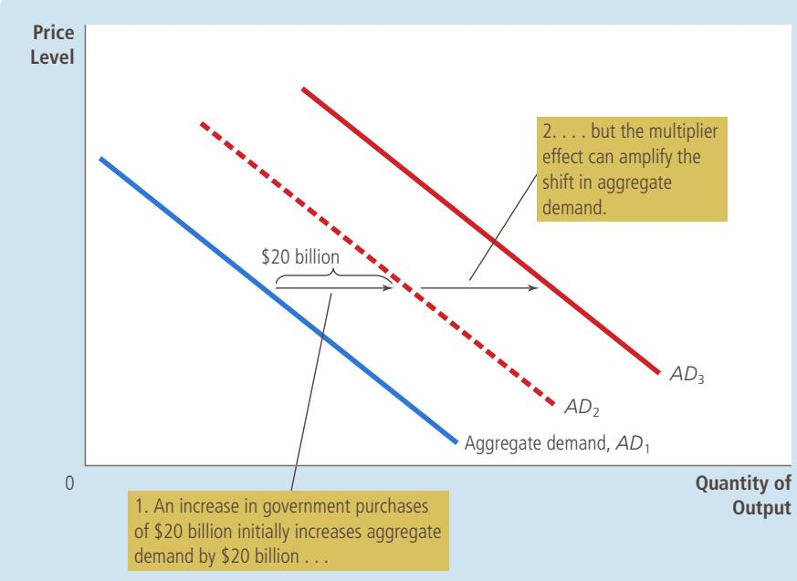

# The Influence of Monetary and Fiscal Policy on Aggregate Demand

CHAPTER

21

magine that you are a member of the Federal Open Market Committee, the group at the Federal Reserve that sets monetary policy. You observe that the president and Congress have agreed to raise taxes. How should the Fed respond to this change in fiscal policy? Should it expand the money supply, contract the money supply, or leave it unchanged?

To answer this question, you need to consider the impact of monetary and fiscal policy on the economy. In the preceding chapter, we used the model of aggregate demand and aggregate supply to explain short-run economic fluctuations. We saw that shifts in the aggregate-demand curve or the aggregatesupply curve cause fluctuations in the economy’s overall output of goods and services and its overall level of prices. As we noted in the previous chapter, both monetary and fiscal policy influence aggregate demand. Thus, a change in one of these policies can lead to short-run fluctuations in output and prices. Policymakers will want to anticipate this effect and, perhaps, adjust the other policy in response.

In this chapter, we examine in more detail how the government’s policy tools influence the position of the aggregate-demand curve. These tools include monetary policy (the supply of money set by the central bank) and fiscal policy (the levels of government spending and taxation set by the president and Congress). We have previously discussed the long-run effects of these policies. In Chapters 12 and 13, we saw how fiscal policy affects saving, investment, and long-run economic growth. In Chapters 16 and 17, we saw how monetary policy influences the price level in the long run. We now look at how these policy tools can shift the aggregate-demand curve and thereby affect macroeconomic variables in the short run.

As we have already learned, many factors influence aggregate demand besides monetary and fiscal policy. In particular, desired spending by households and firms determines the overall demand for goods and services. When desired spending changes, aggregate demand shifts. If policymakers do not respond, such shifts in aggregate demand cause short-run fluctuations in output and employment. As a result, monetary and fiscal policymakers sometimes use the policy levers at their disposal to try to offset these shifts in aggregate demand and stabilize the economy. Here we discuss the theory behind these policy actions and some of the difficulties that arise in using this theory in practice.

## 21-1 How Monetary Policy Influences Aggregate Demand

The aggregate-demand curve shows the total quantity of goods and services demanded in the economy for any price level. The preceding chapter discussed three reasons why the aggregate-demand curve slopes downward:

The wealth effect: A lower price level raises the real value of households money holdings, which are part of their wealth. Higher real wealth stimulates consumer spending and thus increases the quantity of goods and services demanded.

•	 The interest-rate effect: A lower price level reduces the amount of money people want to hold. As people try to lend out their excess money holdings, the interest rate falls. The lower interest rate stimulates investment spending and thus increases the quantity of goods and services demanded.

The exchange-rate effect: When a lower price level reduces the interest rate, investors move some of their funds overseas in search of higher returns. This movement of funds causes the real value of the domestic currency to fall in the market for foreign-currency exchange. Domestic goods become less expensive relative to foreign goods. This change in the real exchange rate stimulates spending on net exports and thus increases the quantity of goods and services demanded.

These three effects occur simultaneously to increase the quantity of goods and services demanded when the price level falls and to decrease it when the price level rises.

Although all three effects work together to explain the downward slope of the aggregate-demand curve, they are not of equal importance. Because money holdings are a small part of household wealth, the wealth effect is the least important of the three. In addition, because exports and imports represent only a small fraction of U.S. GDP, the exchange-rate effect is not large for the U.S. economy. (This effect is more important for smaller countries, which typically export and import a higher fraction of their GDP.) For the U.S. economy, the most important reason for the downward slope of the aggregate-demand curve is the interest-rate effect.

To better understand aggregate demand, we now examine the short-run determination of interest rates in more detail. Here we develop the theory of liquidity preference. This theory of interest rates helps explain the downward slope of the aggregate-demand curve, as well as how monetary and fiscal policy can shift this curve. By shedding new light on aggregate demand, the theory of liquidity preference expands our understanding of what causes short-run economic fluctuations and what policymakers can potentially do about them.

## 21-1a The Theory of Liquidity Preference

In his classic book The General Theory of Employment, Interest, and Money, John Maynard Keynes proposed the theory of liquidity preference to explain the factors that determine an economy’s interest rate. The theory is, in essence, an application of supply and demand. According to Keynes, the interest rate adjusts to balance the supply of and demand for money.

You may recall that economists distinguish between two interest rates: The nominal interest rate is the interest rate as usually reported, and the real interest rate is the interest rate corrected for the effects of inflation. When there is no inflation, the two rates are the same. But when borrowers and lenders expect prices to rise over the course of the loan, they agree to a nominal interest rate that exceeds the real interest rate by the expected rate of inflation. The higher nominal interest rate compensates for the fact that they expect the loan to be repaid in less valuable dollars.

Which interest rate are we now trying to explain with the theory of liquidity preference? The answer is both. In the analysis that follows, we hold constant the expected rate of inflation. This assumption is reasonable for studying the economy in the short run, because expected inflation is typically stable over short periods of time. In this case, nominal and real interest rates differ by a constant. When the nominal interest rate rises or falls, the real interest rate that people expect to earn rises or falls by a similar amount. For the rest of this chapter, when we discuss changes in the interest rate, these changes refer to both the real and nominal interest rates.

Let’s now develop the theory of liquidity preference by considering the supply and demand for money and how each depends on the interest rate.

Money Supply The first piece of the theory of liquidity preference is the supply of money. As we first discussed in Chapter 16, the money supply in the U.S. economy is controlled by the Federal Reserve. The Fed alters the money supply primarily by changing the quantity of reserves in the banking system through the purchase and sale of government bonds in open-market operations. When the Fed buys government bonds, the dollars it pays for the bonds are typically deposited in banks, and these dollars are added to bank reserves. When the Fed sells government bonds, the dollars it receives for the bonds are withdrawn from the banking system, and bank reserves fall. These changes in bank reserves, in turn, lead to changes in banks’ ability to make loans and create money. Thus, by buying and selling bonds in open-market operations, the Fed alters the supply of money in the economy.

In addition to open-market operations, the Fed can influence the money supply using a variety of other tools. One option is for the Fed to change how much it lends to banks. For example, a decrease in the discount rate (the interest rate at which banks can borrow reserves from the Fed) encourages more bank borrowing, which increases bank reserves and thereby the money supply. Conversely, an increase in the discount rate discourages bank borrowing, which decreases bank reserves and the money supply. The Fed also alters the money supply by changing reserve requirements (the amount of reserves banks must hold against deposits) and by changing the interest rate it pays banks on the reserves they are holding.

These details of monetary control are important for the implementation of Fed policy, but they are not crucial for the analysis in this chapter. Our goal here is to examine how changes in the money supply affect the aggregate demand for goods and services. For this purpose, we can ignore the details of how Fed policy is implemented and assume that the Fed controls the money supply directly. In other words, the quantity of money supplied in the economy is fixed at whatever level the Fed decides to set it.

Because the quantity of money supplied is fixed by Fed policy, it does not depend on other economic variables. In particular, it does not depend on the interest rate. Once the Fed has made its policy decision, the quantity of money supplied is the same, regardless of the prevailing interest rate. We represent a fixed money supply with a vertical supply curve, as in Figure 1.

## FIGURE 1

According to the theory of liquidity preference, the interest rate adjusts to bring the quantity of money supplied and the quantity of money demanded into balance. If the interest rate is above the equilibrium level (such as at $r _ { 1 } ) ,$ the quantity of money people want to hold (Md) is less than the quantity the Fed has created, and this surplus of money puts downward pressure on the interest rate. Conversely, if the interest rate is below the equilibrium level (such as at r2), the quantity of money people want to hold (Md2) is greater than the quantity the Fed has created, and this shortage of money puts upward pressure on the interest rate. Thus, the forces of supply and demand in the market for money push the interest rate toward the equilibrium interest rate, at which people are content holding the quantity of money the Fed has created.

Money Demand The second piece of the theory of liquidity preference is the demand for money. As a starting point for understanding money demand, recall that an asset’s liquidity refers to the ease with which that asset can be converted into the economy’s medium of exchange. Because money is the economy’s medium of exchange, it is by definition the most liquid asset available. The liquidity of money explains the demand for it: People choose to hold money instead of other assets that offer higher rates of return because money can be used to buy goods and services.

Although many factors determine the quantity of money demanded, the one emphasized by the theory of liquidity preference is the interest rate. The reason is that the interest rate is the opportunity cost of holding money. That is, when you hold wealth as cash in your wallet, instead of as an interest-bearing bond, you lose the interest you could have earned. An increase in the interest rate raises the cost of holding money and, as a result, reduces the quantity of money demanded. A decrease in the interest rate reduces the cost of holding money and raises the quantity demanded. Thus, as shown in Figure 1, the money demand curve slopes downward.

Equilibrium in the Money Market According to the theory of liquidity preference, the interest rate adjusts to balance the supply and demand for money. There is one interest rate, called the equilibrium interest rate, at which the quantity of money demanded exactly balances the quantity of money supplied. If the interest rate is at any other level, people will try to adjust their portfolios of assets and, as a result, drive the interest rate toward the equilibrium.

For example, suppose that the interest rate is above the equilibrium level, such as $r _ { 1 }$ in Figure 1. In this case, the quantity of money that people want to hold, $M _ { 1 } ^ { d } ,$ is less than the quantity of money that the Fed has supplied. Those people who are holding the surplus of money will try to get rid of it by buying interest- bearing bonds or by depositing it in interest-bearing bank accounts. Because bond issuers and banks prefer to pay lower interest rates, they respond to this surplus of money by lowering the interest rates they offer. As the interest rate falls, people become more willing to hold money until, at the equilibrium interest rate, people are happy to hold exactly the amount of money the Fed has supplied.

Conversely, at interest rates below the equilibrium level, such as $r _ { 2 }$ in Figure 1, the quantity of money that people want to hold, Md, is greater than the quantity of money that the Fed has supplied. As a result, people try to increase their holdings of money by reducing their holdings of bonds and other interest-bearing assets. As people cut back on their holdings of bonds, bond issuers find that they have to offer higher interest rates to attract buyers. Thus, the interest rate rises until it reaches the equilibrium level.

## 21-1b The Downward Slope of the Aggregate-Demand Curve

Having seen how the theory of liquidity preference explains the economy’s equilibrium interest rate, we now consider the theory’s implications for the aggregate demand for goods and services. As a warm-up exercise, let’s begin by using the theory to reexamine a topic we already understand—the interest-rate effect and  the downward slope of the aggregate-demand curve. In particular, suppose that the overall level of prices in the economy rises. What happens to the interest rate that balances the supply and demand for money, and how does that change affect the quantity of goods and services demanded?

As we discussed in Chapter 17, the price level is one determinant of the quantity of money demanded. At higher prices, more money is exchanged every time a good or service is sold. As a result, people will choose to hold a larger quantity of money. That is, a higher price level increases the quantity of money demanded for any given interest rate. Thus, an increase in the price level from $P _ { 1 }$ to $P _ { 2 }$ shifts the money demand curve to the right from $M D _ { 1 }$ to $M D _ { 2 } ,$ as shown in panel (a) of Figure 2.

Notice how this shift in money demand affects the equilibrium in the money market. For a fixed money supply, the interest rate must rise to balance money supply and money demand. Because the higher price level has increased the amount of money people want to hold, it has shifted the money demand curve to the right. Yet the quantity of money supplied is unchanged, so the interest rate must rise from $r _ { 1 }$ to $r _ { 2 }$ to discourage the additional demand.

This increase in the interest rate has ramifications not only for the money market but also for the quantity of goods and services demanded, as shown in panel (b). At

## FYI

## Interest Rates in the Long Run and the Short Run

n an earlier chapter, we said that the interest rate adjusts to balance the supply of loanable funds (national saving) and the demand for loanable funds (desired investment). Here we just said that the interest rate adjusts to balance the supply of and demand for money. Can we reconcile these two theories?

To answer this question, we need to focus on three macroeconomic variables: the economy’s output of goods and services, the interest rate, and the price level. According to the classical macroeconomic theory we developed earlier in the book, these variables are determined as follows:

1. Output is determined by the supplies of capital and labor and the available production technology for turning capital and labor into output. (We call this the natural level of output.)

in turn, affect the aggregate demand for goods and services. As aggregate demand fluctuates, the economy’s output of goods and services

2. For any given level of output, the interest rate adjusts to balance the supply and demand for loanable funds.

These are three of the essential propositions of classical economic theory. Most economists believe that these propositions do a good job of describing how the economy works in the long run.

3. Given output and the interest rate, the price level adjusts to balance the supply and demand for money. Changes in the supply of money lead to proportionate changes in the price level.

Yet these propositions do not hold in the short run. As we discussed in the preceding chapter, many prices are slow to adjust to changes in the money supply; this fact is reflected in a short-run aggregate-supply curve that is upward-sloping rather than vertical. As a result, in the short run, the overall price level cannot, by itself, move to balance the supply of and demand for money. This stickiness of the price level requires the interest rate to move to bring the money market into equilibrium. These changes in the interest rate, moves away from the level determined by factor supplies and technology.

To think about the operation of the economy in the short run (day to day, week to week, month to month, or quarter to quarter), it is best to keep in mind the following logic:

1. The price level is stuck at some level (based on previously formed expectations) and, in the short run, is relatively unresponsive to changing economic conditions.

2. For any given (stuck) price level, the interest rate adjusts to balance the supply of and demand for money.

3. The interest rate that balances the money market inuences the quantity of goods and services demanded and thus the level of output.

Notice that this precisely reverses the order of analysis used to study the economy in the long run.

The two different theories of the interest rate are useful for different purposes. When thinking about the long-run determinants of the interest rate, it is best to keep in mind the loanable-funds theory, which highlights the importance of an economy’s saving propensities and investment opportunities. By contrast, when thinking about the short-run determinants of the interest rate, it is best to keep in mind the liquidity-preference theory, which highlights the importance of monetary policy. ■

An increase in the price level from $P _ { 1 }$ to $P _ { 2 }$ shifts the money demand curve to the right, as in panel (a). This increase in money demand causes the interest rate to rise from $r _ { 1 }$ to $r _ { 2 } .$ Because the interest rate is the cost of borrowing, the increase in the interest rate reduces the quantity of goods and services demanded from $Y _ { 1 }$ to $Y _ { 2 } .$ This negative relationship between the price level and quantity demanded is represented with a downward-sloping aggregate-demand curve, as in panel (b).

(a) The Money Market  
  
The Money Market and the Slope of the Aggregate-Demand Curve

## FIGURE 2

(b) The Aggregate-Demand Curve  

a higher interest rate, the cost of borrowing and the return to saving are greater. Fewer households choose to borrow to buy a new house, and those who do buy smaller houses, so the demand for residential investment falls. Fewer firms choose to borrow to build new factories and buy new equipment, so business investment falls. Thus, when the price level rises from $P _ { 1 }$ to ${ \bar { P } } _ { 2 } ,$ , increasing money demand from $M D _ { 1 }$ to $M D _ { 2 }$ and raising the interest rate from $r _ { 1 }$ to $r _ { 2 } ,$ the quantity of goods and services demanded falls from $Y _ { 1 }$ to $Y _ { 2 }$

This analysis of the interest-rate effect can be summarized in three steps: (1) A higher price level raises money demand. (2) Higher money demand leads to a higher interest rate. (3) A higher interest rate reduces the quantity of goods and services demanded. The same logic works for a decline in the price level: A lower price level reduces money demand, which leads to a lower interest rate, and this in turn increases the quantity of goods and services demanded. The result of this analysis is a negative relationship between the price level and the quantity of goods and services demanded, as illustrated by a downward-sloping aggregate-demand curve.

## 21-1c Changes in the Money Supply

So far, we have used the theory of liquidity preference to explain more fully how the total quantity of goods and services demanded in the economy changes as the price level changes. That is, we have examined movements along a downward-sloping aggregate-demand curve. The theory also sheds light, however, on some of the other events that alter the quantity of goods and services demanded. Whenever the quantity of goods and services demanded changes $f o r$ any given price level, the aggregate-demand curve shifts.

One important variable that shifts the aggregate-demand curve is monetary policy. To see how monetary policy affects the economy in the short run, suppose that the Fed increases the money supply by buying government bonds in open-market operations. (Why the Fed might do this will become clear later, after we understand the effects of such a move.) Let’s consider how this monetary injection influences the equilibrium interest rate for a given price level. This will tell us what the injection does to the position of the aggregate-demand curve.

As panel (a) of Figure 3 shows, an increase in the money supply shifts the money supply curve to the right from $M S _ { 1 }$ to $M S _ { 2 }$ . Because the money demand curve has not changed, the interest rate falls from $r _ { 1 }$ to $r _ { 2 }$ to balance money supply and money demand. That is, the interest rate must fall to induce people to hold the additional money the Fed has created, restoring equilibrium in the money market.

Once again, the interest rate influences the quantity of goods and services demanded, as shown in panel (b) of Figure 3. The lower interest rate reduces the cost of borrowing and the return to saving. Households spend more on new homes, stimulating the demand for residential investment. Firms spend more on new factories and new equipment, stimulating business investment. As a result, the quantity of goods and services demanded at a given price level, ${ \overline { { P } } } ,$ rises from $Y _ { 1 }$ to $Y _ { 2 }$ . Of course, there is nothing special about ${ \overline { { P } } } ;$ The monetary injection raises the quantity of goods and services demanded at every price level. Thus, the entire aggregate-demand curve shifts to the right.

To sum up: When the Fed increases the money supply, it lowers the interest rate and increases the quantity of goods and services demanded for any given price level, shifting the aggregate-demand curve to the right. Conversely, when the Fed contracts the money supply, it raises the interest rate and reduces the quantity of goods and services demanded for any given price level, shifting the aggregate-demand curve to the left.

## FIGURE 3

A Monetary Injection

In panel (a), an increase in the money supply from $M S _ { 1 }$ to $M S _ { 2 }$ reduces the equilibrium interest rate from $r _ { 1 }$ to $r _ { 2 } .$ Because the interest rate is the cost of borrowing, the fall in the interest rate raises the quantity of goods and services demanded at a given price level from $Y _ { 1 }$ to $Y _ { 2 }$ . Thus, in panel (b), the aggregate-demand curve shifts to the right from $A D _ { 1 }$ to $A D _ { 2 } .$

(b) The Aggregate-Demand Curve  

## 21-1d The Role of Interest-Rate Targets in Fed Policy

How does the Federal Reserve affect the economy? Our discussion here and earlier in the book has treated the money supply as the Fed’s policy instrument. When the Fed buys government bonds in open-market operations, it increases the money supply and expands aggregate demand. When the Fed sells government bonds in open-market operations, it decreases the money supply and contracts aggregate demand.

Discussions of Fed policy often treat the interest rate, rather than the money supply, as the Fed’s policy instrument. Indeed, in recent years, the Federal Reserve has conducted policy by setting a target for the federal funds rate—the interest rate that banks charge one another for short-term loans. This target is reevaluated every six weeks at meetings of the Federal Open Market Committee (FOMC). The FOMC has chosen to set a target for the federal funds rate, rather than for the money supply, as it did at times in the past.

There are several related reasons for the Fed’s decision to use the federal funds rate as its target. One is that the money supply is hard to measure with sufficient precision. Another is that money demand fluctuates over time. For any given money supply, fluctuations in money demand would lead to fluctuations in interest rates, aggregate demand, and output. By contrast, when the Fed announces a target for the federal funds rate, it essentially accommodates the day-to-day shifts in money demand by adjusting the money supply accordingly.

The Fed’s decision to target an interest rate does not fundamentally alter our analysis of monetary policy. The theory of liquidity preference illustrates an important principle: Monetary policy can be described either in terms of the money supply or in terms of the interest rate. When the FOMC sets a target for the federal funds rate of, say, 6 percent, the Fed’s bond traders are told: “Conduct whatever open-market operations are necessary to ensure that the equilibrium interest rate is 6 percent.” In other words, when the Fed sets a target for the interest rate, it commits itself to adjusting the money supply to make the equilibrium in the money market hit that target.

As a result, changes in monetary policy can be viewed either in terms of changing the interest rate target or in terms of changing the money supply. When you read in the newspaper that “the Fed has lowered the federal funds rate from 6 to 5 percent,” you should understand that this occurs only because the Fed’s bond traders are doing what it takes to make it happen. To lower the federal funds rate, the Fed’s bond traders buy government bonds, and this purchase increases the money supply and lowers the equilibrium interest rate (just as in Figure 3). Similarly, when the FOMC raises the target for the federal funds rate, the bond traders sell government bonds, and this sale decreases the money supply and raises the equilibrium interest rate.

The lessons from this analysis are simple: Changes in monetary policy aimed at expanding aggregate demand can be described either as increasing the money supply or as lowering the interest rate. Changes in monetary policy aimed at contracting aggregate demand can be described either as decreasing the money supply or as raising the interest rate.

## WHY THE FED WATCHES THE STOCK MARKET (AND VICE VERSA)

STUDY So quipped Paul Samuelson, the famed economist (and textbook author). Samuelson was right that the stock market is highly volatile and can give wrong signals about the economy. But fluctuations in stock prices are often a sign of broader economic developments. The economic boom of the 1990s, for example, appeared not only in rapid GDP growth and falling unemployment but also in rising stock prices, which increased about fourfold during this decade.

Similarly, the deep recession of 2008 and 2009 was reflected in falling stock prices: From November 2007 to March 2009, the stock market lost about half its value.

How should the Fed respond to stock market fluctuations? The Fed has no reason to care about stock prices in themselves, but it does have the job of monitoring and responding to developments in the overall economy, and the stock market is a piece of that puzzle. When the stock market booms, households become wealthier, and this increased wealth stimulates consumer spending. In addition, a rise in stock prices makes it more attractive for firms to sell new shares of stock, and this stimulates investment spending. For both reasons, a booming stock market expands the aggregate demand for goods and services.

As we discuss more fully later in the chapter, one of the Fed’s goals is to stabilize aggregate demand, because greater stability in aggregate demand means greater stability in output and the price level. To promote stability, the Fed might respond to a stock market boom by keeping the money supply lower and interest rates higher than it otherwise would. The contractionary effects of higher interest rates would offset the expansionary effects of higher stock prices. In fact, this analysis does describe Fed behavior: Real interest rates were kept high by historical standards during the stock market boom of the late 1990s.

The opposite occurs when the stock market falls. Spending on consumption and investment tends to decline, depressing aggregate demand and pushing the economy toward recession. To stabilize aggregate demand, the Fed would increase the money supply and lower interest rates. And indeed, that is what it typically does. For example, on October 19, 1987, the stock market fell by 22.6 percent—one of the biggest one-day drops in history. The Fed responded to the market crash by increasing the money supply and lowering interest rates. The federal funds rate fell from 7.7 percent at the beginning of October to 6.6 percent at the end of the month. In part because of the Fed’s quick action, the economy avoided a recession. Similarly, as we discussed in a case study in the preceding chapter, the Fed also reduced interest rates during the economic downturn and stock market decline of 2008 and 2009, but this time monetary policy was not sufficient to avert a deep recession.

While the Fed keeps an eye on the stock market, stock market participants also keep an eye on the Fed. Because the Fed can influence interest rates and economic activity, it can alter the value of stocks. For example, when the Fed raises interest rates by reducing the money supply, it makes owning stocks less attractive for two reasons. First, a higher interest rate means that bonds, the alternative to stocks, are earning a higher return. Second, the Fed’s tightening of monetary policy reduces the demand for goods and services, which reduces profits. As a result, stock prices often fall when the Fed raises interest rates.

Use the theory of liquidity preference to explain how a decrease in the QuickQuiz money supply affects the equilibrium interest rate. How does this change in monetary policy affect the aggregate-demand curve?

## 21-1e The Zero Lower Bound

As we have just seen, monetary policy works through interest rates. This conclusion raises a question: What if the Fed’s target interest rate has fallen as far as it can? In the recession of 2008 and 2009, the federal funds rate fell to about zero. In this situation, what, if anything, can monetary policy do to stimulate the economy?

Some economists describe this situation as a liquidity trap. According to the theory of liquidity preference, expansionary monetary policy works by reducing interest rates and stimulating investment spending. But if interest rates have already fallen to around zero, monetary policy may no longer be effective. Nominal interest rates cannot fall much below zero: Rather than making a loan at a negative nominal interest rate, a person would just hold cash. In this environment, expansionary monetary policy raises the supply of money, making the public’s asset portfolio more liquid, but because interest rates can’t fall any further, the extra liquidity might not have any effect. Aggregate demand, production, and employment may be “trapped” at low levels.

Other economists are skeptical about the relevance of liquidity traps and believe that a central bank continues to have tools to expand the economy, even after its interest rate target hits its lower bound of zero. One possibility is that the central bank could commit itself to keeping interest rates low for an extended period of time. Such a policy is sometimes called forward guidance. Even if the central bank’s current target for the interest rate cannot fall any further, the promise that interest rates will remain low may help stimulate investment spending.

A second possibility is that the central bank could conduct expansionary open-market operations with a larger variety of financial instruments. Normally, the Fed conducts expansionary open-market operations by buying short-term government bonds. But it could also buy mortgages, corporate debt, and longer-term government bonds and thereby lower the interest rates on these kinds of loans. The Federal Reserve actively pursued this last option in the aftermath of the financial crisis of 2008 and 2009. This type of unconventional monetary policy is sometimes called quantitative easing because it increases the quantity of bank reserves.

Some economists have suggested that the possibility of hitting the zero lower bound for interest rates justifies setting the target rate of inflation well above zero. Under zero inflation, the real interest rate, like the nominal interest, can never fall below zero. But if the normal rate of inflation is, say, 4 percent, then the central bank can easily push the real interest rate to negative 4 percent by lowering the nominal interest rate toward zero. Thus, moderate inflation gives monetary policymakers more room to stimulate the economy when needed, reducing the risk of hitting the zero lower bound and having the economy fall into a liquidity trap.

## 21-2 How Fiscal Policy Influences Aggregate Demand

The government can influence the behavior of the economy not only with monetary policy but also with fiscal policy. Fiscal policy refers to the government’s choices regarding the overall level of government purchases and taxes. Earlier in the book, we examined how fiscal policy influences saving, investment, and growth in the long run. In the short run, however, the primary effect of fiscal policy is on the aggregate demand for goods and services.

fiscal policy the setting of the level of government spending and taxation by government policymakers

## 21-2a Changes in Government Purchases

When policymakers change the money supply or the level of taxes, they shift the aggregate-demand curve indirectly by influencing the spending decisions of firms or households. By contrast, when the government alters its own purchases of goods and services, it shifts the aggregate-demand curve directly.

Suppose, for instance, that the U.S. Department of Defense places a \$20 billion order for new fighter planes with Boeing, the large aircraft manufacturer. This order raises the demand for the output produced by Boeing, which induces the company to hire more workers and increase production. Because Boeing is part of the economy, the increase in the demand for Boeing planes means an increase in the total quantity of goods and services demanded at each price level. As a result, the aggregate-demand curve shifts to the right.

By how much does this \$20 billion order from the government shift the aggregate-demand curve? At first, one might guess that the aggregate-demand curve shifts to the right by exactly \$20 billion. It turns out, however, that this is not the case. There are two macroeconomic effects that cause the size of the shift in aggregate demand to differ from the change in government purchases. The first— the multiplier effect—suggests the shift in aggregate demand could be larger than \$20 billion. The second—the crowding-out effect—suggests the shift in aggregate demand could be smaller than \$20 billion. We now discuss these two effects in turn.

## 21-2b The Multiplier Effect

When the government buys \$20 billion of goods from Boeing, that purchase has repercussions. The immediate impact of the higher demand from the government is to raise employment and profits at Boeing. Then, as the workers see higher earnings and the firm owners see higher profits, they respond to this increase in income by raising their own spending on consumer goods. As a result, the government purchase from Boeing raises the demand for the products of many other firms in the economy. Because each dollar spent by the government can raise the aggregate demand for goods and services by more than a dollar, government purchases are said to have a multiplier effect on aggregate demand.

multiplier effect the additional shifts in aggregate demand that result when expansionary fiscal policy increases income and thereby increases consumer spending

This multiplier effect continues even after this first round. When consumer spending rises, the firms that produce these consumer goods hire more people and experience higher profits. Higher earnings and profits stimulate consumer spending once again and so on. Thus, there is positive feedback as higher demand leads to higher income, which in turn leads to even higher demand. Once all these effects are added together, the total impact on the quantity of goods and services demanded can be much larger than the initial impulse from higher government spending.

Figure 4 illustrates the multiplier effect. The increase in government purchases of \$20 billion initially shifts the aggregate-demand curve to the right from $A D _ { 1 }$ to $A D _ { 2 }$ by exactly \$20 billion. But when consumers respond by increasing their spending, the aggregate-demand curve shifts still further to $A \dot { D _ { 3 } }$

This multiplier effect arising from the response of consumer spending can be strengthened by the response of investment to higher levels of demand. For instance, Boeing might respond to the higher demand for planes by deciding to buy more equipment or build another plant. In this case, higher government demand spurs higher demand for investment goods. This positive feedback from demand to investment is sometimes called the investment accelerator.

## 21-2c A Formula for the Spending Multiplier

Some simple algebra permits us to derive a formula for the size of the multiplier effect that arises when an increase in government purchases induces increases in consumer spending. An important number in this formula is the marginal propensity to consume (MPC)—the fraction of extra income that a household consumes rather than saves. For example, suppose that the marginal propensity to consume is ¾. This means that for every extra dollar that a household earns, the household

## FIGURE 4

## The Multiplier Effect

An increase in government purchases of \$20 billion can shift the aggregatedemand curve to the right by more than \$20 billion. This multiplier effect arises because increases in aggregate income stimulate additional spending by consumers.

spends \$0.75 (¾ of the dollar) and saves \$0.25. With an MPC of ¾, when the workers and owners of Boeing earn \$20 billion from the government contract, they increase their consumer spending by $ { 3 / _ { 4 } } \times  { \$ 2 0 }$ billion, or \$15 billion.

To gauge the impact on aggregate demand of a change in government purchases, we follow the effects step-by-step. The process begins when the government spends \$20 billion, which implies that national income (earnings and profits) also rises by this amount. This increase in income in turn raises consumer spending by $M P \overset { \cdot } { C } \times \$ 320$ billion, which raises the income for the workers and owners of the firms that produce the consumption goods. This second increase in income again raises consumer spending, this time by $M P C \times ( M P C \times \$ \Phi 2 0\ b i l l i o n )$ . These feedback effects go on and on.

To find the total impact on the demand for goods and services, we add up all these effects:

$$
\begin{array}{c c} \text {Change in government purchases} = & \\ \text {First change in consumption} & = M P C \times \\ \text {Second change in consumption} & = M P C ^ {2} \times \\ \text {Third change in consumption} & = M P C ^ {3} \times \\ \bullet & \bullet \\ \bullet & \bullet \\ \bullet & \bullet \end{array}
$$

$$
\begin{array}{l} \text {Total change in demand} \\ = (1 + M P C + M P C ^ {2} + M P C ^ {3} + \dots) \times \\ 2 0 \text {billion}. \end{array}
$$

Here $\therefore \cdot \cdot ^ { \prime \prime }$ represents an infinite number of similar terms. Thus, we can write the multiplier as follows:

$$
\text {Multiplier} = 1 + M P C + M P C ^ {2} + M P C ^ {3} + \dots
$$

This multiplier tells us the demand for goods and services that each dollar of government purchases generates.

To simplify this equation for the multiplier, recall from math class that this expression is an infinite geometric series. For x between −1 and +1,

$$
1 + x + x ^ {2} + x ^ {3} + \dots = 1 / (1 - x).
$$

In our case, x = MPC. Thus,

$$
\text { Multiplier } = 1 / (1 - M P C).
$$

For example, if MPC is ¾, the multiplier is 1/(1 − ¾), which is 4. In this case, the \$20 billion of government spending generates \$80 billion of demand for goods and services.

This formula for the multiplier shows that the size of the multiplier depends on the marginal propensity to consume. While an MPC of ¾ leads to a multiplier of 4, an MPC of ½ leads to a multiplier of only 2. Thus, a larger MPC means a larger multiplier. To see why this is true, remember that the multiplier arises because higher income induces greater spending on consumption. With a larger MPC, consumption responds more to a change in income, and so the multiplier is larger.

## 21-2d Other Applications of the Multiplier Effect

Because of the multiplier effect, a dollar of government purchases can generate more than a dollar of aggregate demand. The logic of the multiplier effect, however, is not restricted to changes in government purchases. Instead, it applies to any event that alters spending on any component of GDP—consumption, investment, government purchases, or net exports.

For example, suppose that a recession overseas reduces the demand for U.S. net exports by \$10 billion. This reduced spending on U.S. goods and services depresses U.S. national income, which reduces spending by U.S. consumers. If the marginal propensity to consume is ¾ and the multiplier is 4, then the \$10 billion fall in net exports leads to a \$40 billion contraction in aggregate demand.

As another example, suppose that a stock market boom increases households’ wealth and stimulates their spending on goods and services by \$20 billion. This extra consumer spending increases national income, which in turn generates even more consumer spending. If the marginal propensity to consume is ¾ and the multiplier is 4, then the initial impulse of \$20 billion in consumer spending translates into an \$80 billion increase in aggregate demand.

The multiplier is an important concept in macroeconomics because it shows how the economy can amplify the impact of changes in spending. A small initial change in consumption, investment, government purchases, or net exports can end up having a large effect on aggregate demand and, therefore, the economy’s production of goods and services.

## 21-2e The Crowding-Out Effect

The multiplier effect seems to suggest that when the government buys \$20 billion of planes from Boeing, the resulting expansion in aggregate demand is necessarily larger than \$20 billion. Yet another effect works in the opposite direction. While an increase in government purchases stimulates the aggregate demand for goods and services, it also causes the interest rate to rise, which reduces investment spending and puts downward pressure on aggregate demand. The reduction in aggregate demand that results when a fiscal expansion raises the interest rate is called the crowding-out effect.

To see why crowding out occurs, let’s consider what happens in the money market when the government buys planes from Boeing. As we have discussed, this increase in demand raises the incomes of the workers and owners of this firm (and, because of the multiplier effect, of other firms as well). As incomes rise, households plan to buy more goods and services and, as a result, choose to hold more of their wealth in liquid form. That is, the increase in income caused by the fiscal expansion raises the demand for money.

crowding-out effect the offset in aggregate demand that results when expansionary fiscal policy raises the interest rate and thereby reduces investment spending

The effect of the increase in money demand is shown in panel (a) of Figure 5. Because the Fed has not changed the money supply, the vertical supply curve remains the same. When the higher level of income shifts the money demand curve to the right from $M D _ { 1 }$ to $M D _ { 2 } ,$ the interest rate must rise from $r _ { 1 }$ to $r _ { 2 }$ to keep supply and demand in balance.

The increase in the interest rate, in turn, reduces the quantity of goods and services demanded. In particular, because borrowing is more expensive, the demand for residential and business investment goods declines. In other words, as the increase in government purchases increases the demand for goods and services, it may also crowd out investment. This crowding-out effect partially offsets the impact of government purchases on aggregate demand, as illustrated in panel (b) of Figure 5. The increase in government purchases initially shifts the aggregate-demand curve from $A D _ { 1 }$ to $A D _ { 2 } ,$ but once crowding out takes place, the aggregate-demand curve drops back to $A D _ { 3 } .$

Panel (a) shows the money market. When the government increases its purchases of goods and services, the resulting increase in income raises the demand for money from $M D _ { 1 }$ to $M D _ { 2 } ,$ and this causes the equilibrium interest rate to rise from r to $r _ { 2 } .$ Panel (b) shows the effects on aggregate demand. The initial impact of the increase in government purchases shifts the aggregate-demand curve from $A D _ { 1 }$ to $A D _ { 2 }$ . Yet because the interest rate is the cost of borrowing, the increase in the interest rate tends to reduce the quantity of goods and services demanded, particularly for investment goods. This crowding out of investment partially offsets the impact of the fiscal expansion on aggregate demand. In the end, the aggregate-demand curve shifts only to $A D _ { 3 }$
